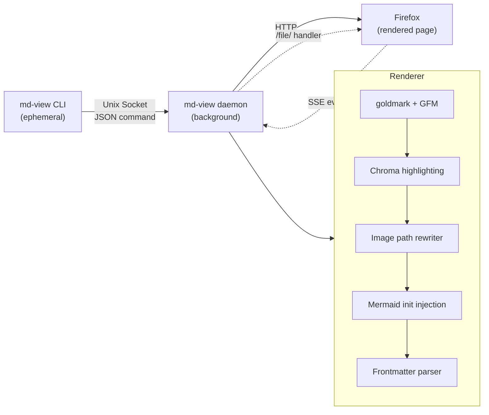

# md-view

md-view is a lightweight daemon that renders Markdown files as GitHub-flavored HTML and opens them in your browser. One command, zero config, live reload. It started as a weekend CLI tool to replace the "open README.md in a browser tab" dance and has grown into a capable renderer with syntax highlighting, mermaid diagrams, dark theme, frontmatter display, and proper image path resolution.

> [!summary]
> The project currently has three important identities:
> 1. a zero-config markdown viewer daemon with auto-start and live reload
> 2. a self-contained rendering pipeline (goldmark + Chroma + mermaid.js, all embedded in the binary)
> 3. a proper image-serving system that resolves relative paths through a `/file/` handler

## Why this project exists

Viewing markdown files in a browser should be a one-liner. The alternatives either require a running web app, manual refresh, or a heavyweight Electron wrapper. md-view gives you `md-view view file.md`, opens Firefox, and watches the file for changes. The daemon auto-starts, picks a random port, and stays out of your way until you need it again.

The project also exists because rendering markdown correctly is harder than it looks. Relative image paths break when the page URL doesn't match the file's directory. Code blocks need syntax highlighting that respects dark/light themes. Mermaid diagrams need to re-render when you toggle themes. Frontmatter needs to be parsed and displayed without leaking into the body. Each of these is a small puzzle on its own.

## Current project status

The project is stable and feature-complete for everyday use. The most recent work (ticket MD-RENDER-ENHANCE) added three rendering improvements: image path resolution, copy-to-clipboard buttons on code blocks, and mermaid diagram verification.

What works today:

- background daemon with auto-start via Unix socket protocol
- GitHub-flavored rendering (tables, task lists, strikethrough)
- syntax highlighting for 200+ languages via Chroma (server-side, no JS needed)
- mermaid diagram rendering (embedded mermaid.js, re-renders on theme toggle)
- dark/light theme toggle with persistent localStorage preference
- live reload via SSE when the watched file changes
- YAML frontmatter parsing with collapsible display
- relative image path resolution via `/file/` handler
- copy-to-clipboard button on all code blocks
- i3/Sway integration with `md-view: <filename>` window titles

## Project shape

The codebase is ~2,400 lines of Go across 15 files, organized as a standard Go CLI project.

```
cmd/md-view/        — CLI entry point
pkg/
  commands/         — Cobra/BareCommand definitions (view, serve, stop, status)
  server/           — HTTP server, Unix socket listener, SSE, /file/ handler
  renderer/         — Markdown→HTML pipeline (goldmark, Chroma, frontmatter, image rewriting)
  renderer/static/  — Embedded CSS (base, dark), JS (reload, mermaid-init, copy-button)
  daemon/           — Background daemon state (PID file, port file, socket path)
  protocol/         — Unix socket JSON protocol (view, ping, stop)
  watcher/          — Filesystem watcher for live reload
```

The binary is self-contained: CSS, JavaScript (reload script, mermaid.js, copy-button.js), and the Chroma style sheets are all embedded via `go:embed`. No external assets, no node_modules, no build step beyond `go build`.

## Architecture

The system has two processes: a short-lived CLI and a persistent daemon.



The CLI sends a `view` command over a Unix domain socket. The daemon either starts the server or uses an existing one, then opens the browser. The HTTP server renders markdown at `/render?file=<path>`, serves static assets at `/static/`, and serves images from the markdown file's directory tree at `/file/<abs-path>`. Live reload uses Server-Sent Events at `/events?file=<path>`.

## Implementation details

### Image path resolution

The core problem: the page URL is `/render?file=/abs/path/file.md`, so relative `` resolves against `/render` in the browser, producing a 404.

The solution has two parts:

1. **HTML rewriting** — after goldmark converts markdown to HTML, a regex-based post-processor (`rewriteImagePaths`) finds all `` attributes and rewrites relative paths to `/file/<absolute-path>` URLs. It skips `http://`, `https://`, `data:`, and already-rewritten `/file/` paths.

2. **Static file serving** — the `/file/` handler serves files from the filesystem with a directory allowlist. When a file is rendered, the daemon registers the file's directory and all ancestor directories as allowed. This handles `../artifacts/` references that resolve outside the immediate parent dir.

The URL format strips the leading `/` from absolute paths to avoid `//` in URLs, which triggers Go's `http.ServeMux` path-cleaning redirect (307). The handler re-adds the `/` before resolving the filesystem path.

### Copy-to-clipboard button

A pure JavaScript solution embedded as `copy-button.js`. On page load, it finds all `<pre><code>` blocks, wraps each in a positioning container, and injects a clipboard SVG icon button in the top-right corner. The button is hidden by default (opacity 0) and appears on hover. On click, `navigator.clipboard.writeText()` copies the code content and the icon switches to a checkmark for 2 seconds.

The script runs after mermaid initialization, so mermaid blocks (which get replaced with `<div class="mermaid">`) don't receive copy buttons.

### Mermaid diagram rendering

Mermaid.js is embedded in the binary and served at `/static/mermaid.min.js`. The init script (`mermaid-init.js`) detects `<code class="language-mermaid">` blocks, wraps them in `<div class="mermaid">`, and calls `mermaid.initialize()`. A MutationObserver watches for `data-theme` attribute changes on `<html>` and re-renders all diagrams with the appropriate mermaid theme (default or dark).

### Daemon protocol

The CLI communicates with the daemon over a Unix domain socket using newline-delimited JSON. Commands: `view` (open a file), `ping` (health check), `stop` (graceful shutdown). The daemon writes its PID and port to XDG state directories so the CLI can discover it.

### Rendering pipeline

The renderer uses goldmark with the GFM extension and Chroma syntax highlighting (github style for light, dracula for dark). Both Chroma CSS outputs are included in every page — the dark rules are prefixed with `[data-theme="dark"]` so the toggle works without a page reload. Frontmatter is parsed separately with a simple YAML key-value parser and rendered as a collapsible `<details>` block.

## Current user-facing commands

| Command | What it does |
|---------|-------------|
| `md-view view <FILE>` | Render a markdown file in the browser |
| `md-view serve` | Start the server in foreground (debugging) |
| `md-view status` | Show daemon PID, port, uptime |
| `md-view stop` | Stop the daemon |

Key flags: `--dark` for dark theme, `--browser` to override the browser command, `--port` to bind a specific port.

## Important project docs

- Ticket MD-RENDER-ENHANCE: design doc for image resolution, copy button, mermaid verification
- Ticket MD-SERVER: original markdown viewer webserver design
- Ticket MD-VIEW-BARE: BareCommand conversion and i3 integration
- `docs/getting-started.md` — install and first use
- `docs/user-guide.md` — all commands, flags, troubleshooting

## Open questions

- Should the `/file/` handler be more restrictive? Currently it allows any file under any ancestor directory of a rendered markdown file. For a local-only tool this is fine, but it could be tightened if the server were ever exposed on a network.
- Should mermaid error messages be rendered inline (visible in the page) rather than just logged to the console?
- Should there be a `--width` flag to control the max-width of the rendered content?

## Near-term next steps

- Test with more complex markdown: nested tables, HTML inline, footnotes
- Add a `--port` flag to `view` command for specifying a preferred port
- Consider adding a file browser index page when the daemon is running
- Explore PDF export via headless browser

## Project working rule

md-view is a local tool for local files. It should never require a network connection, a running Node.js process, or a build step beyond `go build`. Every rendering feature must work offline with assets embedded in the binary.
