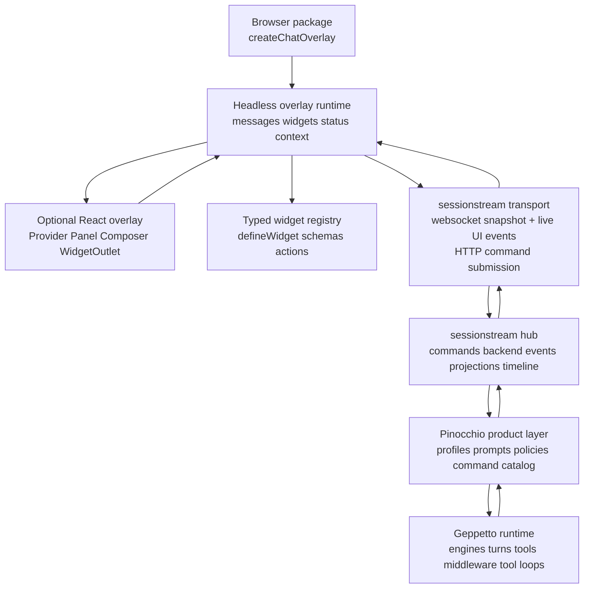
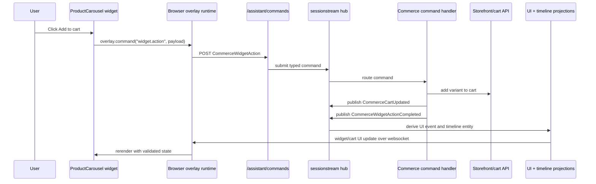

# Chat Overlay API: Sessionstream Widget Runtime Deep Dive

This is the chat/widget runtime branch of the [[go-go-os]] project map.

This article turns two proposed ecommerce chat-overlay API sketches into a concrete architecture for a reusable React and plain JavaScript package. The core result is a small browser API backed by `sessionstream` hydration, a typed widget registry, and a product-owned Geppetto/Pinocchio agent layer. The article is written as a technical deep dive rather than as an implementation diary: it explains the design decisions, the repo evidence that supports them, the API boundaries, and the first implementation sequence.

> [!summary]
> - The browser package should be a headless session runtime plus an optional React overlay. React is one consumer of the runtime, not the owner of the architecture.
> - Generative UI should be expressed as durable typed widget instances, not model-generated JSX and not ad-hoc JSON interpreted by the frontend.
> - `sessionstream` should remain the source of truth for commands, canonical backend events, UI projections, timeline entities, snapshots, and reconnect behavior.
> - Geppetto should run inference and tool loops, Pinocchio should resolve product configuration and profiles, and the new overlay package should own only browser runtime, registry, rendering, and user interaction concerns.

## Why this note exists

The two supplied proposals converge on the same design but name the package and surface differently. One proposal calls the product-specific API `@golems/commerce-assistant` and starts from `createCommerceAssistant(...)`. The other proposal generalizes the package to `@go-go-golems/chat-overlay` and starts from `createChatOverlay(...)`. Both proposals make the same important architectural claim: the frontend should mount an overlay, send commands, register allowlisted widgets, and render projected session events. The frontend should not know how the LLM is configured, how tools are run, or how application events are persisted.

The local workspace already contains evidence for this direction. `sessionstream` documents a command/event/projection model where live UI events are not the source of truth and reconnects hydrate from durable timeline entities. Geppetto documents itself as the Go runtime core for provider-agnostic inference, tool loops, middleware, turns, sessions, and Goja JavaScript bindings. Pinocchio documents the configuration and profile ownership boundary for prompt applications. CoinVault contains a practical widget-projection implementation that already routes typed timeline entities into React widgets. Pinocchio and go-go-os frontend packages contain reusable renderer registries that prove the extension pattern has already appeared in nearby code.

The design question is therefore not whether a chat overlay can be written. The design question is which layer owns each contract so the resulting API stays small, typed, durable, and reusable across ecommerce sites, React applications, script-tag installs, and future non-ecommerce agents.

## The architecture in one statement

Build a headless browser runtime that connects to `sessionstream`, reduces snapshots and live UI events into chat state, validates typed widget instances against an allowlisted registry, and exposes a small overlay API. Add React components as a thin optional layer. Keep LLM execution in Geppetto, product prompt/profile/config ownership in Pinocchio, and session persistence plus hydration in `sessionstream`.



This architecture has two consequences. First, the package can expose a very small public API because the hard runtime guarantees are delegated to `sessionstream` rather than recreated in React. Second, every UI artifact that matters can survive reload and reconnect because widgets are timeline entities, not transient component calls.

## What the proposals agree on

Both proposals independently identify the same four public concepts:

| Concept | Public API name | Responsibility |
|---|---|---|
| Overlay runtime | `createChatOverlay(...)` or `createCommerceAssistant(...)` | Mount the browser runtime, manage open/close/send/destroy, hold message and widget state, and expose commands. |
| Transport adapter | `sessionstreamTransport(...)` or `sessionstream(...)` | Hide websocket subscribe/hydrate/live-event details and submit commands through a command endpoint. |
| Widget registry | `defineWidget(...)` | Register a frontend renderer by stable name, validate props, define widget-local actions, and reject unknown widget names. |
| Optional React layer | `ChatOverlayProvider`, `AssistantOverlay`, `WidgetOutlet`, hooks | Render the runtime through React without making React mandatory. |

The first proposal is stronger on typed ecommerce widget generation. It treats each widget as a frontend component definition, an LLM-callable tool schema, a protobuf payload schema, and a timeline payload. The second proposal is stronger on package generality. It names the package `@go-go-golems/chat-overlay`, includes script-tag and web-component installation paths, and keeps ecommerce as a preset rather than as the root package identity.

The recommended synthesis is to use the general package name and keep the ecommerce preset as an optional module:

```ts
export {
  createChatOverlay,
  sessionstreamTransport,
  defineWidget,
  defineAction,
  defineSuggestionProvider,
};

export type {
  ChatOverlay,
  ChatOverlayConfig,
  ChatTransport,
  WidgetDefinition,
  WidgetInstance,
  OverlayEvent,
};
```

```ts
import { ecommercePreset } from "@go-go-golems/chat-overlay/ecommerce";

createChatOverlay({
  ...ecommercePreset(),
  transport,
  context,
}).mount(document.body);
```

This package shape keeps the common runtime reusable while allowing the ecommerce preset to ship product-card, carousel, variant-picker, cart-preview, coupon, checkout, policy, size-guide, order-status, and handoff widgets.

## Repo evidence for the boundary

### `sessionstream` already owns session truth

The `sessionstream` README describes the exact substrate the overlay needs. It states that a UI event is live client-facing projected state and is not the source of truth (`sessionstream/README.md:168-170`). It also defines timeline entities as durable projected state that hydration stores can persist and reload. The same README says the websocket reconnect contract is snapshot-before-live: a client subscribes, the server sends the current snapshot, and then the server sends future live UI events (`sessionstream/README.md:217-232`).

The transport schema confirms this contract. `ClientFrame` currently supports subscribe, unsubscribe, ping, and pong, while `ServerFrame` carries hello, snapshot, subscribed, UI event, error, ping, and pong frames (`sessionstream/proto/sessionstream/v1/transport.proto:9-24`). A `SnapshotFrame` contains `snapshot_ordinal` and repeated `SnapshotEntity` records, while `UiEventFrame` contains `event_ordinal`, `name`, and `google.protobuf.Any payload` (`sessionstream/proto/sessionstream/v1/transport.proto:53-72`).

The overlay package should therefore not invent a separate session source of truth. It should implement a browser adapter for this contract:

```ts
type ChatTransport = {
  connect(input: {
    sessionId: string;
    onSnapshot: (snapshot: SessionSnapshot) => void;
    onEvent: (event: UIEventFrame) => void;
    onError: (error: Error) => void;
  }): Promise<ChatConnection>;

  send(command: ChatCommand): Promise<void>;
};
```

The websocket side should subscribe and hydrate. Command submission should remain HTTP/RPC unless the websocket protocol is deliberately extended, because the current `ClientFrame` shape does not include arbitrary command submission.

### `sessionstream` already enforces typed payload boundaries

The `sessionstream` schema contract is protobuf-first. The README says registered payloads must be concrete protobuf messages and explicitly rejects top-level `google.protobuf.Struct` payloads (`sessionstream/README.md:188-205`). This matters for a widget overlay because generative UI systems often drift into arbitrary JSON. Arbitrary top-level JSON weakens generated frontend code, hydration, reviewability, and schema evolution.

The correct pattern is a stable top-level event or entity message with an intentionally typed widget payload:

```proto
message WidgetInstanceUpsertedEvent {
  string instance_id = 1;
  string widget_name = 2;
  string widget_version = 3;
  string parent_message_id = 4;
  WidgetStatus status = 5;
  google.protobuf.Any props = 6;
}

message ProductCarouselProps {
  string title = 1;
  repeated ProductCardProps products = 2;
  string reason = 3;
}
```

The top-level contract remains concrete. The `props` field is open only at the deliberate widget payload boundary, and each widget props message is still concrete and code-generated.

### Geppetto should not grow overlay semantics

The Geppetto README describes Geppetto as the runtime core for provider-agnostic inference engines, tool calling, middleware composition, typed turns, sessions, profile registries, and Goja JavaScript bindings (`geppetto/README.md:10-16`). It also states: “There is no overlay abstraction in active runtime composition” and says applications own final engine configuration (`geppetto/README.md:26-29`).

This is a direct design constraint. The overlay package should not be implemented inside Geppetto. Geppetto should expose the generic runtime that the product agent uses. The product layer can call tools such as `catalog.search`, `cart.propose`, and `widget.render`, but those tool calls should publish canonical backend events into `sessionstream`; they should not return React components or overlay-specific objects.

### Pinocchio owns product configuration and profile discovery

Pinocchio documents the intended JavaScript ownership split for scripts: Pinocchio owns config, environment, default resolution, and engine-profile registry discovery, while Geppetto owns engine-profile resolution and the generic JS inference and runner API (`pinocchio/README.md:190-203`). This supports a product agent constructor in which Pinocchio decides which product profile is active and Geppetto supplies the runner and tools.

A product agent can therefore look like this:

```js
const gp = require("geppetto");
const pinocchio = require("pinocchio");
const commerce = require("commerce-assistant");

const resolved = gp.profiles.resolve({ profileSlug: "shop-assistant" });
const engine = gp.engines.fromResolvedProfile(resolved);

module.exports = commerce.createAgent({
  engine,
  runtime: gp.runner.resolveRuntime({
    systemPrompt: commerce.prompts.ecommerceConcierge(),
    toolNames: [
      "catalog.search",
      "catalog.compare",
      "cart.propose",
      "widget.render",
      "policy.lookup",
    ],
  }),
  widgets: commerce.widgets.fromManifest("./widgets.manifest.json"),
});
```

The browser package does not need access to this layer. It only observes the projected session stream and sends typed commands.

### CoinVault proves the widget-projection direction

CoinVault already contains a project-level widget projection playbook. The playbook states the core rule directly: do not make the frontend interpret raw tool results into widgets, and do not make the LLM emit final widget payloads as the primary path (`2026-03-16--gec-rag/docs/widget-projection-playbook.md:24-30`). Instead, the LLM emits a compact request, the backend parses it, deterministic lookup code expands it, and the frontend receives a ready-to-render timeline entity.

The same playbook says widget entities are large UI objects rendered through `WidgetRenderer` and lists existing widget components: CoinCardList, InventoryTable, StockAlert, ShipmentTracker, and StatsRow (`2026-03-16--gec-rag/docs/widget-projection-playbook.md:49-96`). The current frontend implementation uses a switch-based `WidgetRenderer` that dispatches on `widget.type` to typed React components (`2026-03-16--gec-rag/web/src/components/widgets/WidgetRenderer.tsx:8-15`).

The new overlay package should generalize this proven pattern. The switch should become a runtime registry, the widget props should become generated types and schemas, and the transport should use `sessionstream` snapshots and UI events rather than application-specific stream handling.

### Existing renderer registries show the extension shape

Pinocchio’s current React web chat defines `ChatWidgetRenderers` as a map from entity kind to React component and accepts renderer overrides on `ChatWidgetProps` (`pinocchio/cmd/web-chat/web/src/webchat/types.ts:74-86`). Its `rendererRegistry.ts` merges built-in renderers, extension renderers, and per-instance overrides, then supplies a default renderer (`pinocchio/cmd/web-chat/web/src/webchat/rendererRegistry.ts:12-45`).

The go-go-os frontend package has the same pattern with a little more registry lifecycle machinery. It defines a `TimelineRenderer`, a `ChatWidgetRenderers` map, registration and unregistration functions, a registry version, and listener notifications (`go-go-os-frontend/packages/os-chat/src/chat/renderers/types.ts:18-21`, `go-go-os-frontend/packages/os-chat/src/chat/renderers/rendererRegistry.ts:9-89`).

The new API should keep that extension shape but add schema validation and product-action metadata:

```ts
const productCarousel = defineWidget("commerce.product-carousel", {
  version: "1",
  description: "Show recommended products.",
  schema: z.object({
    title: z.string().optional(),
    products: z.array(productCardSchema),
    reason: z.string().optional(),
  }),
  render({ props, overlay, instance, status }) {
    return (
      <ProductCarousel
        title={props.title}
        products={props.products}
        status={status}
        onAddToCart={(product) =>
          overlay.command("widget.action", {
            widgetId: instance.id,
            action: "addToCart",
            data: { productId: product.id },
          })
        }
      />
    );
  },
});
```

## The public API should be small

The public API should fit in one code block for ordinary site integrators:

```ts
const overlay = createChatOverlay({
  app: "coinvault",
  session: {
    id: `shop:${visitor.id}:${cart.id}`,
    userId: visitor.id,
  },
  transport: sessionstreamTransport({
    url: "/assistant/ws",
    commandUrl: "/assistant/commands",
    headers: () => ({ "x-shop-id": shop.id }),
  }),
  context: {
    get: () => ({
      page: storefront.page(),
      product: storefront.currentProduct(),
      cart: storefront.cartSnapshot(),
      locale: storefront.locale(),
      currency: storefront.currency(),
    }),
  },
  widgets: [
    productCardWidget,
    productCarouselWidget,
    variantPickerWidget,
    cartPreviewWidget,
  ],
  actions: {
    addToCart: defineAction({
      input: z.object({
        variantId: z.string(),
        quantity: z.number().int().positive().default(1),
      }),
      run: async ({ variantId, quantity }) => {
        await storefront.cart.add({ variantId, quantity });
        return storefront.cartSnapshot();
      },
    }),
  },
  theme: {
    position: "bottom-right",
    brand: "Shopping assistant",
  },
});

overlay.mount(document.body);
```

The returned object should expose only the operations that an application can safely perform:

```ts
type ChatOverlay = {
  mount(target?: string | Element): void;
  unmount(): void;
  open(): void;
  close(): void;
  toggle(): void;
  send(text: string, options?: SendOptions): Promise<void>;
  command(name: string, payload?: unknown): Promise<void>;
  setContext(patch: Record<string, unknown>): void;
  registerWidget(widget: WidgetDefinition): () => void;
  hydrate(): Promise<void>;
  destroy(): void;
};
```

This is deliberately not a comprehensive LLM SDK. The browser runtime should not expose provider selection, model settings, tool-loop configuration, prompt assembly, profile registries, or backend projection rules. Those remain server-side or product-layer concerns.

## The runtime state model

The runtime reducer should have one job: combine a snapshot and subsequent live UI events into a stable local view.

```ts
type OverlayState = {
  sessionId: string;
  hydrated: boolean;
  snapshotOrdinal?: string;
  messages: Record<string, MessageState>;
  widgets: Record<string, WidgetInstance>;
  suggestions: Suggestion[];
  status: "idle" | "thinking" | "streaming" | "tool" | "error";
  errors: OverlayError[];
};
```

The reducer should consume a compact internal event union rather than exposing raw backend event names across the UI:

```ts
type OverlayEvent =
  | { type: "message.upsert"; id: string; role: Role; content?: string; ordinal: string }
  | { type: "message.patch"; id: string; textPatch: string; mode: "append" | "replace" | "snapshot"; ordinal: string }
  | { type: "widget.upsert"; id: string; widget: string; version: string; props: unknown; status: WidgetStatus; ordinal: string }
  | { type: "widget.patch"; id: string; patch: unknown; ordinal: string }
  | { type: "suggestions.set"; suggestions: Suggestion[]; ordinal?: string }
  | { type: "status.set"; status: OverlayState["status"]; ordinal?: string }
  | { type: "error"; error: OverlayError; ordinal?: string };
```

The adapter maps product-specific `sessionstream` UI event names into this event union. Product-specific backend names can remain explicit, but the overlay shell should not have one switch statement per product. That mapping should be supplied by the package preset or generated from the schema manifest.

The minimum reducer algorithm is straightforward:

```ts
function applySnapshot(state: OverlayState, snapshot: SessionSnapshot): OverlayState {
  const next = emptyState(snapshot.sessionId);
  next.hydrated = true;
  next.snapshotOrdinal = snapshot.snapshotOrdinal;

  for (const entity of sortByOrdinal(snapshot.entities)) {
    applyTimelineEntity(next, entity);
  }

  return next;
}

function applyLiveEvent(state: OverlayState, frame: UIEventFrame): OverlayState {
  const event = mapUIEvent(frame);

  if (isStale(event.ordinal, state)) {
    return state;
  }

  return reduceOverlayEvent(state, event);
}
```

The important invariant is that snapshots initialize durable state and live events update it afterward. A reconnect should not replay product logic in the browser. It should receive durable timeline state from `sessionstream`, then continue with future UI events.

## Ordinals must stay strings in JavaScript

The proposals are correct to emphasize ordinal handling. `sessionstream` documents that browser clients should treat `uint64` ordinals as protobuf JSON strings and should not coerce them through JavaScript `number` when precision matters (`sessionstream/README.md:230-232`).

This is a concrete issue in the current CoinVault web client. `WsState` stores `lastSnapshotOrdinal?: number` (`2026-03-16--gec-rag/web/src/ws/types.ts:18-21`). The protobuf helper converts a `bigint` ordinal to `Number(value)` (`2026-03-16--gec-rag/web/src/ws/protobuf.ts:86-88`). `wsManager.ts` then sends the subscribe frame using this numeric snapshot ordinal (`2026-03-16--gec-rag/web/src/ws/wsManager.ts:260-263`). That is acceptable only while ordinals stay below JavaScript's safe integer range. The reusable package should not copy this pattern.

Recommended runtime rule:

```ts
type Ordinal = string;

function compareOrdinal(a: Ordinal, b: Ordinal): -1 | 0 | 1 {
  const aa = BigInt(a);
  const bb = BigInt(b);
  return aa < bb ? -1 : aa > bb ? 1 : 0;
}
```

The public state should store ordinals as strings. Internal comparison may use `BigInt`, but the value should not be converted through `number`, and public JSON should preserve the protobuf JSON string representation.

## Widget instances are the generative UI unit

The most important design decision is that generative UI is a typed widget instance stream. The model or agent does not emit JSX. The model does not choose arbitrary component names. The frontend does not interpret arbitrary tool result JSON into UI. The backend publishes an event such as `CommerceWidgetUpserted`, the UI projection emits a `widget.upsert`, and the timeline projection stores a `WidgetInstanceEntity`.

A widget instance has a stable identity, a registered widget name, a version, a status, props, an optional parent message, and action affordances:

```ts
type WidgetInstance = {
  id: string;
  widget: string;
  version: string;
  parentMessageId?: string;
  status: "draft" | "streaming" | "ready" | "error" | "removed";
  props: unknown;
  createdOrdinal: string;
  updatedOrdinal: string;
};
```

The runtime can then instantiate a widget only when the registry knows how to validate and render it:

```ts
function renderWidget(instance: WidgetInstance, registry: WidgetRegistry) {
  const def = registry.get(instance.widget, instance.version);

  if (!def) {
    return <UnknownWidgetCard instance={instance} />;
  }

  const parsed = def.schema.safeParse(instance.props);

  if (!parsed.success) {
    return <WidgetValidationError instance={instance} error={parsed.error} />;
  }

  return def.render({
    props: parsed.data,
    instance,
    overlay: overlayHandle,
    status: instance.status,
  });
}
```

Unknown widgets should not fail silently. They should render a compact diagnostic card in development and a safe fallback in production. Silent `return null` behavior hides backend/frontend schema drift and makes hydration bugs harder to diagnose.

## Widget definitions should generate four artifacts

The two proposals both point toward generated widget catalogs. That is the correct direction because a widget definition participates in four contracts at once:

1. A frontend renderer contract.
2. An LLM-callable tool contract.
3. A protobuf payload contract.
4. A durable timeline entity contract.

The source of truth should be a widget catalog:

```ts
export const widgets = createWidgetCatalog({
  widgets: [
    productCardWidget,
    productCarouselWidget,
    variantPickerWidget,
    compareTableWidget,
    cartPreviewWidget,
  ],
});

widgets.generate({
  out: {
    proto: "proto/commerce/widgets/v1/widgets.proto",
    ts: "src/generated/widgets.ts",
    manifest: "public/widgets.manifest.json",
    tools: "agent/generated/widget-tools.js",
  },
});
```

A catalog generator should not try to infer everything from React components. React prop types are not sufficient for backend schema registration, tool descriptions, or protobuf evolution. The widget definition needs explicit names, versions, schemas, descriptions, and action definitions.

A practical first version can accept Zod schemas and generate JSON Schema plus TypeScript types. Protobuf generation may require a more constrained schema subset or explicit proto definitions for production widgets. The first implementation can support both modes:

| Mode | Source | Use case |
|---|---|---|
| Zod-first | `defineWidget(..., { schema: z.object(...) })` | Fast local development, Storybook, prototype widgets. |
| Proto-first | generated TypeScript schema from `.proto` | Production sessionstream contracts, backend/frontend codegen, strict evolution. |
| Manifest-only | JSON Schema plus renderer name | Script-tag installs and third-party renderer packages. |

The stable design rule is that the browser registry validates concrete props before rendering. The exact generator can mature over time.

## Backend commands should stay small

The overlay only needs a few command families. Product-specific commands can be layered on top, but the transport does not need a large browser-facing command taxonomy.

```ts
type ChatCommand =
  | {
      name: "chat.submit";
      sessionId: string;
      payload: { text: string; context?: unknown };
    }
  | {
      name: "chat.stop";
      sessionId: string;
      payload: { runId?: string };
    }
  | {
      name: "context.patch";
      sessionId: string;
      payload: { patch: Record<string, unknown> };
    }
  | {
      name: "widget.action";
      sessionId: string;
      payload: { widgetId: string; action: string; data?: unknown };
    }
  | {
      name: "handoff.request";
      sessionId: string;
      payload: { reason?: string };
    };
```

Ecommerce helpers can call these lower-level commands:

```ts
overlay.command("cart.add", {
  productId: "sku_123",
  variantId: "var_456",
  quantity: 1,
});

overlay.command("coupon.apply", { code: "SAVE10" });
overlay.command("checkout.start", { source: "assistant" });
```

The backend should translate these into concrete `sessionstream` command messages such as `CommerceSendMessage`, `CommerceStopRun`, `CommercePatchContext`, and `CommerceWidgetAction`. The browser API can be string-based for ergonomics, but the server boundary should remain typed.

## Event names should separate canonical backend facts from UI projection updates

A clean backend event model distinguishes what happened from what the UI should render. The product layer can publish canonical events such as:

```txt
CommerceUserMessageAccepted
CommerceAssistantMessageStarted
CommerceAssistantMessageDelta
CommerceAssistantMessageFinished
CommerceRunFailed

CommerceWidgetUpserted
CommerceWidgetPatched
CommerceWidgetCompleted
CommerceWidgetRemoved

CommerceCartProposalCreated
CommerceCartProposalAccepted
CommerceCartUpdated
```

UI projections can then derive compact overlay events:

```txt
message.upsert
message.patch
widget.upsert
widget.patch
widget.complete
suggestions.set
status.set
error
```

Timeline projections can derive durable entities:

```txt
CommerceMessage
CommerceWidgetInstance
CommerceCartProposal
CommerceContextSnapshot
```

This split matters because the same canonical backend event may produce multiple views. A cart proposal can update the live chat panel, persist a durable cart proposal entity, and feed analytics. The handler should publish what happened once. Projections decide which views to update.

## The React layer should be optional and thin

The React integration should provide a provider and composable UI parts, but it should not become the source of truth. A React app should be able to write:

```tsx
import {
  ChatOverlayProvider,
  ChatBubble,
  ChatPanel,
  ChatMessages,
  ChatComposer,
  WidgetOutlet,
} from "@go-go-golems/chat-overlay/react";

export function AppShell() {
  return (
    <ChatOverlayProvider overlay={overlay}>
      <Storefront />
      <ChatBubble />
      <ChatPanel>
        <ChatMessages />
        <WidgetOutlet />
        <ChatComposer />
      </ChatPanel>
    </ChatOverlayProvider>
  );
}
```

The hook should expose the same headless runtime handle:

```ts
const chat = useChatOverlay();

chat.open();
chat.send("Which lens works with this camera?");
chat.command("cart.add", { productId: "sku_123" });
chat.setContext({ page: { type: "collection", collectionId: "lenses" } });
```

This makes React a convenient rendering layer while preserving script-tag, web-component, Shopify theme, WooCommerce, and custom storefront installs.

## Script-tag and web-component installs should be first-class

The two proposals both recognize that ecommerce integrations are often not React applications. A merchant theme may only allow script tags and DOM insertion. The package should therefore ship a UMD or IIFE build and a web component.

```html
<script src="https://cdn.example.com/chat-overlay.js"></script>
<script>
  ShopChat.mount({
    app: "coinvault",
    el: "#shop-assistant",
    session: { id: "visitor_123" },
    transport: {
      type: "sessionstream",
      url: "wss://api.example.com/chat/ws",
      commandUrl: "https://api.example.com/chat/command"
    },
    theme: {
      brand: "CoinVault",
      position: "bottom-right"
    }
  });
</script>
```

Non-React widget registration can use DOM render functions:

```js
ShopChat.defineWidget("coupon.offer", {
  schema: {
    type: "object",
    required: ["code", "label"],
    properties: {
      code: { type: "string" },
      label: { type: "string" }
    }
  },
  render(el, { props, overlay }) {
    el.replaceChildren();

    const root = document.createElement("div");
    const label = document.createElement("strong");
    const code = document.createElement("code");
    const button = document.createElement("button");

    label.textContent = props.label;
    code.textContent = props.code;
    button.textContent = "Apply";
    button.onclick = () => overlay.command("coupon.apply", { code: props.code });

    root.append(label, code, button);
    el.append(root);
  },
});
```

The example uses DOM APIs rather than string interpolation because widget props are data from a remote system. Even validated props should be rendered with safe DOM operations or framework escaping.

## Context should be patchable and observable

The proposals include a `context` option that can be a static object, a function, or a grouped set of functions. The runtime should treat context as an overlay-owned client snapshot that can be included with `chat.submit` and patched through `context.patch` commands.

```ts
type OverlayContextProvider =
  | Record<string, unknown>
  | (() => unknown | Promise<unknown>)
  | {
      page?: Record<string, unknown> | (() => unknown | Promise<unknown>);
      cart?: Record<string, unknown> | (() => unknown | Promise<unknown>);
      customer?: Record<string, unknown> | (() => unknown | Promise<unknown>);
      get?: () => unknown | Promise<unknown>;
    };
```

The runtime should avoid sending context on every minor state change by default. A practical rule is:

- Include the current context snapshot with `chat.submit`.
- Send `context.patch` when the integrator calls `setContext(...)`.
- Allow ecommerce presets to observe cart changes and throttle patches.
- Persist important context snapshots as timeline entities when they influenced a run.

This gives the backend enough state to reason about the page and cart without making the frontend responsible for long-term session memory.

## The first ecommerce widget set

The ecommerce preset should ship a small set of durable widgets that cover discovery, decision, configuration, conversion, and support:

| Widget | Purpose | Minimum props |
|---|---|---|
| `commerce.product-card` | Show one product recommendation. | product id, handle/url, title, image, price, badges, reason. |
| `commerce.product-carousel` | Show several recommendations. | title, products, reason. |
| `commerce.variant-picker` | Let the shopper choose size/color/variant. | product id, variants, selected variant, availability. |
| `commerce.compare-table` | Compare products across attributes. | columns, rows, highlighted differences. |
| `commerce.cart-preview` | Show current or proposed cart state. | items, subtotal, discounts, warnings. |
| `commerce.cart-diff` | Show proposed cart changes before acceptance. | added, removed, changed quantities, total delta. |
| `commerce.coupon-card` | Offer or apply a discount. | code, label, expiration, eligibility. |
| `commerce.size-fit-guide` | Recommend size or fit. | product id, recommendation, confidence, explanation. |
| `commerce.policy-card` | Explain shipping, return, warranty, or payment policy. | policy type, summary, links. |
| `commerce.checkout-handoff` | Move from assistant to checkout. | checkout URL, label, reason. |
| `commerce.order-status` | Show post-purchase state. | order id, status, tracking milestones. |
| `commerce.human-handoff` | Request human help. | reason, channel, availability. |

The first production slice should implement only four widgets: product carousel, variant picker, compare table, and cart preview. Those cover the main user path and exercise the core protocol: backend-generated props, frontend actions, durable timeline state, and hydration.

## A complete widget action path

A widget action should not call arbitrary frontend code from the backend. The frontend owns local interactions, and the backend owns durable state changes. For an `addToCart` action, the path should be:



This sequence keeps side effects explicit. If the action is purely local, such as navigating to a product URL, it can run in the widget definition. If the action changes session or cart state, it should become a typed command.

## Implementation sequence

The recommended first implementation sequence is intentionally small. It builds the contracts before the ecommerce preset becomes broad.

### 1. Core event store

Implement a headless reducer with tests. Feed it snapshots, message events, widget upserts, widget patches, status changes, and stale ordinals. The reducer should know nothing about React.

Deliverables:

- `createOverlayStore()`.
- `applySnapshot(snapshot)`.
- `applyUIEvent(frame)`.
- selectors for messages, widgets, suggestions, status, and hydration state.
- tests for snapshot-before-live ordering.

### 2. `sessionstreamTransport`

Implement websocket connect, hello handling, subscribe, snapshot handling, live UI event handling, ping/pong, reconnect, and HTTP command submission. Store ordinals as strings.

Deliverables:

- `sessionstreamTransport({ url, commandUrl, headers, sessionId, reconnect })`.
- protobuf JSON frame parsing through generated types.
- command POST with `202 Accepted` handling.
- reconnect test with snapshot followed by buffered live events.

### 3. Widget registry

Implement `defineWidget`, registry registration, version lookup, schema validation, unknown-widget fallback, loading renderer, error renderer, and action metadata.

Deliverables:

- `defineWidget(name, config)`.
- `registry.register(widget)` and unregister callback.
- widget validation errors surfaced to the UI state.
- Storybook examples for known, unknown, invalid, streaming, and ready widgets.

### 4. Overlay shell

Implement a minimal floating launcher, panel, message list, composer, status indicator, and widget outlet. Keep styles tokenized and allow unstyled mode.

Deliverables:

- plain JavaScript mount.
- React provider and hooks.
- CSS variables for position, color, radius, shadow, and z-index.
- keyboard and focus behavior for open/close/submit.

### 5. Ecommerce preset

Implement the first four ecommerce widgets and commands. Generate a manifest and example proto messages or bind to hand-written proto messages for the first slice.

Deliverables:

- `@go-go-golems/chat-overlay/ecommerce`.
- product carousel, variant picker, compare table, cart preview.
- widget action examples: view product, add to cart, accept cart proposal.
- example storefront integration.

### 6. Pinocchio command and Geppetto tool path

Wire `chat.submit`, `widget.action`, `context.patch`, and `chat.stop` into typed `sessionstream` commands. Add a widget-rendering tool that publishes canonical backend events and lets projections create UI and timeline state.

Deliverables:

- concrete protobuf command messages.
- canonical backend events.
- UI projection to overlay event names.
- timeline projection to widget entities.
- a demo agent script using `require("geppetto")` and Pinocchio profile resolution.

## Risks and design constraints

### Runtime drift between UI events and timeline entities

If the UI projection and timeline projection produce different shapes for the same widget, hydration will show a different UI than the live session showed. The widget props schema should be shared by both projections. Tests should compare live `widget.upsert` payloads with hydrated `WidgetInstanceEntity` payloads for the same scenario.

### Ordinal precision bugs

Any conversion from `uint64` ordinal to JavaScript `number` can corrupt ordering after the safe integer limit. The reusable package should define `Ordinal = string`, compare via `BigInt`, and expose string ordinals in public state.

### Unknown widgets and schema mismatch

A registry miss should be visible. A schema validation failure should be visible. Returning `null` makes product debugging difficult because the user sees missing UI while the backend believes it emitted a widget successfully.

### Excessive React coupling

If `defineWidget` requires React hooks or provider ceremony, script-tag installs and non-React storefronts become second-class. Keep the core renderer interface generic and offer React as one renderer adapter.

### Tool-generated UI contracts without code generation

If widget tools, protobuf props, TypeScript types, and frontend schemas are maintained manually, they will drift. A generator is not required on day one, but the architecture should reserve space for it and avoid APIs that make generation impossible.

### Backend command overload

The overlay should not become a generic remote procedure client. Keep browser commands small and typed. Product-specific commands should map to server-side command messages and canonical events.

## Open questions

1. Should the first package name be `@go-go-golems/chat-overlay` with ecommerce as a preset, or should ecommerce ship first under a product-specific package and later extract the generic core? The better long-term name is generic, but a product-specific first slice may produce faster validation.
2. Should widget props be Zod-first or proto-first in the first implementation? Zod-first is faster for browser package authoring. Proto-first aligns better with `sessionstream` policy and generated clients.
3. Should websocket command submission be added to `sessionstream` transport, or should command submission remain HTTP/RPC? The current transport schema supports subscribe/unsubscribe/ping/pong only, so HTTP/RPC is the safer first path.
4. How much of the CoinVault projection-block approach should become part of the generic package? The browser package should not parse projection blocks, but the backend widget-tool integration can reuse that deterministic projection idea.
5. Should widget action definitions allow direct frontend functions, backend commands, or both? The answer should be both, with clear rules: local navigation and display toggles can be frontend actions; durable state changes should become backend commands.

## Working rules

- Treat `sessionstream` timeline entities as the durable state that powers hydration.
- Treat UI events as live projected updates, not as the long-term source of truth.
- Treat widget instances as typed durable entities, not as transient JSX calls.
- Keep ordinals as strings in JavaScript state and public JSON.
- Reject or visibly degrade unknown widgets and invalid props.
- Keep Geppetto free of overlay-specific concepts.
- Keep Pinocchio responsible for product prompt/profile/config ownership.
- Keep the React layer optional and thin.
- Generate widget tools, manifests, TypeScript types, and protobuf payloads from one catalog as soon as the first production widget set stabilizes.

## Related source material

Local workspace evidence used for this note:

- `/home/manuel/workspaces/2026-05-29/chatbot-react/sessionstream/README.md`
- `/home/manuel/workspaces/2026-05-29/chatbot-react/sessionstream/proto/sessionstream/v1/transport.proto`
- `/home/manuel/workspaces/2026-05-29/chatbot-react/geppetto/README.md`
- `/home/manuel/workspaces/2026-05-29/chatbot-react/pinocchio/README.md`
- `/home/manuel/workspaces/2026-05-29/chatbot-react/2026-03-16--gec-rag/docs/widget-projection-playbook.md`
- `/home/manuel/workspaces/2026-05-29/chatbot-react/2026-03-16--gec-rag/web/src/ws/wsManager.ts`
- `/home/manuel/workspaces/2026-05-29/chatbot-react/2026-03-16--gec-rag/web/src/ws/types.ts`
- `/home/manuel/workspaces/2026-05-29/chatbot-react/2026-03-16--gec-rag/web/src/ws/protobuf.ts`
- `/home/manuel/workspaces/2026-05-29/chatbot-react/2026-03-16--gec-rag/web/src/components/widgets/WidgetRenderer.tsx`
- `/home/manuel/workspaces/2026-05-29/chatbot-react/pinocchio/cmd/web-chat/web/src/webchat/types.ts`
- `/home/manuel/workspaces/2026-05-29/chatbot-react/pinocchio/cmd/web-chat/web/src/webchat/rendererRegistry.ts`
- `/home/manuel/workspaces/2026-05-29/chatbot-react/go-go-os-frontend/packages/os-chat/src/chat/renderers/types.ts`
- `/home/manuel/workspaces/2026-05-29/chatbot-react/go-go-os-frontend/packages/os-chat/src/chat/renderers/rendererRegistry.ts`

The two user-supplied proposal documents are the primary design sources. This article preserves their shared direction and narrows it into an implementation-oriented architecture.
