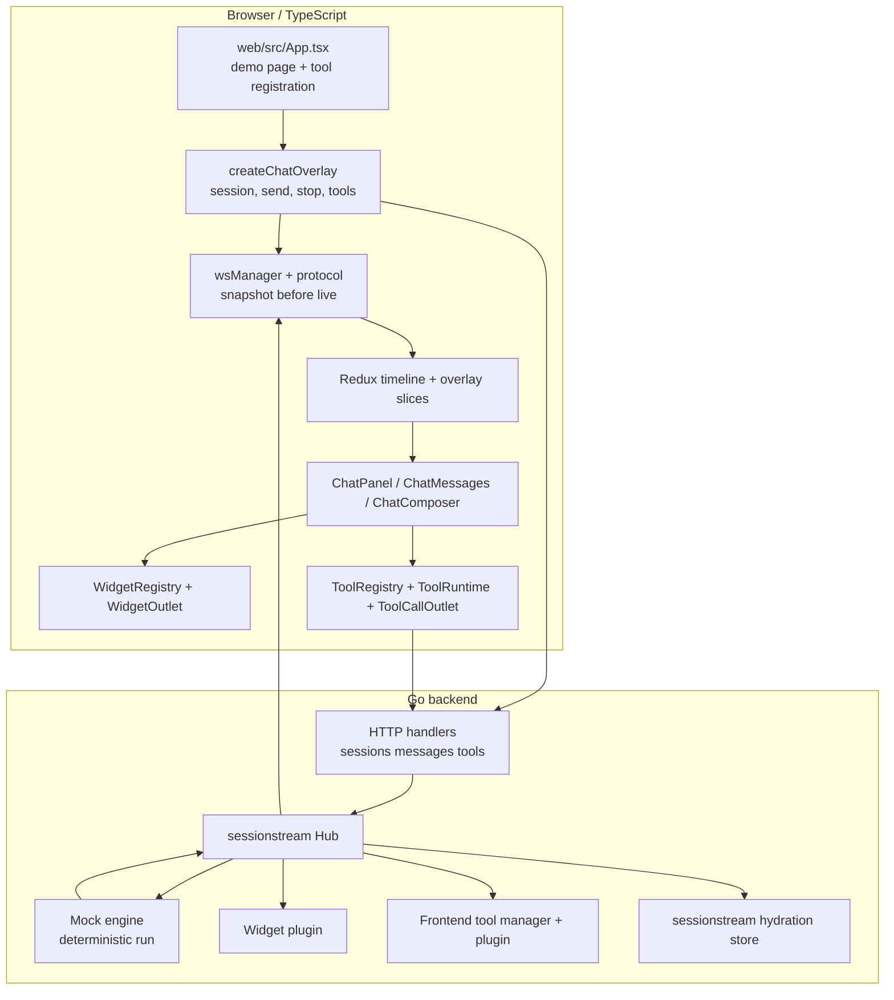
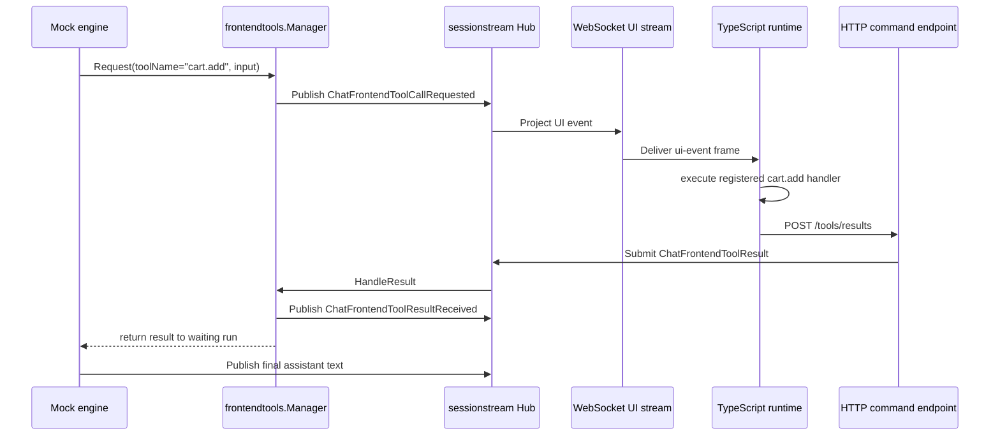

# Chatbot Overlay Framework: TypeScript Runtime and Frontend Tool Calling Deep Dive

This article explains the chatbot overlay framework we built from the proposal stage through the running browser smoke tests. The emphasis is the TypeScript side: how the React overlay is mounted, how WebSocket frames are normalized into Redux timeline state, how typed widgets render, and how frontend tool calls now travel from the backend to the browser and back again. The backend matters because it defines the protocol and run-control semantics, but the central teaching goal is to make the browser runtime understandable enough that a new engineer can extend it safely.

> [!summary]
> - The framework is a generic `@go-go-golems/chat-overlay` style runtime, not an ecommerce-only assistant. Ecommerce widgets are a preset-like demo layer on top of a generic chat, widget, and tool substrate.
> - The TypeScript frontend is deliberately split into transport normalization, Redux timeline state, overlay components, widget rendering, and tool execution. Each layer has a narrow job.
> - Frontend tool calling is implemented as a sessionstream-native round trip: backend publishes `ChatFrontendToolCallRequested`, frontend executes or renders the tool, frontend submits `ChatFrontendToolResult`, and the backend resumes the run.
> - Human-in-the-loop tools use the same protocol as automatic frontend tools but leave the call pending until a React-rendered approval UI invokes `respond()` or `reject()`.

## Why this note exists

The project began as an API design problem. We had two competing proposals for an embeddable chat overlay with typed generative UI. One proposal was product-specific and ecommerce-oriented. The other proposed a generic package, `@go-go-golems/chat-overlay`, with ecommerce widgets as an optional preset. We chose the generic package direction because the real abstraction is not "shopping assistant". The real abstraction is a browser runtime that can render a sessionstream-backed conversation, receive typed widget instances, register host-page capabilities, and route user or browser-side results back to a Go agent runtime.

That choice shaped every implementation decision. The LLM should not emit JSX. The backend should not know how to mutate a browser-local cart. The React panel should not become the source of truth for a conversation. The framework therefore has three core contracts:

1. The backend publishes typed events and timeline entities through `sessionstream`.
2. The browser reduces snapshots and UI events into local render state.
3. Host applications register widgets and tools by stable names and schemas.

The current prototype proves those contracts with two browser-visible flows:

- `add boots to cart` requests the browser tool `cart.add`, the page executes it, the demo cart updates, and the backend resumes with a confirmation.
- `approve checkout` requests the human tool `checkout.confirm`, the page renders an approval card, the user clicks `APPROVE`, and the backend resumes with a confirmation.

## The implementation in one diagram

The following diagram shows the current framework as implemented in the repository. The important point is that TypeScript does not own the agent run. TypeScript owns embedding, rendering, browser capabilities, and result submission.



The frontend and backend are connected by two transport paths:

- WebSocket is used for sessionstream frames: hello, snapshot, subscribed, and live UI events.
- HTTP is used for commands: create session, send message, stop run, submit tool manifest, and submit tool result.

This split is intentional in the current implementation. The WebSocket client frame schema is still subscribe-oriented. We can add WebSocket client commands later, but the first implementation keeps command submission simple and keeps live delivery sessionstream-native.

## From proposal to running framework

The project moved through four implementation stages.

### Stage 1: choose the generic overlay package boundary

The first design decision was package identity. We chose a generic overlay package with ecommerce as a demo and future preset. That matters because it prevents product-specific concerns from leaking into the runtime. A product carousel is one widget. A checkout approval is one tool. The runtime should not contain special cases for either.

The public TypeScript API started small:

```ts
const overlay = createChatOverlay({ basePrefix: '' });

await overlay.send('show me boots');
overlay.stop();
overlay.open();
overlay.close();
overlay.toggle();
overlay.reset();
```

The current implementation extends that object with a `tools` namespace while preserving the original command surface:

```ts
export type ChatOverlay = {
  send: (prompt: string) => Promise<void>;
  stop: () => Promise<void>;
  open: () => void;
  close: () => void;
  toggle: () => void;
  reset: () => void;
  getStore: () => typeof store;
  tools: ChatOverlayTools;
};
```

The key file is:

```text
/home/manuel/workspaces/2026-05-29/chatbot-react/2026-05-29--chatbot-overlay-glm/web/src/core/createChatOverlay.ts
```

This file is the browser runtime entry point. It owns session creation, WebSocket connection, command submission, manifest sync, tool result submission, and reset/stop cleanup. It does not render React. React gets the runtime through context.

### Stage 2: build typed widget streaming

Before frontend tools, the project needed typed widget streaming. The backend emits widget lifecycle events:

```text
ChatWidgetInstanceStarted
ChatWidgetInstancePatched
ChatWidgetInstanceCompleted
ChatWidgetInstanceRemoved
```

Those events are declared in:

```text
proto/chatoverlay/widgets/v1/widget.proto
```

The frontend registers widget renderers by stable name:

```ts
export function defineWidget(
  name: string,
  component: React.ComponentType<WidgetProps>,
): WidgetDefinition {
  const def = { name, component };
  registry.set(name, def);
  return def;
}
```

The widget registry is intentionally simple in the current prototype. It maps `widgetName` to a React component. `WidgetOutlet` receives a timeline entity, looks up the definition, and renders the component or an unknown-widget fallback. This is enough to prove the model: backend sends typed props, frontend owns rendering.

The TypeScript path for widget events is:

```text
sessionstream WebSocket frame
  -> web/src/ws/protocol.ts parses canonical frame
  -> web/src/ws/timelineEvents.ts maps UI event to timeline mutation
  -> web/src/store/timelineSlice.ts merges entity state
  -> web/src/overlay/ChatMessages.tsx chooses WidgetOutlet
  -> web/src/widgets/WidgetOutlet.tsx renders registered component
```

The non-obvious part is patch merging. A widget can start with partial props and then receive patches. `timelineSlice.ts` merges `propsPatch` into an existing entity. This lets a `ProductCarousel` appear before all products have arrived and then update as the backend streams more data.

### Stage 3: add a real frontend tool protocol

The project then moved from passive rendering to browser participation. Rendering a widget is one direction: backend to browser. A frontend tool is bidirectional: backend to browser to backend.

The protocol lives in:

```text
proto/chatoverlay/tools/v1/frontend_tool.proto
```

The core messages are:

```protobuf
message FrontendToolDescriptor {
  string name = 1;
  string description = 2;
  google.protobuf.Struct input_schema = 3;
  ToolExecutionMode mode = 4;
  bool available = 5;
}

message FrontendToolManifestCommand {
  repeated FrontendToolDescriptor tools = 1;
  uint64 revision = 2;
}

message FrontendToolCallRequested {
  string message_id = 1;
  string tool_call_id = 2;
  string tool_name = 3;
  google.protobuf.Struct input = 4;
  ToolExecutionMode mode = 5;
  string status = 6;
}

message FrontendToolResultCommand {
  string tool_call_id = 1;
  string tool_name = 2;
  google.protobuf.Struct result = 3;
  string status = 4;
  string error = 5;
}
```

The backend component that manages this protocol is:

```text
internal/frontendtools/manager.go
internal/frontendtools/plugin.go
```

`Manager` has two pieces of state:

```go
type Manager struct {
    mu        sync.Mutex
    manifests map[sessionstream.SessionId]*toolv1.FrontendToolManifestUpdated
    pending   map[string]*pendingCall
}
```

`manifests` records what the browser says it can do for a session. `pending` records tool calls that the backend has requested and is waiting to resolve. In the current mock-engine implementation, `Request(...)` publishes `ChatFrontendToolCallRequested` and blocks until `HandleResult(...)` receives the matching `ChatFrontendToolResult` command.

The sequence is precise:



This is not yet the full Geppetto tool-loop bridge. It is a deterministic mock-engine implementation of the same shape. That was the right first step because it gives us browser smoke tests and protocol evidence without requiring provider credentials or model-specific behavior.

### Stage 4: add automatic and human frontend tools in TypeScript

The TypeScript tool runtime is the newest and most important frontend layer. It lives in:

```text
web/src/tools/toolRegistry.ts
web/src/tools/toolRuntime.ts
web/src/tools/useFrontendTool.ts
web/src/tools/useHumanTool.ts
web/src/tools/ToolCallOutlet.tsx
```

The registry supports three modes:

```ts
export type ToolExecutionMode = 'frontend' | 'human' | 'backend';
```

A frontend tool executes automatically in the browser:

```ts
export type FrontendTool<TInput, TResult> = BaseTool & {
  mode?: 'frontend';
  execute: (input: TInput, context: ToolExecutionContext) => Promise<TResult> | TResult;
};
```

A human tool renders an approval or form UI and waits for explicit response:

```ts
export type HumanTool<TInput, TResult> = BaseTool & {
  mode: 'human';
  render: (props: HumanToolRenderProps<TInput, TResult>) => React.ReactNode;
};
```

The important distinction is ownership of completion. An automatic tool completes when its `execute` function returns. A human tool completes only when its rendered UI calls `respond(result)` or `reject(error)`.

## The TypeScript runtime layers

The TypeScript side is easiest to understand as a set of layers, each with one responsibility.

| Layer | Files | Responsibility |
|---|---|---|
| Runtime API | `web/src/core/createChatOverlay.ts`, `web/src/core/context.ts` | Create sessions, connect transport, expose `send`, `stop`, `reset`, and `tools`. |
| Transport | `web/src/ws/protocol.ts`, `web/src/ws/wsManager.ts` | Build WebSocket URL, subscribe, parse frames, enforce snapshot-before-live delivery. |
| Timeline normalization | `web/src/ws/timelineEvents.ts`, `web/src/ws/timelineSnapshot.ts` | Convert sessionstream payloads into Redux timeline entities. |
| State | `web/src/store/timelineSlice.ts`, `web/src/store/overlaySlice.ts` | Store ordered entities and overlay status. |
| Overlay UI | `web/src/overlay/*.tsx` | Render panel, composer, messages, and bubble. |
| Widget rendering | `web/src/widgets/*.tsx`, `web/src/ecommerce/*.tsx` | Render typed widget instances. |
| Tool runtime | `web/src/tools/*.ts(x)` | Register tools, sync manifest, execute browser tools, render human tools, submit results. |

This separation matters because sessionstream events and React components should not be coupled directly. A UI event first becomes a timeline mutation. The renderer then consumes timeline state. That gives the frontend one place to handle reconnect snapshots, live events, and future replay or persistence behavior.

## How `createChatOverlay()` works

`createChatOverlay()` is the boundary between host application code and framework internals. It takes configuration, returns an object, and hides Redux and transport details.

The `send()` path is now:

```ts
async send(prompt: string) {
  dispatch(overlaySlice.actions.setError(null));
  const sessionId = await ensureSession(dispatch);
  await ensureConnection(sessionId, dispatch);
  await syncToolManifest();
  await fetch(`/api/chat/sessions/${sessionId}/messages`, {
    method: 'POST',
    headers: { 'Content-Type': 'application/json' },
    body: JSON.stringify({ prompt }),
  });
}
```

The order matters:

1. A session must exist before a manifest can be attached to it.
2. The WebSocket should subscribe before the message is submitted, otherwise early UI events can be missed.
3. The current tool manifest should be synced before the backend decides whether to request a browser-side tool.
4. The prompt is submitted only after the browser has advertised its capabilities.

The tool namespace is added to the returned overlay object:

```ts
const tools: ChatOverlayTools = {
  register: defaultToolRegistry.register.bind(defaultToolRegistry),
  get: defaultToolRegistry.get.bind(defaultToolRegistry),
  manifest: defaultToolRegistry.manifest.bind(defaultToolRegistry),
  revision: defaultToolRegistry.revision.bind(defaultToolRegistry),
  syncManifest,
  submitResult,
};
```

The implementation still uses a singleton registry. That is acceptable for the current single-overlay prototype. It should become overlay-instance scoped before the package supports multiple independent overlays on one page.

## WebSocket hydration and event normalization

The WebSocket manager follows a snapshot-before-live rule. When a connection opens, it sends a subscribe frame. Server frames arrive as:

```text
hello
snapshot
subscribed
ui-event
ui-event
...
```

`wsManager.ts` buffers live UI events until snapshot hydration has happened:

```ts
if (type === 'ui-event') {
  if (!this.hydrated) {
    this.buffered.push(frame);
    return;
  }
  applyUIEvent(frame, args.dispatch, args.sessionId);
}
```

This solves a real ordering problem. Without snapshot-before-live, a live patch can be applied before the entity it patches exists. The current code takes the simple approach: clear timeline state on snapshot, apply snapshot entities, then replay buffered UI events.

The normalization layer is in `timelineEvents.ts`. It maps named sessionstream UI events into generic `TimelineEntity` mutations. For frontend tools, the mapping is:

```ts
case 'ChatFrontendToolCallRequested': {
  const toolCallId = payload.toolCallId as string;
  return {
    upsert: toolCallEntity(toolCallId, {
      toolCallId,
      toolName: payload.toolName,
      parentMessageId: payload.messageId,
      mode: payload.mode,
      status: payload.status || 'requested',
      input: payload.input || {},
    }),
  };
}

case 'ChatFrontendToolResultReceived': {
  const toolCallId = payload.toolCallId as string;
  return {
    upsert: toolCallEntity(toolCallId, {
      toolCallId,
      toolName: payload.toolName,
      parentMessageId: payload.messageId,
      status: payload.status || 'success',
      result: payload.result || {},
      error: payload.error,
    }),
  };
}
```

`applyUIEvent()` also calls the tool runtime before applying the Redux mutation:

```ts
export function applyUIEvent(frame: CanonicalFrame, dispatch: AppDispatch) {
  handleFrontendToolUIEvent(frame);
  const mutation = timelineMutationFromUIEvent(frame);
  ...
}
```

This means the same UI event both starts browser-side execution and becomes visible state. The event is the boundary. React is not polling for pending tool calls; it is reacting to sessionstream state.

## The tool registry

The registry is intentionally small. It stores tool definitions by name, exposes a manifest, and increments a revision on register/unregister.

```ts
class DefaultToolRegistry implements ToolRegistry {
  private tools = new Map<string, ToolDefinition>();
  private manifestRevision = 0;

  register(tool: ToolDefinition): () => void {
    const normalized = { ...tool, mode: tool.mode ?? 'frontend' };
    this.tools.set(tool.name, normalized);
    this.manifestRevision++;
    return () => {
      const current = this.tools.get(tool.name);
      if (current === normalized) {
        this.tools.delete(tool.name);
        this.manifestRevision++;
      }
    };
  }

  manifest(): FrontendToolManifestEntry[] {
    return Array.from(this.tools.values()).map((tool) => ({
      name: tool.name,
      description: tool.description,
      mode: tool.mode ?? 'frontend',
      inputSchema: tool.inputSchema ?? { type: 'object' },
      available: typeof tool.available === 'function' ? tool.available() : tool.available !== false,
    }));
  }
}
```

The registry has two audiences:

- The backend needs the manifest: names, descriptions, modes, schemas, availability.
- The frontend runtime needs lookup by `toolName` when a call arrives.

The current schema field is a JSON-schema-like object supplied by the tool author. We have not added runtime schema validation yet. That is the next necessary hardening step. The type definitions make room for it, but the smoke implementation does not validate inputs beyond basic object normalization.

## Automatic frontend tools

A host page registers an automatic frontend tool with `useFrontendTool()`:

```tsx
useFrontendTool<Record<string, unknown>, Record<string, unknown>>({
  name: 'cart.add',
  description: 'Add one product to the local browser demo cart.',
  inputSchema: {
    type: 'object',
    properties: {
      sku: { type: 'string' },
      name: { type: 'string' },
      quantity: { type: 'number' },
    },
    required: ['sku'],
  },
  execute: async (input) => {
    const sku = String(input.sku || 'unknown-sku');
    const quantity = Number(input.quantity || 1);
    ...
    return { ok: true, cartCount, added: { sku, name, quantity } };
  },
}, []);
```

The hook is small:

```ts
export function useFrontendTool<TInput, TResult>(tool: FrontendTool<TInput, TResult>, deps: unknown[] = []) {
  const overlay = useChatOverlay();

  useEffect(() => {
    const unregister = overlay.tools.register(tool);
    void overlay.tools.syncManifest();
    return () => {
      unregister();
      void overlay.tools.syncManifest();
    };
  }, [overlay, ...deps]);
}
```

This is the component-scoped registration model from the design research. If a page section mounts, its tools become available. If it unmounts, they are removed from the registry and the manifest revision changes. The backend then receives a new manifest on the next sync.

When the backend requests `cart.add`, `toolRuntime.ts` executes it:

```ts
const tool = defaultToolRegistry.get(toolName);
const available = typeof tool.available === 'function'
  ? tool.available()
  : tool.available !== false;

const controller = new AbortController();
activeControllers.set(toolCallId, controller);

try {
  const input = normalizeRecord(payload.input);
  const result = await tool.execute(input, { signal: controller.signal, toolCallId });
  await submit({ toolCallId, toolName, status: 'success', result: normalizeRecord(result) });
} catch (err) {
  await submit({
    toolCallId,
    toolName,
    status: controller.signal.aborted ? 'cancelled' : 'failed',
    error: err instanceof Error ? err.message : String(err),
  });
}
```

The `AbortController` is important. `overlay.stop()` cancels active browser tools before submitting the backend stop command. A future production implementation should propagate cancellation state into the timeline as well.

## Human-in-the-loop tools

Human tools use the same backend protocol but a different frontend completion rule. The backend still sends `ChatFrontendToolCallRequested`. The frontend still inserts a `tool_call` timeline entity. The difference is that `toolRuntime.ts` does not auto-submit a result:

```ts
if (tool.mode === 'human') {
  pendingHumanTools.add(toolCallId);
  return;
}
```

The timeline renderer detects that pending state and calls the registered render function:

```tsx
{humanTool ? (
  <div data-testid="human-tool-ui">
    {humanTool.render({
      toolCallId,
      toolName,
      input: input ?? {},
      status: statusText,
      respond: (humanResult) => {
        void respondToHumanTool({ toolCallId, toolName, status: 'success', result: humanResult });
      },
      reject: (message) => {
        void respondToHumanTool({
          toolCallId,
          toolName,
          status: 'denied',
          result: { approved: false },
          error: message,
        });
      },
    })}
  </div>
) : null}
```

The demo tool is `checkout.confirm`:

```tsx
useHumanTool<Record<string, unknown>, Record<string, unknown>>({
  name: 'checkout.confirm',
  description: 'Ask the user to confirm before opening checkout.',
  mode: 'human',
  inputSchema: {
    type: 'object',
    properties: {
      subtotal: { type: 'string' },
      reason: { type: 'string' },
    },
    required: ['subtotal', 'reason'],
  },
  render: ({ input, respond, reject }) => (
    <div data-testid="checkout-approval-card">
      <div>Approve checkout?</div>
      <p>{String(input.reason)}</p>
      <p>Subtotal: {String(input.subtotal)}</p>
      <button onClick={() => respond({ approved: true })}>APPROVE</button>
      <button onClick={() => reject('User denied checkout approval')}>DENY</button>
    </div>
  ),
}, []);
```

This shape is important because it treats human approval as a tool mode, not a widget convention. The backend does not need to know how the approval UI is rendered. It only needs a result for `tool_call_id`. The browser does not need to know how the model will continue. It only submits a result.

## Tool calls as timeline entities

A frontend tool call is rendered by `ToolCallOutlet`, but it is stored in the same ordered timeline as messages and widgets. `ChatMessages.tsx` filters visible entities:

```ts
const visible = entities.filter(
  (e) => e.kind === 'message' || e.kind === 'widget' || e.kind === 'tool_call',
);
```

Then it dispatches each entity kind to a renderer:

```tsx
if (entity.kind === 'widget') return <WidgetOutlet ... />;
if (entity.kind === 'tool_call') return <ToolCallOutlet ... />;
return <Message ... />;
```

This design gives the user an audit trail. The conversation shows that the assistant asked the browser to perform `cart.add` or asked the user to approve `checkout.confirm`. When the result arrives, the same timeline card updates to `success` and shows the result payload.

The durable timeline entity is projected by the backend plugin:

```go
return []sessionstream.TimelineEntity{{
    Kind: TimelineEntityFrontendToolCall,
    Id:   payload.ToolCallId,
    Payload: &toolv1.FrontendToolCallEntity{
        ToolCallId:     payload.ToolCallId,
        ToolName:       payload.ToolName,
        ParentMessageId: payload.MessageId,
        Mode:           payload.Mode,
        Status:         "requested",
        Input:          payload.Input,
    },
}}, true, nil
```

Snapshot hydration maps `ChatFrontendToolCall` back into a frontend `tool_call` entity:

```ts
if (kind === 'ChatFrontendToolCall') {
  return toolCallEntity(id, {
    toolCallId: asString(payload.toolCallId) || id,
    toolName: asString(payload.toolName),
    parentMessageId: asString(payload.parentMessageId),
    mode: asString(payload.mode),
    status: asString(payload.status) || 'requested',
    input: payload.input || {},
    result: payload.result || undefined,
    error: asString(payload.error),
  });
}
```

The current human-tool implementation still has an important limitation: the pending-human set is frontend-memory state. A snapshot can restore the tool entity after refresh, but the runtime does not yet reattach pending human controls automatically. That is the next reconnect-hardening task.

## Why the backend result is published before the run resumes

`frontendtools.Manager.HandleResult()` does two things:

1. Publish `ChatFrontendToolResultReceived`.
2. Send the result into the pending call channel.

The order is deliberate:

```go
if err := pub.Publish(ctx, sessionstream.Event{Name: EventResultReceived, ...}); err != nil {
    return err
}

select {
case pending.ch <- proto.Clone(payload).(*toolv1.FrontendToolResultCommand):
default:
}
```

If the manager unblocked the mock engine first, the engine could publish final assistant text before the result event is visible. The timeline would then show continuation before the tool card updates. Publishing the result first preserves the user's reading order: request, result, continuation.

This is a small implementation detail, but it captures the larger rule. The event stream should describe the actual sequence a user must understand.

## The two smoke tests

The current project has two browser smoke tests.

Automatic frontend tool:

```bash
cd /home/manuel/workspaces/2026-05-29/chatbot-react/2026-05-29--chatbot-overlay-glm/web
node ../ttmp/2026/05/29/CHATOVERLAY-002--elegant-chatbot-embedding-api-with-client-side-tool-calling/scripts/03-client-tool-browser-smoke.js
```

The script opens the app, sends `add boots to cart`, waits for the `cart.add` tool card, waits for `success`, checks that the demo cart says `1 item`, and waits for the assistant confirmation.

Human-in-the-loop tool:

```bash
cd /home/manuel/workspaces/2026-05-29/chatbot-react/2026-05-29--chatbot-overlay-glm/web
node ../ttmp/2026/05/29/CHATOVERLAY-002--elegant-chatbot-embedding-api-with-client-side-tool-calling/scripts/04-human-tool-browser-smoke.js
```

The script opens the app, sends `approve checkout`, waits for the approval card, clicks `APPROVE`, waits for `success`, checks the approval count, and waits for the assistant confirmation.

The development server script is:

```bash
./ttmp/2026/05/29/CHATOVERLAY-002--elegant-chatbot-embedding-api-with-client-side-tool-calling/scripts/02-restart-dev-servers.sh
```

It starts:

- backend on `:8080`, running `go run ./cmd/chat-overlay serve --serve-port 8080`,
- frontend on `:5173`, running `npx vite --host 127.0.0.1 --port 5173`.

## What changed in the backend to support TypeScript

Although this article focuses on TypeScript, the frontend tool runtime depends on backend support. The backend added:

- `proto/chatoverlay/tools/v1/frontend_tool.proto` for typed commands/events/entities.
- `internal/frontendtools/manager.go` for manifests, pending calls, result handling, and schema registration.
- `internal/frontendtools/plugin.go` for UI and timeline projection.
- `internal/webchat/handlers.go` routes for `/tools/manifest` and `/tools/results`.
- `internal/mockengine/engine.go` prompt paths for `cart.add` and `checkout.confirm`.

The mock engine is not a throwaway detail. It gives deterministic tests for the contract the real Geppetto/Pinocchio bridge will eventually use. The real implementation should replace the mock prompt detection with model tool calls, but the browser contract should remain close to what we have now.

## What is implemented today

The current framework can do the following:

- Create a session through HTTP.
- Connect to the sessionstream WebSocket.
- Hydrate timeline state from an in-band WebSocket snapshot.
- Render user and assistant messages.
- Render typed widgets from backend widget lifecycle events.
- Stream widget prop patches into existing timeline entities.
- Register frontend tools from React component scope.
- Sync a frontend tool manifest to the backend.
- Execute automatic frontend tools in the browser.
- Render human-in-the-loop tool UI in the timeline.
- Submit tool results to the backend.
- Resume a waiting mock backend run after a frontend or human tool result.
- Validate the flows with Go tests, TypeScript build, and Playwright browser smoke scripts.

The current commits that define the feature are:

```text
80af964 feat: add frontend tool sessionstream backend
8803c2d feat: add frontend tool registry smoke runtime
e7c1dba feat: add human-in-the-loop frontend tools
```

The documentation commits are:

```text
38361dc docs: design client-side tool calling API
9a595a6 docs: plan frontend tool calling smoke phases
3934b09 docs: record frontend tool smoke implementation
3529d44 docs: record human tool implementation
```

## Important limitations

The implementation is intentionally a working prototype, not the final production API.

- The registry and runtime are singleton-based. They should become overlay-instance scoped before multiple overlays are supported.
- `inputSchema` is advertised but not enforced by a runtime validator such as Zod. The next API hardening step is schema parsing and result validation.
- The real Geppetto/Pinocchio tool-loop bridge is not implemented yet. The mock engine simulates the backend wait/resume contract.
- Pending human tool UI is not fully reattached after page refresh. The durable timeline entity is restored, but the pending runtime marker is in memory.
- Tool result payloads are plain JSON objects through `google.protobuf.Struct`. That is practical for the smoke test, but production code should add size limits and result envelope conventions.
- Mutating tools need policy defaults. A browser tool that spends money, sends data, opens checkout, deletes records, or navigates away should default to human approval.

## Recommended next implementation sequence

The next work should preserve the current layering and harden one boundary at a time.

1. Add schema validation. `defineTool()` should accept a Zod schema or a small schema adapter, derive JSON Schema for the backend manifest, and validate model-provided inputs before execution.
2. Scope registries to overlay instances. `createChatOverlay()` should allocate its own tool registry and tool runtime rather than using global singletons.
3. Add Storybook stories for tool states. The important states are requested, executing, success, denied, failed, cancelled, pending approval, and unknown tool.
4. Add reconnect tests. A pending `checkout.confirm` should survive refresh as a visible pending timeline entity and reattach to the registered human tool renderer if the tool is still available.
5. Move the mock bridge into Pinocchio/Geppetto. The production path should convert model tool calls into frontend tool requests and feed browser results back into the tool loop.
6. Add policy metadata. Tool definitions should be able to say whether they are read-only, mutating, sensitive, approval-required, or unavailable for a reason.

## Working rules for future changes

- Keep the model away from UI code. It may request named tools and widgets with schema-validated inputs; it should not emit JSX, HTML, or JavaScript.
- Keep sessionstream as the state boundary. Tool calls, widget instances, and messages should be represented as commands, events, UI events, and timeline entities.
- Keep React as a renderer, not the source of truth. React can register capabilities and render timeline entities, but durable conversation state should come from sessionstream.
- Keep browser effects in the browser. If a tool mutates page-local state, navigates, reads selection, or opens a host application modal, the frontend should execute it and submit a result.
- Keep sensitive actions explicit. Human-in-the-loop tools should be the default for actions that require consent.

## File reference map

Frontend runtime:

- `/home/manuel/workspaces/2026-05-29/chatbot-react/2026-05-29--chatbot-overlay-glm/web/src/core/createChatOverlay.ts`
- `/home/manuel/workspaces/2026-05-29/chatbot-react/2026-05-29--chatbot-overlay-glm/web/src/core/context.ts`
- `/home/manuel/workspaces/2026-05-29/chatbot-react/2026-05-29--chatbot-overlay-glm/web/src/ws/wsManager.ts`
- `/home/manuel/workspaces/2026-05-29/chatbot-react/2026-05-29--chatbot-overlay-glm/web/src/ws/timelineEvents.ts`
- `/home/manuel/workspaces/2026-05-29/chatbot-react/2026-05-29--chatbot-overlay-glm/web/src/ws/timelineSnapshot.ts`
- `/home/manuel/workspaces/2026-05-29/chatbot-react/2026-05-29--chatbot-overlay-glm/web/src/store/timelineSlice.ts`

Frontend tools:

- `/home/manuel/workspaces/2026-05-29/chatbot-react/2026-05-29--chatbot-overlay-glm/web/src/tools/toolRegistry.ts`
- `/home/manuel/workspaces/2026-05-29/chatbot-react/2026-05-29--chatbot-overlay-glm/web/src/tools/toolRuntime.ts`
- `/home/manuel/workspaces/2026-05-29/chatbot-react/2026-05-29--chatbot-overlay-glm/web/src/tools/useFrontendTool.ts`
- `/home/manuel/workspaces/2026-05-29/chatbot-react/2026-05-29--chatbot-overlay-glm/web/src/tools/useHumanTool.ts`
- `/home/manuel/workspaces/2026-05-29/chatbot-react/2026-05-29--chatbot-overlay-glm/web/src/tools/ToolCallOutlet.tsx`

Demo UI:

- `/home/manuel/workspaces/2026-05-29/chatbot-react/2026-05-29--chatbot-overlay-glm/web/src/App.tsx`
- `/home/manuel/workspaces/2026-05-29/chatbot-react/2026-05-29--chatbot-overlay-glm/web/src/overlay/ChatPanel.tsx`
- `/home/manuel/workspaces/2026-05-29/chatbot-react/2026-05-29--chatbot-overlay-glm/web/src/overlay/ChatMessages.tsx`
- `/home/manuel/workspaces/2026-05-29/chatbot-react/2026-05-29--chatbot-overlay-glm/web/src/widgets/WidgetOutlet.tsx`

Backend protocol and bridge:

- `/home/manuel/workspaces/2026-05-29/chatbot-react/2026-05-29--chatbot-overlay-glm/proto/chatoverlay/tools/v1/frontend_tool.proto`
- `/home/manuel/workspaces/2026-05-29/chatbot-react/2026-05-29--chatbot-overlay-glm/internal/frontendtools/manager.go`
- `/home/manuel/workspaces/2026-05-29/chatbot-react/2026-05-29--chatbot-overlay-glm/internal/frontendtools/plugin.go`
- `/home/manuel/workspaces/2026-05-29/chatbot-react/2026-05-29--chatbot-overlay-glm/internal/mockengine/engine.go`
- `/home/manuel/workspaces/2026-05-29/chatbot-react/2026-05-29--chatbot-overlay-glm/internal/webchat/handlers.go`
- `/home/manuel/workspaces/2026-05-29/chatbot-react/2026-05-29--chatbot-overlay-glm/internal/webchat/server_test.go`

Ticket docs and smoke scripts:

- `/home/manuel/workspaces/2026-05-29/chatbot-react/2026-05-29--chatbot-overlay-glm/ttmp/2026/05/29/CHATOVERLAY-002--elegant-chatbot-embedding-api-with-client-side-tool-calling/design-doc/01-elegant-chatbot-embedding-api-and-client-side-tool-calling-design.md`
- `/home/manuel/workspaces/2026-05-29/chatbot-react/2026-05-29--chatbot-overlay-glm/ttmp/2026/05/29/CHATOVERLAY-002--elegant-chatbot-embedding-api-with-client-side-tool-calling/reference/01-research-diary.md`
- `/home/manuel/workspaces/2026-05-29/chatbot-react/2026-05-29--chatbot-overlay-glm/ttmp/2026/05/29/CHATOVERLAY-002--elegant-chatbot-embedding-api-with-client-side-tool-calling/scripts/03-client-tool-browser-smoke.js`
- `/home/manuel/workspaces/2026-05-29/chatbot-react/2026-05-29--chatbot-overlay-glm/ttmp/2026/05/29/CHATOVERLAY-002--elegant-chatbot-embedding-api-with-client-side-tool-calling/scripts/04-human-tool-browser-smoke.js`

## Closing

The current framework is no longer only a chat panel. It is a browser runtime for typed conversational UI. The browser can render backend-owned widgets, advertise browser-owned capabilities, execute automatic tools, pause for human approval, and return results to a waiting backend run. The TypeScript side is the practical center of that experience: it is where host applications register capabilities, where timeline state becomes visible UI, and where browser effects remain under application control.

The next architectural step is to replace the mock-engine wait/resume path with a real Pinocchio/Geppetto frontend tool executor. That change should not rewrite the TypeScript API. It should make the backend smarter while preserving the contract this prototype established: named tools, typed inputs, sessionstream events, visible timeline state, browser-owned execution, and explicit result submission.
