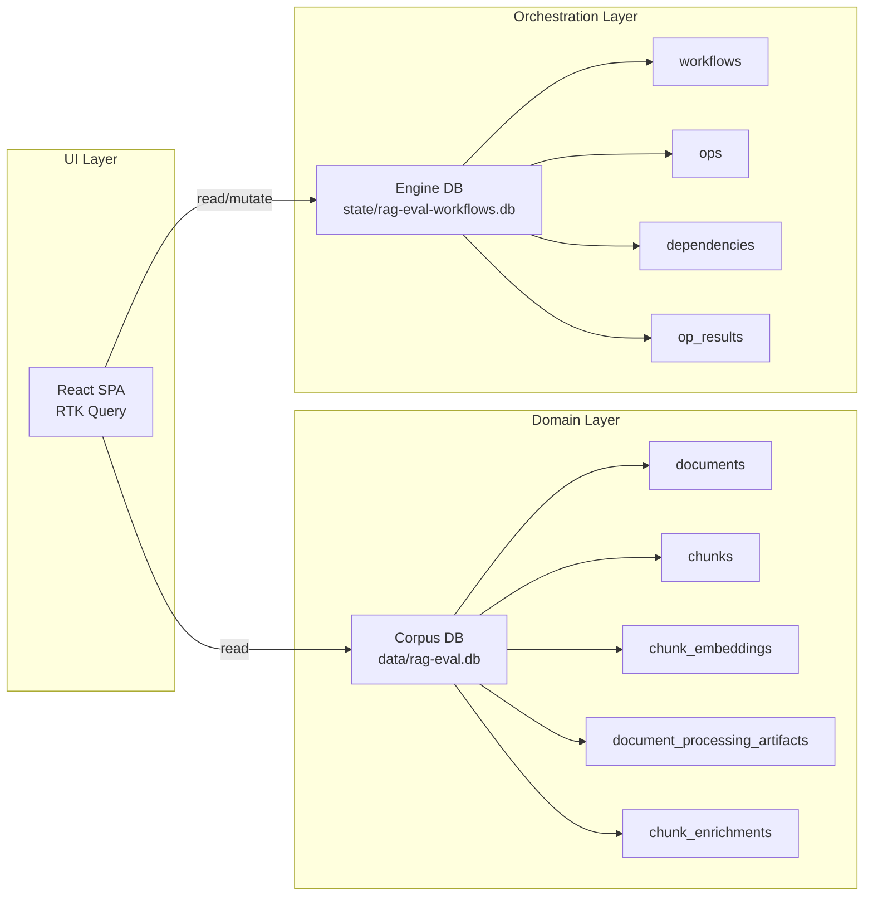
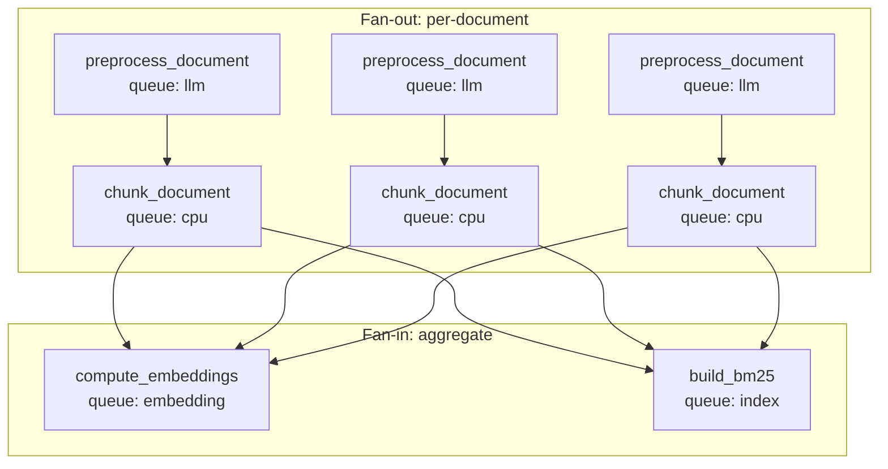
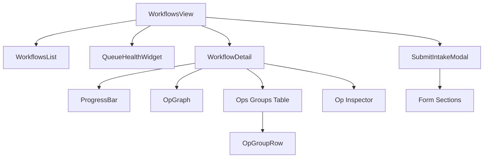

# RAG Evaluation System: Workflow Intake UI — Architecture, Implementation, and Data Exploration

This article documents the complete design and implementation of the workflow intake user interface for the RAG evaluation system. The system transforms raw documents into searchable vector and BM25 indexes through a durable, retryable pipeline orchestrated by the scraper workflow engine. The UI makes every stage of that pipeline visible and actionable from the browser.

The article covers three concerns: the two-database architecture that separates domain data from workflow orchestration state, the six frontend components that surface workflow progress and artifact coverage, and the data exploration patterns the UI enables for developers iterating on intake pipelines. It is written for engineers who need to understand, modify, or extend the system.

> [!summary]
> - The system uses two SQLite databases: a corpus database for domain data (documents, chunks, embeddings, enrichments) and an engine database for workflow orchestration state (ops, dependencies, retry state). The UI bridges both.
> - Operations are grouped by (operation, status) in the API response to prevent context explosion—a workflow with 6236 individual ops returns 4 summary rows instead.
> - The Corpus Explorer now shows preprocessing coverage per source, an Artifacts tab per document, and enrichment status per chunk, completing the visibility loop from workflow submission through artifact consumption.
> - Cross-view navigation connects the Workflows tab to the Corpus Explorer and back, letting developers trace a submitted workflow to the artifacts it produced.

## Why this system exists

The RAG evaluation system ingests documents from web sources, chunks them into segments, computes vector embeddings, builds BM25 indexes, and optionally applies LLM preprocessing and chunk enrichment. Each of these stages is idempotent and service-backed, but the stages have dependencies: chunking must complete before embeddings can be computed; preprocessing must complete before chunking can respect cleaned text.

Before the workflow UI, a developer submitted intake pipelines through CLI commands and monitored progress by querying the engine SQLite database directly. There was no browser visibility into which operations had failed, which queues were backlogged, or which documents still lacked preprocessing artifacts. The CLI path works for scripted runs but does not support the interactive cycle of submit-observe-diagnose-retry that pipeline development requires.

The UI solves this by making three things visible that were previously invisible: workflow progress and per-operation status, queue health across the four named queues, and artifact coverage (preprocessing and enrichment) inside the Corpus Explorer where developers already browse documents and chunks.

## The two-database architecture

The system stores data in two separate SQLite databases, each owned by a different layer of the stack.



The **corpus database** (`data/rag-eval.db`) holds domain data: sources, documents, chunks, chunk embeddings, document processing artifacts, and chunk enrichments. The corpus service queries this database directly. It knows nothing about workflows.

The **engine database** (`state/rag-eval-workflows.db`) holds workflow orchestration state: workflow definitions, individual operations with their dependency edges, retry state, and op results. The scraper engine library manages this database. It knows nothing about documents or chunks except what the `Input` JSON field on each op contains.

The UI layer reads both databases through separate API paths. The `/api/v1/corpus/*` endpoints query the corpus database. The `/api/v1/workflows/*` endpoints query the engine database. The `/api/v1/artifacts/*` endpoints query the corpus database for artifact coverage derived from workflow output.

This separation is deliberate. Workflow orchestration state changes rapidly (ops transition from pending to running to succeeded every few seconds), while domain data changes slowly (a document's content text rarely changes). Keeping them in separate databases lets the orchestration layer use SQLite WAL mode for concurrent scheduler writes without contending with read queries from the corpus service. The trade-off is that cross-database joins are impossible; the UI must merge data client-side.

## The workflow DAG structure

When a developer submits an intake workflow, the system constructs a directed acyclic graph of operations. The graph has a predictable structure: a fan-out of per-document operations, followed by a fan-in of aggregate operations.



For a source with 3117 documents, the graph contains 3117 `preprocess_document` ops, 3117 `chunk_document` ops, 1 `compute_embeddings` op, and 1 `build_bm25` op—6236 operations total. Each per-document op has a dedup key (e.g., `preprocess:ttc-article-9838:clean_text:v1:fake:fake-document-processor`) that prevents reprocessing if the op is retried.

The fan-in ops (`compute_embeddings`, `build_bm25`) depend on all chunk ops. They remain in `pending` status until every chunk op reaches `succeeded`. This is the scraper engine's dependency resolution: a `pending` op becomes `ready` when all its `DependsOn` entries are satisfied, and a `ready` op becomes `running` when a scheduler cycle leases it to a worker.

## The ops grouping problem

Returning 6236 individual op objects in a single API response is impractical. The JSON payload would be hundreds of kilobytes, the browser would spend significant time parsing it, and the UI would need to render thousands of table rows that convey little additional information beyond what a summary provides.

The solution is to group ops by their (operation, status) pair and return one summary row per group. The API endpoint `GET /api/v1/workflows/{id}/ops` returns:

```json
{
  "workflow_id": "intake-20260529T204111",
  "total": 6236,
  "groups": [
    {
      "operation": "preprocess_document",
      "queue": "rag-eval:llm",
      "status": "ready",
      "count": 3117,
      "sample": { "op": { "ID": "...", "Input": { ... } }, "status": "ready", ... }
    },
    {
      "operation": "chunk_document",
      "queue": "rag-eval:cpu",
      "status": "ready",
      "count": 3117,
      "sample": { ... }
    },
    {
      "operation": "compute_embeddings",
      "queue": "rag-eval:embedding",
      "status": "pending",
      "count": 1,
      "sample": { ... }
    },
    {
      "operation": "build_bm25",
      "queue": "rag-eval:index",
      "status": "pending",
      "count": 1,
      "sample": { ... }
    }
  ]
}
```

Each group includes a `sample` field containing one representative op from that group. The sample provides enough detail for diagnostic inspection—its `Input` object shows the document ID, database path, and operation-specific parameters—without requiring a separate paginated endpoint.

The grouping is performed in the Go handler by iterating the full op list once, building a map keyed by `operation + "|" + status`, then sorting the map entries for stable rendering order. The handler also computes the total count as the sum of all group counts, which the frontend uses to display progress.

## Frontend component architecture

The UI consists of two main views: the **Workflows** view (RAGEVAL-007) for workflow lifecycle management, and the **Corpus Explorer** (RAGEVAL-006 Phase 6 additions) for artifact visibility.

### Workflows view

The Workflows view is a single React component file (`web/src/components/workflows/WorkflowsView.tsx`) containing five sub-components.



**WorkflowsList** renders a filterable table of workflows with status icons and progress counts. It polls `GET /api/v1/workflows` every 2 seconds via RTK Query's `pollingInterval`. The status filter dropdown lets a developer isolate failed or running workflows.

**QueueHealthWidget** shows per-queue counts (ready, running, failed) for the four named queues (`cpu`, `llm`, `embedding`, `index`). It polls `GET /api/v1/queues` every 5 seconds. The aggregate totals at the top give a quick read on system load.

**SubmitIntakeModal** is a form overlay for creating new intake workflows. It collects source IDs, chunking parameters (strategy, chunk size, overlap), embedding configuration (provider, engine, dimensions, batch size), and BM25 toggle. It displays available source names for discoverability and shows error messages when submission fails.

**WorkflowDetail** is the main diagnostic view for a single workflow. It contains four sub-sections:

1. A **ProgressBar** showing the ratio of succeeded/running/failed/total operations with color bands and a percentage label. The bar updates every 2 seconds as the polling data refreshes.
2. An **OpGraph** showing the fan-out/fan-in DAG structure with status-colored nodes. Chunk and preprocess nodes appear at the top (fan-out), embed and BM25 nodes appear at the bottom (fan-in), with an arrow showing completion progress.
3. An **Ops Groups Table** showing one row per (operation, status) group with the count and queue name. Rows are selectable—clicking a row opens the inspector for that group's sample op.
4. An **Op Inspector** panel that displays the sample op's metadata (ID, status, queue, dedup key) and input fields. If the op has failed, the inspector shows the error message, retry attempt count, and a "Retry Now" button that calls `POST /api/v1/workflows/{id}/retry/{opId}`.

### The key-based lookup pattern

A subtle implementation detail: the retry handler in the inspector does not hold a direct reference to the inspected op object. The `inspectedSample` value is derived from the polled `groups` array, which receives a new object identity every 2 seconds. Placing this derived object in a `useCallback` dependency array causes an infinite re-render loop: new data → new `inspectedSample` → new callback → new render → repeat.

The solution stores only the stable group key (e.g., `"preprocess_document|ready"`) in React state. The retry handler looks up the current sample from the polled `groups` array at call time:

```typescript
const [inspectedGroup, setInspectedGroup] = useState<string | null>(null);

// In the retry button's onClick:
const g = groups.find(gr => gr.operation + '|' + gr.status === inspectedGroup);
if (!g?.sample) return;
await retryOp({ workflowId, opId: g.sample.op.ID }).unwrap();
```

This pattern avoids the stale closure problem (the lookup always uses current data) and avoids the render-time side effect problem (no `useRef.current` assignment during render). It works because the group key is a stable string that does not change across polls.

### Corpus Explorer artifact additions

Three additions to the Corpus Explorer surface artifact data produced by workflows.

**SourcePanel preprocessing coverage.** Each source in the left panel now shows a preprocessing coverage line below the existing embedding coverage line. For example:

```
The Tree Center Guides
19 docs · 3,847 words
17/19 embedded (89%)
0/19 preprocessed (0%)
```

The preprocessing coverage comes from `GET /api/v1/artifacts/document-processing/coverage`, which returns per-source counts (document_count, artifact_count, fresh_count, failed_count, missing_count). The frontend fetches this data once and builds a map keyed by source_id, passing the relevant entry to each SourceItem.

**DocumentInspector Artifacts tab.** The document inspector now has five tabs: overview, text, chunks, coverage, artifacts. The artifacts tab calls `GET /api/v1/documents/{id}/processing-artifacts` (lazy-loaded only when the tab is active) and shows a table of preprocessing artifacts with type, prompt version, provider, status, and age columns. Clicking a row opens the ArtifactDetail sub-component showing the input hash, output text, and any error message.

When no artifacts exist, the tab shows "No preprocessing artifacts for this document" with a "Submit Workflow →" button that dispatches a `rag:navigate-to-workflows` custom event, switching the main view to the Workflows tab. This completes the bidirectional navigation loop.

**Chunk enrichment indicator.** The chunks tab now has an "Enrich" column between "Embed" and "ID" that shows ● (enriched) or ○ (not enriched) for each chunk. This data comes from a `LEFT JOIN chunk_enrichments` added to the backend `DocumentDetail` query in the corpus service. The join adds four columns to the chunk result set: `short_summary`, `prompt_version`, `quality_score`, and `enrichment_updated_at`. When the `short_summary` column is non-null, the chunk's `Enrichment` struct is populated with the enrichment metadata.

The enrichment join is worth examining in detail. The original chunk query joined `chunks` with `chunk_embeddings` to produce embedding status. The enrichment join adds `LEFT JOIN chunk_enrichments cce ON cce.chunk_id = c.id AND cce.strategy_id = c.strategy_id`. This produces at most one enrichment row per chunk per query. If multiple enrichments exist for the same chunk with different prompt versions, the SQL engine returns whichever row it encounters first—this is a known limitation that should be refined with a `GROUP BY` or latest-version subquery in a future iteration.

## API endpoint inventory

The UI consumes 19 API endpoints, organized by concern.

| Endpoint | Method | Database | Purpose |
|---|---|---|---|
| `/api/v1/workflows` | GET | Engine | List workflows with status filter |
| `/api/v1/workflows/{id}` | GET | Engine | Workflow summary with stats |
| `/api/v1/workflows/{id}/ops` | GET | Engine | Grouped ops summary |
| `/api/v1/workflows/{id}/results/{opId}` | GET | Engine | Op result detail (stub) |
| `/api/v1/workflows/{id}/retry/{opId}` | POST | Engine | Retry a failed op |
| `/api/v1/workflows/{id}/cancel` | POST | Engine | Cancel a running workflow |
| `/api/v1/workflows/intake` | POST | Engine | Submit new intake workflow |
| `/api/v1/queues` | GET | Engine | Queue health status |
| `/api/v1/corpus/sources` | GET | Corpus | Source summaries with embedding counts |
| `/api/v1/corpus/documents` | GET | Corpus | Document list for a source |
| `/api/v1/corpus/documents/{id}` | GET | Corpus | Document detail with chunks and enrichment status |
| `/api/v1/chunking-strategies` | GET | Corpus | Available chunking strategies |
| `/api/v1/artifacts/document-processing/identities` | GET | Corpus | Distinct preprocessing identity tuples |
| `/api/v1/artifacts/chunk-enrichment/identities` | GET | Corpus | Distinct enrichment identity tuples |
| `/api/v1/artifacts/document-processing/coverage` | GET | Corpus | Per-source preprocessing artifact counts |
| `/api/v1/documents/{id}/processing-artifacts` | GET | Corpus | Artifacts for one document |
| `/api/v1/artifacts/chunk-enrichment/coverage` | GET | Corpus | Per-source chunk enrichment counts |
| `/api/v1/chunks/{id}/enrichments` | GET | Corpus | Enrichments for one chunk |
| `/api/v1/health` | GET | Both | Service health check |

The engine database endpoints use the scraper `engineview` service package for read operations and the `workflow_mutation_service` for retry and cancel operations. The corpus database endpoints use the `corpus` service for document and chunk queries and the `documentprocessing` and `chunkenrichment` services for artifact coverage.

## Data exploration patterns

The UI enables three interactive workflows for developers iterating on intake pipelines.

### Diagnosing a failed workflow

When a workflow shows `failed` status, the developer clicks into the workflow detail. The progress bar immediately shows which operation groups have failed (red band). The ops groups table shows the failed group row with a ✘ icon. Clicking that row opens the inspector, which displays the error message from `RetryState.LastError`, the current attempt number, and the retry configuration.

If the error is transient (e.g., an LLM provider timeout), the developer clicks "Retry Now" to re-queue the op. If the error is persistent (e.g., a document that cannot be parsed), the developer notes the document ID from the inspector's Input fields and can exclude it from the next submission.

### Tracking preprocessing coverage

The Corpus Explorer's SourcePanel shows preprocessing coverage alongside embedding coverage. A source showing `0/483 preprocessed (0%)` indicates that no preprocessing workflow has been run against that source's documents. Clicking a document and switching to the Artifacts tab confirms the absence. The "Submit Workflow →" button navigates directly to the workflow submission form.

After a workflow completes, the SourcePanel updates to reflect the new coverage (e.g., `483/483 preprocessed (100%)`). The document's Artifacts tab populates with rows showing the artifact type, prompt version, provider identity, and status.

### Tracing from workflow to artifact

The bidirectional navigation connects the Workflows tab and the Corpus Explorer in both directions:

1. **Workflow → Corpus**: In a succeeded workflow detail, the "View in Corpus →" button dispatches a `rag:navigate-to-chunk` event with the source ID and strategy ID, switching to the Corpus Explorer with the relevant source selected.
2. **Corpus → Workflows**: In a document's Artifacts tab, the "Submit Workflow →" button dispatches a `rag:navigate-to-workflows` event, switching to the Workflows view where the developer can submit a new intake workflow.

This loop supports the iterative cycle: submit a workflow → watch it succeed → inspect the produced artifacts in the Corpus Explorer → identify gaps (missing preprocessing, low enrichment quality) → submit a new workflow with different parameters.

## The identity problem

Preprocessing and enrichment artifacts have their own identity axes that do not align with embedding identity. Embedding identity is defined by `(provider_type, model, dimensions)` — controlled by the IdentityBar at the top of the Corpus Explorer. Preprocessing identity is defined by `(artifact_type, prompt_version, provider, model)`. Enrichment identity is defined by `(strategy_id, prompt_version)`.

The current implementation uses a hardcoded preprocessing identity (`artifact_type=clean_text`, `prompt_version=v1`, `provider=fake`, `model=fake-document-processor`) in the SourcePanel coverage query. This works for the prototype because all preprocessing has been done with the fake provider. In production, the coverage query must use the actual provider identity from the workflow that produced the artifacts.

Three design options exist for solving this:

1. **Extend the IdentityBar** with artifact identity fields (artifact_type, prompt_version, provider, model). This would add four more controls to an already-dense bar.
2. **Use the most recent workflow's identity** as the default, with a compact selector for switching. This requires tracking which workflow produced which artifacts, which the current schema does not support.
3. **Add a separate ArtifactCoveragePanel** below the IdentityBar that fetches coverage independently with its own filter controls. This keeps the embedding identity clean but adds a second control bar.

Option 3 is the recommended approach. It isolates the artifact identity concern from the embedding identity concern and avoids crowding the IdentityBar with fields that only affect the SourcePanel's secondary coverage lines.

This option has been implemented. The `DocProcessingIdentityBar` component renders a compact row of buttons below the embedding IdentityBar. Each button represents a distinct preprocessing identity `(artifact_type, prompt_version, provider, model)` from the `document_processing_artifacts` table, showing the identity tuple and artifact count. Clicking a button changes the preprocessing coverage query parameters, and the SourcePanel re-renders with coverage data for the selected identity.

The implementation adds two backend endpoints:

- `GET /api/v1/artifacts/document-processing/identities` returns `[{artifact_type, prompt_version, provider, model, artifact_count}]`
- `GET /api/v1/artifacts/chunk-enrichment/identities` returns `[{strategy_id, prompt_version, provider, model, enriched_count}]`

When the identities endpoint returns data, the `CorpusExplorerView` auto-selects the first real identity if the current selection is the default fake provider. This replaces the previously hardcoded `fake/fake-document-processor/v1/clean_text` identity with the actual provider identity from the database (e.g., `openai-responses/gpt-5-nano/phase5-gpt-5-nano-low-v1/live_smoke_clean_text`).

## RTK Query data flow

All API communication flows through a single RTK Query API slice defined in `web/src/services/api.ts`. The slice defines 19 endpoints with three tag types: `Sources`, `Workflows`, and `Artifacts`. Polling is configured per-endpoint using `pollingInterval`:

- Workflow list and detail: 2 seconds
- Queue health: 5 seconds
- Artifact coverage: no polling (fetched once on mount)

The API slice uses `keepUnusedDataFor: 300` (5 minutes) for all endpoints, meaning data stays in the Redux store for 5 minutes after the last component unsubscribes. This prevents unnecessary refetches when navigating between the Workflows tab and Corpus Explorer.

The tag-based cache invalidation is minimal: mutation endpoints (`submitIntakeWorkflow`, `retryOp`, `cancelWorkflow`) invalidate the `Workflows` tag, causing all active workflow queries to refetch. There are currently no mutations that invalidate the `Artifacts` tag, because artifact data changes only when a workflow completes (which is reflected in the workflow status change that triggers a `Workflows` invalidation).

## JSON serialization conventions

The Go backend uses `encoding/json` with a mix of explicit `json` struct tags and default exported-field serialization. This produces two different naming conventions in the same API response, which the TypeScript types must match exactly.

For wrapper structs with explicit `json` tags, the serialization uses camelCase:

```go
type WorkflowOp struct {
    op      WorkflowRun  // no json tag → PascalCase
    Status  string       `json:"status"`   → "status"
    CreatedAt string     `json:"createdAt"` → "createdAt"
}
```

For nested model structs without `json` tags, the serialization uses PascalCase (Go's default for exported fields):

```go
type WorkflowRun struct {
    ID        string   // → "ID"
    Status    string   // → "Status"
    Queue     string   // → "Queue"
    RetryState struct {
        Attempt    int    // → "Attempt"
        LastError  string // → "LastError"
    }
}
```

The TypeScript interfaces must mirror these conventions exactly. A `WorkflowOp` in TypeScript looks like:

```typescript
interface WorkflowOp {
  op: {
    ID: string;           // PascalCase from Go struct field
    Status: string;       // PascalCase
    Queue: string;        // PascalCase
    RetryState: {
      Attempt: number;   // PascalCase
      LastError: string; // PascalCase
    };
  };
  status: string;        // camelCase from json tag
  createdAt: string;     // camelCase from json tag
}
```

This dual convention is a consequence of embedding the scraper's model types (which lack `json` tags) inside wrapper structs that do have `json` tags. It is a known source of bugs: if a TypeScript developer assumes one convention or the other uniformly, field mismatches cause silent undefined values in the UI.

## CSS design system

The UI uses a retro Mac OS monochrome design system defined in `web/src/index.css`. The system uses CSS custom properties for all colors, fonts, and spacing, producing a black-and-white interface with blue and red accents for interactive and error states.

The design system defines these component classes:

- **Panel**: bordered container with a black header bar and white body. Used for all major content blocks.
- **Data table**: striped table with monospace headers, dotted row separators, and hover highlighting. Selectable rows use the `.selectable` / `.selected` pattern.
- **Progress bar**: bounded bar with fill bands for done (black), running (blue), and failed (red) segments, plus a centered label showing the percentage.
- **Op graph**: flex-column layout with fan-out nodes at top, an arrow indicator, and fan-in nodes at bottom. Each node is a bordered pill with a status icon.
- **Form section**: bordered fieldset with uppercase legend, right-aligned labels, and full-width inputs using the `.form-row` pattern.
- **Modal overlay**: fixed-position backdrop with centered panel. Clicking the backdrop dismisses the modal.

The status colors use foreground-only classes (`status-done`, `status-running`, `status-error`, `status-canceled`, `status-pending`) that set the `color` property without backgrounds. This keeps the monochrome aesthetic while providing visual differentiation through color alone.

## Known limitations

**Enrichment join ambiguity.** The `LEFT JOIN chunk_enrichments` in the DocumentDetail query may return an arbitrary row when multiple enrichments exist for the same chunk with different prompt versions. The current query does not specify which enrichment to prefer. A production implementation should add a subquery that selects the latest or highest-quality enrichment per chunk.

**Hardcoded preprocessing identity.** ✅ Resolved. The `DocProcessingIdentityBar` component now fetches distinct identities from the `document_processing_artifacts` table and lets the user select which identity to display coverage for. The auto-select replaces the hardcoded fake provider with the first real identity when available.

**Polling instead of SSE.** All workflow data updates via polling (2s or 5s intervals). This creates unnecessary HTTP traffic when nothing changes and introduces a latency window before updates appear. Server-Sent Events would push status changes as they happen and eliminate the polling-induced re-render cycles that caused the React #310 crash during development.

**No per-group drill-down.** The ops groups table shows one sample op per group. There is no way to list all failed chunk ops or all running preprocess ops with pagination. A future endpoint `GET /api/v1/workflows/{id}/ops?operation=chunk_document&status=failed&limit=50&offset=0` would support this.

**No op result detail.** The endpoint `GET /api/v1/workflows/{id}/results/{opId}` now returns the full `OpResult` from the engine store. The frontend `OpResultSection` component renders the result when an inspected op has `succeeded` or `failed` status. The result section shows: the `Data` JSON object, a table of `Records` written (table name + primary key), a list of `Artifacts` produced (name, kind, content type), `Emitted` child op IDs (capped at 20 with overflow indicator), and any `Error` from the result. The result is lazy-loaded only when the inspector opens for a completed op.

## Implementation sequence

The implementation proceeded in seven phases across two tickets.

| Phase | Ticket | What was built | Commit |
|---|---|---|---|
| 0 | RAGEVAL-006 | Scraper dependency spike, echo runner, scheduler integration tests | (multiple) |
| 1 | RAGEVAL-006 | Go-native intake runner: chunk_document, compute_embeddings, build_bm25 | (multiple) |
| 2 | RAGEVAL-006 | Workflow submit/worker/status CLI commands | (multiple) |
| 3 | RAGEVAL-006 | Document preprocessing artifact schema, service, workflow op | (multiple) |
| 4 | RAGEVAL-006 | Chunk enrichment DB helpers, service, workflow op | (multiple) |
| 5 | RAGEVAL-006 | Live provider smoke with gpt-5-nano-low profile | (multiple) |
| 6 backend | RAGEVAL-006 | Read-only API endpoints for workflows, artifacts, coverage | (multiple) |
| 1 | RAGEVAL-007 | 5 workflow API endpoints (retry, cancel, submit, queues, result) | `fafb6ab` |
| 2-6 | RAGEVAL-007 | RTK Query types, WorkflowsView components, tab wiring | `387713d` |
| 7 | RAGEVAL-007 | CSS polish, progress bar, form styling, React #310 fix | `1851167` |
| refactor | RAGEVAL-007 | Drop useRef, key-based lookup for op inspector | `5e97f11` |
| 6 frontend | RAGEVAL-006 | Artifact RTK Query endpoints, SourcePanel coverage, Artifacts tab, Enrich column, enrichment join | `164aded` |
| 6 cross-link | RAGEVAL-006 | Reverse navigation from Corpus Explorer to Workflows tab | `4cbf0cb` |

The key implementation insight: RAGEVAL-007 built the Workflows view first, then RAGEVAL-006 Phase 6 frontend wired the artifact endpoints into the Corpus Explorer. The reverse order would have required building artifact visibility without a way to submit or monitor the workflows that produce those artifacts.

## Key source files

| File | Role |
|---|---|
| `internal/api/handlers.go` | Route registration for all API endpoints |
| `internal/api/workflow_artifact_handlers.go` | Workflow CRUD, artifact coverage, and mutation handlers |
| `internal/services/corpus/service.go` | DocumentDetail query with chunk + enrichment joins |
| `internal/workflow/intake_runner.go` | Go-native scraper runner dispatching all intake operations |
| `internal/workflow/submit.go` | Workflow DAG construction from intake parameters |
| `web/src/services/api.ts` | RTK Query API slice with 17 endpoints and TypeScript types |
| `web/src/components/workflows/WorkflowsView.tsx` | All workflow UI sub-components |
| `web/src/components/corpus/CorpusExplorerView.tsx` | Corpus Explorer with preprocessing coverage integration |
| `web/src/components/corpus/DocumentInspector.tsx` | Document detail with Artifacts tab and Enrich column |
| `web/src/components/corpus/ArtifactIdentityBar.tsx` | Artifact identity selector (DocProcessingIdentityBar, ChunkEnrichmentIdentityBar) |
| `web/src/index.css` | Retro Mac design system CSS |

## Working rules

- Always group ops by (operation, status) in API responses. Never return individual ops for workflows with more than a few hundred operations.
- Use stable string keys for derived state lookups rather than holding references to polled data objects in callback closures.
- Keep the two databases separate in the API layer. Cross-database joins belong in the UI, not in the backend.
- Mirror Go JSON serialization conventions exactly in TypeScript. PascalCase for scraper model fields without `json` tags, camelCase for wrapper struct fields with `json` tags.
- Poll at 2s for workflow data, 5s for queue data. Do not poll artifact coverage data (it changes only when workflows complete).
- Use the retro Mac design system classes (`.panel`, `.data-table`, `.btn`, `.form-row`) for all new components. Do not use inline styles for layout or typography.
