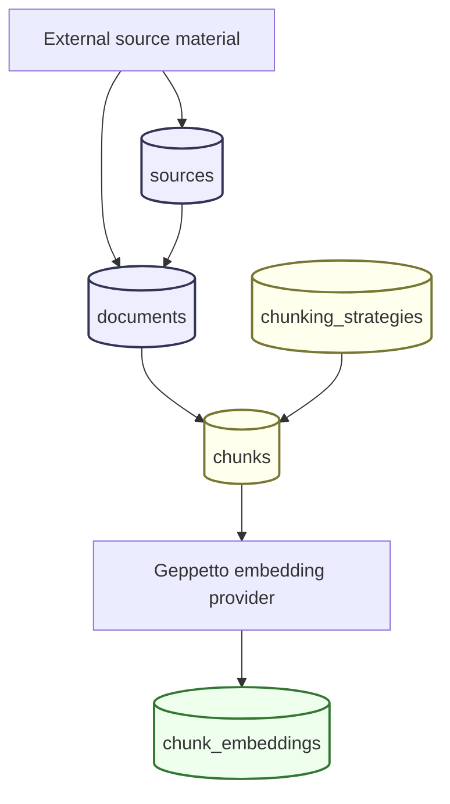
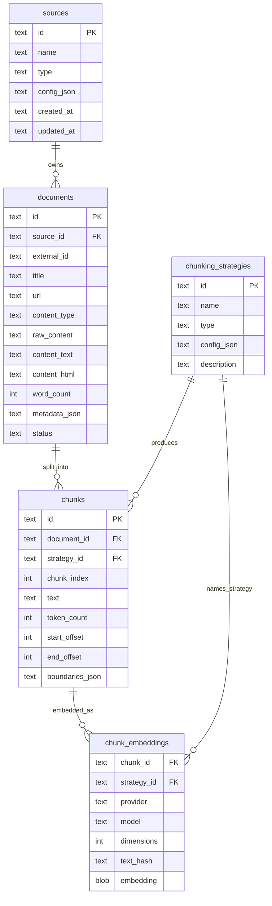
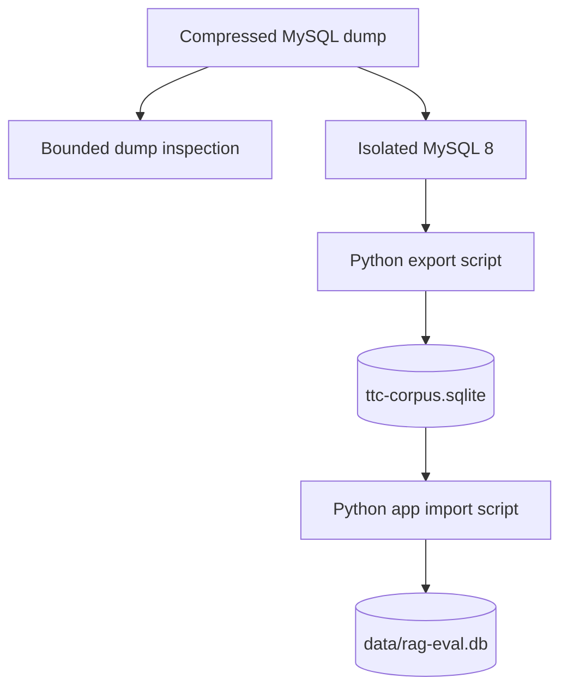

# RAG Evaluation System: Intake Pipeline Deep Dive

This report explains the intake side of the RAG Evaluation System: how source material becomes database documents, how documents become chunks, how chunks become embeddings, and how operators can run those stages from the CLI. It deliberately does not analyze the search side. Search, BM25, vector query retrieval, hybrid ranking, and smoke-query evaluation are separate layers built on top of the intake artifacts described here.

The current intake implementation is intentionally explicit. The project stores every major intermediate artifact in SQLite: source records, document records, chunking strategy records, chunks, and chunk embeddings. That persistence model is the central design decision. It makes the pipeline inspectable, rerunnable, and suitable for comparing different chunking and embedding configurations without hiding the intermediate state behind an opaque indexing job.

> [!summary]
> - Intake currently means `source -> document -> chunk -> chunk_embedding`, backed by SQLite tables and shared Go services used by both CLI and HTTP handlers.
> - There are two corpus acquisition paths: filesystem/Defuddle Markdown scanning and a database-backed The Tree Center WordPress/WooCommerce dump pipeline.
> - Chunk identity is strategy-aware: a chunk is identified by `(document_id, strategy_id, chunk_index)`, and chunk IDs hash `document_id`, `strategy_id`, and index.
> - Embedding identity is provider-aware and model-aware: a stored vector is identified by `(chunk_id, strategy_id, provider, model, dimensions)` and protected by a SHA-256 `text_hash` freshness check.
> - New developers should start by reading `internal/db/db.go`, `internal/ingest/scanner.go`, `internal/chunking/chunker.go`, `internal/services/chunking/service.go`, `internal/services/embedding/service.go`, and the RAGEVAL-001/RAGEVAL-002 diaries.

## Scope of this report

This document covers the intake pipeline only.

Included:

- source registration;
- filesystem scanning;
- Defuddle-based web corpus acquisition;
- WordPress/WooCommerce dump parsing into a normalized SQLite corpus;
- importing normalized corpus rows into the app database;
- document persistence;
- chunking strategy registration;
- fixed-size, sentence, and Markdown-heading chunk algorithms;
- chunk persistence, idempotency, and migration decisions;
- embedding provider resolution through Geppetto and Pinocchio profiles;
- embedding batch computation, freshness checks, vector encoding, coverage, and source filtering;
- current CLI usage for indexing documents and computing embeddings;
- current implementation risks and next intake-side work.

Not included:

- BM25 indexing;
- vector query search;
- hybrid search and reciprocal rank fusion;
- search UI behavior;
- benchmark metrics and retrieval evaluation;
- answer generation.

Those excluded pieces consume the intake artifacts, but they are not part of the intake side itself.

## The intake pipeline as implemented today

The pipeline is best described as a sequence of persisted transformations.



The main implementation files are:

| Layer | File | Responsibility |
|---|---|---|
| Database bootstrap | `internal/db/db.go` | Opens SQLite, enables WAL, runs schema creation, defines canonical intake tables. |
| Database repair | `internal/db/migrations.go` | Upgrades older development databases whose `chunks` table lacked `strategy_id`. |
| Query layer | `internal/db/queries.go` | Implements upserts, chunk listing, embedding staleness checks, and embedding coverage queries. |
| Filesystem ingest | `internal/ingest/scanner.go` | Walks text-readable files, extracts simple metadata, and inserts `documents`. |
| Source service | `internal/services/source/service.go` | Shared source creation and scan behavior for CLI/HTTP. |
| Document service | `internal/services/document/service.go` | Shared document list/get/chunks behavior for CLI/HTTP. |
| Chunk algorithms | `internal/chunking/chunker.go` | Implements fixed, sentence, and Markdown-heading chunkers. |
| Chunk service | `internal/services/chunking/service.go` | Applies strategies, rebuilds derived chunks, and marks documents chunked. |
| Embedding provider resolver | `internal/services/embedding/provider.go` | Resolves direct or profile-backed Geppetto embedding providers. |
| Embedding service | `internal/services/embedding/service.go` | Computes and stores chunk embeddings with batching and staleness checks. |
| Vector encoding | `internal/services/embedding/vector.go` | Encodes `[]float32` vectors as little-endian SQLite BLOBs. |
| Corpus dump exporter | `ttmp/.../RAGEVAL-002/scripts/03-export-mysql-to-sqlite.py` | Converts the TTC WordPress dump into normalized corpus SQLite. |
| Corpus app importer | `ttmp/.../RAGEVAL-002/scripts/04-import-corpus-into-rageval.py` | Imports normalized corpus rows into the app `documents` table. |
| Sample chunking script | `ttmp/.../RAGEVAL-002/scripts/05-chunk-ttc-sample.sh` | Chunks representative guide/article/product documents. |

The pipeline is service-oriented. CLI commands and HTTP handlers are adapters. The important behavior lives in `internal/services/*`, which was a deliberate correction made after the early implementation duplicated behavior between CLI and HTTP.

## Historical decisions from the ticket diaries

The intake side did not appear fully formed. Several important decisions came from incidents and follow-up stabilization work recorded in the RAGEVAL diaries.

### RAGEVAL-001: start broad, then stabilize before embeddings

The original RAGEVAL-001 design planned a workflow-driven RAG evaluation system with scraping, extraction, chunking, embeddings, enrichment, indexing, and an interactive playground. The first implementation scaffolded the Go CLI/server, SQLite schema, React frontend, ingestion commands, and chunking commands.

The important event in the diary is the chunking incident. A fixed-size chunker with overlap could keep emitting tail chunks forever when the final capped end offset reached the document length and the next start moved backward by the overlap. The observed symptom was a memory spike and a killed process. The fix introduced three invariants:

- `chunk_size` must be positive;
- `overlap` must be non-negative;
- `overlap` must be smaller than `chunk_size`;
- once `end >= totalRunes`, chunking terminates.

That incident changed the implementation style. Future intake commands needed bounded output by default, service-layer tests, and idempotent writes before moving to embeddings.

### RAGEVAL-001 Step 4: strategy-aware chunk identity

The next major stabilization decision was making chunks first-class strategy artifacts. The earlier schema could not safely support multiple chunking strategies per document. The corrected schema added `strategy_id` to `chunks` and made the unique key `(document_id, strategy_id, chunk_index)`.

This decision matters because comparing chunking strategies is one of the reasons the project exists. A document may be chunked as `fixed-500-50`, `fixed-1200-150`, `sentence-1000-100`, or `markdown-heading`. Those chunks cannot share the same `(document_id, chunk_index)` identity.

The implementation also changed chunk IDs from document/index-based IDs to IDs that include strategy:

```text
chunk_id = "chk-" + sha256(document_id + ":" + strategy_id + ":" + chunk_index)[0:16]
```

That is implemented in `internal/chunking/chunker.go` around `generateChunkID`.

### RAGEVAL-001 Step 6: embeddings after service tests

Embeddings were added only after source, document, chunking, and migration tests existed. This was a good sequencing decision. Stored embeddings depend on stable chunk identity and rerun-safe chunk application. If chunks are ambiguous, all embedding rows become ambiguous.

The embedding implementation adopted Geppetto's provider interface and Pinocchio profile resolution. It stores vectors as SQLite BLOBs and uses a `text_hash` field to avoid recomputing fresh embeddings.

### RAGEVAL-002: realistic corpus acquisition

RAGEVAL-002 introduced the database-backed The Tree Center corpus path. The project needed more than small local files. The TTC dump path created a reproducible corpus with 483 articles, 19 guides, and 2,594 products. That corpus is then imported into the app database and chunked in bounded samples.

This ticket also clarified a separation that new developers should preserve:

- the normalized corpus database (`data/corpus/ttc-dump/ttc-corpus.sqlite`) is a source artifact;
- the app database (`data/rag-eval.db`) is the operational RAG database;
- importing from corpus SQLite into the app database is an explicit bridge step.

### RAGEVAL-003: expose intake artifacts visually

RAGEVAL-003 built the Corpus Explorer. Although this report is not about the UI, the UI work confirms the intake model. The website can inspect sources, documents, chunks, chunk boundaries, and embedding coverage because those artifacts are persisted separately and have explicit identities.

## SQLite as the intake state model

SQLite is the canonical state store for the current intake pipeline. `internal/db/db.go` opens the database with WAL mode, foreign keys enabled, a busy timeout, and `MaxOpenConns(1)`. That single-writer setting is appropriate for the current local tool because ingestion, chunking, and embedding writes are sequential operator actions.

The important intake tables are `sources`, `documents`, `chunking_strategies`, `chunks`, and `chunk_embeddings`.



### `sources`

A source is a named origin of documents. Examples from the current local database include:

- `thetreecenter-guides` for Defuddle-downloaded guide Markdown;
- `ttc-dump-articles` for dump-derived WordPress posts;
- `ttc-dump-guides` for dump-derived `ttc_guide` records;
- `ttc-dump-products` for dump-derived products.

The source record stores `id`, `name`, `type`, and `config_json`. Source creation is an upsert in `InsertSource`, so repeating a source creation command updates metadata instead of failing.

### `documents`

A document is the normalized text unit that can be chunked. The current schema stores both source and derived content fields:

- `raw_content`: original raw representation when available;
- `content_text`: the text used for chunking and embeddings;
- `content_html`: HTML source when available;
- `metadata_json`: corpus-specific details that do not yet deserve first-class columns;
- `status`: currently values such as `extracted` and `chunked`.

Document insertion is an upsert in `InsertDocument`. The filesystem scanner and TTC importer both rely on this to make repeated ingestion safe.

### `chunking_strategies`

A strategy records how chunks were produced. `internal/services/chunking/service.go` constructs the strategy ID from CLI settings when the user does not provide one:

```text
strategy_id = "{strategy}-{chunk_size}-{overlap}"
```

Examples:

- `fixed-500-50`;
- `fixed-1200-150`;
- `sentence-1000-100`;
- a custom `--strategy-name` if provided.

The strategy row stores JSON configuration:

```json
{
  "type": "fixed",
  "chunk_size": 1200,
  "overlap": 150
}
```

### `chunks`

A chunk is derived text. It belongs to one document and one strategy. It stores:

- stable chunk ID;
- document ID;
- strategy ID;
- chunk index;
- text;
- estimated token count;
- rune start offset;
- rune end offset;
- `boundaries_json`.

The current `boundaries_json` is minimal and stores `strategy_id`. More detailed boundary metadata could be added later, especially for sentence and Markdown heading chunkers.

### `chunk_embeddings`

An embedding row stores the vector for one chunk under one embedding identity:

```text
(chunk_id, strategy_id, provider, model, dimensions)
```

The stored vector is a BLOB containing little-endian float32 values. The row also stores `text_hash`, a SHA-256 hash of the chunk text at compute time. That hash is the freshness mechanism: if the chunk text has not changed and `--force` is not set, compute skips that chunk.

## Source creation and filesystem scanning

The generic filesystem path begins with `rag-eval source create` and `rag-eval source scan`.

```bash
./rag-eval source create \
  --db data/rag-eval.db \
  --id my-docs \
  --name "My Documents" \
  --type filesystem \
  --config '{}'

./rag-eval source scan \
  --db data/rag-eval.db \
  --source-id my-docs \
  --dir ./docs
```

The source CLI command calls `internal/services/source.Service.Create`, which validates `id`, `name`, and `type`, marshals the config map, and calls `InsertSource`. The scan command calls `internal/services/source.Service.Scan`, which delegates to `internal/ingest.Scanner.ScanDir`.

`ScanDir` performs a deterministic directory walk:

1. walk the directory tree with `filepath.WalkDir`;
2. skip hidden directories and hidden files;
3. accept only known text-readable extensions;
4. read each file into memory;
5. compute a relative path from the scan root;
6. compute a stable document ID from `sourceID + ":" + relPath`;
7. extract a title from the first Markdown `# ` heading or fallback to filename;
8. compute word count with `strings.Fields`;
9. insert or update the document row.

The stable document ID matters. It lets repeated scans update the same document instead of creating duplicates:

```text
doc_id = "doc-" + sha256(source_id + ":" + relative_path)[0:16]
```

The scanner currently treats text parsing simply. It does not parse frontmatter into metadata, does not render Markdown, and does not strip HTML except in corpus-export scripts. For filesystem sources, `raw_content` and `content_text` are both set to the file content. That is a deliberate early-stage choice: the app stores source text with minimal transformation so the chunker sees exactly what the scanner read.

The supported extension set is defined in `isTextFile` in `internal/ingest/scanner.go`. It includes Markdown, text, code files, JSON/YAML/TOML, HTML/XML/SVG, SQL, CSS, CSV, and common script formats.

## Defuddle-based web corpus acquisition

The Defuddle path is a scripted acquisition stage outside the app's Go code. It is used for public website pages where the desired input is readable Markdown extracted from rendered HTML.

The script is:

```text
ttmp/2026/05/27/RAGEVAL-001--rag-evaluation-system-workflow-driven-document-indexing-with-interactive-playground/scripts/03-download-thetreecenter.py
```

It reads public WordPress sitemaps advertised by The Tree Center:

- `https://www.thetreecenter.com/wp-sitemap-posts-ttc_guide-1.xml` for guides;
- `https://www.thetreecenter.com/wp-sitemap-posts-post-1.xml` for blog posts.

The script is intentionally bounded:

- `--types guides|posts|all` selects which sitemap partitions to use;
- `--max N` limits processed pages;
- `--delay 1.0` rate-limits downloads;
- `--dry-run` prints URLs without downloading;
- existing files are skipped unless `--force` is supplied;
- a JSONL manifest records each attempted page.

The core extraction command is:

```bash
defuddle parse <url> --md
```

The script also tries:

```bash
defuddle parse <url> -p title
```

Each downloaded file receives YAML frontmatter with title, source URL, site, source type, and extraction tool. After download, the normal app ingestion path scans the Markdown files:

```bash
./rag-eval source create \
  --id thetreecenter-guides \
  --name "The Tree Center Guides" \
  --type filesystem

./rag-eval source scan \
  --source-id thetreecenter-guides \
  --dir data/corpus/thetreecenter/guides
```

The diary records that all 19 guide pages were downloaded and scanned. Chunking those guide documents with `fixed-1200-150` produced 226 chunks across 19 documents.

This path is useful for validating public-page extraction quality. It is not the best source for full product metadata because rendered pages do not necessarily expose all WordPress/WooCommerce fields in a structured way.

## Database-backed TTC corpus parsing

The database-backed corpus path is more involved but more reproducible for The Tree Center.

The input file is:

```text
/home/manuel/code/ttc/ttc/ttc_dev_dump.sql.bz2
```

The pipeline stages are:



The implementation uses MySQL as an intermediate execution environment rather than trying to translate MySQL dump syntax directly into SQLite. That decision avoided reimplementing MySQL-specific dump semantics, character set declarations, large multi-row inserts, and WordPress-specific storage quirks.

### Dump inspection

The first script, `01-inspect-dump-schema.py`, was introduced because raw shell inspection was unsafe. A MySQL dump can place many inserted rows on one line, so `grep` can print enormous lines. The bounded script streams the compressed file and writes controlled summaries.

The relevant counts were:

| Content type | Published rows |
|---|---:|
| WordPress posts (`post`) | 483 |
| TTC guides (`ttc_guide`) | 19 |
| Products (`product`) | 2,594 |

These became the first three corpus kinds: `article`, `guide`, and `product`.

### MySQL import

The second stage uses an isolated MySQL 8 Docker Compose service under the ticket scripts. The diary records several operational fixes:

- readiness must check authenticated `SELECT 1`, not `mysqladmin ping`, because MySQL initialization has a temporary server phase;
- dump warning text and GTID/log-bin statements had to be filtered before SQL import;
- `--binary-mode=1` was needed for import robustness.

Those details are important for developers who rerun the pipeline. They are encoded in the ticket script rather than left as oral knowledge.

### Export to normalized corpus SQLite

The export script is:

```text
ttmp/2026/05/28/RAGEVAL-002--extract-the-tree-center-content-dump-into-ordered-sqlite-corpus/scripts/03-export-mysql-to-sqlite.py
```

It uses the MySQL CLI to emit JSON rows through `JSON_OBJECT(...)`, then Python writes SQLite. No Python MySQL driver is required. The script had to use `mysql --raw` so JSON strings were not double-escaped in batch output.

The target SQLite tables are:

- `content_items` for article/guide/product primary records;
- `item_terms` for taxonomy terms;
- `product_meta` for selected product fields.

The text extraction algorithm for `content_items.content_text` is deliberately simple and inspectable:

1. parse HTML with a custom `HTMLParser` subclass;
2. ignore `script`, `style`, and `noscript` content;
3. add newlines around block-like tags such as paragraphs, headings, divs, sections, articles, and list items;
4. unescape HTML entities;
5. normalize CRLF to LF;
6. collapse repeated spaces;
7. collapse excessive blank lines;
8. join title, excerpt, and extracted post content.

Product metadata is selected from WordPress postmeta keys:

- `_treeinfo_botanical_name`;
- `_treeinfo_hardiness_zone`;
- `_treeinfo_mature_height`;
- `_treeinfo_mature_width`;
- `_treeinfo_sunlight`;
- `_treeinfo_soil_conditions`;
- `_treeinfo_drought_tolerance`;
- `_thumbnail_id`.

WooCommerce lookup metadata supplies SKU, price range, and stock status from `wp_wc_product_meta_lookup`.

The output is:

```text
data/corpus/ttc-dump/ttc-corpus.sqlite
```

The export result recorded in the diary was:

| Kind | Items | Words |
|---|---:|---:|
| article | 483 | 605,850 |
| guide | 19 | 37,594 |
| product | 2,594 | 2,208,648 |

### Import into app database

The importer is:

```text
ttmp/2026/05/28/RAGEVAL-002--extract-the-tree-center-content-dump-into-ordered-sqlite-corpus/scripts/04-import-corpus-into-rageval.py
```

It bridges `content_items` into the app's `sources` and `documents` tables. It creates one source per kind:

- `ttc-dump-articles`;
- `ttc-dump-guides`;
- `ttc-dump-products`.

The imported app document ID is the corpus item ID, such as:

```text
ttc-guide-398454
ttc-article-12345
ttc-product-3708
```

This direct reuse of corpus IDs is an important traceability decision. A document can be traced back to the normalized corpus row and then to the WordPress ID.

The importer is rerun-safe. It uses `ON CONFLICT(id) DO UPDATE` for documents and `ON CONFLICT(id) DO UPDATE` for sources. That matches the rest of the intake philosophy: repeated operator commands should update canonical records rather than create duplicates.

One current limitation is product text composition. The importer currently writes `content_items.content_text` directly into app `documents.content_text`. RAGEVAL-005 identifies this as the next data-quality problem: product search and product embeddings will remain weaker until product metadata and taxonomy terms are deliberately composed into searchable text.

## Chunking as a derived-state operation

Chunking is the transformation from `documents.content_text` to `chunks`. It is derived state. The same document can be chunked with multiple strategies, and the same strategy can be safely rerun.

The CLI shape is:

```bash
./rag-eval chunk apply \
  --db data/rag-eval.db \
  --doc-id <document-id> \
  --strategy fixed \
  --chunk-size 1200 \
  --overlap 150 \
  --emit preview \
  --limit 20
```

Available strategies are:

- `fixed`;
- `sentence`;
- `markdown-heading`.

The shared service is `internal/services/chunking.Service.Apply`. It performs these steps:

1. validate document ID;
2. default strategy to `fixed`;
3. default chunk size to `500` when zero;
4. read `documents.content_text` with `GetDocumentContent`;
5. choose a strategy ID from `--strategy-name` or `{strategy}-{chunk_size}-{overlap}`;
6. upsert a `chunking_strategies` row with JSON config;
7. instantiate the chunker via `NewChunkerFromType`;
8. split the document text into chunks;
9. delete existing chunks for exactly `(document_id, strategy_id)`;
10. insert new chunks;
11. update document status to `chunked`;
12. return a summary and optional chunk rows.

The delete-before-insert behavior is important. It makes repeated chunking runs idempotent for one document/strategy pair. It also means that rechunking can delete downstream data through foreign-key cascades. Since `chunk_embeddings.chunk_id` references `chunks(id) ON DELETE CASCADE`, replacing chunks can remove associated embeddings. That is the correct behavior for derived state, but developers should be aware of it before running large rechunk operations.

## Fixed-size chunking algorithm

The fixed-size chunker is implemented in `internal/chunking/chunker.go` by `FixedSizeChunker.Chunk`.

Inputs:

- `ChunkSize`: target size in characters, implemented as runes;
- `Overlap`: overlap in runes;
- `StrategyID`: strategy identity for chunk IDs.

Validation:

```text
chunk_size > 0
overlap >= 0
overlap < chunk_size
```

Algorithm:

```text
runes = []rune(text)
start = 0
index = 0

while start < len(runes):
    end = min(start + chunk_size, len(runes))
    chunk_text = string(runes[start:end])
    emit chunk(index, start, end, chunk_text)

    if end >= len(runes):
        break

    next_start = end - overlap
    if next_start <= start:
        next_start = start + 1
    start = max(next_start, 0)
    index++
```

The terminal check is not optional. It fixes the earlier infinite-tail bug. Without `if end >= totalRunes: break`, a final chunk can reach document end, subtract overlap, and emit another final chunk repeatedly.

The implementation uses runes, not bytes, for offsets. `StartOffset` and `EndOffset` are rune offsets. That is safer for Unicode text than byte slicing, but developers should not treat these offsets as byte offsets into the original string.

Token count is estimated as:

```text
token_count = rune_count(text) / 4
```

This is a rough English-text heuristic, not tokenizer output. It is useful for display and approximate sizing. It is not a provider-specific token count.

Fixed-size chunking is the most tested and most used strategy so far. The TTC sample uses `fixed-1200-150`, which produced manageable chunks for guides, articles, and products.

## Sentence chunking algorithm

The sentence chunker targets chunk size while trying to end chunks at sentence-like boundaries. It is implemented by `SentenceChunker.Chunk` and `splitSentences`.

Sentence splitting is simple:

- append runes into a current buffer;
- if the rune is `.`, `!`, `?`, or newline, emit the current buffer as one sentence if non-empty;
- after the loop, emit remaining text.

This is not a language-aware sentence tokenizer. It does not handle abbreviations, decimal numbers, initials, ellipses, or quoted punctuation. It is a deterministic lightweight splitter.

Chunk assembly works as follows:

```text
current_text = ""
current_start = 0
chunk_start_offset = 0

for sentence in sentences:
    if rune_count(current_text) + rune_count(sentence) > chunk_size and current_text != "":
        emit trimmed current_text
        if overlap > 0 and current_text length > overlap:
            current_text = last overlap runes of current_text
            chunk_start_offset = current_start - rune_count(current_text)
        else:
            current_text = ""
            chunk_start_offset = current_start

    if current_text == "":
        chunk_start_offset = current_start
    current_text += sentence
    current_start += rune_count(sentence)

emit final current_text if non-empty
```

The overlap for sentence chunking is character/rune overlap, not sentence-count overlap. That means an overlapped chunk can begin in the middle of a sentence. A future implementation might prefer sentence-level overlap, but the current behavior is consistent with fixed-size overlap semantics.

Sentence chunking is useful when preserving sentence boundaries matters more than exact chunk size. New developers should treat it as a simple baseline, not as a production-quality linguistic segmenter.

## Markdown-heading chunking algorithm

The Markdown-heading chunker is implemented by `MarkdownHeadingChunker.Chunk` and `splitMarkdownSections`.

The section splitter:

1. split text by newline;
2. when a trimmed line starts with `#` and there is already accumulated text, emit the previous section;
3. append the heading line to the new section;
4. emit the last section at the end.

A section is therefore a heading plus all content until the next heading. The algorithm does not parse Markdown formally. Any trimmed line beginning with `#` counts as a heading, including lines that might occur inside fenced code blocks. That limitation is acceptable for a first implementation but should be documented for code-heavy Markdown corpora.

Large sections are sub-chunked with the fixed-size chunker. The max section size is currently set in `NewChunkerFromType` as `chunk_size * 2` for the `markdown-heading` strategy. If a section exceeds that max, the code creates a fixed-size subchunker with overlap `100`, reduced to `maxChunkSize / 5` when needed to preserve the `overlap < chunk_size` invariant.

When subchunks are emitted, their offsets are shifted by the section offset so the final chunks use document-level offsets. The chunk index is reassigned in global order across all sections.

Markdown-heading chunking is useful for documentation corpora where headings define meaningful semantic units. It is less appropriate for HTML-derived product text without Markdown structure.

## Chunk IDs, offsets, and boundaries

Every chunk ID is deterministic for a document, strategy, and index:

```text
chk-{sha256(document_id:strategy_id:index)[0:16]}
```

This means rerunning the same chunking strategy over unchanged text produces the same IDs. If the document text changes, the algorithm may still emit chunks with the same IDs at the same indexes but different text. That is why embeddings also store `text_hash` and why rechunking deletes and rebuilds chunks for the strategy.

Offsets are rune offsets. They allow the UI to show approximate chunk positions and overlap intervals. The Corpus Explorer uses start/end offsets and chunk lengths to draw timelines and coverage strips.

`boundaries_json` is currently underused. It contains strategy ID. Future improvements could store:

- heading path for Markdown chunks;
- sentence boundary flags;
- overlap source range;
- parser version;
- normalization version;
- byte offsets in addition to rune offsets.

Adding these fields would make chunk provenance stronger without changing the core `chunks` schema.

## Embedding provider resolution

Embedding computation uses Geppetto's embedding provider interface. The resolver is `internal/services/embedding/provider.go`.

The project supports two provider configuration modes.

### Direct mode

Direct mode is used when no `--profile` or `--base-profile` is supplied. The CLI flags map directly to Geppetto embedding settings:

```bash
./rag-eval embedding compute \
  --strategy-id fixed-1200-150 \
  --embeddings-type ollama \
  --embeddings-engine nomic-embed-text \
  --embeddings-dimensions 768 \
  --base-url http://localhost:11434 \
  --limit 10
```

Defaults are:

- provider type: `ollama`;
- engine: `nomic-embed-text`;
- dimensions: `768`;
- cache type: `none`;
- cache directory: `state/embedding-cache`.

If an API key is provided, it is inserted into the API settings under provider-specific keys. For OpenAI, it also maps to `openai-api-key`.

### Profile-backed mode

Profile-backed mode is used when `--profile` or `--base-profile` is supplied. It loads profile registries through Geppetto engineprofiles. If no registry is supplied, the default path is:

```text
~/.config/pinocchio/profiles.yaml
```

The diary records these profiles in the local Pinocchio setup:

| Profile | Provider | Model | Dimensions |
|---|---|---|---:|
| `openai-embedding-small` | OpenAI | `text-embedding-3-small` | 1536 |
| `openai-embedding-large` | OpenAI | `text-embedding-3-large` | 3072 |
| `ollama-nomic-embedding` | Ollama | `nomic-embed-text` | 768 |
| `ollama-all-minilm-embedding` | Ollama | `all-minilm` | 384 |

Profile usage:

```bash
./rag-eval embedding compute \
  --strategy-id fixed-1200-150 \
  --profile openai-embedding-small \
  --profile-registries ~/.config/pinocchio/profiles.yaml \
  --batch-size 5 \
  --limit 5 \
  --output table
```

The resolver validates inference settings for embeddings before constructing the provider. Provider construction does not necessarily make a network call. The network call happens when `GenerateBatchEmbeddings` is invoked.

## Embedding computation algorithm

The shared service is `internal/services/embedding.Service.Compute`.

Required inputs:

- strategy ID;
- embedding provider;
- provider type.

Optional inputs:

- source IDs;
- batch size;
- limit;
- force flag.

Algorithm:

```text
validate strategy_id
validate provider
batch_size = default 16 if <= 0
provider_type = "unknown" if empty
model = provider.GetModel()
validate model name and dimensions

chunks = ListChunksForStrategySources(strategy_id, source_ids, limit)

for chunk in chunks:
    hash = sha256(chunk.text)
    stored_hash = GetChunkEmbeddingTextHash(chunk.id, strategy_id, provider_type, model.name, model.dimensions)
    if stored_hash exists and stored_hash == hash and force == false:
        skipped_fresh++
    else:
        pending.append(chunk, hash)

for each batch in pending:
    texts = chunk.text for batch
    vectors = provider.GenerateBatchEmbeddings(ctx, texts)
    validate len(vectors) == len(batch)
    for each vector:
        validate len(vector) == model.dimensions
        blob = EncodeFloat32Vector(vector)
        UpsertChunkEmbedding(chunk_id, strategy_id, provider_type, model.name, model.dimensions, hash, blob)
        computed++
```

The freshness check is one of the most important details. It compares hashes for the exact embedding identity. A chunk can have several embeddings at once:

- OpenAI small, 1536 dimensions;
- OpenAI large, 3072 dimensions;
- Ollama Nomic, 768 dimensions;
- Ollama MiniLM, 384 dimensions.

A fresh OpenAI small embedding says nothing about whether an Ollama Nomic embedding exists or is fresh.

The service stores vectors by upsert. If the row already exists but `text_hash` differs or `--force` is set, the vector is replaced and `updated_at` changes.

## Vector BLOB encoding

Vectors are stored as little-endian float32 values in a SQLite BLOB. The encoder is `EncodeFloat32Vector` in `internal/services/embedding/vector.go`:

```text
allocate len(vector) * 4 bytes
for each float32 value:
    write math.Float32bits(value) using binary.LittleEndian
```

The decoder verifies that the BLOB length is divisible by four and then reconstructs float32 values.

This representation is compact and deterministic. It is not self-describing. The dimensions are stored in the row key and validated by services that read the vector. If a row says `dimensions=1536`, the BLOB should decode to exactly 1536 float32 values.

## Source-aware embedding compute and coverage

Source-aware compute was added after the TTC dump corpus was imported. The reason was practical cost control. `fixed-1200-150` could contain scraped guides, dump articles, dump guides, and dump products at the same time. Strategy-only compute could accidentally process a much larger set than intended.

The compute command now accepts `--source-ids`:

```bash
./rag-eval embedding compute \
  --strategy-id fixed-1200-150 \
  --source-ids ttc-dump-guides \
  --profile openai-embedding-small \
  --profile-registries ~/.config/pinocchio/profiles.yaml \
  --batch-size 5 \
  --limit 10
```

The database helper joins `chunks` to `documents` and adds `d.source_id IN (...)` when source IDs are supplied.

Coverage is a read-only count operation. It does not call providers:

```bash
./rag-eval embedding coverage \
  --strategy-id fixed-1200-150 \
  --provider-type openai \
  --model text-embedding-3-small \
  --dimensions 1536 \
  --output table
```

It groups by source and reports:

- total chunks;
- embedded chunks;
- missing chunks.

The diary recorded coverage after the mixed TTC OpenAI smoke:

| Source | Chunks | Embedded | Missing |
|---|---:|---:|---:|
| `thetreecenter-guides` | 226 | 5 | 221 |
| `ttc-dump-articles` | 162 | 10 | 152 |
| `ttc-dump-guides` | 42 | 10 | 32 |
| `ttc-dump-products` | 51 | 10 | 41 |

Coverage currently counts stored rows. It does not recompute text hashes to report stale rows. Freshness is enforced during compute, not during coverage. A future coverage implementation could load chunk text and classify rows as fresh, stale, or missing.

## End-to-end CLI indexing workflow

A new developer should be able to run the intake path from an empty app database. The following sequence uses filesystem scanning first.

### 1. Build the CLI

```bash
go build -o rag-eval ./cmd/rag-eval
```

### 2. Create a source

```bash
./rag-eval source create \
  --db data/rag-eval.db \
  --id local-docs \
  --name "Local Docs" \
  --type filesystem \
  --config '{}'
```

### 3. Scan documents

```bash
./rag-eval source scan \
  --db data/rag-eval.db \
  --source-id local-docs \
  --dir ./docs \
  --output table
```

This inserts or updates document rows. The output lists document IDs.

### 4. Inspect documents

```bash
./rag-eval document list \
  --db data/rag-eval.db \
  --output table

./rag-eval document get \
  --db data/rag-eval.db \
  --id <document-id> \
  --output json
```

### 5. Chunk a document

```bash
./rag-eval chunk apply \
  --db data/rag-eval.db \
  --doc-id <document-id> \
  --strategy fixed \
  --chunk-size 1200 \
  --overlap 150 \
  --emit preview \
  --preview-runes 120 \
  --limit 20 \
  --output table
```

For no text output:

```bash
./rag-eval chunk apply \
  --db data/rag-eval.db \
  --doc-id <document-id> \
  --strategy fixed \
  --chunk-size 1200 \
  --overlap 150 \
  --emit none \
  --output table
```

### 6. List chunks

```bash
./rag-eval document chunks \
  --db data/rag-eval.db \
  --doc-id <document-id> \
  --emit preview \
  --limit 20 \
  --output table
```

### 7. List registered chunking strategies

```bash
./rag-eval chunk strategies \
  --db data/rag-eval.db \
  --output table
```

### 8. Compute embeddings through a Pinocchio profile

```bash
./rag-eval embedding compute \
  --db data/rag-eval.db \
  --strategy-id fixed-1200-150 \
  --profile openai-embedding-small \
  --profile-registries ~/.config/pinocchio/profiles.yaml \
  --batch-size 5 \
  --limit 5 \
  --output table
```

### 9. Check coverage

```bash
./rag-eval embedding coverage \
  --db data/rag-eval.db \
  --strategy-id fixed-1200-150 \
  --provider-type openai \
  --model text-embedding-3-small \
  --dimensions 1536 \
  --output table
```

### 10. Re-run compute safely

Repeating the same compute command should report fresh skips if text has not changed:

```text
considered=5
computed=0
skipped_fresh=5
```

Use `--force` only when you deliberately want to recompute stored vectors.

## End-to-end TTC dump intake workflow

The TTC dump path is a replayable ticket workflow.

### 1. Export normalized corpus SQLite

After the MySQL container is loaded through the ticket import script, export:

```bash
ttmp/2026/05/28/RAGEVAL-002--extract-the-tree-center-content-dump-into-ordered-sqlite-corpus/scripts/03-export-mysql-to-sqlite.py \
  --out data/corpus/ttc-dump/ttc-corpus.sqlite
```

### 2. Import corpus rows into app DB

```bash
ttmp/2026/05/28/RAGEVAL-002--extract-the-tree-center-content-dump-into-ordered-sqlite-corpus/scripts/04-import-corpus-into-rageval.py \
  --corpus data/corpus/ttc-dump/ttc-corpus.sqlite \
  --app-db data/rag-eval.db \
  --kinds article,guide,product
```

Expected imported document counts:

- 483 articles;
- 19 guides;
- 2,594 products.

### 3. Chunk a bounded representative sample

```bash
TTC_SAMPLE_PER_KIND=3 \
TTC_SAMPLE_CHUNK_SIZE=1200 \
TTC_SAMPLE_OVERLAP=150 \
ttmp/2026/05/28/RAGEVAL-002--extract-the-tree-center-content-dump-into-ordered-sqlite-corpus/scripts/05-chunk-ttc-sample.sh
```

The diary recorded:

| Source | Documents chunked | Chunks |
|---|---:|---:|
| `ttc-dump-articles` | 3 | 162 |
| `ttc-dump-guides` | 3 | 42 |
| `ttc-dump-products` | 3 | 51 |

### 4. Compute source-bounded embeddings

```bash
./rag-eval embedding compute \
  --strategy-id fixed-1200-150 \
  --source-ids ttc-dump-products \
  --profile openai-embedding-small \
  --profile-registries ~/.config/pinocchio/profiles.yaml \
  --batch-size 2 \
  --limit 2 \
  --output table
```

Use source filters for all live provider experiments on the TTC corpus. Products alone represent a much larger content volume than guides.

## Parsing and normalization decisions

The current project uses different parsing depths for different source paths.

### Filesystem scan parsing is minimal

For files scanned by `internal/ingest.Scanner`, the parser does not transform text beyond reading it and extracting a title. This keeps the scanner generic. It is suitable for Markdown, code, config files, and local text corpora.

Decision:

```text
raw_content = file bytes as string
content_text = file bytes as string
content_html = ""
```

The title rule is:

```text
first line whose trimmed text starts with "# " -> title
otherwise filename without extension -> title
```

### Defuddle parsing is external and Markdown-oriented

For website pages, Defuddle performs the page cleanup and Markdown extraction. The app then treats the Markdown files as filesystem documents. This decouples web extraction from app ingestion.

Decision:

```text
web page -> defuddle markdown file -> normal source scan
```

### TTC dump parsing is corpus-specific

For the WordPress/WooCommerce dump, parsing occurs in the export script. It strips HTML, stores HTML, preserves metadata, and separates taxonomy/product metadata into side tables.

Decision:

```text
WordPress operational tables -> normalized corpus SQLite -> app documents
```

The app importer currently does not enrich product `content_text` from `product_meta` and `item_terms`. RAGEVAL-005 identifies that as a next step. The right fix is likely to compose product text in `04-import-corpus-into-rageval.py`, because the normalized corpus should remain a faithful export while the app import can define retrieval-oriented text.

## Idempotency and rerun behavior

The current intake side is designed so common operator commands can be repeated.

| Operation | Rerun behavior |
|---|---|
| `source create` | Upserts source by ID. |
| `source scan` | Upserts documents by stable source/path document ID. |
| TTC corpus import | Upserts sources and documents by stable corpus IDs. |
| `chunk apply` | Deletes and rebuilds chunks for exactly one document/strategy pair. |
| `embedding compute` | Skips rows whose stored text hash is fresh unless `--force` is set. |
| `embedding coverage` | Read-only count operation. |

The main non-obvious behavior is chunk rebuilding. Rechunking a document/strategy pair deletes old chunks. Because embeddings reference chunks with cascade delete, those embeddings can disappear. This is desirable when chunks change, but operators should run coverage after rechunking and before assuming embeddings still exist.

## Bounded output decisions

The diaries repeatedly emphasize bounded output. This came from the early chunking incident and from large corpus work.

Current bounded-output mechanisms include:

- `chunk apply --emit preview|full|none`;
- `chunk apply --limit N`;
- `chunk apply --preview-runes N`;
- `document chunks --emit preview|full|none`;
- `document chunks --limit N`;
- `embedding compute --limit N`;
- `embedding compute --batch-size N`;
- `embedding compute --source-ids ...`;
- `embedding coverage` as a safe read-only planning command;
- TTC downloader `--max`, `--delay`, `--dry-run`;
- TTC sample chunking `TTC_SAMPLE_PER_KIND`.

New intake commands should follow this pattern. Any command that can emit document text, chunk text, provider calls, or many rows should have a bounded default and an explicit expansion flag.

## Current tests that protect intake behavior

The important tests are:

- `internal/chunking/chunker_test.go` for chunker behavior and overlap safety;
- `internal/db/migrations_test.go` for upgrading legacy chunks without `strategy_id`;
- `internal/services/source/service_test.go` for source creation and scan idempotency;
- `internal/services/chunking/service_test.go` for rerun-safe chunk application and multiple strategies;
- `internal/services/document/service_test.go` for document list/get/chunks behavior;
- `internal/services/embedding/service_test.go` for fake-provider compute, staleness, source filtering, and coverage;
- `internal/services/embedding/vector_test.go` for vector encoding/decoding;
- `internal/services/embedding/provider_test.go` for provider resolver validation behavior.

The recommended validation command for intake-side changes is:

```bash
GOMAXPROCS=2 GOMEMLIMIT=1024MiB \
  go test ./internal/db ./internal/ingest ./internal/chunking \
    ./internal/services/source ./internal/services/chunking \
    ./internal/services/document ./internal/services/embedding \
    -count=1 -timeout 60s
```

Then build:

```bash
GOMAXPROCS=2 GOMEMLIMIT=1024MiB go build ./cmd/rag-eval
```

If frontend Corpus Explorer behavior is affected, also build the web app and rebuild the Go binary that embeds it:

```bash
cd web && npm run build
cd .. && go build ./cmd/rag-eval
```

## What a new developer should read first

Read in this order:

1. `internal/db/db.go` to understand the schema and SQLite setup.
2. `internal/db/queries.go` to understand upserts, chunk listing, and embedding persistence.
3. `internal/ingest/scanner.go` to understand filesystem document creation.
4. `internal/chunking/chunker.go` to understand chunk algorithms and IDs.
5. `internal/services/chunking/service.go` to understand chunk application as derived-state rebuild.
6. `internal/services/embedding/provider.go` to understand Geppetto/Pinocchio provider resolution.
7. `internal/services/embedding/service.go` to understand batch compute and freshness.
8. RAGEVAL-001 diary steps 3 through 12 to understand why the implementation is shaped this way.
9. RAGEVAL-002 diary to understand the TTC corpus path.
10. `ttmp/.../RAGEVAL-002/scripts/04-import-corpus-into-rageval.py` before changing product ingestion.

Do not start with search code if your task is intake-side work. Search consumes these artifacts and can obscure intake invariants.

## Important current limitations

### Product text is not yet product-aware enough

The normalized TTC corpus preserves product metadata, but app `documents.content_text` for products currently uses the exported content text directly. Product facts such as hardiness zone, mature size, sunlight, soil, drought tolerance, botanical name, and taxonomy terms should be composed into retrieval text before full product embeddings are computed.

RAGEVAL-005 recommends implementing this in `04-import-corpus-into-rageval.py` first.

### Sentence splitting is lightweight

The sentence splitter is punctuation-based. It is deterministic but not linguistically complete. For high-quality prose chunking, a better sentence boundary detector may be needed.

### Markdown heading splitting is not a full Markdown parser

Any trimmed line starting with `#` is treated as a heading. Code fences are not recognized. This is acceptable for current documentation use but can misbehave on Markdown files containing shell comments or code blocks.

### Token counts are estimates

The system estimates tokens as `rune_count / 4`. This is not model-specific. If provider context limits become important, add tokenizer-specific sizing.

### Embedding coverage does not classify stale rows

Coverage reports stored rows, not fresh rows. Compute skips fresh rows and updates stale rows, but coverage does not currently calculate stale counts.

### There is no workflow engine integration yet

The original design discussed a workflow system using scraper. The current intake side is CLI/service/API based. It has the right idempotency properties for workflow integration, but the actual workflow engine wiring is not implemented in this repo state.

## Future intake-side work

The strongest next tasks are:

1. Compose product-aware `content_text` during TTC app import.
2. Add an embedding planning command that reports missing/fresh/stale counts and estimated provider calls before compute.
3. Extend embedding coverage to classify stale rows by comparing current chunk text hashes.
4. Store richer `boundaries_json` for chunk provenance.
5. Add source filters to more document/chunk listing commands.
6. Add server-side document search/filtering for Corpus Explorer document lists.
7. Add a real migration version table before schema changes become long-lived.
8. Add workflow engine operations only after CLI semantics are stable.

## Working rules for intake changes

Use these rules when modifying the intake side:

- Preserve explicit identities. Documents, chunking strategies, chunks, and embeddings should remain separately addressable.
- Keep CLI and HTTP as adapters. Put behavior in shared services.
- Make writes rerun-safe unless there is a clear reason not to.
- Bound all output and all provider calls by default.
- Treat chunking and embeddings as derived state.
- Do not compute large embedding batches until coverage and source filters show the intended scope.
- Prefer preserving source data and adding derived fields over destructive normalization.
- Update tests whenever identity, offsets, hashing, or provider semantics change.

## Closing

The intake pipeline is now a coherent foundation for RAG experiments. It is not just an import script and an embedding command. It is a persistent transformation system with explicit state at every stage: sources, documents, chunking strategies, chunks, and embeddings. The implementation decisions came from practical failures and corpus work: stable IDs, strategy-aware chunks, text-hash freshness, source-aware embedding scope, bounded outputs, and replayable ticket scripts.

New developers should understand those decisions before adding features. Most future retrieval quality problems will not be solved by tuning search first. They will be solved by improving intake artifacts: better normalized text, better chunk provenance, appropriate chunk sizes, correct source scoping, and embedding coverage that makes missing or stale vectors visible before queries are run.
