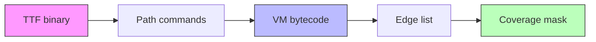
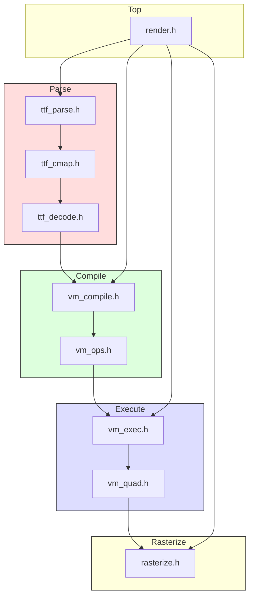
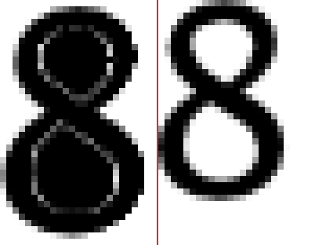
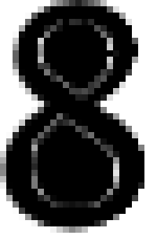
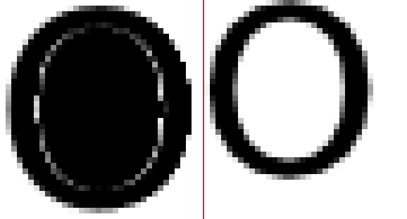

# TTF Glyph-Outline VM Renderer — Architecture and Implementation

This article documents the design and implementation of a minimal TTF font renderer built around a domain-specific glyph-outline virtual machine. The system compiles TTF glyph outlines into compact bytecode, executes the bytecode through a VM that emits geometric edges, and rasterizes those edges with fixed-point arithmetic and subpixel anti-aliasing. The entire pipeline runs without heap allocation on the hot path and uses no floating-point arithmetic, making it suitable for embedded systems.

The reference implementation is 2,200 lines of C++17 across 12 header files, compiles with `-fno-exceptions -fno-rtti`, and renders all 666 glyphs of Go-Regular.ttf at 48px with 8× subpixel anti-aliasing.

> [!summary]
> - The renderer converts TTF binary glyph data into a compact delta-encoded bytecode format, then executes that bytecode to produce edges, which are scanline-rasterized with non-zero winding fill.
> - Fixed-point 26.6 arithmetic throughout the hot path eliminates floating-point dependency and produces deterministic results across platforms.
> - The critical bugs encountered — a wrong flag bit for repeat encoding, and a missing winding negation on edge normalization — illustrate how TTF's binary format and the non-zero winding fill rule interact in subtle ways.

## Why this project exists

Font rendering on embedded systems typically depends on one of two approaches: pre-rendered bitmap fonts (fast but inflexible) or ported copies of FreeType/stb_truetype (correct but heavy). This project explores a third path: compile TTF glyph outlines into a domain-specific bytecode at load time, then render from that bytecode at runtime. The bytecode is compact (average 109 bytes per glyph for Go-Regular), the VM is simple (15 opcodes), and the rasterizer uses only integer arithmetic.

The design is not a general-purpose stack machine. It is a domain-specific instruction set where every opcode encodes a geometric operation with relative coordinate deltas. This specialization produces smaller bytecode and simpler execution than a generic VM would.

## When to use this pattern

Use a compile-then-execute font renderer when:

- you need to render text on a system without an FPU or with strict determinism requirements
- you want to avoid the code size and complexity of FreeType (~100K lines) or even stb_truetype (~5K lines)
- you can afford a one-time compilation step at font load time
- you need predictable, bounded memory usage per glyph

Do not use this pattern when:

- you need hinting (TrueType instruction interpretation) — this system discards hinting bytecode at compile time
- you need sub-pixel positioning at arbitrary fractional advances — the current design renders at integer pixel positions
- you must render fonts you have not pre-compiled — the compilation step is required before any rendering

## Core mental model

The pipeline has four stages. Each stage transforms data from one representation to the next, and each representation is smaller or more specialized than the one before it.



1. **TTF binary → Path commands**: The decoder reads the binary `glyf` table, extracts flag bytes and coordinate deltas, and produces absolute path commands (MOVE, LINE, QUAD, CLOSE).
2. **Path commands → VM bytecode**: The compiler applies optimization passes (zero-length removal, horizontal/vertical line detection, I8/I16 operand size selection) and emits compact delta-encoded bytecode.
3. **VM bytecode → Edge list**: The VM interprets bytecode, maintains pen state, applies coordinate transforms, and emits edges (line segments) for the rasterizer.
4. **Edge list → Coverage mask**: The rasterizer sorts edges by Y, computes scanline crossings, and fills pixels according to the non-zero winding rule with subpixel anti-aliasing.

The key insight is that stages 2 and 3 are lossless transformations: the bytecode encodes exactly the same geometry as the original path, just in a more compact form. Stage 4 is where approximation occurs — Bézier curves are flattened into line segments, and continuous geometry is discretized into pixels.

## Architecture



Each box is a single header file. There are no .cpp files for the library — all implementation lives in headers, and only `main.cpp` and `batch_render.cpp` are compilation units. This is a deliberate choice for an embedded library: the consumer includes one header and gets the full implementation.

### Source file map

| File | Lines | Responsibility |
|------|-------|---------------|
| `vm_types.h` | 130 | Fixed-point types, Transform, Edge, EdgeBuffer, CoverageMask |
| `vm_ops.h` | 85 | 15-opcode spec, BytecodeReader/Writer |
| `ttf_parse.h` | 157 | Binary table parser (head/maxp/loca/glyf/cmap/hhea/hmtx) |
| `ttf_cmap.h` | 113 | Character-to-glyph mapping (format 4 + format 12) |
| `ttf_decode.h` | 385 | Simple + compound glyph decoder |
| `vm_compile.h` | 463 | Path→bytecode compiler with optimization passes |
| `vm_exec.h` | 171 | VM interpreter with pen state, transform stack |
| `vm_quad.h` | 213 | Adaptive Bézier flattening + execute loop |
| `rasterize.h` | 227 | Scanline rasterizer with subpixel AA |
| `render.h` | 250 | Top-level CompiledFont API |

## Implementation details

### Fixed-point 26.6 arithmetic

The renderer uses fixed-point arithmetic with 6 fractional bits throughout the hot path. A 26.6 fixed-point number stores the integer part in the upper 26 bits and the fractional part in the lower 6 bits. The value 1.0 is represented as `64` (which is `1 << 6`). Half a pixel is `32` (`FIXED_HALF`).

The choice of 26.6 is not arbitrary. TTF fonts use integer font units (typically 2048 units per em). At 48 pixels per em, the scale factor is `48/2048 ≈ 0.02344`. A font-unit delta of 1 maps to `0.02344 × 64 = 1.5` in 26.6 — still representable. The maximum coordinate at 48px is `2048 × 1.5 = 3072` in 26.6, well within int32 range.

The critical operations are:

```
// Multiply font units by scale (26.6 × 26.6 → 26.6)
fixed_t scale_font_units(int32_t font_units, fixed_t scale) {
    return (fixed_t)(((int64_t)font_units * scale) >> FRAC_BITS);
}

// Round 26.6 to nearest integer pixel
int pixel_x = fixed_x >> FRAC_BITS;  // truncate toward zero
```

The multiply uses a 64-bit intermediate to avoid overflow. Two 26.6 numbers multiplied produce a 52.12 result; the right-shift by 6 brings it back to 26.6. This is the standard fixed-point multiply pattern.

### TTF binary parsing

TTF files are big-endian binary with a table directory at the top. The parser does not copy data — it stores pointers into the original buffer and reads fields on demand.

The relevant tables are:

| Table | Contents |
|-------|----------|
| `head` | unitsPerEm, indexToLocFormat |
| `maxp` | numGlyphs |
| `loca` | Glyph offsets (short or long format) |
| `glyf` | Glyph outline data |
| `cmap` | Unicode → glyph ID mapping |
| `hhea` | ascender, descender, numOfLongHorMetrics |
| `hmtx` | Advance widths and left side bearings |

The `loca` table is an array of offsets into `glyf`. For short format (indexToLocFormat=0), each entry is a uint16 that must be multiplied by 2 to get the byte offset. For long format (indexToLocFormat=1), each entry is a uint32 byte offset directly. Getting this wrong produces garbage glyph data — a bug that cost significant debugging time.

### TTF glyph flag encoding

Each simple glyph in the `glyf` table stores its outline as a sequence of on-curve and off-curve points. The coordinates are delta-encoded (relative to the previous point), and a flag byte per point specifies how to decode each coordinate.

The flag byte layout:

| Bit | Mask | Meaning |
|-----|------|---------|
| 0 | 0x01 | On-curve point |
| 1 | 0x02 | X coordinate is 1 byte (uint8) |
| 2 | 0x04 | Y coordinate is 1 byte (uint8) |
| 3 | 0x08 | Repeat flag — next byte is repeat count |
| 4 | 0x10 | X is positive (if bit 1 set) or same as previous (if bit 1 clear) |
| 5 | 0x20 | Y is positive (if bit 2 set) or same as previous (if bit 2 clear) |
| 6 | 0x40 | Overlap flag (ignored for rendering) |
| 7 | 0x80 | Reserved / cubic flag in glyf v2 |

The repeat mechanism is essential for efficiency: if multiple consecutive points share the same flag byte, the flag is written once followed by a count byte. A count of N means the flag applies to N+1 points total (1 original + N repeats).

**This was the first critical bug.** The original code used `0x80` as the repeat flag bit, following an ambiguous reading of the OpenType specification. The actual repeat flag is bit 3 (`0x08`). Using `0x80` meant that no flag bytes were ever expanded through the repeat mechanism, causing the coordinate parser to read too many flag bytes and consume data from the coordinate section. For glyphs like 'l' (U+006C) where the flag `0x1e` has bit 3 set, the parser missed the repeat expansion and produced garbage coordinates — X values of 5165 instead of 351.

The fix was a single line change, but finding it required tracing fonttools' source code to determine the authoritative bit assignments. When the specification is ambiguous, the behavior of existing parsers (fonttools, FreeType) defines the standard.

### Compound glyphs and VM CALL opcodes

TTF supports compound glyphs — glyphs composed from other glyphs via component references with optional transforms. The decoder resolves these recursively, producing path commands that reference sub-glyphs. The compiler emits three call opcodes:

| Opcode | Operands | Use case |
|--------|----------|----------|
| CALL | glyph_id:u16 | Sub-glyph with no transform |
| CALL_XY | glyph_id:u16, dx:i16, dy:i16 | Sub-glyph with offset only |
| CALL_MAT | glyph_id:u16, a,b,c,d:i16, dx:i16, dy:i16 | Sub-glyph with 2×2 matrix + offset |

Compound glyphs like 'é' (U+00E9) are composed from 'e' and the acute accent. The CALL_XY opcode tells the VM to execute glyph 72 (the 'e') and then glyph 170 (the accent) with a vertical offset. At runtime, the VM pushes a transform onto the stack, executes the sub-glyph's bytecode, and pops the transform.

### Bytecode compilation and optimization

The compiler transforms absolute path commands into delta-encoded bytecode. For each path command, it computes the delta from the current pen position and selects the smallest operand size that can represent it.

The optimization pipeline:

1. **Zero-length removal**: Drop LINE commands where the endpoint equals the current point. These arise from TTF's implicit on-curve point resolution and from CLOSE commands that return to the MOVE point.
2. **Horizontal/vertical line detection**: Replace LINE with HLINE or VLINE when one component of the delta is zero. This saves one operand per command.
3. **I8/I16 selection**: Use 8-bit signed deltas when the delta fits in [-128, 127], otherwise use 16-bit signed deltas. The opcode encodes which size is used, so the VM knows how many bytes to read.

Example: the letter 'A' compiles to 56 bytes of bytecode:

```
  0 | MOVE_I8      dx=19   dy=0      → (19,0)
  3 | LINE_I16     dx=562   dy=1480   → (581,1480)
  8 | HLINE_I16    dx=208             → (789,1480)
 11 | LINE_I16     dx=553   dy=-1480  → (1342,0)
 ...
 54 | CLOSE       
 55 | END         
```

The MOVE_I8 at offset 0 uses 3 bytes (opcode + 2 × i8). The LINE_I16 at offset 3 uses 5 bytes (opcode + 2 × i16). The HLINE_I16 at offset 8 uses 3 bytes (opcode + 1 × i16) — saving 2 bytes by omitting the Y operand.

### Edge-emitting VM execution

The VM is not a general stack machine. It has a pen position (x, y), a scale factor, an optional 2×2 transform, and a pointer to a glyph table for CALL resolution. Each opcode modifies the pen and optionally emits an edge.

An edge is a directed line segment from (x0, y0) to (x1, y1) with a winding value (+1 or -1). The winding encodes the direction the edge was drawn: left-to-right or right-to-left relative to the scanline. This direction matters for the non-zero winding fill rule.

The VM's execute loop:

```
for each instruction:
    decode opcode
    read operands (delta-encoded)
    compute absolute position: new_x = pen_x + dx, new_y = pen_y + dy
    if LINE/HLINE/VLINE: emit edge from (pen_x, pen_y) to (new_x, new_y)
    if QUAD: flatten Bézier curve and emit edges for each line segment
    if CALL: push transform, execute sub-glyph bytecode, pop transform
    update pen position
```

The QUAD opcode triggers adaptive Bézier flattening. The flattening algorithm recursively subdivides the quadratic Bézier curve until the maximum deviation from the chord falls below a threshold (1/8 pixel in 26.6). Each subdivision produces either two shorter Bézier segments (continue recursing) or a line segment (emit edge).

### Y-axis flip and winding

TTF fonts use a Y-up coordinate system: the baseline is at Y=0, ascenders have positive Y. Screen coordinates are Y-down: row 0 is the top of the image. The renderer must flip the Y axis.

The flip is applied after VM execution, not during it. The VM produces edges in font-space (Y-up). Then the render loop flips all edge Y coordinates:

```
for each edge:
    edge.y0 = font_y_max - edge.y0
    edge.y1 = font_y_max - edge.y1
    edge.winding = -edge.winding
```

Negating the winding is necessary because the Y-flip reverses the direction of every edge. An edge that went upward (positive Y) now goes downward, and its crossing direction changes. The winding negation compensates.

**This was the second critical bug — or rather, half of it.** The Y-flip negation in `render.h` was correct. But the rasterizer's edge normalization step introduced a second direction reversal that required an additional winding negation, and that second negation was missing.

### The rasterizer: scanline non-zero winding fill

The rasterizer processes one pixel row at a time. For each row, it subdivides the row into `aa_level` sub-rows (8 for 8× anti-aliasing), computes edge crossings at each sub-row, and accumulates coverage.

The core algorithm for one sub-row:

1. Collect all edges that cross the sub-row's Y range.
2. Compute the X-intersection of each edge at the sub-row's Y position.
3. Sort intersections by X.
4. Walk the sorted intersections left to right, maintaining a running winding count.
5. Between any two consecutive intersections where the winding is non-zero, fill pixels with coverage proportional to the span.

The non-zero winding fill rule: a pixel is inside the glyph if the winding count at that point is non-zero. For a simple outer contour drawn clockwise, every crossing adds +1 to the winding on the left edge and -1 on the right edge. Between the two crossings, winding = 1 (inside). Outside both crossings, winding = 0 (outside). For a contour with a hole (inner contour drawn counter-clockwise), the inner crossings cancel the outer winding in the hole region, producing winding = 0 (outside) inside the hole.

### The winding normalization bug

The rasterizer sorts edges by their topmost Y coordinate. To do this, it normalizes every edge so that `y0 ≤ y1` by swapping the endpoints if necessary. When endpoints are swapped, both the X and Y coordinates swap: an edge that went from (100, 50) to (80, 100) becomes (80, 100) to (100, 50).

Swapping X coordinates reverses the horizontal direction of the edge. An edge that crossed the scanline left-to-right now crosses right-to-left. This changes the winding contribution of that edge at the crossing point. Therefore, **the winding must be negated when endpoints are swapped**.

The original code did not negate winding on swap. This meant that for edges going downward after the Y-flip (which is most edges in a typical glyph), the normalization swap produced edges with the wrong winding sign. The fill algorithm then filled regions that should have been holes.



The image above shows the artifact: the upper and lower counters of '8' have gray horizontal lines where the hole should be white. The gray value of 31/255 (approximately 1/8 coverage) indicates that one sub-row out of eight was incorrectly filling the counter — a single spurious crossing with wrong winding was enough.

After the fix — negating winding on swap in `sort_edges_by_y()` — the counters render cleanly:



### Near-coincident crossings and the merge filter

Even with correct winding, the rasterizer can produce artifacts from near-coincident edge crossings. When a Bézier curve is flattened into line segments, some segments are nearly horizontal. These segments span a very small Y range — sometimes less than one sub-row — and appear as crossings at specific sub-rows but not others. At those sub-rows, two crossings that should be coincident are actually 0.05–0.12 pixels apart, creating a thin fill sliver.

The fix is a post-sort merge step: after sorting crossings by X, consecutive crossings within 0.125 pixels of each other are merged into a single crossing whose winding is the sum of the merged windings. This eliminates spurious fill slivers while preserving correct fill for normal-width strokes.

### Disabled winding normalization

The compiler originally included an `opt_normalize_winding` pass that detected contours with the "wrong" winding direction and reversed them. The logic was: if a contour has the same signed area as the first contour, reverse it. This works for glyphs with one outer contour and one inner contour (like 'O'), but fails for glyphs with multiple disconnected outer contours (like '8', which has two circles, or 'B', which has two bumps).

For '8', the second outer contour (the lower circle) had the same sign as the first (the upper circle), so the normalization reversed it. This reversed the lower circle's winding, causing the rasterizer to fill its counter incorrectly. The fix was to disable `opt_normalize_winding` entirely. The TTF specification defines contour directions that are already correct for non-zero winding fill: outer contours wind one way, inner contours wind the opposite way. No normalization is needed.

### Rendering comparison with stb_truetype

The batch renderer produces side-by-side comparison images against stb_truetype, the widely-used single-header reference renderer. The two renderers use fundamentally different rasterization strategies:

| Aspect | TTF-VM | stb_truetype |
|--------|--------|--------------|
| AA method | 8× subpixel supersampling | Sample at pixel center with coverage proportional to area |
| Coordinate precision | 26.6 fixed-point | Float |
| Curve flattening | Adaptive subdivision to 1/8px | Fixed subdivision to 1/8px |
| Fill rule | Non-zero winding | Non-zero winding |
| Memory model | Static allocation, no heap | malloc/free |



The remaining visual differences come from two sources: (1) sub-pixel positioning — stb_truetype places edges at slightly different X positions due to float rounding, and (2) coverage calculation — stb_truetype computes the fraction of each pixel covered by the fill region, while the supersampling approach averages the coverage of 8 discrete sub-rows. Both approaches produce correct anti-aliased output, but the exact gray values differ at edge pixels.

### The glyph atlas and disassembly

The batch renderer also produces a disassembly of each glyph's VM bytecode. For example, the letter 'l' (U+006C, glyph ID 79) compiles to 68 bytes:

```
  0 | MOVE_I16     dx=351   dy=336    → (351,336)
  3 | VLINE_I16    dy=-124            → (351,212)
  6 | LINE_I16     dx=172   dy=-50    → (523,162)
 11 | HLINE_I16    dx=0               → (523,162)
 14 | VLINE_I16    dy=25             → (523,187)
 17 | HLINE_I16    dx=-22            → (501,187)
 ...
 54 | LINE_I16     dx=-197  dy=0      → (154,212)
 57 | VLINE_I16    dy=124            → (154,336)
 60 | HLINE_I16    dx=197            → (351,336)
 63 | CLOSE       
 64 | END         
```

The VLINE at offset 3 uses 3 bytes (opcode + 1 × i16) instead of 5 for a full LINE — a 40% reduction. The compiler's HLINE/VLINE detection pass finds these opportunities automatically.

### Font statistics

For Go-Regular.ttf (666 glyphs):

| Metric | Value |
|--------|-------|
| Simple glyphs | 513 |
| Compound glyphs | 153 |
| Total bytecode | 72,617 bytes |
| Average bytecode | 109 bytes/glyph |
| Maximum bytecode | 1,038 bytes |

The 153 compound glyphs use CALL/CALL_XY opcodes that reference sub-glyphs, so their bytecode is small even though the rendered geometry is complex.

## Common failure modes

### Wrong flag bit for repeat encoding

The OpenType specification's description of the flag byte repeat mechanism is ambiguous about which bit signals a repeat. If you use `0x80` instead of `0x08`, no flag bytes will be expanded through the repeat mechanism. The parser will then consume too many flag bytes and read into the coordinate data, producing garbage coordinates for any glyph whose flag bytes have bit 3 set.

This bug is silent for simple glyphs (few points, simple flag patterns) and manifests only for glyphs with repeated flag values — typically glyphs with curves that produce many off-curve points with similar flags.

### Missing winding negation on edge swap

When the rasterizer normalizes edges by swapping endpoints (to ensure `y0 ≤ y1`), it must also negate the winding value. The swap reverses the horizontal direction of the edge, which changes the edge's crossing direction at any scanline. Without the negation, edges that were going downward before normalization have the wrong winding sign, causing the fill algorithm to fill holes.

This bug produces gray horizontal lines at counter boundaries — the exact value depends on how many sub-rows are affected, but the pattern is consistent: partial coverage where there should be none, in regions bounded by inner contour edges.

### Winding normalization on multi-contour glyphs

Any optimization that reverses contours based on their signed area must distinguish between inner contours (holes inside an outer contour) and separate outer contours (independent shapes like the two circles of '8'). Reversing all contours with the same sign as the first contour is incorrect: it reverses separate outer contours that happen to wind the same way. For non-zero winding fill, the TTF specification's contour directions are already correct, and no normalization is needed.

## Working rules

- The repeat flag in TTF glyph flag bytes is bit 3 (`0x08`), not bit 7. When the spec is ambiguous, the behavior of fonttools and FreeType defines the standard.
- When swapping edge endpoints to normalize direction, always negate the winding. The swap reverses the horizontal crossing direction.
- For non-zero winding fill, do not normalize contour winding directions. The TTF spec already provides correct directions.
- Use fixed-point 26.6 for all coordinate computation on the hot path. Float introduces platform-dependent rounding and prevents deterministic rendering.
- Compile glyphs once at load time, render many times from bytecode. The compilation cost is amortized across all subsequent renders.
- Drop hinting bytecode at compile time. Hinting is not needed for anti-aliased rendering at typical sizes (16–64px), and interpreting it would add significant complexity.

## Near-term next steps

- Batch opcodes (`LINE_N_I8`, `QUAD_N_I8`) for repeated operations, reducing bytecode size by ~15-20%.
- Benchmark against stb_truetype on the same font and size to quantify throughput.
- Zero-allocation embedded API variant: template-sized buffers with no heap on the hot path (partially done with `VM_STATIC_ALLOC`).
- Go harness: keep the C++ VM and rasterizer as a static library with C ABI, wrap via CGo for Go-based testing and integration.
- Direct PNG output via stb_image_write (already integrated in batch_render.cpp) to eliminate the ImageMagick dependency.

## Important project docs

- Design doc: `ttmp/2026/05/29/TTF-VM-001--high-performance-embedded-minimal-ttf-renderer-with-glyph-outline-vm/design-doc/01-architecture-and-implementation-guide.md` (~70KB)
- Investigation diary: `ttmp/2026/05/29/TTF-VM-001--high-performance-embedded-minimal-ttf-renderer-with-glyph-outline-vm/reference/01-investigation-diary.md`
- Debug scripts: `ttmp/2026/05/29/TTF-VM-001--high-performance-embedded-minimal-ttf-renderer-with-glyph-outline-vm/scripts/` (11 scripts with compile commands)
- Glyph atlas: `ttmp/2026/05/29/TTF-VM-001--high-performance-embedded-minimal-ttf-renderer-with-glyph-outline-vm/glyph-atlas/glyph-atlas.md`
