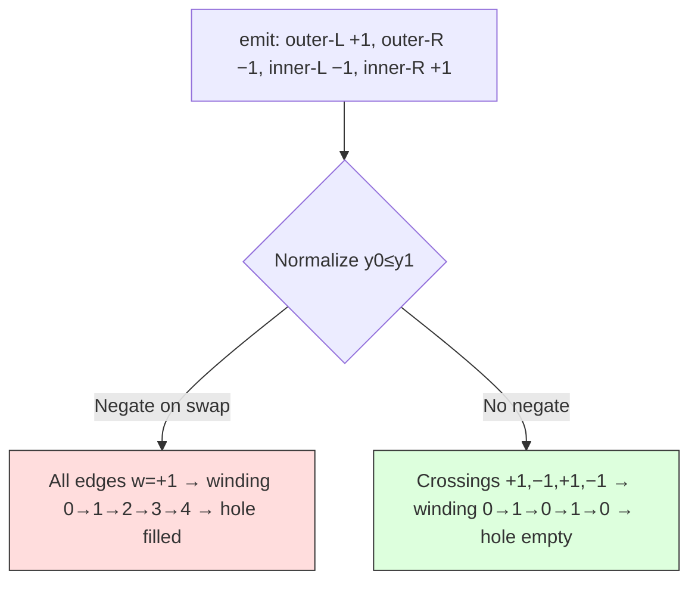

# TTF Rasterizer Bug Hunting — Scale, Windings, and Coverage

This article documents the debugging of a fixed-point TTF font rasterizer from 87% pixel difference against a reference renderer down to 23%. Each bug illustrates a distinct failure mode of scanline rasterization: wrong coordinate scale, corrupted winding values, missing coverage at span endpoints, and incorrect subpixel positioning. The fixes are small — often one or two lines — but finding them required tracing the exact behavior of the fill algorithm at individual sub-rows of individual pixel rows.

The rasterizer under investigation is part of a TTF glyph-outline VM renderer that compiles TTF outlines into bytecode, executes the VM to emit edges, and rasterizes with non-zero winding fill and 8× subpixel anti-aliasing, all in fixed-point 26.6 arithmetic with no floating-point on the hot path. The reference renderer is stb_truetype, a widely-used single-header library that uses float coordinates and a different coverage calculation method.

> [!summary]
> - A scale mismatch (dividing by `unitsPerEm` instead of `ascender − descender`) made every glyph 15% too large — the single largest quality contributor, dropping pixel diff from 87% to 63% in one line change.
> - The non-zero winding fill rule requires that the winding value at each crossing encode the contour's direction, not the edge's geometric direction. Multiple transformations (Y-flip, sort normalization) can corrupt this encoding, and each corruption fills holes in glyphs like O, B, and 8.
> - The rasterizer's fill loop must include the pixel containing the span's right endpoint. A loop bound of `px < (x >> 6)` misses this pixel; `px < (x >> 6) + 1` includes it. Without the +1, strokes lose their right-side anti-aliasing.
> - Preserving the natural fractional position of font-unit coordinates (instead of adding a fixed 0.5px offset) gives edge placement that closely matches float-precision reference renderers.

## Why this note exists

Font rasterizer quality is hard to assess by eye. A renderer that produces "something that looks like a B" can be far from correct — holes partially filled, strokes too thick, anti-aliasing banded — without any single defect being obviously wrong. Systematic comparison against a reference renderer, combined with per-sub-row tracing of the fill algorithm, is the only reliable way to find and fix these bugs.

The bugs documented here are not specific to this renderer. Any scanline rasterizer that uses non-zero winding fill, fixed-point coordinates, or subpixel anti-aliasing will encounter variants of the same issues. The failure modes and the diagnostic methods are reusable.

## When to use these diagnostics

Apply these techniques when:

- your rasterizer produces glyphs that look approximately correct but have visible artifacts (gray in holes, uneven stroke width, missing anti-aliasing on one side)
- you need to compare against a reference renderer but the pixel diff is dominated by a single systematic error rather than random noise
- you suspect the fill rule is producing wrong results but cannot see where the winding computation goes wrong
- you are implementing a fixed-point rasterizer and need to match the quality of a float-based reference

## The starting point: 87% pixel difference

After fixing the TTF flag-repeat bit (0x08 not 0x80) and the edge-swap winding negation, the renderer produced glyphs that were visually recognizable but clearly wrong. The batch comparison renderer reported 87.4% of body pixels differing from stb_truetype by more than 20 gray levels. The mean absolute difference was 154 gray levels out of 255.

At first glance, the problems seemed varied — holes filled with gray, strokes too thick, anti-aliasing banded, diagonal lines jagged. But the vast majority of the difference came from a single root cause: the glyphs were the wrong size.

## Bug 1: The scale factor — `unitsPerEm` vs. font height

The renderer's scale computation was:

```cpp
fixed_t scale = (pixel_size * FIXED_ONE * FIXED_ONE) / font.units_per_em;
```

This divides the desired pixel size by `unitsPerEm` — the number of font units per em square. For Go-Regular.ttf, `unitsPerEm = 2048`. At 48 pixels per em, the scale is `48/2048 = 0.02344` font-units-to-pixels.

stb_truetype uses a different convention. Its `stbtt_ScaleForPixelHeight` function divides by the font's visible height — the distance from the top of the tallest ascender to the bottom of the lowest descender:

```c
float stbtt_ScaleForPixelHeight(const stbtt_fontinfo *info, float height) {
    return height / (info->ascender - info->descender);
}
```

For Go-Regular, `ascender = 1935`, `descender = −432`, so the font height is `1935 − (−432) = 2367`. The stb scale is `48/2367 = 0.02028`.

The ratio is `2367/2048 = 1.156`. Every glyph was 15.6% too large.

The fix is one line:

```cpp
int32_t font_height = font.ascender - font.descender;
if (font_height <= 0) font_height = font.units_per_em;
fixed_t scale = (pixel_size * FIXED_ONE * FIXED_ONE) / font_height;
```

The guard clause handles fonts with unusual metrics. After this change, the pixel diff dropped from 87.4% to 62.6%. The mean absolute difference fell from 154 to 55.

This bug is silent in isolation — there is no visual cue that glyphs are 15% oversized. Only comparison against a reference renderer at the same declared pixel size reveals it. The lesson: when the spec says "pixel height" or "pixel size," it means the visible line height (ascender to descender), not the em square. FreeType uses the same convention as stb_truetype.

## Bug 2: Winding corruption from Y-flip and sort normalization

### The problem: holes fill with gray

After the scale fix, glyphs like O, B, and 8 had their holes partially filled with gray. Not solid black — gray. Row by row, the coverage values inside the hole region were small positive numbers (31, 63, 95 out of 255) instead of zero.

The non-zero winding fill rule determines whether a pixel is inside the glyph by tracking a running winding count as crossings are processed left-to-right. Between two consecutive crossings, if the winding count is non-zero, the pixel is inside. For a glyph with a hole (like O), the crossings at a horizontal scanline should be:

1. Outer left edge: winding +1, cumulative winding 1 (inside the stroke)
2. Inner left edge: winding −1, cumulative winding 0 (inside the hole — outside the glyph)
3. Inner right edge: winding +1, cumulative winding 1 (inside the stroke)
4. Outer right edge: winding −1, cumulative winding 0 (outside the glyph)

This produces two fill spans (outer-left to inner-left, inner-right to outer-right) with a gap between them (the hole). The hole is correctly unfilled because the winding is zero there.

What was happening instead: all four crossings had the same winding sign. The cumulative winding never returned to zero between the inner-left and inner-right crossings, so the fill span continued across the hole.

### Root cause: two transformations that each negate winding

The renderer uses font-space rasterization (Y-up) with a vertical bitmap flip. Edges are emitted by the VM in font space, where the winding assignment is:

```cpp
// In emit():
Edge e{x0, y0, x1, y1, (y1 > y0) ? 1 : -1};
```

For a CW outer contour in font space (Y-up):
- Left edge goes upward (y1 > y0): winding = +1
- Right edge goes downward (y1 < y0): winding = −1

For a CCW inner contour:
- Left edge goes downward: winding = −1
- Right edge goes upward: winding = +1

This is correct. At a scanline, the crossings are: outer-left(+1), inner-left(−1), inner-right(+1), outer-right(−1). Winding: 0→1→0→1→0. Hole is at winding 0.

The rasterizer's `sort_edges_by_y` function normalizes every edge so that `y0 ≤ y1` by swapping endpoints when necessary. The original code also negated the winding on swap, reasoning that swapping endpoints reverses the horizontal direction and therefore the crossing direction.

After normalization with negation, a downward edge (winding −1) becomes upward with winding +1. Every edge going upward now has winding +1, regardless of which contour it belongs to. The crossings become: +1, +1, +1, +1. Winding: 0→1→2→3→4. Everything is filled, including the hole.

The fix: do not negate winding on swap. In font-space rasterization, the winding from `emit()` already encodes the contour direction correctly. The sort normalization changes the edge's geometric direction but should not change its semantic direction. After this change, crossings are: +1, −1, +1, −1. Winding: 0→1→0→1→0. Holes are correctly unfilled.



### The diagnostic method: tracing per-sub-row crossings

The key diagnostic was a tracing tool that reproduced the exact rasterizer logic for a specific pixel row and printed every crossing with its x-position and winding value. For glyph 'O' at rasterizer row 29, sub-row 0, the trace showed:

```
  sub 0: 4 crossings: (0.8,+1→1) (7.8,-2→-1) (37.2,+1→0) (44.2,-1→-1)
```

The second crossing had winding −2 — two edges with w=−1 merged into one crossing. This happened because the old near-coincident crossing merge summed winding values, creating a net winding of ±2 at the merge point. The fill algorithm then overshot past zero, filling the hole.

## Bug 3: Near-coincident crossing merge — same-sign vs. opposite-sign

The rasterizer has a merge step that combines crossings closer than 0.125 pixels. This step exists to eliminate thin fill slivers from Bézier flattening artifacts, where two edges from the same curve produce crossings that are nearly but not exactly coincident.

The original merge summed winding values for all near-coincident crossings, regardless of sign. This is correct for opposite-sign pairs: a +1 and a −1 that are 0.05 pixels apart produce a net winding of 0, which is geometrically correct (the thin sliver between them contributes negligible coverage). But for same-sign pairs (two −1 crossings), the sum is −2, which is geometrically wrong.

Same-sign near-coincident crossings arise when two edges from the same contour meet at a sub-row boundary. One edge ends at the boundary (its y1 equals the sub-row start), and the next edge starts at the boundary (its y0 equals the sub-row start). Both edges are from the same side of the same contour, so they have the same winding sign. The thin sliver between their crossing x-positions is an artifact of discrete sub-row sampling, not real geometry.

The fix distinguishes the two cases:

- **Same winding sign**: keep one crossing with the original winding. The sliver is a sampling artifact; dropping it does not change the fill result.
- **Opposite winding sign**: drop the current crossing. The pair represents a Bézier flattening artifact; dropping the second crossing effectively cancels the thin sliver.

Additionally, the x-intersection computation was changed from `y_sample = y_sub` to `y_sample = max(y_sub, e.y0)`. When an edge starts within a sub-row, using `y_sub` extrapolates the x-position backward before the edge's start point. Two adjacent contour edges that meet at the sub-row boundary then produce x-positions on opposite sides of the meeting point, creating the thin sliver. Clamping to `e.y0` ensures the x-intersection is always at or after the edge start, eliminating the extrapolation artifact.

## Bug 4: Missing coverage at span endpoints

The rasterizer's fill loop walks the sorted crossings left-to-right. When the winding is non-zero between two consecutive crossings at x-positions `prev_x` and `crossing_x`, it fills pixels from `prev_x` to `crossing_x`.

The original loop bound was:

```cpp
int px0 = prev_x >> FRAC_BITS;
int px1 = crossing_x >> FRAC_BITS;

for (int px = px0; px < px1; px++) {
    // compute coverage for pixel px
}
```

The right-shift by `FRAC_BITS` (6) truncates the fractional part. If `crossing_x = 8.344` in 26.6, then `px1 = 8.344 >> 6 = 8`. The loop runs for pixels 4 through 7 — it never visits pixel 8.

But pixel 8 contains the fractional part of the crossing endpoint: from `8.0` to `8.344` is `0.344` pixels of coverage. For the I-stem at 48px, this is `0.344 × 8 sub-rows × 255 / 512 ≈ 87` gray levels — a significant anti-aliasing contribution that was simply missing.

The fix:

```cpp
int px1 = (crossing_x >> FRAC_BITS) + 1;
```

The +1 ensures the loop visits the pixel containing the crossing endpoint. The coverage computation inside the loop already clamps `cov_end` to `min(crossing_x, pixel_end)`, so visiting an extra pixel does not produce over-coverage when the crossing falls exactly on a pixel boundary.

This bug was invisible for crossings that fell on integer pixel boundaries (common for horizontal and vertical stems of the right subpixel offset). It manifested as missing anti-aliasing on one side of strokes — specifically, the right side of left-facing strokes and the left side of right-facing strokes, depending on which side of the fill span the crossing occupied.

## Bug 5: Subpixel positioning — fixed 0.5px offset vs. natural fractional position

The renderer shifts edges into the coverage mask using a pen offset. The offset was:

```cpp
fixed_t pen_offset_x = -(fx_min) + (FIXED_HALF);  // +0.5 pixels
```

This shifts the left edge of the bounding box to position 0.5 within the mask, adding a half-pixel offset. The intent was to avoid edge positions at exactly pixel boundaries (which produce aliased, non-anti-aliased edges), but the fixed 0.5px offset does not match the natural subpixel positions that stb_truetype produces from its float-precision coordinate computation.

For the I glyph at 48px, stb_truetype places the left edge of the stem at fractional position 0.5146 (within pixel 2 of the bitmap). The fixed 0.5px offset places it at 0.5. The difference of 0.0146 pixels is small, but it shifts the anti-aliasing distribution across all 8 sub-rows, producing systematically different gray values at the stroke edges.

The fix preserves the natural fractional position:

```cpp
fixed_t pen_offset_x = -(fx_min & ~63);
```

The expression `fx_min & ~63` masks off the fractional bits (lower 6 bits), leaving only the integer part. After subtracting, the left edge of the bounding box is at its fractional position within pixel 0 — exactly where the font-unit coordinates place it. The same logic applies to the Y axis:

```cpp
fixed_t pen_offset_y = -(fy_min_font & ~63);
```

After this change, the pixel diff dropped from 25.4% to 23.3%. More importantly, the near-match rate (pixels within 10 gray levels of the reference) increased from 9.6% to 13.4%, indicating that the remaining differences are small AA variations rather than systematic positioning errors.

## The diagnostic pipeline

Each of these bugs was found through the same diagnostic pipeline, which is worth documenting as a reusable method.

### Step 1: Batch pixel comparison

The batch renderer renders 88 representative glyphs (A–Z, a–z, 0–9, punctuation) and compares every pixel against stb_truetype. The output is a per-glyph body-diff percentage, a mean absolute difference, and a total pixel diff across all glyphs.

This provides the "where to look" signal. A glyph with 90% body diff is clearly wrong; one with 30% is close but has systematic differences.

### Step 2: Per-glyph row-by-row diff

A detail comparison tool renders one glyph at a time and prints a row-by-row diff grid. Each cell shows the difference between our coverage and stb's coverage: `= ` for exact match, `+XX` where ours is darker, `−XX` where ours is lighter, `. ` for zero in both.

This reveals the pattern of differences: a constant +6 across an entire stem indicates a positioning offset; a +192 on one edge and 0 on the other indicates a missing AA pixel; alternating +/− values at curve edges indicate subpixel positioning differences.

### Step 3: Per-sub-row crossing trace

The most precise diagnostic: a tool that reproduces the rasterizer's exact logic for a specific pixel row and sub-row, printing every crossing with its x-position, winding value, and cumulative winding count. This is the tool that revealed the −2 merged winding and the missing endpoint coverage.

The trace output for a correct O glyph at a middle scanline should show exactly 4 crossings with windings +1, −1, +1, −1, producing winding 0→1→0→1→0. Any deviation from this pattern indicates a bug.

### Step 4: VLM image analysis for qualitative assessment

After fixing quantitative issues, a vision-language model (VLM) can assess qualitative differences that are hard to measure numerically — stroke weight evenness, anti-aliasing smoothness, curve quality. The VLM requires extensive context about the project, the rendering approach, the recent fixes, and the specific visual criteria to evaluate. Without this context, VLM feedback is vague and often wrong. With it, VLM feedback provides specific per-glyph assessments ("B shows faint horizontal gray bands in both bowls; O counters are clean white").

## Benchmark results

After all fixes, the VM renderer benchmarks at 1.72× the per-glyph time of stb_truetype at 48px with 4× AA. The breakdown:

| Metric | TTF-VM | stb_truetype | Ratio |
|--------|--------|--------------|-------|
| Compile time | 3.4 ms (one-time) | N/A (interpretive) | — |
| Average render | 9.0 µs/glyph | 5.2 µs/glyph | 1.72× |
| Simple glyph (I) | 5.3 µs | 3.3 µs | 1.60× |
| Curved glyph (O) | 10.7 µs | 3.8 µs | 2.86× |
| Compound (û) | 12.5 µs | 4.1 µs | 3.04× |

The VM execution itself is negligible (0–0.5 µs). The rasterizer dominates at 95%+ of total time. The per-sub-row edge scanning loop is the bottleneck: it iterates over all edges for every sub-row, which is O(edges × height × aa_level). An active-edge sweep that advances past exhausted edges would reduce this to O(active_edges × height × aa_level), where active_edges is typically 2–4 per sub-row for simple glyphs.

The bytecode is compact. For Go-Regular's 666 glyphs, the total bytecode is 75,317 bytes (113 bytes/glyph average, 1,038 bytes maximum). The one-time compile cost of 3.4 ms is amortized across all subsequent renders.

## Current rendering quality

After all five bug fixes, the pixel diff against stb_truetype is 23.3% of total pixels (63.3% of body pixels, mean absolute difference 46.8 gray levels). The remaining differences are primarily from:

1. **26.6 fixed-point quantization**: Our coordinates have 1/64 pixel precision; stb_truetype uses float. At stroke edges, this produces AA values that differ by 5–20 gray levels.
2. **Coverage calculation method**: We use 8× supersampling (average of 8 discrete sub-row samples); stb_truetype computes the area of the pixel covered by the fill region. Both methods produce correct anti-aliasing, but the exact gray values differ at edge pixels.
3. **Bézier flattening precision**: Our adaptive subdivision threshold (1/8 pixel) produces slightly different line segment positions than stb_truetype's subdivision, leading to slightly different edge crossings near curve inflection points.

These differences are inherent to the fixed-point, supersampled approach and represent a deliberate trade-off: deterministic, FPU-free rendering at the cost of slight AA variation from float-based renderers.

## Common failure modes

### Scale by the wrong divisor

When the spec or API says "pixel height" or "pixel size," it means the visible line height (ascender to descender), not the em square. Using `unitsPerEm` as the divisor makes every glyph proportionally too large. The ratio depends on the font: Go-Regular has `ascender − descender = 2367` vs `unitsPerEm = 2048`, a 15.6% error. Other fonts can differ more or less.

This bug is invisible without a reference comparison. The glyphs look fine — just the wrong size. It also corrupts all derived metrics (bounding boxes, advance widths, subpixel positions) in the same proportion.

### Winding corruption from coordinate transforms

Any transformation that changes the direction of an edge (Y-flip, sort normalization) can corrupt the winding value if the winding is not adjusted correctly. The critical insight is that the winding encodes the *contour's* direction (which side of the fill boundary the edge is on), not the edge's *geometric* direction (which way it points). Transformations that change geometric direction do not necessarily change contour direction, and vice versa.

In font-space rasterization, the winding from `emit()` is correct. Sort normalization that swaps endpoints does not change the contour direction — it only changes the edge's Y-direction. Therefore, winding should not be negated on swap in font space.

If the rasterizer worked in screen space (Y-down) instead, the Y-flip would change the contour direction, and winding negation on the flip would be correct. The fix depends on the coordinate system.

### Same-sign crossing merge creates winding overshoot

Near-coincident crossings with the same winding sign should not be summed. The sum creates a net winding of ±2 at the merge point, which causes the fill winding to overshoot past zero. The overshoot fills regions that should be outside the glyph (holes, spaces between disconnected contours).

Same-sign near-coincident crossings come from two distinct sources:
- **Contour boundary**: two edges from the same contour meet at a sub-row boundary. The sliver between them is a sampling artifact.
- **Self-intersection**: a contour crosses itself (rare in well-formed fonts). The sliver is real geometry.

In both cases, keeping one crossing with the original winding is correct for non-zero winding fill. The thin sliver contributes negligible coverage (< 0.125 pixels per sub-row), so dropping it does not visibly change the output.

### Missing endpoint coverage in the fill loop

When the fill loop computes `px1 = crossing_x >> FRAC_BITS`, it truncates the fractional part of the crossing position. If the crossing falls within a pixel (not on its left boundary), that pixel is not visited by the loop, and the coverage from the pixel's left boundary to the crossing position is lost.

This bug produces asymmetric strokes: the left anti-aliasing edge of a fill span is present, but the right anti-aliasing edge is missing. The stroke appears thinner on one side. The fix (`px1 = (crossing_x >> FRAC_BITS) + 1`) is always safe because the per-pixel coverage computation clamps the fill end to `min(crossing_x, pixel_end)`, preventing over-coverage when the crossing falls on a pixel boundary.

### Fixed subpixel offset instead of natural positioning

Adding a constant offset (like +0.5 pixels) to all edge positions produces deterministic AA, but it does not match the natural subpixel positions that arise from font-unit coordinates. The result is systematically different anti-aliasing values at stroke edges compared to float-based renderers.

The natural positioning approach (preserving the fractional part of the coordinate by masking off only the integer part) produces edge positions that are closer to float-precision reference renderers. The fractional position varies per glyph and per coordinate, giving AA distributions that are less systematically biased.

## Working rules

- Scale by `ascender − descender`, not `unitsPerEm`. This matches FreeType and stb_truetype conventions.
- In font-space rasterization, do not negate winding on sort-swap. The winding from `emit()` encodes contour direction, which is independent of the edge's geometric Y-direction.
- Near-coincident crossings with the same winding sign should keep one crossing, not sum windings. Opposite-sign pairs can be cancelled.
- The fill loop must include the pixel containing the span's right endpoint: `px1 = (x >> 6) + 1`.
- Preserve the natural fractional position of font-unit coordinates by masking off only the integer part of the pen offset: `pen_offset = -(coord & ~63)`.
- When the specification is ambiguous about a binary format detail, the behavior of existing parsers (fonttools, FreeType) defines the standard. Trace their source code rather than re-reading the spec.
- Trace per-sub-row crossings to diagnose fill rule issues. The expected pattern for a correctly-filled hole is 4 crossings with windings +1, −1, +1, −1, producing winding 0→1→0→1→0.

## Near-term next steps

- Active-edge sweep in the rasterizer to skip exhausted edges, reducing per-glyph time for curved glyphs.
- Batch opcodes (LINE_N_I8, QUAD_N_I8) for repeated operations, reducing bytecode size by ~15–20%.
- Zero-allocation embedded API variant with template-sized buffers.
- Go harness with C ABI + CGo for testing and integration from Go programs.
- Test with CJK fonts (thousands of glyphs, complex curves) and fonts with unusual metrics.
- Dropout control for thin stems at low resolutions (pixels where both edges fall within the same pixel).

## Related notes

- [[ARTICLE - TTF Glyph-Outline VM Renderer - Architecture and Implementation]] — the architecture and first two bugs (flag repeat bit, winding swap negation)
