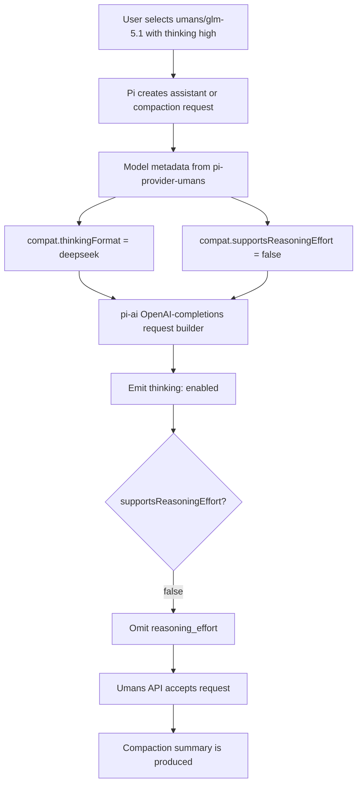

# Pi Core Umans GLM DeepSeek Reasoning Fix Report

The first Umans GLM compaction report described a workaround in the `compaction-title` extension. That workaround was correct, but it was intentionally local: it prevented one extension-owned compaction call from sending a bad request. This report describes the second phase, where the failure was fixed at the request-construction boundary in `@earendil-works/pi-ai`, then validated in the installed Pi runtime with a real `/compact` run.

> [!summary]
> The real fix is a contract between Pi core and provider metadata.
> 1. `pi-ai` now treats `compat.supportsReasoningEffort` as authoritative in the DeepSeek request branch.
> 2. `pi-provider-umans` now advertises `supportsReasoningEffort: false` for fallback and dynamically discovered Umans models.
> 3. The installed global Pi runtime was patched from the local `pi-ai` branch and successfully compacted an interactive `umans/umans-glm-5.1` session.
> 4. The validation evidence is in `/tmp/pi-umans-compaction-test-capture.txt` and the docmgr ticket `UMANS-GLM-COMPACTION`.

## Why the workaround was not enough

A workaround is useful when it narrows a failure quickly. The `compaction-title` extension did exactly that: it stopped passing Pi's thinking level into its own internal Umans title-generation compaction call. For the title path, that avoided the invalid pair of request fields:

```json
{
  "thinking": { "type": "enabled" },
  "reasoning_effort": "high"
}
```

The problem is that the extension was not the owner of the invariant. The invariant belongs lower in the stack: if a model says it does not support `reasoning_effort`, the request builder must not send `reasoning_effort`. A caller should not have to remember which providers reject which fields. It should pass a model, a thinking level, and a message list; the provider adapter should translate those into the legal wire format.

That distinction matters because Pi has more than one path to model calls. A normal assistant turn, an explicit `/compact`, auto-compaction, title generation, and future background summarizers can all need a model request. If compatibility is enforced only in one extension, the next code path can rediscover the same bug. If compatibility is enforced where payloads are built, every path benefits.

## The core mental model

Pi exposes a stable user setting: a thinking level such as `off`, `high`, or `xhigh`. Providers do not expose a stable protocol. One OpenAI-compatible server wants `reasoning_effort`. Another wants `thinking`. OpenRouter wants a nested `reasoning` object. Some local or vendor-specific endpoints want `enable_thinking`. Pi's job is to translate one user intent into many provider-specific payload shapes.

The translation boundary is the model compatibility object. It is not just descriptive metadata. It is an executable contract that tells the request builder which fields are legal.

```ts
compat: {
  supportsDeveloperRole: false,
  supportsReasoningEffort: false,
  thinkingFormat: "deepseek",
  requiresReasoningContentOnAssistantMessages: true,
}
```

This object says four things. The provider does not accept the OpenAI `developer` role. It does not accept `reasoning_effort`. It wants DeepSeek-style thinking controls. It needs assistant replay messages to carry `reasoning_content` when reasoning is enabled. The bug was that the DeepSeek branch listened to `thinkingFormat` but ignored `supportsReasoningEffort`.

## The failing request path

The failing path starts with a high-level action, not a malformed JSON object. The user triggers compaction. Pi builds a summarization request. The selected model is `umans/umans-glm-5.1`. The model is reasoning-capable. The thinking level is enabled. The OpenAI-completions adapter sees `thinkingFormat: "deepseek"` and emits DeepSeek-style thinking.

Before the fix, the same branch also emitted `reasoning_effort` whenever a thinking level was present.

```ts
// Before the patch.
if (compat.thinkingFormat === "deepseek" && model.reasoning) {
  (params as any).thinking = { type: options?.reasoningEffort ? "enabled" : "disabled" };
  if (options?.reasoningEffort) {
    (params as any).reasoning_effort =
      model.thinkingLevelMap?.[options.reasoningEffort] ?? options.reasoningEffort;
  }
}
```

This code assumes that DeepSeek-style thinking and OpenAI-style effort can coexist. That is true for some endpoints and false for Umans. The Umans endpoint rejected the request before summarization began:

```text
400 cannot specify both 'thinking' and 'reasoning_effort'
```

The important part of the error is not only that two fields conflict. It is that the conflict was generated by a provider adapter that already had the information required to avoid it.

## The corrected invariant

The corrected invariant is small enough to write as one sentence:

> In the DeepSeek request branch, send `thinking` according to `thinkingFormat`, but send `reasoning_effort` only when compatibility metadata says the provider supports it.

The source patch is in:

```text
/home/manuel/code/wesen/2026-05-29--pi-deepseek-reasoning-fix/packages/ai/src/providers/openai-completions.ts
```

The local branch is:

```text
fix/deepseek-reasoning-effort
```

The commit is:

```text
1cf2c943d7205e66f739aba90f355a76deee59df — fix(ai): respect deepseek reasoning effort compat
```

The change is deliberately narrow:

```ts
// After the patch.
if (compat.thinkingFormat === "deepseek" && model.reasoning) {
  (params as any).thinking = { type: options?.reasoningEffort ? "enabled" : "disabled" };
  if (options?.reasoningEffort && compat.supportsReasoningEffort) {
    (params as any).reasoning_effort =
      model.thinkingLevelMap?.[options.reasoningEffort] ?? options.reasoningEffort;
  }
}
```

The request still contains `thinking`. It still supports providers that accept `reasoning_effort`. It only removes `reasoning_effort` for models whose merged compatibility object says the field is unsupported.

## Why this patch has to be paired with provider metadata

A request builder cannot infer every provider's behavior from `thinkingFormat` alone. `thinkingFormat: "deepseek"` says which field should carry the on/off thinking control. It does not answer whether the endpoint also accepts OpenAI's `reasoning_effort`. Those are separate capabilities.

That is why the provider patch matters. `pi-provider-umans` previously set `supportsReasoningEffort: true` for its fallback models and dynamic model mapper. With the Pi AI guard in place, that metadata would still tell Pi to send the rejected field.

The provider patch is in:

```text
/home/manuel/code/wesen/2026-05-29--pi-provider-umans-reasoning-fix
```

The branch is:

```text
fix/reasoning-effort-compat
```

The commit is:

```text
2ec50df66f5ccc6eab8533fb66e540b6e199252e — fix: disable reasoning_effort for Umans models
```

The resulting contract is uniform for fallback and dynamically discovered Umans models:

```ts
compat: {
  supportsDeveloperRole: false,
  supportsReasoningEffort: false,
  thinkingFormat: "deepseek",
  requiresReasoningContentOnAssistantMessages: true,
}
```

The existing provider hook that strips `reasoning_effort` remains useful. It protects older Pi AI versions that do not yet honor the compatibility flag. But after the core fix, the hook becomes a defensive backstop rather than the primary correctness mechanism.

## The architecture after the fix

The final system has two cooperating layers. The provider declares what its endpoint supports. Pi AI builds a request that respects that declaration. The extension can stop carrying provider-specific compatibility logic over time, because the core path becomes correct.



The fix is not a special case for `umans-glm-5.1`. It is a general rule for OpenAI-compatible DeepSeek-style providers that distinguish thinking controls from effort controls. Umans is the concrete provider that exposed the bug, but the corrected boundary is broader.

## Regression testing the request shape

The unit test added to `packages/ai/test/openai-completions-tool-choice.test.ts` constructs a small OpenAI-completions model with the important compatibility fields:

```ts
compat: {
  supportsDeveloperRole: false,
  supportsReasoningEffort: false,
  thinkingFormat: "deepseek",
}
```

It then calls `streamSimple` with `reasoning: "high"` and captures the outgoing payload through `onPayload`. The assertion is the exact contract:

```ts
expect(params.thinking).toEqual({ type: "enabled" });
expect(params.reasoning_effort).toBeUndefined();
```

This test is better than checking for the absence of an exception. The exception happens downstream in a live provider. The local invariant is the payload shape. If the payload never contains the invalid pair, the provider-specific error cannot occur.

The targeted test passed:

```text
✓ test/openai-completions-tool-choice.test.ts (26 tests) 36ms
Test Files  1 passed (1)
Tests  26 passed (26)
```

The package build also passed:

```bash
npm --prefix packages/ai run build
```

There was one important workflow detail: building `packages/ai` regenerates model catalogs from live APIs. That touched `packages/ai/src/models.generated.ts` and `packages/ai/src/image-models.generated.ts`. Those changes were unrelated to the compatibility patch and were reverted so the branch stayed reviewable.

## Patching the installed runtime

A source patch is not the same as a runtime patch. The globally installed `pi` command loads its nested dependency here:

```text
/home/manuel/.nvm/versions/node/v22.22.1/lib/node_modules/@earendil-works/pi-coding-agent/node_modules/@earendil-works/pi-ai
```

The installed package was `@earendil-works/pi-ai@0.77.0`, which still had the old DeepSeek branch. To test the real command, the installed dependency had to be backed up and its compiled `dist/` replaced with the local build.

The backup is:

```text
/home/manuel/.nvm/versions/node/v22.22.1/lib/node_modules/@earendil-works/pi-coding-agent/node_modules/@earendil-works/pi-ai.backup-20260529-182133
```

The patching command sequence was:

```bash
INST=/home/manuel/.nvm/versions/node/v22.22.1/lib/node_modules/@earendil-works/pi-coding-agent/node_modules/@earendil-works/pi-ai
SRC=/home/manuel/code/wesen/2026-05-29--pi-deepseek-reasoning-fix/packages/ai

cp -a "$INST" "$INST.backup-$(date +%Y%m%d-%H%M%S)"
cd /home/manuel/code/wesen/2026-05-29--pi-deepseek-reasoning-fix
git checkout fix/deepseek-reasoning-effort
npm --prefix packages/ai run build
rsync -a --delete "$SRC/dist/" "$INST/dist/"
```

After copying the build, the installed runtime was checked for the guard:

```text
installed-pi-ai-deepseek-guard=present
```

This is a temporary validation technique, not a packaging strategy. The long-term fix should arrive through a Pi release or an upstream merge. The backup exists so the local installation can be restored if needed.

## Runtime validation in tmux

The final test used the actual Pi TUI because the original failure happened during interactive compaction. The runtime included three patched layers:

| Layer | How it was supplied | Purpose |
| --- | --- | --- |
| `pi-ai` | Installed global nested dependency patched from local `dist/` | Makes the DeepSeek branch honor `supportsReasoningEffort`. |
| `pi-provider-umans` | Loaded from local checkout with `-e` | Supplies corrected Umans metadata. |
| `compaction-title` | Loaded from local extension checkout with `-e` | Keeps the earlier extension workaround active. |

The one-shot provider test succeeded first:

```bash
pi --no-session --no-extensions \
  -e /home/manuel/code/wesen/2026-05-29--pi-provider-umans-reasoning-fix \
  --model umans/umans-glm-5.1 \
  --thinking high \
  --no-tools \
  -p "Reply exactly: provider-ok"
```

The output was:

```text
provider-ok
```

Then the interactive compaction test ran in tmux:

```bash
tmux new-session -d -s pi-umans-compaction-test \
  "cd /home/manuel/code/wesen/2026-04-21--pi-extensions && pi --no-extensions -e /home/manuel/code/wesen/2026-05-29--pi-provider-umans-reasoning-fix -e /home/manuel/code/wesen/2026-04-21--pi-extensions/extensions/compaction-title --model umans/umans-glm-5.1 --thinking high --session-dir /tmp/pi-umans-compaction-test-20260529-182156"
```

The session produced the pre-compaction response:

```text
ready-for-compaction-test
```

Then `/compact` succeeded:

```text
[compaction]

Compacted from 6,334 tokens (ctrl+o to expand)
```

Then the post-compaction response succeeded:

```text
post-compact-ok
```

The captured evidence is stored at:

```text
/tmp/pi-umans-compaction-test-capture.txt
```

The important negative evidence is just as significant as the positive response: the run did not show `cannot specify both 'thinking' and 'reasoning_effort'`, and it did not show `compaction-title failed`.

## What this teaches about provider compatibility

The central lesson is that compatibility flags must be consumed where the incompatible bytes are produced. A hook that deletes bad fields can rescue some requests, but it is not the right place to define the protocol. Hooks are optional edges around the request path. The request builder is the boundary that turns Pi's internal intent into provider wire format.

There are three useful rules to preserve from this bug:

- `thinkingFormat` names the shape of the thinking control. It does not imply support for `reasoning_effort`.
- `supportsReasoningEffort` must be checked in every branch that might emit `reasoning_effort`, including branches with custom thinking formats.
- Provider metadata and request-builder logic have to evolve together. A correct flag is useless if no code reads it; correct code is useless if the provider advertises the wrong capability.

This is why the final fix has two commits in two repositories rather than one. `pi-ai` defines the generic rule. `pi-provider-umans` supplies the Umans-specific truth.

## Current status

The work is complete for manual validation.

| Artifact | Status |
| --- | --- |
| Extension workaround | Committed in `/home/manuel/code/wesen/2026-04-21--pi-extensions` as `045f2bf953688840fc992912883408c8a5094907`. |
| Pi AI source patch | Committed in `/home/manuel/code/wesen/2026-05-29--pi-deepseek-reasoning-fix` as `1cf2c943d7205e66f739aba90f355a76deee59df`. |
| Provider metadata patch | Committed in `/home/manuel/code/wesen/2026-05-29--pi-provider-umans-reasoning-fix` as `2ec50df66f5ccc6eab8533fb66e540b6e199252e`. |
| Installed runtime patch | Applied to global Pi's nested `@earendil-works/pi-ai`; backup exists at `pi-ai.backup-20260529-182133`. |
| Runtime compaction test | Passed with `umans/umans-glm-5.1`, thinking `high`, and manual `/compact`. |
| Docmgr ticket | `UMANS-GLM-COMPACTION`; all tasks checked; `docmgr doctor` passes. |

## Open questions

The first open question is operational: should the manually patched installed `pi-ai` remain in place until the next Pi release, or should it be restored from backup after testing? Keeping it fixes the local runtime now. Restoring it returns the installation to a clean package-manager state.

The second question is contribution strategy. Upstream Pi `main` already appears to contain the same DeepSeek guard, so the `pi-ai` branch may be best understood as a local backport for `v0.77.0`. The provider metadata branch is still valuable because Umans must advertise the correct capability for the guard to take effect.

The third question is whether to run an auto-compaction test. Manual `/compact` validates the original request shape through the interactive compaction path. Auto-compaction would add confidence, but it costs more context and Umans quota.

## Near-term next steps

1. Open or prepare the `pi-provider-umans` PR from `fix/reasoning-effort-compat`.
2. Prefer upgrading Pi when a release includes the `pi-ai` DeepSeek guard, rather than carrying a manually patched nested dependency indefinitely.
3. If keeping the manual runtime patch, record the backup path in local machine notes so it can be restored later.
4. Consider a separate provider cleanup for the warning about `apiKey: "UMANS_API_KEY"`; Pi now wants `"$UMANS_API_KEY"` for explicit environment variable references.

## Related notes and artifacts

- [[PROJ - Pi Extensions - Umans GLM Compaction Fix Report]]
- Ticket workspace: `/home/manuel/code/wesen/2026-04-21--pi-extensions/ttmp/2026/05/29/UMANS-GLM-COMPACTION--fix-umans-glm-pi-compaction-thinking-reasoning-parameter-conflict`
- Pi AI backport repo: `/home/manuel/code/wesen/2026-05-29--pi-deepseek-reasoning-fix`
- Umans provider repo: `/home/manuel/code/wesen/2026-05-29--pi-provider-umans-reasoning-fix`
- Runtime evidence: `/tmp/pi-umans-compaction-test-capture.txt`
