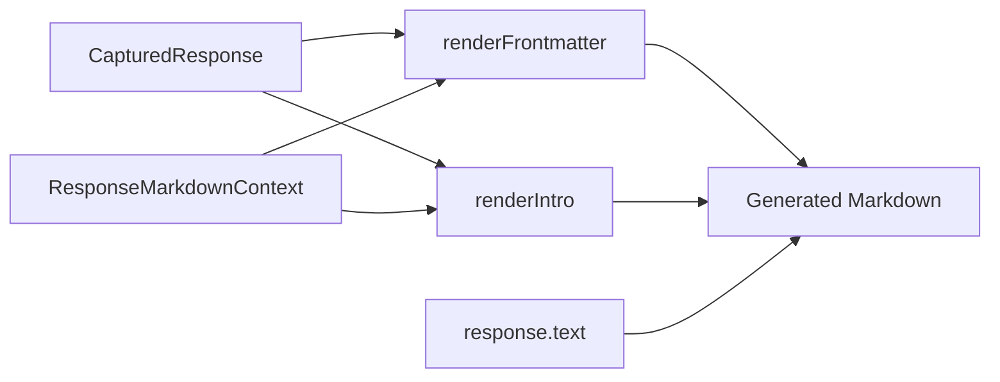

# Pi Extensions Response Viewer Metadata Report

This report records the RESPONSE-METADATA work in the `pi-extensions` repository. The work changed the Response Viewer extension so that Markdown documents opened through `/response-view`, `/rv`, and `/rv-last` contain enough metadata to be understood outside the live terminal session. The generated Markdown now carries structured YAML frontmatter, a human-readable context section, output-path information, and document links for files that shaped the previous turn.

> [!summary]
> The project made Response Viewer output self-describing Markdown.
> 1. The generated response document now records session id, entry id, turn number, model identity, output paths, and previous-turn document context.
> 2. YAML frontmatter uses absolute paths for machine-readable indexing.
> 3. Markdown body links use md-view `/render?file=<absolute-path>` URLs so linked documents open through md-view.
> 4. The work was documented in a docmgr ticket, validated with a smoke script, checked with `pi --list-models`, and smoke-tested in tmux.

## Why this project exists

Response Viewer already solved the first usability problem: it could save assistant responses to Markdown and open them with `md-view`. That made long responses easier to read than terminal output. The remaining problem was orientation. A response saved as `last-response.md` could be readable while still lacking the context needed to understand where it came from.

The requested behavior was precise. When a user opens a generated response document, they should immediately see the session id, turn, title, model, saved output paths, and links to documents generated or read in the previous turn. The document also needs two forms of metadata because there are two consumers. Tools need stable machine-readable values in YAML frontmatter. Humans need a short explanatory section at the top of the rendered Markdown.

The resulting design treats a Response Viewer Markdown file as a durable session artifact. It is not only the assistant text. It is the assistant text plus the minimum context needed to inspect, index, and navigate the response later.

## Current project status

The RESPONSE-METADATA ticket is implemented and documented.

Important commits in `/home/manuel/code/wesen/2026-04-21--pi-extensions`:

| Commit | Purpose |
| --- | --- |
| `c5d6db6` | Implemented response metadata context in Response Viewer. |
| `82bc2b6` | Recorded the implementation guide, diary, smoke script, and ticket docs. |
| `20c04b9` | Changed body document links to md-view `/render?file=<absolute-path>` URLs. |
| `361b847` | Recorded the md-view render-link update in ticket docs. |

The ticket workspace is:

```text
/home/manuel/code/wesen/2026-04-21--pi-extensions/ttmp/2026/05/29/RESPONSE-METADATA--add-session-metadata-to-response-view-generated-markdown
```

The main design and work-log documents are:

- `design/01-metadata-section-for-response-view-markdown.md`
- `design/02-intern-implementation-guide.md`
- `reference/01-diary.md`
- `scripts/01-smoke-response-metadata.ts`

The intern implementation guide was also uploaded to reMarkable at:

```text
/ai/2026/05/29/RESPONSE-METADATA
```

## Project shape

The work changed one extension and its supporting docs. Response Viewer sits inside the Pi extension system and contributes commands, actions, settings, a status widget, and command-palette entries through the shared extension registry.

The important source files are:

| File | Role |
| --- | --- |
| `/home/manuel/code/wesen/2026-04-21--pi-extensions/extensions/response-viewer/response.ts` | Response extraction, metadata discovery, Markdown rendering, temp-file writing, md-view invocation, preview formatting, and status formatting. |
| `/home/manuel/code/wesen/2026-04-21--pi-extensions/extensions/response-viewer/index.ts` | Extension registration, slash commands, launcher actions, settings, widget, palette entries, and auto-open handler. |
| `/home/manuel/code/wesen/2026-04-21--pi-extensions/extensions/response-viewer/ui.ts` | TUI picker for selecting captured responses. This file did not need metadata-specific changes. |
| `/home/manuel/code/wesen/2026-04-21--pi-extensions/extensions/markdown-recent-viewer/history.ts` | Reference implementation for scanning session history and matching tool calls to successful tool results. |
| `/home/manuel/code/wesen/2026-04-21--pi-extensions/extensions/_shared/registry.ts` | Shared extension registry contract used by Response Viewer. |
| `/home/manuel/code/wesen/2026-04-21--pi-extensions/extensions/response-viewer/README.md` | User-facing documentation for commands, settings, metadata output, and path behavior. |

The implementation deliberately keeps selection and rendering separate. `ui.ts` still only displays `CapturedResponse` rows. The metadata work is concentrated in `response.ts`, where the extension already had access to response extraction, file writing, and md-view invocation.

## Architecture

The high-level flow begins with a user command and ends with a browser-rendered Markdown document.

```mermaid
flowchart TD
  User[User runs /rv, /response-view, or /rv-last]
  Index[response-viewer/index.ts]
  Extract[getResponsesFromSession(ctx)]
  Select[Picker selection or lastResponse]
  Save[saveToTempFile(ctx, response)]
  Paths[Compute last-response.md and timestamped path]
  Context[Collect previous-turn document context]
  Render[Render YAML frontmatter and Context metadata section]
  Write[Write Markdown files under /tmp/pi-response-viewer]
  MdView[md-view view /tmp/pi-response-viewer/last-response.md]

  User --> Index --> Extract --> Select --> Save
  Save --> Paths --> Context --> Render --> Write --> MdView
```

The Response Viewer extension is registered through the shared framework. That means the same behavior is reachable through several user surfaces:

- `/rv`
- `/response-view`
- `/rv-last`
- `/rv-preview`
- `/rv-reopen`
- `/px` launcher actions
- command-palette entries
- optional auto-open on assistant turn end

The implementation preserved those entry points. The main behavioral change is that any path that saves a response now passes the command context into `saveToTempFile`.

```ts
export function saveToTempFile(
  ctx: ExtensionContext,
  response: CapturedResponse,
  overrideDir?: string,
): string
```

That context is required because metadata rendering needs `ctx.cwd`, `ctx.model`, and `ctx.sessionManager.getBranch()`.

## Implementation details

The central data structure is still `CapturedResponse`. It represents the assistant response itself, not the surrounding document metadata.

```ts
export interface CapturedResponse {
  turnIndex: number;
  capturedAt: string;
  sessionId: string;
  entryId: string;
  modelProvider: string | undefined;
  modelId: string | undefined;
  modelName: string | undefined;
  text: string;
  textLength: number;
}
```

The implementation adds separate types for document context and render context. This keeps the response model focused while giving the renderer all information needed to produce frontmatter and body links.

```ts
export interface ResponseDocumentContextItem {
  kind: "generated" | "read";
  toolName: "write" | "edit" | "read";
  toolCallId: string;
  entryId: string;
  absolutePath: string;
  displayPath: string;
  linkTarget: string;
  exists: boolean;
  timestamp: string | undefined;
}

export interface ResponseOutputPaths {
  lastResponsePath: string;
  timestampedPath: string;
}

export interface ResponseMarkdownContext {
  title: string;
  source: "pi-response-viewer";
  cwd: string;
  outputPath: string;
  outputPaths: ResponseOutputPaths;
  documents: ResponseDocumentContextItem[];
}
```

The most important design decision is that saving now computes output paths before rendering. The old implementation rendered the Markdown first and therefore could not include correct output-path metadata. The new implementation creates the path set, builds a render context, renders the Markdown, and then writes the files.

```ts
function saveToTempFile(ctx, response, overrideDir) {
  dir = ensureTempDir(overrideDir)
  lastPath = join(dir, "last-response.md")
  timestampedPath = join(dir, `${timestampSlug()}-turn-${response.turnIndex + 1}.md`)
  outputPaths = { lastResponsePath: lastPath, timestampedPath }

  lastMarkdown = renderMarkdown(response, buildMarkdownContext(ctx, response, lastPath, outputPaths))
  writeFileSync(lastPath, lastMarkdown)

  copyMarkdown = renderMarkdown(response, buildMarkdownContext(ctx, response, timestampedPath, outputPaths))
  writeFileSync(timestampedPath, copyMarkdown)

  return lastPath
}
```

Rendering happens in two layers. `renderFrontmatter` emits structured YAML. `renderIntro` emits the readable Markdown section. The final response body is appended after `## Response`.



The previous-turn document context is collected from Pi session history. The code scans the current branch, finds the selected assistant response entry, scans backward to the previous assistant text response, and inspects entries in between. Inside that window, it records assistant `toolCall` blocks for document tools and matches them to successful `toolResult` messages.

```ts
function getPreviousTurnDocumentContext(ctx, response, outputPath) {
  entries = ctx.sessionManager.getBranch()
  window = previousTurnWindow(entries, response.entryId)
  return collectDocumentsFromWindow(ctx, window, outputPath)
}
```

The relevant tools are:

- `read`, classified as `read`
- `write`, classified as `generated`
- `edit`, classified as `generated`

The first implementation filters to Markdown-like documents:

```ts
const DOCUMENT_EXTENSIONS = new Set([".md", ".markdown", ".mdx"])
```

This keeps the output focused on documents rather than every source file touched by a coding session.

The document matching algorithm follows this structure:

```ts
pendingById = new Map()
latestByKey = new Map()

for entry in previousTurnWindow:
  if entry is assistant message:
    for block in entry.message.content:
      if block is toolCall and block.name in read/write/edit:
        path = resolve(ctx.cwd, block.arguments.path)
        if path has document extension:
          pendingById[block.id] = { id, name, absolutePath: path }

  if entry is successful toolResult:
    pending = pendingById[entry.message.toolCallId]
    if pending exists:
      kind = pending.name == "read" ? "read" : "generated"
      item = buildDocumentContextItem(pending, entry, outputPath)
      latestByKey[`${kind}:${pending.absolutePath}`] = item

return latestByKey.values()
```

The output contains three path forms:

| Field | Purpose |
| --- | --- |
| `absolutePath` | Machine-readable identity in YAML frontmatter. |
| `displayPath` | Human-readable label, usually relative to the repository cwd. |
| `linkTarget` | Browser href used in the rendered Markdown body. |

The final link target changed during implementation. The initial design used filesystem-relative links from `/tmp/pi-response-viewer/last-response.md` to the repository file. The correction uses md-view’s render endpoint:

```ts
function linkTarget(_outputPath: string, absolutePath: string): string {
  return `/render?file=${encodeURIComponent(absolutePath)}`;
}
```

This produces body links like:

```md
[docs/pi-testing-guide.md](/render?file=%2Fhome%2Fmanuel%2Fcode%2Fwesen%2F2026-04-21--pi-extensions%2Fdocs%2Fpi-testing-guide.md)
```

That link is not a filesystem navigation request. It is a request to md-view to render the file identified by the absolute `file` query parameter.

## Generated Markdown format

A generated response document now begins with YAML frontmatter similar to this:

```yaml
---
title: "Pi Response — Turn 1"
source: "pi-response-viewer"
session:
  id: "019e73ea-07fb-72ea-9651-b9e4ef1d9956"
  responseEntryId: "f3f79a44"
  turnIndex: 0
  turnNumber: 1
capturedAt: "2026-05-29T13:26:32.362Z"
model:
  provider: "zai"
  id: "glm-5.1"
  name: "GLM-5.1"
paths:
  lastResponse: "/tmp/pi-response-viewer/last-response.md"
  timestampedCopy: "/tmp/pi-response-viewer/2026-05-29T13-26-58-464Z-turn-1.md"
documents:
  generated: []
  read: []
---
```

When previous-turn documents exist, each item records its absolute path, display path, md-view link target, tool name, tool call id, result entry id, existence flag, and timestamp.

The body then begins with a context section:

```md
# Pi Response — Turn 1

> Session `019e73ea-07fb-72ea-9651-b9e4ef1d9956`, turn 1, captured `2026-05-29T13:26:32.362Z`.
> Model: `zai/glm-5.1`.
> Previous-turn context: 0 generated documents, 0 read documents.

## Context metadata

- **Session:** `019e73ea-07fb-72ea-9651-b9e4ef1d9956`
- **Entry:** `f3f79a44`
- **Turn:** 1 (index 0)
- **Captured:** `2026-05-29T13:26:32.362Z`
- **Model:** `zai/glm-5.1` (`GLM-5.1`)
- **Saved files:**
  - `last-response.md`: `/tmp/pi-response-viewer/last-response.md`
  - timestamped copy: `/tmp/pi-response-viewer/2026-05-29T13-26-58-464Z-turn-1.md`

### Generated documents from previous turn

- None detected.

### Documents read in previous turn

- None detected.

---

## Response
```

The response text follows after `## Response`. This separation matters because the metadata section is generated by the extension, while the response body is the assistant’s text after stripping compact terminal summary blocks.

## Validation

Validation happened at three levels.

First, a focused smoke script was added under the ticket workspace:

```text
/home/manuel/code/wesen/2026-04-21--pi-extensions/ttmp/2026/05/29/RESPONSE-METADATA--add-session-metadata-to-response-view-generated-markdown/scripts/01-smoke-response-metadata.ts
```

The script constructs a mocked session branch with a previous assistant response, document `read` and `write` tool calls, successful tool results, and a final assistant response. It calls `saveToTempFile` and checks that the generated Markdown contains frontmatter paths, generated/read sections, md-view render links, and the response body.

The validation command was:

```bash
npx tsx ttmp/2026/05/29/RESPONSE-METADATA--add-session-metadata-to-response-view-generated-markdown/scripts/01-smoke-response-metadata.ts
```

It passed with:

```text
response metadata smoke test passed
```

Second, the extension load check passed:

```bash
timeout 20 pi --list-models
```

This confirmed that the modified extension imports and registers successfully.

Third, the change was tested in tmux:

1. Start Pi in a tmux session.
2. Send a short prompt.
3. Run `/rv-last`.
4. Confirm that md-view opens `/tmp/pi-response-viewer/last-response.md`.
5. Inspect the generated file.

The generated file contained the new YAML frontmatter, the `Context metadata` section, empty document lists for that simple prompt, and the response body.

## Documentation produced

The work produced both implementation docs and operational records.

In docmgr:

- The ticket `RESPONSE-METADATA` was created.
- A design document captured the metadata schema and acceptance criteria.
- A long intern implementation guide explained the architecture and implementation sequence.
- A diary recorded the prompts, decisions, failures, validations, and commits.
- A changelog recorded implementation and link-target changes.
- Tasks were added and checked off.

The intern guide was uploaded to reMarkable as:

```text
RESPONSE METADATA Intern Implementation Guide.pdf
```

Remote folder:

```text
/ai/2026/05/29/RESPONSE-METADATA
```

## Tricky details

The first tricky detail was the definition of “previous turn.” The implementation uses a concrete history window: entries after the previous assistant text response and before the selected assistant response. This captures the tool work that shaped the selected response while avoiding older unrelated session history.

The second tricky detail was path representation. The system needs absolute paths for machine-readable indexing, readable labels for humans, and md-view render URLs for browser navigation. These are separate fields because each one serves a different purpose.

The third tricky detail was YAML empty lists. An early version emitted empty groups as:

```yaml
generated:
  []
```

The implementation was adjusted to emit:

```yaml
generated: []
read: []
```

This is easier to read and remains valid YAML.

The fourth tricky detail was link encoding. The md-view render URL should keep the `/render?file=` prefix unescaped while encoding the absolute path as a query parameter value. The implementation uses `encodeURIComponent(absolutePath)` for that boundary.

## Current limitations

The implementation intentionally stays narrow.

- It records Markdown-like documents: `.md`, `.markdown`, and `.mdx`.
- It does not include arbitrary source files read during a coding turn.
- It relies on the observed Pi session-history shape: assistant messages contain `toolCall` blocks, and tool result messages contain `toolCallId`.
- It has a mocked smoke test for non-empty read/write metadata, but the live tmux smoke used a simple no-document response.
- It assumes md-view supports `/render?file=<encoded absolute path>` as a stable internal route.

These limitations are acceptable for the current ticket because the user asked specifically for documents generated/read around response viewing. They are also useful review points for future expansion.

## Near-term next steps

The next useful validation is a live non-empty md-view click test:

1. Start Pi.
2. Ask it to read one Markdown file and write another Markdown file.
3. Run `/rv-last`.
4. Click the generated and read document links in md-view.
5. Confirm that each link opens through `/render?file=<absolute-path>`.

If that succeeds, the implementation can be considered operational for the primary workflow. If it fails, the next investigation should inspect md-view’s routing contract and adjust the link target format accordingly.

The next implementation improvement would be configurability. Response Viewer could expose settings for document extensions or include source files when desired. That should be a separate ticket because it changes the scope from “response document orientation” to “general session artifact indexing.”

## Project working rule

Response Viewer should treat generated Markdown as a durable artifact. The artifact should contain the response body, but it should also contain the session and document context needed to interpret that body later. Metadata rendering must therefore remain close to response saving, because only the save path has all three required inputs: the selected response, the session context, and the output file paths.
