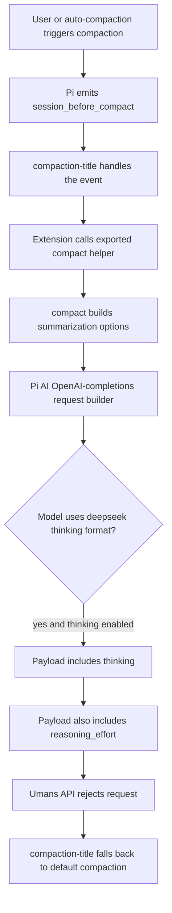

# Pi Extensions Umans GLM Compaction Fix Report

This report records the first fix for the Pi compaction failure seen with `umans/umans-glm-5.1`. The failure appeared during compaction, but the root cause was not a summary prompt problem. It was a provider request-shape problem: one path in Pi asked an OpenAI-compatible endpoint to use two incompatible reasoning controls at the same time.

> [!summary]
> The project made the `compaction-title` extension safer for Umans GLM compaction.
> 1. The immediate extension-side fix is committed in `/home/manuel/code/wesen/2026-04-21--pi-extensions` as `045f2bf953688840fc992912883408c8a5094907`.
> 2. `compaction-title` now disables Pi thinking only for its internal Umans title-generation compaction call, avoiding the invalid `thinking` + `reasoning_effort` pair.
> 3. The deeper provider/runtime fix still belongs in `@earendil-works/pi-ai`, where the OpenAI-completions DeepSeek request builder should respect `supportsReasoningEffort: false`.
> 4. The work is documented in docmgr ticket `UMANS-GLM-COMPACTION`.

## Why this project exists

Long Pi sessions eventually need compaction. Compaction is a second model call whose purpose is not to answer the user, but to create a compressed context checkpoint that future assistant turns can use. That distinction matters because compaction often runs through code paths that are adjacent to, but not identical with, the normal assistant-turn path.

The reported failure was:

```text
Warning: compaction-title failed; falling back to default compaction: Turn prefix summarization failed: 400 cannot specify both 'thinking' and 'reasoning_effort'

Auto-compaction failed: Turn prefix summarization failed: 400 cannot specify both 'thinking' and 'reasoning_effort'
```

The phrase `Turn prefix summarization failed` tells us where the exception came from. Pi was compacting a split turn: a single turn had grown large enough that Pi wanted to keep the recent suffix verbatim and summarize the older prefix. The provider rejected the summarization request before the summary could be produced.

The important lesson is that compaction is not only a summarization feature. It is also a provider integration feature. If the model request payload is wrong, no prompt improvement will help. The model never gets to the prompt.

## Current project status

The first fix is implemented and committed.

| Commit | Purpose |
| --- | --- |
| `045f2bf953688840fc992912883408c8a5094907` | Fix `compaction-title` so its internal Umans title-compaction call does not pass a Pi thinking level. |

The ticket workspace is:

```text
/home/manuel/code/wesen/2026-04-21--pi-extensions/ttmp/2026/05/29/UMANS-GLM-COMPACTION--fix-umans-glm-pi-compaction-thinking-reasoning-parameter-conflict
```

The main ticket documents are:

- `design-doc/01-umans-glm-compaction-parameter-conflict-investigation.md`
- `reference/01-diary.md`
- `tasks.md`
- `changelog.md`

The extension source changed in:

- `/home/manuel/code/wesen/2026-04-21--pi-extensions/extensions/compaction-title/index.ts`
- `/home/manuel/code/wesen/2026-04-21--pi-extensions/extensions/compaction-title/README.md`

Validation so far:

```bash
cd /home/manuel/code/wesen/2026-04-21--pi-extensions
pi --no-session --no-extensions -e ./extensions/compaction-title --list-models no-such-model
```

The extension loaded without a syntax or import failure and printed the expected `No models matching "no-such-model"` result. The docmgr ticket also passes:

```bash
docmgr doctor --ticket UMANS-GLM-COMPACTION --stale-after 30
```

A live `/compact` validation with `umans/umans-glm-5.1` remains open.

## The mental model: where the invalid request comes from

Pi has a user-facing concept called a thinking level. The setting is useful because different providers expose reasoning controls differently. Pi keeps the UI stable and translates the selected level into provider-specific request parameters.

For OpenAI-compatible chat completions, this translation happens in `@earendil-works/pi-ai`. The relevant request builder is:

```text
/home/manuel/.nvm/versions/node/v22.22.1/lib/node_modules/@earendil-works/pi-coding-agent/node_modules/@earendil-works/pi-ai/dist/providers/openai-completions.js
```

For models whose compatibility metadata says `thinkingFormat: "deepseek"`, the current builder does this when thinking is enabled:

```js
params.thinking = { type: options?.reasoningEffort ? "enabled" : "disabled" };
if (options?.reasoningEffort) {
  params.reasoning_effort = model.thinkingLevelMap?.[options.reasoningEffort] ?? options.reasoningEffort;
}
```

That code is internally consistent for a provider that accepts both fields. Umans GLM does not. The installed Umans provider package even documents the intended behavior: Umans upstream models understand the `thinking` field and reject `reasoning_effort` in this combination.

The installed Umans package is:

```text
/home/manuel/.pi/agent/npm/node_modules/pi-provider-umans/index.ts
```

It registers `umans-glm-5.1` as a reasoning-capable OpenAI-compatible model with DeepSeek-style thinking metadata. It also registers a `before_provider_request` hook that strips `reasoning_effort` for Umans requests. That hook is a practical defense for normal request paths, but it is not a complete correctness boundary. A direct call to Pi's exported `compact()` helper can bypass it.

## Architecture of the failing path

The failure is easiest to see as a sequence. The normal assistant path and the compaction-title path both eventually use the same provider request builder, but they do not necessarily pass through the same provider-normalization hooks.



The key design issue is not that `compaction-title` wants a title. The key issue is that the extension calls `compact()` directly. That helper accepts a `streamFn` parameter, but the extension did not have or pass Pi core's provider-normalized stream function. Without that function, the model call may use `completeSimple()` directly, and the Umans `before_provider_request` cleanup hook may not run.

## What the extension-side fix does

The first fix avoids the invalid request shape in the `compaction-title` path. It does not try to solve the entire provider compatibility problem. It makes one path safe while preserving behavior for other providers.

The new decision point is:

```ts
function shouldDisableThinkingForProviderCompat(model: {
  provider?: string;
  id?: string;
  api?: string;
  compat?: { thinkingFormat?: string };
}): boolean {
  return model.provider === "umans" ||
    (model.api === "openai-completions" &&
      model.compat?.thinkingFormat === "deepseek" &&
      model.id?.startsWith("umans-"));
}
```

The compaction call now uses that decision:

```ts
const thinkingDisabledForProviderCompat = shouldDisableThinkingForProviderCompat(model);
const result = await compact(
  event.preparation,
  model,
  auth.apiKey,
  auth.headers,
  customInstructions,
  event.signal,
  thinkingDisabledForProviderCompat ? undefined : pi.getThinkingLevel(),
);
```

This is deliberately narrow. It does not change the user's selected thinking level. It only changes the extension's internal title-generation compaction call. For non-Umans providers, `compaction-title` still passes `pi.getThinkingLevel()` exactly as before.

The extension also stores this fact in compaction details:

```ts
thinkingDisabledForProviderCompat,
```

That matters because compaction entries become part of the session history. If a later reader asks why a title summary was generated without thinking, the session data can answer the question directly.

## Why this is only the first fix

The extension-side change removes the first visible warning: `compaction-title failed; falling back to default compaction`. It does not prove that default compaction is fully safe with Umans GLM and thinking enabled.

Default compaction is closer to Pi core's normal request path. It can receive `this.agent.streamFn`, and that stream function may include provider payload hooks. But the investigation found enough ambiguity to avoid treating that as guaranteed. The durable fix should happen below the extension layer, where request parameters are built.

The correct long-term invariant is simple:

> For an Umans DeepSeek-style model whose compatibility metadata says `supportsReasoningEffort: false`, Pi AI must not emit `reasoning_effort`.

Today, the DeepSeek branch ignores that compatibility flag. The future patch should change the request builder from:

```ts
if (options?.reasoningEffort) {
  params.reasoning_effort = ...;
}
```

to:

```ts
if (options?.reasoningEffort && compat.supportsReasoningEffort !== false) {
  params.reasoning_effort = ...;
}
```

Then `pi-provider-umans` should register Umans models with:

```ts
compat: {
  supportsDeveloperRole: false,
  supportsReasoningEffort: false,
  thinkingFormat: "deepseek",
  requiresReasoningContentOnAssistantMessages: true,
}
```

That change would make the request builder correct regardless of whether a request passes through `before_provider_request` hooks.

## How to test a local `pi-ai` dependency fix

Because `@earendil-works/pi-ai` is installed as a dependency of the global Pi package, a local test has two levels: a fast scratch patch and a source-level patch suitable for a pull request.

The installed dependency lives under the global Pi package:

```bash
PI_ROOT=/home/manuel/.nvm/versions/node/v22.22.1/lib/node_modules/@earendil-works/pi-coding-agent
AI_ROOT="$PI_ROOT/node_modules/@earendil-works/pi-ai"
```

For a fast scratch test, patch the built JavaScript directly:

```bash
cp "$AI_ROOT/dist/providers/openai-completions.js" \
   "$AI_ROOT/dist/providers/openai-completions.js.bak"
$EDITOR "$AI_ROOT/dist/providers/openai-completions.js"
```

Then restart Pi. A `/reload` is not enough because core npm modules may already be loaded by the Node process.

For a pull-request-quality fix, clone the source repository and patch TypeScript source instead of editing installed JavaScript. The package metadata points to the monorepo:

```text
https://github.com/earendil-works/pi.git
packages/ai
```

The workflow should be:

```bash
git clone https://github.com/earendil-works/pi.git /tmp/pi-ai-fix
cd /tmp/pi-ai-fix
# edit packages/ai/src/providers/openai-completions.ts
npm install
npm --prefix packages/ai test
npm --prefix packages/ai run build
```

After building, either install a packed local package into the global Pi tree or copy the built `packages/ai/dist/` into the installed dependency for a short-lived manual test. The safer validation is to write a request-shape test that intercepts `onPayload` before any network call.

The test should assert this invariant for an Umans-like model:

```ts
assert("thinking" in payload);
assert(!("reasoning_effort" in payload));
```

A good local test does not need to spend API quota. It only needs to build the payload and throw from `onPayload` after inspection.

## Current user-facing advice

Until the deeper provider patch lands, the safe operating rule is:

1. Use the committed `compaction-title` fix.
2. If default compaction still fails with Umans GLM, set Pi thinking to `off` before running `/compact`.
3. If auto-compaction repeatedly fails, temporarily disable auto-compaction and compact manually with thinking off.
4. Prefer a different model for one-off compaction if the session must be compacted immediately and Umans GLM is still rejecting requests.

There is also a small settings cleanup to make:

```json
"compaction": {
  "enabled": true,
  "keepRecentTokens": 16384,
  "reserveTokens": 16384
}
```

The existing global settings use `reservetokens`, which does not match Pi's documented `reserveTokens` key.

## Important project docs

- Ticket root: `/home/manuel/code/wesen/2026-04-21--pi-extensions/ttmp/2026/05/29/UMANS-GLM-COMPACTION--fix-umans-glm-pi-compaction-thinking-reasoning-parameter-conflict`
- Investigation: `design-doc/01-umans-glm-compaction-parameter-conflict-investigation.md`
- Diary: `reference/01-diary.md`
- Extension source: `/home/manuel/code/wesen/2026-04-21--pi-extensions/extensions/compaction-title/index.ts`
- Extension README: `/home/manuel/code/wesen/2026-04-21--pi-extensions/extensions/compaction-title/README.md`
- Installed Umans provider: `/home/manuel/.pi/agent/npm/node_modules/pi-provider-umans/index.ts`
- Installed Pi AI request builder: `/home/manuel/.nvm/versions/node/v22.22.1/lib/node_modules/@earendil-works/pi-coding-agent/node_modules/@earendil-works/pi-ai/dist/providers/openai-completions.js`

## Open questions

- Does default Pi auto-compaction still fail with `umans/umans-glm-5.1` after the extension-side fix?
- Does Umans accept `thinking: { type: "enabled" }` consistently for every currently listed Umans model?
- Should Pi core expose a provider-normalized compaction helper to extensions so extensions never need to call exported `compact()` directly?
- Should the Umans provider keep its `before_provider_request` hook after the deeper `pi-ai` fix, or should it be removed once the compatibility metadata is authoritative?

## Near-term next steps

1. Run a real `/compact` test with `umans/umans-glm-5.1` and `/compaction-title on`.
2. Clone `earendil-works/pi`, patch `packages/ai/src/providers/openai-completions.ts`, and add a request-shape test for the DeepSeek branch.
3. Patch or override `pi-provider-umans` so its model metadata sets `supportsReasoningEffort: false`.
4. Validate normal assistant turns, manual compaction, and auto-compaction.
5. Submit the upstream pull request with the minimal request-builder change and the regression test.

## Project working rule

Do not rely on request-cleanup hooks as the only compatibility boundary for provider-specific parameters. Hooks are useful for extension-level customization, but the request builder should be correct from model metadata alone. If a provider cannot accept `reasoning_effort`, that fact should be encoded in compatibility metadata and enforced where the payload is constructed.
