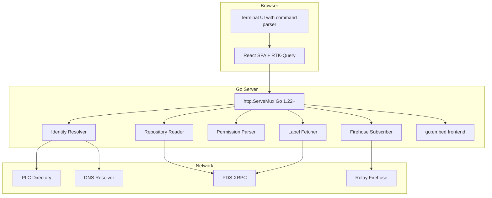

# AT Protocol DID Explorer — Deep Dive Technical Report

This article documents the design, implementation, and operation of the AT Protocol DID Explorer: a single-binary web application that resolves AT Protocol identifiers (handles and DIDs) in real time and displays every step of the resolution chain. It also explains the AT Protocol identity system itself — the relationship between handles, DIDs, DID documents, repositories, permissions, and labels — because understanding how the explorer works requires understanding what it explores.

> [!summary]
> This report covers four things you should take away:
> 1. How the AT Protocol identity layer works: bidirectional handle↔DID verification, did:plc self-certification, DID document structure, and repository architecture.
> 2. How the DID Explorer is built: Go backend using the indigo SDK, React/Vite/RTK-Query frontend with a macOS 1 retro monochrome terminal UI, single-binary deployment via `go:embed`.
> 3. How to use the explorer: commands, API endpoints, and what each resolution step means.
> 4. How to contribute and what comes next: remaining features, open questions, and extension points.

## Why this note exists

The AT Protocol is a federated social protocol with a sophisticated identity system built on W3C DIDs. Its specifications are thorough but distributed across dozens of web pages. There is no single interactive tool that ties the identity, data, and permission layers together and explains them visually. This project was built to fill that gap, and this article was written to ensure that everything learned during construction is preserved in one place.

The article is written for an engineer who has never encountered the AT Protocol. Each concept is explained from its foundation before being used in context.

## The AT Protocol Identity Layer

### DIDs: Persistent, Self-Certifying Identifiers

Decentralized Identifiers (DIDs) are the permanent account identifiers in the AT Protocol. They follow the W3C DID standard and never change, even if the account changes its hosting service, its handle, or its cryptographic keys. An example DID:

```
did:plc:ewvi7nxzyoun6zhxrhs64oiz
```

The AT Protocol supports two DID methods. The `did:plc` method was created specifically for atproto. PLC stands for Public Log of Changes. Every `did:plc` identifier is derived from the SHA-256 hash of the signed genesis operation — the first entry in an append-only log of all mutations to that identity. This makes `did:plc` identifiers self-certifying: anyone can verify that the DID belongs to whoever created the genesis operation, without trusting any central authority.

The `did:web` method uses a domain name as the identifier. For example, `did:web:alice.com` resolves by fetching `https://alice.com/.well-known/did.json`. This method is simpler but ties the identity to domain ownership; losing the domain means losing the identity.

The DID itself is not a human-friendly name. That role belongs to handles.

### Handles: Mutable, Human-Readable Usernames

Handles are DNS hostnames that serve as user-facing identifiers. For example: `alice.bsky.social`. Unlike DIDs, handles can change. A user can move from `alice.bsky.social` to `alice.com` without changing their DID or losing any data. This decoupling is what enables account portability between hosting services.

Handles resolve to DIDs through two mechanisms:

1. **DNS TXT record**: A TXT record at `_atproto.alice.bsky.social` with value `did=did:plc:ewvi7nxzyoun6zhxrhs64oiz`.
2. **HTTPS well-known**: An HTTP GET to `https://alice.bsky.social/.well-known/atproto-did` that returns the DID as plain text.

Both methods can be attempted in parallel. If they disagree, the DNS result takes priority. The `bsky.social` domain suffix skips DNS resolution entirely because the primary Bluesky PDS only supports the HTTPS method.

### Bidirectional Verification: The Trust Chain

The handle↔DID relationship must be verified in both directions. This is not optional. Without bidirectional verification, anyone could create a DNS record or well-known file pointing to someone else's DID, effectively impersonating them.

The verification chain works as follows:

```
1. Resolve handle → DID     (DNS or HTTPS)
2. Resolve DID → DID document (PLC directory or HTTPS)
3. Check DID document claims the handle (alsoKnownAs field)
4. If steps 1 and 3 match, the handle is verified
```

Step 3 is the reverse direction. The DID document contains an `alsoKnownAs` array with entries like `at://alice.bsky.social`. This is the DID asserting ownership of the handle. If the DID claims a handle, and that handle resolves back to the same DID, the link is verified. If either direction fails, the handle is marked `handle.invalid`.

### DID Documents: Keys, Services, and Handles

Resolving a DID produces a DID Document — a JSON object with the account's current cryptographic keys, service endpoints, and claimed handle. Here is a real DID document for the `atproto.com` official account:

```json
{
  "id": "did:plc:ewvi7nxzyoun6zhxrhs64oiz",
  "alsoKnownAs": ["at://atproto.com"],
  "verificationMethod": [{
    "id": "did:plc:ewvi7nxzyoun6zhxrhs64oiz#atproto",
    "type": "Multikey",
    "controller": "did:plc:ewvi7nxzyoun6zhxrhs64oiz",
    "publicKeyMultibase": "zQ3shunBKsXixLxKtC5qeSG9E4J5RkGN57im31pcTzbNQnm5w"
  }],
  "service": [{
    "id": "#atproto_pds",
    "type": "AtprotoPersonalDataServer",
    "serviceEndpoint": "https://enoki.us-east.host.bsky.network"
  }]
}
```

Three fields matter for the AT Protocol:

- **`alsoKnownAs`**: Contains the `at://` URI for the claimed handle. This is the DID→Handle direction of bidirectional verification.
- **`verificationMethod`**: The entry with fragment `#atproto` is the signing key that authenticates repository commits. The key is in Multikey format (multibase base58btc with multicodec prefix). The AT Protocol supports two curves: P-256 for signing keys and secp256k1 for PLC rotation keys.
- **`service`**: The entry with fragment `#atproto_pds` tells you where the user's Personal Data Server is located. This is service discovery — how you find where a user's data lives.

An account without a valid signing key is broken. An account without a PDS endpoint is broken. An account without a verified handle can still participate in the protocol, but software should indicate that the handle is invalid rather than displaying it as if it were verified.

### did:plc Internals: Operation Log and Key Rotation

The PLC directory at `plc.directory` maintains an append-only log of signed operations for each DID. The structure is:

```
Genesis Operation (signed by rotation key)
├── type: "plc_operation"
├── rotationKeys: [did:key:z6Pk..., did:key:z6Mk...]
├── verificationMethods: { atproto: did:key:zQ3s... }
├── alsoKnownAs: ["at://alice.bsky.social"]
├── services: { atproto_pds: { type: ..., endpoint: https://... } }
├── prev: null
└── sig: base64url-encoded ECDSA-SHA256 signature

Update Operation (signed by a rotation key from above)
├── prev: CID of genesis operation
└── sig: ...
```

The DID identifier itself is derived from the genesis operation: the operation is serialized as DAG-CBOR, hashed with SHA-256, base32-encoded, and truncated to 24 characters. This is why `did:plc` is self-certifying — no one can create a DID without the original rotation key.

Rotation keys control the DID. Signing keys (the `#atproto` verification method) sign repository commits but cannot update the DID document. Best practice is to maintain separation between rotation keys and signing keys. Rotation keys can be replaced in update operations, enabling recovery from compromised keys.

### Repositories: Self-Authenticating Data Structures

Every atproto account has a repository — a Merkle Search Tree (MST) that stores all of the account's public records. Each mutation to the repository is captured in a signed commit, and the signature can be verified against the DID document's signing key.

Repository paths follow the pattern `<collection>/<rkey>`:

- `collection` is a NSID like `app.bsky.feed.post`
- `rkey` (record key) is typically a TID (Timestamp ID) like `3k5qb3hcr3f2c`

These combine into AT-URIs — globally unique references to any record in the network:

```
at://did:plc:ewvi7nxzyoun6zhxrhs64oiz/app.bsky.feed.post/3k5qb3hcr3f2c
     ─────────────────────────────────── ─────────────────── ────────────
     authority (DID or handle)           collection (NSID)   rkey (TID)
```

Repositories are exported as CAR files (Content Addressable aRchives) for synchronization, backup, and account migration. The MST uses a 4-way fanout derived from SHA-256 leading zeros, providing efficient key lookup, range scans, and chronological append.

### Permissions: Granular OAuth Scopes

The AT Protocol uses OAuth 2.0 with PKCE and DPoP for client authorization. Permissions are expressed as scope strings that grant access to specific resources:

| Resource | Controls | Example Scope |
|----------|----------|---------------|
| `repo` | Write access to records | `repo:app.bsky.feed.post` |
| `rpc` | Authenticated API calls | `rpc:app.bsky.feed.getFeed?aud=*` |
| `blob` | Upload media | `blob:*/*` |
| `identity` | DID and handle changes | `identity:handle` |
| `account` | Email, repo import | `account:repo?action=manage` |
| `include` | Reference a permission set | `include:com.atproto.authBasic` |

Each scope encodes the resource type, a positional parameter (like the collection NSID for `repo`), and optional query-string parameters (like `action=create&action=delete`). The `include` resource references a permission set — a Lexicon schema that bundles many granular permissions into a user-friendly group with localized titles.

### Labels: Decentralized Moderation Metadata

Labels are lightweight, individually signed metadata objects that can be attached to any account or content. They form the foundation of the AT Protocol's decentralized moderation system. Anyone can run a labeler. Clients choose which labelers to trust.

```json
{
  "src": "did:plc:labeler-service...",
  "uri": "at://did:plc:target.../...",
  "val": "adult-content",
  "neg": false,
  "sig": "base64url-signature"
}
```

Labels are signed with a separate `#atproto_label` key in the labeler's DID document, distinct from the `#atproto` signing key used for repository commits.

## Architecture of the DID Explorer

### System Overview

The explorer is a single Go binary that serves both a REST/WebSocket API and an embedded React SPA. The frontend is a terminal-style interface with a command parser; the backend uses the indigo Go SDK for identity resolution and PDS XRPC calls.



### Go Backend: Package Structure

```
cmd/server/main.go           ← entry point, ServeMux routing
internal/
  resolver/directory.go      ← wraps indigo identity.Directory
  repo/reader.go              ← PDS XRPC calls for repo data
  permissions/parser.go       ← scope string parser with risk assessment
  firehose/subscriber.go      ← relay WebSocket subscription
  labels/fetcher.go           ← label query via PDS
  api/
    identity.go               ← /api/identity/* handlers (moved to main.go)
    repository.go              ← /api/repo/* handlers
    permissions.go             ← /api/permissions/* handler
    firehose.go                ← /api/firehose/ws handler
    labels.go                  ← /api/labels/* handler
  embed/frontend.go           ← go:embed directive
```

The key design decision is using `http.ServeMux` from Go 1.22+ instead of a third-party router. The new `{...}` pattern matching syntax handles path parameters like `{did}`, `{collection}`, and `{rkey}` without additional dependencies.

### The Identity Resolver: Two Layers of Indigo

The indigo SDK provides two distinct APIs for identity resolution, and the explorer uses both for different purposes.

The `Directory` interface provides high-level, cached lookups:

```go
type Directory interface {
    LookupHandle(ctx context.Context, handle syntax.Handle) (*Identity, error)
    LookupDID(ctx context.Context, did syntax.DID) (*Identity, error)
    Lookup(ctx context.Context, atid syntax.AtIdentifier) (*Identity, error)
    Purge(ctx context.Context, atid syntax.AtIdentifier) error
}
```

`identity.DefaultDirectory()` returns a `CacheDirectory` wrapping a `BaseDirectory`, with 250,000 entries, 24-hour TTL, 2-minute stale time, and 5-minute revalidation interval. This is sufficient for most lookups.

But the explorer needs more than a final result. It needs to show each resolution step separately — the DNS lookup, the HTTPS well-known fetch, the DID document resolution, and the bidirectional verification — with timing and success/failure status for each. The `BaseDirectory` exposes these individual operations directly:

```go
func (d *BaseDirectory) ResolveHandleDNS(ctx context.Context, handle syntax.Handle) (syntax.DID, error)
func (d *BaseDirectory) ResolveHandleWellKnown(ctx context.Context, handle syntax.Handle) (syntax.DID, error)
func (d *BaseDirectory) ResolveDID(ctx context.Context, did syntax.DID) (*DIDDocument, error)
```

The resolver stores both the `Directory` (for simple cached lookups) and the `BaseDirectory` (for step-by-step resolution), using each where appropriate.

### Step-by-Step Resolution: The Data Flow

When a user types `resolve alice.bsky.social`, the backend executes this sequence:

```
1. Parse input → syntax.AtIdentifier
2. Try as handle (syntax.Handle) → succeeds
3. Call BaseDirectory.ResolveHandleDNS → get DID or error
4. Call BaseDirectory.ResolveHandleWellKnown → get DID or error
5. Call BaseDirectory.ResolveHandle (tries DNS, falls back to HTTPS) → final DID
6. Call BaseDirectory.ResolveDID → get DIDDocument
7. Call identity.ParseIdentity → extract atproto fields
8. Call ident.DeclaredHandle → get claimed handle from alsoKnownAs
9. Compare claimed handle with input handle → bidirectional verification
10. Return IdentityResult with all steps, timing, and verification status
```

Each step records its duration, status, query, result, and any error detail. The frontend renders these steps as a chain of boxes, showing the resolution process visually.

### React Frontend: Terminal UI

The frontend simulates a terminal. It has no menu bar, no window chrome, no rounded corners, no gradients. It presents a black background with white monospace text and uses color accents only as text foreground:

| Color | Purpose | CSS Variable |
|-------|---------|-------------|
| Green (`#00ff00`) | DIDs, verification success | `--accent-did` |
| Cyan (`#00ccff`) | Handles | `--accent-handle` |
| Yellow (`#ffcc00`) | AT-URIs | `--accent-uri` |
| Magenta (`#ff66ff`) | Keys, signatures | `--accent-key` |
| Red (`#ff3333`) | Errors, verification failure | `--accent-error` |
| Orange (`#ff9900`) | Labels | `--accent-label` |
| Teal (`#66ffcc`) | Permission scopes | `--accent-scope` |

The command parser accepts: `resolve`, `did`, `handle`, `verify`, `repo`, `records`, `permissions`, `help`, `clear`. Any unrecognized single token is treated as a `resolve` command for convenience.

RTK-Query manages all API calls with automatic caching, invalidation, and loading states. The `useLazy*Query` hooks are used to trigger requests on command submission rather than on component mount.

### Single-Binary Deployment

The frontend Vite build output is placed into `internal/embed/dist/` and embedded into the Go binary via `go:embed`:

```go
//go:embed dist/*
var frontendFS embed.FS

func Handler() http.Handler {
    dist, _ := fs.Sub(frontendFS, "dist")
    return http.FileServer(http.FS(dist))
}
```

The build process is:

```bash
cd frontend && npm run build    # Vite → dist/
cp -r frontend/dist internal/embed/dist
go build -o atproto-did-explorer ./cmd/server
```

The resulting binary is self-contained: no separate static file server, no nginx proxy, no container. Run it, open port 8090, and the explorer is available.

## How to Use the Explorer

### Starting the Server

```bash
make full            # build frontend + Go binary
./atproto-did-explorer    # starts on :8090
```

For development, run the Go backend and Vite dev server separately:

```bash
# Terminal 1
make dev            # go run ./cmd/server on :8090

# Terminal 2
make frontend-dev   # vite dev server on :5173, proxies /api to :8090
```

### Commands

| Command | What It Does | Example |
|---------|-------------|---------|
| `resolve <identifier>` | Full identity resolution with all steps | `resolve atproto.com` |
| `did <did>` | Fetch and parse DID document | `did did:plc:ewvi7nxzyoun6zhxrhs64oiz` |
| `handle <handle>` | Show DNS + HTTPS resolution | `handle alice.bsky.social` |
| `verify <handle>` | Bidirectional verification only | `verify bsky.app` |
| `repo <did>` | Describe repository collections | `repo did:plc:ewvi7nxzyoun6zhxrhs64oiz` |
| `permissions <scope>` | Parse and explain a permission scope | `permissions repo:app.bsky.feed.post` |
| `help` | List available commands | `help` |
| `clear` | Clear terminal output | `clear` |

Any bare handle or DID is automatically treated as a `resolve` command.

### API Endpoints

All endpoints return JSON. All parameters are URL path segments.

| Method | Path | Purpose |
|--------|------|---------|
| GET | `/api/identity/resolve/{identifier}` | Step-by-step resolution |
| GET | `/api/identity/verify/{handle}` | Bidirectional verification |
| GET | `/api/identity/did-document/{did}` | Parsed DID document |
| GET | `/api/repo/describe/{did}` | Repository metadata |
| GET | `/api/repo/records/{did}/{collection}` | List records |
| GET | `/api/repo/record/{did}/{collection}/{rkey}` | Single record |
| GET | `/api/permissions/explain/{scope}` | Parse permission scope |
| GET | `/api/labels/{did}` | Query labels |
| GET | `/api/firehose/status` | Firehose connection status |
| WS | `/api/firehose/ws` | Live identity event stream |

### Understanding the Resolution Output

When you resolve `atproto.com`, you see four steps:

**Step 1: DNS TXT Lookup** — Queries `_atproto.atproto.com` for a TXT record. For `atproto.com`, this returns `did=did:plc:ewvi7nxzyoun6zhxrhs64oiz` in approximately 0ms (the result was cached by the indigo Directory).

**Step 2: HTTPS Well-Known** — Fetches `https://atproto.com/.well-known/atproto-did`. For `atproto.com`, this returns HTTP 404. The site does not serve the well-known endpoint; it relies on DNS resolution only. This is not an error — it simply means the DNS method is the authoritative one.

**Step 3: DID Document Fetch** — Queries the PLC directory at `plc.directory` for the DID. Returns the full DID document with verification methods and service endpoints. Takes approximately 100-300ms depending on network conditions.

**Step 4: Bidirectional Verification** — Checks that the DID document claims `atproto.com` in its `alsoKnownAs` field, and that the handle resolves back to the same DID. If both directions match, the chain is verified.

The output includes the extracted signing key (truncated for display), the PDS endpoint URL, and a verification badge (✓ VERIFIED or ✗ UNVERIFIED).

### Understanding Permission Scopes

The `permissions` command parses any AT Protocol permission scope string and explains what it grants. For example:

```
permissions repo:app.bsky.feed.post?action=create&action=delete
```

Produces:

- **Resource**: repo — Write access to records in the account's public repository
- **Collection**: app.bsky.feed.post — The record type this permission applies to
- **Actions**: create, delete — Operations allowed on these records
- **Summary**: Create and delete posts (app.bsky.feed.post records) in the user's repository
- **Risk**: medium — Can create new posts and delete existing ones, but cannot edit existing posts

The risk levels range from `low` (read-only, limited scope) through `medium` (write access to specific record types) and `high` (broad write access, handle changes) to `critical` (full identity control, repository import). The `identity:*` scope, which grants full control over the DID document and handle, is rated `critical` because it enables complete account takeover.

## How It Was Built: Implementation Details

### Phase 1: Backend Skeleton and Identity API

The first working commit (`ef7deea`) established the Go backend with three identity resolution endpoints and a placeholder React frontend. The central challenge was understanding the indigo SDK's two-layer architecture.

The initial implementation attempted to use `identity.NewDefaultDirectory()` and `identity.DirectoryOpts`, which do not exist in the current indigo API. The actual entry point is `identity.DefaultDirectory()`, which returns a `Directory` interface backed by a `CacheDirectory` wrapping a `BaseDirectory`. For step-by-step resolution, the resolver needed direct access to `BaseDirectory` methods like `ResolveHandleDNS` and `ResolveHandleWellKnown`, which are not exposed through the `Directory` interface.

The solution stores both layers in the `Directory` struct:

```go
type Directory struct {
    inner  identity.Directory     // cached lookups
    base   *identity.BaseDirectory // step-by-step resolution
}

func (d *Directory) Base() *identity.BaseDirectory {
    return d.base
}
```

### Phase 2-4: Repository Explorer and Permission Parser

The repository explorer (`internal/repo/reader.go`) resolves a DID to find the PDS endpoint, then makes XRPC calls directly to that PDS. The key XRPC methods are:

- `com.atproto.repo.describeRepo` — returns collections and metadata
- `com.atproto.repo.listRecords` — paginated record listing
- `com.atproto.repo.getRecord` — single record by AT-URI components

The permission scope parser (`internal/permissions/parser.go`) handles all six resource types defined in the AT Protocol specification: `repo`, `rpc`, `blob`, `identity`, `account`, and `include`. The parser splits scope strings into resource type, positional parameter, and query-string parameters, then produces a `PermissionExplanation` with a human-readable summary and a risk assessment.

The parser uses Go's `net/url.ParseQuery` for the query-string portion, which correctly handles repeated parameters like `action=create&action=delete`. The positional parameter is the segment after the first colon in the scope string (e.g., `app.bsky.feed.post` in `repo:app.bsky.feed.post`).

### Phases 5-6: Firehose and Labels

The firehose subscriber connects to a relay's WebSocket endpoint at `/xrpc/com.atproto.sync.subscribeRepos` and filters for identity-related events. The relay outputs a stream of CBOR-encoded frames containing repo commits, identity updates, and account status changes. The subscriber currently parses JSON-encoded frames and filters for events with type `#identity`, `#account`, or `#commit` (where the commit involves an identity-related collection like `app.bsky.actor.profile`).

The label fetcher queries the user's PDS for `com.atproto.label.queryLabels`, passing the account's AT-URI as the query parameter. The PDS returns labels that labeler services have published about that account.

### TypeScript Frontend Specifics

The frontend uses `verbatimModuleSyntax` in its TypeScript configuration, which requires `import type` for type-only imports. This is a common friction point when first setting up RTK-Query with TypeScript, because the generated hook types must be imported with `import type` rather than `import`.

The command history uses a stack-based approach: commands are stored in an array with the most recent first, and the `ArrowUp`/`ArrowDown` keys navigate through it. This matches the behavior of a standard shell history.

## How to Contribute

### Prerequisites

- Go 1.26+ (required by indigo dependency)
- Node.js 18+ (for frontend build)
- npm (for frontend dependencies)

### Project Setup

```bash
git clone <repo-url>
cd atproto-did-explorer
make frontend-install   # install npm dependencies
make full               # build everything
make dev                # start Go server
```

### Adding a New Command

1. Add the command name and description to `frontend/src/commands.ts`
2. Add the API endpoint to `frontend/src/store/api.ts` (RTK-Query endpoint)
3. Add the handler case to `frontend/src/App.tsx` (in the `switch` block)
4. Create a view component in `frontend/src/components/`
5. Add the backend handler in `internal/api/`
6. Wire the handler into `cmd/server/main.go`

### Adding a New Backend Endpoint

The Go 1.22+ ServeMux pattern matching requires this syntax:

```go
mux.HandleFunc("GET /api/path/{param}", handlerFunc)
```

Inside the handler, access the path parameter with:

```go
param := r.PathValue("param")
```

Path parameters are not percent-decoded automatically; use `url.PathUnescape` if needed.

### Running Tests

```bash
go test ./internal/permissions/ -v   # 11 tests for scope parser
go test ./... -count=1               # all tests
```

### Code Style

- Go: `gofmt -w .` and `go vet ./...` before committing
- React: TypeScript strict mode, `import type` for type-only imports
- CSS: custom properties only, no inline styles, no component-scoped CSS files

## Near-Term Next Steps

The following features are designed but not yet implemented:

- **Firehose frontend component**: The backend WebSocket endpoint exists; the frontend needs a `FirehoseView` component that connects to `/api/firehose/ws` and displays identity events in real time.
- **Label view component**: The backend endpoint exists; the frontend needs a `LabelView` that shows labels and indicates whether their signatures can be verified.
- **DID document view component**: A dedicated component that renders the full DID document with field-level annotations explaining what each field means and whether it is valid.
- **AT-URI parser**: A frontend command that parses an AT-URI string and shows its components (authority, collection, rkey), with links to explore each part.
- **PLC operation log viewer**: A view that fetches the operation history for a `did:plc` identifier from the PLC directory and shows the genesis operation, key rotations, and handle changes over time.
- **Record viewer**: A component that displays a single record from a repository, with its CID, AT-URI, and parsed content.
- **Keyboard navigation**: Tab and arrow-key navigation between resolution steps and DID document fields.
- **Command completion**: Auto-complete for commands and previously resolved identifiers.

## Open Questions

1. **Firehose event format**: The relay firehose uses CBOR-encoded frames, not JSON. The current subscriber uses `json.Decoder` which works for some relay implementations but may not handle all frames correctly. A proper implementation would use the CAR/CBOR decoding from the indigo `atproto/repo` package.

2. **Permission set resolution**: The `include:` scope type references a Lexicon schema that must be resolved at runtime. The parser currently produces a placeholder explanation; a full implementation would fetch the Lexicon schema, parse its `permission-set` definition, and expand the included permissions.

3. **DID method extensibility**: The explorer currently handles `did:plc` and `did:web` because those are the only methods the indigo SDK supports. If the AT Protocol adds blessed methods in the future, the resolver will need to be updated.

4. **Label signature verification**: The label fetcher returns raw labels but does not verify their signatures against the labeler's DID document. Verification would require resolving the labeler's DID, extracting the `#atproto_label` key, and verifying the ECDSA-SHA256 signature.

5. **Caching strategy**: The resolver uses indigo's built-in CacheDirectory (250K entries, 24h TTL). For a production deployment, a Redis-backed cache with more aggressive TTL settings would reduce resolution latency and protect against PLC directory rate limiting.

## Project Working Rule

When modifying the explorer, follow the step-by-step principle: every network operation should be visible to the user as a separate resolution step with timing and status. If a new feature involves a network call, it should appear as a step in the resolution chain, not as a silent side effect. The explorer's purpose is to make the protocol legible; hiding steps defeats that purpose.

## Key Files

| File | Purpose |
|------|---------|
| `cmd/server/main.go` | HTTP server, routing, identity handlers |
| `internal/resolver/directory.go` | Identity resolution with step tracking |
| `internal/repo/reader.go` | Repository XRPC client |
| `internal/permissions/parser.go` | Permission scope parser |
| `internal/permissions/parser_test.go` | 11 unit tests for scope parser |
| `internal/firehose/subscriber.go` | Relay firehose WebSocket subscriber |
| `internal/labels/fetcher.go` | Label query client |
| `frontend/src/App.tsx` | Terminal UI, command dispatch |
| `frontend/src/commands.ts` | Command parser |
| `frontend/src/store/api.ts` | RTK-Query API definitions |
| `frontend/src/components/IdentityView.tsx` | Resolution steps display |
| `frontend/src/components/PermissionView.tsx` | Permission scope display |
| `frontend/src/components/RepoView.tsx` | Repository display |
| `frontend/src/index.css` | Retro monochrome CSS theme |
| `Makefile` | Build targets |
| `README.md` | Usage documentation |

## Research Sources

The design doc references 27 specification and guide pages downloaded from official AT Protocol sources. These are stored in the ticket workspace at `ttmp/2026/05/30/ATPROTO-001--at-protocol-did-website-go-react-vite-rtk-query/sources/`. The most important sources for understanding the identity system are:

- `sources/01-spec-did.md` — DID specification (blessed methods, syntax, document parsing)
- `sources/02-spec-handle.md` — Handle specification (syntax, DNS/HTTPS resolution, bidirectional verification)
- `sources/03-guide-identity.md` — Identity guide (handle↔DID relationship, resolution examples)
- `sources/08-spec-permission.md` — Permission specification (resource types, scope strings, permission sets)
- `sources/16-did-plc-spec.md` — DID PLC specification v0.3 (operation log, signing, key rotation)
- `sources/28-indigo-repo.md` — Indigo Go SDK reference
