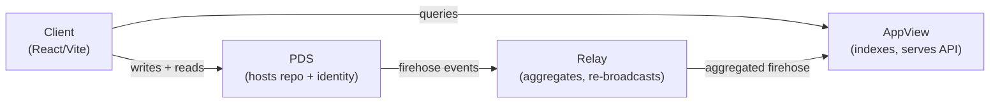
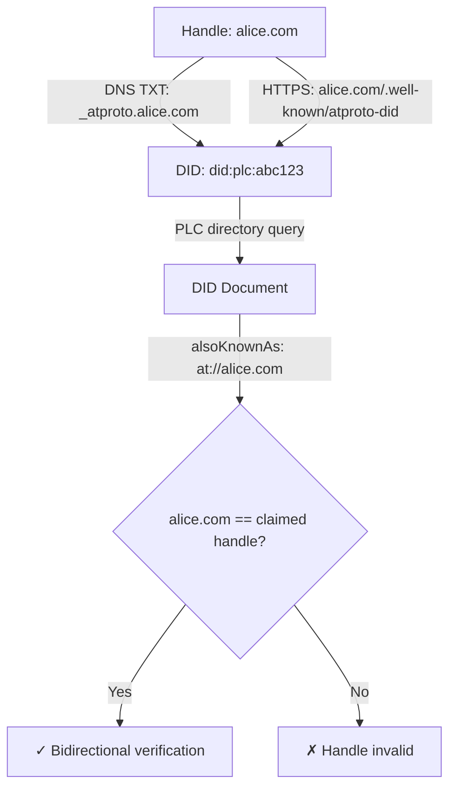
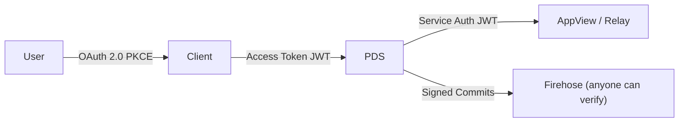

# AT Protocol Identity Systems: Architecture, Implementation, and the Foundations Underneath

This article documents what was learned, built, and discovered during the construction of an AT Protocol Identity Explorer — a Go + React/Vite/RTK Query web application that resolves DIDs, verifies handles, parses AT-URIs, explores repositories, and teaches the foundational concepts underneath the protocol. The article covers the protocol architecture, the academic foundations that explain why AT Protocol makes its design choices, the implementation details of each subsystem, and the practical knowledge gained from building against a live AT Protocol network.

The target audience is an engineer who wants to understand AT Protocol's identity layer from first principles and then implement against it. No prior AT Protocol knowledge is assumed.

> [!summary]
> This article has four identities:
> 1. A technical reference for AT Protocol's identity, naming, and data architecture — what each component does, why it exists, and how the pieces connect
> 2. A map of the foundational academic work that underlies those design choices — W3C DID, object capabilities, content addressing, Merkle Search Trees, URI architecture
> 3. A concrete implementation guide: what code was written, what worked, what failed, and what the non-obvious details are
> 4. A project report for the Identity Explorer application, including how to use it, how to contribute, and what should be built next

## Why this note exists

AT Protocol is entering the IETF standards process. Multiple implementations are appearing in Go, Rust, Python, and Elixir. The protocol's documentation is comprehensive but distributed across dozens of specification pages, community wikis, and an IETF draft. There is no single document that connects the protocol's architecture to the decades of prior work it draws from, and no implementation guide that explains the non-obvious details you encounter when building against live AT Protocol infrastructure.

This article fills that gap. It was produced by downloading 25 specification and foundational documents, reading them, building a working application against the live network, and recording what was learned.

## The foundational concepts

AT Protocol's architecture is not arbitrary. Every major design decision — from the choice of DIDs as account identifiers to the use of Merkle Search Trees for repository storage — traces back to a specific prior art. Understanding those foundations makes the protocol's choices legible and its extension points clear.

### URIs: naming things globally

The Uniform Resource Identifier, defined in RFC 3986 (Berners-Lee, Fielding, Masinter, 2005), is the most fundamental primitive in networked computing. A URI is a compact sequence of characters that identifies an abstract or physical resource. Its grammar is:

```
URI = scheme ":" hier-part [ "?" query ] [ "#" fragment ]
```

A URI has three properties that matter for decentralized identity. First, global scope: a URI is meaningful across all network contexts, not just within a single service. Second, opinionless resolution: the URI itself does not tell you where to find the resource — the scheme determines the resolution method. Third, composability: URI schemes can be nested. The AT-URI `at://did:plc:abc/app.bsky.feed.post/3k2a` contains a DID URI as its authority part.

AT Protocol's `at://` scheme is a deliberate departure from `https://` URIs. An `https://` URI conflates identity with network location: the hostname both identifies and locates the resource. An `at://` URI separates identity from location. The authority part is an identity (a DID or handle), not a server address. You must resolve the identity separately to find the server. This separation is what enables account portability — the same URI continues to work when the user moves to a different hosting provider.

### Decentralized Identifiers

DIDs are a W3C standard (v1.0 published 2022, v1.1 in Candidate Recommendation as of 2026) for persistent, verifiable, decentralized digital identity. A DID has the structure:

```
did = "did:" method ":" method-specific-id
```

The `method` segment identifies which resolution mechanism applies. AT Protocol supports two methods:

- **did:plc** — "Public Ledger of Credentials," developed specifically for AT Protocol. Resolution queries a directory server at `plc.directory`. The method is self-authenticating: the directory server provides availability and consistency, but the operation log can be independently verified without trusting the server.
- **did:web** — a W3C community draft. Resolution fetches a JSON file from `https://<domain>/.well-known/did.json`. Ties identity to domain ownership: losing the domain means losing the identity.

A DID resolves to a **DID Document** — a JSON object containing:

| Field | Purpose |
|-------|---------|
| `id` | The DID itself |
| `alsoKnownAs` | Other identifiers for the entity (handles) |
| `verificationMethod` | Public key declarations |
| `service` | Service endpoint declarations (PDS URL) |

DIDs have four properties that make them suitable as the root of trust in a decentralized social network:

1. **Persistent.** A DID never changes over the lifetime of an account. Every reference to the account — social graph edges, record cross-references, AT-URIs — uses the DID. When a user changes their handle or migrates to a new PDS, all existing references remain valid.
2. **Resolvable.** Any party can resolve a DID to its current document without authentication or prior arrangement. This is critical for the "any party can fetch and verify any repo" property of AT Protocol.
3. **Cryptographically verifiable.** DID documents contain public keys. Data attributed to the DID's controller (repository commits, service auth JWTs) can be independently verified against those keys.
4. **Rotatable.** Keys can be changed without changing the DID. The did:plc method supports this through an append-only operation log where each operation is signed by either the current signing key or the recovery key.

The did:plc method's operation log is its most important structural property. Every change to the DID document — key rotation, handle change, PDS migration — is recorded as a signed operation in a chronological sequence. The log is self-authenticating: given the initial creation operation and the sequence of subsequent operations, anyone can verify that each operation was authorized by the appropriate key at the time. The PLC directory server is a convenience for availability and strong consistency, not a trust root.

### Object capability security

The object capability model (ocap) is a security model where the only way to exercise authority is to hold a reference — a "capability" — to an object. The core principle is:

> If you don't have it, you can't use it.

This contrasts with Access Control Lists (ACLs), the dominant model in Unix and most operating systems. In an ACL system, authority is based on *identity*: programs run *as* a user and inherit all that user's permissions. This is the ambient authority problem. In an ocap system, authority is based on *possession*: objects start with zero authority and must be explicitly granted capabilities.

The ocap model has four properties that connect to AT Protocol:

1. **No ambient authority.** Objects begin with no authority and receive only what they are given. AT Protocol's OAuth permission sets implement this: a third-party client can only request the specific permissions it needs.
2. **Unforgeable references.** Capabilities cannot be counterfeited. A DID's private key is an unforgeable capability — possessing it grants authority over the DID.
3. **Delegation.** Capabilities can be passed to other objects. Service Auth JWTs in AT Protocol are delegated capabilities: the PDS signs a JWT that grants the bearer specific authority over an API endpoint.
4. **Attenuation.** Capabilities can be reduced. An OAuth permission set is an attenuated form of the account's full authority.

The foundational papers in this space are:

- Dennis and Van Horn, "Programming Semantics for Multiprogrammed Computations" (1966) — the original capability concept
- Mark S. Miller, "Robust Composition: Towards a Unified Approach to Access Control and Concurrency Control" (2006 PhD thesis) — the definitive work on how ocap composes
- Spritely Institute, "The Heart of Spritely: Distributed Objects and Capability Security" (2023) — a modern treatment for distributed systems

### Content addressing and self-certifying data

Content addressing names data by its cryptographic hash rather than by its location. A Content Identifier (CID) encodes a version, a multicodec indicating the data format, and a multihash containing the hash algorithm and digest:

```
CIDv1 = <version><multicodec><multihash>
```

Content addressing makes data self-certifying: the identifier is a commitment to the content. Anyone who receives the data can hash it and verify the result matches the CID. This is the property that enables trustless data distribution — you can accept a copy of data from an untrusted source and verify it independently.

Merkle structures extend content addressing to entire data structures. A Merkle Tree (or Merkle DAG) is a tree where each node's identifier is the hash of its content, including the identifiers of its children. Two properties follow:

1. The root hash summarizes the entire data structure. Any change to any leaf changes the root.
2. Compact proofs exist. You can prove a specific record exists in the tree with a Merkle proof — a path of sibling hashes from the leaf to the root — without transmitting the entire tree.

AT Protocol repositories are Merkle Search Trees (MSTs), a variant where the tree structure is deterministic: given the same set of key/value pairs, the MST always has the same shape and root CID regardless of insertion order. The MST was originally described in:

- Auvolat and Taïani, "Merkle Search Trees: Efficient State-Based CRDTs in Open Networks" (SRDS 2019)

The broader content-addressing tradition comes from:

- Benet, "IPFS - Content Addressed, Versioned, P2P File System" (2014)
- The IPLD specification (ipld.io), which defines the data model layer

### Verifiable Credentials

Verifiable Credentials (VCs), standardized in W3C VC Data Model v2.0 (2025), define tamper-evident, cryptographically verifiable claims about entities. A VC consists of claims (subject-predicate-object assertions), a proof (cryptographic signature binding claims to issuer), and metadata (issuer, issuance date, expiration).

Selective disclosure — proving a specific claim without revealing the full credential — is achieved through zero-knowledge proofs, Merkle-based commitment schemes, or CL signatures. AT Protocol does not yet use VCs directly, but the planned "non-public data" mechanism will likely draw on VC patterns. The existing labels system (signed annotations for moderation) is structurally similar to VCs: signed, portable, independently verifiable.

### Security Engineering context

Ross Anderson's *Security Engineering: A Guide to Building Dependable Distributed Systems* (3rd edition, 2020) is the comprehensive textbook that provides the broader security context for AT Protocol's design. Chapters 2–4 (protocols, access control, cryptography), Chapter 7 (distributed systems), Chapter 8 (identity and authentication), and Chapter 21 (eMortgages, eVoting, and verifiable credential applications) cover the foundations that AT Protocol builds on. Anderson's framework for threat modeling, assurance arguments, and the economics of security explains why AT Protocol chooses self-certifying data over server-trusted data, DIDs over usernames, and MSTs over plain databases.

## AT Protocol architecture

AT Protocol decomposes the traditional social network monolith into four service roles:



**Personal Data Server (PDS):** Hosts the user's data repository (an MST of signed CBOR records), manages identity (DID document, handle, signing keys), provides OAuth authentication for clients, serves repositories via HTTP, and broadcasts repo events on a firehose WebSocket.

**Relay:** Subscribes to many PDS firehoses, validates and rate-limits events, and re-broadcasts as a single unified firehose. A fan-in that becomes a fan-out.

**AppView:** Subscribes to the firehose, builds application-specific indexes (social graph, search, aggregations), and serves query APIs to clients.

**Client:** Web, mobile, or bot. Writes records via PDS (OAuth-authenticated). Reads data via AppView query APIs. Never directly contacts relays.

The key architectural principle is that any party can resolve, fetch, and authenticate the full data repository for any account at any time, without prior permission. This is what makes the network decentralized in practice, not just in theory.

### Identity resolution flow

The identity system ties handles, DIDs, and DID documents in a bidirectional verification chain:



Bidirectional verification prevents impersonation in both directions. Without it, someone could point their DNS at your DID (forward impersonation), or claim your handle in their DID document (reverse impersonation). Both directions must match.

### Repository structure

Each user's repository is a Merkle Search Tree — a deterministic, content-addressed key/value structure. Keys are paths like `app.bsky.feed.post/3k2a4b5c` (collection/record-key), and values are CID links to CBOR-encoded records.

The key depth, which determines a key's position in the tree, is computed as:

```
depth = floor(leading_zero_bits(SHA-256(key)) / 2)
```

This gives a fanout of 4 (counting leading zeros in 2-bit chunks). The tree structure is deterministic: the same set of key/value pairs always produces the same shape and root CID, regardless of insertion or deletion order.

The top-level object is a signed commit:

```
Commit = {
  did:    "did:plc:abc123"
  data:   CID→MST Root
  rev:    TID              // logical clock, must increase monotonically
  sig:    bytes            // signature of SHA-256(unsigned commit)
}
```

The root hash certifies the entire repository. The signature certifies the root hash. Anyone can verify the chain without trusting the hosting PDS.

### AT-URI scheme

The `at://` URI scheme provides protocol-level references to records:

```
at://AUTHORITY/COLLECTION/RKEY

at://did:plc:abc/app.bsky.feed.post/3k2a4b5c
```

The authority is an identity, not a location. The `at://` scheme is compliant with RFC 3986's generic URI syntax. AT-URIs are not content-addressed: the same AT-URI can refer to different record contents over time. For strong references, AT-URIs should be paired with CIDs.

### Authentication layers

AT Protocol uses four auth layers:



- **OAuth (user → client):** Scoped permission sets. The client gets only the authority it needs.
- **Session tokens (client → PDS):** JWT access/refresh tokens.
- **Service Auth (PDS → service):** JWTs signed by the PDS's DID key, containing `iss` (requester DID), `aud` (target DID), and `lxm` (endpoint NSID).
- **Repository signatures:** Commits signed by the account's signing key. Verifiable by any party.

## Implementation details

### Project structure

```
explorer/
  cmd/explorer/main.go          — Entry point, ServeMux, frontend serving
  internal/
    did/resolver.go             — DID resolution (did:plc, did:web)
    handle/resolver.go          — Handle resolution (DNS-over-HTTPS, HTTPS well-known)
    repo/client.go              — PDS XRPC client (describeRepo, listRecords, getRecord)
    api/handlers.go             — All HTTP handlers + 8 concept guides
  frontend/
    src/
      app/api.ts                — RTK Query API definition
      app/store.ts              — Redux store
      components/               — DIDResolver, HandleResolver, ATURIParser, ConceptGuide
      pages/                    — IdentityPage, RepositoryPage, ATURIPage, ConceptsPage
      theme/index.css           — Monochrome macOS retro theme
```

### DID resolution

The DID resolver implements two methods. For `did:plc`, it queries `https://plc.directory/{did}` and parses the JSON response into a DID Document. For `did:web`, it fetches `https://{domain}/.well-known/did.json` and verifies that the document's `id` field matches the requested DID.

After resolving the DID Document, the resolver extracts three AT Protocol-specific fields:

1. **Handle** — the first `alsoKnownAs` entry with the `at://` prefix
2. **Signing key** — the `verificationMethod` entry with `id` ending `#atproto` and `type` `Multikey`
3. **PDS endpoint** — the `service` entry with `id` ending `#atproto_pds`

The extraction logic handles both relative fragment syntax (`#atproto`) and fully-qualified syntax (`did:plc:abc#atproto`) for the `id` fields in `verificationMethod` and `service` arrays.

The PLC directory returns results in approximately 200ms. The resolver has a 10-second HTTP timeout. No caching is implemented yet.

### Handle resolution

Handle resolution uses two methods. The primary method is DNS-over-HTTPS via Google's public DNS API (`dns.google/resolve?name=_atproto.{handle}&type=TXT`). This was chosen over native Go DNS resolution because Go's `net.LookupTXT` does not work reliably in all environments and the DNS-over-HTTPS approach provides consistent cross-platform behavior.

The secondary method is HTTPS well-known: `https://{handle}/well-known/atproto-did`. The response is plain text containing the DID.

A non-obvious detail: the DNS-over-HTTPS parsing does string matching for `did=` in the response rather than proper JSON parsing. This is fragile and should be replaced with a proper JSON decoder in a future iteration.

Bidirectional verification works by resolving the handle forward (handle → DID) and then resolving the DID backward (DID → handle via `alsoKnownAs`) and checking that both directions agree.

### Repository exploration

Repository data is fetched from the user's PDS via XRPC endpoints:

- `com.atproto.repo.describeRepo` — returns handle, DID, and list of collection NSIDs
- `com.atproto.repo.listRecords` — returns records in a collection (paginated, limit up to 100)
- `com.atproto.repo.getRecord` — returns a single record by collection and record key

The PDS URL is obtained by first resolving the DID, then extracting the `#atproto_pds` service endpoint. This means every repository operation requires a prior DID resolution. A production implementation should cache DID resolutions.

The `describeRepo` endpoint returns collections as a `[]string` of NSIDs, not as structured objects with record counts. The initial implementation assumed the latter and had to be corrected after testing against the live network.

### AT-URI parsing

AT-URI parsing is done server-side with a simple string parser. The parser strips the `at://` prefix, splits the remaining string on `/` to extract authority, collection, and record key, and determines whether the authority is a DID (starts with `did:`) or a handle.

One non-obvious detail: the Go `net/http.ServeMux` path parameter `{did}` does not handle colons in DID strings correctly. DIDs contain multiple colons (`did:plc:abc`), and these must be URL-encoded (`%3A`) in the path. The handlers use manual unescaping with `strings.ReplaceAll(path, "%3A", ":")`.

### Concept guides

Eight concept guides are embedded in the API handlers as Go string constants. Each guide contains structured educational content with Markdown-like formatting (headers, tables, code blocks, bullet lists) that the frontend renders with a custom renderer. The topics are:

1. `uri` — Uniform Resource Identifiers and the at:// scheme
2. `did` — Decentralized Identifiers and DID Documents
3. `handle` — Handles, bidirectional verification, and did:web self-hosting
4. `identity` — The dual-identifier system and account portability
5. `ocap` — Object capability security and its connection to AT Protocol auth
6. `content-addressing` — CIDs, Merkle structures, and self-certifying repositories
7. `mst` — Merkle Search Trees, key depth, signed commits, CAR files
8. `access-control` — OAuth, Service Auth JWTs, repository signatures, labels

### Frontend architecture

The frontend uses React 18 with Vite for development and bundling, RTK Query for API state management, and react-redux for store integration. The development server proxies `/api` requests to `localhost:8080` (the Go backend).

The monochrome macOS retro UI theme uses CSS custom properties for a consistent visual identity:

- Background: `#fffff0` (off-white, reminiscent of the original Macintosh)
- Text: `#000000` (black, Menlo/Monaco monospace at 13px)
- Borders: `1px solid black` everywhere — no rounded corners, no shadows
- Color accents appear only as text foreground color: green (`#00cc00`) for valid/verified, red (`#cc0000`) for invalid/error, cyan (`#009999`) for links/interactive, yellow (`#b3b300`) for warnings/pending
- No menu bar, no window chrome — content fills the viewport edge-to-edge

The frontend production build produces a 277KB JavaScript bundle and 3KB CSS. In production mode, the Go binary serves the built frontend from the `frontend/dist` directory via `-ldflags "-X main.FrontendDir=frontend/dist"`.

### What did not work

**go:embed for frontend assets.** The Go `embed` directive requires the embedded path to be relative to the Go source file. Because `cmd/explorer/main.go` and `frontend/dist/` are in different directory trees, `go:embed all:frontend/dist` fails at compile time with "no matching files found." The workaround is to pass the frontend directory path at runtime via `-ldflags`. A proper solution would be to move the frontend build output into a location relative to the Go source, or to use a `go:generate` step that copies the built assets.

**DNS TXT resolution.** Go's native `net.LookupTXT` does not work reliably across all environments (particularly in containers and some macOS configurations). The DNS-over-HTTPS approach via Google's DNS API was chosen for cross-platform reliability. This introduces a dependency on Google's DNS service, which is acceptable for an explorer application but would need replacement with a native resolver for production use.

**PDS `describeRepo` response format.** The initial implementation assumed `collections` was an array of objects with `nsid` and `recordCount` fields. The actual API returns a flat array of NSID strings. This was discovered during testing against the live network and corrected.

## How to use the application

### Development mode (two processes)

Start the Go backend:

```bash
cd /home/manuel/code/wesen/2026-05-30--at-proto-research/explorer
go run ./cmd/explorer/
```

Start the Vite frontend dev server in a separate terminal:

```bash
cd /home/manuel/code/wesen/2026-05-30--at-proto-research/explorer/frontend
npm install && npx vite
```

The frontend dev server runs on port 5173 and proxies `/api` requests to the backend on port 8080.

### Production mode (single binary)

```bash
cd /home/manuel/code/wesen/2026-05-30--at-proto-research/explorer/frontend
npm install && npx vite build

cd /home/manuel/code/wesen/2026-05-30--at-proto-research/explorer
go run -ldflags "-X main.FrontendDir=frontend/dist" ./cmd/explorer/
```

The application is available at `http://localhost:8080/`.

### API endpoints

| Endpoint | Description |
|----------|-------------|
| `GET /api/did/{did}` | Resolve a DID (did:plc or did:web) to a DID Document |
| `GET /api/handle/{handle}` | Resolve a handle with bidirectional verification |
| `GET /api/aturi/parse?uri=...` | Parse an AT-URI into authority, collection, record key |
| `GET /api/repo/{did}` | Get repository overview (collections, handle, PDS) |
| `GET /api/repo/{did}/collection/{nsid}` | List records in a collection |
| `GET /api/repo/{did}/record/{nsid}/{rkey}` | Get a single record with full content |
| `GET /api/concepts/{topic}` | Get educational content about a concept |
| `GET /api/health` | Health check |

### Example sessions

Resolve the AT Protocol team's DID:

```bash
curl http://localhost:8080/api/did/did:plc:ewvi7nxzyoun6zhxrhs64oiz
# → handle: "atproto.com", signingKey: active, pdsEndpoint: "https://enoki.us-east.host.bsky.network"
```

Resolve a handle with bidirectional verification:

```bash
curl http://localhost:8080/api/handle/atproto.com
# → did: "did:plc:ewvi7nxzyoun6zhxrhs64oiz", dnsMethod: true, bidirectionalOK: true
```

Explore a repository:

```bash
curl http://localhost:8080/api/repo/did:plc:ewvi7nxzyoun6zhxrhs64oiz
# → 21 collections including app.bsky.feed.post, app.bsky.graph.follow, etc.
```

## How to contribute

The project is structured for incremental extension. Each subsystem (DID resolution, handle resolution, repository exploration, concept guides) is in a separate Go package under `internal/`. The frontend pages are in separate components under `frontend/src/pages/`.

### Areas that need work

**MST visualization.** The current implementation fetches repository data via XRPC but does not render the Merkle Search Tree structure visually. A tree renderer (Canvas or SVG) would show how keys are distributed across depths, how the deterministic structure works, and what happens when records are added or removed.

**Commit signature verification.** The design document includes pseudocode for verifying repository commit signatures against DID document public keys. This has not been implemented yet. It requires CBOR decoding (DRISL profile), SHA-256 hashing, and P-256/K-256 signature verification against the Multikey-encoded public key from the DID document.

**PLC operation log timeline.** The did:plc method's operation log records every change to a DID document (key rotation, handle change, PDS migration). Visualizing this as a timeline would demonstrate the self-authenticating property and show how key rotation works in practice.

**Proper DNS-over-HTTPS parsing.** The current handle resolver uses string matching against the Google DNS JSON response. This should be replaced with a proper JSON decoder that handles the `Answer` array and extracts the TXT record data correctly.

**Caching.** DID resolutions are not cached. Every repository operation triggers a fresh DID resolution. A time-based cache (DID → DIDDocument, with a 5-minute TTL) would reduce latency and avoid unnecessary network requests.

**Lexicon schema resolution.** AT Protocol defines a mechanism for resolving NSIDs to Lexicon schema documents via DNS TXT records and `com.atproto.lexicon.schema` records. Implementing this would allow the explorer to validate record types against their schemas.

### Contribution workflow

1. Fork the repository at `/home/manuel/code/wesen/2026-05-30--at-proto-research`
2. Create a feature branch
3. Implement changes in the appropriate `internal/` package or `frontend/src/` directory
4. Run `go build ./cmd/explorer/` and `cd frontend && npx vite build` to verify
5. Test against the live AT Protocol network using real DIDs
6. Submit a pull request with a description of what was changed and why

The docmgr ticket (ATPROTO-001) in the `ttmp/` directory contains the design document, diary, and research sources that motivated the implementation. Reading the design document first is recommended for understanding the architecture decisions.

## Open questions

1. **PLC directory centralization.** The only production PLC directory is operated by Bluesky Social PBC. If it becomes unavailable, `did:plc` resolution fails. The protocol's design assumes multiple independent directories, but none exist yet. The planned transition to an independent Swiss organization has been announced but not completed.

2. **Non-public data.** AT Protocol currently stores only public data in repositories. The specification notes that mechanisms for private and group data sharing are planned but not yet designed. This is the largest gap in the protocol and will likely draw on Verifiable Credential patterns and encryption.

3. **MST key mining attacks.** Because account holders control record keys, they can mine for sets of keys that produce inefficient tree shapes (deep trees, unbalanced trees). The specification recommends limiting the number of entries per node to a statistically unlikely maximum. The exact limits are implementation-defined.

4. **Cross-account CAR contamination.** When importing CAR files, previously-deleted records could re-appear through CAR imports from unrelated accounts. The specification warns about this but does not mandate a specific mitigation.

5. **Float encoding gap.** The AT Protocol data model disallows floating-point numbers entirely, citing the difficulty of producing byte-deterministic encodings across architectures. This is a deliberate constraint that some application developers will find limiting.

## Near-term next steps

1. Implement commit signature verification using the `fxamacker/cbor` and `lestrrat-go/jwx` Go libraries
2. Add an MST tree visualizer component (Canvas-based, showing depth distribution and key layout)
3. Replace the DNS-over-HTTPS string matching parser with a proper JSON decoder
4. Add DID resolution caching with a 5-minute TTL
5. Implement PLC operation log fetching and timeline visualization
6. Add Lexicon schema resolution via NSID → DNS TXT → DID → repo record chain
7. Build a concept guide renderer that handles Markdown tables properly (the current custom renderer is minimal)

## Project working rule

When building against the live AT Protocol network, test every assumption against actual API responses before committing to a data structure. The specification is comprehensive but the live API surface has subtle differences (e.g., `describeRepo` returns `[]string` not `[]struct`). Read the spec first, then verify against the network.

## Important project docs

- Design document: `ttmp/2026/05/30/ATPROTO-001--at-protocol-identity-explorer-did-uris-access-control-research-implementation/design-doc/01-at-protocol-foundational-identity-systems-full-analysis-implementation-guide.md`
- Investigation diary: `ttmp/2026/05/30/ATPROTO-001--at-protocol-identity-explorer-did-uris-access-control-research-implementation/reference/02-investigation-diary.md`
- Research sources catalog: `ttmp/2026/05/30/ATPROTO-001--at-protocol-identity-explorer-did-uris-access-control-research-implementation/reference/01-research-sources.md`
- Downloaded specification documents: `ttmp/2026/05/30/ATPROTO-001--at-protocol-identity-explorer-did-uris-access-control-research-implementation/sources/`
- reMarkable delivery: `/ai/2026/05/30/ATPROTO-001` (two PDF bundles uploaded)

## Related notes

- AT Protocol specification: https://atproto.com/specs/atp
- IETF AT Architecture draft: https://www.ietf.org/archive/id/draft-newbold-at-architecture-00.html
- W3C DID Core v1.0: https://www.w3.org/TR/did-core/
- W3C DID Core v1.1 (CR): https://www.w3.org/TR/did-1.1/
- W3C VC Data Model v2.0: https://www.w3.org/TR/vc-data-model-2.0/
- Spritely Core paper: https://files.spritely.institute/papers/spritely-core.html
- Ross Anderson, Security Engineering: https://www.cl.cam.ac.uk/archive/rja14/book.html
- Go indigo reference implementation: https://github.com/bluesky-social/indigo
