# Newton Object Soup: The Paradigm That Eliminated the Filesystem

This article preserves the key architectural insights from Apple's Newton Object Soup — a persistent object store that replaced the traditional filesystem on the Newton PDA platform (1993–1998). It is written for engineers who want to understand the paradigm and evaluate which of its ideas could improve modern application architecture. The full research report with source citations and implementation sketches is in the ticket workspace at `/home/manuel/code/wesen/2026-05-30--newton-soup/ttmp/`.

> [!summary]
> 1. The Newton replaced files with **soups** — shared, schema-flexible, indexed object stores that any application can query
> 2. **Union soups** transparently merge data across internal storage and PCMCIA cards, with automatic change notification when cards are inserted or removed
> 3. The user **never saves** — data is always persistent. Applications are views onto shared data, not owners of siloed files
> 4. The **Intelligent Assistant** could parse natural language across soups (e.g., "Lunch with Fred tomorrow") because all data was in one queryable namespace
> 5. Modern systems lost the cross-application data sharing and implicit persistence, but the ideas are relevant to offline-first, real-time-sync, and document-store architectures

## Why this note exists

The Newton Object Soup is one of the most coherent alternative data architectures in computing history. It eliminated the filesystem, unified all application data into shared queryable stores, and made persistence automatic. Most modern systems have converged on a different model — application silos with explicit save — but the soup paradigm offers ideas that are directly relevant to contemporary challenges in offline-first sync, cross-application data integration, and implicit persistence. This note captures those ideas in a form that can inform new design work.

## When to use this pattern

Consider soup-inspired architecture when:

- You are building a system where multiple applications need to share and cross-reference the same data (contacts, events, notes, tasks)
- You need offline-first sync where local and remote data should appear as one unified collection
- You want to eliminate the "save" concept from the user's mental model
- You are designing a document store with flexible schemas and indexed access

Do not use this pattern when:

- Your data is large binary blobs (videos, images) that need streaming access — soup entries are small structured objects
- You need relational integrity across many entity types — soup has no joins, no foreign keys, no transactions across entries
- Your security model requires strict application data isolation — soup assumes shared data by default

## Core mental model

The Newton storage model has three layers:

1. **Store** — a physical storage medium (internal flash, PCMCIA card). Multiple stores can be active simultaneously.
2. **Soup** — a named, indexed collection of entries on a store. Soups are schema-flexible: entries can have different slots. Indexes provide sorted access without loading all entries into memory.
3. **Entry** — a single frame (key-value object) in a soup. Entries are "dumb" data records without behavior. The application provides behavior through its view system.

The crucial abstraction is the **union soup**: a virtual soup that merges all soups with the same name across all stores. Applications query union soups and never need to know which physical store holds a particular entry. When a PCMCIA card is inserted or removed, the union soup updates automatically and applications are notified.

## Architecture

```mermaid
flowchart TD
    subgraph Application Layer
        A1[Names App]
        A2[Dates App]
        A3[Notes App]
        A4[3rd Party Apps]
    end

    subgraph Soup System
        US[Union Soup API]
        Q[Query Engine]
        IX[Indexes]
        NF[Change Notifications]
    end

    subgraph Storage Layer
        S1[Internal Store]
        S2[Card Store 1]
        S3[Card Store 2]
    end

    A1 -->|query/add/modify| US
    A2 -->|query/add/modify| US
    A3 -->|query/add/modify| US
    A4 -->|query/add/modify| US

    US --> Q
    Q --> IX
    US -->|merge| S1
    US -->|merge| S2
    US -->|merge| S3

    S2 -->|card event| NF
    S3 -->|card event| NF
    NF -->|update display| A1
    NF -->|update display| A2
    NF -->|update display| A3

    style US fill:#2d4a22,stroke:#4a7c3f
    style NF fill:#1a3a5c,stroke:#3a7cbd
```



The architecture enforces a strict separation: applications own **views** (behavior and presentation), the soup system owns **data** (persistence and indexing), and stores own **physical storage**. No application has a private data silo.

## Pattern shape: The five key mechanisms

### 1. Schema-flexible entries

Entries in a soup are frames (key-value objects) that do not need to share the same slots. A Names soup might contain `{name: "Fred", phone: "555-1234"}` alongside `{name: "Jane", email: "jane@example.com"}`. Indexes sort on specific slots; entries without an indexed slot simply do not appear in queries on that index.

This eliminates schema migrations. Adding a new slot to new entries does not require updating old entries. The query mechanism handles heterogeneous entries naturally.

### 2. Index-based cursors

Queries return cursors — pointers into a sorted subset of entries. Cursors provide `next()`, `prev()`, and `entry()` methods. Entries are lazily loaded: the frame is only materialized in RAM when the application accesses a slot.

Index-based access avoids the "load everything into memory" pattern that plagues simple key-value stores. The query engine uses the index to find and sort entries without touching the data.

### 3. Union soups

A union soup transparently merges all member soups with the same ID across all stores. New entries go to the user's default store. When a card is removed, its entries disappear from the union soup and applications are notified.

This is the Newton's solution to distributed storage. The application does not need to handle multiple stores, mount points, or sync logic. The union soup is the API; the stores are the implementation.

### 4. Tags as folder substitutes

Entries can be tagged with user-defined strings. Tags provide the filing metaphor without the hierarchy. Multiple tags per entry mean an item can appear in multiple "folders" without duplication.

Tags are stored as a slot in each entry and indexed like any other slot. They follow the same lazy-loading, cross-store, query-based access patterns.

### 5. Smart flattening

When a frame is added to a soup, it undergoes smart flattening: prototype inheritance chains (`_proto`, `_parent`) are stripped, binary objects are stored as references, and circular references are handled. The result is a "dumb frame" — pure data without behavior.

This separation is deliberate: it means any application can read any entry because the data is self-describing, and the behavior lives in the application's code, not in the stored object.

## Common failure modes

### The sync problem

Soup works beautifully on a single device. Syncing soup data to a desktop computer was notoriously difficult. The Newton's DIL (Desktop Integration Library) sync APIs were still in alpha when the platform was cancelled. The fundamental issue: soup entries are identified by soup name and store, not by a globally unique ID. Merging entries from two devices requires heuristics, not just IDs.

### No access control

Any application can query any soup. There is no concept of private data or restricted access. On a personal PDA in 1993, this was acceptable. On a modern networked device, it is not.

### Performance on early hardware

The original MessagePad (20 MHz ARM610, 640 KB RAM) ran interpreted NewtonScript. Scrolling through notes was painfully slow. The soup model was not the bottleneck — the interpreter was — but the perception of slowness damaged the platform's reputation.

### Schema evolution at scale

Schema-flexible entries work well when the soup is small and the number of slot types is limited. At scale, the lack of enforced schema means that applications must handle entries with unexpected or missing slots defensively. This is the same tradeoff that document stores like MongoDB face.

## Anti-patterns

### Using soup as a key-value store

Storing a single entry with hundreds of slots, or using soup names as keys, defeats the indexing and query model. Soups are collections of many small entries, not dictionaries of a few large ones.

### Duplicating entries across soups

If two applications need the same data, they should query the same soup, not copy entries into their own. Duplication breaks the "single source of truth" that makes the soup model work.

### Ignoring change notifications

When a union soup changes (card insertion/removal), applications must update their display. Applications that cache soup data without listening for change notifications will show stale data.

## Working rules

1. **Data is shared by default.** Design entries to be useful across applications. Use well-known slot names for common data (e.g., `name`, `date`, `phone`).
2. **Applications are views, not owners.** An application should not assume it is the only reader or writer of a soup. Any entry might be read or modified by another application.
3. **Persistence is automatic.** Never require the user to explicitly save. Data is persistent the moment it is added to a soup.
4. **Index what you query.** Define indexes for every slot that applications will search on. Without indexes, queries must load every entry into memory.
5. **Handle missing slots gracefully.** Since entries are schema-flexible, always check for the presence of a slot before accessing it. An entry without the slot you expect is not an error — it is a normal occurrence.

## Recommended implementation sequence

If building a modern soup-inspired system:

1. **Define the entry data model.** Start with a simple key-value frame type (TypeScript: `Record<string, any>` with required `_id`, `_soupId`, `_storeId` fields).
2. **Implement the store abstraction.** Each store is a physical database (SQLite on local, remote API for server, IndexedDB for browser).
3. **Build the index engine.** Maintain sorted indexes on specified slots. Use the underlying store's native indexing where possible.
4. **Implement union soups.** Merge entries from all stores with the same soup name. Track which store each entry lives on.
5. **Add change notifications.** Emit events when stores appear/disappear or entries are added/modified/removed.
6. **Build the query/cursor API.** Provide `query(spec) → cursor`, `cursor.next()`, `cursor.prev()`, `cursor.entry()`.
7. **Implement smart flattening.** Strip prototype chains, handle circular references, store binary objects as references.
8. **Add the tag system.** Store tags as a slot, index them, and provide a tag picker UI component.

## Modern equivalents comparison

| Newton Soup concept | Closest modern equivalent | What's missing |
|---------------------|--------------------------|----------------|
| Soup | MongoDB collection, IndexedDB object store | System-wide sharing across apps |
| Entry | BSON document, POJO | Mandatory dumb-frame separation |
| Union soup | CouchDB replication, Firestore real-time sync | Transparent local+remote merge |
| Cursor | IndexedDB cursor, MongoDB cursor | Lazy slot-level loading |
| Index | MongoDB index, IndexedDB index | Cross-store unified indexing |
| Tags | Gmail labels, Notion tags | First-class OS-level support |
| Smart flattening | JSON serialization | Prototype chain awareness |
| Change notification | Firestore `onSnapshot()`, Redux store | System-level store-change events |
| Intelligent Assistant | Siri, Google Assistant | Cross-app soup query integration |
| Routing slip | OS share sheet | Transport-agnostic entry serialization |
| Implicit persistence | Google Docs auto-save | OS-level default, not app-level feature |

## Pseudocode: Modern soup API

```typescript
// Define a soup
const contacts = soup.define({
  name: 'contacts',
  indexes: [
    { path: 'name', type: 'string', order: 'ascending' },
    { path: 'company', type: 'string', order: 'ascending' },
  ],
});

// Add entry (auto-persists to default store)
const entry = await contacts.add({
  name: 'Fred Smith',
  company: 'Acme Corp',
  phone: '555-1234',
  tags: ['work', 'vendor'],
});

// Query with cursor
const cursor = await contacts.query({
  indexPath: 'name',
  beginKey: 'F',
  endExclKey: 'G',
});

while (await cursor.next()) {
  const entry = cursor.entry();
  console.log(entry.name, entry.phone);
}

// Listen for store changes (card insert/remove, sync events)
contacts.onStoreChange((event) => {
  if (event.type === 'store-added') {
    console.log('New store available:', event.storeId);
    refreshView();
  }
});
```

## Key historical sources

- Walter R. Smith, "The Newton Application Architecture" (COMPCON '94) — the canonical architecture paper
- Walter R. Smith, "Using a Prototype-based Language for User Interface" (OOPSLA '95) — why NewtonScript uses prototypes
- Walter R. Smith, "SELF and the Origins of NewtonScript" — the language design history
- Apple Computer, "Newton 2.0 User Interface Guidelines" — the UX specification
- Ian Robinson, "Newton Data Storage" (canicula.com) — the best soup programming tutorial
- Apple DTS, "Soup's On" and "More Soup" — developer technical notes on soup programming

All sources are downloaded to the ticket workspace at `/home/manuel/code/wesen/2026-05-30--newton-soup/ttmp/2026/05/30/NEWTON-SOUP--newton-object-soup-architecture-paradigm-and-ux-research/sources/`.

## Related notes

- This article summarizes the full design-doc at `/home/manuel/code/wesen/2026-05-30--newton-soup/ttmp/2026/05/30/NEWTON-SOUP--newton-object-soup-architecture-paradigm-and-ux-research/design-doc/01-newton-object-soup-research-report.md`
