# Newton Object Soup: Architecture, Paradigm, and UX Research

## Executive Summary

The Apple Newton platform (1993–1998) introduced a computing paradigm that eliminated the traditional filesystem and replaced it with a persistent object store called "soup." This was not merely a storage implementation detail — it reshaped the entire relationship between applications, data, and the user. Data in Newton OS was not organized into files owned by applications. It was organized into soups: shared, schema-flexible, indexed collections of frames (object records) that any application could query. The user never saved a file, opened a document, or worried about which application owned a piece of data. The data simply existed, and applications were views onto it.

This report examines the Newton Object Soup architecture in depth: its data model, its programming language (NewtonScript), its UX implications, its historical context, and its relevance to modern software design. The goal is not nostalgia — it is to extract the ideas that worked, understand why they worked, and evaluate which of them could improve modern application architecture.

The term "object soup" has a dual meaning in computing history. In the Newton context, it refers specifically to the persistent object store that replaced the filesystem. In the broader software architecture discourse — originating with J.D. Hildebrand's 1994 article in *Object Magazine* ([ACM Digital Library](https://dl.acm.org/doi/10.5555/179814.179833)) and elaborated by Eric Dashofy in his essay "[On Object Soup](https://www.softwarearchitecturebook.com/2009/12/object-soup/)" — it refers to an anti-pattern where objects are so tightly coupled through mutual references that the system becomes a tangled web. The Newton's designers were aware of this tension. Their solution — stripping behavior from stored entries and making soup entries pure data — was a deliberate architectural choice that avoided the object soup anti-pattern while preserving the benefits of object-oriented persistence. Understanding this distinction is essential: the Newton's soup is the antidote to object soup, not its embodiment.

---

## 1. The Problem the Newton Was Trying to Solve

### 1.1 The Desktop Metaphor on a Handheld

When Apple began the Newton project in the late 1980s, the dominant computing model was the desktop metaphor: files in folders, applications that open files, a save command, a filesystem hierarchy. This model worked well for personal computers, but it was a poor fit for a handheld device with a pen interface, limited memory, and no keyboard. The user of a PDA is not a file clerk. They are a person taking notes in a meeting, looking up a phone number, scheduling a lunch appointment. Each of these actions crosses what would be a traditional application boundary on a desktop computer. A lunch appointment involves a person (address book), a time (calendar), and a note (notes application). Forcing the user to think about which application "owns" the lunch appointment is a failure of the computing model, not a failure of the user.

The Newton team — led by Walter R. Smith (language and architecture), Steve Capps (user interface), and others under CEO John Sculley's sponsorship — identified several specific problems that the desktop metaphor created for a handheld device:

1. **Users should not manage files.** A PDA user taking notes, scheduling meetings, and looking up contacts should never have to think about where data is stored or whether they have saved it. The concept of "saving" is a concession to the filesystem, not a natural part of the user's workflow. The user writes; the system remembers. That is the correct relationship.

2. **Data should flow between applications.** A meeting entry should reference a person from the address book without copying data. A note should be beamable to another Newton without knowing which application "owns" it. Siloed application data violates the expectation that a PDA is an integrated assistant, not a collection of isolated programs.

3. **Storage is transient and distributed.** A Newton device might have internal flash storage and one or two PCMCIA cards. Cards can be inserted and removed at any time while the device is running. The storage model must handle this gracefully, without requiring the user to manage volumes, mount points, or drive letters.

4. **Memory is scarce.** The original MessagePad had 640 KB of RAM and 4 MB of ROM on a 20 MHz ARM 610 processor. The operating system, the programming language runtime, and all applications had to fit within these constraints while still being responsive to pen input.

These constraints drove a radical design decision: eliminate the filesystem entirely and replace it with a database-like object store where data is always persistent, always shared, and always accessible. Walter Smith described this architecture in his 1994 COMPCON paper "[The Newton Application Architecture](http://waltersmith.us/newton/COMPCON-Arch.pdf)" as combining "a dynamic, object-oriented language called NewtonScript with a hierarchical view system and a persistent object store."

### 1.2 The Knowledge Navigator Vision

The Newton project did not start as a PDA. Apple's original vision, expressed in the 1987 concept video *Knowledge Navigator*, was of a tablet-based computer with a conversational intelligent assistant. The device would understand natural language, anticipate the user's needs, and manage information across applications seamlessly. This vision required a data architecture where information was not siloed — where the assistant could see all of the user's data and act on it regardless of which application created it.

The soup model was the technical foundation for this vision. By making all data accessible through a uniform query interface, the system could support an Intelligent Assistant that operated across all soups, not just within a single application's data. The assistant could parse "Lunch with Fred tomorrow at noon" and create a calendar entry that referenced Fred's contact record, because both the calendar and the contacts lived in soups that the assistant could query.

The PDA form factor that shipped in 1993 was a scaled-down version of this vision. But the soup architecture was designed for the full vision, and it shows: the data model is more ambitious than the product that shipped on it.

---

## 2. The Soup Data Model

### 2.1 Stores, Soups, and Entries

The Newton storage hierarchy has three levels:

- **Store**: A physical storage medium — the internal flash store, or a PCMCIA card. Each store is an independent volume. The Newton can have multiple stores active simultaneously. The MessagePad 130 had one PCMCIA slot (one external store), while the MessagePad 2000 had two slots (two external stores).

- **Soup**: A named collection of entries on a store. A soup is analogous to a database table, but without a fixed schema. Each soup has a unique ID symbol (e.g., `|Names:Apple|`) and optional indexes for sorted access. Soups are identified by a name that includes the developer's signature to avoid namespace collisions — for example, `|mySoup:stormont|` where `stormont` is the developer signature.

- **Entry**: A single frame (key-value object) stored in a soup. Entries do not need to share the same set of slots. A soup can contain entries with different shapes, as long as they share the indexed slots needed for querying.

This hierarchy is deliberate. Stores are physical; soups are logical; entries are the actual data. The application developer works primarily with entries and soups, rarely with stores directly.

Stores can also contain **packages** — read-only objects that are roughly equivalent to applications, plug-ins, or storage areas. Packages are stored separately from soups and are not queryable. The soup/package distinction parallels the data/code distinction: soups hold mutable data, packages hold executable code.

### 2.2 Frames, Slots, and Schema Flexibility

Every entry in a soup is a NewtonScript frame: an unordered collection of slots, where each slot is a name-value pair. A slot value can be any NewtonScript type: a string, an integer, a symbol, an array, another frame, or even a binary object (a `magic pointer` to ROM data or a flattened representation of a more complex object).

The critical design choice is that **entries in a soup do not need to have the same slots.** A Names soup might contain entries like:

```newtonscript
{name: "Fred Smith", company: "Acme Corp", phone: "555-1234"}
{name: "Jane Doe", email: "jane@example.com"}
{name: "Bob", phone: "555-5678", birthday: "3/15/60", category: 'personal}
```

Each entry has a different shape. The soup does not enforce a schema. It indexes the slots that applications care about (e.g., `name` for alphabetical listing), but it does not require every entry to have every indexed slot. Entries without an indexed slot simply do not appear in queries on that index.

This is fundamentally different from a relational database table, where every row has the same columns. It is closer to a document store like MongoDB or CouchDB, where each document can have an arbitrary structure. The Newton had this model in 1993.

The schema flexibility is not an accident or a compromise — it is a direct consequence of the prototype-based object model. NewtonScript objects gain their structure from the slots that are set on them, not from a class definition. A frame with a `phone` slot and a frame without one are both valid frames. The soup stores what is there; it does not require what might be there.

This design choice has a consequence that the Newton team embraced: **schema evolution happens naturally.** When a new version of an application adds a new slot to its entries (say, a `category` slot on name entries), old entries without that slot continue to work. The application simply checks for the presence of the slot before accessing it. There is no ALTER TABLE command, no migration script, no downtime. The new version reads old entries; the old version ignores the new slot.

### 2.3 Indexes and Queries

Soups support indexes for efficient sorted access. An index is defined in the soup's definition frame and specifies:

- **structure**: The index type (`'slot` for indexing on a slot value, `'path` for nested paths within a frame)
- **path**: The slot name to index on
- **type**: The data type of the indexed slot (`'string`, `'integer`, etc.)
- **order**: Sort direction (`'ascending` or `'descending`)

Multiple indexes can be defined on a single soup, allowing entries to be accessed in different sorted orders without loading all entries into memory. The index data structure is maintained by the soup system and stored on the same physical store as the soup entries.

Querying a soup returns a **cursor** — a pointer into a sorted subset of entries. The application can move the cursor forward and backward, read the current entry, and modify or delete entries. Cursors are the primary access pattern for soup data:

```newtonscript
// Return all entries sorted by the 'name index
allEntriesCursor := myUsoup:Query(nil);

// Return entries with name between "M" and "N"
namesCursor := myUsoup:Query({
  indexPath: 'name,
  beginKey: "M",
  endExclKey: "N"
});

// Return entries where name begins with "F"
fCursor := myUsoup:Query({
  indexPath: 'name,
  indexValidTest: func(s) BeginsWith(s, "F")
});
```

The query mechanism supports several access patterns:

| Query method | How it works | Memory impact |
|-------------|-------------|---------------|
| `Query(nil)` | Returns all entries, sorted by first index | Low: cursor iterates without loading |
| `Query({indexPath: 'slot})` | Returns entries with that slot, sorted by slot value | Low: index provides sort order |
| `Query({indexPath: 'slot, beginKey: "A", endExclKey: "Z"})` | Range query on indexed slot | Low: index bounds the scan |
| `Query({indexPath: 'slot, indexValidTest: func})` | Filter by function on index value | Medium: function runs on each index entry |
| `Query({words: ["rob", "net"]})` | Word-prefix search across all slots | Higher: must examine entry content |
| `Query({text: ["net"]})` | Substring search across all slots | Highest: full scan of text content |

The key insight is that index-based queries allow the system to find and sort entries **without loading them into the NewtonScript heap.** The index contains the slot values and entry references; the actual entry frames are only materialized when the application calls `cursor:Entry()`. This lazy-loading design is critical for a device with 640 KB of RAM.

The Apple developer documentation ("[Soup's On](https://www.newted.org/download/manuals/Soups_On.pdf)") describes an additional optimization: the current soup implementation does not create a complete frame for the entry until you access one of its slots. Once you access a slot, it brings the whole entry into memory. The documentation notes: "An obvious area for future optimization would be to bring slots into memory on an as-needed basis." This per-slot lazy loading was planned but never shipped.

### 2.4 Union Soups: Transparent Distributed Storage

A union soup is a virtual soup that merges all member soups with the same ID across all stores. When an application queries a union soup, it sees entries from the internal store and all inserted PCMCIA cards as one unified collection. The application does not know — and does not need to know — which physical store holds a particular entry.

Union soups are the system's solution to the distributed storage problem. The application does not need to know how many stores exist or which store holds a particular entry. It simply queries the union soup and gets a cursor over all matching entries, regardless of physical location.

When a PCMCIA card is inserted or removed, the system automatically updates the union soup, notifies registered applications, and the applications update their display. If the user pulls out a card containing Names entries, those entries disappear from the Names application immediately — no unmounting, no error dialog, no stale references. The [Wikipedia article on Soup (Apple)](https://en.wikipedia.org/wiki/Soup_(Apple)) describes this mechanism clearly:

> "When applications access soups, they usually do so by querying and accessing a 'union soup' object. From an application's perspective, union soups merge all the soups of a given ID on different stores into one unified soup for that ID. This happens dynamically; when a user adds or removes cards, the union soup changes automatically, each application is notified, and they update their presentation to the user to reflect this."

New entries added to a union soup go to the user's chosen default store via `AddToDefaultStoreXmit`. This means the application does not need to decide which physical store to use; the system handles it based on user preferences. The user can configure their default store in the Prefs application, choosing whether new data goes to internal storage or to a card.

The union soup mechanism has a direct modern descendant in CouchDB's replication model and Firestore's real-time sync. But the Newton's implementation has a property that modern systems typically lack: **the physical topology can change at any moment.** A user inserting or removing a PCMCIA card is analogous to a modern user going offline and coming back online, except that the Newton handles it with zero configuration and zero user intervention. The application simply receives a change notification and updates its view.

### 2.5 Tags: The Folder Substitute

Soup entries can be **tagged** with user-defined strings. Tags serve as the Newton's equivalent of filing entries into folders. An entry can have multiple tags, and the tag picker in the Newton UI lets the user filter entries by tag.

Tags are not a separate organizational layer imposed on top of soups. They are a slot in each entry that the tag index can query. This means tags are just data, and they follow the same lazy-loading, cross-store, query-based access patterns as any other slot.

The design is deliberate: the Newton team recognized that users understand the concept of "putting things in folders" but that a real folder hierarchy is too rigid for a PDA. A contact might belong in both "Work" and "San Francisco" categories. A hierarchical folder forces a single location; tags allow multiple memberships without duplication.

The Newton OS 2.0 User Interface Guidelines ([downloaded PDF](http://www.r-5.org/files/books/computers/interface/guidelines/Apple-Newton_User_Interface_Guidelines-EN.pdf)) describe the tag picker as a standard UI element that appears throughout the system. The user can create new tags, assign them to entries, and filter the display by selecting one or more tags. The tag picker is essentially a faceted filter built on top of the soup query system.

### 2.6 Smart Flattening: Where Data and Behavior Separate

When a NewtonScript frame is added to a soup, it undergoes **smart flattening**. This process converts the in-memory frame into a serialized form suitable for persistent storage. The "smart" aspect is that flattening handles several cases that a naive serializer would not:

- Frames that reference other frames by prototype inheritance (`_proto` chains) are flattened to include only the local slots, not the inherited ones. This saves storage space and prevents the soup from storing redundant copies of prototype behavior.

- Frames that reference other frames by parent inheritance (`_parent` chains) are similarly stripped. The parent relationship is a runtime concern (a view's relationship to its container); it is not part of the data.

- Binary objects (like pictures, sounds, and compiled code) are stored as references rather than inline data when possible.

- Circular references are detected and handled, preventing infinite loops during serialization.

- Name references (references to other frames by their global name) are converted to a form that can be resolved when the entry is unflattened.

The Newton Glossary ([entry for "Soup"](https://newtonglossary.com/terms/soup)) emphasizes this distinction:

> "One aspect of a soup that sets it apart from an object oriented database is the 'smart' flattening of entries before they are added to the soup."

Smart flattening is what makes soup entries "dumb frames" — simple data records without behavior. When Walter Smith designed NewtonScript, he explicitly chose to strip `_parent` and `_proto` slots from soup entries to avoid duplicating behavior into every stored entry. In his "[Class-based NewtonScript Programming](http://waltersmith.us/newton/Class-based%20NewtonScript%20Programming.pdf)" paper, he explains:

> "Normally, entries in a soup are 'dumb' frames: simple data records with no _parent or _proto slots to inherit behavior. The reason is obvious: if they did, each entry would contain a copy of the inherited frame."

This separation is one of the most consequential design decisions in the Newton architecture. It means that soup entries are pure data, and the application that reads an entry provides the behavior through its own view system. This is why any application can read any soup: the data is self-describing (it's a frame with named slots), and the application only needs to know which slots it cares about.

This design choice also avoids the "object soup" anti-pattern described by Eric Dashofy. In his essay "[On Object Soup](https://www.softwarearchitecturebook.com/2009/12/object-soup/)," Dashofy defines object soup as an architecture where "everything is mixed together, one object coupled to the other in a tangled web of pointers." The Newton avoids this by keeping the data layer (soup entries) free of behavioral dependencies. The behavior lives in the application's view system and protos, not in the stored data. The data tier is genuinely just data.

---

## 3. NewtonScript: The Language That Made Soup Possible

### 3.1 Why Not C++? Why Not Dylan?

The Newton OS kernel is written in C++, but applications are written in NewtonScript. This decision was not arbitrary, and it was not the first choice. The original plan was to use **Dylan** — Apple's own dynamic, object-oriented language inspired by Lisp and Smalltalk. Dylan was being developed concurrently with the Newton, and the vision was that Dylan would power the entire platform, from the OS to the applications.

Dylan was too ambitious for the Newton's constraints. Walter Smith described the situation in "[SELF and the Origins of NewtonScript](http://waltersmith.us/newton/SELF%20and%20the%20Origins%20of%20NewtonScript.pdf)": the typical Self snapshot (which Dylan's object model resembled) required 32 MB of RAM to run in. The Newton had 640 KB of RAM and 4 MB of ROM. Dylan was also in a nascent state — not ready for the platform's ship date. The team needed a language that could ship.

C++ was considered but rejected for several reasons:

1. **Memory management.** C++ requires manual memory management. On a device with 640 KB of RAM, memory leaks are catastrophic. A garbage-collected language eliminates an entire class of bugs that the Newton could not afford.

2. **Object model rigidity.** C++ is class-based. Every object is an instance of a class with a fixed layout. The Newton's view system and soup model both require a more dynamic object model where objects can have arbitrary slots and can inherit behavior from prototypes stored in ROM. A class-based system would require that every soup entry type be declared as a class, which conflicts with the schema-flexible nature of soups.

3. **Development speed.** C++ compilation is slow, and cross-development (writing code on a Mac, downloading it to a Newton) adds latency. An interpreted language with a fast edit-test cycle is more practical for a new platform with a small developer community.

4. **Runtime flexibility.** The soup model requires that arbitrary frames can be stored, retrieved, and queried at runtime. NewtonScript's dynamic nature allows this; C++'s static typing would fight it.

5. **ROM efficiency.** The Newton stores most of the system software in ROM. A prototype-based language with differential inheritance allows behavior to be defined once in a ROM prototype and shared by all instances, rather than duplicated across class instances in RAM.

The result was NewtonScript — a language that borrowed Self's prototype-based object model but added features specifically for the Newton's constraints and GUI requirements.

### 3.2 The Prototype-Based Model

NewtonScript is a prototype-based language inspired by Self. In a prototype-based language, there are no classes. Objects inherit directly from other objects. A new object is created by cloning a prototype and then overriding specific slots.

NewtonScript extends the Self model with **double inheritance** — two inheritance chains instead of one:

- **`_proto`**: The prototype chain. Used for inheriting default behavior and data. Prototype objects are typically stored in ROM, so their slots cost nothing in RAM. When you access a slot on an object and the object does not have that slot locally, the runtime follows the `_proto` chain to find a value.

- **`_parent`**: The parent chain. Used for inheriting context from the view hierarchy. A child view inherits from its container view via `_parent`, allowing it to access the container's slots without explicitly passing references.

Walter Smith explained this design in his OOPSLA '95 paper "[Using a Prototype-based Language for User Interface](http://waltersmith.us/newton/OOPSLA95.pdf)":

> "Newton's view system evolved in parallel with NewtonScript, and the idea of combining container inheritance defined by the view hierarchy with refinement in the form of view templates was naturally reflected in the language as 'double inheritance'."

This double inheritance directly maps to the two hierarchies that a GUI framework needs: the class-like hierarchy of protos (a `clParagraphView` proto defines default behavior for all paragraph views) and the runtime containment hierarchy of views (a paragraph view inside a base view needs access to the base view's state).

In Self, there is only one parent slot. This works well for the prototype delegation model, but it does not map cleanly to a GUI framework where an object has two distinct relationships: "what kind of thing am I?" (proto) and "where am I in the view hierarchy?" (parent). NewtonScript's double inheritance resolves this by giving each relationship its own inheritance chain.

### 3.3 Differential Inheritance and ROM Efficiency

NewtonScript uses **differential inheritance**: when an object inherits from a prototype, only the slots that differ from the prototype are stored in the object's own memory. Accessing a slot that is not overridden follows the `_proto` chain to find the value.

This mechanism is critical for the Newton's memory constraints. Consider a button view. The `clParagraphView` proto in ROM defines dozens of slots: font, size, color, margins, behavior functions, and more. A specific button instance in RAM only needs to store the few slots that differ from the proto (e.g., the button's label and its click handler). The rest of the button's behavior lives in ROM and is accessed through the prototype chain.

The [Wikipedia article on NewtonScript](https://en.wikipedia.org/wiki/NewtonScript) provides a concrete illustration:

> "If the button uses the default font, accessing its font 'slot' will return a value that is actually stored in ROM; the button instance in RAM does not have a value in its own font slot, so the prototype inheritance chain is followed until a value is found. If the developer then changes the button's font, setting its font slot to a new value will override the prototype; this override value is stored in RAM."

On a device with 640 KB of RAM and 4 MB of ROM, this is not an optimization — it is a necessity. Differential inheritance is what made it possible to run a full GUI framework, a persistent object store, and multiple applications simultaneously in such constrained memory. The design ensures that RAM is used only for what differs from the prototype — the specific data and overrides that make each instance unique.

The implication for soup storage is significant: when a frame is flattened for storage, the inherited slots are not stored. Only the local (RAM) slots are written to the soup. This means that a soup entry is always the minimal representation of the data — just the slots that the object explicitly set, not the ones it inherited. Combined with smart flattening, this keeps soup storage compact.

### 3.4 Frames as the Universal Data Structure

The frame is NewtonScript's only composite data type, and it serves multiple roles simultaneously:

- **Object**: A frame with method slots is an object with behavior.
- **Data record**: A frame with only data slots is a soup entry.
- **View**: A frame in the view system is a visual element on screen.
- **Configuration**: A frame with settings slots is a preferences record.
- **Query specification**: A frame describing search parameters is a query spec.
- **Soup definition**: A frame describing a soup's name, indexes, and owner is a soup definition frame.

This uniformity simplifies the language and the system. There is no separate record type, no separate dictionary type, no separate object type. Everything is a frame, and the same operations (slot access, inheritance, flattening) work on all of them.

The consequence for soup storage is significant: since entries are just frames, and frames are the universal data structure, the impedance mismatch between in-memory data and persistent data disappears. An application works with a frame in memory. When it wants to persist the frame, it adds it to a soup. When it reads the frame back, it gets a frame with the same slots. There is no ORM, no serialization step, no schema migration (beyond adding new indexes).

This is the same advantage that JavaScript objects have over class-based systems when working with JSON. A JavaScript object can be serialized to JSON and back without an impedance mismatch, because JavaScript objects are dynamic collections of properties — just like NewtonScript frames. The Newton had this property in 1993, a decade before JSON became the dominant data interchange format.

### 3.5 NewtonScript's Legacy

NewtonScript's influence extends beyond the Newton platform. Its prototype-based object model, derived from Self, was a direct ancestor of JavaScript's prototype system. JavaScript went on to become the most widely deployed programming language in the world, and its prototype-based inheritance — while often misunderstood by developers coming from class-based languages — owes its design to the same lineage as NewtonScript.

Walter Smith noted in his OOPSLA paper that prototype inheritance has "compelling advantages over classes in the domain of user interface programming," particularly for GUI frameworks where objects need to inherit from multiple sources (visual templates, container context, application state). The double inheritance model was NewtonScript's specific innovation; JavaScript would later solve the same problem with prototype chaining and, eventually, class syntax that desugars to prototypes.

The [NewtonScript community site](https://newtonscript.org/) maintains resources for the language, including tools for exploring the Soup contained within Newton ROM images, compilers, and development environments that work on modern operating systems.

---

## 4. The UX Paradigm: No Files, No Save, No Silos

### 4.1 The User Never Saves

On a traditional operating system, the save command is the user's responsibility to make their data persistent. If they forget to save, their work is lost. This is a design failure: the system knows the data changed, but it makes the user explicitly confirm that they want it to persist. The save command exists for the convenience of the filesystem, not for the convenience of the user.

On the Newton, data is always persistent. When the user writes a note, it is stored in the Notes soup immediately. When they add a name, it goes into the Names soup. There is no save command because there is no transient state that needs to be made persistent. The soup is the persistent state; the in-memory frame is a cache.

This eliminates an entire category of user error (forgetting to save) and an entire category of UI clutter (Save dialogs, Save As dialogs, "Do you want to save changes?" alerts). The user's mental model is simpler: they write something, and it exists. They close the application, and it still exists. They open the application again, and it's there.

The Newton OS 2.0 User Interface Guidelines ([PDF](http://www.r-5.org/files/books/computers/interface/guidelines/Apple-Newton_User_Interface_Guidelines-EN.pdf)) explicitly state that applications should not have a save command. The guidelines emphasize that Newton software should follow the principle that the user's data is always safe and always current.

Modern applications have partially adopted this pattern — Google Docs auto-saves, single-page applications persist state to localStorage — but the operating system still fundamentally assumes a save/open workflow for local files. The Newton made implicit persistence the default at the OS level, not just at the application level.

### 4.2 Applications Are Views Onto Shared Data

The Newton's built-in applications — Names, Dates, Notes — do not own their data. They are views onto shared soups. The Names application reads and displays entries from the Names soup. The Dates application reads entries from the Dates soup. But any third-party application can also query the Names soup, read entries, and create new ones.

This means:

- A third-party contact manager can read the same names that the built-in Names app shows, without importing or exporting. It simply queries the same Names soup.
- A date planner can show appointments alongside contacts from the Names soup, linking them by reference. The appointment entry has a slot that points to the name entry.
- A note-taking app can embed references to names and dates, and those references stay live even if the original entries are edited in their respective applications.
- The Newton's [Newton Information Architecture](https://newtonglossary.com/terms/newton-information-architecture) — the marketing term for the soup + view system — explicitly emphasizes "the ability to easily share the data between applications."

The result is an integrated data environment. The user does not think in terms of "which application has my data" because the data is not in an application — it is in the soup, and applications are just different ways of looking at it. This is the same principle that Alan Kay has advocated for decades: the user should think about their information, not about which program manages it.

Ian Robinson's tutorial "[Newton Data Storage](https://www.canicula.com/newton/prog/soups.htm)" emphasizes this point: applications work with copies of entries obtained through cursors, and the original entries in the soup are not modified unless the application explicitly writes them back. This means that two applications can read the same entry simultaneously without conflict, as long as only one modifies it at a time.

### 4.3 The Routing Slip: Universal Data Transport

The **routing slip** is the Newton's mechanism for sending data. Every application that supports routing has an action button (the envelope icon) that opens the **action picker** — a list of available transport methods (Beam, Fax, Mail, Print, etc.). Selecting a transport method opens the routing slip, a distinctive UI element with an airmail-envelope border pattern.

The Newton UI Guidelines describe the routing slip's border:

> "A border made of pairs of short, slanted lines edged by a thin black rectangle is used around views known as routing slips. It's no accident that this border looks something like the border traditionally printed on airmail envelopes, because routing slips are analogous to postal envelopes."

The routing slip collects the information needed to send the current item: who the sender is, who the recipient is, and what format to use. The user fills in the slip and taps "Send." The system handles delivery.

The routing slip is notable for several reasons:

1. **It is transport-agnostic.** The same slip handles beaming (infrared), faxing, emailing, and printing. The application does not need to know about transport mechanisms; it just provides the data and the routing slip handles the rest. Third-party developers can register new transport methods that appear in the action picker alongside the built-in ones.

2. **It uses the soup model.** The item being routed is a soup entry (or a set of entries). The transport system knows how to serialize and deserialize entries, so the recipient gets a proper entry that can be added to their own soup. The [Newton Glossary entry for "Routing Slip"](https://newtonglossary.com/terms/routing-slip) defines it as "a view in which a user specifies the sender, recipient, format, and other information needed to send data by the method chosen in the action picker."

3. **It is extensible.** Third-party developers can register new transport methods that appear in the action picker. This is the same extensibility pattern that iOS uses for its Share sheet, but the Newton had it in 1993.

4. **It decouples the application from the network.** The application does not need to implement network protocols, handle connection errors, or manage message queues. The routing slip and the In/Out Box handle all of this on the application's behalf.

### 4.4 The In/Out Box

Newton OS 2.0 introduced the **In Box** and **Out Box** — system-wide repositories for incoming and outgoing items. The In Box holds items that have been received (via beam, mail, or other transports) but not yet "put away" into the appropriate soup. The Out Box holds items that are queued for sending.

The In/Out Box decouples data transfer from data storage. An item can arrive via any transport mechanism, sit in the In Box until the user decides what to do with it, and then be filed into the appropriate soup. The user does not need to understand soup internals; they just see an incoming item and decide where it goes.

This pattern — a system-level inbox that accepts data from any transport and files it into the appropriate persistent store — is surprisingly rare in modern operating systems. Mobile operating systems typically handle incoming data on a per-application basis (a URL handler in iOS, an intent receiver in Android). The Newton's system-level inbox is more general: any application can register to receive items of a given type, and the user chooses which application handles the incoming item.

### 4.5 The Intelligent Assistant

The **Intelligent Assistant** (also called Assist) is the Newton's system service for interpreting natural-language requests and turning them into actions. The user writes a request like "Lunch with Fred tomorrow at noon" in the Assist slip, and the system:

1. Parses the text to identify the **request word** (the action type) and the parameters. In this example, the request word is "Lunch" (mapped to the scheduling action), the person is "Fred," and the time is "tomorrow at noon."
2. Looks up "Fred" in the Names soup to find the matching contact entry.
3. Creates a new entry in the Dates soup with the meeting details, including a reference to Fred's name entry.
4. Optionally offers to set a reminder or send Fred a meeting invitation via the routing slip.

The [Newton Glossary entry for "Assist"](https://newtonglossary.com/terms/assist) describes it as:

> "A function built into Newton device that can automatically perform certain tasks, such as dialing a telephone number, searching for information, or scheduling an appointment. Assist is accessed by entering a request word into the Assist slip triggering the corresponding action."

The Intelligent Assistant works because all the data is in soups. It can query the Names soup, the Dates soup, and any other registered soup, because the data is not locked inside individual applications. The assistant is not a feature of the Dates application; it is a system service that operates across all soups.

This is the same capability that modern voice assistants (Siri, Google Assistant, Alexa) struggle with: they need to access data across multiple applications, but each application's data is siloed. Siri can create a calendar event, but it cannot look up "Fred" in a third-party contact manager's database — only in Apple's own Contacts app. The Newton solved this in 1993 by not having silos in the first place.

The assistant's request words are extensible. Third-party applications can register new request words and the actions they trigger. The Newton's **Intelligent Assistance Architecture** ([Newton Glossary](https://newtonglossary.com/terms/newton-information-architecture)) is a framework that allows any application to participate in the assistant's processing.

### 4.6 The Pen Interface and the No-Files Paradigm

The Newton's pen-based interface shaped its entire interaction model. Key elements:

- **Ink text**: The user writes directly on the screen. The system recognizes handwriting and converts it to text, or stores it as digital ink. No keyboard is required. Newton OS 2.0 shipped with two recognizers: Apple's own "Rosetta" print recognizer and the ParaGraph cursive recognizer. By all accounts, the 2.0 recognition was excellent — Larry Yaeger, the Apple ATG engineer who led the recognizer development, described it as "the world's first genuinely usable handwriting recognition system."

- **Scrub gesture**: The user scratches out text like crossing it out on paper. This is the delete operation, and it feels natural because it maps directly to a physical action.

- **Tap and drag**: The primary interaction. Tap to select, drag to move, tap and hold for a contextual action.

- **Overview button**: The Newton's equivalent of a home screen, showing all running applications.

- **Status bar**: Always visible, showing time, battery, and transport status.

- **Menus at the bottom**: Unlike the Mac's menu bar at the top, Newton OS presents menus at the bottom of the screen in small rectangles, making them accessible to the pen without reaching across the display.

- **Tabbed documents**: Notes and other documents appear in tabs at the top right of the screen, similar to modern browser tabs. This allows the user to switch between documents without a file dialog.

The pen interface reinforces the no-files paradigm. A pen-based device does not naturally support file dialogs, directory trees, or drag-and-drop between folders. It naturally supports writing, selecting, and gesturing — actions that map to data creation, selection, and deletion. The soup model aligns with this: the user creates data by writing, and the system persists it automatically.

The [Wikipedia article on Newton OS](https://en.wikipedia.org/wiki/Newton_OS) notes several interface elements that were novel at the time and would later appear in other Apple products: drawers, the "poof" animation (when an item is deleted), sound-responsive interface elements, and screen rotation (in Newton 2.0). These were not separate from the soup model — they were part of a coherent design philosophy that treated the device as an information appliance, not a miniature computer.

---

## 5. Historical Context and Contemporary Systems

### 5.1 The Object-Oriented Database Movement

The Newton's soup model emerged during the peak of the object-oriented database (OODB) movement in the early 1990s. The prevailing belief was that object-oriented programming required object-oriented persistence: if the programming model uses objects, the storage model should too, rather than breaking objects into rows and columns for a relational database. J.D. Hildebrand's 1994 article "[Object Soup](https://dl.acm.org/doi/10.5555/179814.179833)" in *Object Magazine* (Volume 3, Issue 6) captured this moment in the discourse.

Charles Davies, the technical director of Symbian (then Psion Software), described the thinking at the time in a passage quoted on the [Retro Computing Forum](https://retrocomputingforum.com/t/newtons-storage-a-different-object-soup/4974):

> "We had a normal file system on the Series 3. When we went to C++, we talked a lot about persistent models of object-oriented programming, and we went for stream storage. We narrowly rejected SQL in favor of stream storage. I remember the design ideas around at the time, and it was done in the interests of efficiency. Different applications were having to save the same system objects and we were having to duplicate that code. So for something like page margins, which was a system structure, if that object knew how to serialize itself, that would solve the problem. You do that by having serialization within the object, so objects that might reasonably want to be persisted could persist themselves. And that was in the air, I mean Newton had its soup at that time which I think was object-oriented, and there was a belief at that time that object-oriented databases were it, and that objects ought to be seen as something that existed beyond the lifetimes of processes."

The Newton's soup is an OODB in the minimal sense: it stores objects (frames) with their structure intact, and it allows queries that respect the object model. But it deliberately avoids the full OODB complexity. Soup entries are "dumb frames" without behavior, and the query mechanism is simple (indexed cursor traversal) rather than a full query language like OQL.

### 5.2 Psion EPOC and Stream Storage

The Psion Series 5 (1997) also rejected the traditional filesystem in favor of **stream storage**, a model where objects know how to serialize themselves. The two platforms arrived at similar conclusions from different starting points:

| Aspect | Newton Soup | Psion Stream Storage |
|--------|-------------|---------------------|
| Data model | Frame-based, schema-flexible | Object serialization, type-structured |
| Access pattern | Query by index, cursor traversal | Open stream by UID, read/write sequentially |
| Cross-app sharing | Any app queries any soup | Apps share by knowing the same UID |
| Schema evolution | Entries can have different slots | Stream version must be handled by reader |
| Physical storage | Transparent via union soups | Manual file-like management |
| Philosophy | Data is shared; apps are views | Objects persist themselves; apps share UIDs |

The Newton's approach is more flexible but also more complex. Stream storage is simpler to implement but less transparent across application boundaries. Both approaches were motivated by the same observation: when multiple applications need to work with the same data types (contacts, appointments, documents), a traditional filesystem forces code duplication and data silos.

### 5.3 The ARM610 MMU: Hardware-Software Co-Design

The ARM610 processor, designed specifically for the Newton, included MMU features that supported the soup model. A November 1992 BYTE magazine article, "[Call to ARM](https://archive.org/details/eu_BYTE-1992-11/page/n380/mode/1up?view=theater)" by Dick Pountain, described the MMU's novel scheme for partitioning memory along object-oriented lines, with Apple holding a patent on the design.

The ARM610's MMU combined a conventional virtual memory controller with a scheme for object-granularity memory protection. This meant that the boundary between RAM and persistent storage could be managed at the object level, not just at the page level. For a system where the primary storage abstraction is the object (frame), this is a significant advantage: the MMU can protect and persist objects without the overhead of a filesystem layer.

This is a fascinating example of hardware-software co-design. The Newton's storage model was not just a software abstraction layered on top of a generic MMU. The MMU itself was designed to support object-granularity memory protection and persistence, blurring the boundary between RAM and persistent storage. The retro computing forum discussion notes that "the ARM6 MMU had features, such as sub-page permissions, that were added to help support Newton's object soups."

### 5.4 Competitors: GO PenPoint, Palm, Windows CE

The Newton's contemporaries took different approaches to storage and UX:

- **GO PenPoint** used a notebook metaphor with tabbed pages. Data was organized into notebooks rather than files, but the storage was still fundamentally file-based underneath. PenPoint's notebook metaphor was a UI innovation, not a data architecture innovation.

- **Palm OS** used a traditional record-based database model (Palm databases with records and categories). It was simpler than soup but also more rigid: each database had a fixed record type, and cross-database references were not natively supported. Palm's approach was pragmatic — it sacrificed flexibility for simplicity, and the result was a device that was faster and cheaper than the Newton.

- **Windows CE** used a conventional filesystem with a registry for settings. It offered no cross-application data integration at the OS level. As the [RoughlyDrafted article](http://www.roughlydrafted.com/RD/Q4.06/600D65E6-A31E-45CA-AFC5-42BC253F5337.html) notes, "WinCE didn't offer anything like the Newton from three years prior; it looked more like Windows 95 stuck in a small screen."

The Newton was the only platform that eliminated the filesystem entirely and built its entire data model around shared, schema-flexible, indexed object stores. This was its greatest technical achievement and, arguably, its greatest commercial liability — the soup model was more complex to sync with desktop computers, which was a critical feature that never worked well.

### 5.5 Why Newton Failed

The RoughlyDrafted article quotes Brant Sears, a Newton developer, on the specific reasons for the platform's commercial failure. Several of these reasons directly relate to the architecture choices documented in this report:

1. **The Newton was too slow.** Scrolling through notes on the original MessagePad was painfully slow because the operating system and most of its software was interpreted NewtonScript running on a virtual machine. Apple chose interpreted NewtonScript to use less flash memory, which "did make the system really elegant, but at the price of performance on early systems."

2. **Sync was never solved.** "Apple never provided a good data synchronization solution or good third party libraries for data sync, and kept too much information secret for third party developers to fix it for them. In 1998 the DIL sync libraries were still alpha."

3. **Pre-announcement raised expectations.** "John Sculley's demo of the product almost two years before it shipped was a real mistake and forced Apple to rush Newton out the door before it was finished."

The soup model was not the primary cause of failure — the interpreted runtime performance and the unsolved sync problem were more damaging. But the soup model contributed to the sync problem: soup entries are identified by soup name and store, not by a globally unique ID, making merge-based synchronization difficult. The fundamental issue was that the soup model was designed for a single device with removable cards, not for syncing with a desktop computer. When the PDA market shifted toward desktop-synced devices (Palm Pilot), the Newton's architecture became a liability.

---

## 6. Modern Comparisons: What Newton Got Right (and What We Lost)

### 6.1 MongoDB and Document Stores

Newton soup is conceptually similar to MongoDB: both store schema-flexible documents (frames / BSON objects) in named collections (soups / collections) with indexes for efficient querying. The key differences:

| Aspect | Newton Soup | MongoDB |
|--------|-------------|---------|
| Schema | No enforcement, any slots | No enforcement, any fields |
| Indexes | Slot-based, cursor traversal | Field-based, rich query language |
| Distribution | Union soups across stores | Sharding and replica sets |
| Behavior | Entries are data-only | Documents can store functions |
| Query language | Programmatic (NewtonScript) | Declarative (MQL) |
| Transactions | Single-entry operations | Multi-document transactions |
| Change notifications | System-level on store change | Change streams (server-side) |

What MongoDB lacks that Newton had: the **union soup** concept — transparent merging of the same collection across multiple physical stores with automatic notification on store changes. MongoDB's sharding is a server-side operation, not a client-side view that dynamically adjusts when a storage card is inserted.

What MongoDB has that Newton lacked: a rich declarative query language, multi-document transactions, aggregation pipelines, and server-side computation. The Newton's query mechanism is primitive by comparison: you can filter by index range, by a validation function on the index, or by full-text search, but you cannot join soups, aggregate across entries, or project a subset of slots.

### 6.2 CouchDB and Offline-First Replication

CouchDB's replication model is the closest modern analog to union soups. CouchDB allows multiple databases to replicate bidirectionally, with conflict resolution for concurrent edits. The Newton's union soup is essentially a read-only merge of soups across stores, with new entries going to the default store.

What CouchDB adds: conflict detection and resolution (the Newton did not handle concurrent edits across stores, because only one device could write to a store at a time), multi-version concurrency control (MVCC), and a REST API for remote access.

What the Newton had that CouchDB lacks: the entry-level notification system, where applications are automatically informed when the union soup changes because a card was inserted or removed. CouchDB's `_changes` feed is the closest equivalent, but it requires the application to poll or long-poll the feed, rather than receiving push notifications.

The offline-first architecture that CouchDB pioneered — where the local database is the primary store and sync with the server happens asynchronously — is the direct philosophical descendant of the Newton's union soup model. The Newton assumed that the device would sometimes have a card inserted and sometimes not; offline-first architectures assume that the device will sometimes have network connectivity and sometimes not. The problem is the same: the application should not need to know whether the data is local or remote.

### 6.3 Firebase/Firestore

Firebase Firestore is a real-time synchronized document store that also shares the soup-like model: schema-flexible documents in named collections, with indexes and real-time change notifications. The real-time listener pattern in Firestore (where an application subscribes to query results and receives updates as data changes) is a direct descendant of the Newton's change notification system.

What Firestore lacks: the transparent multi-store union. Firestore assumes a single backend (or a small number of regional replicas). The Newton model where the physical storage can change at any moment (card insertion/removal) is not well-supported. Firestore also lacks the cursor-based access pattern that the Newton used; instead, it returns full document snapshots.

What Firestore has that Newton lacked: real-time cross-device sync, security rules that control access at the document level, and server-side cloud functions that trigger on data changes. These capabilities address the Newton's two main weaknesses — sync and access control — but they do so at the cost of requiring a centralized server.

### 6.4 Apple CoreData

CoreData is Apple's object graph persistence framework for macOS and iOS. It stores managed objects in a persistent store, supports multiple store configurations, and provides change notifications. But CoreData is application-scoped: each application has its own CoreData stack, and sharing data between applications requires explicit inter-app communication (URL schemes, App Groups, etc.).

The Newton soup model is system-scoped: all applications share the same soups. This is a fundamental philosophical difference. CoreData assumes applications own their data. Soup assumes the system owns the data, and applications are views.

The irony is that Apple built the soup model in 1993, abandoned it when the Newton was cancelled in 1998, and then shipped CoreData in 2005 with exactly the opposite assumption. The iPhone, which Apple positioned as the Newton's spiritual successor, enforces strict application sandboxing that prevents the kind of cross-application data sharing that the soup model enabled.

### 6.5 IndexedDB (Web Browser)

A contributor on the [Retro Computing Forum](https://retrocomputingforum.com/t/newtons-storage-a-different-object-soup/4974) noted the similarity between Newton soup and the IndexedDB API available in modern web browsers:

> "The idea of object soup doesn't sound all that different from the IndexedDB API... A database can have a number of 'Stores,' which are analogous to files or tables, and a Store can have a number of 'Objects,' which in the simplest case can be POJOs... Stores can have a number of indexes which are based on properties of the objects in the store."

IndexedDB is indeed the closest browser-based analog to Newton soup. The data model (object stores with indexes), the access pattern (cursors over query results), and the schema flexibility (any object can be stored) all mirror the Newton design. The main difference is that IndexedDB is per-origin (per-website), not system-wide. Web applications cannot share IndexedDB data across origins, which reintroduces the data silo problem that the Newton solved.

A modern soup implementation could use IndexedDB as its storage backend, adding the union soup, change notification, and cross-application sharing layers on top.

### 6.6 What We Lost

The Newton soup model offered three capabilities that modern systems typically lack:

1. **System-wide, cross-application data access.** Any application can query any soup. There are no data silos. Modern mobile operating systems enforce application sandboxing, which prevents this level of data sharing. The tradeoff is clear: sandboxing improves security and privacy, but it prevents the kind of deep integration that the Newton achieved. The Intelligent Assistant's ability to operate across all soups is a capability that Siri still lacks, 33 years later, because each iOS application's data is siloed.

2. **Transparent multi-store union.** The physical location of data is irrelevant to the application. Data on internal storage and PCMCIA cards is seamlessly merged. Modern systems handle this clumsily at best (e.g., Android's adoptable storage) or not at all (iOS has no external storage concept). The union soup's change notification system — where applications are automatically informed when the set of available stores changes — has no direct modern equivalent.

3. **Implicit persistence at the OS level.** The user never saves. Data is persistent by default. Modern applications have partially adopted this pattern (auto-save in Google Docs, persistent state in single-page applications), but the operating system still fundamentally assumes a save/open workflow for local files. The Newton made implicit persistence the default behavior of the storage layer, not a feature that individual applications opt into.

### 6.7 What Ideas Are Worth Reviving

Three ideas from Newton soup deserve serious consideration for modern application architecture:

1. **The shared soup model for cross-application data integration.** Instead of each application owning its own data silo, define system-wide data types (contacts, events, notes, tasks) that are stored in shared, queryable stores. Applications register as providers and consumers of these data types. This is partially realized in Android's ContentProvider system and iOS's Contacts/Events frameworks, but without the full query power and notification system of Newton soups. A modern implementation could use fine-grained permissions to balance sharing with privacy.

2. **Union soups for offline-first, multi-device data.** When building a client that syncs with a server, model the local data and the server data as two stores that are unioned into a single soup. The application queries the union soup and does not need to distinguish between local and remote data. When connectivity changes, the union soup automatically updates and the application is notified. This is the natural architecture for offline-first applications, and it maps directly to the Newton's model of internal store + PCMCIA card store.

3. **Implicit persistence for user-facing applications.** Design the storage layer so that user data is always persistent. Auto-save is not a feature — it is the default behavior. The concept of "saving" should be limited to explicit export operations (saving a copy in a different format), not to basic persistence. This is already the norm for web applications (Google Docs, Notion, Figma) but not for local applications, where the filesystem still forces the save/open pattern.

---

## 7. Architecture Diagrams

### 7.1 The Newton Data Flow

```mermaid
flowchart TD
    subgraph NewtonScript Runtime
        APP[Application Views]
        NS[NewtonScript Frames]
    end

    subgraph Soup System
        US[Union Soup]
        CS[Cursor]
        IDX[Index Engine]
        FLAT[Smart Flattening]
        NF[Notification System]
    end

    subgraph Storage Layer
        IS[Internal Store]
        CS1[PCMCIA Store 1]
        CS2[PCMCIA Store 2]
    end

    subgraph System Services
        IA[Intelligent Assistant]
        RS[Routing Slip / Transport]
        IO[In/Out Box]
    end

    APP -->|Query| US
    US -->|Returns| CS
    CS -->|Entry frames| NS
    NS -->|AddToDefaultStoreXmit| FLAT
    FLAT -->|Flatten + store| US

    US -->|Union across| IS
    US -->|Union across| CS1
    US -->|Union across| CS2

    US -->|Uses| IDX
    IS -->|Card insert/remove| NF
    CS1 -->|Card insert/remove| NF
    CS2 -->|Card insert/remove| NF
    NF -->|Update display| APP

    IA -->|Query across soups| US
    RS -->|Serialize entries| US
    IO -->|Queue entries| RS

    style US fill:#2d4a22,stroke:#4a7c3f
    style IA fill:#5c3a1a,stroke:#c47a3f
    style NF fill:#1a3a5c,stroke:#3a7cbd
    style FLAT fill:#4a2d4a,stroke:#7c4a7c
```



### 7.2 The Frame Lifecycle: From RAM to Soup and Back

```mermaid
flowchart LR
    subgraph In Memory
        F1[Live Frame\nwith _proto chain]
        F2[Modified Frame\nlocal slots only]
    end

    subgraph Persistence
        SF[Smart Flattening\nstrip _proto/_parent\nresolve references]
        SE[Soup Entry\n'dumb frame'\npure data]
        IX[Index Update\nextract indexed slots]
    end

    F1 -->|User edits| F2
    F2 -->|AddToDefaultStoreXmit| SF
    SF -->|Write to store| SE
    SF -->|Update| IX

    SE -->|cursor Entry| F1

    style SF fill:#4a2d4a,stroke:#7c4a7c
    style SE fill:#2d4a22,stroke:#4a7c3f
```



### 7.3 The Double Inheritance Model

```mermaid
flowchart TD
    subgraph ROM Prototypes
        P1[clParagraphView\nfont: 'system\nsize: 12\n...dozens of slots]
        P2[clButtonView\nclickScript: nil\n...inherited from clParagraphView]
    end

    subgraph RAM Instances
        I1[My Button\nlabel: 'Submit'\nclickScript: func...]
        I2[Another Button\nlabel: 'Cancel']
    end

    P2 -->|_proto| P1
    I1 -->|_proto| P2
    I2 -->|_proto| P2

    I1 -.->|_parent| APPVIEW[App Base View\nappState: ...]
    I2 -.->|_parent| APPVIEW

    style P1 fill:#1a3a5c,stroke:#3a7cbd
    style P2 fill:#1a3a5c,stroke:#3a7cbd
    style I1 fill:#2d4a22,stroke:#4a7c3f
    style I2 fill:#2d4a22,stroke:#4a7c3f
```



---

## 8. Key Technical Details for Reimplementation

### 8.1 Soup Definition Frame (NewtonScript)

```newtonscript
mySoupDef := {
  name: "mySoup:stormont",       // system soup name (with dev signature)
  userName: "My Application Soup", // user-visible name
  ownerApp: '|myApp:stormont|,    // owner application symbol
  ownerAppName: "My Application",
  userDescr: "This soup holds application data",
  indexes: [{
    structure: 'slot,
    path: 'name,
    type: 'string,
    order: 'ascending
  }, {
    structure: 'slot,
    path: 'date,
    type: 'integer,
    order: 'descending
  }]
};
```

### 8.2 Registration and Access Pattern

```newtonscript
// Register in ViewSetUpFormScript (app startup)
myUsoup := RegUnionSoup('|myApp:stormont|, mySoupDef);

// Query all entries sorted by name
cursor := myUsoup:Query({indexPath: 'name, beginKey: "A", endExclKey: "Z"});

// Iterate through cursor
while cursor:Next() do begin
  local entry := cursor:Entry();
  // ... use entry.name, entry.date, etc.
end;

// Add entry (must clone — AddToDefaultStoreXmit destroys the original)
local newFrame := {name: "Test", date: CurrentDate()};
myUsoup:AddToDefaultStoreXmit(Clone(newFrame), '|myApp:stormont|);

// Modify entry (write back changed copy)
local entry := cursor:Entry();
entry.name := "Updated Test";
EntryChangeXmit(entry);

// Delete entry
RemoveEntryFromSoup(entry);

// Unregister in ViewQuitScript (app shutdown)
UnRegUnionSoup(myUsoup.Name, '|myApp:stormont|);
myUsoup := nil; // allow garbage collection
```

Note the `Clone()` call when adding an entry: Ian Robinson's [tutorial](https://www.canicula.com/newton/prog/soups.htm) emphasizes that `AddToDefaultStoreXmit` destroys the frame passed to it during the flattening process. The application must pass a copy, not the original, if it intends to continue using the frame in memory.

### 8.3 The Change Notification System

When a store is inserted or removed (PCMCIA card event), the union soup updates and the application receives a notification. The application registers for these notifications when it creates the union soup via `RegUnionSoup`. The notification causes the application to refresh any cursors that may have been invalidated by the store change.

A cursor can become invalid if:
- A store is removed that contributed entries to the cursor's result set
- A store is added that has a soup with the same name but different indexes
- The index referenced by the cursor's query spec is missing on the new store

The application checks cursor validity with `cursor:Status()`, which returns `'valid`, `'missingIndex`, or `nil` (indicating a serious problem).

### 8.4 Modern Equivalent Data Model (TypeScript)

```typescript
interface SoupDefinition {
  name: string;           // unique soup identifier (with namespace)
  userName: string;       // display name
  ownerApp: string;       // owning application
  indexes: SoupIndex[];
}

interface SoupIndex {
  path: string;           // property name to index
  type: 'string' | 'number' | 'date';
  order: 'ascending' | 'descending';
}

interface SoupEntry {
  _id: string;            // unique entry identifier
  _soupId: string;        // soup this entry belongs to
  _storeId: string;       // store this entry lives on
  _tags: string[];        // user-defined tags
  _created: Date;         // creation timestamp
  _modified: Date;        // last modification timestamp
  [key: string]: any;     // arbitrary slots (the "dumb frame")
}

interface UnionSoup {
  query(spec: QuerySpec): Cursor;
  addEntry(entry: SoupEntry, store?: Store): SoupEntry;
  updateEntry(entry: SoupEntry): SoupEntry;
  removeEntry(entry: SoupEntry): void;
  onStoreChange(callback: (event: StoreChangeEvent) => void): () => void;
}

interface Cursor {
  entry(): SoupEntry | null;
  next(): boolean;
  prev(): boolean;
  status(): 'valid' | 'missingIndex' | null;
  reset(): void;
}

interface StoreChangeEvent {
  type: 'store-added' | 'store-removed' | 'entry-added' | 'entry-modified' | 'entry-removed';
  storeId: string;
  entryId?: string;
  soupId?: string;
}

interface QuerySpec {
  indexPath?: string;           // slot to query on
  beginKey?: any;              // inclusive start
  endKey?: any;                // inclusive end
  beginExclKey?: any;          // exclusive start
  endExclKey?: any;            // exclusive end
  indexValidTest?: (value: any) => boolean;
  words?: string[];            // word-prefix search
  entireWords?: boolean;       // match whole words only
  text?: string[];             // substring search
  tagSpec?: string;            // filter by tag
}
```

### 8.5 Modern Soup on Objective-C: The iStumbler Labs Implementation

Alf Watt's [Soup framework](https://github.com/alfwatt/Soup) is a modern Objective-C persistence framework that directly models the Newton Soup API. It provides:

- **ILSoup** protocol — the peer of the Newton `newtSoup` proto
- **ILSoupEntry** / **ILMutableSoupEntry** — immutable entries with copy-on-write mutation
- **ILSoupIndex** with typed variants (Identity, Text, Date, Number) — matching the Newton's index types
- **ILSoupCursor** — cursor-based iteration over index results
- **ILUnionSoup** — combines several soups into a single virtual store
- **ILSynchedSoup** — synchronized access for thread safety
- **ILQueuedSoup** — performs operations on serial background queues
- **ILFileSoup** / **ILMemorySoup** — concrete storage implementations

The framework adds modern conveniences that the Newton lacked: immutable entries with automatic edit history (making undo easy), thread-safe access, and background queue processing. It also has a roadmap for "Smart Soup features to enable AI and ML" including text vector indexes and image similarity search.

The framework's design philosophy, from its README:

> "Soup was designed for dealing with storage on a mobile device where storage is transient. This model is useful for modern mobile devices, particularly when they move between offline and connected states due to network availability."

This is the most faithful modern reimplementation of the Newton Soup concept, and it demonstrates that the model translates well to contemporary iOS development.

---

## 9. References and Sources

### 9.1 Primary Documents (Downloaded to sources/)

| File | Description |
|------|-------------|
| [walter-smith-compcon-arch.pdf](sources/walter-smith-compcon-arch.pdf) | Smith, W.R. (1994). "The Newton Application Architecture." Proceedings of COMPCON '94. |
| [walter-smith-oopsla95.pdf](sources/walter-smith-oopsla95.pdf) | Smith, W.R. (1995). "Using a Prototype-based Language for User Interface: The Newton Project's Experience." OOPSLA '95. |
| [walter-smith-self-newtonscript.pdf](sources/walter-smith-self-newtonscript.pdf) | Smith, W.R. (1994). "SELF and the Origins of NewtonScript." |
| [soups-on.pdf](sources/soups-on.pdf) | Apple Developer Technical Support. "Soup's On." (Soup programming guide.) |
| [more-soup.pdf](sources/more-soup.pdf) | Apple Developer Technical Support. "More Soup." (Advanced soup topics.) |
| [newtonscript-programming-language.pdf](sources/newtonscript-programming-language.pdf) | Apple Computer. "The NewtonScript Programming Language." (Official language reference.) |
| [newton-2.0-ui-guidelines.pdf](sources/newton-2.0-ui-guidelines.pdf) | Apple Computer. "Newton 2.0 User Interface Guidelines." |

### 9.2 Web Sources (Downloaded to sources/)

| File | Description |
|------|-------------|
| [wikipedia-soup-apple.md](sources/wikipedia-soup-apple.md) | Wikipedia: Soup (Apple) |
| [wikipedia-newtonscript.md](sources/wikipedia-newtonscript.md) | Wikipedia: NewtonScript |
| [wikipedia-newton-os.md](sources/wikipedia-newton-os.md) | Wikipedia: Newton OS |
| [newtonscript-org.md](sources/newtonscript-org.md) | NewtonScript community site |
| [retrocomputing-newton-object-soup.md](sources/retrocomputing-newton-object-soup.md) | Retro Computing Forum discussion on Newton soup, Psion, ARM610, IndexedDB |
| [canicula-newton-soups.md](sources/canicula-newton-soups.md) | Ian Robinson's Newton Data Storage tutorial |
| [newtonglossary-soup.md](sources/newtonglossary-soup.md) | Newton Glossary: Soup |
| [newtonglossary-routing-slip.md](sources/newtonglossary-routing-slip.md) | Newton Glossary: Routing Slip |
| [newtonglossary-assist.md](sources/newtonglossary-assist.md) | Newton Glossary: Assist (Intelligent Assistant) |
| [newtonglossary-action-picker.md](sources/newtonglossary-action-picker.md) | Newton Glossary: Action Picker |
| [newtonglossary-info-architecture.md](sources/newtonglossary-info-architecture.md) | Newton Glossary: Newton Information Architecture |
| [github-alfwatt-soup.md](sources/github-alfwatt-soup.md) | Alf Watt's modern Soup persistence framework (Objective-C) |
| [handwiki-soup-apple.md](sources/handwiki-soup-apple.md) | HandWiki article on Soup (Apple) |
| [roughlydrafted-newton-lessons.md](sources/roughlydrafted-newton-lessons.md) | Daniel Eran Dilger, "Newton Lessons for Apple's New Platform" |
| [adafruit-newton-overview.md](sources/adafruit-newton-overview.md) | Adafruit Newton overview |
| [512pixels-newton-lessons.md](sources/512pixels-newton-lessons.md) | 512 Pixels, "Apple's Lessons From the Newton" |
| [software-architecture-object-soup.md](sources/software-architecture-object-soup.md) | Eric Dashofy, "On Object Soup" (software architecture blog) |

### 9.3 External References (Not Downloaded)

| Reference | URL |
|-----------|-----|
| Hildebrand, J.D. (1994). "Object Soup." *Object Magazine* 3:6. | [ACM Digital Library](https://dl.acm.org/doi/10.5555/179814.179833) |
| Pountain, D. (1992). "Call to ARM." *BYTE* November 1992. | [Archive.org](https://archive.org/details/eu_BYTE-1992-11/page/n380/mode/1up?view=theater) |
| Newton Programmer's Guide (OS 2.0) | [Newted.org PDF](https://www.newted.org/download/manuals/NewtonProgrammerGuide20.pdf) |
| Newton Programmer's Reference | [Newted.org](https://www.newted.org/manuals/) |
| Einstein Newton Emulator | [Kallisys](http://www.kallisys.com/) |
| NEWT/0 portable NewtonScript compiler | [so-kukan.com](http://trac.so-kukan.com/newt/) |
| DyneTK Newton development environment | [GitHub](https://github.com/matthiaswm/dynee5) |

---

## 10. Open Questions for Future Investigation

1. **How did smart flattening actually work internally?** The public documentation describes what it does (strips `_proto` and `_parent`, handles binary objects, resolves circular references) but not the full implementation. The Newton ROM source code has not been released. The `Soup's On` and `More Soup` PDFs may contain additional details that should be examined.

2. **How did the Intelligent Assistant parse natural language?** The assistant's parsing algorithm is not documented in public sources. It likely used a combination of keyword matching (request words), template recognition for common patterns ("Lunch with X at Y"), and soup queries for entity resolution (looking up "Fred" in the Names soup). The Newton Glossary's "Intelligent Assistance Architecture" entry suggests there is more to discover.

3. **What was the performance profile of soup queries on real hardware?** The original MessagePad was notoriously slow. How much of this was due to the soup model, and how much was due to the interpreted NewtonScript runtime? The `More Soup` PDF from Apple DTS discusses performance optimization strategies, which suggests that soup performance was a known concern.

4. **How did soup change notification work across processes?** The Newton had a single-process model for NewtonScript applications, but the OS itself was multi-tasking. How did the notification system bridge the native OS and the NewtonScript runtime?

5. **What would a modern soup implementation look like on top of SQLite, IndexedDB, or FoundationDB?** Each of these provides different primitives (transactions, indexes, change feeds) that could be combined to implement a soup-like API. Alf Watt's Objective-C framework ([github.com/alfwatt/Soup](https://github.com/alfwatt/Soup)) demonstrates one approach; a TypeScript/IndexedDB implementation would be directly relevant to web and Electron applications.

6. **How can the cross-application data sharing model be adapted for modern security and privacy requirements?** The Newton had no concept of application sandboxing or data access control. A modern implementation would need to balance the flexibility of shared soups with the security of restricted data access. Fine-grained permissions (read-only, read-write, per-soup, per-slot) could preserve the sharing model while adding access control.

7. **What is the relationship between the Hildebrand "Object Soup" article and the Newton architecture?** J.D. Hildebrand's 1990 editorial in *Computer Language Magazine* used the term "object soup" to describe a programming technique, while his 1994 *Object Magazine* article used it as a section title. The Newton's use of the term for its persistent object store may or may not be related. The original 1990 editorial has not been found online.

8. **How did the Newton's view template system work with soup data?** The Newton's UI framework used view templates (protos) that defined the visual presentation, and these templates were connected to soup data through the view system. The exact mechanism for binding a view to a soup query — how the view refreshes when the soup changes, how it handles cursor invalidation — deserves deeper investigation.
