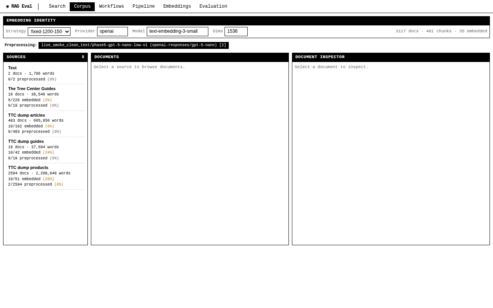
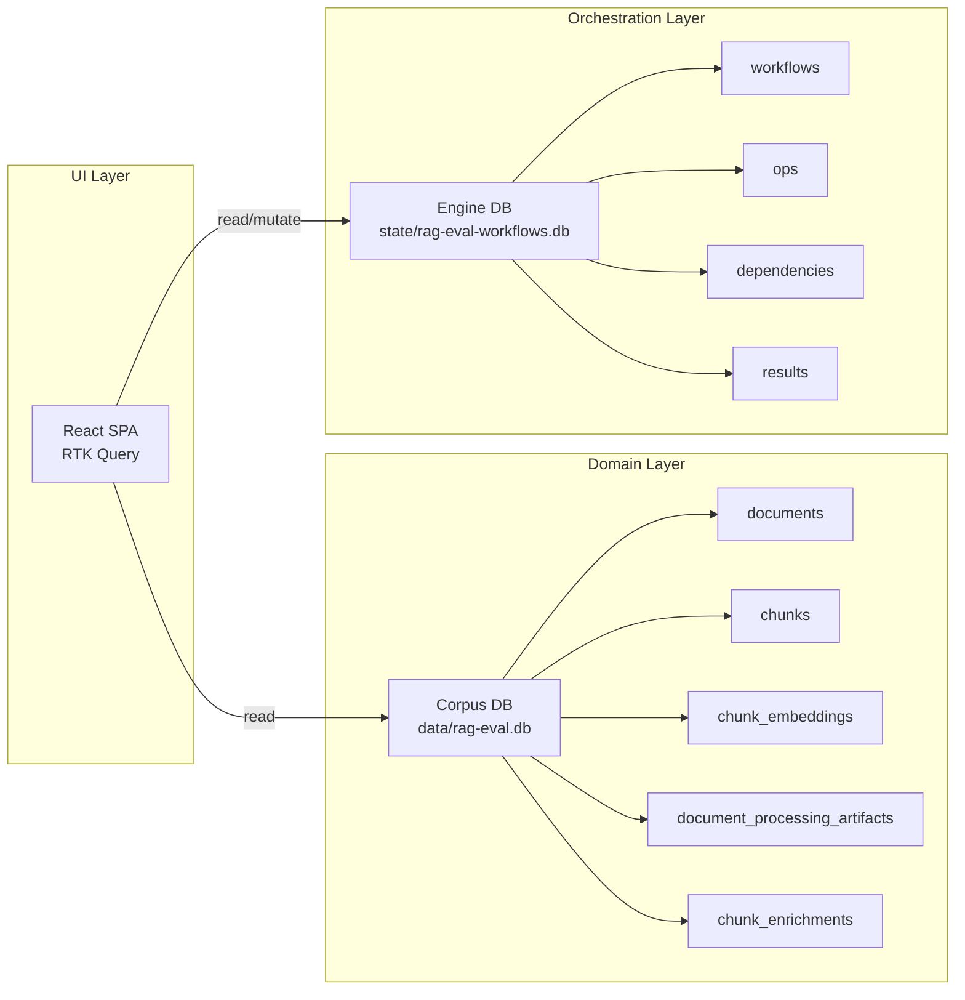
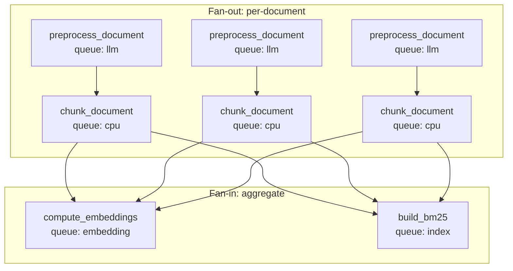
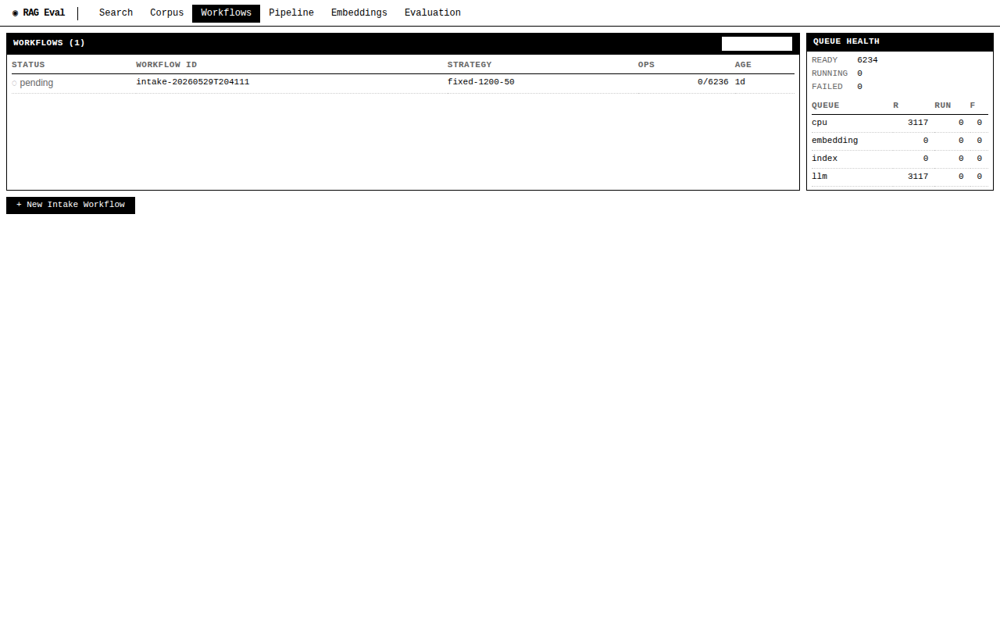
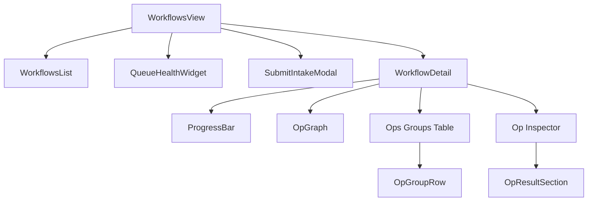
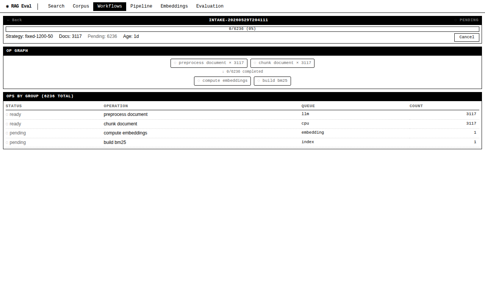
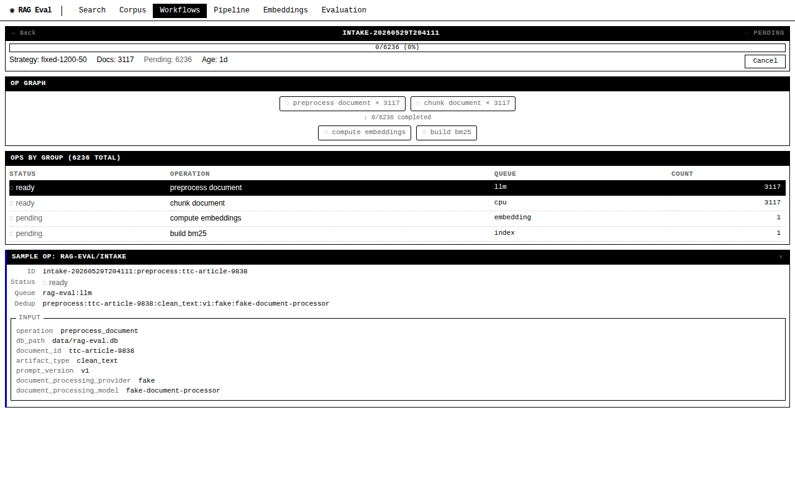
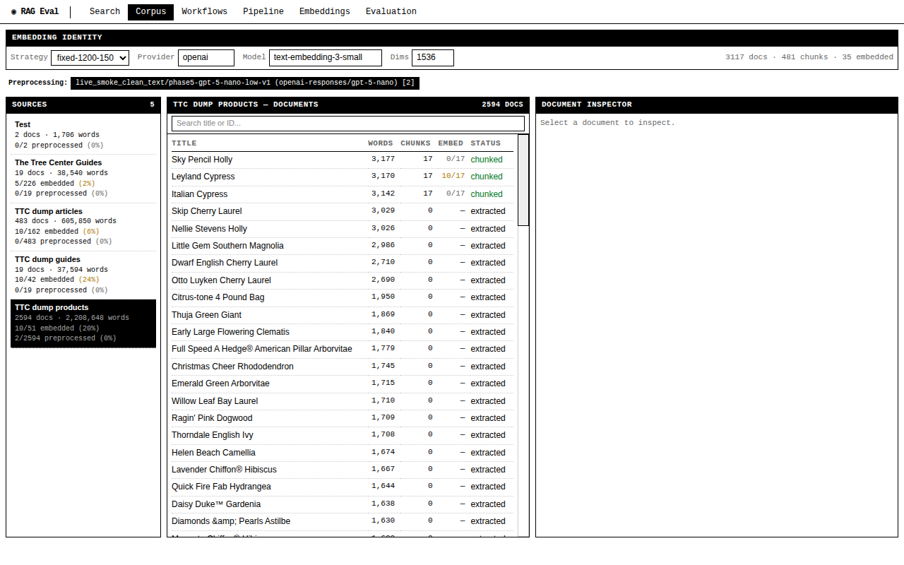
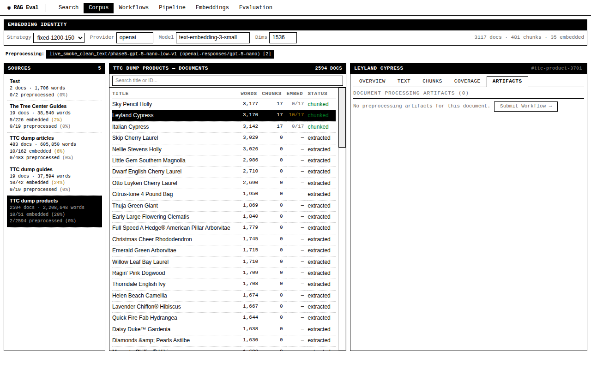
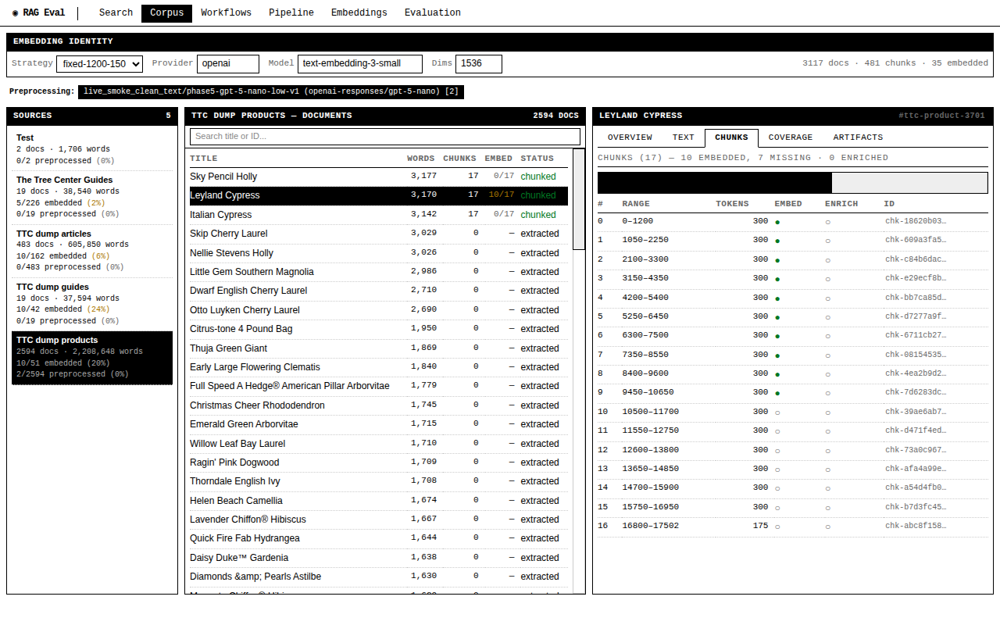

# RAG Evaluation System: Building the Workflow Intake UI — A Technical Deep Dive

This article documents the complete implementation of the workflow intake user interface for the RAG evaluation system, from architecture investigation through backend API design, frontend component construction, and the two cross-cutting features added at the end: artifact identity selection and op result inspection. Every design decision is explained in terms of the problem it solves and the constraints that shaped it. The article is written for engineers who need to understand, modify, or extend this system.

The RAG evaluation system transforms raw documents into searchable vector and BM25 indexes through a durable, retryable pipeline. The pipeline is orchestrated by a scraper workflow engine that constructs a directed acyclic graph of operations from an intake specification. Before this work, developers could submit pipelines only through CLI commands and monitor progress by querying the engine SQLite database directly. The workflow intake UI makes every stage of the pipeline visible and actionable from the browser.

> [!summary]
> - The system uses two SQLite databases: a corpus database for domain data and an engine database for workflow orchestration state. The UI bridges both through separate API paths and merges data client-side.
> - Operations are grouped by (operation, status) in API responses, reducing 6236 individual ops to 4 summary rows with a sample op per group.
> - The Corpus Explorer now shows preprocessing coverage per source, an Artifacts tab per document, and enrichment status per chunk—completing the visibility loop from workflow submission through artifact consumption.
> - Artifact identity selection lets developers switch between preprocessing providers (e.g., fake vs. openai-responses) to see coverage for the identity that matters to them, replacing a previously hardcoded provider.
> - Op result inspection displays what a completed operation produced: output data, records written, artifacts created, and child ops emitted.



## The starting point

The RAG evaluation system had four working views when this work began: Search, Corpus, Pipeline, and Embeddings. Each view operated against the corpus database (`data/rag-eval.db`), which stores sources, documents, chunks, chunk embeddings, and metadata. The system could already chunk documents, compute embeddings, build BM25 indexes, and perform hybrid search.

What the system lacked was any visibility into the workflow engine. The scraper framework stores workflow orchestration state in a separate SQLite database (`state/rag-eval-workflows.db`) that the corpus database knows nothing about. The engine database holds workflow definitions, individual operations with dependency edges, retry state, and op results. The corpus database holds domain data: documents, chunks, embeddings, and artifact records.

The gap mattered because the intake pipeline—the process that takes raw documents through preprocessing, chunking, embedding, and index building—is driven by the workflow engine. A developer submitting an intake workflow from the CLI received a workflow ID and then had to query the engine database directly to check progress, identify failed ops, or see what artifacts the pipeline produced. There was no way to connect a failed workflow op to the document it failed on, or to see which documents still lacked preprocessing artifacts.

## The two-database architecture

The system stores data in two separate SQLite databases, each owned by a different layer of the stack. This separation is a deliberate design choice, not an accident of growth.



The corpus database changes slowly. A document's content text rarely changes once extracted. Chunk embeddings are recomputed only when the embedding identity changes. Artifact records are upserted idempotently.

The engine database changes rapidly. Operations transition from `pending` to `ready` to `running` to `succeeded` or `failed` every few seconds when a scheduler is active. Retry state updates on each attempt. Queue counters shift as ops are leased and completed.

Keeping these databases separate lets the orchestration layer use SQLite WAL mode for concurrent scheduler writes without contending with read queries from the corpus service. The trade-off is that cross-database joins are impossible. When the UI needs to connect workflow state to document data (e.g., showing which documents a workflow processed), it must make two API calls and merge the results in JavaScript.

## The workflow DAG

When a developer submits an intake workflow, the system constructs a directed acyclic graph of operations. The graph has a predictable structure: a fan-out of per-document operations, followed by a fan-in of aggregate operations.



For a source with 3117 documents, the graph contains 3117 `preprocess_document` ops, 3117 `chunk_document` ops, 1 `compute_embeddings` op, and 1 `build_bm25` op—6236 operations total. Each per-document op has a dedup key (e.g., `preprocess:ttc-article-9838:clean_text:v1:fake:fake-document-processor`) that prevents reprocessing if the op is retried.

The fan-in ops depend on all chunk ops. They remain in `pending` status until every chunk op reaches `succeeded`. The scraper engine's dependency resolution works as follows: a `pending` op becomes `ready` when all its `DependsOn` entries are satisfied, and a `ready` op becomes `running` when a scheduler cycle leases it to a worker.

## The ops grouping problem

The first design problem was how to represent 6236 individual ops in a UI without context explosion. Returning 6236 op objects in a single API response produces a JSON payload of hundreds of kilobytes, requires significant browser parsing time, and forces the UI to render thousands of table rows that convey little additional information beyond what a summary provides.

The solution groups ops by their (operation, status) pair and returns one summary row per group. The API endpoint `GET /api/v1/workflows/{id}/ops` returns:

```json
{
  "workflow_id": "intake-20260529T204111",
  "total": 6236,
  "groups": [
    {
      "operation": "preprocess_document",
      "queue": "rag-eval:llm",
      "status": "ready",
      "count": 3117,
      "sample": { "op": { "ID": "...", "Input": { ... } }, "status": "ready" }
    },
    {
      "operation": "chunk_document",
      "queue": "rag-eval:cpu",
      "status": "ready",
      "count": 3117,
      "sample": { ... }
    }
  ]
}
```

Each group includes a `sample` field containing one representative op. The sample provides enough detail for diagnostic inspection—its `Input` object shows the document ID, database path, and operation-specific parameters—without requiring a separate paginated endpoint.

The grouping is performed in the Go handler by iterating the full op list once, building a map keyed by `operation + "|" + status`, then sorting the map entries for stable rendering order. This turns a list of 6236 objects into 4 rows, each with a count and a sample.

## Backend API design

The backend adds 7 new endpoints to the existing handler file. Rather than creating a separate `workflow_handlers.go` file, the endpoints extend `workflow_artifact_handlers.go`, which already handles workflow and artifact cross-concern data.

| Endpoint | Method | Database | Purpose |
|---|---|---|---|
| `GET /api/v1/workflows` | GET | Engine | List workflows with status filter |
| `GET /api/v1/workflows/{id}` | GET | Engine | Workflow summary with per-status counts |
| `GET /api/v1/workflows/{id}/ops` | GET | Engine | Grouped ops summary with sample per group |
| `GET /api/v1/workflows/{id}/results/{opId}` | GET | Engine | Op result: Data, Records, Artifacts, Emitted, Error |
| `POST /api/v1/workflows/{id}/retry/{opId}` | POST | Engine | Reset a failed op to ready for re-execution |
| `POST /api/v1/workflows/{id}/cancel` | POST | Engine | Cancel a running workflow |
| `POST /api/v1/workflows/intake` | POST | Engine | Submit new intake workflow from form params |
| `GET /api/v1/queues` | GET | Engine | Per-queue counts (ready, running, failed, in-flight) |
| `GET /api/v1/artifacts/document-processing/identities` | GET | Corpus | Distinct (artifact_type, prompt_version, provider, model) tuples |
| `GET /api/v1/artifacts/chunk-enrichment/identities` | GET | Corpus | Distinct (strategy_id, prompt_version, provider, model) tuples |
| `GET /api/v1/artifacts/document-processing/coverage` | GET | Corpus | Per-source preprocessing artifact counts for a given identity |
| `GET /api/v1/artifacts/chunk-enrichment/coverage` | GET | Corpus | Per-source chunk enrichment counts |
| `GET /api/v1/documents/{id}/processing-artifacts` | GET | Corpus | All preprocessing artifacts for one document |
| `GET /api/v1/chunks/{id}/enrichments` | GET | Corpus | All enrichments for one chunk |

The engine database endpoints use the scraper `engineview` service package for read operations and the `workflow_mutation_service` for retry and cancel operations. The corpus database endpoints use the `corpus` service for document and chunk queries and the `documentprocessing` and `chunkenrichment` services for artifact coverage.

## Frontend component architecture

The UI consists of two main views: the Workflows view for workflow lifecycle management and the Corpus Explorer for artifact visibility. Both are rendered as tabs in a single-page application using React, RTK Query, and a retro Mac OS monochrome CSS design system.



### Workflows view

The Workflows view is a single React component file (`web/src/components/workflows/WorkflowsView.tsx`) containing seven sub-components.



**WorkflowsList** renders a filterable table of workflows with status icons and progress counts. It polls `GET /api/v1/workflows` every 2 seconds. The status filter dropdown isolates failed or running workflows.

**QueueHealthWidget** shows per-queue counts for the four named queues (`cpu`, `llm`, `embedding`, `index`). It polls `GET /api/v1/queues` every 5 seconds. The aggregate totals at the top give a quick read on system load.

**SubmitIntakeModal** collects source IDs, chunking parameters, embedding configuration, and BM25 toggle. It displays available source names for discoverability and shows error messages when submission fails.

**WorkflowDetail** is the main diagnostic view for a single workflow. It contains:

1. A **ProgressBar** showing the ratio of succeeded/running/failed/total operations with color bands and a percentage label.
2. An **OpGraph** showing the fan-out/fan-in DAG structure with status-colored nodes.
3. An **Ops Groups Table** showing one row per (operation, status) group with the count and queue name.
4. An **Op Inspector** panel that displays the sample op's metadata and input fields, with a "Retry Now" button for failed ops.
5. An **OpResultSection** that lazy-loads the op result when the inspected op has succeeded or failed status.






### The key-based lookup pattern

The retry handler in the inspector does not hold a direct reference to the inspected op object. The `inspectedSample` value is derived from the polled `groups` array, which receives a new object identity every 2 seconds. Placing this derived object in a `useCallback` dependency array causes an infinite re-render loop: new data → new `inspectedSample` → new callback → new render → repeat.

The solution stores only the stable group key (e.g., `"preprocess_document|ready"`) in React state. The retry handler looks up the current sample from the polled `groups` array at call time:

```typescript
const [inspectedGroup, setInspectedGroup] = useState<string | null>(null);

// In the retry button's onClick:
const g = groups.find(gr => gr.operation + '|' + gr.status === inspectedGroup);
if (!g?.sample) return;
await retryOp({ workflowId, opId: g.sample.op.ID }).unwrap();
```

This pattern avoids the stale closure problem (the lookup uses current data) and avoids the render-time side effect problem (no `useRef.current` assignment during render). It works because the group key is a stable string that does not change across polls.

### Op result inspection

When a workflow operation completes, the scraper engine writes an `OpResult` row to the engine database's `results` table. The result contains several fields that describe what the operation produced:

- **Data**: a JSON object with operation-specific output (e.g., `{"ok": true}`)
- **Records**: a list of database records written, each with a table name and primary key
- **Artifacts**: a list of files produced (name, kind, content type, binary body)
- **Emitted**: a list of child operation specifications spawned by this op
- **EmittedIDs**: the IDs of those child ops
- **Error**: if the op failed, the error code, message, and retryability flag
- **CompletedAt**: when the op finished

The `OpResultSection` component fetches this data via `GET /api/v1/workflows/{id}/results/{opId}` only when the inspected op has `succeeded` or `failed` status. It renders the Data as a JSON code block, Records as a table, Artifacts as a name/kind/contentType list, Emitted ops as a scrollable ID list (capped at 20 with overflow indicator), and Error in a red error box. If the endpoint returns 404 (the op completed but no result row was written), it shows "No result data recorded for this op."

### Corpus Explorer additions

Three additions to the Corpus Explorer surface artifact data produced by workflows.



**SourcePanel preprocessing coverage.** Each source in the left panel shows a preprocessing coverage line below the existing embedding coverage line:

```
The Tree Center Guides
19 docs · 38,540 words
5/226 embedded (2%)
0/19 preprocessed (0%)
```

The preprocessing coverage comes from `GET /api/v1/artifacts/document-processing/coverage`, which returns per-source counts for a given identity. The identity is selected by the new `DocProcessingIdentityBar` component described below.

**DocumentInspector Artifacts tab.** The document inspector has five tabs: overview, text, chunks, coverage, artifacts. The artifacts tab is lazy-loaded (fetched only when the tab is active) and shows a table of preprocessing artifacts with type, prompt version, provider, status, and age columns. Clicking a row opens the ArtifactDetail sub-component showing the input hash, output text, and error message.



When no artifacts exist, the tab shows a "Submit Workflow →" button that dispatches a `rag:navigate-to-workflows` custom event, switching the main view to the Workflows tab.

**Chunk enrichment indicator.** The chunks tab has an "Enrich" column between "Embed" and "ID" that shows ● (enriched) or ○ (not enriched) for each chunk. This data comes from a `LEFT JOIN chunk_enrichments` added to the backend `DocumentDetail` query.



## Artifact identity selection

Preprocessing and enrichment artifacts have their own identity axes that do not align with embedding identity. Embedding identity is defined by `(provider_type, model, dimensions)` — controlled by the IdentityBar at the top of the Corpus Explorer. Preprocessing identity is defined by `(artifact_type, prompt_version, provider, model)`. Enrichment identity is defined by `(strategy_id, prompt_version)`.

The initial implementation used a hardcoded preprocessing identity (`artifact_type=clean_text`, `prompt_version=v1`, `provider=fake`, `model=fake-document-processor`) in the SourcePanel coverage query. This returned zero artifacts because the real workflows used `openai-responses/gpt-5-nano` as the provider.

The fix adds two backend endpoints that query distinct identity tuples from the artifact tables:

```
GET /api/v1/artifacts/document-processing/identities
→ [{artifact_type, prompt_version, provider, model, artifact_count}]

GET /api/v1/artifacts/chunk-enrichment/identities
→ [{strategy_id, prompt_version, provider, model, enriched_count}]
```

The Go queries are straightforward `GROUP BY` aggregations:

```sql
SELECT artifact_type, prompt_version, provider, model, COUNT(*)
FROM document_processing_artifacts
GROUP BY artifact_type, prompt_version, provider, model
ORDER BY artifact_type, prompt_version, provider, model
```

The frontend `DocProcessingIdentityBar` component renders a row of buttons below the embedding IdentityBar. Each button represents one identity, showing the tuple and artifact count (e.g., `live_smoke_clean_text/phase5-gpt-5-nano-low-v1 (openai-responses/gpt-5-nano) [2]`). Clicking a button changes the preprocessing coverage query parameters, and the SourcePanel re-renders with coverage data for the selected identity.

When the identities endpoint returns data and the current selection is the default fake provider, the `CorpusExplorerView` auto-selects the first real identity. This replaces the hardcoded fake provider with the actual provider identity from the database. The result is visible immediately: the SourcePanel shows "2/2594 preprocessed (0%)" for the ttc-dump-products source instead of "0/2594 preprocessed (0%)".

## Cross-view navigation

The UI supports bidirectional navigation between the Workflows tab and the Corpus Explorer using `CustomEvent` dispatched on the `window` object.

1. **Workflows → Corpus**: In a succeeded workflow detail, the "View in Corpus →" button dispatches a `rag:navigate-to-chunk` event with `{ sourceId, strategyId }`, switching to the Corpus Explorer with the relevant source selected.
2. **Corpus → Workflows**: In a document's Artifacts tab, the "Submit Workflow →" button dispatches a `rag:navigate-to-workflows` event, switching to the Workflows view where the developer can submit a new intake workflow.

The App.tsx component listens for both events and switches the active view accordingly. This navigation pattern avoids coupling the two views through shared state or URL routing while maintaining a natural workflow: submit → observe → inspect → diagnose → submit again.

## RTK Query data flow

All API communication flows through a single RTK Query API slice defined in `web/src/services/api.ts`. The slice defines 19 endpoints with three tag types: `Sources`, `Workflows`, and `Artifacts`. Polling is configured per-endpoint using `pollingInterval`:

- Workflow list and detail: 2 seconds
- Queue health: 5 seconds
- Artifact coverage and identities: no polling (fetched once on mount)

The tag-based cache invalidation is minimal: mutation endpoints (`submitIntakeWorkflow`, `retryOp`, `cancelWorkflow`) invalidate the `Workflows` tag, causing all active workflow queries to refetch. There are currently no mutations that invalidate the `Artifacts` tag, because artifact data changes only when a workflow completes.

Lazy loading uses RTK Query's `skip` parameter. The `OpResultSection` skips the `getOpResult` query when the inspected op is not in a terminal state. The DocumentInspector's Artifacts tab skips the `getDocumentProcessingArtifacts` query when the artifacts tab is not active. This prevents unnecessary network requests for data the user is not currently viewing.

## JSON serialization conventions

The Go backend uses `encoding/json` with a mix of explicit `json` struct tags and default exported-field serialization. This produces two different naming conventions in the same API response, which the TypeScript types must match exactly.

For wrapper structs with explicit `json` tags, the serialization uses camelCase:

```go
type opGroup struct {
    Operation string `json:"operation"`
    Status    string `json:"status"`
    Count     int    `json:"count"`
    Sample    *engineview.WorkflowOp `json:"sample,omitempty"`
}
```

For nested model structs without `json` tags, the serialization uses PascalCase (Go's default for exported fields):

```go
type WorkflowRun struct {
    ID        string   // → "ID"
    Status    string   // → "Status"
    Queue     string   // → "Queue"
    RetryState struct {
        Attempt    int    // → "Attempt"
        LastError  string // → "LastError"
    }
}
```

The TypeScript interfaces must mirror these conventions exactly. A `WorkflowOp` in TypeScript looks like:

```typescript
interface WorkflowOp {
  op: {
    ID: string;           // PascalCase from Go struct field
    Status: string;       // PascalCase
    Queue: string;        // PascalCase
    RetryState: {
      Attempt: number;   // PascalCase
      LastError: string; // PascalCase
    };
  };
  status: string;        // camelCase from json tag
  createdAt: string;     // camelCase from json tag
}
```

This dual convention is a consequence of embedding the scraper's model types (which lack `json` tags) inside wrapper structs that do have `json` tags. It is a known source of bugs: if a TypeScript developer assumes one convention uniformly, field mismatches cause silent undefined values in the UI.

## CSS design system

The UI uses a retro Mac OS monochrome design system defined in `web/src/index.css`. The system uses CSS custom properties for all colors, fonts, and spacing, producing a black-and-white interface with blue and red accents for interactive and error states.

The design system defines these component classes:

- **Panel**: bordered container with a black header bar and white body. Used for all major content blocks.
- **Data table**: striped table with monospace headers, dotted row separators, and hover highlighting. Selectable rows use the `.selectable` / `.selected` pattern.
- **Progress bar**: bounded bar with fill bands for done (black), running (blue), and failed (red) segments, plus a centered label showing the percentage.
- **Op graph**: flex-column layout with fan-out nodes at top, an arrow indicator, and fan-in nodes at bottom. Each node is a bordered pill with a status icon.
- **Form section**: bordered fieldset with uppercase legend, right-aligned labels, and full-width inputs using the `.form-row` pattern.
- **Modal overlay**: fixed-position backdrop with centered panel. Clicking the backdrop dismisses the modal.

The status colors use foreground-only classes (`status-done`, `status-running`, `status-error`, `status-canceled`, `status-pending`) that set the `color` property without backgrounds. This keeps the monochrome aesthetic while providing visual differentiation through color alone.

## Implementation sequence

The implementation proceeded in seven phases across two tickets (RAGEVAL-006 and RAGEVAL-007), plus a final cross-cutting phase for artifact identity selection and op result inspection.

| Phase | Ticket | What was built | Commit |
|---|---|---|---|
| 0 | RAGEVAL-006 | Scraper dependency spike, echo runner, scheduler integration tests | (multiple) |
| 1 | RAGEVAL-006 | Go-native intake runner: chunk_document, compute_embeddings, build_bm25 | (multiple) |
| 2 | RAGEVAL-006 | Workflow submit/worker/status CLI commands | (multiple) |
| 3 | RAGEVAL-006 | Document preprocessing artifact schema, service, workflow op | (multiple) |
| 4 | RAGEVAL-006 | Chunk enrichment DB helpers, service, workflow op | (multiple) |
| 5 | RAGEVAL-006 | Live provider smoke with gpt-5-nano-low profile | (multiple) |
| 6 backend | RAGEVAL-006 | Read-only API endpoints for workflows, artifacts, coverage | `4b72af8` |
| 1 | RAGEVAL-007 | 5 workflow API endpoints (retry, cancel, submit, queues, result) | `fafb6ab` |
| 2–6 | RAGEVAL-007 | RTK Query types, WorkflowsView components, tab wiring | `387713d` |
| 7 | RAGEVAL-007 | CSS polish, progress bar, form styling, React #310 fix | `1851167` |
| refactor | RAGEVAL-007 | Drop useRef, key-based lookup for op inspector | `5e97f11` |
| 6 frontend | RAGEVAL-006 | Artifact RTK Query endpoints, SourcePanel coverage, Artifacts tab, Enrich column, enrichment join | `164aded` |
| 6 cross-link | RAGEVAL-006 | Reverse navigation from Corpus Explorer to Workflows tab | `4cbf0cb` |
| cross-cut | both | Artifact identity selector (backend + frontend), op result inspection | `0cccb74` |

The key implementation insight: RAGEVAL-007 built the Workflows view first, then RAGEVAL-006 Phase 6 wired the artifact endpoints into the Corpus Explorer. The reverse order would have required building artifact visibility without a way to submit or monitor the workflows that produce those artifacts.

## What failed and what was learned

### React infinite re-render (#310)

The polling-based data flow caused React to re-render infinitely when the `inspectedSample` derived object was placed in a `useCallback` dependency array. The polled `groups` array receives a new object identity every 2 seconds, producing a new `inspectedSample` each time, which triggers the callback recreation, which triggers a re-render.

The fix was the key-based lookup pattern described above. The lesson: when consuming polling data that produces new object identities on each cycle, store only stable primitive keys (strings, numbers) in React state and look up derived objects from current data at call time. Never place derived objects from polling data in hook dependency arrays.

### Hardcoded identity

The initial preprocessing coverage query used `provider=fake, model=fake-document-processor` because that was the identity used by the fake provider during development. When real workflows ran with `openai-responses/gpt-5-nano`, the coverage query returned zero results for all sources, and the UI showed "0/2594 preprocessed" everywhere.

The fix was the artifact identity selector that queries distinct identities from the database and lets the user choose. The lesson: when building coverage queries against a multi-identity schema, never hardcode an identity. Either auto-detect available identities or provide a selector.

### SPA fallback intercepting API routes

After adding the `GET /api/v1/artifacts/document-processing/identities` route, the SPA fallback handler served `index.html` for that URL instead of routing to the Go handler. The cause was running an old binary that did not include the new route registration. Go 1.22's `ServeMux` pattern matching (`GET /api/v1/...`) correctly prioritizes specific method+path patterns over the root `/` pattern, but only if the binary actually contains the route. The lesson: always rebuild and restart the server after adding routes, and verify with `curl` before testing in the browser.

## Known limitations

**Enrichment join ambiguity.** The `LEFT JOIN chunk_enrichments` in the DocumentDetail query may return an arbitrary row when multiple enrichments exist for the same chunk with different prompt versions. A production implementation should add a subquery that selects the latest or highest-quality enrichment per chunk.

**Polling instead of SSE.** All workflow data updates via polling (2s or 5s intervals). This creates unnecessary HTTP traffic when nothing changes and introduces a latency window before updates appear. Server-Sent Events would push status changes as they happen and eliminate the polling-induced re-render cycles.

**No per-group drill-down.** The ops groups table shows one sample op per group. There is no way to list all failed chunk ops or all running preprocess ops with pagination. A future endpoint `GET /api/v1/workflows/{id}/ops?operation=chunk_document&status=failed&limit=50&offset=0` would support this.

## Key source files

| File | Role |
|---|---|
| `internal/api/handlers.go` | Route registration for all 19 API endpoints |
| `internal/api/workflow_artifact_handlers.go` | Workflow CRUD, artifact coverage, identity, and mutation handlers |
| `internal/services/corpus/service.go` | DocumentDetail query with chunk + enrichment joins |
| `internal/workflow/intake_runner.go` | Go-native scraper runner dispatching all intake operations |
| `internal/workflow/submit.go` | Workflow DAG construction from intake parameters |
| `internal/db/document_processing_queries.go` | Artifact CRUD, coverage, and identity queries |
| `internal/db/chunk_enrichment_queries.go` | Enrichment CRUD, coverage, and identity queries |
| `web/src/services/api.ts` | RTK Query API slice with 19 endpoints and TypeScript types |
| `web/src/components/workflows/WorkflowsView.tsx` | All workflow UI sub-components including OpResultSection |
| `web/src/components/corpus/CorpusExplorerView.tsx` | Corpus Explorer with artifact identity integration |
| `web/src/components/corpus/DocumentInspector.tsx` | Document detail with Artifacts tab and Enrich column |
| `web/src/components/corpus/SourcePanel.tsx` | Source list with preprocessing coverage display |
| `web/src/components/corpus/ArtifactIdentityBar.tsx` | Artifact identity selector (DocProcessingIdentityBar) |
| `web/src/index.css` | Retro Mac design system CSS |

## Working rules

- Always group ops by (operation, status) in API responses. Never return individual ops for workflows with more than a few hundred operations.
- Use stable string keys for derived state lookups rather than holding references to polled data objects in callback closures.
- Keep the two databases separate in the API layer. Cross-database joins belong in the UI, not in the backend.
- Mirror Go JSON serialization conventions exactly in TypeScript. PascalCase for scraper model fields without `json` tags, camelCase for wrapper struct fields with `json` tags.
- Poll at 2s for workflow data, 5s for queue data. Do not poll artifact coverage data (it changes only when workflows complete).
- Never hardcode artifact identities in coverage queries. Always fetch available identities from the database and let the user select.
- Use the retro Mac design system classes for all new components. Do not use inline styles for layout or typography.

## Near-term next steps

- Per-group drill-down endpoint (paginated individual ops for a specific operation+status group)
- SSE instead of polling for real-time workflow updates
- Enrichment LEFT JOIN fix for multiple versions (GROUP BY or subquery for latest)
- Workflow templates for common configurations
- Devctl plugin for dynamic port allocation (already committed as `3216dc2`)
- RAGEVAL-006 Phase 7 retrospective
