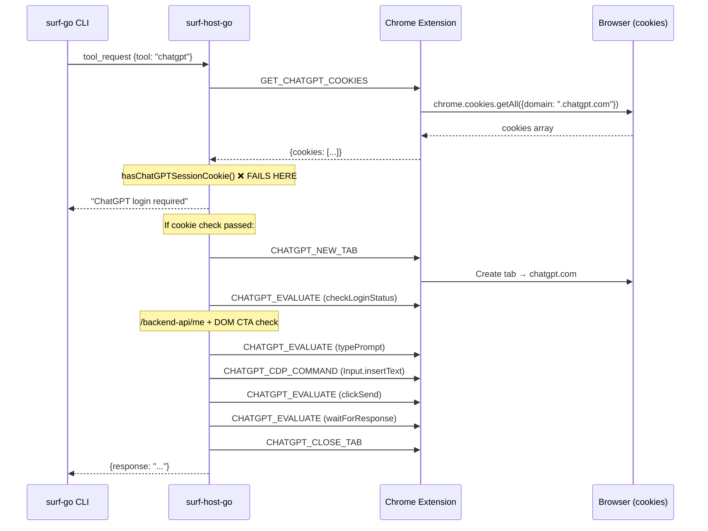

# ChatGPT Login-Required False Positive: When an Auth Library Silently Changes the Contract

This note documents a specific failure in the surf-cli project and the broader lesson it carries. The surf `chatgpt` command stopped working: every invocation returned "ChatGPT login required" even when the user was clearly logged in. The root cause was not a network issue, not a transport bug, and not a missing cookie. It was a silent naming change in the authentication library underneath ChatGPT. NextAuth.js v5 replaced the single session cookie `__Secure-next-auth.session-token` with numbered variants: `.0`, `.1`, and so on. The surf providers — both Go and JavaScript — checked for the old exact name and never found it.

The debugging path is worth preserving because it illustrates a class of failure that is particularly treacherous in browser automation: the server changes something that is visible to the browser but invisible to your code, and the only symptom is a vague "not authorized" error that does not tell you which assumption broke.

> [!summary]
> The three lessons worth carrying forward:
> 1. When a web application changes auth cookie names, any code that checks exact cookie names silently breaks. The fix is prefix matching, not exact matching.
> 2. The Chromium cookie database (`~/snap/chromium/common/chromium/<Profile>/Cookies`) can be read directly with `sqlite3` — this bypasses the entire browser automation chain and gives ground truth about what cookies exist.
> 3. Browser automation auth checks should use the weakest possible contract with the server's auth system. A cookie-name prefix match is more robust than an exact name; a session-status fetch (`/backend-api/me`) is more robust than any cookie check.

## Why this note exists

The surf project has a pattern where provider commands — ChatGPT, Gemini, Perplexity, Grok — open a browser tab, verify the user is logged in by checking cookies, then automate the page. This pattern worked for months. When it stopped working for ChatGPT, the initial assumption was that the user's session had expired or that the native messaging host had disconnected. Both were wrong.

The real cause was an invisible contract change: ChatGPT upgraded to NextAuth.js v5, which introduced multi-session support. The old contract was "one session, one cookie, one name." The new contract is "N sessions, N numbered cookies." Neither the Go provider nor the Node.js provider was prepared for this, and the error message gave no hint about the underlying reason.

This note exists because the same class of failure will happen again. Any automation that depends on exact cookie names, exact DOM selectors, or exact API response shapes is vulnerable to silent breakage when the upstream application changes. The fix for this specific case is narrow; the principle behind the fix is general.

## The failure: what the user saw

The user ran:

```bash
surf chatgpt ask "say ping"
```

and received:

```
Error: ChatGPT login required
```

The user was logged into ChatGPT in their browser. The extension was loaded. The native messaging host was running. Everything looked correct. But the command failed immediately, before a ChatGPT tab was ever opened.

The key diagnostic clue was invisible to the user but critical once you know it: **no ChatGPT tab briefly opened and then closed**. If the login check had failed after the tab was created, you would see a tab flash open. The fact that no tab appeared at all meant the failure was in the pre-tab cookie check — the very first gate in the entire flow.

## The architecture of the check

To understand what broke, you need to see how the ChatGPT provider flow works. The provider runs in the Go native host, not in the CLI itself. When the CLI sends a `chatgpt` tool request over the Unix socket, the host intercepts it and runs `HandleChatGPTTool`, which orchestrates the entire workflow by sending individual primitives to the Chrome extension over native messaging.



There are two login gates in this flow, and both emit the same error message. The first gate is the cookie check, which runs before any tab is created. The second gate is the page-based check (`/backend-api/me` fetch plus DOM CTA scan), which runs after the tab loads. The fact that both gates produce identical error text made the failure harder to diagnose — you cannot tell from the error alone which gate rejected you.

## The root cause: NextAuth v5 numbered session tokens

NextAuth.js is the authentication framework that ChatGPT uses. In v4, a user's session was stored in a single cookie:

```
__Secure-next-auth.session-token = <long JWT>
```

In v5, NextAuth introduced multi-session support. A user can have multiple concurrent sessions, each stored in a numbered cookie:

```
__Secure-next-auth.session-token.0 = <primary JWT, ~4KB>
__Secure-next-auth.session-token.1 = <secondary/refresh token, ~260 bytes>
```

The old exact-name cookie no longer exists.

Both the Go and JavaScript providers in surf checked for the exact name `__Secure-next-auth.session-token`. When that name disappeared, the cookie check returned false every time, and every ChatGPT request failed with "login required."

The Go code that failed:

```go
func hasChatGPTSessionCookie(raw any) bool {
    items, ok := raw.([]any)
    if !ok { return false }
    for _, item := range items {
        m, _ := item.(map[string]any)
        if m == nil { continue }
        // This exact equality check never matched again:
        if asString(m["name"]) == "__Secure-next-auth.session-token" &&
           strings.TrimSpace(asString(m["value"])) != "" {
            return true
        }
    }
    return false
}
```

The JavaScript code that failed:

```javascript
function hasRequiredCookies(cookies) {
    if (!cookies || !Array.isArray(cookies)) return false;
    const sessionCookie = cookies.find(
        (c) => c.name === "__Secure-next-auth.session-token" && c.value
    );
    return Boolean(sessionCookie);
}
```

These two functions were logically identical and simultaneously broken by the same upstream change.

## How the root cause was found

The standard debugging tools — `--debug-socket` flag, native host logs, Chrome DevTools console — all depend on the native messaging host being connected and the Unix socket existing. In this session, the host was not running and could not be started without triggering the extension from Chrome. Playwright was locked by another process. The `surf kagi search` command also depends on the same socket.

The breakthrough came from bypassing the entire tool chain and reading the Chromium cookie database directly. Chromium stores cookies in a SQLite database at a well-known path inside the user's profile directory:

```bash
sqlite3 "/home/manuel/snap/chromium/common/chromium/Profile 2/Cookies" \
  "SELECT name, host_key, path, is_secure FROM cookies
   WHERE host_key LIKE '%chatgpt%' ORDER BY host_key, name;"
```

The results were immediate and conclusive:

| Cookie Name | Domain | Secure |
|---|---|---|
| `__Secure-next-auth.session-token.0` | `.chatgpt.com` | yes |
| `__Secure-next-auth.session-token.1` | `.chatgpt.com` | yes |
| `__Secure-next-auth.callback-url` | `chatgpt.com` | yes |
| `__Host-next-auth.csrf-token` | `chatgpt.com` | yes |
| `cf_clearance` | `.chatgpt.com` | yes |
| `oai-did` | `.chatgpt.com` | no |
| `oai-sc` | `.chatgpt.com` | yes |

No cookie named exactly `__Secure-next-auth.session-token` appeared anywhere in the results. The old name was simply gone.

This technique — direct SQLite read of the browser cookie database — is a powerful diagnostic for any browser automation issue that might involve cookies. It requires no running host, no socket, no extension cooperation. It gives ground truth about what the browser actually stores, independent of every layer of automation code that sits between you and the browser.

## The fix: prefix matching

The fix replaces exact-name equality with prefix matching. Instead of checking whether a cookie's name equals a specific string, the check now asks whether the name starts with the known prefix. This is robust against numbered suffixes, unknown future suffixes, and both Secure and non-Secure variants.

The Go fix:

```go
func hasChatGPTSessionCookie(raw any) bool {
    items, ok := raw.([]any)
    if !ok { return false }
    for _, item := range items {
        m, _ := item.(map[string]any)
        if m == nil { continue }
        name := asString(m["name"])
        value := strings.TrimSpace(asString(m["value"]))
        if value == "" { continue }
        // NextAuth v4: exact name
        if name == "__Secure-next-auth.session-token" ||
           // NextAuth v5: numbered suffixes (.0, .1, etc.)
           strings.HasPrefix(name, "__Secure-next-auth.session-token.") ||
           // Non-Secure variant (non-HTTPS contexts)
           name == "next-auth.session-token" ||
           strings.HasPrefix(name, "next-auth.session-token.") {
            return true
        }
    }
    return false
}
```

The JavaScript fix follows the same structure using `String.prototype.startsWith`.

Why prefix matching rather than a regular expression? Three reasons. First, `strings.HasPrefix` and `startsWith` are operations that any developer reads instantly; `regexp.MatchString` is not. Second, the prefix check covers any number of numbered sessions without enumerating them — `.0`, `.1`, `.2`, or `.42` all match. Third, there is no performance concern here; this function runs once per ChatGPT invocation over an array of perhaps thirty cookies.

The fix is backward compatible. The exact-name checks for `__Secure-next-auth.session-token` are still present, so a ChatGPT instance that has not upgraded to NextAuth v5 will continue to work.

## What was not changed

The second login gate — the page-based `checkLoginStatus()` that fetches `/backend-api/me` and scans the DOM for login CTA buttons — was left untouched. That gate is independent of cookie naming. It is also a more reliable signal in principle, because it asks the server "am I authenticated?" rather than inferring authentication from the presence of a cookie. The cookie check exists as a fast early exit: if no session cookie exists at all, there is no point opening a tab.

A future improvement would be to distinguish the two error messages. Today, both gates produce the identical string `"ChatGPT login required"`. Changing the first to `"ChatGPT session cookie not found"` and the second to `"ChatGPT page reports not logged in"` would make the next debugging round faster.

## Common failure modes

This incident falls into a broader class that affects any system that automates a web application it does not control.

**Exact-name contract with external state.** When your code checks for an exact string — a cookie name, a CSS selector, a DOM attribute — and the external application changes that string, your code silently breaks. The failure does not produce a helpful error. It produces a "not found" or "not authorized" that is indistinguishable from a legitimate absence.

**Indistinguishable error sources.** When two different code paths produce the same error message, diagnosing which path was taken requires external evidence. In this case, the external evidence was "did a ChatGPT tab briefly open?" — a visual cue that only works if a human is watching.

**Silent upstream contract changes.** ChatGPT did not announce "we are renaming our session cookies." The change happened as part of a NextAuth version upgrade. For the ChatGPT team, it was an internal implementation detail. For the automation, it was a breaking change. This is the default mode of the web: applications change their internals, and anything that depends on those internals breaks without warning.

## Working rules

These are the engineering rules derived from this incident, intended to guide future provider work in surf and similar projects.

1. **Match cookie names by prefix, not by exact equality.** If you need to verify that a session cookie exists, check for a name prefix rather than an exact name. The prefix `__Secure-next-auth.session-token` matches both the v4 single-token and the v5 numbered tokens. This pattern should be applied to every provider's cookie check.

2. **Distinguish error sources in error messages.** When multiple code paths can produce the same logical error, encode which path was taken in the error text. `"Cookie not found: __Secure-next-auth.session-token"` is more useful than `"ChatGPT login required"`.

3. **Use the weakest contract you can.** A page-based session check (`fetch('/backend-api/me')`) depends on a stable API endpoint and a stable response shape, which is a weaker contract than depending on a specific cookie name. Cookie names are an implementation detail of the auth library; API endpoints are an interface. Prefer interfaces over implementation details.

4. **When the tool chain is down, go to the source.** The Chromium cookie database is a SQLite file that you can read with `sqlite3` without any running host or socket. This technique applies broadly: browser local storage, IndexedDB, and cache databases are all on disk and readable directly. When the automation infrastructure cannot connect, bypass it.

5. **Test with real data shapes, not just the shape you expect.** The existing Go and JS tests all used `__Secure-next-auth.session-token` as the cookie name because that was the only known shape. Adding test cases with `.0` and `.1` suffixes would have caught the regression immediately if the test data had been updated to reflect the real world. Consider periodically verifying test assumptions against live data.

## Important code paths

The files changed in this fix:

- `/home/manuel/code/others/llms/pi/nicobailon/surf-cli/go/internal/host/providers/chatgpt.go` — `hasChatGPTSessionCookie()` changed from exact-name to prefix matching
- `/home/manuel/code/others/llms/pi/nicobailon/surf-cli/native/chatgpt-client.cjs` — `hasRequiredCookies()` changed from exact-name to prefix matching
- `/home/manuel/code/others/llms/pi/nicobailon/surf-cli/go/internal/host/providers/chatgpt_test.go` — 14 new `TestHasChatGPTSessionCookie` sub-tests + 1 integration test with v5 cookies
- `/home/manuel/code/others/llms/pi/nicobailon/surf-cli/test/unit/chatgpt-client.test.ts` — new v5 cookie test case

The ticket workspace with the full investigation diary, design doc, and build/debug playbook:

- `/home/manuel/code/others/llms/pi/nicobailon/surf-cli/ttmp/2026/05/30/SURF-20260530-CG1--fix-chatgpt-login-required-false-positive-after-get-chatgpt-cookies-in-go-host`

Related prior tickets that shaped the ChatGPT provider:

- `/home/manuel/code/others/llms/pi/nicobailon/surf-cli/ttmp/2026/02/25/SURF-20260225-R3--go-host-provider-compatibility-research-chatgpt-gemini-perplexity-grok-ai-studio` — provider compatibility research
- `/home/manuel/code/others/llms/pi/nicobailon/surf-cli/ttmp/2026/04/10/SURF-20260410-R6--shared-tab-readiness-helper-and-chatgpt-extraction-bug` — earlier ChatGPT extraction bug

## Open questions

- Should the other providers (Gemini, Perplexity, Grok, AI Studio) be audited for similar exact-name cookie checks? The Google provider uses a different cookie aggregation strategy that may be more resilient.
- Should the surf diagnostic infrastructure include a `surf diagnose` command that checks cookie presence and login status without sending a prompt?
- Is the Chromium cookie database stable enough across Chrome versions to rely on for programmatic diagnostics, or is it an ad hoc tool only?

## Near-term next steps

- Live validation: reload the Surf extension in Chrome, run `surf chatgpt ask "say ping" --debug-socket`, confirm the fix works end-to-end.
- Audit other providers for similar exact-name cookie checks.
- Consider adding distinct error messages for the two login gates.
