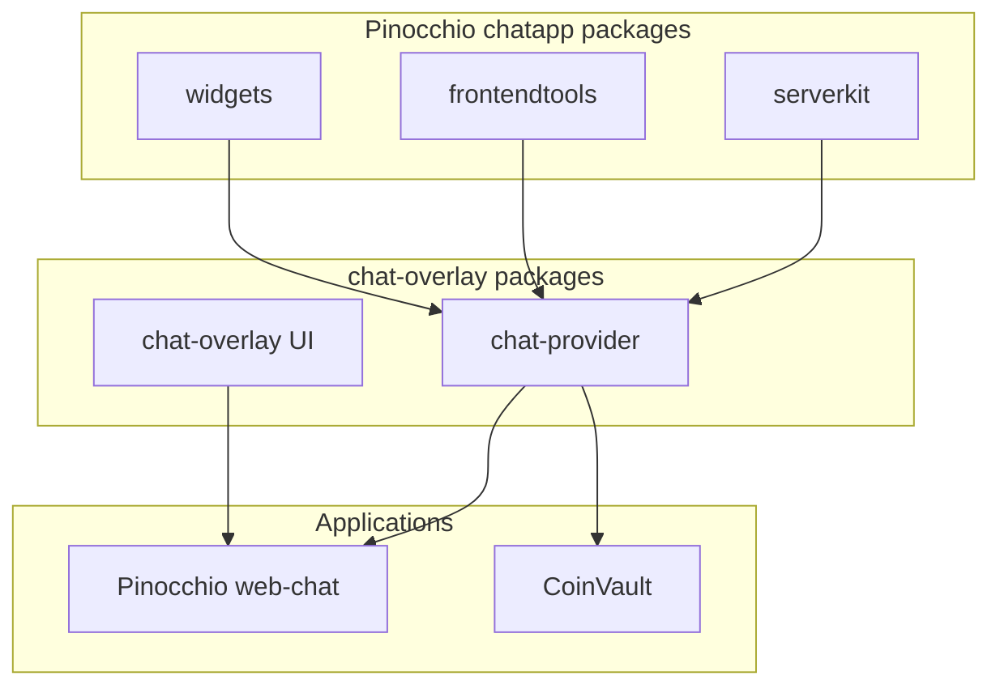
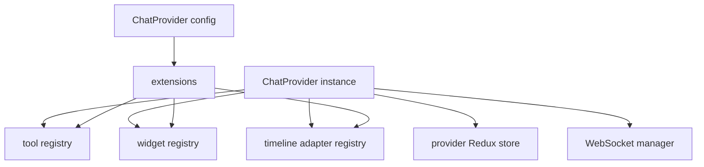
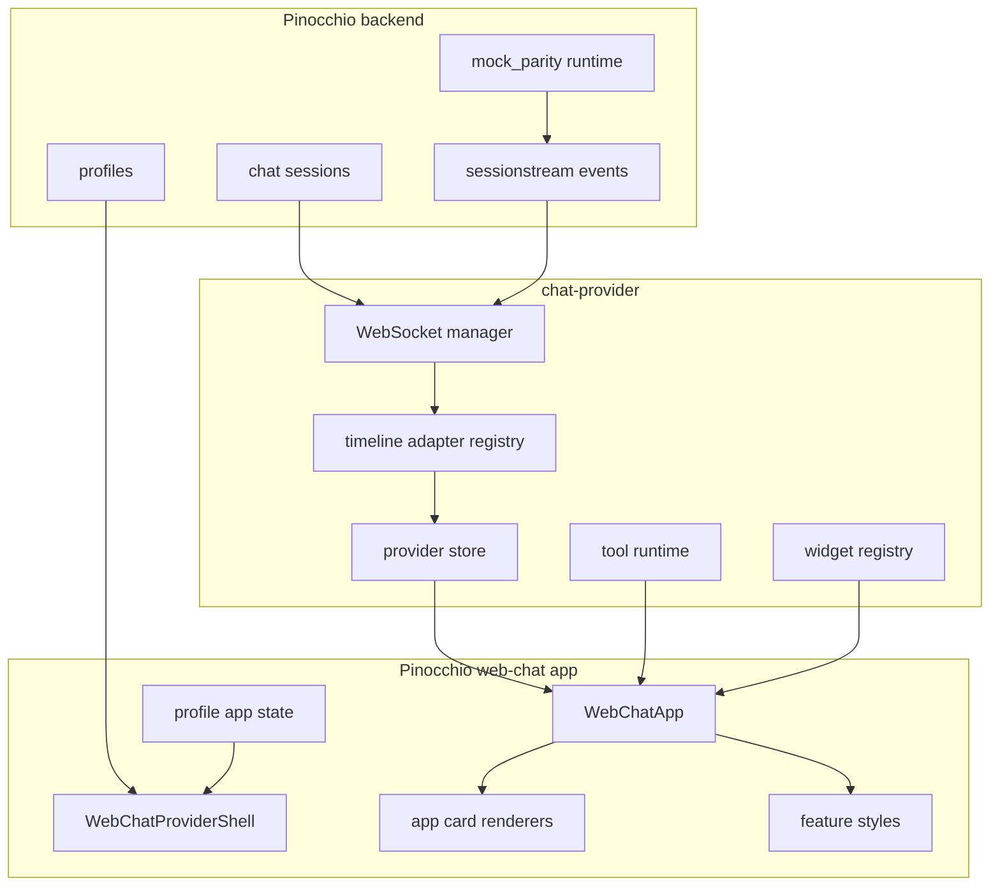

# ChatProvider Web Chat Cleanup: Provider Runtime, Timeline Adapters, and Example Architecture

This article documents the cleanup and hardening work that turned Pinocchio's web-chat frontend into a provider-backed React example with explicit runtime boundaries, deterministic parity tests, adapter-backed hydration, modular styling, and a smaller maintenance surface. The work spans the sibling repositories in `/home/manuel/workspaces/2026-05-29/chatbot-react`: the generic chat provider and overlay workspace at `2026-05-29--chatbot-overlay-glm`, and the Pinocchio application repository at `pinocchio`.

The central engineering problem was not only that the frontend had old code. The more important problem was that two runtime models existed at the same time. The legacy model used a Pinocchio-specific Redux store, WebSocket manager, event projector, and snapshot mapper. The new model used a reusable `@go-go-golems/chat-provider` runtime and app-owned renderers. As long as both existed, every feature had to be checked twice: once in the legacy path and once in the provider path. The cleanup established one production path and then removed the old one after targeted parity evidence existed.

> [!summary]
> - Pinocchio web-chat now uses a headless `ChatProvider` runtime as the production chat mechanism. The app owns profile selection, cards, layout, styles, and domain-specific timeline adapters.
> - Reusable backend and frontend mechanics moved into Pinocchio packages (`serverkit`, `frontendtools`, and `widgets`) so the overlay package consumes Pinocchio primitives instead of duplicating them.
> - The live event projection and snapshot hydration split was fixed by replacing live-only projectors with a strict timeline adapter API. An adapter declares both live projection and hydration behavior, or explicitly declares why one side is unsupported.
> - The legacy Redux/WebSocket chat runtime was deleted after deterministic mock-profile parity, adapter-backed hydration parity, and Playwright reload validation were in place.
> - The resulting example project has feature-folder components, colocated Storybook stories, typed render entities, explicit renderer factories, modular CSS, a documented debug UI boundary, and npm-only package ownership.

## Repositories and tickets

The work was tracked through two main tickets.

| Ticket | Purpose | Important path |
|---|---|---|
| `CHATOVERLAY-009` | Clean up Pinocchio web-chat React and Storybook architecture, prove provider parity, delete the old runtime, and make the app a clean example project. | `/home/manuel/workspaces/2026-05-29/chatbot-react/2026-05-29--chatbot-overlay-glm/ttmp/2026/05/31/CHATOVERLAY-009--clean-up-pinocchio-web-chat-react-and-storybook-architecture` |
| `CHATOVERLAY-010` | Create a unified timeline adapter API so live projection and snapshot hydration cannot drift for app-owned timeline entities. | `/home/manuel/workspaces/2026-05-29/chatbot-react/2026-05-29--chatbot-overlay-glm/ttmp/2026/05/31/CHATOVERLAY-010--create-unified-timeline-adapter-api` |

The code changes landed mostly in these directories:

| Area | Path | Role |
|---|---|---|
| Chat provider package | `2026-05-29--chatbot-overlay-glm/packages/chat-provider` | Headless provider runtime, Redux store, WebSocket manager, tool runtime, widget registry, timeline adapter registry. |
| Pinocchio reusable packages | `pinocchio/pkg/chatapp` | Shared backend chatapp mechanics, generated protobuf packages, serverkit/frontendtools/widgets packages. |
| Pinocchio web app | `pinocchio/cmd/web-chat/web` | React application, provider-backed shell, app-owned cards, Storybook, styles, debug UI. |
| Mock runtime | `pinocchio/cmd/web-chat/mockruntime` | Deterministic engine used by parity smokes and integration tests. |

The important code commits include:

| Repository | Commit | Meaning |
|---|---|---|
| Pinocchio | `61fb547` | Initial provider-backed web-chat widget. |
| Pinocchio | `1a76cbe` | Removed provider demo/capability showcase code. |
| Pinocchio | `aee7029` | Added deterministic `mock_parity` profile. |
| Pinocchio | `cc83b14` | Rendered backend tool calls as app-owned web-chat cards. |
| Overlay | `d810976` | Added the unified timeline adapter API in `chat-provider`. |
| Pinocchio | `322fa70` | Migrated web-chat app projectors to timeline adapters. |
| Pinocchio | `dff233e` | Deleted the legacy Redux/WebSocket chat runtime. |
| Pinocchio | `4f4cd8c` | Replaced global renderer registries with explicit renderer factory. |
| Pinocchio | `7ef08b8` | Added typed renderer entity props. |
| Pinocchio | `a3decd9` | Modularized web-chat styles. |
| Pinocchio | `44faae3` | Clarified debug UI boundary and added debug stories. |
| Pinocchio | `fea645f` | Cleaned generated-code and package-management ownership. |

## The starting architecture

Before the cleanup, the web-chat frontend had three overlapping identities.

First, it contained a production chat UI built around Pinocchio-specific Redux slices and a singleton WebSocket manager. That path owned session state, run state, timeline entities, errors, WebSocket reconnects, snapshot hydration, and UI-event projection.

Second, it contained a provider-backed path based on `@go-go-golems/chat-provider`. This path was intended to become the reusable model, but it initially coexisted with the legacy runtime and still depended on temporary demo code and live-only projectors.

Third, it contained Storybook and demo scaffolding from earlier capability showcases. Some of that code was useful while proving the provider runtime, but it was not a production architecture. It included provider demo routes, demo widgets, demo browser tools, and special prompt behavior.

The cleanup treated these as separate decisions:

1. The provider-backed runtime should become the production chat path.
2. Demo/capability showcase code should be deleted, not polished.
3. The legacy runtime should remain only until parity and hydration behavior were proven.
4. App-specific timeline behavior should be configured through provider-scoped extensions, not import-side-effect registries.

The final frontend boot path is now short:

```text
src/main.tsx
  -> src/App.tsx
  -> src/app/App.tsx
  -> routeModeFromLocation(window.location)
  -> MainWebChatRoot for normal chat
  -> WebChatProviderShell
  -> ChatProvider
  -> WebChatApp
```

The debug UI remains available through `?debug=1`, but it has its own store and documented boundary.

## Why the provider must be headless

The key design decision is that `ChatProvider` is headless. It owns runtime mechanics; it does not own the application shell or the domain-specific UI.

The provider is responsible for:

- creating or reusing chat sessions,
- connecting to the chat WebSocket,
- subscribing to snapshots and live events,
- applying timeline mutations to provider-owned state,
- synchronizing frontend tool manifests,
- submitting frontend tool results,
- maintaining provider-scoped registries for tools, widgets, and timeline adapters.

The application is responsible for:

- choosing profiles,
- displaying headers, status bars, timelines, composer controls, and export menus,
- deciding how app-owned cards render,
- registering app-specific timeline adapters,
- defining style tokens and public `data-part` values,
- deciding which debug/operator UI is reachable.

This division prevents the provider from becoming a product-specific UI framework. It also allows another application, such as CoinVault, to reuse the provider runtime without inheriting Pinocchio's web-chat layout or cards.

The boundary appears directly in Pinocchio's provider shell:

```tsx
<ChatProvider config={providerConfig}>
  <WebChatApp
    selectedProfile={selectedProfile}
    profileOptions={profileOptions}
    profileTitle="Pinocchio Web Chat"
    onProfileChange={handleProfileChange}
  />
</ChatProvider>
```

`ChatProvider` supplies runtime state and commands. `WebChatApp` supplies the product interface.

## Moving reusable mechanics into Pinocchio

Early cleanup work moved reusable backend mechanics into Pinocchio packages. This was necessary because the chat-overlay package should not own Pinocchio domain primitives. The reusable packages now sit under `pinocchio/pkg/chatapp`.



The three package moves have different roles.

`serverkit` contains backend server, store, and HTTP helper behavior that can be reused by chat applications without copying server setup code. It gives the Go side a stable way to expose sessions, profiles, and chatapp endpoints.

`frontendtools` contains frontend tool bridge logic. It supports the provider's manifest and result protocol: the browser registers tool capabilities, the backend requests a tool call, and the browser submits a result through a stable endpoint.

`widgets` contains typed widget support. Backend code can publish widget lifecycle events, and frontend code can register widget renderers without hardcoding every widget into the provider.

This extraction matters because it changed the dependency direction. The overlay package now consumes Pinocchio core chatapp primitives. Pinocchio does not import `chat-overlay` in core reusable backend packages.

## Provider-scoped extension registries

A reusable provider cannot rely on global singleton registries. If two chat instances exist on the same page, each instance must have its own runtime, tools, widgets, and timeline behavior. The provider therefore moved to provider-scoped registries.

The extension model supports these categories:

- frontend and human tools,
- widgets,
- timeline adapters,
- custom extension install hooks.

The important API shape is not the exact TypeScript syntax. The important property is ownership: a registry is created inside a `ChatProvider` instance, built-ins are installed first, application extensions are installed next, and cleanup functions unregister extension state when needed.



This is the same reason global renderer registries were later removed from the app UI. Runtime behavior should be local to the instance that uses it. Importing a file should not silently change how every chat instance in the process behaves.

## The live projection and hydration split

The most important defect discovered during parity work was a live-versus-hydration split.

The provider-backed web-chat could render an app-owned `AgentMode` card correctly during a live run. After a reload, the same session snapshot could render the durable `AgentMode` entity as generic raw JSON. The live path and hydration path were separate mechanisms:

| Path | Old mechanism | Problem |
|---|---|---|
| Live UI events | `pinocchioProjectors.ts` registered live-only projectors. | App-specific live behavior could be added without adding matching snapshot behavior. |
| Snapshot hydration | `chat-provider/src/ws/timelineSnapshot.ts` contained hardcoded generic mappings. | Provider core could not know Pinocchio-specific durable entity kinds such as `AgentMode`, `ChatToolCall`, and `ChatToolResult`. |

A narrow app-side hydration patch would have fixed one symptom. It would not have fixed the API problem. The API allowed an incomplete registration: app code could say how a live event becomes a timeline entity, while saying nothing about how the durable snapshot entity hydrates.

CHATOVERLAY-010 fixed that structural problem by replacing live-only projectors with timeline adapters.

## Timeline adapters

A timeline adapter is a named projection unit with an explicit hydration policy. It can support live projection, snapshot hydration, or both. If it supports live projection but not hydration, it must say why.

The core type is conceptually this:

```ts
type TimelineAdapter = {
  name: string;
  priority?: number;
  live?: {
    accepts(frame: CanonicalFrame): boolean;
    project(frame: CanonicalFrame, ctx: LiveProjectionContext): TimelineMutation | null;
  };
  hydrate:
    | { kind: 'supported'; project(entity: SnapshotEntityFrame, ctx: SnapshotProjectionContext): TimelineMutation | TimelineEntity | null }
    | { kind: 'not-supported'; reason: string };
};
```

The registry enforces a few rules:

- adapter names must be non-empty,
- names cannot be registered twice in one registry,
- a live-only adapter needs a non-empty unsupported-hydration reason,
- adapters run in priority order,
- same-priority adapters preserve registration order,
- live projection and snapshot projection both return the adapter name for diagnostics.

The provider core registers built-in adapters for generic chat concepts:

| Adapter | Live behavior | Hydration behavior |
|---|---|---|
| `chat-provider.run-status` | Run started, finished, stopped, failed. | Explicitly unsupported; run status is derived from entities and live run events. |
| `chat-provider.message` | User and assistant text events. | `ChatMessage` snapshot entities. |
| `chat-provider.widget` | Widget lifecycle events. | `ChatWidgetInstance` snapshot entities. |
| `chat-provider.frontend-tool` | Frontend tool request/result events. | `ChatFrontendToolCall` snapshot entities. |
| `chat-provider.unknown-snapshot` | None. | Explicit fallback for unknown durable entities. |

Pinocchio registers app adapters for app-owned concepts:

| Adapter | Live behavior | Hydration behavior |
|---|---|---|
| `pinocchio.reasoning` | Reasoning segment start, patch, finish. | Explicitly unsupported because durable reasoning hydrates as generic `ChatMessage` with `role: thinking`. |
| `pinocchio.agent-mode` | Preview, commit, clear events. | Durable `AgentMode` snapshot entities. |
| `pinocchio.backend-tools` | Backend tool call lifecycle and result events. | Durable `ChatToolCall` and `ChatToolResult` snapshot entities. |

The adapter registry is created before WebSocket events or snapshots can project into the provider store. This ordering is essential. If a snapshot arrives before app adapters are registered, app-specific durable entities can still fall through to the unknown fallback.

## Deterministic mock profile

Deleting the legacy runtime required evidence that the provider-backed path handled the important cases. A live LLM is not a stable test dependency, so the project added a deterministic `mock_parity` profile.

The mock profile short-circuits normal runtime composition in `cmd/web-chat/canonical_runtime_resolver.go`. If the selected profile slug is `mock_parity`, the resolver returns a small Geppetto-compatible mock engine from `cmd/web-chat/mockruntime`. Prompt text does not activate mock behavior. This matters because tests should select an explicit profile; a prompt such as `/mock` must not change runtime behavior accidentally.

The first mock scenario emits a deterministic sequence:

1. user message accepted,
2. reasoning/thinking events,
3. backend tool call lifecycle for `mock.search`,
4. tool result,
5. app-owned agent-mode event,
6. assistant text streaming,
7. final assistant text.

This sequence covers the entities that had to survive legacy deletion:

| Entity type | Why it matters |
|---|---|
| Thinking message | Tests Pinocchio reasoning projection and message rendering. |
| Backend tool call | Tests app-owned backend tool card layout. |
| Backend tool result | Tests result card hydration and rendering. |
| Agent mode | Tests Pinocchio-specific durable entity hydration. |
| Assistant text | Tests generic message streaming. |

Two browser smokes then exercise the provider path.

The mock parity smoke sends a prompt with `mock_parity` selected and asserts that reasoning, backend tool card, agent-mode card, and final assistant text render in the live session.

The hydration smoke sends a prompt, waits for the deterministic run, reloads the session, and asserts that hydrated `AgentMode`, `ChatToolCall`, and `ChatToolResult` render as app cards rather than raw protobuf `Any` JSON.

The important property is reload behavior. Live rendering proves only half the system. Hydration proves the durable session representation can reconstruct the same renderer-facing timeline.

## Backend tool rendering

One regression appeared while building parity evidence: backend tool calls were being routed through `ToolCallOutlet`, which is the provider's generic outlet for frontend/human tool UI. Pinocchio backend tool-call entities are different. They are app timeline cards, not browser-executed tool requests.

The fix narrowed `ProviderToolCallRenderer`:

- frontend/human tool requests still use `ToolCallOutlet`,
- backend tool-call entities render with Pinocchio's `ToolCallCard`.

The distinction is visible in the renderer contract. Frontend tools have browser execution modes and need result-submission UI. Backend tool calls are already executed by the backend and should display call arguments, status, and result data as part of the timeline.

This was a small code change, but it clarified an important boundary: provider mechanisms can transport tool data, but the application decides how backend tool history appears in its timeline.

## Cleaning the web-chat application architecture

CHATOVERLAY-009 then turned the app into a clean React example. The goal was not merely to move files. The goal was to make production boundaries obvious from the directory tree.

The relevant frontend structure is now:

```text
src/
├── app/
│   ├── App.tsx
│   ├── MainWebChatRoot.tsx
│   ├── DebugUiRoot.tsx
│   └── routeMode.ts
├── features/
│   └── web-chat/
│       ├── WebChatProviderShell/
│       ├── WebChatApp/
│       ├── ChatHeader/
│       ├── ChatStatusbar/
│       ├── ChatComposer/
│       ├── ChatTimeline/
│       ├── cards/
│       ├── extensions/pinocchio-timeline-adapters/
│       ├── provider-support/
│       └── styles/
├── debug-ui/
├── generated/
├── store/
├── webchat/
└── ws/
```

The `features/web-chat` directory owns the production web-chat interface. The remaining `webchat` directory now contains support types and compatibility-level UI utilities; it no longer exports a runtime widget. The old runtime file `src/webchat/ChatWidget.tsx` is gone.

The route-mode parser now treats removed demo flags as normal chat. `?providerDemo=1` and `?providerMultiDemo=1` no longer select demo routes. `?debug=1` still selects the debug UI route by explicit decision.

## Component and card decomposition

The UI components were split into feature folders with colocated stories:

| Component area | Role |
|---|---|
| `ChatHeader` | Title, profile status, statusbar slot. |
| `ChatStatusbar` | Profile select, WebSocket status, run status, export menu. |
| `ChatComposer` | Prompt input, send button, new conversation action. |
| `ChatTimeline` | Timeline layout, sticky scroll behavior, error panel. |
| `cards/MessageCard` | User, assistant, and thinking messages. |
| `cards/ToolCallCard` | Backend tool call and human-confirmation states. |
| `cards/ToolResultCard` | Tool result body and error display. |
| `cards/AgentModeCard` | Preview and committed agent mode changes. |
| `cards/WidgetInstanceCard` | Widget instance lifecycle display. |
| `cards/GenericCard` | Fallback renderer for unknown entities. |
| `cards/Markdown` | Markdown rendering, safe links, code copy controls. |

Each component has stories that show stable states. This matters because the app is meant to be an example project. A new engineer should be able to inspect component states without running a full backend session.

The renderer API was later simplified. A global mutable `rendererRegistry.ts` and global `timelinePropsRegistry.ts` were removed. `WebChatApp` now builds its renderer map through an explicit factory:

```ts
const renderers = createWebChatRenderers({
  overrides: {
    ...appOverrides,
    tool_call: ProviderToolCallRenderer,
    widget: ProviderWidgetRenderer,
  },
});
```

A renderer override now belongs to the component instance that uses it. There is no import-side-effect registration path.

## Deleting the legacy runtime

The legacy runtime was deleted only after three conditions were true.

First, the provider-backed path had parity evidence for profile selection, session creation, URL/session ID persistence, WebSocket connection, snapshot hydration, user message sending, run status, reasoning, backend tool cards, export menu behavior, and debug visibility.

Second, the deterministic mock profile covered the app-specific timeline entities that previously made deletion risky.

Third, CHATOVERLAY-010 replaced live-only projectors and hardcoded snapshot mapping with timeline adapters, removing the structural live/hydration drift.

The deletion removed:

- `src/webchat/ChatWidget.tsx`,
- `src/webchat/ProviderBackedChatWidget.tsx`,
- `src/ws/wsManager.ts`,
- `src/ws/timelineEvents.ts`,
- `src/ws/timelineSnapshot.ts`,
- legacy WebSocket and timeline tests tied to those files,
- `src/store/timelineSlice.ts`,
- `src/store/errorsSlice.ts`,
- provider multi-demo compatibility files,
- old `src/chat/provider` compatibility exports.

The code kept these support files intentionally:

- `src/ws/protocol.ts`, because both debug UI and diagnostics use the sessionstream WebSocket protocol helpers,
- `src/ws/streamDebug.ts`, because provider-backed diagnostics still use stream debug capture,
- `src/ws/frontendTools.ts`, because frontend tool result submission still needs a small helper,
- `src/store/appSlice.ts` and `src/store/profileApi.ts`, because profile selection remains app-owned state outside the provider runtime.

After deletion, a grep for the deleted runtime names returned no production matches:

```bash
rg "LegacyChatWidget|ChatWidget\.tsx|ProviderBackedChatWidget|ProviderMultiDemoPage|wsManager|timelineEvents|timelineSnapshot|timelineSlice|errorsSlice|chatappPayloads|timelineMutationFromUIEvent|timelineEntityFromSnapshotEntity|src/chat/provider" src -S
```

## Typed render entities

The renderer contract originally used `RenderEntity.props: any`. That was acceptable during migration, but it weakened the component boundary after the runtime cleanup. The cleanup replaced `any` with renderer-facing prop unions.

The type model is deliberately permissive at the edge:

```ts
export type MessageEntityProps = JsonObject & {
  role?: 'user' | 'assistant' | 'thinking' | string;
  content?: string;
  error?: string;
  streaming?: boolean;
  status?: string;
};

export type ToolCallEntityProps = JsonObject & {
  name?: string;
  toolName?: string;
  toolCallId?: string;
  sessionId?: string;
  status?: string;
  input?: unknown;
  result?: unknown;
  error?: string;
  done?: boolean;
  mode?: string;
};
```

The provider-to-render boundary now accepts `unknown` and normalizes through a record helper:

```ts
export function toRenderEntity(value: unknown): RenderEntity {
  const e = asRecord(value);
  const createdAt = Number(e.createdAt ?? 0);
  return {
    id: String(e.id ?? ''),
    kind: String(e.kind ?? ''),
    props: asRecord(e.props) as RenderEntityProps,
    createdAt: Number.isFinite(createdAt) ? createdAt : 0,
    updatedAt: e.updatedAt ? Number(e.updatedAt) : undefined,
  };
}
```

This does not make every renderer strictly discriminated by `kind`. That would require larger card-specific refactors. It does remove the broad `any` hole while keeping the current defensive rendering style.

## Styling and theming

The old web-chat CSS was a monolithic stylesheet under `src/webchat/styles`. That path no longer matched the ownership model. Styles now live under `src/features/web-chat/styles`.

```text
src/features/web-chat/styles/
├── index.css
├── root.css
├── layout.css
├── header.css
├── statusbar.css
├── timeline.css
├── cards.css
├── composer.css
├── debug-panel.css
├── README.md
└── themes/default.css
```

`index.css` imports the modules in a deterministic order:

```css
@import './themes/default.css';
@import './root.css';
@import './layout.css';
@import './header.css';
@import './statusbar.css';
@import './timeline.css';
@import './cards.css';
@import './composer.css';
@import './debug-panel.css';
```

The styling contract remains based on `[data-pwchat]`, `data-theme`, and public `data-part` values. Inline production styles were moved from cards, export menu, and stream debug panel into scoped CSS selectors. Storybook wrapper dimensions and public `partProps` customizations remain inline because those are examples or caller-controlled customization hooks.

The `ChatPart` type now covers the current styled `data-part` values, including card parts, export menu parts, stream debug parts, and common primitives such as `pill`, `button`, `toolbar`, and `mono`.

## Debug UI boundary

The debug UI remained useful, but it needed a clearer boundary. It now has `src/debug-ui/README.md` with ownership rules:

- debug UI state lives in `src/debug-ui/store`,
- debug UI code must not import production app store types,
- shared protocol helpers may come from `src/ws/protocol.ts`,
- `?debug=1` remains available for local operator/developer use,
- public deployment should revisit whether the debug route needs a dev-only guard.

A concrete leak was fixed: `src/debug-ui/ws/debugWsManager.ts` imported `AppDispatch` from the production store. It now imports from the debug UI store. Storybook also stopped importing debug CSS globally. Debug component stories import debug CSS only for `Debug UI/*` stories.

New debug stories cover:

- `AppShell`,
- `TimelineLanes`,
- `EventTrackLane`,
- `ProjectionLane`,
- `NowMarker`.

The debug route was validated with Playwright against the actual Vite URL discovered from `.devctl/state.json`. This validation found two operational details worth preserving: do not assume the default Vite port during test runs, and prefer role locators over strict text locators when the page contains repeated headings.

## Generated code and package ownership

The final cleanup phase reduced contributor confusion.

The web-chat frontend is npm-owned. `package-lock.json` is canonical, and the stale `pnpm-lock.yaml` was removed from `cmd/web-chat/web`.

Generated TypeScript protobuf bindings moved from:

```text
src/chatapp/pb
```

to:

```text
src/generated/chatapp
```

The Buf template now writes to the new location:

```yaml
version: v1
plugins:
  - plugin: buf.build/bufbuild/es
    out: cmd/web-chat/web/src/generated/chatapp
    opt:
      - target=ts
      - import_extension=none
```

A generated-code README documents the regeneration command:

```bash
buf generate --template buf.chatapp.web.gen.yaml --path proto/pinocchio
```

The frontend README also documents the temporary local provider dependency:

```json
"@go-go-golems/chat-provider": "file:../../../../2026-05-29--chatbot-overlay-glm/packages/chat-provider"
```

This dependency is intentional while the provider package is developed in the sibling workspace. The long-term cleanup is to replace it with a released package version.

## Validation strategy

Validation used three levels of evidence.

Unit tests cover stable pure behavior:

- route parsing,
- profile API behavior,
- WebSocket protocol helpers,
- stream debug helpers,
- renderer factory override behavior,
- Pinocchio timeline adapter live/hydration parity,
- provider adapter registry baseline behavior.

Build and lint checks cover project integration:

```bash
npm run typecheck
npm test
npm run lint
npm run build
npm run check:storybook
```

Browser smokes cover runtime behavior:

- provider mock profile parity,
- adapter-backed hydration reload parity,
- debug route availability.

The most important browser evidence is the hydration smoke. It proves that app-specific entities render correctly after a reload, which is the behavior the old projectors could not guarantee.

## Current architecture after cleanup

The current architecture can be summarized as a set of explicit ownership boundaries.



Each boundary has a direct rule:

- Backend code emits canonical sessionstream events and durable entities.
- The provider owns runtime mechanics and generic registries.
- Pinocchio adapters convert Pinocchio-specific event/entity shapes into renderer-facing timeline entities.
- The app renders provider state through app-owned components.
- Styles are scoped to `[data-pwchat]` and imported from the feature folder.
- Debug UI has a separate store and route.

## What was removed

The cleanup removed a significant amount of code because the new provider-backed architecture made it redundant.

| Removed concept | Reason |
|---|---|
| Provider demo/capability showcase route | It was test scaffolding, not production architecture. |
| Demo browser tools and demo capability card | Production tests now use deterministic mock profile scenarios. |
| Legacy `ChatWidget.tsx` runtime | Provider-backed runtime has parity evidence. |
| Legacy singleton `wsManager.ts` | Provider owns WebSocket mechanics per provider instance. |
| Legacy `timelineEvents.ts` and `timelineSnapshot.ts` | Timeline adapters replaced split live/hydration logic. |
| Legacy timeline and error Redux slices | Provider owns timeline and overlay state. |
| Global renderer registry | `createWebChatRenderers` provides explicit local configuration. |
| Global timeline props registry | Normalization belongs in adapters or card-local helpers. |
| Monolithic web-chat CSS | Feature-scoped modular CSS is easier to review and theme. |
| Web frontend `pnpm-lock.yaml` | The app is npm-owned. |

The deletion is important because keeping unused compatibility code creates future uncertainty. A reader should not have to determine which runtime is production. There is now one production chat path.

## Remaining questions

A few cleanup questions remain after this report.

The local `file:` dependency on `@go-go-golems/chat-provider` should be replaced by a released package version when the provider package is published. Until then, the README documents the local dependency explicitly.

The generated TypeScript protobuf bindings under `src/generated/chatapp` may no longer be needed by the cleaned provider-backed UI. They are preserved because the Buf template still generates them and future widget/tool work may need them. If no future code imports them, deleting the generated frontend bindings entirely would be a reasonable follow-up.

The debug UI route remains available through `?debug=1`. This is useful during local development. If the application is deployed publicly, the route should be gated by configuration or moved into a development-only build.

The renderer entity types are still renderer-facing unions rather than strict discriminated unions. That is a deliberate intermediate point. Strict per-kind renderer typing can be added later if the card system grows enough to justify it.

## Working rules extracted from the project

The project leaves several general engineering rules that apply beyond Pinocchio web-chat.

- A reusable provider should own runtime mechanics, not application UI. The application should supply domain renderers, profile UX, and style contracts.
- Live projection and snapshot hydration must be registered together. If one side is unsupported, the code should state the reason explicitly.
- Legacy runtime deletion should wait for deterministic parity evidence. Browser smokes should include reload behavior when durable snapshots are involved.
- Demo scaffolding should be removed once production-relevant tests exist. Demo routes should not become permanent architecture.
- Extension registries should be instance-local unless global behavior is a deliberate product decision.
- Generated code should live under a generated namespace with regeneration instructions.
- A frontend example project should have one canonical package manager and one lockfile.

## Current status

At the end of this cleanup sequence, Pinocchio web-chat is a clean provider-backed example application. The core provider runtime is reusable, Pinocchio-specific behavior is registered through timeline adapters, the legacy runtime is removed, UI components have Storybook coverage, styles are modular, debug UI boundaries are documented, and package/generated-code ownership is explicit.

The remaining CHATOVERLAY-009 Phase 13 work is final verification and report packaging: run the final validation checklist, update final architecture deltas, and optionally publish the final report bundle to reMarkable.
