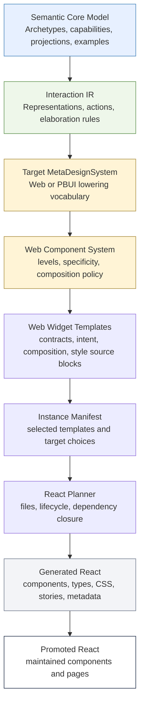

# DMETA Language Cleanup: Multi-IR Architecture and the Web Component System

This report explains the current DMETA architecture and the cleanup work that made the language easier to use for real Web page generation. It is written for a Web developer or designer who has not worked with this repository before but needs to understand how semantic YAML, interaction definitions, Web component templates, React scaffolds, and promoted components fit together.

The concrete work happened in the TTC design-system workspace at `/home/manuel/workspaces/2026-05-27/ttc-design-system`, with compiler changes in the nested `dmeta/` repository and project-specific IR under `2026-05-27--ttc-design-system/dmeta-ir/`. The immediate product pressure was the Tree Center landing-page work: DMETA needed to describe and generate coherent pages, organisms, molecules, and atoms, not only chat-overlay widgets. That pressure exposed redundant language fields and unclear component ownership. The cleanup removed those ambiguities.

> [!summary]
> - DMETA is a design-system compiler organized as multiple IR layers: semantic core model, Interaction IR, target-specific MetaDesignSystems, instance manifests, target planners, generated scaffolds, and promoted runtime code.
> - The cleanup kept semantic meaning out of Web/component/style fields, moved Web component hierarchy into the Web MetaDesignSystem, and replaced legacy widget fields with one canonical `component` block.
> - Web templates now use `component.level`, `component.specificity`, `component.role`, `component.generation_policy`, `intent`, and `composition.uses`; validation enforces hierarchy, edge intent, known dependencies, and composition cycles.
> - React planning now reads canonical component fields only and reports `composition.uses` dependency closure so authors can see which atoms and molecules a selected organism/page requires.

## Why this report exists

DMETA has grown from a YAML-to-React scaffold experiment into a layered design-system compiler. The system now has enough moving parts that a new contributor can easily make a change in the wrong place. A designer might put component structure into the semantic core model. A developer might encode domain meaning inside a React component. A generator might accept two competing fields for the same concept and choose one by fallback order. All of those choices can produce buildable output while making the system harder to reason about.

The cleanup described here addressed that problem by tightening the language. The project now has a clearer answer to three questions:

1. **What does the domain mean?** The semantic core model answers this.
2. **What can the user perceive or do?** Interaction IR answers this.
3. **How does a Web interface realize those obligations?** The Web MetaDesignSystem answers this.

The result is not just cleaner documentation. The Go validators, React planner, CLI output, YAML template shape, and generated metadata now encode the same boundaries.

## The repository layout

There are two repositories involved in the TTC work.

```text
/home/manuel/workspaces/2026-05-27/ttc-design-system/
├── dmeta/                                      # nested Go repo: CLI, validators, lowerers, generators
├── 2026-05-27--ttc-design-system/             # TTC project package
│   ├── dmeta-ir/                              # TTC-local DMETA source package
│   ├── docs/playbooks/                        # durable TTC playbooks
│   ├── ttmp/                                  # docmgr tickets, diaries, design reports
│   └── web/                                   # React/Storybook workspace
└── go.work
```

The nested `dmeta/` repo contains the compiler implementation:

```text
dmeta/pkg/dmeta/validator/              # core model and Web widget models, validation findings
dmeta/pkg/dmeta/interaction/            # Interaction IR loading, validation, elaboration
dmeta/pkg/dmeta/metadesign/web/         # Web MDS loader, validator, lowerer
dmeta/pkg/dmeta/metadesign/pbui/        # PBUI target line
dmeta/pkg/dmeta/generator/react/        # Web React planner, renderer, metadata sidecars
dmeta/pkg/dmeta/cmds/                   # dmeta CLI commands
dmeta/sources/dmeta-ir/                 # generic reusable DMETA source package
```

The TTC project package contains a concrete local DMETA source package and Web app:

```text
2026-05-27--ttc-design-system/dmeta-ir/
├── 00-index.yaml
├── 01-core-model.yaml
├── core-model/
├── interactions/
├── meta-design-systems/web/
└── instantiations/ttc-garden-assistant.yaml

2026-05-27--ttc-design-system/web/packages/ttc-garden-assistant/src/
├── generated/dmeta-widgets/             # generated scaffold output
├── components/                          # promoted hand-owned React components
├── pages/                               # promoted page-level React code
└── dmeta/                               # runtime glue for generated metadata and promotion state
```

The most important operational rule is that `dmeta/` is a nested Git repository. Compiler changes are committed there. TTC project docs, TTC YAML, and TTC React files are committed in the root workspace repository.

## DMETA as a multi-IR compiler

DMETA is easiest to understand as a sequence of intermediate representations. Each layer records a different class of decision. Later layers depend on earlier layers, but earlier layers must not name later-layer implementation details.



This structure matters because a Web app contains several different kinds of knowledge. Plant products, care plans, diagnostic observations, shopping plans, and recommendation sets are domain concepts. Selecting a recommendation, uploading a photo, comparing plants, or adding an item to a plan are interaction concepts. A product card, filter bar, page header, section organism, chip, and button are Web component concepts. CSS modules, Storybook stories, generated file paths, and promoted components are implementation concepts.

DMETA works when those concepts stay in their correct layer.

## Layer 1: Semantic Core Model

The semantic core model describes domain meaning. It should answer: what structured objects exist, what capabilities they have, which projections are required, and which concrete examples prove that the model is usable.

In the generic DMETA source tree, the semantic package lives under:

```text
dmeta/sources/dmeta-ir/01-core-model.yaml
dmeta/sources/dmeta-ir/core-model/
```

In the TTC package, the semantic package lives under:

```text
2026-05-27--ttc-design-system/dmeta-ir/01-core-model.yaml
2026-05-27--ttc-design-system/dmeta-ir/core-model/
```

A semantic archetype names a reusable domain role. A capability names reusable domain affordance or projection structure. A presentation names a semantic projection that can become visible to a user, but it does not choose a concrete Web component.

A useful semantic model says things like:

```text
PlantProduct is purchasable, available, suitable, recommendable.
CarePlan exposes care steps, seasonal schedule, warning signs.
DiagnosticObservation can support photo upload and diagnostic follow-up.
RecommendationSet can be filtered, refined, and selected.
```

It should not say:

```text
PlantProduct renders as a ProductCard molecule.
RecommendationSet uses a green chip row.
CarePlan belongs in src/components/organisms.
```

Those statements belong downstream. The cleanup preserved this boundary by keeping Web component structure and style lowering out of core-model formal fields.

## Layer 2: Interaction IR

Interaction IR sits after semantic meaning and before target-specific UI. It describes what a user can perceive and do without choosing a rendering technology.

The Interaction IR package lives under:

```text
dmeta/sources/dmeta-ir/interactions/
2026-05-27--ttc-design-system/dmeta-ir/interactions/
```

It has three main source files:

| File | Purpose |
| --- | --- |
| `actions.yaml` | Defines modality-neutral actions such as selecting, filtering, uploading, comparing, refining, or adding to a plan. |
| `representations.yaml` | Defines visible semantic forms such as recommendation lists, product grids, upload prompts, care calendars, warning signs, active filters, and plan summaries. |
| `elaboration-rules.yaml` | Derives interaction obligations from semantic facts. |

Interaction IR is not a React component list. `select_recommendation` is a good Interaction IR action because it remains meaningful across Web, PBUI, CLI, or another target. `click_quick_pick_button` would be too Web-specific because it names a DOM-style realization.

The Interaction IR boundary gives DMETA its multi-target structure. The Web target can lower an interaction representation into React components. The PBUI target can lower the same interaction representation into typed presentation objects and action affordances. Neither target needs to own the semantic source model.

## Layer 3: MetaDesignSystems

A MetaDesignSystem is a target-specific realization system. It receives semantic and interaction obligations and decides how a target family should express them.

The current repository has two major target families:

| Target family | Purpose | Primary source directory |
| --- | --- | --- |
| Web MDS | Conventional browser UI, React components, pages, widgets, CSS modules, Storybook. | `dmeta/sources/dmeta-ir/meta-design-systems/web/` and TTC local `dmeta-ir/meta-design-systems/web/` |
| PBUI MDS | Presentation-based UI / CLIM-oriented representation and action systems. | `dmeta/sources/dmeta-ir/meta-design-systems/pbui/` |

This report focuses on the Web MDS cleanup because that was the immediate blocker for TTC page generation.

## Layer 4: Web MetaDesignSystem

The Web MetaDesignSystem owns browser-specific component decisions. It defines lowering rules, widget templates, style inputs, component hierarchy, React target defaults, and generated metadata.

The generic Web MDS now includes:

```text
dmeta/sources/dmeta-ir/meta-design-systems/web/meta-design-system.yaml
dmeta/sources/dmeta-ir/meta-design-systems/web/component-system.yaml
dmeta/sources/dmeta-ir/meta-design-systems/web/lowering-rules.yaml
dmeta/sources/dmeta-ir/meta-design-systems/web/widgets/*.yaml
dmeta/sources/dmeta-ir/meta-design-systems/web/targets/react.yaml
```

The TTC Web MDS specializes the same ideas for Tree Center Garden Assistant:

```text
2026-05-27--ttc-design-system/dmeta-ir/meta-design-systems/web/meta-design-system.yaml
2026-05-27--ttc-design-system/dmeta-ir/meta-design-systems/web/lowering-rules.yaml
2026-05-27--ttc-design-system/dmeta-ir/meta-design-systems/web/widgets/*.yaml
2026-05-27--ttc-design-system/dmeta-ir/meta-design-systems/web/style/*.yaml
2026-05-27--ttc-design-system/dmeta-ir/meta-design-systems/web/targets/react.yaml
```

A Web lowering rule receives interaction obligations and emits Web obligations. A widget template then describes the React-facing component contract, source prose, slots, visual states, TypeScript contract, style source block, Storybook states, and composition dependencies.

The Web MDS should answer questions such as:

- Which Web template satisfies a `quick_pick_list` representation?
- Which action slots should a product grid expose?
- Which component level is a filter bar: molecule, organism, rich widget, or page?
- Which atoms and molecules does an organism use?
- Which generated files should the React target plan?

It should not redefine botanical meaning or decide that a domain type exists. That belongs to Semantic IR.

## The specific problem we cleaned up

Before the cleanup, Web widget templates had overlapping fields. The same concept could appear in `classification`, `component_system`, `template.category`, `intent`, and React target fallback logic.

A simplified version of the old shape looked like this:

```yaml
classification:
  level: molecule
  surface: mobile_chat
  generated_role: scaffold_then_promote

component_system:
  kind: molecule
  specificity: domain
  family: recommendations
  role: product_summary_card
  role_description: Domain molecule that summarizes a purchasable product.
  promotion_order: 40
  owns_layout: true
  owns_behavior: false
  lifecycle:
    default: scaffold_once
    types: regenerate_only
    styles: regenerate_only
```

The fields were not all wrong. The problem was that they overlapped and had unclear ownership.

| Old field | Problem |
| --- | --- |
| `classification.level` and `component_system.kind` | Both described component level. Conflict was possible. |
| `component_system.family` | Usually duplicated file category or role. |
| `component_system.role_description` | Duplicated `intent.purpose`. |
| `promotion_order` | Tried to encode build/promotion ordering manually instead of deriving it from graph structure. |
| `owns_layout` and `owns_behavior` | Too coarse to explain actual component boundaries. |
| `component_system.lifecycle` | Verbose per-template lifecycle policy where a single generation policy plus file-kind defaults is enough. |
| fallback reading from several fields | Made the source language harder to teach and harder to validate. |

The landing-page work made this unacceptable. A page needs a reliable hierarchy: pages compose organisms and rich widgets; organisms compose molecules and atoms; molecules compose atoms. If DMETA cannot validate that graph, every page becomes a hand-authored exception.

## The cleanup decision

The cleanup made a hard cut. We did not preserve backward compatibility for widget-level legacy fields. The correct fix for old templates was to migrate the templates, not keep loader fallback indefinitely.

The new Web widget shape is:

```yaml
component:
  level: organism
  specificity: domain
  role: category_discovery_widget
  generation_policy: scaffold_then_promote

intent:
  purpose: Render a browsable category discovery section from normalized category collection data.
  adapter_boundary: Receives normalized category view models and emits browse-category action requests; does not fetch catalog data or own navigation side effects.

composition:
  uses:
    - template: dmeta.section_header
      role: section_heading
      required: true
      description: Render the section title and optional subtitle using the shared Web section-header molecule.
```

The removed fields are:

```text
classification
classification.level
classification.kind
classification.specificity
classification.role
classification.generated_role

component_system
component_system.kind
component_system.level
component_system.specificity
component_system.family
component_system.role
component_system.role_description
component_system.promotion_order
component_system.owns_layout
component_system.owns_behavior
component_system.lifecycle

component.promotion_order
```

The important point is that `component_system` still exists as a **package-level policy file key** in `meta-design-system.yaml`:

```yaml
files:
  component_system: ./component-system.yaml
```

That is not the removed legacy field. The removed field was the old per-widget `component_system` block. The package-level `component-system.yaml` is the reusable Web component policy.

## The canonical component block

The canonical `component` block is intentionally small.

| Field | Meaning |
| --- | --- |
| `component.level` | Component hierarchy level: `atom`, `molecule`, `organism`, `rich_widget`, `page`, or transitional `component`. |
| `component.specificity` | Scope of the template: `generic`, `brand`, `domain`, or `app`. |
| `component.role` | Stable machine-readable role inside the component system. |
| `component.generation_policy` | Template-level generation policy such as `scaffold_once` or `scaffold_then_promote`. |

The Go model now reflects that shape directly in `dmeta/pkg/dmeta/validator/model.go`:

```go
type Widget struct {
    ID              string                `yaml:"id"`
    Name            string                `yaml:"name"`
    Status          string                `yaml:"status"`
    Description     string                `yaml:"description"`
    Component       WidgetComponent       `yaml:"component"`
    Composition     WidgetComposition     `yaml:"composition"`
    Intent          WidgetIntent          `yaml:"intent"`
    Template        TemplateMetadata      `yaml:"template"`
    Consumes        Consumes              `yaml:"consumes"`
    SemanticContext WidgetSemanticContext `yaml:"semantic_context"`
    ProjectionHints WidgetProjectionHints `yaml:"projection_hints"`
    Contract        WidgetContract        `yaml:"contract"`
    Style           SourceBlock           `yaml:"style"`
    Stories         []string              `yaml:"stories"`
    Storybook       WidgetStorybook       `yaml:"storybook"`
    Outputs         map[string]string     `yaml:"outputs"`
    ContractActions []string              `yaml:"contract_action_slots"`
}

type WidgetComponent struct {
    Level            string   `yaml:"level"`
    Specificity      string   `yaml:"specificity"`
    Role             string   `yaml:"role"`
    GenerationPolicy string   `yaml:"generation_policy"`
    Responsibilities []string `yaml:"responsibilities"`
    Notes            []string `yaml:"notes"`
}
```

The responsibilities and notes fields remain available as optional prose, but the formal routing surface is the four-field component contract.

## Why `promotion_order` was removed

`promotion_order` looked useful because authors often want atoms before molecules and molecules before organisms. The problem is that explicit per-template order is a weak substitute for graph structure.

Promotion and planning order should be derived from facts the compiler already knows:

```text
component level order
  atom -> molecule -> organism -> rich_widget -> page

composition dependency graph
  dependencies before dependents

instance selection
  selected/emitted templates before optional templates
```

If a future workflow needs manual prioritization, that should be a task-plan or promotion-plan artifact, not a formal field on every widget template. The Web MDS source should say what the component is and what it composes. The planner can compute ordering from that information.

## The component-system policy file

The new reusable Web policy file is:

```text
dmeta/sources/dmeta-ir/meta-design-systems/web/component-system.yaml
```

It defines component levels, lowering policy, composition policy, and specificity values. The current hierarchy is:

| Level | Purpose | Emitted directly by lowering? | Typical children |
| --- | --- | --- | --- |
| `atom` | Small reusable primitive with local rendering or local control state. | No | none |
| `molecule` | Small composed component that renders one local presentation shape or control group. | No | atoms |
| `organism` | Web widget or page section that satisfies one or more interaction obligations. | Yes | molecules, atoms |
| `rich_widget` | Larger interactive widget with multiple regions or coordinated state. | Yes | organisms, molecules, atoms |
| `page` | Route or screen-level composition. | Yes | rich widgets, organisms, molecules, atoms |
| `component` | Transitional generic component level. | Yes | rich widgets, organisms, molecules, atoms, components |

The policy file also states that atoms and molecules are normally dependency-only levels. Lowering rules should usually emit organisms, rich widgets, or pages. Atoms and molecules should enter through `composition.uses` dependency closure.

This matters for page generation. A landing-page lowering rule should not emit every button, card, label, and section header as independent obligations. It should emit the page or organism obligations that satisfy interaction requirements. Those components should then declare their internal dependencies.

## `composition.uses` after the cleanup

`composition.uses` is now the formal component dependency graph. It is not a comment and not a loose design hint.

A composition edge looks like this:

```yaml
composition:
  uses:
    - template: ttc.button
      role: optional product action control for future variants
      required: false
      description: Use ttc.button as the optional product action control dependency for this component.
```

The edge records four facts:

| Field | Meaning |
| --- | --- |
| `template` | The child Web widget template id. |
| `role` | The child's role in this parent component. |
| `required` | Whether this dependency is required for the component contract. |
| `description` | Human-readable explanation of why the dependency exists. |

The system now uses `composition.uses` in four places.

1. `dmeta/pkg/dmeta/metadesign/web/validate.go` validates known dependency templates, required edge role/description, allowed parent/child levels, and cycles.
2. `dmeta/pkg/dmeta/generator/react/plan.go` computes dependency closure for selected templates.
3. `dmeta/pkg/dmeta/cmds/plan_scaffold.go` emits `row_kind=dependency` rows so CLI users can inspect dependency requirements.
4. `dmeta/pkg/dmeta/generator/react/render.go` writes dependency closure into generated metadata sidecars as `web.composition.dependencyClosure`.

Dependency closure is currently report-only. It does not automatically add missing dependencies to `plan.Components`. That is intentional for now because some dependencies may already be promoted hand-owned components, some may be selected explicitly, and some may be external to a package. The next refinement would be promotion-state-aware dependency classification.

## Validation after the cleanup

The Web validator now rejects unclear widget definitions. The strict checks live in `dmeta/pkg/dmeta/metadesign/web/validate.go`.

For every Web widget template, validation requires:

```text
component.level
component.role
component.specificity
component.generation_policy
intent.purpose
intent.adapter_boundary
```

It also validates `composition.uses`:

```text
composition edge must name a known template
composition edge must have a role
composition edge must have a description
parent component level must allow child component level
component graph must not contain cycles
```

The relevant validation functions are:

```go
validateCanonicalComponentFields(...)
validateCompositionEdges(...)
validateCompositionCycles(...)
componentLevelAllowsChild(...)
```

This means the compiler now protects the authoring rules. A template cannot silently fall back from `component.level` to `classification.level`. A molecule cannot compose an organism unless the policy allows that level relationship. A composition cycle becomes an error rather than an informal review concern.

## React planning after the cleanup

React planning reads canonical fields only. The planner no longer checks legacy `classification` or widget-level `component_system` fields.

The key functions in `dmeta/pkg/dmeta/generator/react/plan.go` now have the intended shape:

```go
func componentKindFromWidget(widget validator.Widget) string {
    return normalizeComponentKind(widget.Component.Level)
}

func componentSpecificityFromWidget(widget validator.Widget) string {
    return firstNonEmpty(widget.Component.Specificity, "app")
}

func componentRoleFromWidget(widget validator.Widget) string {
    return firstNonEmpty(widget.Component.Role, widget.Intent.Purpose)
}

func componentLifecycleFromWidget(widget validator.Widget) string {
    return firstNonEmpty(widget.Component.GenerationPolicy, "scaffold")
}
```

The React target uses the component level to choose output directories:

```yaml
component_layout:
  strategy: component_hierarchy
  dirs:
    atom: atoms
    molecule: molecules
    organism: organisms
    rich_widget: rich-widgets
    page: pages
    component: components
```

A TTC atom such as `ttc.button` plans under `atoms/Button/`. A molecule such as `ttc.product_card_molecule` plans under `molecules/ProductCard/`. An organism such as `ttc.quick_picks_widget` plans under `organisms/QuickPicksWidget/`.

## Dependency closure reporting

The latest planner work added dependency-closure reporting. When an instance selects a template, the planner walks that template's `composition.uses` graph and records direct and transitive dependencies.

The core algorithm is in `dependencyClosureForTemplate`:

```go
func dependencyClosureForTemplate(sourceTemplateID string, widgets map[string]validator.Widget, selectedTemplates map[string]bool) []ComponentDependencyPlan {
    source, ok := widgets[sourceTemplateID]
    if !ok {
        return nil
    }
    var out []ComponentDependencyPlan
    seen := map[string]bool{}
    var walk func(parentID string, depth int, path []string)

    walk = func(parentID string, depth int, path []string) {
        parent := widgets[parentID]
        deps := sorted(parent.Composition.Uses)
        for _, dep := range deps {
            depID := dependencyTemplateID(dep)
            child := widgets[depID]
            depPath := append(path, depID)
            if !seen[depID] {
                out = append(out, ComponentDependencyPlan{
                    SourceTemplateID: sourceTemplateID,
                    ParentTemplateID: parentID,
                    TemplateID:       depID,
                    ComponentName:    child.Name,
                    ComponentKind:    componentKindFromWidget(child),
                    ComponentRole:    componentRoleFromWidget(child),
                    EdgeRole:         dep.Role,
                    EdgeDescription:  dep.Description,
                    Required:         dep.Required,
                    Direct:           depth == 0,
                    Depth:            depth + 1,
                    Planned:          selectedTemplates[depID],
                    Path:             depPath,
                })
                seen[depID] = true
            }
            walk(depID, depth+1, depPath)
        }
    }

    walk(sourceTemplateID, 0, []string{sourceTemplateID})
    return out
}
```

The `plan-scaffold` command now emits dependency rows. For example, `ttc.product_card_molecule` reports dependencies on `ttc.button` and `ttc.chip`, including whether those dependencies are already selected in the instance manifest.

The output row includes:

```text
row_kind=dependency
dependency_template
dependency_component
dependency_kind
dependency_role
dependency_edge_role
dependency_description
dependency_required
dependency_direct
dependency_depth
dependency_planned
dependency_path
```

This is important for designers and Web developers because it makes component decomposition inspectable before any React file is generated.

## Generated metadata sidecars

Generated React components carry JSON metadata sidecars. The metadata records where the component came from, which semantic and interaction obligations it realizes, which files belong to it, and how it composes other templates.

After the cleanup, metadata includes dependency closure:

```json
{
  "web": {
    "templateId": "ttc.product_card_molecule",
    "componentSystem": {
      "kind": "molecule",
      "specificity": "domain",
      "role": "product_summary_card",
      "lifecycle": "scaffold_once"
    },
    "composition": {
      "uses": ["ttc.button", "ttc.chip"],
      "dependencyClosure": [
        {
          "templateId": "ttc.button",
          "componentName": "Button",
          "kind": "atom",
          "role": "button_control",
          "direct": true,
          "depth": 1,
          "planned": true
        }
      ]
    }
  }
}
```

The metadata field name `componentSystem` is still used in generated JSON as an output grouping name. That is separate from the removed YAML-level `component_system` block. The source language was simplified; generated metadata can still group component hierarchy facts under a readable JSON object.

## What changed in the actual commits

The cleanup happened in focused commits across the nested `dmeta` repo and the root TTC workspace.

Nested `dmeta` commits:

| Commit | Summary |
| --- | --- |
| `57d5751` | Added Web component-system policy loading and validation. |
| `c6c8e99` | Added canonical component fields as an intermediate step. |
| `2fa497f` | Removed legacy Web component fields and migrated generic Web templates. |
| `ff912c8` | Added React dependency-closure reporting. |

Root TTC workspace commits:

| Commit | Summary |
| --- | --- |
| `99cb370` | Added the durable DMETA system playbook. |
| `212aa60` | Planned the Web component IR cleanup ticket. |
| `3d445b2` | Recorded Web component-system policy progress. |
| `04fea46` | Recorded hard Web component IR cleanup and TTC template migration. |
| `3ae958d` | Recorded React dependency-closure reporting. |

The most important implementation files are:

| File | Role in the cleanup |
| --- | --- |
| `dmeta/sources/dmeta-ir/meta-design-systems/web/component-system.yaml` | Defines component levels, specificity, composition rules, and lowering policy. |
| `dmeta/pkg/dmeta/validator/model.go` | Defines canonical Web widget/template model. |
| `dmeta/pkg/dmeta/metadesign/web/load.go` | Loads the package-level component-system policy file. |
| `dmeta/pkg/dmeta/metadesign/web/validate.go` | Enforces canonical fields, hierarchy, composition intent, and cycle checks. |
| `dmeta/pkg/dmeta/generator/react/plan.go` | Plans React output from canonical component fields and reports dependency closure. |
| `dmeta/pkg/dmeta/cmds/plan_scaffold.go` | Emits dependency rows in CLI scaffold plans. |
| `dmeta/pkg/dmeta/generator/react/render.go` | Writes dependency closure into generated metadata. |
| `2026-05-27--ttc-design-system/dmeta-ir/meta-design-systems/web/widgets/*.yaml` | TTC templates migrated to canonical component blocks. |
| `2026-05-27--ttc-design-system/docs/playbooks/dmeta-system-playbook.md` | Human playbook for working in the TTC DMETA system. |

The ticket workspace that records this cleanup is:

```text
2026-05-27--ttc-design-system/ttmp/2026/05/30/TTC-DMETA-WEB-COMPONENT-IR--simplify-and-codify-web-mds-component-system-ir/
```

Important docs in that ticket include:

```text
design-doc/01-simplifying-and-codifying-the-web-component-system-ir.md
reference/01-diary.md
reference/02-hard-web-component-ir-simplification-plan.md
scripts/01-migrate-web-component-ir.py
```

## Practical workflow for Web developers

A Web developer normally starts by identifying which layer owns the change.

| Desired change | Correct layer | Example files |
| --- | --- | --- |
| Add a new domain object or projection. | Semantic Core Model | `dmeta-ir/core-model/*.yaml` |
| Add a new user operation. | Interaction IR | `dmeta-ir/interactions/actions.yaml` |
| Add a new visible interaction representation. | Interaction IR | `dmeta-ir/interactions/representations.yaml` |
| Map interaction obligations to a Web widget. | Web MDS lowering | `meta-design-systems/web/lowering-rules.yaml` |
| Define a component template, props, slots, stories, or style source. | Web MDS widget templates | `meta-design-systems/web/widgets/*.yaml` |
| Change component hierarchy or composition rules. | Web component-system policy | `component-system.yaml` |
| Select which templates generate for an app. | Instance manifest | `instantiations/ttc-garden-assistant.yaml` |
| Polish generated UI. | Promoted React | `src/components/`, `src/pages/` |
| Review generated contracts and provenance. | Generated React metadata | `src/generated/dmeta-widgets/**/*.metadata.json` |

The normal validation sequence for TTC is:

```bash
cd /home/manuel/workspaces/2026-05-27/ttc-design-system/dmeta

go test ./...

go run ./cmd/dmeta validate-ir \
  --root ../2026-05-27--ttc-design-system/dmeta-ir \
  --output table

go run ./cmd/dmeta validate-interactions \
  --root ../2026-05-27--ttc-design-system/dmeta-ir \
  --output table

go run ./cmd/dmeta lower-web \
  --root ../2026-05-27--ttc-design-system/dmeta-ir \
  --interactions-root ../2026-05-27--ttc-design-system/dmeta-ir \
  --web-root ../2026-05-27--ttc-design-system/dmeta-ir/meta-design-systems/web \
  --output table

go run ./cmd/dmeta plan-scaffold \
  --instance ../2026-05-27--ttc-design-system/dmeta-ir/instantiations/ttc-garden-assistant.yaml \
  --target react \
  --output table
```

The important review habit is to look at intermediate output. Do not jump directly from YAML edits to generated React. First check that semantic validation passes. Then check that interaction obligations are valid. Then check Web lowering. Then inspect the scaffold plan, including dependency rows.

## Practical workflow for designers

A designer does not need to think in Go structs, but the layer boundaries still matter.

If the design change is about meaning, it belongs upstream. For example, Tree Center may need to distinguish a seasonal care task from a general care instruction. That is semantic. It should be modeled before component templates are chosen.

If the design change is about what the user can perceive or do, it belongs in Interaction IR. For example, a user may need to compare two plants, browse categories, refine recommendations, or upload a diagnostic photo. Those are interaction obligations.

If the design change is about Web composition, it belongs in Web MDS. For example, a landing page may need a hero organism, category image-card molecule, product-card molecule, section-header molecule, and page shell. Those are Web component decisions.

If the design change is about visual polish, it belongs in Web style inputs or promoted React/CSS. For example, changing the exact radius, card shadow, hover behavior, or Storybook-specific state belongs later than semantic modeling.

A useful designer-facing checklist is:

- What domain concept is this section about?
- What should the user be able to perceive?
- What action can the user take?
- Which Web component level realizes the obligation?
- Which smaller components does it compose?
- Which generated metadata proves the trace from domain meaning to rendered component?

## Why this matters for the Tree Center landing page

The landing-page work was the proving ground for this cleanup. A landing page is not one widget. It is a page-level composition of sections, cards, category navigation, product discovery, editorial content, trust messaging, and assistant entry points.

Before the cleanup, it would have been tempting to write section-first React code and then retrofit DMETA metadata. That would make the page look correct while bypassing the design-system compiler. The cleanup enables a better sequence:

```text
landing-page semantic concepts
  -> interaction representations/actions
  -> Web page/organism templates
  -> component graph through composition.uses
  -> React scaffold plan with dependency rows
  -> generated metadata
  -> promoted React implementation
```

The Web component hierarchy gives each landing-page part a place:

| Landing-page concern | Likely Web level |
| --- | --- |
| Pill label, icon, action button | `atom` |
| Section header, image category card, product card | `molecule` |
| Hero section, category discovery section, product collection section | `organism` |
| Assistant planner or comparison tool | `rich_widget` |
| Full landing page route | `page` |

This is why the cleanup happened before continuing landing-page semantic modeling. Page generation needs a validated component graph, not just a list of visual sections.

## What was intentionally not solved

The cleanup did not try to solve every part of Web generation.

Dependency closure is report-only. It tells the author which dependencies exist and whether they are selected in the instance manifest. It does not yet classify dependencies as promoted, external, missing, or generated by another package.

Style lowering is documented but not fully implemented as a deterministic compiler pass. The current preferred direction is still CSS/source-block or style-recipe generation into baseline CSS modules, followed by promoted CSS ownership where needed.

Generated React remains scaffolding. It is not expected to be perfect final UI. The system is designed to preserve provenance, contracts, and reviewable structure so humans and LLMs can promote components intentionally.

The generic `component` level still exists as a transitional level in the component-system policy. The target shape is more precise classification over time, but the compatibility level is useful for generic components that have not yet been classified more specifically.

## Current status

The Web component IR cleanup is complete enough to resume landing-page implementation.

Current facts:

- Generic Web MDS templates have canonical `component` blocks.
- TTC Web MDS templates have canonical `component` blocks.
- Legacy widget-level `classification` and `component_system` fields are removed from the Go model.
- Web validation enforces canonical fields and composition rules.
- React planning reads canonical fields only.
- `plan-scaffold` reports dependency closure.
- Generated metadata includes composition dependency closure.
- The `TTC-DMETA-WEB-COMPONENT-IR` ticket passes `docmgr doctor`.
- Validation passed after the cleanup with `go test ./...`, generic `validate-ir`, TTC `validate-ir`, TTC `validate-interactions`, and TTC `lower-web`.

The next major product step is to return to `TTC-DMETA-LANDING-PAGE` and model the landing page semantically before writing React sections.

## Recommended next steps

The next implementation sequence should be:

1. Resume landing-page semantic modeling in the TTC core-model files.
2. Add or refine Interaction IR representations/actions for landing-page browsing, category discovery, product collections, and assistant entry points.
3. Add Web MDS page/organism templates with canonical component blocks.
4. Use `composition.uses` to declare atoms and molecules required by those templates.
5. Run Web validation to catch hierarchy and dependency problems.
6. Run `plan-scaffold` and inspect dependency rows before generating files.
7. Generate scaffolds under `src/generated/` only after the IR path is coherent.
8. Promote React components into `src/components/` or `src/pages/` when visual fidelity and runtime behavior require hand ownership.

A later cleanup can classify dependency closure against promotion state:

```text
selected     dependency is explicitly selected in the instance manifest
promoted     dependency is satisfied by hand-owned component registry state
generated    dependency is generated in this scaffold plan
external     dependency is provided by a library or host app
missing      dependency is required but not available
```

That classification would let the planner move from report-only dependency closure toward actionable generation and promotion planning.

## Working rules

The cleanup can be summarized as working rules for future DMETA work.

- Keep semantic meaning in Semantic IR. Do not put React component names, CSS recipes, or Web hierarchy into core-model formal fields.
- Keep user-visible action and representation obligations in Interaction IR. Do not name DOM events or React callbacks there.
- Keep Web component structure in the Web MetaDesignSystem. Use `component.level`, `component.role`, `component.specificity`, and `component.generation_policy`.
- Use `intent.purpose` and `intent.adapter_boundary` to explain why a component exists and what it owns.
- Use `composition.uses` as the formal component dependency graph. Every edge needs a role and description.
- Let validation reject unclear structures. Do not restore fallback compatibility for legacy widget fields.
- Treat generated React as traceable scaffold output. Treat promoted React as maintained implementation.
- Commit nested `dmeta/` compiler changes separately from TTC root repository changes.

## Related notes

- [[ARTICLE - DMETA as a Design System Compiler - Layered IRs and MetaDesignSystems]]
- [[ARTICLE - DMETA Compiler Refactor - Hard Cut to Interaction IR Web MetaDesignSystem and React Target]]
- [[ARTICLE - TTC DMETA React Workflow - Semantic IR to Storybook Garden Assistant]]
- [[ARTICLE - DMETA Design System Factory - From Semantic Schemas to Generated React Widgets]]
