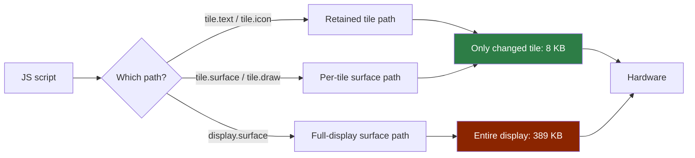
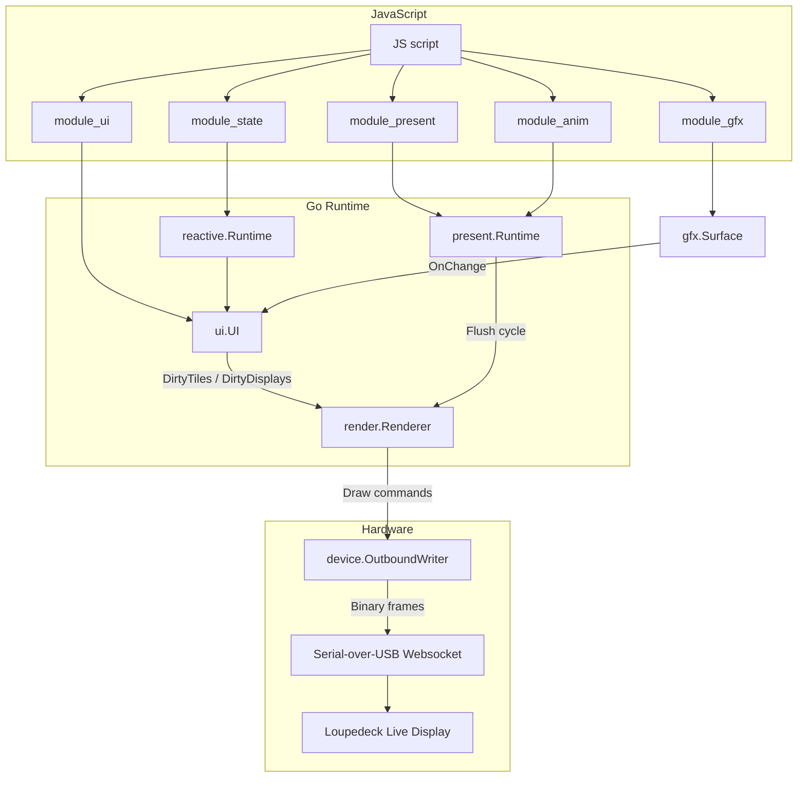

# Loupedeck Tile Rendering — How Pixels Get From JavaScript to Hardware, and Why Multi-Line Text Was Broken

The Loupedeck Live is a USB hardware controller with a 360×270 pixel grayscale OLED display. The display is divided into a 4×3 grid of 90×90-pixel tiles, plus two 60×270 side displays. Scripts written in JavaScript (running inside a Go-embedded goja VM) can update individual tiles or the full display, and a Go rendering pipeline ships the resulting pixels to the hardware over a serial-over-USB websocket protocol.

This article explains how the rendering pipeline works end-to-end, what the two rendering paths are and when to use each one, and how three specific bugs — newline rendering, word wrapping, and whole-display invalidation — were discovered, diagnosed, and fixed.

> [!summary]
> 1. The Loupedeck has two rendering paths: a *retained* path (declare *what* to show, Go renders it) and a *surface* path (draw pixels yourself). Per-tile invalidation already existed for the retained path but was invisible for the surface path.
> 2. Multi-line text was broken because Go's `font.Drawer.DrawString()` treats the entire string as a single line — `\n` renders as a missing glyph. The fix splits on `\n` before rendering, with vertical centering for the text block.
> 3. Per-tile surfaces already worked at the Go level; the missing piece was JavaScript ergonomics (`tile.draw(fn)`, `tile.invalidate()`) and documentation.

## Why this note exists

This article was triggered by LOUPE-016, a ticket that addressed three rendering limitations in the loupedeck JavaScript DSL. The investigation uncovered that one of the "missing features" (per-tile invalidation for custom surfaces) was actually already implemented in Go but completely undocumented and inaccessible from JavaScript. That discovery reshaped the implementation plan from "build new infrastructure" to "expose what exists and add ergonomics."

The patterns here generalize beyond this specific device:

- Any system with a retained/imperative rendering split has the same dirty-tracking tension.
- Any embedded-graphics stack that uses `golang.org/x/image/font` will hit the same newline bug.
- The "feature already exists but nobody knows" pattern is common in codebases with a thick JS bridge over a Go runtime.

## When to use these patterns

- You are building a UI runtime where JavaScript declares intent and Go handles rendering.
- You need per-region dirty tracking instead of full-screen redraws on every change.
- You need multi-line or word-wrapped text in a `golang.org/x/image/font` pipeline.
- You are diagnosing why `font.Drawer.DrawString()` silently corrupts strings with newlines.

## Core mental model: the two rendering paths

The Loupedeck rendering pipeline has two fundamentally different paths. Understanding which one your script uses is the single most important thing for performance.

### The retained tile path

You declare *what* to show — `tile.text("READY")`, `tile.icon("circle")` — and the Go runtime decides *how* and *when* to render it. When a tile property changes, only that tile is re-rendered and sent to the hardware (90×90 pixels ≈ 8 KB per tile in RGB565). This is the fastest path for per-tile updates.

```
JS: tile.setText("NEW")  →  Go: tile.markDirty()  →  UI dirty handler
  → present.invalidate("ui-dirty")  →  renderer.Flush()
  → DirtyTiles() returns only this tile
  → renderTile() produces 90×90 image
  → Draw() sends 8 KB to hardware
```

The retained path uses Go's `golang.org/x/image/font` to render text, with a fixed layout: an 8-pixel accent bar across the top, the icon centered at row 24, and the text label centered at row 58. The text is rendered with `basicfont.Face7x13`, a 7×13 pixel monospace font where each character occupies 7 horizontal pixels and the line height is 13 pixels.

### The surface path

You create a `gfx.surface(width, height)`, draw pixels into it from JavaScript, and assign it to a display or tile. When the surface changes, the display or tile it belongs to is re-rendered.

There are two surface assignment levels:

- **Per-tile surface**: `tile.surface(tileSurface)` — only that tile is re-rendered when its surface changes. This is the key insight: per-tile invalidation *already works* for surfaces.
- **Display-level surface**: `display.surface(mainSurface)` — the entire display is re-rendered when any pixel changes. This is the slow path.



**Performance rule of thumb:** If each tile's content is independent, use per-tile surfaces. If content spans tile boundaries, use a display-level surface. Per-tile surfaces send 12× less data per update on the main display.

## Architecture: the full rendering pipeline

The pipeline has five layers, from JavaScript down to USB serial:



Each layer has a specific responsibility:

1. **JavaScript + modules**: Scripts use `require("loupedeck/ui")`, `require("loupedeck/gfx")`, etc. to declare pages, tiles, and surfaces. The goja VM serializes all callbacks through its owner thread — there are no race conditions at the JS level.

2. **Reactive runtime**: Signals (`state.signal(initial)`) and computed values automatically track dependencies. When a signal changes inside a reactive binding like `tile.text(() => count.get())`, the binding re-runs and the tile is marked dirty.

3. **UI layer**: The `ui.UI` struct tracks pages, tiles, and displays. It maintains dirty-tile and dirty-display lists that the renderer queries on each flush cycle.

4. **Present runtime**: A simple invalidate-on-demand loop. It calls a `render(reason)` function (set by the UI dirty handler) and then `flush()` (set by the host to call `renderer.Flush()`).

5. **Renderer + writer**: `render.Renderer.Flush()` queries `DirtyTiles()` and `DirtyDisplays()`, renders each dirty region into an `image.RGBA`, converts to RGB565, and sends the binary frame through the outbound writer to the hardware.

## How text rendering works (and why it was broken)

Text in the Loupedeck is rendered using Go's `golang.org/x/image/font` package. The key function is `font.Drawer.DrawString(text)`, which draws an entire string as a single line of glyphs onto a destination image.

### The newline bug

`font.Drawer.DrawString()` does not understand newline characters. It treats the entire string as one line — the `\n` byte either produces a missing-glyph rectangle or is silently skipped, depending on the font. Either way, the result is visual corruption, not a second line of text.

This affects both rendering paths:

- **Retained tiles**: `drawCenteredLabel()` calls `d.DrawString(text)` with the full tile text. A tile showing `"LINE1\nLINE2"` renders both words on top of each other at the same baseline, with a corrupted glyph where the `\n` sits.
- **Surface text**: `Surface.Text()` in `runtime/gfx/text.go` does the same thing — a single `d.DrawString(text)` call that cannot split lines.

### The fix: split before rendering

The fix is straightforward: split the text on `\n` before calling `DrawString()`, then render each line at a vertically offset position.

For the surface API, the core change was in `Surface.Text()`:

```
func (s *Surface) Text(text string, opts TextOptions) {
    lines := expandTextLines(text, opts)  // split on \n, optionally wrap
    if len(lines) == 1 {
        s.renderLine(lines[0], opts)     // single line: same as before
        return
    }
    // Multi-line: compute per-line height, offset each line
    lineH := face.Metrics().Height.Ceil()
    for i, line := range lines {
        lineOpts := opts
        lineOpts.Y = opts.Y + i * (lineH + gap)
        lineOpts.Height = lineH + 4
        s.renderLine(line, lineOpts)
    }
}
```

The key detail: when rendering multi-line text, each line's alpha mask height must be set to `lineH + 4` (the per-line height plus a small margin), not the original `opts.Height` which was sized for the entire text block. If you leave `Height` at the block-level value, each line's baseline gets calculated relative to the oversized mask, pushing the text far below where you expect it.

For the retained tile renderer (`renderTile()` in `visual_runtime.go`), the fix also required **vertical centering**. The original code used a hardcoded `baseline = 58` — designed for single-line text positioned in the lower portion of the tile. With multi-line text, starting at row 58 meant that a two-line label occupied rows 58–83, leaving the entire top half of the tile empty.

The corrected approach computes the number of rendered lines, determines the available vertical area (below the 8-pixel accent bar, with an icon-aware top margin), and centers the text block:

```
// Available area: below accent bar to bottom of tile
areaTop  := 12   // just below accent bar (or 40 if icon present)
areaBot  := 86   // TileHeight - 4 bottom margin
blockH   := numLines * lineH
blockTop := areaTop + (areaBot - areaTop - blockH) / 2
baseline := blockTop + face.Metrics().Ascent.Ceil()
```

With `basicfont.Face7x13` (ascent=11, descent=2, line height=13), a two-line text block is 26 pixels tall and centers roughly at row 36 — well within the visible area of the tile.

## How word wrapping was added

Text that exceeds the tile width (90 pixels; ~12 characters at `Face7x13`) clips at the edge. There was no line-breaking logic anywhere in the stack.

The wrapping algorithm is greedy: fill each line with as many words as fit, then wrap to the next line. It uses `font.Drawer.MeasureString()` to check pixel widths:

```
func wrapText(text string, face font.Face, wrapWidth int) []string {
    d := &font.Drawer{Face: face}
    var lines []string
    var current strings.Builder
    words := strings.Fields(text)
    for i, word := range words {
        if i == 0 {
            current.WriteString(word)
            continue
        }
        candidate := current.String() + " " + word
        if d.MeasureString(candidate).Round() <= wrapWidth {
            current.WriteString(" ")
            current.WriteString(word)
        } else {
            lines = append(lines, current.String())
            current.Reset()
            current.WriteString(word)
        }
    }
    // flush remaining
    if current.Len() > 0 {
        lines = append(lines, current.String())
    }
    return lines
}
```

When a single word is wider than `wrapWidth`, it stays on its own line — there is no character-level wrapping. The `strings.Fields()` call collapses multiple whitespace characters, which is acceptable for tile labels.

The wrapping is integrated into `Surface.Text()` through `expandTextLines()`, which applies wrapping first, then splits on explicit newlines. This order matters: a paragraph containing long text gets wrapped first, then any explicit `\n` between paragraphs is preserved.

For retained tiles, the JS bridge exposes `tile.text("long label", { wrap: true })`, which sets `tile.Wrap = true`. The renderer then calls `wrapRendererText()` with a wrap width of `TileWidth - 8` (82 pixels, allowing 4 pixels of padding on each side).

## How per-tile invalidation was already working

The most surprising finding in LOUPE-016 was that per-tile invalidation for custom surfaces was **already fully implemented** at the Go level, but completely invisible from JavaScript.

### The Go infrastructure that already existed

In `runtime/ui/tile.go`, the `SetSurface()` method:

```go
func (t *Tile) SetSurface(surface *gfx.Surface) {
    t.surface = surface
    if surface != nil {
        t.surfaceSub = surface.OnChange(func() {
            t.markDirty()  // ← this is the key line
        })
    }
    t.markDirty()
}
```

When a surface is assigned to a tile, the tile subscribes to the surface's `OnChange` event. Any mutation to the surface — `FillRect`, `Text`, `Line`, etc. — fires the change listener, which calls `t.markDirty()`. The tile then appears in the `DirtyTiles()` list on the next flush cycle, and only that 90×90 region is re-rendered.

In `runtime/js/module_ui/module.go`, the `tile.surface()` JS bridge already existed at line 322, calling `tile.SetSurface(module_gfx.SurfaceFromValue(arg, runtime))`.

And in `runtime/render/visual_runtime.go`, `renderTile()` already checks for a tile surface:

```go
if surface := tile.Surface(); surface != nil {
    return surface.ToRGBA(r.Theme.Foreground, r.Theme.Background)
}
```

So the entire pipeline was wired: JS → Go surface → OnChange → markDirty → Flush → DirtyTiles → renderTile → hardware. The problem was that nobody documented this, nobody wrote examples using it, and there were no convenience methods.

### What was added: ergonomics, not infrastructure

The implementation added three things on top of the existing infrastructure:

1. **`tile.draw(fn)`** — a convenience method that auto-creates a 90×90 surface if one doesn't exist, passes it to `fn` for drawing, and marks the tile dirty. This replaces the verbose three-step pattern of `gfx.surface(90, 90)` + `tile.surface(s)` + `s.text(...)`.

2. **`tile.invalidate()`** — explicit dirty marking. In most cases you don't need this because surface mutations auto-mark the tile. But it's useful when you hold a surface reference and modify it outside a reactive binding.

3. **`module_gfx.SurfaceObject()`** — the `surfaceObject()` function in `module_gfx` was unexported, so `module_ui` couldn't create a JS surface object when implementing `tile.draw(fn)`. Exporting it (capital `S`) was a one-character change that enabled cross-package reuse.

## Common failure modes

### Multi-line text appears in the wrong position

**Symptom:** Text with `\n` renders, but it's pushed to the bottom or top of the tile, with large empty areas.

**Cause:** The alpha mask height for each line was set to the block-level height instead of the per-line height. When `Height = 40` and the line only needs 17 pixels, the baseline calculation `h/2 = 20` centers the text within the oversized mask, producing a large vertical offset.

**Fix:** In multi-line rendering, override `lineOpts.Height = lineH + 4` for each sub-line. The baseline is then calculated relative to the per-line mask, producing consistent positioning.

### Multi-line text in retained tiles is not vertically centered

**Symptom:** Two-line text in a retained tile (`tile.text("A\nB")`) appears at the bottom of the tile with the accent bar at the top and empty space in between.

**Cause:** The renderer used a hardcoded `baseline = 58` designed for single-line text. Multi-line text starting at row 58 goes downward, leaving the upper portion of the tile empty.

**Fix:** Compute the number of lines, determine the available vertical area (rows 12–86 without icon, rows 40–86 with icon), and center the text block: `blockTop = areaTop + (areaBot - areaTop - blockHeight) / 2`.

### tile.draw() clock example shows a black screen

**Symptom:** A script using `tile.draw(fn)` runs without errors but the Loupedeck display stays black.

**Cause:** The script never called `ui.show("page-name")`. No page is activated, so the renderer has no tiles to flush.

**Fix:** Always include `ui.show("page-name")` after building the page. The runner does not auto-show any page.

### Logging uses slog instead of logcopter

**Symptom:** Device connection logs appear in a different format (`2026/05/30 21:13:39 INFO Enumerating ports`) without `area=` tags or zerolog structured fields, making them invisible to log-area filtering.

**Cause:** The `pkg/device` package had a generated `var log = logcopter.Package("go-go-golems.loupedeck.pkg.device")` but all logging calls used `slog.Info(...)` instead of `log.Info()...Msg(...)`.

**Fix:** Replace all `slog` calls with logcopter zerolog-style API. The slog key-value style (`slog.Info("msg", "key", val)`) becomes the zerolog method-chaining style (`log.Info().Str("key", val).Msg("msg")`). This ensures consistent log format with proper `area=` tags across the entire codebase.

## Recommended implementation sequence

If you are building a similar system from scratch or adding these features to another embedded-graphics codebase:

1. **Implement per-line text rendering first.** Split on `\n` before calling `DrawString()`. This is the simplest change with the widest impact.

2. **Add vertical centering for multi-line blocks.** Compute the line count and center the block in the available area. Test with 1, 2, and 3 lines.

3. **Add word wrapping.** Implement greedy word-by-word wrapping using `MeasureString()`. Integrate it after newline splitting so explicit `\n` is preserved.

4. **Surface the per-tile surface API.** If you have a retained/imperative rendering split, check whether per-region dirty tracking already exists — you may just need to document and expose it.

5. **Add ergonomics.** `tile.draw(fn)` and `tile.invalidate()` are convenience wrappers. Add them after the core is working.

6. **Migrate logging.** If your codebase has a structured logging package, ensure all packages use it consistently. Search for `slog` or `log` imports that bypass the structured logger.

## Working rules

- **Never use `font.Drawer.DrawString()` with text that might contain `\n`.** Always split first.
- **In multi-line rendering, set the per-line alpha mask height to `lineHeight + margin`, not the block-level height.** This is the most common positioning bug.
- **Always call `ui.show()` in example scripts.** The runner does not auto-show pages.
- **Check whether dirty-tracking infrastructure already exists before building new infrastructure.** The retained tile path may already do what you need.
- **Use per-tile surfaces instead of display-level surfaces whenever tiles have independent content.** The performance difference is 12× on the Loupedeck Live main display.
- **Use `surface.batch(fn)` when making multiple drawing calls.** This coalesces change notifications so the tile is only re-rendered once.
- **Use logcopter, not slog.** If a package has a generated `var log = logcopter.Package(...)`, use it. The structured logging with `area=` tags is what makes log filtering work.

## Key files

| File | Role |
|---|---|
| `runtime/gfx/text.go` | `Surface.Text()`, `renderLine()`, `splitLines()`, `wrapText()`, `expandTextLines()` |
| `runtime/gfx/surface.go` | `Surface` struct, `OnChange()`, `Batch()`, pixel operations |
| `runtime/render/visual_runtime.go` | `renderTile()`, `drawCenteredLabel()`, `drawWrappedLabel()`, `drawSingleLine()` |
| `runtime/ui/tile.go` | `Tile` struct, `Draw()`, `Invalidate()`, `SetSurface()`, `SetWrap()` |
| `runtime/js/module_ui/module.go` | JS bridge: `tile.draw()`, `tile.invalidate()`, `tile.text({wrap})` |
| `runtime/js/module_gfx/module.go` | JS bridge: `SurfaceObject()`, `textOptionsFromValue()` (lineGap, wrapWidth) |
| `pkg/device/connect.go` | Device connection: serial enumeration, websocket handshake |
| `pkg/device/display.go` | Hardware display: `Draw()` sends RGB565 framebuffer over USB |

## Related notes

- [[PROJ - ZK Tool]] — another project with a Go-embedded goja VM
- [[ARTICLE - Playbook - Self-Contained Go Wasm and JavaScript Browser Applications]] — patterns for Go+JS runtimes
