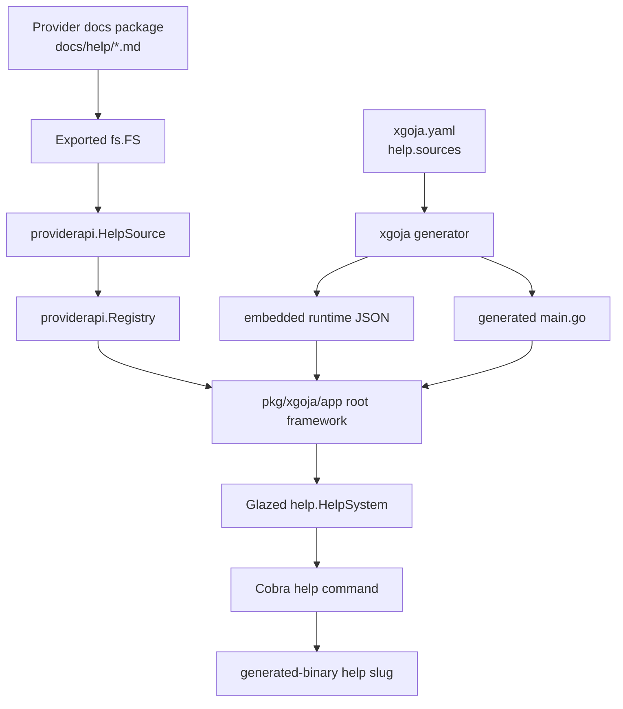
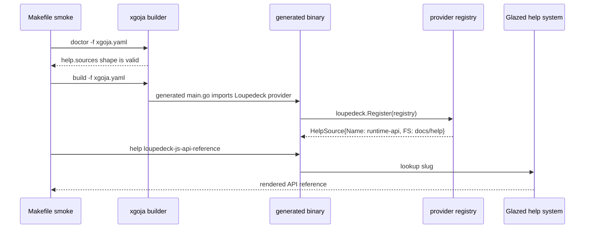

# xgoja Provider-Shipped Glazed Help Documents

Generated xgoja binaries can now include Glazed help documents that come from provider packages or from project-local documentation directories. The purpose of the feature is precise: a generated binary should not only expose JavaScript modules and commands; it should also expose the documentation needed to use those modules and commands through the same `help` command that users already know.

The implementation was added during XGOJA-015. It spans `go-go-goja` and `loupedeck`: `go-go-goja` owns the provider API, buildspec schema, generator, and generated-root loader; `loupedeck` owns an actual provider-shipped documentation source. The final smoke example lives at `/home/manuel/workspaces/2026-05-31/xgoja-docs/go-go-goja/examples/xgoja/09-provider-shipped-help-docs` and proves that a generated binary can render `help loupedeck-js-api-reference` from documentation embedded in the Loupedeck provider package.

> [!summary]
> - `providerapi.HelpSource` lets a provider package register a Glazed documentation tree as an `fs.FS` plus a root path.
> - `help.sources` in `xgoja.yaml` selects provider-shipped docs, embedded local docs, or runtime filesystem docs.
> - Generated binaries merge built-in xgoja help, selected provider docs, and selected local docs into one Glazed `HelpSystem` before installing the Cobra `help` command.
> - The Loupedeck provider now exposes its JavaScript API reference and tutorial docs as `loupedeck.runtime-api`.

## Why this note exists

xgoja is a source-generation tool for building custom Goja-powered binaries from declarative `xgoja.yaml` files. A generated binary imports provider packages, registers their JavaScript modules, selects runtime profiles, and exposes commands such as `eval`, `run`, `repl`, JavaScript verbs, and provider-owned Glazed command sets.

Before XGOJA-015, the generated binary could expose the code surface of a provider package but not the provider's own documentation. This created a mismatch. A package such as Loupedeck can expose modules named `loupedeck/state`, `loupedeck/ui`, `loupedeck/anim`, and `loupedeck/easing`, but the generated binary had no built-in way to show the user the API reference for those modules. The standalone Loupedeck CLI already loaded `docs/help` into a Glazed help system, but an xgoja-generated binary using the Loupedeck provider did not.

The feature closes that gap. Provider packages can now register documentation sources. Application authors can opt into those sources from `xgoja.yaml`. The generated binary then loads those pages into the same help system that already contains built-in xgoja runtime help.

## The core model

There are three separate responsibilities in this design.

First, a provider package declares what documentation it owns. This happens in Go code through `providerapi.HelpSource`. A help source has a stable name, a description, an `fs.FS`, and a root directory inside that filesystem.

Second, the buildspec selects which documentation sources should appear in a particular generated binary. This happens in YAML through `help.sources`. Selection is explicit. Compiling a provider into a binary does not automatically load every documentation page that provider knows about.

Third, the generated app loads the selected documentation sources into one Glazed help system during root command setup. This happens in `pkg/xgoja/app/framework.go`. The root framework always loads built-in generated xgoja docs first, then loads configured help sources, then calls `help_cmd.SetupCobraRootCommand(...)` once.



The design keeps ownership boundaries explicit. Provider packages own provider documentation. `xgoja.yaml` owns generated-binary selection. The generated app owns help-system assembly. No provider installs its own Cobra help command.

## The user-facing buildspec

A generated binary selects help sources through `help.sources`.

```yaml
help:
  sources:
    - id: loupedeck-runtime-api
      package: loupedeck
      source: runtime-api
```

This entry says: load the provider help source named `runtime-api` from the provider package whose buildspec-local package ID is `loupedeck`. The `id` field is local to the buildspec and is used for validation and error reporting. The `package` and `source` fields identify the registered provider source.

The complete smoke example is intentionally small:

```yaml
name: provider-shipped-help-docs
target:
  kind: xgoja
  output: dist/provider-shipped-help-docs
packages:
  - id: loupedeck
    import: github.com/go-go-golems/loupedeck/pkg/xgoja/provider
    replace: ../../../../loupedeck
runtimes:
  docs:
    modules:
      - package: loupedeck
        name: loupedeck/state
        as: loupedeck/state
commands:
  eval:
    enabled: true
    runtime: docs
  run:
    enabled: false
  jsverbs:
    enabled: false
  repl:
    enabled: false
help:
  sources:
    - id: loupedeck-runtime-api
      package: loupedeck
      source: runtime-api
```

The runtime profile selects only `loupedeck/state`. That is enough to satisfy xgoja's runtime validation without opening hardware or starting long-lived resources. The smoke test is about documentation loading, not hardware execution.

## The provider-facing API

The provider API is deliberately small:

```go
type HelpSource struct {
    Name        string
    Description string
    FS          fs.FS
    Root        string
}
```

The implementation lives in `/home/manuel/workspaces/2026-05-31/xgoja-docs/go-go-goja/pkg/xgoja/providerapi/help.go`. Validation happens when the provider registers the package:

```go
func normalizeHelpSource(source HelpSource) (HelpSource, error) {
    name := strings.TrimSpace(source.Name)
    if name == "" {
        return HelpSource{}, fmt.Errorf("help source name is required")
    }
    if source.FS == nil {
        return HelpSource{}, fmt.Errorf("help source %q filesystem is required", name)
    }
    source.Name = name
    source.Description = strings.TrimSpace(source.Description)
    source.Root = strings.TrimSpace(source.Root)
    if source.Root == "" {
        source.Root = "."
    }
    return source, nil
}
```

The early validation matters because a provider help source without a filesystem cannot be loaded later. Failing at registration time gives the provider author a direct error instead of letting a generated binary fail after build.

The registry stores help sources next to the existing provider contributions:

- modules, which provide Go-backed `require(...)` modules;
- verb sources, which provide JavaScript verb definitions;
- package capabilities, which provide configuration sections and runtime initializers;
- command set providers, which provide package-owned Glazed commands;
- help sources, which provide Glazed documentation trees.

The important call is:

```go
providerSource, ok := opts.Providers.ResolveHelpSource(source.Package, source.Source)
```

This mirrors existing provider lookup patterns. The generated app does not import provider docs directly. It asks the registry for the source selected by the runtime spec.

## How Loupedeck exposes its docs

Loupedeck already had a Glazed docs package:

```go
package doc

import (
    "embed"
    "io/fs"

    "github.com/go-go-golems/glazed/pkg/help"
)

//go:embed topics/*.md tutorials/*.md
var docFS embed.FS

func FS() fs.FS {
    return docFS
}

func AddDocToHelpSystem(helpSystem *help.HelpSystem) error {
    return helpSystem.LoadSectionsFromFS(docFS, ".")
}
```

The new `FS()` function is the important addition. The existing standalone CLI can continue to call `AddDocToHelpSystem`. The xgoja provider can now register the same embedded filesystem as a provider help source.

The provider registration in `/home/manuel/workspaces/2026-05-31/xgoja-docs/loupedeck/runtime/js/provider/provider.go` includes:

```go
providerapi.HelpSource{
    Name:        "runtime-api",
    Description: "Loupedeck JavaScript runtime API reference and tutorials",
    FS:          helpdoc.FS(),
    Root:        ".",
}
```

The source name is `runtime-api`, so the buildspec selects it as `package: loupedeck`, `source: runtime-api`. The pages inside the source keep their own Glazed slugs. For example, the API reference has:

```yaml
Title: Loupedeck JavaScript runtime API reference
Slug: loupedeck-js-api-reference
SectionType: GeneralTopic
```

The generated binary command is therefore:

```bash
./dist/provider-shipped-help-docs help loupedeck-js-api-reference
```

The provider source name and the page slug are different identifiers. The source name selects a documentation tree. The slug selects a page inside the loaded help system.

## The generated root loader

The generated root framework is implemented in `/home/manuel/workspaces/2026-05-31/xgoja-docs/go-go-goja/pkg/xgoja/app/framework.go`. It performs one setup sequence:

```go
helpSystem := help.NewHelpSystem()
if err := xgojadoc.AddDocToHelpSystem(helpSystem); err != nil {
    return fmt.Errorf("load generated xgoja help docs: %w", err)
}
if err := loadConfiguredHelpSources(helpSystem, spec, opts); err != nil {
    return err
}
help_cmd.SetupCobraRootCommand(helpSystem, root)
```

This order is significant. Built-in generated xgoja docs are always present. Configured provider or local docs are added after that. The final help command sees one combined `HelpSystem`.

The configured-source loader has three branches:

```go
// Provider-shipped docs
providerSource, ok := opts.Providers.ResolveHelpSource(source.Package, source.Source)
helpSystem.LoadSectionsFromFS(providerSource.FS, providerSource.Root)

// Embedded local docs
helpSystem.LoadSectionsFromFS(opts.EmbeddedHelp, source.Path)

// Runtime filesystem docs
helpSystem.LoadSectionsFromFS(os.DirFS(source.Path), ".")
```

Provider-shipped docs come from the provider registry. Embedded local docs come from the generated binary's `embed.FS`. Runtime filesystem docs come from disk when the generated binary runs.

The loader also rejects duplicate buildspec source IDs during root setup. Glazed itself is responsible for detecting duplicate help slugs while loading sections. This separation is useful: source IDs are xgoja configuration identifiers, while slugs are Glazed page identifiers.

## Local help docs and generated embedding

Provider-shipped docs are not the only mode. A generated app can also bundle project-local docs:

```yaml
help:
  sources:
    - id: project-docs
      path: ./docs/help
      embed: true
```

When `embed: true`, the generator copies the directory into the generated workspace:

```text
xgoja_embed/help/project_docs/...
```

The generated `main.go` contains:

```go
//go:embed xgoja_embed/help/*
var embeddedHelp embed.FS
```

The runtime JSON is rewritten so the generated app loads from the embedded path rather than the original source path. This matters because the original project directory may not exist on the machine where the generated binary runs.

The template code has to handle four combinations:

| Embedded JS verbs | Embedded help docs | Generated `embed` state |
|---|---|---|
| no | no | no `embed` import |
| yes | no | `embeddedJSVerbs` only |
| no | yes | `embeddedHelp` only |
| yes | yes | both embedded filesystems |

This is a compile-time constraint. Go rejects unused imports and unused variables. The generator therefore tracks `HasEmbeddedJSVerb` and `HasEmbeddedHelp` separately, while retaining a combined `HasEmbedded` flag for the import.

## Runtime filesystem docs

A third mode reads docs from disk when the generated binary runs:

```yaml
help:
  sources:
    - id: dev-docs
      path: ./docs/help
      embed: false
```

This mode is useful during documentation development. It is not the recommended mode for distributed binaries because the path must exist at runtime. In practice, provider-shipped docs and embedded local docs are the stable modes.

The runtime loader uses:

```go
helpSystem.LoadSectionsFromFS(os.DirFS(source.Path), ".")
```

That means path semantics are determined at generated-binary runtime. If the path is relative, it is relative to the process working directory. Use embedded docs for binaries that must be self-contained.

## Validation rules

The buildspec validator checks help sources before generation. It validates the configuration shape, not the contents of every Markdown page.

The main rules are:

- A help source needs a non-empty `id`.
- Help source IDs must be unique within `help.sources`.
- A provider source needs both `package` and `source`.
- A provider source must reference a package ID declared under `packages`.
- A filesystem source needs `path`.
- A source cannot combine provider fields and filesystem path fields.
- An embedded filesystem source must exist at build time and must be a directory.

The smoke example shows the validator reporting the provider source:

```text
| help-provider-source | ok | help.sources[0] | ... | provider source loupedeck.runtime-api |
```

The validator does not check whether the provider actually registers the named source. That check happens in the generated binary after provider registration. This is the right split: `xgoja doctor` can validate the static YAML structure and declared package IDs, but only generated code can call the provider's `Register` function and inspect the runtime registry.

## Manual smoke test

The reference smoke test lives at:

```text
/home/manuel/workspaces/2026-05-31/xgoja-docs/go-go-goja/examples/xgoja/09-provider-shipped-help-docs
```

Run it with:

```bash
cd /home/manuel/workspaces/2026-05-31/xgoja-docs/go-go-goja
make -C examples/xgoja/09-provider-shipped-help-docs smoke
```

The Makefile runs four phases:

```makefile
smoke: doctor list build run
```

The `run` phase performs direct assertions against the generated binary:

```makefile
$(BIN) help loupedeck-js-api-reference | grep -F "Loupedeck JavaScript runtime API reference"
$(BIN) help loupedeck-js-api-reference | grep -F "loupedeck/state"
$(BIN) help loupedeck-js-first-live-script | grep -F "Build your first live Loupedeck JavaScript script"
```

This test validates the complete path:



The first smoke attempt used the wrong tutorial slug:

```text
Unknown help topic [`tutorial-build-your-first-live-loupedeck-js-script`]
```

The correct slug comes from the tutorial's frontmatter:

```yaml
Slug: loupedeck-js-first-live-script
```

The final smoke run passed with the correct slug.

## How to use this pattern in a new provider

Start by writing Glazed help pages in the provider repository. Keep them under a package that can be imported without pulling in the provider's CLI entrypoint. A typical layout is:

```text
docs/help/
  doc.go
  topics/
    01-my-provider-js-api-reference.md
  tutorials/
    01-build-your-first-script.md
```

The `doc.go` file should export both `FS()` and `AddDocToHelpSystem(...)`:

```go
//go:embed topics/*.md tutorials/*.md
var docFS embed.FS

func FS() fs.FS { return docFS }

func AddDocToHelpSystem(helpSystem *help.HelpSystem) error {
    return helpSystem.LoadSectionsFromFS(docFS, ".")
}
```

Then register the docs in the provider:

```go
func Register(registry *providerapi.Registry) error {
    return registry.Package(PackageID,
        providerapi.HelpSource{
            Name:        "runtime-api",
            Description: "JavaScript runtime API reference and tutorials",
            FS:          helpdoc.FS(),
            Root:        ".",
        },
        // modules, capabilities, command providers...
    )
}
```

Then select the docs from the generated app spec:

```yaml
help:
  sources:
    - id: my-provider-runtime-api
      package: my-provider
      source: runtime-api
```

Finally, smoke test the generated binary:

```bash
xgoja build -f xgoja.yaml --xgoja-replace /path/to/go-go-goja
./dist/myapp help my-provider-js-api-reference
```

The page slug is defined in Markdown frontmatter, not in `xgoja.yaml`.

## Authoring a useful provider API reference

A provider API reference should document implemented behavior. It should not mix current APIs with planned APIs unless those sections are explicitly marked as future work.

A strong page starts with the runtime boundary:

```markdown
---
Title: My Provider JavaScript runtime API reference
Slug: my-provider-js-api-reference
Short: Reference for modules exposed by the my-provider xgoja provider.
Topics:
- my-provider
- xgoja
- javascript
- goja
- api
Commands:
- myapp
Flags: []
IsTopLevel: true
IsTemplate: false
ShowPerDefault: true
SectionType: GeneralTopic
---

This reference documents the currently implemented JavaScript API for generated
xgoja binaries that include the `my-provider` package.
```

Then define the module surface:

| Section | Purpose |
|---|---|
| Runtime model | Defines what owns the Goja runtime, resources, callbacks, and cleanup. |
| Module overview | Lists each `require(...)` module and its main exports. |
| Per-module reference | Documents function signatures, return values, errors, and examples. |
| Configuration flags | Explains Glazed sections contributed by the provider. |
| Troubleshooting | Lists common `help`, `require`, configuration, and runtime errors. |

The Loupedeck page follows this shape. It explains that JavaScript code mutates retained UI and reactive state while Go owns rendering, transport, and hardware I/O. It then lists modules such as `loupedeck/state`, `loupedeck/ui`, `loupedeck/anim`, and `loupedeck/easing`.

## Failure modes

### The provider source is selected but not registered

The generated binary fails while installing its root framework:

```text
unknown provider help source loupedeck.runtime-api
```

This means the `packages` entry imported a provider that did not register the requested source name, or the buildspec uses the wrong package ID or source name.

### The page slug is wrong

The generated binary can load the provider source but still reject a specific `help` lookup:

```text
Unknown help topic [`some-slug`]
```

Read the Markdown frontmatter and use the exact `Slug` value. The source name in `xgoja.yaml` is not the page slug.

### Two selected pages use the same slug

Glazed help slugs are global inside one generated binary. If built-in docs, provider docs, and local docs contain duplicate slugs, the help system should fail rather than choose one page silently. Choose provider-specific slugs such as `loupedeck-js-api-reference` instead of generic slugs such as `api-reference`.

### Runtime filesystem docs are missing

If `embed: false`, the generated binary reads docs from disk when it starts. The path must exist at runtime. Use `embed: true` for self-contained binaries.

### A local embedded path is a file

`help.sources[].embed: true` expects a directory. The buildspec validator rejects files because Glazed help docs are normally a directory tree containing topics and tutorials.

## Review map

The implementation is easiest to review in this order:

| Layer | File | What to check |
|---|---|---|
| Provider API | `/home/manuel/workspaces/2026-05-31/xgoja-docs/go-go-goja/pkg/xgoja/providerapi/help.go` | `HelpSource` fields and validation. |
| Registry | `/home/manuel/workspaces/2026-05-31/xgoja-docs/go-go-goja/pkg/xgoja/providerapi/registry.go` | Help source storage, duplicate checks, lookup, cloning. |
| Buildspec | `/home/manuel/workspaces/2026-05-31/xgoja-docs/go-go-goja/cmd/xgoja/internal/buildspec/spec.go` | `help.sources` schema fields. |
| Buildspec validation | `/home/manuel/workspaces/2026-05-31/xgoja-docs/go-go-goja/cmd/xgoja/internal/buildspec/validate.go` | Static source-shape validation and package-ID checks. |
| Generator | `/home/manuel/workspaces/2026-05-31/xgoja-docs/go-go-goja/cmd/xgoja/internal/generate/generate.go` | Copying embedded local help docs into generated workspaces. |
| Template | `/home/manuel/workspaces/2026-05-31/xgoja-docs/go-go-goja/cmd/xgoja/internal/generate/templates/main.go.tmpl` | Conditional embed imports and `app.Options{EmbeddedHelp: ...}` wiring. |
| Runtime app | `/home/manuel/workspaces/2026-05-31/xgoja-docs/go-go-goja/pkg/xgoja/app/framework.go` | Loading configured sources before installing Cobra help. |
| Loupedeck docs package | `/home/manuel/workspaces/2026-05-31/xgoja-docs/loupedeck/docs/help/doc.go` | `FS()` export and embedded doc tree. |
| Loupedeck provider | `/home/manuel/workspaces/2026-05-31/xgoja-docs/loupedeck/runtime/js/provider/provider.go` | `providerapi.HelpSource{Name: "runtime-api"}` registration. |
| Smoke example | `/home/manuel/workspaces/2026-05-31/xgoja-docs/go-go-goja/examples/xgoja/09-provider-shipped-help-docs` | End-to-end generated-binary behavior. |

## What changed in the generated binary contract

The generated binary contract now includes documentation as a first-class selected resource. Before this change, a buildspec selected provider packages, modules, runtimes, commands, and JavaScript verb sources. After this change, the buildspec can also select help sources.

The generated binary still starts from a single Cobra root command. The root command still receives logging setup, generated xgoja docs, runtime commands, and provider command sets. The difference is that help installation is now fed by a broader document set:

```text
built-in xgoja docs
+ selected provider HelpSource filesystems
+ selected embedded local docs
+ selected runtime filesystem docs
= one Glazed HelpSystem installed on the root Cobra command
```

The user sees one `help` command. The implementation preserves the single-root-command model instead of asking each provider to install its own help command. That matters because Glazed help pages are selected by global slug, and the generated binary should have one slug namespace.

## The minimal mental model

For day-to-day use, keep these rules in mind:

- A provider source name identifies a documentation tree. Example: `runtime-api`.
- A Glazed slug identifies a page inside the loaded documentation tree. Example: `loupedeck-js-api-reference`.
- `help.sources[].id` identifies a selected source inside one buildspec. Example: `loupedeck-runtime-api`.
- `package` refers to the buildspec package ID, not the Go import path.
- Provider-shipped docs are loaded from `fs.FS`; embedded local docs are copied by the generator; runtime local docs are read from disk by the generated binary.

These are three different namespaces. Confusing them is the easiest way to get a working build with a failing help lookup.

## Validation commands

Use these commands to re-check the implementation:

```bash
cd /home/manuel/workspaces/2026-05-31/xgoja-docs/go-go-goja
go test ./pkg/xgoja/providerapi ./cmd/xgoja/internal/buildspec ./cmd/xgoja/internal/generate ./pkg/xgoja/app ./cmd/xgoja/... -count=1
make -C examples/xgoja/09-provider-shipped-help-docs smoke
rm -rf examples/xgoja/09-provider-shipped-help-docs/dist
```

For the Loupedeck provider repository:

```bash
cd /home/manuel/workspaces/2026-05-31/xgoja-docs/loupedeck
go test ./runtime/js/provider ./pkg/xgoja/provider -count=1
```

The smoke test is the most important user-facing validation. Unit tests prove the API and loader pieces independently; the smoke test proves that a generated binary can render provider-shipped help pages by slug.

## Closing

The XGOJA-015 implementation turns documentation into a selected build artifact. Provider packages can ship documentation next to the modules and commands they expose, and application authors can decide which documentation sets belong in a generated binary. The generated binary remains a normal Cobra application with one Glazed help system, but that help system now reflects the selected provider surface instead of only the core xgoja runtime.

The result is a practical contract for provider authors: if a package exposes JavaScript APIs through xgoja, it can also expose the documentation for those APIs through `providerapi.HelpSource`. The user consumes both through the generated binary.
