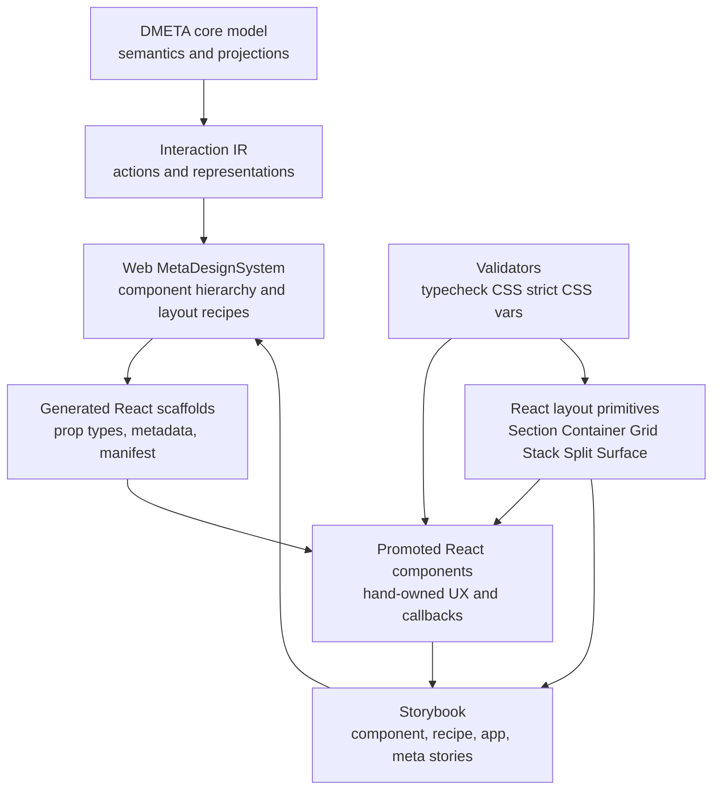
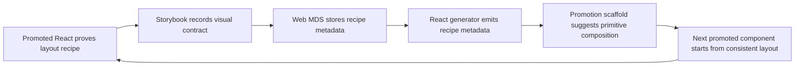

# DMETA React Design System: Layout Primitives, Storybook Contracts, and Cleanup

This report explains the React, CSS, and Storybook cleanup work in the TTC design-system project. The immediate implementation work happened in the `ttc-garden-assistant` package, but the purpose is larger than one landing page. The work establishes a consistent path from DMETA semantics and Web MetaDesignSystem recipes to generated React scaffolds, promoted React components, reusable layout primitives, Storybook review surfaces, and cleanup rules that prevent old layout patterns from returning.

> [!summary]
> - The central design-system change is the introduction of explicit React layout primitives: `Section`, `Container`, `Grid`, `Stack`, `Split`, and `Surface`.
> - The cleanup removes duplicated section padding, centered max-width wrappers, repeated grid recipes, and ad-hoc Storybook groupings from promoted components.
> - The long-term DMETA goal is to make generated scaffolds and promotion workflows preserve semantic contracts while giving frontend developers a stable, target-specific layout vocabulary.
> - Storybook is now organized as a design review surface: component library, design-system contracts, applications, and DMETA/meta tooling.

## Why this report exists

The TTC work started with a practical UI problem: the promoted Tree Center-style landing page had many sections that looked related but encoded their layout locally. Several organisms owned their own section padding, page gutters, grid columns, max-width wrappers, and responsive breakpoints. This was enough to make one page work, but it was not enough to make the design system reliable.

A design system becomes reliable when repeated decisions have one location. If every section chooses its own page gutter, every page can drift. If every product grid writes its own `grid-template-columns`, product grids can become similar but not identical. If Storybook contains a mix of current components, generated scaffolds, old showcase pages, and workflow tables at the same hierarchy level, reviewers cannot tell which stories are canonical contracts and which stories are historical artifacts.

The cleanup therefore had two connected goals:

1. Create a small React layout layer that promoted components can use consistently.
2. Feed the lessons from that promoted React layer back into DMETA and the Web MetaDesignSystem so future generation starts closer to the desired shape.

The source repository is:

```text
/home/manuel/workspaces/2026-05-27/ttc-design-system
```

The main implementation package is:

```text
2026-05-27--ttc-design-system/web/packages/ttc-garden-assistant
```

The ticket that guided this work is:

```text
2026-05-27--ttc-design-system/ttmp/2026/05/31/TTC-REACT-LAYOUT-SYSTEM--react-layout-primitives-and-dmeta-design-system-feedback-loop
```

## What DMETA is for

DMETA is the project’s semantic-to-implementation design pipeline. It is not just a component generator. It is a way to preserve design intent across several layers that have different responsibilities.

The important separation is this:

```text
core model
  -> Interaction IR
  -> Web MetaDesignSystem
  -> React scaffold generation
  -> promoted React implementation
  -> Storybook and validation
```

Each layer owns a different kind of decision.

| Layer | Owns | Does not own |
| --- | --- | --- |
| Core model | domain semantics, archetypes, capabilities, projections | CSS, React layout, Storybook grouping |
| Interaction IR | user-visible obligations, actions, representations | target-specific component styling |
| Web MetaDesignSystem | Web component hierarchy, widget templates, layout recipes | target-neutral semantic meaning |
| React generator | scaffold files, generated prop types, metadata sidecars | hand-authored final UX and polish |
| Promoted React | production component composition, callbacks, CSS Modules, Storybook stories | changing generated contracts by hand |
| Validators and Storybook | guardrails and review surfaces | inventing semantics |

The purpose of DMETA is to make this chain explicit. A landing page section should not appear as a disconnected React file. It should be traceable back to a template, a representation, and an action contract. The promoted React code should still look like normal frontend code, but it should preserve provenance: generated prop imports, semantic callbacks, `data-ttc-template`, component identity, and promotion state.

The layout-system work matters because DMETA generation can only be robust if the target-specific side has stable concepts. Before this cleanup, the Web MDS could say that a component was an organism or page, but the React implementation still had to rediscover how to lay out sections. After this cleanup, the React side has names such as `categoryTiles`, `productCards`, `editorialTriptych`, and `guideCards`. Those names can later become Web MDS layout metadata and generator hints.

## The fundamental problem: duplicated layout knowledge

The promoted landing page had several sections that repeated the same layout ideas with small variations. For example, collection sections owned their own root padding, max-width wrappers, grids, and breakpoints. These patterns appeared in files such as:

```text
src/components/organisms/CategoryCollectionSection/CategoryCollectionSection.module.css
src/components/organisms/ProductCollectionSection/ProductCollectionSection.module.css
src/components/organisms/EditorialTriptychSection/EditorialTriptychSection.module.css
src/components/organisms/GuideCardGridSection/GuideCardGridSection.module.css
src/components/organisms/ValuePropositionSection/ValuePropositionSection.module.css
```

The repeated structure was conceptually simple:

```tsx
<section className={styles.root}>
  <SectionHeader ... />
  <div className={styles.gridOrInner}>
    ...cards...
  </div>
</section>
```

The repeated CSS was also simple:

```css
.root {
  padding: var(--ttc-space-15) var(--ttc-page-gutter);
  background: var(--ttc-surface);
}

.grid {
  display: grid;
  grid-template-columns: repeat(3, minmax(0, 1fr));
  gap: var(--ttc-space-13);
  max-width: var(--ttc-layout-max-site);
  margin-inline: auto;
}
```

This is exactly the kind of repetition that a design system should remove. The issue is not that this CSS is wrong. The issue is that the same decision appears in too many places. Once repeated, it becomes hard to change consistently, hard to validate, and hard to encode in DMETA.

The correct response is not to move CSS into the semantic core. The correct response is to introduce a target-specific React layout layer and later describe that layer in the Web MetaDesignSystem.

## The layout primitive layer

The first implementation step was to add semantic layout tokens to `tokens.css`, then introduce six layout primitives:

```text
src/components/layout/
  Section/
  Container/
  Grid/
  Stack/
  Split/
  Surface/
```

These primitives are not atoms. An atom is a small visual or interaction component such as `Button`, `Chip`, `Icon`, or `PillLabel`. A layout primitive is structural. It defines spacing, width, rhythm, grid recipes, stack gaps, split behavior, or surface chrome. That is why the Storybook hierarchy now places them under `Design System/Layout`, not under `Component Library/Atoms`.

The responsibilities are deliberately narrow.

| Primitive | Responsibility |
| --- | --- |
| `Section` | vertical section rhythm, background tone, page gutters, root provenance attributes |
| `Container` | centered max-width content regions |
| `Grid` | named responsive grid recipes |
| `Stack` | vertical composition, tokenized gaps, simple alignment |
| `Split` | responsive two-column text/media layout |
| `Surface` | reusable card or band surface treatment |

The primitives are boring by design. They are not a new styling framework. They are React components with CSS Modules and tokenized styles. That matters because the rest of the frontend already uses CSS Modules, existing validators understand CSS files, and promoted components remain ordinary TypeScript/React code.

### The new composition shape

After the cleanup, a collection section is expressed as a composition of named design-system concepts:

```tsx
<Section
  tone="white"
  spacing="landing"
  templateId="ttc.category_collection_section"
  part="root"
  data-ttc-component="CategoryCollectionSection"
  data-ttc-promotion-state="promoted"
>
  <Container size="site">
    <SectionHeader heading={heading} headingLevel="h2" />
    <Grid recipe="categoryTiles">
      {categories.map((category) => (
        <CategoryImageCard key={category.category.id} {...category} />
      ))}
    </Grid>
  </Container>
</Section>
```

This code is more explicit than the old version. The old version required the reader to inspect CSS to learn that the section had landing spacing, site width, and a category grid. The new version says those things in the component tree.

The same pattern applies to product cards, editorial triptychs, guide cards, split features, guarantee bands, and assistant entry sections.

## What changed in the React code

The implementation proceeded in phases. The early phases added the primitives; the later phases applied them and deleted obsolete CSS.

### Tokens

`src/styles/tokens.css` gained semantic layout tokens:

```css
--ttc-section-spacing-none: var(--ttc-space-0);
--ttc-section-spacing-sm: var(--ttc-space-10);
--ttc-section-spacing-md: var(--ttc-space-12);
--ttc-section-spacing-lg: var(--ttc-space-14);
--ttc-section-spacing-xl: var(--ttc-space-15);
--ttc-section-spacing-landing: var(--ttc-space-15);

--ttc-grid-gap-category: var(--ttc-space-13);
--ttc-grid-gap-product-column: var(--ttc-space-13);
--ttc-grid-gap-product-row: var(--ttc-space-15);
--ttc-grid-gap-triptych: var(--ttc-space-12);
--ttc-grid-gap-guide: var(--ttc-space-12);

--ttc-stack-gap-xs: var(--ttc-space-2);
--ttc-stack-gap-sm: var(--ttc-space-3);
--ttc-stack-gap-md: var(--ttc-space-5);
--ttc-stack-gap-lg: var(--ttc-space-8);
--ttc-stack-gap-xl: var(--ttc-space-12);
--ttc-split-gap: var(--ttc-space-13);
```

These tokens are one level above raw spacing. They say why the spacing exists. `--ttc-space-13` is a scale value. `--ttc-grid-gap-category` is a recipe value.

### Primitives

The first primitives were `Section` and `Container`. They removed the need for sections to repeat page gutters, background tone, max-width, and centering. Then `Grid` and `Stack` removed repeated responsive grid recipes and flex-column stacks. Then `Split` and `Surface` covered text/media layout and reusable surface treatments.

The primitive API is intentionally small. For example, `Grid` accepts recipe names:

```ts
export type GridRecipe =
  | 'categoryTiles'
  | 'productCards'
  | 'editorialTriptych'
  | 'guideCards'
  | 'twoColumn'
  | 'autoCards';
```

This is a key design decision. The frontend should not pass arbitrary column templates everywhere. If a layout is common, it should have a recipe name. If a layout is not common, it can stay component-specific until repetition proves otherwise.

### Section refactors

The first refactor targets were:

```text
CategoryCollectionSection
ProductCollectionSection
EditorialTriptychSection
```

Their local CSS modules were deleted because those files only owned generic layout. The layout now lives in `Section`, `Container`, and `Grid`.

The second refactor pass covered:

```text
SplitFeature
ValuePropositionSection
GuaranteeSection
GuideCardGridSection
AssistantEntrySection
```

Two more local CSS modules were deleted:

```text
ValuePropositionSection.module.css
GuideCardGridSection.module.css
```

Other modules were reduced to component-specific styling. For example, `GuaranteeSection.module.css` now keeps guarantee-specific color inheritance, body copy, and image treatment. It no longer owns the generic section shell or split grid.

## Storybook as a design-system surface

Storybook has two jobs in this project. It shows components, and it defines visual contracts. Those are related but not identical.

A component story answers: how does this component render? A recipe story answers: what is the approved layout structure for this class of composition?

The cleanup created a central set of recipe stories:

```text
TTC Garden Assistant/Design System/Layout Recipes/Category Tiles
TTC Garden Assistant/Design System/Layout Recipes/Product Cards
TTC Garden Assistant/Design System/Layout Recipes/Editorial Triptych
TTC Garden Assistant/Design System/Layout Recipes/Guide Cards
TTC Garden Assistant/Design System/Layout Recipes/Split Feature
TTC Garden Assistant/Design System/Layout Recipes/Section Tones
```

These stories use real promoted components and fixtures. That is important. Placeholder boxes are useful for primitive tests, but they do not reveal product card height, image aspect ratios, category tile overlays, or editorial card spacing. The recipe stories expose those details.

The Storybook hierarchy was then reorganized:

```text
TTC Garden Assistant/
  Component Library/
    Atoms/
    Molecules/
    Organisms/
  Design System/
    Layout/
    Layout Recipes/
  Applications/
    Garden Assistant/
    Tree Center/
  Meta/
    DMETA Workflow
```

The old `Current Component System` showcase was deleted. It duplicated focused stories for `Button`, `Chip`, and `ProductCard`, and it used ad-hoc wrappers that no longer represented the current design-system direction.

Generated stories under `src/generated/dmeta-widgets/**` were left untouched. If those need a different hierarchy, the generator should change. Generated files should not be hand-edited.

## The cleanup rule: do not keep two systems

The most important principle in this work is that adding primitives is not enough. The old patterns must be removed. Otherwise the project ends up with two systems: one explicit and one implicit.

The cleanup removed obsolete CSS modules when they contained only generic layout. It also documented search patterns for future cleanup:

```bash
rg -n "padding: var\(--ttc-space-(13|14|15)\) var\(--ttc-page-gutter\)" src/components
rg -n "max-width: var\(--ttc-layout-max-(site|page|content|wide)\)" src/components
rg -n "margin-inline: auto" src/components
rg -n "grid-template-columns: repeat\(" src/components
rg -n "flex-direction: column" src/components
```

Each match should be classified, not blindly deleted.

| Classification | Meaning | Action |
| --- | --- | --- |
| `replace` | Generic layout now owned by primitives | Refactor to primitive and delete CSS |
| `keep-component-specific` | The styling is local to the component’s own content | Keep, but ensure it uses tokens |
| `exception` | The layout is intentionally custom | Add a documented validator exception |
| `dead` | The class or file is unused | Delete it |

This distinction matters. A proof-point list inside `SplitFeature` may still use `flex-direction: column`; that is component-specific list styling. A full section shell should not use local padding and page gutters once `Section` exists.

## Validation and guardrails

The work so far has relied on four validation commands:

```bash
pnpm --filter ttc-garden-assistant typecheck
pnpm --filter ttc-garden-assistant validate:css-vars
pnpm --filter ttc-garden-assistant validate:css-strict
pnpm --filter ttc-garden-assistant build-storybook
```

These commands catch type errors, missing or invalid CSS variables, strict CSS policy violations, and Storybook build breakage. They do not yet fully enforce layout ownership. That is why the next phase is CSS validation tightening.

The intended Phase 9 rule is straightforward: if layout primitives own a kind of layout, component CSS should not casually reintroduce it.

Examples of future validator checks:

```text
Component CSS uses max-width: var(--ttc-layout-max-site).
Prefer <Container size="site"> or add a documented exception.
```

```text
Component CSS uses padding: var(--ttc-space-15) var(--ttc-page-gutter).
Prefer <Section spacing="landing"> or add a documented exception.
```

```text
Component CSS defines grid-template-columns: repeat(...).
Prefer <Grid recipe="..."> if this is a reusable recipe.
```

The validator must support exceptions. Some components really do need local layout. The point is not to ban CSS. The point is to stop generic section, container, grid, stack, and split mechanics from drifting back into every organism.

## How this robustifies DMETA

The React cleanup improves DMETA because it gives the Web target a stable vocabulary. DMETA can only generate useful scaffolds if it knows what target-specific concepts exist. Before this work, the system had component kind and role metadata, but the final layout choices were mostly implicit in hand-authored CSS.

The next step is to encode proven layout recipes in the Web MetaDesignSystem. A Web widget template can carry optional layout metadata:

```yaml
component:
  level: organism
  specificity: domain
  role: category_collection_section
  generation_policy: scaffold_then_promote
  layout:
    primitive: section
    section_tone: white
    section_spacing: landing
    container: site
    grid_recipe: categoryTiles
```

This metadata belongs in Web MDS, not in the core model. The core model should not know about React components, section spacing, or CSS grids. Interaction IR should not know about them either. Web MDS is the correct layer because layout recipes are target-family-specific design decisions.

Once this metadata exists, the React generator can emit it into sidecars and manifests. Promotion tools can then produce better skeletons:

```tsx
<Section tone="white" spacing="landing" templateId="ttc.category_collection_section">
  <Container size="site">
    <SectionHeader heading={heading} />
    <Grid recipe="categoryTiles">
      {/* map domain data to cards */}
    </Grid>
  </Container>
</Section>
```

That skeleton is still not the final component. It is a better starting point. It preserves the semantic contract and points the frontend developer toward the established design-system path.

## The architecture after cleanup

The current frontend architecture can be read as a set of explicit layers:



The arrow from Storybook back to Web MDS is important. Storybook is not only a demo surface. It is evidence. Once a layout recipe works in promoted React and is visible in Storybook, that recipe can be described in Web MDS for future generation.

## What was deliberately not done

Several tempting changes were avoided.

First, the work did not move layout into the core model. That would make the semantic layer target-specific and harder to reuse. Core model remains about domain meaning.

Second, the work did not replace CSS Modules. CSS Modules are not the problem. The problem was duplicated layout responsibility. CSS Modules remain a good fit when paired with tokens, primitives, Storybook, and validators.

Third, the work did not edit generated stories by hand. Generated files need generator-level changes. Manual edits would be lost and would confuse ownership.

Fourth, the work did not introduce a large styling framework. The project needs stable names and ownership boundaries more than it needs a new styling runtime.

## Current status

The following phases have been completed and committed in the TTC repository:

- Layout tokens were added.
- `Section` and `Container` were implemented.
- `Grid` and `Stack` were implemented.
- `Split` and `Surface` were implemented.
- The first landing collection sections were refactored through layout primitives.
- Remaining landing split/band/guide/assistant sections were refactored through layout primitives.
- Layout recipe Storybook contracts were added.
- Storybook hierarchy was reorganized.
- The obsolete `Current Component System` story was removed.

Relevant commits include:

```text
d232899 Design tokens: add TTC layout recipe tokens
bd30ff0 Add React Section and Container layout primitives
c398c72 Add React Grid and Stack layout primitives
db15ebe Refactor landing collection sections through layout primitives
bafb54a Add React Split and Surface layout primitives
f593e60 Refactor remaining landing sections through layout primitives
a4d776f Add Storybook layout recipe contracts
10a9fa4 Reorganize TTC Storybook hierarchy
```

The important validation commands have passed during the work:

```bash
pnpm --filter ttc-garden-assistant typecheck
pnpm --filter ttc-garden-assistant validate:css-vars
pnpm --filter ttc-garden-assistant validate:css-strict
pnpm --filter ttc-garden-assistant build-storybook
```

The full Vitest suite still has known unrelated failures recorded in the ticket diary. Those failures concern generated manifest count expectations and a `ProductCard` badge assertion. They are not caused by the layout-system refactor.

## Near-term next steps

The next engineering step is Phase 9: make layout cleanup enforceable.

The validator should detect legacy layout patterns outside approved files:

- section padding outside `Section.module.css` and documented exceptions;
- max-width centering outside `Container.module.css` and documented exceptions;
- reusable grid recipes outside `Grid.module.css` and documented exceptions;
- generic split layouts outside `Split.module.css` and documented exceptions;
- generic flex-column stacks outside `Stack.module.css` and documented exceptions.

After validator enforcement, the next DMETA-facing step is to add layout recipe metadata to Web MDS templates. That should happen only for recipes that have been proven in React and Storybook.

The eventual target is this loop:



This loop is the main reason the cleanup matters. The immediate result is cleaner React. The larger result is a stronger DMETA system that can carry intent farther through generation, promotion, validation, and review.

## Working rules to preserve

The project should keep these rules:

- Keep semantic meaning in DMETA core and Interaction IR.
- Keep Web/React layout decisions in Web MDS and React design-system primitives.
- Keep generated files generated; promote instead of hand-editing scaffolds.
- Keep Storybook organized by purpose: component library, design system, applications, and meta tooling.
- Delete obsolete CSS and stories when primitives replace them.
- Add validators once a convention becomes an architectural rule.
- Use real fixtures in recipe stories so visual contracts reflect actual component behavior.
- Treat layout recipes as target-specific contracts that can later be emitted by DMETA.

The cleanup is therefore not cosmetic. It is an architectural step: it turns repeated frontend decisions into named, reviewable, enforceable, and eventually generatable design-system concepts.
