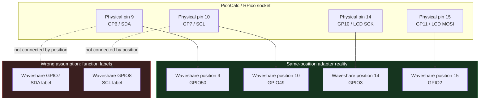

# ESP32-P4-WIFI6 as PicoCalc MCU — Deep Technical Dive

This article documents a feasibility investigation and initial firmware bring-up for replacing the Raspberry Pi Pico (RP2040/RP2350) inside a ClockworkPi PicoCalc with a Waveshare ESP32-P4-WIFI6 development board. The investigation covers hardware compatibility, pin mapping, power analysis, firmware migration strategy, and the practical results of flashing and booting the first ESP-IDF firmware on the actual board.

> [!summary]
> 1. The Waveshare ESP32-P4-WIFI6 can replace the Pico in the PicoCalc, but not as a drop-in — an adapter PCB is required to remap peripheral connections.
> 2. The board exposes 25 GPIOs on two 2×20 headers, all available for the PicoCalc project; on-board peripherals (C6 SDIO, I²S codec, SDMMC, UART) consume only internal-trace GPIOs that never reach the headers.
> 3. The specific board received carries ESP32-P4 revision v1.3 silicon, which is supported by ESP-IDF 5.3+. Phase 1 is validated: the board boots ESP-IDF v5.4.2, detects 32 MB PSRAM at 200 MHz, reaches `app_main()`, and prints logs through the on-board CH343 USB-UART bridge on `/dev/ttyACM1`.
> 4. The first networking experiment is also validated: `0098-esp32-p4-wifi6-webserver` brings up the onboard ESP32-C6 over ESP-Hosted SDIO, joins `yolobolo`, starts an `esp_console` REPL, and serves HTTP on the LAN at `http://192.168.0.88/` during the captured run.
> 5. The lean display/keyboard firmware now runs the same-position PicoCalc LCD at actual 80 MHz using `SPI_CLK_SRC_SPLL`, validates stable visible output, and includes repeatable performance measurements: 21 ms full-screen fills, 20 pseudo-text screens/s, 1207 8×16 cell updates/s, and 546 full-width 16-pixel row updates/s.
> 6. The latest display work adds queued SPI payload transfer and double-buffered RGB565 rendering. Pseudo-text redraw improved from 950 ms to 568 ms per 20 screens; moving rectangles, background-restore animation, and mixed dirty-region workloads all improved as well, with the largest gains on medium-size dirty rectangles.

## Why this note exists

The PicoCalc ships with a Raspberry Pi Pico as its main MCU. That MCU works, but it has constraints: no built-in Wi-Fi on the base model, limited RAM (264–520 KB SRAM plus an 8 MB PSRAM driven by PIO bit-bang), no hardware display acceleration, and a single SPI bus shared between the LCD and SD card. The ESP32-P4 offers a 360 MHz dual-core RISC-V processor, 32 MB stacked PSRAM on a hardware bus, 32 MB NOR flash, Wi-Fi 6 via an integrated ESP32-C6 co-processor, MIPI-DSI/CSI interfaces, multiple hardware SPI buses, and SDIO 3.0 for the SD card. The question is whether those capabilities can be brought to bear inside the PicoCalc's physical and electrical constraints.

This note records the complete investigation — the pin mapping, the GPIO budget, the power analysis, the firmware porting strategy, and the concrete results of attempting to boot ESP-IDF on the actual hardware. It is written to be useful to anyone evaluating the same board for a similar peripheral-replacement project, not only for the PicoCalc.

## The PicoCalc's current hardware

The ClockworkPi PicoCalc is a handheld device built around a Raspberry Pi Pico. It provides a 4-inch 320×320 IPS LCD, a full QWERTY keyboard driven by an STM32 southbridge over I²C, a full-size SD card slot, dual PWM speakers, and 8 MB of PSRAM accessible through the Pico's PIO peripheral. Power comes from USB-C or an internal 18650 Li-ion cell, managed by an AXP2101 power management IC.

The PicoCalc hardwires specific Pico GPIOs to each peripheral. The following table is the ground truth for any replacement effort, verified from the PiPAPo project's hardware specification and the official ClockworkPi firmware sources.

### PicoCalc pin map

| Interface | Signal | Pico Pin | Notes |
|-----------|--------|----------|-------|
| SPI1 | SCK | GP10 | LCD clock |
| SPI1 | MOSI | GP11 | LCD data (no MISO needed — write-only display) |
| GPIO | LCD CS | GP13 | LCD chip select |
| GPIO | LCD DC | GP14 | LCD data/command |
| GPIO | LCD RST | GP15 | LCD reset |
| I2C1 | SDA | GP6 | Keyboard southbridge SDA |
| I2C1 | SCL | GP7 | Keyboard southbridge SCL |
| SPI0 | MISO | GP16 | SD card data out |
| GPIO | SD CS | GP17 | SD card chip select |
| SPI0 | SCK | GP18 | SD card clock |
| SPI0 | MOSI | GP19 | SD card data in |
| GPIO | SD CD | GP22 | SD card detect (active low) |
| PIO | PSRAM SIO0 | GP2 | PSRAM quad data 0 |
| PIO | PSRAM SIO1 | GP3 | PSRAM quad data 1 |
| PIO | PSRAM SIO2 | GP4 | PSRAM quad data 2 |
| PIO | PSRAM SIO3 | GP5 | PSRAM quad data 3 |
| PIO | PSRAM CS | GP20 | PSRAM chip select |
| PIO | PSRAM SCK | GP21 | PSRAM clock |
| PWM | Audio L | GP26 | Left speaker |
| PWM | Audio R | GP27 | Right speaker |
| UART0 | TX | GP0 | Serial TX to USB-C bridge |
| UART0 | RX | GP1 | Serial RX from USB-C bridge |
| GPIO | LED | GP25 | On-board LED |

### The southbridge I²C protocol

The keyboard southbridge is an STM32 co-processor at I²C address `0x1F`. The bus speed is 10 kHz — not a typo. The PicoCalc's firmware polls this device for key events. The protocol works as follows: read register `0x04` (key FIFO status), check the FIFO count in bits 0–4, then read 2 bytes from register `0x09` (FIFO data) for each event. Byte 0 is the key state (1 = pressed, 2 = hold/repeat, 3 = released); byte 1 is the key code (ASCII for printable keys, special codes for function keys, arrows, and modifiers).

The 10 kHz bus speed is a hard constraint. Any replacement MCU must be able to operate the I²C bus at this speed reliably. No hardware reset pin exists for the STM32; the firmware should allow approximately 100 ms after I²C initialization before polling.

### The LCD controller

The PicoCalc's LCD uses an ST7365P controller (marketed as ILI9488-compatible). It connects via SPI at approximately 33 MHz. The display is 320×320 pixels in RGB565 format. The initialization sequence requires a vendor unlock command: `0xF0` with data bytes `0xC3` and `0x96` to enable RGB565 over 4-wire SPI. Without this unlock, the `COLMOD` command (setting pixel format to `0x55`) is silently ignored. Display inversion must be enabled (command `0x21`) for correct colour polarity. The MADCTL register should be set to `0x48` (MX | BGR).

## The Waveshare ESP32-P4-WIFI6 board

The Waveshare ESP32-P4-WIFI6 is a development board built around the ESP32-P4NRW32 chip — a dual-core 360 MHz RISC-V processor with 32 MB of stacked PSRAM and 32 MB of external NOR flash. An ESP32-C6 co-processor on the same board provides Wi-Fi 6 and BLE 5 connectivity over an SDIO interface. The board also includes an ES8311 audio codec with I²S interface, a speaker amplifier, a MicroSD card slot on SDMMC 4-bit, a MIPI-DSI display connector, a MIPI-CSI camera connector, and a CH343P USB-to-UART bridge for the console.

### GPIO availability on the headers

The ESP32-P4 chip has 55 GPIOs total. Many are consumed by on-board peripherals, but all of those run on internal traces — they do not reach the user headers. The board exposes 25 GPIOs across two 2×20 pin headers, and every one of them is available for the PicoCalc project.

The following two tables list every pin on both headers, from the USB-C/SD-card edge (top) toward the ESP32-C6 module (bottom).

#### Left header

| Pin | GPIO | Notes |
|-----|------|-------|
| 1 | GPIO52 | |
| 2 | GPIO51 | |
| 3 | GND | |
| 4 | GPIO31 | SPI2 IO-MUX direct (Q_PAD) |
| 5 | GPIO30 | SPI2 IO-MUX direct (CK_PAD) |
| 6 | GPIO29 | SPI2 IO-MUX direct (D_PAD) |
| 7 | GPIO28 | SPI2 IO-MUX direct (CS_PAD) |
| 8 | GND | |
| 9 | GPIO50 | |
| 10 | GPIO49 | |
| 11 | GPIO5 | LP_IO — deep-sleep wake capable |
| 12 | GPIO4 | JTAG MTMS default (using disables JTAG) |
| 13 | GND | |
| 14 | GPIO3 | JTAG MTDI default |
| 15 | GPIO2 | JTAG MTCK default |
| 16 | GPIO8 | I²C0 SCL — shares bus with on-board ES8311 codec at 0x18 |
| 17 | GPIO7 | I²C0 SDA — shares bus with on-board ES8311 codec at 0x18 |
| 18 | GND | |
| 19 | GPIO24 | USB Serial/JTAG D− default |
| 20 | GPIO25 | USB Serial/JTAG D+ default |

#### Right header

| Pin | GPIO/Signal | Notes |
|-----|------------|-------|
| 1 | VBUS | +5 V input |
| 2 | VSYS | +5 V battery/external |
| 3 | GND | |
| 4 | EN | CHIP_PU — hold low for reset |
| 5 | 3V3 | 3.3 V output from on-board LDO (≤500 mA) |
| 6 | GPIO20 | |
| 7 | GPIO21 | |
| 8 | GND | |
| 9 | GPIO22 | |
| 10 | GPIO23 | |
| 11 | RUN | System reset button net |
| 12 | GPIO26 | |
| 13 | GND | |
| 14 | GPIO27 | |
| 15 | GPIO32 | |
| 16 | GPIO33 | |
| 17 | GPIO46 | GND pad between GPIO46 and GPIO47 — multi-pin housings short |
| 18 | GND | Between GPIO46/GPIO47 |
| 19 | GPIO47 | Same GND warning as GPIO46 |
| 20 | GPIO48 | |

### On-board peripheral GPIO commitments (internal traces only)

These GPIOs are committed by the Waveshare board design and cannot be reassigned. None of them appear on the user headers.

| Peripheral | GPIOs |
|-----------|-------|
| ESP32-C6 SDIO (Wi-Fi 6) | GPIO6, GPIO14–GPIO19, GPIO54 |
| I²S0 codec (ES8311) | GPIO9–GPIO13 |
| SDMMC (TF card, 4-bit) | GPIO39–GPIO44 |
| CH343P UART console | GPIO35, GPIO37, GPIO38 |
| USB 2.0 HS PHY | chip pins 49/50 (dedicated) |
| Speaker amp (NS4150B) | GPIO53 |
| BOOT strapping | GPIO0 (not on header) |

### GPIO category summary

**18 GPIOs with no caveats:** GPIO2–5, GPIO20–23, GPIO26–27, GPIO32–33, GPIO46–49, GPIO51–52

**2 GPIOs sharing I²C0 with the on-board codec:** GPIO7 (SDA), GPIO8 (SCL). The ES8311 codec at address 0x18 is always present on this bus. PicoCalc's keyboard southbridge at address 0x1F can share the bus without address collision, but the keyboard's 10 kHz speed must coexist with the codec's expected clock rate.

**5 GPIOs with JTAG/USB defaults:** GPIO2–4 default to JTAG signals; GPIO24–25 default to USB Serial/JTAG. Using any of these as general-purpose IO disables JTAG-via-USB-Serial. Since the board has a CH343P UART console and the C6 debug header for flashing, losing USB JTAG is acceptable for most development.

## Proposed pin mapping

The mapping below assigns PicoCalc peripheral signals to ESP32-P4 header GPIOs. It prioritizes the LCD on SPI2's IO-MUX direct pins for maximum SPI throughput, and routes the keyboard to the shared I²C0 bus.

### Primary peripherals

| PicoCalc Net | Pico Pin | ESP32-P4 Pin | Header | Rationale |
|-------------|----------|-------------|--------|-----------|
| LCD SCK | GP10 | GPIO30 | left | SPI2_CK_PAD — IO-MUX direct, up to 80 MHz |
| LCD MOSI | GP11 | GPIO29 | left | SPI2_D_PAD — IO-MUX direct |
| LCD CS | GP13 | GPIO28 | left | SPI2_CS_PAD — IO-MUX direct |
| LCD DC | GP14 | GPIO31 | left | SPI2_Q_PAD — IO-MUX direct, used as GPIO |
| LCD RST | GP15 | GPIO49 | left | Plain GPIO output |
| LCD BL | — | GPIO50 | left | LEDC PWM for backlight control |
| I²C SDA | GP6 | GPIO7 | left | I²C0 SDA, shared with ES8311 codec |
| I²C SCL | GP7 | GPIO8 | left | I²C0 SCL, shared with ES8311 codec |
| Audio L | GP26 | GPIO27 | right | LEDC PWM output |
| Audio R | GP27 | GPIO32 | right | LEDC PWM output |
| UART TX | GP0 | GPIO37 | internal | CH343P console TX (P4 → PC) |
| UART RX | GP1 | GPIO38 | internal | CH343P console RX (PC → P4) |

### SD card decision

The Waveshare board has its own MicroSD slot on SDMMC 4-bit (GPIO39–GPIO44), which runs at SDIO 3.0 speeds — far faster than the PicoCalc's SPI-mode SD. Two options exist:

1. **Use the Waveshare onboard SD only.** No additional GPIOs consumed. Much faster I/O. The PicoCalc's external SD slot becomes unusable. This is the recommended path for first bring-up.

2. **Wire the PicoCalc SD slot via SPI3.** Consumes 5 header GPIOs (for example: GPIO46 MISO, GPIO47 CS, GPIO48 SCK, GPIO33 MOSI, GPIO52 card detect). SPI3 through the GPIO matrix works at approximately 40 MHz, which is slower than the onboard SDMMC but retains the user-accessible SD slot. The right-header GND between GPIO46 and GPIO47 makes multi-pin Dupont housings dangerous — use individual jumpers.

### PSRAM — skip for all revisions

The PicoCalc's 8 MB PSRAM (GP2–GP5, GP20–GP21 via PIO) should be left unconnected. The ESP32-P4-WIFI6 already provides 32 MB PSRAM on a hardware HEX-SPI bus inside the chip package. There is no need for external PSRAM, and the RP2040 PIO bit-bang driver is not portable to ESP32-P4.

## Power considerations

Power is the single highest-risk area of this project. The PicoCalc was designed for the RP2040/RP2350 power envelope (approximately 50–100 mA typical, 150 mA peak). The ESP32-P4-WIFI6 can draw 200–350 mA with the HP dual-core active and PSRAM in use, and the ESP32-C6 adds 70–100 mA during Wi-Fi transmit bursts. Peak total current could reach 400–500 mA.

### PicoCalc power architecture

USB-C VBUS feeds an AXP2101 power management IC. An 18650 Li-ion battery feeds AXP2101 VBAT. The AXP2101 regulates to VSYS (approximately 5 V) for the Pico and peripherals. The Pico's on-board LDO or SMPS generates 3.3 V. All peripherals operate at 3.3 V I/O levels.

### Recommended power approach

- Feed the ESP32-P4-WIFI6's VIN from PicoCalc VSYS (the 5 V rail).
- Maintain a common ground between PicoCalc and ESP32-P4.
- Do not tie PicoCalc 3V3 and ESP32-P4 SOC_3V3 together — verify regulator topology and backfeed behaviour first.
- Both sides use 3.3 V I/O levels; ESP32-P4 VDD I/O recommended range is up to 3.6 V, matching PicoCalc peripherals.
- Bring out CHIP_EN and BOOT button access on the adapter board for reset and download mode entry.

Before designing an adapter PCB, measure PicoCalc VSYS voltage and current capacity under all power states: USB-C powered with battery full, battery only, battery low, and each power-switch position. If VSYS is not a clean 5 V under all conditions, add a buck-boost regulator on the adapter.

## Firmware migration

### Current firmware stack (Pico SDK)

The existing PicoCalc firmware (`pico-sdk-picocalc-wm`) uses Pico SDK C/C++ with the following hardware abstractions:

- `hardware_spi` for SPI1 (LCD) and SPI0 (SD card)
- `hardware_i2c` for I2C1 (keyboard southbridge)
- `hardware_gpio` for LCD control signals and SD card detect
- `hardware_pwm` for dual-channel audio
- UART0 for serial console
- PIO for PSRAM access (not needed on ESP32-P4)

### Target firmware stack (ESP-IDF)

ESP32-P4 Arduino support is still preliminary (arduino-esp32 issue #10278, merged in release/v3.1.x with basic functions only). Waveshare explicitly recommends ESP-IDF for ESP32-P4 development. The firmware must be built with ESP-IDF.

| Pico SDK API | ESP-IDF equivalent |
|-------------|-------------------|
| `hardware_spi` | `esp_lcd_panel_io_spi_config_t` or `spi_device_interface_config_t` |
| `hardware_i2c` | `i2c_master_driver` (ESP-IDF v6.x) or legacy `i2c_driver` |
| `hardware_gpio` | `gpio_config()` / `gpio_set_level()` |
| `hardware_pwm` | `ledc_channel_config()` (LEDC PWM controller) |
| `pico_stdlib` UART | ESP-IDF UART0 console via CH343 bridge on GPIO37/GPIO38 |
| `hardware_flash` | `esp_partition` / `nvs_flash` |
| FatFS (SPI SD) | `esp_vfs_fat_sdmmc_format` or `esp_vfs_fat_sdspi_format` |
| PIO PSRAM | Not needed — ESP32-P4 PSRAM managed by MMU/heap |

### Firmware port phases

**Phase 1 — Blink and console (bring-up).** Create an ESP-IDF project skeleton, configure the target as `esp32p4`, enable PSRAM in HEX mode at 200 MHz, and flash a minimal firmware that prints boot information and blinks a GPIO. This phase confirms that the toolchain, flash, PSRAM, and console all function on the actual hardware.

**Phase 2 — LCD driver.** Implement SPI2 LCD output using `esp_lcd_panel_io_spi` with the ST7365P/ILI9488 initialization sequence (including the vendor unlock at command `0xF0`). Allocate the framebuffer in PSRAM and flush via DMA. Test by filling the screen with colour bars.

**Phase 3 — Keyboard southbridge.** Implement I²C0 master driver at 10 kHz. Poll register `0x04` for FIFO status and register `0x09` for key events. Map key codes to the existing key code table. This phase must handle the shared I²C bus with the ES8311 codec — verify that the 10 kHz speed does not disrupt codec operation.

**Phase 4 — SD card.** Mount the onboard SDMMC slot (SDIO 4-bit, fastest path) or optionally wire the PicoCalc SPI SD slot. Verify FatFS read/write.

**Phase 5 — Audio.** Configure two LEDC PWM channels for the PicoCalc speaker path. Test with tone generation.

**Phase 6 — Window manager port.** Port the `pico-sdk-picocalc-wm` UI framework (text grid, line editor, terminal pane, app registry) from Pico SDK to ESP-IDF. Leverage PSRAM for large framebuffers and display lists.

**Phase 7 — New capabilities.** Enable Wi-Fi 6 via ESP-Hosted (ESP32-C6 SDIO slave), MIPI-DSI display, camera input via MIPI-CSI, and BLE peripherals.

## Phase 1 results — actual hardware bring-up

The firmware was created as `0097-esp32-p4-picocalc-bringup` under the existing ESP32-S3/M5 workspace, targeting ESP-IDF v5.4.2 with the following `sdkconfig.defaults`:

```
CONFIG_IDF_TARGET="esp32p4"
CONFIG_ESP_CONSOLE_UART_DEFAULT=y
CONFIG_IDF_EXPERIMENTAL_FEATURES=y
CONFIG_SPIRAM=y
CONFIG_SPIRAM_MODE_HEX=y
CONFIG_SPIRAM_SPEED_200M=y
CONFIG_ESPTOOLPY_FLASHSIZE_32MB=y
```

The firmware prints chip revision, flash size, PSRAM size, internal RAM, and performs a 1 MB PSRAM write/read integrity test. It blinks GPIO49 on the left header at 1 Hz.

### Build and flash

```bash
source ~/esp/esp-idf-5.4.2/export.sh
idf.py set-target esp32p4
idf.py build
idf.py -p /dev/ttyACM1 flash
```

The build succeeded without errors. The flash command reported:

```
Chip is ESP32-P4 (revision v1.3)
Features: High-Performance MCU
Crystal is 40MHz
MAC: e8:f6:0a:e0:ec:9f
```

### Chip revision

The board carries **ESP32-P4 revision v1.3** (eco2 ROM, July 2024). According to the ESP-IDF COMPATIBILITY.md, revisions v1.0 and v1.3 are supported since ESP-IDF v5.3. ESP-IDF v5.4.2 includes this support. The Kconfig setting `CONFIG_ESP32P4_REV_MIN_FULL=1` (minimum revision v1.0) and `CONFIG_ESP32P4_REV_MAX_FULL=199` (maximum revision v1.99) are compatible with v1.3 silicon.

### Serial console model

The first serial interpretation was wrong. The Linux device visible during the bring-up was not the ESP32-P4 native USB Serial/JTAG device. It was the board's external WCH/QinHeng USB serial bridge:

```text
Bus 003 Device 034: ID 1a86:55d3 QinHeng Electronics USB Single Serial
/dev/serial/by-id/usb-1a86_USB_Single_Serial_5B61091051-if00 -> ../../ttyACM1
```

That distinction matters because ESP-IDF has multiple console backends. Selecting the wrong backend can produce a confusing split: ROM output appears, then application output disappears. The ROM prints through UART0. If ESP-IDF is configured for native USB Serial/JTAG, the application logs move away from the CH343 bridge. The serial capture then shows only the early ROM/loader lines, even though the application may be running correctly.

For this Waveshare board, the correct development console is the CH343 bridge wired to ESP32-P4 UART0:

| Board path | ESP32-P4 function | GPIO |
|-----------|-------------------|------|
| CH343 RX input | UART0 TX from ESP32-P4 | GPIO37 |
| CH343 TX output | UART0 RX into ESP32-P4 | GPIO38 |

ESP-IDF v5.4.2's ESP32-P4 SoC definitions confirm the same mapping:

```text
UART_NUM_0_TXD_DIRECT_GPIO_NUM = 37
UART_NUM_0_RXD_DIRECT_GPIO_NUM = 38
```

Therefore the correct `sdkconfig.defaults` console block is:

```text
# Console: UART via CH343 bridge on ESP32-P4 UART0
# CH343 USB CDC device appears as /dev/ttyACM* on Linux.
# CONFIG_ESP_CONSOLE_USB_SERIAL_JTAG is not set
CONFIG_ESP_CONSOLE_UART_DEFAULT=y
```

This is not a workaround for a broken chip. It is the board's normal USB serial path. GPIO24/GPIO25 may still expose ESP32-P4 USB Serial/JTAG functions on the headers, but the USB cable used during this bring-up enumerated the CH343 bridge, not a native Espressif USB console.

### Why the earlier monitor attempts failed

Three independent issues were mixed together.

First, `CONFIG_ESP_CONSOLE_USB_SERIAL_JTAG=y` routed application logs to a console backend that was not the connected `/dev/ttyACM1` device. The ROM boot lines still appeared because they come from UART0 before ESP-IDF takes over.

Second, `idf.py monitor` was started from a non-TTY shell. ESP-IDF's monitor needs standard input attached to a real terminal because it handles key sequences, reset shortcuts, and serial input. From the non-interactive shell it failed with:

```text
Monitor requires standard input to be attached to TTY
```

Third, a raw `cat /dev/ttyACM1` process was left running in the background. That process held the port and caused later flash attempts to fail with a port-busy error. On ESP32-S3/ESP32-P4 USB serial paths this kind of stale owner creates misleading symptoms: write timeouts, missing logs, failed prompt detection, and false suspicions of crashes.

The correct operating rule is simple: one process owns `/dev/ttyACM1` at a time. Before flashing or probing, check:

```bash
lsof /dev/ttyACM1 || true
```

### Controlled reset-and-capture

The reliable capture procedure was to avoid `idf.py monitor` entirely for one test and use `pyserial` directly. The script opened the CH343 CDC device, configured 115200 baud, deasserted BOOT/IO0 through DTR, pulsed EN through RTS, then captured all output for eight seconds.

```python
import serial, time, sys

ser = serial.Serial('/dev/ttyACM1', 115200, timeout=0.05)
ser.reset_input_buffer()

ser.dtr = False  # IO0 high: normal boot, not download mode
ser.rts = True   # EN low: hold chip in reset
time.sleep(0.12)
ser.rts = False  # EN high: release reset and boot app

start = time.time()
while time.time() - start < 8:
    data = ser.read(4096)
    if data:
        sys.stdout.buffer.write(data)
        sys.stdout.buffer.flush()

ser.close()
```

This capture proved that the app was not crashing. The output contained the ROM log, second-stage bootloader, PSRAM setup, CPU start, `app_main()`, the bring-up banner, the PSRAM write/read test, and the GPIO blink task startup.

Important excerpts:

```text
ESP-ROM:esp32p4-eco2-20240710
Build:Jul 10 2024
rst:0x1 (POWERON),boot:0x30f (SPI_FAST_FLASH_BOOT)
SPI mode:DIO, clock div:1
load:0x4ff33ce0,len:0x15f0
load:0x4ff2abd0,len:0xd88
load:0x4ff2cbd0,len:0x3310
entry 0x4ff2abda
I (25) boot: ESP-IDF v5.4.2 2nd stage bootloader
I (27) boot: chip revision: v1.3
I (40) boot.esp32p4: SPI Flash Size : 32MB
```

The PSRAM initialization was also clean:

```text
I (376) esp_psram: Found 32MB PSRAM device
I (377) esp_psram: Speed: 200MHz
I (1333) esp_psram: SPI SRAM memory test OK
I (1412) esp_psram: Adding pool of 32768K of PSRAM memory to heap allocator
```

The application then reached `app_main()` and printed the bring-up diagnostics:

```text
I (1466) main_task: Calling app_main()
I (1466) bringup: Booting...
I (1476) bringup: ESP32-P4-WIFI6 PicoCalc Bring-Up
I (1486) bringup: Chip: esp32p4 rev 1.3
I (1486) bringup: Cores: 2 (HP dual-core RISC-V)
I (1486) bringup: CPU freq: 360 MHz
I (1496) bringup: Flash: 32 MB (OK — 32MB)
I (1496) bringup: PSRAM: 32768 KB total, 32765 KB free
I (1506) bringup: PSRAM: OK — 32MB stacked
I (1506) bringup: Internal RAM: 630 KB total, 580 KB free
I (1576) bringup: PSRAM: 1MB write/read test PASSED
I (1576) bringup: blink: starting on GPIO49
I (1586) bringup: Phase 1 bring-up complete. LED blinking on GPIO49.
```

The phase result is therefore stronger than "flash succeeded". The chip boots the app image, initializes external PSRAM at the intended speed, allocates the PSRAM heap, passes an application-level memory test, and enters the GPIO blink loop.

### Remaining Phase 1 warning

One warning remains in the log:

```text
W (1422) spi_flash: Detected flash size > 16 MB, but access beyond 16 MB is not supported for this flash model yet.
```

The bootloader and application both report a 32 MB flash configuration, and the current application is far below 16 MB, so this warning does not block Phase 1. It does matter for future partition layouts. If a later firmware stores filesystem data, assets, or OTA slots above the 16 MB boundary, the flash model support must be verified before relying on that address range.

For the next phases, keep the partition table below 16 MB until this warning is resolved. That still leaves enough room for LCD, keyboard, SD, and audio bring-up.

## Networking experiment — ESP-Hosted webserver on the standalone board

The next useful test did not require the PicoCalc to be connected. The Waveshare board already contains the part of the system that is hardest to emulate in software: an ESP32-C6 radio connected to the ESP32-P4 host over SDIO. Validating that path early answers a different question from the LCD or keyboard work. It asks whether the P4 can initialize the C6, run the ESP-Hosted transport, expose the usual `esp_wifi_*` APIs through `esp_wifi_remote`, join a real Wi-Fi network, and serve TCP traffic through lwIP.

The result was a new firmware project:

```text
/home/manuel/workspaces/2025-12-21/echo-base-documentation/esp32-s3-m5/0098-esp32-p4-wifi6-webserver
```

This project is deliberately separate from `0097-esp32-p4-picocalc-bringup`. The `0097` firmware remains the minimal hardware sanity check. The `0098` firmware is the first networking application. It connects as a station using the default credentials requested during the session, starts an interactive UART console, and serves a small HTTP diagnostic site.

### Why ESP-Hosted is required

ESP32-P4 is a high-performance MCU, but it does not contain a native Wi-Fi radio. On the Waveshare ESP32-P4-WIFI6 board, Wi-Fi and BLE are provided by an onboard ESP32-C6 module. The P4 is the application host; the C6 is the radio/transport slave. The firmware therefore uses two managed Espressif components:

```yaml
dependencies:
  idf: '>=5.4'
  espressif/esp_hosted: 1.4.0
  espressif/esp_wifi_remote: 0.8.5
```

`esp_hosted` handles the host/slave transport. `esp_wifi_remote` presents the familiar `esp_wifi_*` API to the application. That distinction is important: the source code looks like ordinary ESP-IDF Wi-Fi code, but the radio operations are being forwarded to the C6 across SDIO.

### Waveshare-specific SDIO wiring

The Tab5 examples in the workspace already use ESP-Hosted, but their transport configuration cannot be copied directly. The Waveshare board uses a different SDIO pinout and a different reset polarity. The runtime log confirmed the final configuration:

```text
I (2814) sdio_wrapper: SDIO master: Data-Lines: 4-bit Freq(KHz)[40000 KHz]
I (2814) sdio_wrapper: GPIOs: CLK[18] CMD[19] D0[14] D1[15] D2[16] D3[17] Slave_Reset[54]
```

The corresponding board mapping is:

| ESP32-P4 GPIO | ESP32-C6 / SDIO signal |
|---|---|
| GPIO18 | SDIO CLK |
| GPIO19 | SDIO CMD |
| GPIO14 | SDIO D0 |
| GPIO15 | SDIO D1 |
| GPIO16 | SDIO D2 |
| GPIO17 | SDIO D3 |
| GPIO54 | C6 reset / EN, active-high from P4 firmware view |

The reset polarity is the non-obvious field. The Waveshare pinout source notes that P4 GPIO54 reaches the C6 EN path through board-level logic and must be treated as active-high from the P4 firmware point of view. Using the Tab5 active-low reset default is the kind of mistake that leads to SDIO command failures before application code has any useful network state.

The project records that wiring in `sdkconfig.defaults`:

```text
CONFIG_ESP_HOSTED_SDIO_RESET_ACTIVE_HIGH=y
# CONFIG_ESP_HOSTED_SDIO_RESET_ACTIVE_LOW is not set
CONFIG_ESP_HOSTED_SDIO_GPIO_RESET_SLAVE=54
CONFIG_ESP_HOSTED_SDIO_4_BIT_BUS=y
CONFIG_ESP_HOSTED_SDIO_BUS_WIDTH=4
CONFIG_ESP_HOSTED_SDIO_CLOCK_FREQ_KHZ=40000
CONFIG_ESP_HOSTED_SDIO_PIN_CLK=18
CONFIG_ESP_HOSTED_SDIO_PIN_CMD=19
CONFIG_ESP_HOSTED_SDIO_PIN_D0=14
CONFIG_ESP_HOSTED_SDIO_PIN_D1=15
CONFIG_ESP_HOSTED_SDIO_PIN_D2=16
CONFIG_ESP_HOSTED_SDIO_PIN_D3=17
```

### Application structure

The webserver app has four responsibilities.

First, it initializes NVS, `esp_netif`, the default event loop, and the `esp_wifi_remote` stack. The application calls `esp_wifi_init()`, `esp_wifi_set_mode(WIFI_MODE_STA)`, `esp_wifi_set_config()`, and `esp_wifi_start()` just as it would on a native Wi-Fi ESP32. The difference is in the linked components and Kconfig: those calls target the C6 radio through the remote Wi-Fi implementation.

Second, it connects to the default network:

```c
#define DEFAULT_WIFI_SSID      "yolobolo"
#define DEFAULT_WIFI_PASSWORD  "bring3248camera"
```

Third, it starts `esp_http_server` with three routes:

| Route | Purpose |
|---|---|
| `GET /` | Small HTML status page with JavaScript that fetches `/status`. |
| `GET /status` | JSON state: uptime, chip info, flash size, heap/PSRAM, Wi-Fi state, IP address. |
| `GET /api/ping` | Minimal machine-readable liveness endpoint returning `{"ok":true,"message":"pong"}`. |

Fourth, it starts an `esp_console` REPL over the CH343 UART backend. This gives the board an operator interface without adding a screen or keyboard yet. The implemented commands are intentionally small:

```text
help
wifi status
wifi scan
wifi reconnect
wifi set <ssid> [password]
wifi reconnect
```

The console is a useful midpoint between hard-coded credentials and a full provisioning UI. It lets the operator inspect Wi-Fi state and change runtime credentials while keeping the firmware simple.

### Build and flash result

The firmware built successfully under ESP-IDF v5.4.2. The final binary size was far below the 3 MB app partition:

```text
0098-esp32-p4-wifi6-webserver.bin binary size 0xaced0 bytes.
Smallest app partition is 0x300000 bytes. 0x253130 bytes (77%) free.
```

Flashing succeeded through the same CH343 UART bridge used for Phase 1:

```text
Chip is ESP32-P4 (revision v1.3)
MAC: e8:f6:0a:e0:ec:9f
Writing at 0x000ba6ad... (100 %)
Hash of data verified.
Leaving...
Hard resetting via RTS pin...
Done
```

### Runtime evidence

The boot log shows the same validated P4 fundamentals as Phase 1: v1.3 silicon, ESP-IDF v5.4.2, 32 MB flash configuration, and 32 MB PSRAM at 200 MHz. It then shows ESP-Hosted starting and the C6 transport coming up:

```text
I (1512) host_init: ESP Hosted : Host chip_ip[18]
I (1538) H_API: ESP-Hosted starting. Hosted_Tasks: prio:23, stack: 5120 RPC_task_stack: 5120
I (1654) transport: Attempt connection with slave: retry[0]
I (1654) transport: Reset slave using GPIO[54]
I (2814) sdio_wrapper: SDIO master: Data-Lines: 4-bit Freq(KHz)[40000 KHz]
I (2814) sdio_wrapper: GPIOs: CLK[18] CMD[19] D0[14] D1[15] D2[16] D3[17] Slave_Reset[54]
I (2924) transport: Received INIT event from ESP32 peripheral
I (2944) transport:     * WLAN
I (2964) transport: Slave chip Id[12]
```

The application then starts the HTTP server and console:

```text
I (4004) p4_web: starting HTTP server on port 80
Type 'help' to get the list of commands.
p4web>
I (5014) p4_web: console ready: try 'help' or 'wifi status'
```

Association took several attempts. The logs showed transient disconnect reasons `2` and `205` before the final successful association. This is not yet diagnosed, but the final result was good: the board connected to `yolobolo`, obtained a DHCP address, and printed the URLs.

```text
W (7764) p4_web: STA disconnected reason=2; retrying
W (10184) p4_web: STA disconnected reason=205; retrying
W (13614) p4_web: STA disconnected reason=2; retrying
W (16034) p4_web: STA disconnected reason=205; retrying
I (24674) p4_web: STA connected: ssid=yolobolo channel=1 authmode=3
I (25694) esp_netif_handlers: sta ip: 192.168.0.88, mask: 255.255.255.0, gw: 192.168.0.1
I (25694) p4_web: Browse:  http://192.168.0.88/
I (25704) p4_web: Status:  http://192.168.0.88/status
```

HTTP validation from the host succeeded:

```bash
curl -sS --max-time 5 http://192.168.0.88/api/ping
```

```json
{"ok":true,"message":"pong"}
```

The status endpoint returned full diagnostic state:

```json
{
  "ok": true,
  "project": "0098-esp32-p4-wifi6-webserver",
  "uptime_ms": 40280,
  "chip": {
    "target": "esp32p4",
    "revision": 103,
    "cores": 2
  },
  "flash": {
    "bytes": 33554432
  },
  "heap": {
    "internal_free": 494799,
    "psram_total": 33554432,
    "psram_free": 33549744
  },
  "wifi": {
    "mode": "sta",
    "state": "got_ip",
    "ssid": "yolobolo",
    "ip": "192.168.0.88",
    "retries": 0,
    "last_disconnect_reason": -1
  }
}
```

This proves the full network path: P4 application code, ESP-Hosted SDIO transport, C6 radio, DHCP on the LAN, HTTP serving, and host-side reachability.

### Build failures that shaped the implementation

Two failures are worth preserving because they clarify ESP-IDF mechanics.

The first CMake run failed because the project listed `esp_flash` as a component requirement. The source includes `esp_flash.h`, but the build-system component name is `spi_flash`:

```text
Failed to resolve component 'esp_flash' required by component 'main': unknown name.
```

The fix was to use `spi_flash` in `PRIV_REQUIRES`.

The second compile attempt failed around `MACSTR`/`MAC2STR` while the app was still SoftAP-first. The final implementation moved to STA-first per the corrected requirement and uses the Wi-Fi event logs that matter for this phase: STA connect/disconnect, DHCP IP, and retry state. The lesson is not that AP mode is wrong, but that the first networking app should match the intended operator workflow: serial console plus STA on the normal LAN.

### What this changes for the project

Networking is now no longer an unknown. The ESP32-P4-WIFI6 board can use its onboard C6 through ESP-Hosted on the documented Waveshare pins, and a P4 application can serve HTTP on the LAN. This gives future PicoCalc firmware a viable control-plane path even before the PicoCalc screen and keyboard are ported.

The next networking improvements are incremental rather than foundational:

- Persist console-provided Wi-Fi credentials in NVS.
- Add an endpoint for ESP-Hosted transport counters or C6 firmware identification if the API exposes it.
- Run a longer HTTP stability test and record whether reasons `2` and `205` recur.
- Add a simple benchmark endpoint or reuse the `0094` HTTP benchmark patterns.

## Open questions

1. **Physical fit.** The Waveshare ESP32-P4-WIFI6 board is larger than a Pico. It may not fit inside the PicoCalc case. Measurement or a test fit is needed before the adapter PCB becomes meaningful.

2. **Power budget.** Can the PicoCalc VSYS rail supply an additional 400–500 mA? Real measurements under USB power, battery power, low-battery state, and power-switch transitions are required before PCB design.

3. **I²C bus sharing.** The 10 kHz keyboard polling speed must coexist with the ES8311 codec on the shared I²C0 bus. The codec's minimum I²C clock rate is not documented in the sources examined; testing is required.

4. **PicoCalc SD slot.** Is the user-accessible SD card slot important enough to consume 5 header GPIOs, or is the Waveshare's onboard MicroSD slot sufficient? The onboard SDMMC path is faster and easier; the PicoCalc slot preserves the original physical user experience.

5. **ESP-Hosted Wi-Fi retry behavior.** The webserver firmware eventually connected successfully, but the first run showed transient disconnect reasons `2` and `205` before association completed. A longer stability test should determine whether this is normal startup behavior or a configuration/timing issue.

6. **Flash addressing above 16 MB.** ESP-IDF detected a 32 MB flash configuration but warned that access beyond 16 MB is not supported for the detected flash model yet. Future partition tables should stay below 16 MB until this is resolved or verified.

7. **Adapter board design.** A PCB that presents a Pico-compatible 2×20 header footprint while wiring signals to the Waveshare board's headers is needed. The design depends on the physical-fit, power, I²C, and SD-slot decisions above.

## Near-term next steps

1. Extend `0098-esp32-p4-wifi6-webserver` with NVS-backed credential storage so `wifi set ...` can persist across reboots.
2. Run a 10–30 minute HTTP stability test against `0098`, recording disconnect/reconnect behavior and whether reasons `2` or `205` recur.
3. Keep using `/dev/serial/by-id/usb-1a86_USB_Single_Serial_5B61091051-if00` or `/dev/ttyACM1` as the console path, with `lsof` checks before every flash/probe session.
4. Begin the display-facing hardware phase when ready: implement the SPI2 LCD driver on GPIO28–31 and verify the ST7365P/ILI9488 initialization sequence with colour-bar output.
5. Measure PicoCalc VSYS voltage and current capacity.
6. Check physical dimensions of the Waveshare board against the PicoCalc case interior.

## Working rules

- Always use ESP-IDF (not Arduino) for ESP32-P4 firmware development at this stage.
- Use the CH343 USB-UART bridge as the default console. On Linux it appears as `1a86:55d3 QinHeng Electronics USB Single Serial`, currently `/dev/ttyACM1`, and maps to ESP32-P4 UART0 on GPIO37/GPIO38.
- Do not assume that a `/dev/ttyACM*` device is native ESP32 USB Serial/JTAG. Check the USB vendor/product ID and `/dev/serial/by-id` symlink before choosing the ESP-IDF console backend.
- Treat `/dev/ttyACM1` as single-owner. Before flashing, monitoring, or scripted probing, run `lsof /dev/ttyACM1 || true` and kill stale readers such as `cat`, `idf.py monitor`, or previous pyserial probes.
- Use `idf.py monitor` only in a real terminal or tmux pane. For non-interactive automation, use a pyserial reset-and-capture script rather than `idf.py monitor`.
- When assigning GPIOs, check the adsb-p4 project's `board_pinout.md` for the authoritative board-level wiring data — but remember that its "current allocation" column is project-specific, not board-inherent.
- The right-header GND between GPIO46 and GPIO47 is a real physical trap. Never use a multi-pin Dupont housing across that region.
- Record the chip revision (v1.3) in all design decisions. Any ESP-IDF version or library that requires revision ≥ v3.0 will not work on this board without the "ignore maximum revision" eFuse burned.
- Keep early partition layouts below 16 MB until the ESP-IDF flash warning about >16 MB access is resolved.
- For ESP-Hosted networking on this Waveshare board, use SDIO CLK/CMD/D0-D3 GPIO18/19/14/15/16/17 and active-high C6 reset on GPIO54; do not copy Tab5 SDIO defaults.
- Treat `esp_wifi_*` calls on ESP32-P4 as remote-radio calls when `esp_wifi_remote` is enabled: the application code looks native, but the radio work runs on the C6 over ESP-Hosted.

## Second deep dive: the physical adapter, keyboard validation, and the first display smoke test

The first version of this article was written after the ESP32-P4-WIFI6 board had proven that it could boot ESP-IDF, detect its 32 MB PSRAM, use the CH343 UART console, and bring up the onboard ESP32-C6 radio through ESP-Hosted. That was enough to answer the broad feasibility question: the board is alive, the toolchain works, the silicon revision is usable, and the radio path is real. The next phase answered a different question: can this board actually behave like the MCU inside a PicoCalc, using the PicoCalc's own keyboard and LCD connections rather than only the Waveshare board's onboard peripherals?

That question exposed an important distinction that should shape every later hardware decision. There are two possible adapter designs, and they are not interchangeable. A function-optimized adapter asks, “which ESP32-P4 pins are best for each peripheral?” A same-position physical adapter asks, “if the Pico socket pin at this position lands on the Waveshare header pin at the same position, which ESP32-P4 GPIO is that?” The first approach gives better electrical and peripheral choices, especially for SPI. The second approach reflects the physical adapter currently being tested. The mistake was to start the keyboard driver with the first mental model while the hardware was wired according to the second.

The practical result was a useful failure. The first keyboard firmware probed the PicoCalc southbridge at address `0x1F` on Waveshare GPIO7/GPIO8 because those pins are labeled SDA/SCL on the Waveshare board. The transaction NACKed. That did not mean the PicoCalc keyboard pinout was wrong. It meant the firmware was probing the wrong physical pins for the adapter that was actually in front of us.

### Two pin-mapping models

The function-optimized mapping is still technically valid if a future interposer PCB cross-routes every PicoCalc net to the best ESP32-P4 GPIO. Under that model, the keyboard could live on the Waveshare board's native I²C0 labels, and the LCD could use the SPI2 IO-MUX group:

| PicoCalc peripheral | Function-optimized ESP32-P4 target | Why it looked attractive |
|---|---|---|
| Keyboard I²C | GPIO7/GPIO8 | These are labeled SDA/SCL on the Waveshare header and share the board's I²C0 bus. |
| LCD SPI | GPIO28/GPIO29/GPIO30/GPIO31 | These are the ESP32-P4 SPI2 IO-MUX direct pins, best for high-speed SPI. |
| PicoCalc SD SPI | GPIO46/GPIO47/GPIO48/GPIO33/GPIO26 | Available lower-right header pins, usable through the GPIO matrix. |
| Audio PWM | GPIO27/GPIO32 | Available right-header GPIOs. |

The same-position physical adapter is different. It aligns the two 20-pin side rows by physical position. With both pinout images viewed USB-at-top, Pico physical pin 9 lands on Waveshare left-header position 9, and Waveshare left-header position 9 is GPIO50. Pico physical pin 10 lands on Waveshare left-header position 10, and that position is GPIO49. Therefore the PicoCalc keyboard bus lands on GPIO50/GPIO49, not GPIO7/GPIO8.

The complete corrected physical mapping is now recorded in the ticket document:

```text
ttmp/2026/06/01/ESP32-P4-PICOCALC--esp32-p4-wifi6-as-picocalc-mcu-replacement-rp2350-swap/design-doc/03-full-rpico-socket-to-waveshare-esp32-p4-pin-map.md
```

The essential part is this table:

| Pico physical pin | Pico net | PicoCalc role | Waveshare same-position label | ESP32-P4 GPIO |
|---:|---|---|---|---:|
| 1 | GP0 | PicoCalc UART0 TX path | GPIO52 | 52 |
| 2 | GP1 | PicoCalc UART0 RX path | GPIO51 | 51 |
| 9 | GP6 / SDA1 | Keyboard/southbridge SDA | GPIO50 | 50 |
| 10 | GP7 / SCL1 | Keyboard/southbridge SCL | GPIO49 | 49 |
| 14 | GP10 / SPI1 SCK | LCD SCK | GPIO3 | 3 |
| 15 | GP11 / SPI1 MOSI | LCD MOSI | GPIO2 | 2 |
| 16 | GP12 / SPI1 MISO | LCD MISO, optional | GPIO8 | 8 |
| 17 | GP13 | LCD CS | GPIO7 | 7 |
| 19 | GP14 | LCD DC | GPIO24 | 24 |
| 20 | GP15 | LCD RST | GPIO25 | 25 |
| 21 | GP16 / SPI0 MISO | PicoCalc SD MISO | GPIO48 | 48 |
| 22 | GP17 / SPI0 CS | PicoCalc SD CS | GPIO47 | 47 |
| 24 | GP18 / SPI0 SCK | PicoCalc SD SCK | GPIO46 | 46 |
| 25 | GP19 / SPI0 MOSI | PicoCalc SD MOSI | GPIO33 | 33 |
| 29 | GP22 | SD card detect | GPIO26 | 26 |
| 31 | GP26 / PWM | Audio left | GPIO23 | 23 |
| 32 | GP27 / PWM | Audio right | GPIO22 | 22 |

This table is now the firmware source of truth for the same-position adapter. The earlier function-optimized table remains useful as a future PCB design option, but it is not the wiring being tested.

The following diagram shows the source of the confusion and the corrected path.



### The keyboard driver became the first proof of the physical map

The keyboard is the best first peripheral because it has a simple, externally visible success condition. The host does not need the LCD to work. It only needs to initialize I²C, select address `0x1F`, and read the STM32 southbridge status register. A NACK means the bus, address, power, or pin mapping is wrong. An ACK with a sane status byte means the southbridge is alive and reachable.

The corrected driver constants are now:

```c
#define PICOCALC_KBD_I2C_SDA_GPIO      50
#define PICOCALC_KBD_I2C_SCL_GPIO      49
#define PICOCALC_KBD_I2C_SPEED_HZ      10000
#define PICOCALC_KBD_I2C_ADDR          0x1F
```

These constants match the physical adapter:

```text
Pico physical pin 9  / GP6 / SDA -> Waveshare physical position 9  / GPIO50
Pico physical pin 10 / GP7 / SCL -> Waveshare physical position 10 / GPIO49
```

The first corrected attempt still failed because the SDA/SCL roles were swapped. That was a useful second failure. The pin positions were correct, but the line roles were not. Once the firmware used `SDA=GPIO50` and `SCL=GPIO49`, the keyboard status path worked.

The validated boot log from `0098` showed the corrected pins:

```text
I (...) picocalc_kbd: initialized PicoCalc keyboard I2C: sda=50 scl=49 speed=10000 addr=0x1f
```

The console command then successfully read the status register:

```text
p4web> kbd status
kbd status ok=1 raw=0x00 fifo=0 caps=0 num=0 initialized=1 errors=0
```

A bounded poll also completed cleanly with no queued events:

```text
p4web> kbd poll 10
kbd poll done events=0 limit=10
```

This does not yet prove keypress decoding. It proves the lower layer: power, ground, SDA, SCL, address `0x1F`, bus speed, and the basic register-read transaction. That is the right first milestone. Actual key event capture is the next keyboard milestone and should be done with `kbd raw on` while pressing printable keys, modifiers, arrows, and function keys.

The driver itself is deliberately small. It initializes an ESP-IDF I²C master bus, attaches a device at `0x1F`, implements register reads, tracks an error counter, and exposes raw keyboard events. The read sequence mirrors the Pico firmware: write one register byte, wait briefly for the southbridge's register dispatch, then read the requested data.

```c
esp_err_t picocalc_keyboard_read_register(uint8_t reg, uint8_t *dst, size_t len)
{
    err = i2c_master_transmit(s_dev, &reg, 1, 50);
    if (err != ESP_OK) return err;

    vTaskDelay(pdMS_TO_TICKS(2));

    err = i2c_master_receive(s_dev, dst, len, 50);
    return err;
}
```

The polling path is exactly the PicoCalc southbridge protocol:

```c
read register 0x04 -> status
if ((status & 0x1f) == 0) no event is pending
read register 0x09 -> two bytes: state, key
state 1 = pressed, 2 = repeat/hold, 3 = released
key = ASCII for printable keys, special code for arrows/modifiers/function keys
```

The key point is that keyboard validation forced the project to distinguish board labels from adapter positions. That distinction now applies to every peripheral.

### Why `idf.py monitor` in tmux changed the workflow

The serial workflow also improved during this phase. Earlier attempts to use `idf.py monitor` from a non-interactive command failed because ESP-IDF's monitor expects standard input to be attached to a TTY. Running the monitor inside tmux solved that, and it enabled the useful ESP-IDF monitor shortcut `Ctrl-T A`, which builds and app-flashes the current application while keeping the monitor session alive.

The working loop became:

```bash
PORT=/dev/serial/by-id/usb-1a86_USB_Single_Serial_5B61091051-if00
lsof "$PORT" || true

cd /home/manuel/workspaces/2025-12-21/echo-base-documentation/esp32-s3-m5/0099-esp32-p4-picocalc-display-keyboard
source ~/esp/esp-idf-5.4.2/export.sh
idf.py build
idf.py -p "$PORT" monitor
```

Then, inside the monitor:

```text
Ctrl-T A     # run app-flash and return to monitor
```

This matters because it removes a source of false evidence. A stale `cat`, old monitor, or pyserial process can make an ESP32-S3/P4 USB-UART session look broken when the real bug is serial ownership. The rule is now strict: check `lsof` before each flash/probe, keep one owner of `/dev/ttyACM1`, and use tmux for interactive monitor work.

### Why `0099` exists

`0098-esp32-p4-wifi6-webserver` proved the networking path. It also became the wrong environment for peripheral bring-up. Every boot produced ESP-Hosted SDIO logs, C6 reset logs, Wi-Fi association attempts, retry messages, DHCP state, and HTTP server state. That noise is acceptable when testing networking. It is a distraction when the immediate question is whether the PicoCalc keyboard and LCD are wired correctly.

The answer was to create a separate lean firmware:

```text
0099-esp32-p4-picocalc-display-keyboard/
```

This firmware excludes ESP-Hosted, Wi-Fi, HTTP, and credential persistence. It keeps only the parts needed for PicoCalc peripheral iteration:

- CH343 UART console on the Waveshare board.
- PicoCalc keyboard I²C on GPIO50/GPIO49.
- PicoCalc LCD SPI/control on the physical adapter pins.
- A few console commands for direct validation.

The initial `0099` command set is intentionally small:

```text
status
kbd status
kbd poll 10
kbd raw on
kbd raw off
lcd init
lcd fill red|green|blue|white|black
lcd bars
```

The first build and flash were successful. The app binary was substantially smaller than the Wi-Fi firmware:

```text
0099-esp32-p4-picocalc-display-keyboard.bin binary size 0x5bde0
0098-esp32-p4-wifi6-webserver.bin binary size 0xb4a40
```

That difference does not only save flash space. It shortens the compile path and reduces runtime state. For a hardware bring-up firmware, fewer moving parts is a technical advantage because the logs become easier to interpret.

The validated boot log showed the corrected keyboard and LCD physical mappings:

```text
I (...) p4_picocalc: boot: ESP32-P4 PicoCalc display+keyboard smoke test
I (...) p4_picocalc: console: CH343 UART0 bridge at 115200 baud
I (...) p4_picocalc: keyboard: SDA GPIO50 SCL GPIO49 addr=0x1f hz=10000
I (...) p4_picocalc: lcd: sck=3 mosi=2 cs=7 dc=24 rst=25 hz=20000000
I (...) picocalc_kbd: initialized PicoCalc keyboard I2C: sda=50 scl=49 speed=10000 addr=0x1f
```

The keyboard status command worked in the lean firmware too:

```text
p4dk> kbd status
kbd status ok=1 raw=0x00 fifo=0 caps=0 num=0 initialized=1 errors=0
```

The LCD command path initialized and wrote color bars without firmware-side errors at the initial 20 MHz setting:

```text
p4dk> lcd init
I (...) p4_picocalc: LCD SPI ready: sck=3 mosi=2 cs=7 dc=24 rst=25 hz=20000000
I (...) p4_picocalc: LCD panel initialized (320x320 RGB565)
lcd init: ESP_OK

p4dk> lcd bars
lcd bars ok elapsed_ms=95
```

That result proves the ESP-IDF SPI command path can drive the physical LCD pins at 20 MHz and stream a full 320×320 RGB565 frame. It does not by itself prove the panel displayed the bars correctly; visual confirmation is still required. The firmware can report `ESP_OK` if the SPI bus accepted the transactions, even if the panel ignored the commands because of reset timing, controller variant, or an incomplete initialization sequence. The next display milestone is human-visible output.

### The display mapping is correct physically but not ideal electrically

The same-position physical adapter gives this LCD map:

| PicoCalc LCD net | Pico physical pin | ESP32-P4 GPIO |
|---|---:|---:|
| LCD SCK / GP10 | 14 | GPIO3 |
| LCD MOSI / GP11 | 15 | GPIO2 |
| LCD MISO / GP12 | 16 | GPIO8, optional and currently unused |
| LCD CS / GP13 | 17 | GPIO7 |
| LCD DC / GP14 | 19 | GPIO24 |
| LCD RST / GP15 | 20 | GPIO25 |

This is the price of a same-position adapter. It is physically direct, but it does not use the ESP32-P4's best SPI pins. The function-optimized design would place LCD SCK/MOSI/CS/DC on the GPIO28–31 group because that group is SPI2 IO-MUX direct. The same-position adapter uses GPIO3/GPIO2/GPIO7/GPIO24/GPIO25, which are general GPIO-matrix paths and also overlap with JTAG/USB Serial-JTAG caveats.

For bring-up this is acceptable. The CH343 UART console is already proven, so losing USB Serial-JTAG on GPIO24/GPIO25 is not a blocker. For maximum display bandwidth, however, the same-position adapter is weaker than a custom cross-routed interposer.

This difference appears immediately in the speed testing.

### What the old PicoCalc firmware does for SPI speed

The older RP2350 PicoCalc firmware in:

```text
/home/manuel/code/wesen/2026-05-05--ulisp-picocalc/pico-sdk-picocalc-wm
```

defaults the display to 75 MHz:

```cpp
constexpr uint kDefaultBaudrate = 75'000'000;
```

The README explains why:

```text
The default build now starts at 75 MHz SPI because hardware testing showed
Pico SDK requests above that quantize to actual=75000000 and the display
remained stable.
```

The important word is “quantize.” The Pico SDK does not require every requested speed to be directly representable. It accepts a requested baudrate, chooses a divider, and returns the actual speed:

```cpp
uint Ili9488::setBaudrate(uint baudrate) {
  if (!spi_initialized_) {
    config_.baudrate = baudrate;
    initSpi();
    return config_.baudrate;
  }
  uint actual = spi_set_baudrate(config_.spi, baudrate);
  config_.baudrate = actual;
  printf("display: spi baudrate requested=%u actual=%u\n", baudrate, actual);
  return actual;
}
```

The serial command is similarly direct:

```cpp
} else if (equalsIgnoreCase(argv[0], "baud")) {
  uint32_t baud = 0;
  parseUint(argv[1], &baud);
  uint actual = display.setBaudrate(baud);
  gSettings.spi_baud = actual;
  printf("display: actual baud=%u\n", actual);
}
```

So on the RP2350 firmware, requesting `80 MHz` can still result in a valid `75 MHz` actual clock. The command does not fail merely because `80 MHz` is not exactly realizable.

ESP-IDF's ESP32-P4 GPSPI driver is stricter in this configuration. It validates the requested `clock_speed_hz` before adding the SPI device. The relevant check in ESP-IDF v5.4.2 is:

```c
SPI_CHECK(
    (dev_config->clock_speed_hz > 0) &&
    (dev_config->clock_speed_hz <= MIN(clock_source_hz / 2, (80 * 1000000))),
    "invalid sclk speed",
    ESP_ERR_INVALID_ARG
);
```

In practice, with the current default clock source and same-position LCD pins, the driver rejected 40 MHz, 75 MHz, and 80 MHz during `spi_bus_add_device()`:

```text
E (...) spi_master: spi_bus_add_device(432): invalid sclk speed
lcd init: ESP_ERR_INVALID_ARG
```

The first working `0099` build used 20 MHz and completed `lcd init` and `lcd bars`. After adding live speed testing, attempts to start at 80 MHz and then 40 MHz both failed before any LCD transaction. This is a different failure class from signal integrity. The LCD panel is not rejecting the data. ESP-IDF is rejecting the requested device configuration.

The likely explanation is that the default GPSPI clock source selected by ESP-IDF for this configuration is not high enough to satisfy the `clock_speed_hz <= clock_source_hz / 2` rule at 40 MHz or higher. If the source is 40 MHz, then the maximum accepted SCLK is 20 MHz. That matches the observed behavior: 20 MHz worked, 40 MHz failed.

### The current display-speed lesson

The display-speed lesson is not “the panel cannot do 80 MHz.” The RP2350 firmware already showed that the panel path can be stable around 75 MHz in the original PicoCalc wiring. The lesson is narrower and more useful:

1. The same-position ESP32-P4 adapter places the LCD on GPIO-matrix pins, not on the SPI2 IO-MUX group.
2. ESP-IDF rejects many requested SPI speeds before it ever talks to the panel.
3. The default GPSPI clock source appears to cap the accepted speed around 20 MHz in the current `0099` configuration.
4. A future speed patch should explicitly choose a faster ESP32-P4 GPSPI clock source, if the public ESP-IDF API exposes one suitable for this target.
5. A future hardware revision that cross-routes the LCD to GPIO28–31 should be able to use the ESP32-P4's faster SPI2 IO-MUX path and is the better design for high-frame-rate display work.

The new `0099` speed-testing commands are the right shape, but the clock-source selection needs more work:

```text
lcd speed
lcd speed 20M
lcd speed 40M
lcd speed 75M
lcd speed 80M
lcd bench 5
```

The command should report both the requested speed and the actual accepted speed. The RP2350 code did this with `spi_set_baudrate()`. ESP-IDF has `spi_device_get_actual_freq()`, which returns the actual device frequency in kHz once the device has been successfully added. That is why `0099` now tries to report:

```text
lcd speed requested=<hz> actual_khz=<khz>
lcd bench loops=<n> elapsed_ms=<ms> per_fill_ms=<ms> requested=<hz> actual_khz=<khz>
```

The command layer is useful even though 40/75/80 currently fail. It turns future clock-source experiments into console tests instead of rebuild-only tests.

### A useful engineering split: physical proof first, optimized routing later

This project is now in a productive split state. The same-position adapter is excellent for proving that the ESP32-P4 can talk to PicoCalc peripherals through the physical socket positions. It already proved keyboard I²C and a firmware-side LCD SPI path. It is also a good way to learn which PicoCalc nets need special handling before investing in a PCB.

The optimized interposer is a different artifact. It should use the knowledge from the same-position adapter, but it should not be constrained by the same pin positions. If the final goal is a high-performance PicoCalc replacement board, the optimized interposer should probably route:

| PicoCalc function | Better ESP32-P4 target | Reason |
|---|---|---|
| Keyboard I²C | Either GPIO50/GPIO49 for physical simplicity, or another quiet I²C pair | Keyboard speed is only 10 kHz; it does not need premium pins. |
| LCD SCK/MOSI/CS | GPIO30/GPIO29/GPIO28 | SPI2 IO-MUX direct path, better for high SCLK. |
| LCD DC | GPIO31 or another nearby output | Keeps LCD control lines physically grouped. |
| LCD RST | GPIO49 or another available output | Reset is low-speed; pin choice is flexible. |
| PicoCalc SD slot | Optional GPIO-matrix SPI pins | The Waveshare onboard SDMMC slot is faster and may be sufficient. |
| Audio | Either PicoCalc PWM path or Waveshare ES8311/I²S | Depends whether the goal is original speaker path compatibility or better audio. |

The same-position adapter answers “what is wired where?” The optimized interposer answers “what should be wired where?” Both are useful. Confusing them caused the first keyboard failure. Separating them fixed it.

### Current firmware state after this phase

The project now has three firmware layers that serve different purposes:

| Firmware | Purpose | Current status |
|---|---|---|
| `0097-esp32-p4-picocalc-bringup` | Minimal board/PSRAM/boot validation | Built, flashed, app reached `app_main()`, PSRAM validated. |
| `0098-esp32-p4-wifi6-webserver` | ESP-Hosted/C6 networking and HTTP | Built, flashed, joined Wi-Fi, served HTTP, later gained keyboard diagnostics. |
| `0099-esp32-p4-picocalc-display-keyboard` | Lean PicoCalc keyboard + LCD bring-up without Wi-Fi | Built, flashed, keyboard status ACKed, LCD SPI command path worked at 20 MHz in the initial build, speed testing now under investigation. |

That separation is important. Each firmware has a different source of noise. `0097` has almost none and is best for board bring-up. `0098` is intentionally noisy because networking is noisy. `0099` should remain the peripheral lab: fast to build, fast to flash, and direct enough that every log line relates to keyboard, display, heap, PSRAM, or the console.

The current live monitor session for `0099` has been run under tmux as:

```text
tmux session: 0099_p4_dk_monitor
```

The current core validation commands are:

```text
status
kbd status
kbd poll 10
kbd raw on
kbd raw off
lcd init
lcd bars
lcd speed
lcd bench 5
```

### What remains to prove

The next concrete keyboard proof is event capture. The status path works, but the project still needs a captured trace like this:

```text
kbd event state=1 state_name=pressed  key=0x68 ascii='h' name=
kbd event state=3 state_name=released key=0x68 ascii='h' name=
kbd event state=1 state_name=pressed  key=0xb4 ascii=.   name=left
kbd event state=3 state_name=released key=0xb4 ascii=.   name=left
```

That trace should be collected for normal printable keys, Shift, Ctrl, Alt, Caps Lock, arrows, Home/End/Delete, and function keys. The existing RP2350 keymap already records many expected special codes, but the ESP32-P4 port should preserve its own evidence.

The next concrete display proof is visual. The firmware reported `lcd bars ok elapsed_ms=95` at 20 MHz, but someone must look at the PicoCalc LCD and say whether color bars are visible and whether colors are correct. If the display is blank or colors are wrong, there are three likely causes:

1. The minimal init sequence is insufficient for the ST7365P panel.
2. The panel needs the full vendor unlock/profile sequence used by the existing Pico firmware.
3. One or more LCD physical nets are not routed as the same-position table expects.

The next concrete speed proof is accepted SPI clock measurement. The experiment should answer these questions:

- What is the highest speed ESP-IDF accepts on GPIO3/GPIO2/GPIO7/GPIO24/GPIO25 with the current clock source?
- Can an explicit GPSPI clock source raise that accepted maximum?
- Does the panel display stable output at the accepted speed?
- Does the result differ if a future cross-routed adapter uses GPIO28–31?

The best next code change is not to keep guessing speeds. It is to make `0099` enumerate or test a small set of requested speeds, report which ones ESP-IDF accepts, and print actual frequencies for accepted configurations. The best next hardware decision is to decide whether the final adapter should stay same-position for simplicity or become cross-routed for performance.

### Updated working rules from the adventure

- Do not infer same-position adapter wiring from ESP32-P4 silkscreen function labels. Use physical position first, then read the GPIO label at that position.
- Treat GPIO7/GPIO8 as Waveshare native I²C pins only in a cross-routed design. In the same-position adapter, PicoCalc keyboard I²C is GPIO50/GPIO49.
- Treat the same-position LCD pins as a bring-up mapping, not the performance mapping. GPIO3/GPIO2/GPIO7/GPIO24/GPIO25 can work, but they are not the ideal SPI2 IO-MUX group.
- Keep `0099` free of Wi-Fi. Peripheral bring-up should not include ESP-Hosted logs unless the peripheral being tested needs networking.
- When testing SPI speed, record three facts: requested speed, ESP-IDF accepted/rejected result, and actual speed if accepted.
- Do not interpret `ESP_OK` SPI transfers as visual display proof. Always separate transaction success from panel-visible success.
- Preserve the distinction between validated evidence and design preference. “Keyboard status ACKed on GPIO50/GPIO49” is evidence. “LCD should eventually move to GPIO28–31” is a design preference based on ESP32-P4 peripheral routing.


## Third deep dive: LCD performance work after the first visual proof

The previous section ended with the LCD speed path still unresolved. The important update is that the speed problem was solved, and it was not a panel limit. It was an ESP-IDF clock-source configuration issue.

ESP32-P4's GPSPI driver checks requested SPI speed against the selected source clock. In ESP-IDF v5.4.2 the relevant rule is effectively:

```c
clock_speed_hz <= MIN(clock_source_hz / 2, 80 MHz)
```

On ESP32-P4, `SPI_CLK_SRC_DEFAULT` maps to the 40 MHz XTAL source. That makes the maximum accepted SCLK 20 MHz. This exactly explained the earlier observations: 20 MHz worked, while higher requests failed with `invalid sclk speed` before any LCD transaction could run.

The fix in `0099-esp32-p4-picocalc-display-keyboard` was to set the LCD SPI device's clock source explicitly:

```c
#define LCD_DEFAULT_SPI_HZ        (80 * 1000 * 1000)
#define LCD_SPI_CLK_SRC           SPI_CLK_SRC_SPLL
```

With `SPI_CLK_SRC_SPLL`, ESP-IDF accepted actual 80 MHz on the same-position LCD wiring:

```text
lcd init: ESP_OK
lcd speed requested=80000000 actual_khz=80000
lcd bars ok elapsed_ms=33
```

The user visually inspected the 80 MHz color bars and confirmed that the output was good. That confirmation matters: SPI success only proves that bytes were sent. It does not prove that the LCD glass displayed them correctly. After visual inspection, the same-position mapping moved from “transaction path works” to “actual display output works at 80 MHz.”

### Why 80 MHz is the ceiling, but not the end of optimization

The driver-level limit remains 80 MHz. Requesting 100 MHz still fails. The practical conclusion is that the next performance gains cannot come from raising SCLK through the normal ESP-IDF `spi_master` API. They must come from reducing overhead and sending fewer or better-batched pixels.

A 320×320 RGB565 frame is:

```text
320 * 320 * 2 = 204,800 bytes
```

At 80 MHz SPI, the raw wire rate is 10 MB/s, so the theoretical minimum for a full-frame payload is about 20.48 ms. That number gives a hard reference point. If a full-screen fill takes 95 ms, the system is overhead-bound. If it takes 21 ms, it is close to the SPI payload floor.

The first 80 MHz implementation still used a small 512-byte stack buffer for solid fills. A full frame therefore required roughly 400 pixel transactions. The first performance optimization replaced that with a reusable 32 KiB internal DMA-capable buffer and raised the SPI bus maximum transfer size to 32 KiB:

```c
#define LCD_SPI_MAX_TRANSFER_SZ   (32 * 1024)
#define LCD_FILL_DMA_CHUNK_BYTES  LCD_SPI_MAX_TRANSFER_SZ
```

The 32 KiB size is not arbitrary. ESP32-P4's SPI low-level layer sets the DMA transaction bit length to `(1 << 18)` bits, which is 32,768 bytes. A full frame now needs about seven pixel transactions instead of about 400.

The result was immediate:

```text
Before 32 KiB DMA chunks: ~32 ms/fill at 80 MHz
After  32 KiB DMA chunks:  21 ms/fill at 80 MHz
```

This is as close to the raw 80 MHz transfer floor as a command/data SPI path can reasonably get for full-screen solid fills.

### The accepted LCD baseline

The current accepted LCD baseline in `0099` is:

```text
clock_source = SPI_CLK_SRC_SPLL
requested_hz = 80000000
actual_khz   = 80000
dma_chunk    = 32768 bytes
```

The current same-position physical LCD mapping is still:

```text
Pico GP10 / LCD SCK  -> ESP32-P4 GPIO3
Pico GP11 / LCD MOSI -> ESP32-P4 GPIO2
Pico GP13 / LCD CS   -> ESP32-P4 GPIO7
Pico GP14 / LCD DC   -> ESP32-P4 GPIO24
Pico GP15 / LCD RST  -> ESP32-P4 GPIO25
```

That mapping is not the ideal SPI2 IO-MUX routing, but it now has evidence behind it. It can drive the PicoCalc LCD at actual 80 MHz through the current smoke-test path, with stable visible output in color bars, checkerboards, stripes, diagonals, and pseudo-text workloads.

### Visual stress patterns

Solid color bars are a good first test, but they are weak signal-integrity tests. A mostly constant pixel stream can hide timing and bit-edge problems. The next firmware phase added high-frequency generated patterns:

```text
lcd pattern checker
lcd pattern stripes
lcd pattern diagonal
lcd pattern all
```

Observed timings at actual 80 MHz:

```text
lcd pattern checker  -> 34 ms
lcd pattern stripes  -> 32 ms
lcd pattern diagonal -> 33 ms
```

These are slower than solid fills because the firmware generates per-pixel RGB565 data on the CPU before sending each DMA chunk. The important result was not just timing. The user confirmed that these outputs worked visually. That means the same-position GPIO-matrix wiring is robust enough for high-frequency black/white and diagonal transitions at actual 80 MHz in this setup.

### Dirty-rectangle and terminal-shaped workloads

The next question was not “how fast can the display clear?” but “how fast can a PicoCalc UI update?” A text UI spends most of its time drawing character cells, rows, cursors, and scroll regions. These workloads have a different cost structure from full-screen fills: they send less payload, but they pay more command/setup overhead per byte.

`0099` now includes dirty-rectangle and terminal-style commands:

```text
lcd rectbench [w h loops]
lcd cellbench [w h loops]
lcd rowbench [row_h loops]
lcd scrollbench [row_h loops]
```

The measured results at actual 80 MHz were:

```text
lcd rectbench 16 16 500 -> 1170 rects/s
lcd rectbench 80 24 200 -> 843 rects/s

lcd cellbench 8 16 1000 -> 1206 cell updates/s
lcd rowbench 16 200     -> 546 full-width row updates/s

lcd scrollbench 16 20 -> 27 scroll-style redraws/s, 546 row updates/s
lcd scrollbench 8 20  -> 18 scroll-style redraws/s, 759 row updates/s
```

The lesson is clear. Tiny cells are update-rate efficient but payload inefficient: the command overhead dominates. Full-width rows are much more efficient because each address-window setup buys more payload. A future terminal renderer should therefore batch by dirty row whenever possible. Per-cell updates are fine for cursor blink or isolated keypress echo, but not for bulk redraw.

The scroll-style redraw results are especially important. A naive 20-row, 16-pixel-high terminal scroll redraw reaches about 27 redraws/s. That is usable, but it is not luxurious. If scrolling becomes central to the UI, the firmware should investigate the ST7365P/ILI9488 vertical scroll commands rather than repainting every row for every scroll.

### Pseudo-text rendering: measuring render cost, not just SPI cost

Solid fills and row fills measure the transport path. They do not measure glyph expansion. To approximate a real terminal renderer, `0099` now includes row-batched pseudo-text commands:

```text
lcd textbench [cell_w cell_h loops]
lcd text [cell_w cell_h]
```

The pseudo-text path does not use a real font yet. Instead, it generates glyph-like black/white RGB565 pixels into the 32 KiB DMA buffer, one full text row at a time, then sends that row to the panel. This preserves the important workload shape: CPU-side glyph expansion plus row-batched SPI transfer.

Measured results:

```text
lcd textbench 8 16 20
-> 40x20 cells
-> 21 screens/s
-> 17112 cells/s

lcd textbench 8 8 20
-> 40x40 cells
-> 20 screens/s
-> 32653 cells/s

lcd text 8 16
-> one 40x20 pseudo-text screen in 46 ms
```

A full pseudo-text redraw is therefore about 20–21 frames/s. That is good enough for many terminal-like interactions, but it also reinforces the previous row-batching lesson. A production text UI should not redraw the entire screen for every keypress. It should maintain dirty rows/cells and redraw only the regions that changed.

### Structured performance suite

The newest change is a repeatable performance suite. One-off commands are useful during bring-up, but they make it hard to compare future changes. `0099` now has:

```text
lcd perf
lcd perf full
```

The suite measures comparable cases and prints stable metric lines:

- full-screen fill,
- generated high-frequency pattern,
- pseudo-text 8×16,
- 8×16 cell updates,
- 320×16 row updates.

The pseudo-text case now splits CPU render time from transfer/window/SPI time. That split is the most useful measurement in the current firmware because it shows where future optimization should focus.

The accepted full-suite baseline at actual 80 MHz is:

```text
lcd perf case=fill loops=20 elapsed_ms=439 per_ms=21 payload_kib_s=9105
lcd perf case=pattern loops=10 elapsed_ms=330 per_ms=33 payload_kib_s=6052
lcd perf case=text8x16 loops=20 elapsed_ms=955 render_ms=477 transfer_ms=476 screens_s=20 cells_s=16744 payload_kib_s=4186
lcd perf case=cell8x16 loops=2000 elapsed_ms=1656 updates_s=1207 payload_kib_s=301
lcd perf case=row320x16 loops=400 elapsed_ms=731 updates_s=546 payload_kib_s=5465
```

The text result is almost perfectly balanced:

```text
render time   = 477 ms over 20 pseudo-text screens
transfer time = 476 ms over 20 pseudo-text screens
```

This is the main performance insight from the current phase. The text path is not purely SPI-bound and not purely CPU-bound. Future gains need both sides:

1. faster or more selective glyph rendering;
2. fewer transfers through dirty row/cell tracking;
3. possibly queued DMA for row transfers;
4. possibly panel vertical-scroll commands for scrolling workloads.

### Watchdog behavior during long measurements

The first `lcd perf full` implementation used larger loop counts and completed, but it triggered task-watchdog warnings. The reason was not an LCD crash; it was a measurement-loop design problem. The console task on CPU0 ran long tight polling-SPI loops and starved the idle task:

```text
E (...) task_wdt: Task watchdog got triggered.
E (...) task_wdt:  - IDLE0 (CPU 0)
E (...) task_wdt: CPU 0: console_repl
```

The fix was to treat `lcd perf full` as a stable measurement suite, not a stress test. The loop counts were reduced and cooperative yields were added. The final full-suite run completed without watchdog warnings.

This is a useful embedded-systems rule: benchmark loops that run inside an interactive console must still be scheduler-friendly. If the project later needs very long display stress tests, those should run in a dedicated task with explicit watchdog handling and progress reporting, not inside the REPL command handler.

### Current `0099` command surface

The lean display/keyboard firmware has become a useful peripheral lab. It now covers keyboard status, display bring-up, visual patterns, throughput, terminal workloads, and structured performance measurement:

```text
status
kbd status
kbd poll 10
kbd raw on
kbd raw off

lcd init
lcd speed
lcd speed 80M
lcd fill red|green|blue|white|black
lcd bars

lcd bench 10
lcd pattern checker
lcd pattern stripes
lcd pattern diagonal
lcd pattern all

lcd rectbench 16 16 500
lcd cellbench 8 16 1000
lcd rowbench 16 200
lcd scrollbench 16 20

lcd textbench 8 16 20
lcd text 8 16

lcd perf
lcd perf full
```

The command set is now rich enough to serve as a regression harness. After any LCD driver change, run `lcd perf full`, then leave a visible pattern or pseudo-text screen for human confirmation.

### Updated performance conclusions

The final conclusions have changed substantially since the previous article section:

1. The same-position adapter's LCD path can run at actual 80 MHz with visible stable output.
2. The earlier 20 MHz ceiling was an ESP-IDF default clock-source issue, not a panel limitation.
3. ESP-IDF's normal GPSPI master path still caps SCLK at 80 MHz, so the optimization problem is now batching and rendering, not higher clock requests.
4. A 32 KiB internal DMA buffer brings full-screen solid fills to about 21 ms, close to the theoretical wire-speed floor.
5. Generated patterns take about 32–34 ms because CPU pixel generation adds work.
6. Tiny cell updates are command-overhead dominated; row updates are much more efficient.
7. Row-batched pseudo-text rendering reaches about 20 screens/s for a 40×20 8×16-cell screen.
8. Pseudo-text render and transfer costs are roughly equal, so future optimization must address both CPU-side font work and LCD transfer batching.
9. The next production step is not more synthetic benchmarking. It is a real bitmap font renderer with dirty row/cell tracking, followed by another `lcd perf full` comparison.

### Current commits for this performance phase

The relevant repository commits are:

```text
7bb4d1a 0099: optimize LCD fill throughput
241a541 ESP32-P4-PICOCALC: record LCD visual confirmation
9f7e979 0099: add LCD pattern and rect benchmarks
0bb3e79 ESP32-P4-PICOCALC: document LCD pattern benchmarks
1414dfd 0099: add LCD terminal workload benchmarks
9127238 ESP32-P4-PICOCALC: document LCD terminal benchmarks
749f254 0099: add LCD pseudo text benchmark
0c99b20 ESP32-P4-PICOCALC: document LCD pseudo text benchmark
5c4887a 0099: add LCD performance suite
1005005 ESP32-P4-PICOCALC: document LCD performance suite
```

The key ticket document for this phase is:

```text
ttmp/2026/06/01/ESP32-P4-PICOCALC--esp32-p4-wifi6-as-picocalc-mcu-replacement-rp2350-swap/design-doc/04-picocalc-lcd-spi-throughput-optimization-guide.md
```

### Updated near-term direction

The display subsystem has moved from bring-up to engineering. The board, the wiring, and the LCD SPI path are no longer speculative. The next useful work is to build a small real renderer on top of the measured primitives:

1. Replace pseudo-glyph generation with a real bitmap font.
2. Track dirty cells and dirty rows.
3. Prefer row batching for normal line redraws.
4. Use per-cell updates only for isolated changes such as a cursor blink.
5. Investigate panel vertical scrolling for terminal scroll operations.
6. Rerun `lcd perf full` after each change.
7. Keep asking for visual confirmation after any change that affects pixel content or timing.

The project no longer needs to ask whether the ESP32-P4 can drive the PicoCalc display at useful speed. It can. The remaining question is how cleanly to build the UI stack on top of that capability.

## Fourth deep dive: queued transfer, double buffering, and dirty-region workloads

The previous LCD section ended with a balanced pseudo-text result: rendering 20 full 8×16 text screens cost about 477 ms, and transfer/window/SPI work cost about 476 ms. That split is the condition under which queued transfer becomes interesting. If a workload is almost entirely CPU rendering, there is little transfer time to hide. If it is almost entirely SPI transfer, there is little rendering work to overlap. The PicoCalc pseudo-text workload had both.

The first queued experiment therefore did not try to rewrite the whole LCD driver. It kept the manual command/data path and the polling window setup, then queued only the pixel payload while the LCD DC line was already high. The firmware rendered the next row into a second internal DMA-capable buffer while the current row payload was in flight. Before changing the LCD window or driving DC low for another command, it waited for the queued transaction to complete.

That ordering is the central rule of this phase. In the current manual driver, DC is a GPIO, not a field inside the SPI transaction descriptor. The SPI queue can schedule bytes, but it cannot remember that one transaction required DC high and the next command requires DC low. The firmware must enforce that sequencing explicitly.

```text
render row N into buffer A
set LCD window for row N
set DC high
queue buffer A pixel payload
render row N+1 into buffer B
wait for row N payload to complete
set LCD window for row N+1
queue buffer B pixel payload
```

The result was a substantial improvement:

```text
lcd perf case=text8x16-poll loops=20 elapsed_ms=950 render_ms=461 transfer_ms=476 screens_s=21 cells_s=16841 payload_kib_s=4210
lcd perf case=text8x16-queued loops=20 elapsed_ms=568 render_ms=463 window_ms=59 wait_ms=21 screens_s=35 cells_s=28152 payload_kib_s=7038
```

The queued path did not make rendering faster. It made the elapsed time smaller by overlapping row rendering with the previous row's pixel transfer. The remaining measured wait time fell to 21 ms over 20 complete screens because most payload transfer completed while the CPU was generating the next row.

### Moving rectangles and arbitrary dirty payloads

Text rows are not the only realistic workload. A UI also moves cursors, boxes, selection regions, sprites, and small widgets. The next command, `lcd movebench`, generates patterned RGB565 rectangles and compares polling against queued/double-buffered transfer:

```text
lcd movebench [poll|queued|both] [w h frames]
```

Measured results at actual 80 MHz:

| Workload | Polling | Queued / double-buffered |
|---|---:|---:|
| `lcd movebench both 64 64 500` | 754 ms, 662 frames/s | 503 ms, 992 frames/s |
| `lcd movebench both 80 40 500` | 607 ms, 823 frames/s | 413 ms, 1208 frames/s |
| `lcd movebench both 128 64 300` | 854 ms, 351 frames/s | 550 ms, 545 frames/s |
| `lcd movebench both 128 128 200` | 1106 ms, 180 frames/s | 697 ms, 286 frames/s |

The conclusion is the same as the text benchmark: queued transfer helps arbitrary generated dirty rectangles. The gain is not a property of text. It is a property of workloads that can produce the next RGB565 buffer while the current buffer is being shifted out.

### Background restore and mixed dirty regions

A single moving rectangle is still an incomplete model for UI animation because it never restores the old region. The next benchmark, `lcd restorebench`, emits up to two dirty operations per frame: restore the previous rectangle's background, then draw the current rectangle.

```text
lcd restorebench [poll|queued|both] [w h frames]
```

The measured results were:

| Workload | Polling | Queued / double-buffered |
|---|---:|---:|
| `lcd restorebench both 64 64 300` | 922 ms, 325 frames/s, 649 ops/s | 604 ms, 496 frames/s, 991 ops/s |
| `lcd restorebench both 80 40 300` | 742 ms, 404 frames/s, 806 ops/s | 496 ms, 604 frames/s, 1206 ops/s |

The final synthetic workload, `lcd mixedbench`, draws several independent dirty rectangles per frame:

```text
lcd mixedbench [poll|queued|both] [w h frames rects_per_frame]
```

The measured results were:

| Workload | Polling | Queued / double-buffered |
|---|---:|---:|
| `lcd mixedbench both 24 16 200 6` | 353 ms, 566 frames/s, 3396 ops/s | 315 ms, 633 frames/s, 3802 ops/s |
| `lcd mixedbench both 40 24 200 4` | 386 ms, 517 frames/s, 2071 ops/s | 303 ms, 659 frames/s, 2638 ops/s |

These numbers are useful because they show both the strength and the limit of the current queued design. Medium rectangles benefit strongly. Very small mixed rectangles still benefit, but less, because each rectangle pays its own address-window commands. At that point the main optimization is not deeper SPI queueing; it is dirty-rectangle coalescing, row batching, or a display task that can collect several app updates before touching the panel.

### What the display task should own

The next architectural step is a display task. The display task is not primarily a performance feature. It is an ownership feature. It gives exactly one FreeRTOS task responsibility for LCD window programming, DC transitions, queued transaction lifetime, DMA-buffer reuse, and dirty-region batching.

A minimal API would look like this:

```c
typedef enum {
    DISPLAY_CMD_FILL_RECT,
    DISPLAY_CMD_BLIT_RGB565,
    DISPLAY_CMD_TEXT_ROW,
    DISPLAY_CMD_SCROLL,
    DISPLAY_CMD_CLEAR,
    DISPLAY_CMD_PRESENT,
} display_cmd_type_t;

typedef struct {
    display_cmd_type_t type;
    uint16_t x, y, w, h;
    union {
        struct { uint16_t color; } fill;
        struct { const uint16_t *pixels; size_t stride_pixels; } blit;
        struct { const char *text; uint16_t fg, bg; uint8_t font_id; } text_row;
        struct { int16_t dy; uint16_t fill_color; } scroll;
    } u;
} display_cmd_t;

esp_err_t display_start(void);
esp_err_t display_submit(const display_cmd_t *cmd, TickType_t timeout);
esp_err_t display_submit_batch(const display_cmd_t *cmds, size_t count, TickType_t timeout);
esp_err_t display_flush(TickType_t timeout);
```

The task loop would drain commands briefly, coalesce compatible dirty regions, render into inactive DMA buffers, queue one pixel payload, render the next payload while the current one transfers, and wait before any command/window/DC change that could affect the in-flight transaction. Application code would submit fills, text rows, scroll requests, and blits. It would not call `lcd_set_window()` or `spi_device_queue_trans()` directly.

This becomes more important as the firmware grows. Keyboard handlers, terminal code, status bars, and future widgets should not share a raw SPI device handle. They should share a command queue whose consumer enforces the LCD protocol.

### Updated project direction

The project has crossed another threshold. The LCD is not merely initialized, and it is not merely fast at full-screen fills. It now has measured behavior across a family of workloads:

- full-screen fills are near the 80 MHz payload floor;
- generated patterns validate high-frequency pixel output;
- terminal cells and rows show why row batching matters;
- pseudo-text shows render/transfer balance;
- queued text shows overlap can raise redraw throughput from about 21 to 35 screens/s;
- moving rectangles and background-restore workloads show queued transfer helps animation-like dirty regions;
- mixed tiny rectangles show that command/window overhead becomes the next limit.

The next production renderer should therefore be built around three rules. First, keep active DMA buffers in internal DMA-capable memory. Second, batch or coalesce small dirty regions before programming the LCD window. Third, route all display writes through a single owner task so the queued-transfer invariant is enforced once, not rediscovered in every caller.

The current unvalidated item remains visual confirmation of the queued workloads. The metrics are good and the commands completed without SPI errors, but the project rule still applies: visible pixel output is the acceptance criterion for display timing changes.

### Additional commits for this phase

```text
e91b3e5 0099: add queued LCD text benchmark
24d6677 ESP32-P4-PICOCALC: document queued LCD benchmark
43c06dc 0099: add moving rectangle LCD benchmark
3bb260c ESP32-P4-PICOCALC: document moving rectangle benchmark
665a3fe 0099: add dirty region LCD benchmarks
c286a0f ESP32-P4-PICOCALC: document dirty region benchmarks
```

