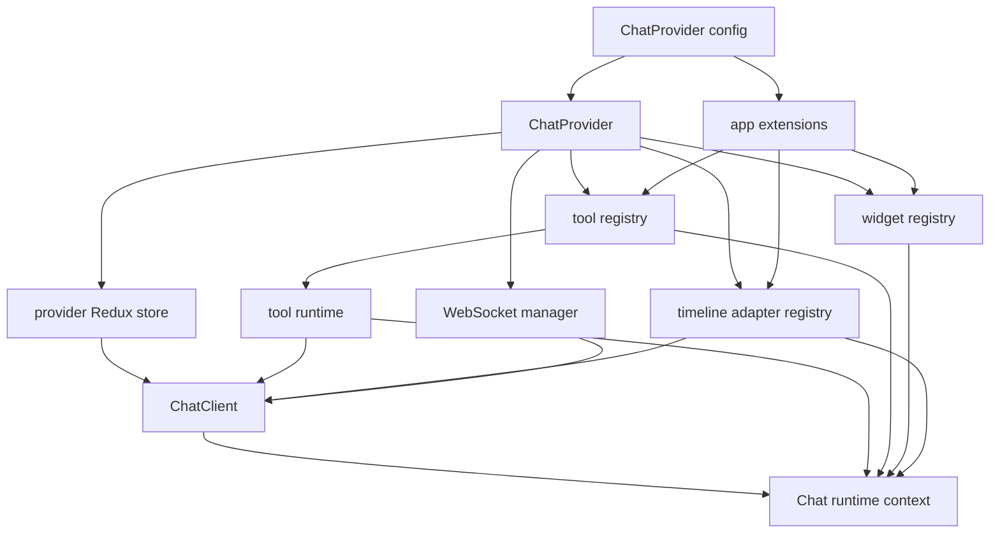
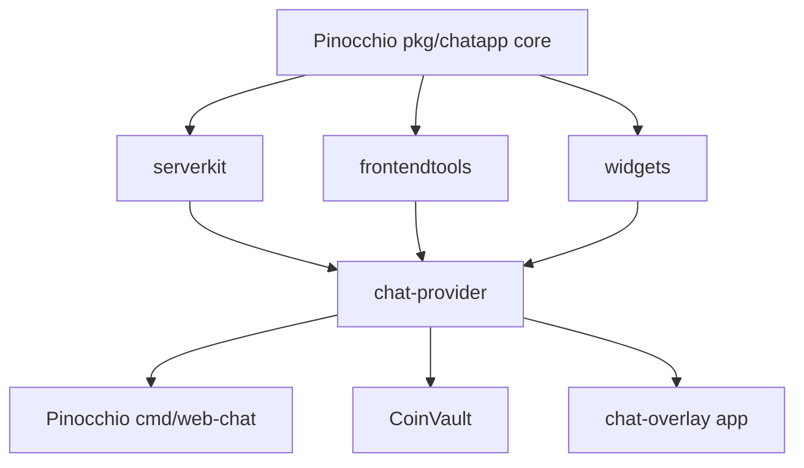

# Generic ChatProvider: From Overlay Runtime to Provider-Backed Web Chat

This article explains the process of turning a chat overlay runtime into a generic `ChatProvider` framework and then making Pinocchio `cmd/web-chat` use that framework as its production chat runtime. It is written as a technical narrative rather than a changelog. The goal is to make the system understandable to a reader who did not participate in the migration but now needs to modify it, reuse it, or judge whether another application should adopt it.

The work started with a concrete application problem. There were multiple chat frontends speaking similar sessionstream protocols, but each frontend owned its own transport loop, session persistence, message submission flow, timeline projection logic, and tool/widget glue. The chat overlay had a provider-like React wrapper, Pinocchio web-chat had a full-page application with profile selection and custom cards, and CoinVault had its own domain-specific UI and parser. The systems were similar enough to duplicate bugs, but different enough that replacing one UI with another would have been the wrong abstraction.

The final design separates runtime mechanics from application UI. `@go-go-golems/chat-provider` owns session creation, WebSocket connection, snapshot hydration, live event projection, provider-scoped registries, frontend tool execution, widget registration, and client commands. Pinocchio web-chat owns profiles, app route modes, cards, status bars, export controls, theme parts, debug UI, and Pinocchio-specific timeline adapters. The backend owns sessionstream commands/events, durable projections, runtime composition, and profile resolution.

> [!summary]
> - The reusable abstraction is not a chat widget. It is a headless provider runtime that knows how to speak the sessionstream chat protocol and expose state/actions to React.
> - Pinocchio web-chat became provider-backed by moving protocol mechanics into `@go-go-golems/chat-provider` while keeping the full-page app shell, profile policy, renderers, and cards in Pinocchio.
> - The most important architectural correction was the timeline adapter API. Live projection and snapshot hydration are now registered together so an entity that renders correctly while streaming also renders correctly after reload.
> - Legacy deletion was evidence-driven: deterministic mock profiles, Playwright parity smokes, hydration reload tests, unit tests, and focused Go tests came before deleting the old Redux/WebSocket runtime.
> - The resulting framework can be reused by other apps through request-body adapters, provider-scoped extensions, tool/widget registries, and application-owned timeline adapters.

## 1. The problem that forced a provider

The original chat overlay had a useful runtime shape. It could create a session, open a WebSocket, receive snapshot and live frames, maintain a Redux store, register browser tools, submit frontend tool results, and display a compact overlay UI. The name `ChatOverlayProvider` suggested a reusable React mechanism, but the implementation was still tied to one visual product. It assumed a singleton store, a fixed local-storage key, a fixed overlay root, overlay-specific state, and ecommerce/demo-oriented UI pieces.

Pinocchio web-chat had the opposite problem. It was a full application rather than an embeddable overlay. It had profile selection, app status bars, export controls, stream debugging, custom renderers, typed cards, sticky timeline behavior, and a backend with runtime composition. It also owned its own Redux timeline slice, WebSocket manager, snapshot mapper, UI-event projector, and protocol helpers. Much of that mechanics overlapped with the overlay. The duplicated code was not harmless. If snapshot hydration changed in one place, another frontend could continue using the old mapping. If WebSocket subscribe behavior changed, multiple managers had to be audited.

CoinVault added a third shape. It had domain UI and protobuf-specific decoding that should remain app-owned, but it still needed the same low-level sessionstream WebSocket URL construction and eventually the same connection lifecycle rules. CoinVault made the boundary more obvious: the generic layer must not assume that every app renders a plain chat timeline, but it can still own stable protocol mechanics.

The correct abstraction emerged from these constraints:

- A generic provider should own repeatable chat runtime mechanics.
- Applications should own domain policy, domain rendering, profile selection, and product layout.
- The provider should be usable without importing any Pinocchio web-chat UI.
- Pinocchio web-chat should be able to use the provider without becoming the overlay UI.
- CoinVault should be able to adopt protocol pieces gradually without giving up its domain parser.

The decision was therefore to extract a headless package, `@go-go-golems/chat-provider`, and then build app-specific shells on top of it.

## 2. The stable protocol underneath all the frontends

The shared foundation is the sessionstream chat protocol. Visual differences between a bubble overlay, a full-page web-chat, and a dashboard chat panel matter less than the fact that they all perform the same runtime sequence.

```text
Create or reuse a session
  -> connect to /api/chat/ws
  -> subscribe to the session
  -> receive a snapshot
  -> buffer live frames until hydration is safe
  -> project snapshot entities into local timeline state
  -> project live UI events into local timeline state
  -> submit user messages through /api/chat/sessions/{id}/messages
  -> optionally submit frontend tool manifests and results
```

This sequence is the provider's domain. It is specific enough to be useful and general enough to be reused. It does not say what the timeline looks like. It does not say whether the app has a profile selector. It does not say whether a tool call should render as a compact status pill or a large card. It only defines how the browser runtime connects to a sessionstream-backed chat backend.

The backend contract that the provider expects is small:

```text
POST /api/chat/sessions
GET  /api/chat/sessions/{sessionId}
POST /api/chat/sessions/{sessionId}/messages
POST /api/chat/sessions/{sessionId}/tools/manifest
POST /api/chat/sessions/{sessionId}/tools/results
WS   /api/chat/ws
```

Pinocchio's Go command mounts these routes in `cmd/web-chat/main.go` and delegates session behavior to `cmd/web-chat/app.Server`. The frontend provider does not need to know how Pinocchio resolves profiles, which Geppetto engine is selected, where durable timeline state is stored, or how export endpoints work. It only needs the stable protocol routes and the frame shapes returned by the WebSocket and snapshot endpoint.

The provider's public client API reflects that division:

```ts
export type ChatClient = {
  connect: () => Promise<void>;
  send: (prompt: string) => Promise<void>;
  stop: () => Promise<void>;
  open: () => void;
  close: () => void;
  toggle: () => void;
  reset: () => void;
  getStore: () => ChatStore;
  tools: ChatClientTools;
};
```

The actions are runtime operations. They are not UI operations. A full-page app may call `send` from a composer button. An overlay may call `open` from a floating button. A test harness may call `connect` directly. The same client can serve all of those callers because it does not encode the visual form.

## 3. Why the provider must be headless

A provider that renders the application is not reusable in the right way. It can be reused only by applications that accept its layout, its cards, its states, and its styling. That was never the goal. Pinocchio web-chat was not supposed to become the ecommerce overlay. CoinVault was not supposed to become Pinocchio web-chat. The goal was to share the runtime mechanics that every sessionstream chat client needs while letting each application own the UI and domain policy.

The headless provider owns these responsibilities:

- It creates a provider-scoped Redux store.
- It creates provider-scoped registries for tools, widgets, and timeline adapters.
- It persists or restores the session id through configurable session persistence.
- It creates a session if no session exists.
- It connects the WebSocket and subscribes to the session.
- It applies snapshots and live events into provider state.
- It synchronizes frontend tool manifests with the backend.
- It submits frontend tool results.
- It exposes runtime state and commands through React context and hooks.

The application owns these responsibilities:

- It chooses the selected profile and registry.
- It decides which request body fields accompany session creation and message submission.
- It decides how timeline entities render.
- It defines cards, markdown rendering, export menus, status bars, and composer layout.
- It registers application-specific timeline adapters.
- It defines CSS tokens and public `data-part` selectors.
- It decides which debug surfaces are reachable.

This line is visible in Pinocchio's provider shell:

```tsx
const config = useMemo(
  () => ({
    basePrefix,
    sessionIdParam: 'sessionId',
    sessionStorageKey: 'pinocchio.web-chat.sessionId',
    onSessionIdChange: setSessionIdInLocation,
    onDebugEvent: recordProviderDebugEvent,
    extensions: [pinocchioWebChatTimelineAdapters],
    createSessionBody: () => ({ profile: selectedProfile }),
    sendMessageBody: ({ prompt }: { prompt: string }) => ({ prompt, profile: selectedProfile }),
  }),
  [basePrefix, selectedProfile],
);

return (
  <ChatProvider config={config}>
    <WebChatApp
      selectedProfile={selectedProfile}
      profileOptions={profileOptions}
      profileTitle={headerTitle}
      onProfileChange={onProfileChange}
    />
  </ChatProvider>
);
```

`ChatProvider` receives runtime configuration. `WebChatApp` receives product UI state. The provider does not know that the title says `Web Chat`. It does not know that Pinocchio has an export menu. It only knows how to run the chat session.

## 4. How `ChatProvider` is constructed

The provider is a React component, but the important work happens in runtime construction. Every provider instance creates its own runtime objects. This is the difference between a reusable provider and a singleton helper hidden behind React context.

```tsx
export function ChatProvider({ children, config }: ChatProviderProps) {
  const runtime = useMemo(() => {
    const store = createChatStore();
    const toolRegistry = createToolRegistry();
    const widgetRegistry = createWidgetRegistry();
    const adapterRegistry = createTimelineAdapterRegistry();
    for (const adapter of coreTimelineAdapters) adapterRegistry.register(adapter);

    const toolRuntime = createToolRuntime({ ... });
    const client = createChatClient({
      config,
      store,
      toolRegistry,
      toolRuntime,
      adapterRegistry,
      wsManager: createWsManager(),
    });

    installChatExtensions(
      { client, tools: toolRegistry, widgets: widgetRegistry, timelineAdapters: adapterRegistry },
      normalizeChatExtensions(config),
    );

    return { store, context };
  }, [config]);

  return (
    <Provider store={runtime.store}>
      <ChatRuntimeContext.Provider value={runtime.context}>
        {children}
      </ChatRuntimeContext.Provider>
    </Provider>
  );
}
```

Several decisions are encoded in this construction sequence.

First, the store is instance-scoped. Two mounted providers do not share timeline state unless an app deliberately wires them to the same runtime. This matters for tests, multi-chat pages, embedded widgets, and Storybook scenarios.

Second, core timeline adapters are registered before application extensions. Built-in chat concepts such as messages, frontend tools, widgets, and run status exist in every provider runtime. Application extensions can add domain-specific adapters without reimplementing those core mappings.

Third, extensions install before the WebSocket connect path runs. This ordering prevents a snapshot from arriving before application adapters exist. That ordering became essential after the hydration bug described later in this article.

Fourth, tools and widgets are provider-scoped. A browser tool registered in one provider instance does not silently appear in another provider instance. That is required if the provider is going to be safe in pages with more than one chat runtime.

The runtime construction can be summarized as a dependency graph:



A future app that wants to use the provider should start by deciding which parts of this graph it needs to customize. Most apps need only request-body adapters and timeline adapters. Apps with browser-executed tools also register tools. Apps with backend-driven widgets register widget renderers.

## 5. The client command path

`createChatClient` is the imperative runtime API behind the React provider. Its job is to implement the sessionstream command path correctly every time, so individual applications do not have to copy it.

The `send` path is the most important operation:

```ts
async send(prompt: string) {
  dispatch(overlaySlice.actions.setError(null));
  const sessionId = await ensureSession();
  await ensureConnection(sessionId);
  await syncToolManifest();
  const sendBody = await (config.sendMessageBody?.({ prompt }) ?? { prompt });
  const res = await fetch(`${apiBase}/api/chat/sessions/${encodeURIComponent(sessionId)}/messages`, {
    method: 'POST',
    headers: { 'Content-Type': 'application/json' },
    body: JSON.stringify(sendBody ?? { prompt }),
  });
  if (!res.ok) dispatch(overlaySlice.actions.setError(await res.text()));
}
```

The sequence matters. A user action starts as a prompt string, but a prompt is not enough. The runtime must have a session. The session must have a WebSocket subscription if live updates are expected. Frontend tools must be synchronized before the backend tries to call one. Only then should the prompt be submitted.

The provider lets the application customize the request body without customizing the sequence. Pinocchio uses this hook to send the selected profile:

```ts
createSessionBody: () => ({ profile: selectedProfile }),
sendMessageBody: ({ prompt }) => ({ prompt, profile: selectedProfile }),
```

CoinVault can use the same hook shape for its own profile fields:

```ts
createSessionBody: () => ({
  application_profile: applicationProfile,
  profile: inferenceProfile,
  registry,
}),
sendMessageBody: ({ prompt }) => ({
  prompt,
  application_profile: applicationProfile,
  profile: inferenceProfile,
  registry,
}),
```

The key point is that app-specific request fields are data, not control flow. The provider controls the protocol sequence. The app supplies the request content that expresses app policy.

## 6. Backend mechanics moved before frontend abstraction could stabilize

The provider migration depended on backend cleanup. If the frontend provider had to import overlay-owned backend assumptions, the package would not be generic. The backend mechanics were moved into Pinocchio core packages so chat-overlay could consume Pinocchio primitives rather than duplicate them.

The important packages are:

| Package | Location | Responsibility |
|---|---|---|
| `serverkit` | `pinocchio/pkg/chatapp/serverkit` | Shared HTTP request/response contracts, JSON helpers, snapshot encoding, turn-store opening helpers. |
| `frontendtools` | `pinocchio/pkg/chatapp/frontendtools` | Frontend tool manifest/result commands, manager installation, plugin integration. |
| `widgets` | `pinocchio/pkg/chatapp/widgets` | Typed widget plugin support and widget lifecycle projection. |

This extraction gave the system a better dependency direction:



The dependency direction matters because shared backend mechanics should be stable substrate, not demo application code. The provider package can depend on the protocol and tool/widget concepts without depending on a particular visual application. Pinocchio web-chat can then use the same substrate as the overlay and CoinVault.

## 7. Why Pinocchio web-chat could not simply wrap the old component

One tempting migration would have been to place the old `ChatWidget` inside `ChatProvider` and gradually redirect calls. That would have preserved too much of the old architecture. The old web-chat component had its own Redux timeline store, its own WebSocket manager, its own snapshot mapper, its own UI-event projector, and its own runtime status state. The provider also had a store, WebSocket manager, snapshot hydrator, and runtime status state. Wrapping one runtime in another would make two sources of truth.

The migration therefore treated Pinocchio web-chat as a shell and renderer owner, not as a runtime owner. The production path became:

```text
src/main.tsx
  -> App
  -> MainWebChatRoot
  -> app-local Redux Provider for profile state
  -> WebChatProviderShell
  -> ChatProvider
  -> WebChatApp
  -> ChatTimeline
  -> app-owned card renderers
```

The remaining app-local Redux store is intentionally small. It stores app state such as selected profile and RTK Query profile API cache. It does not own the provider timeline. This is an important distinction for maintainers. Seeing `src/store` in Pinocchio web-chat does not mean the old timeline runtime still exists. Provider state lives inside `ChatProvider`. App profile state lives outside it.

The old component could be deleted only after the provider-backed path had feature parity. That parity included session persistence, profile selection, message sending, run status, backend tool rendering, agent-mode rendering, snapshot hydration, export menu behavior, and debug route behavior.

## 8. Provider-scoped extensions

A generic provider needs extension points that do not rely on import side effects. Early versions of the system had global registries for tools, widgets, and renderers. Global registries are simple until a test mounts two providers, a story renders multiple variants, or an application needs one chat instance with a tool and another without it. Then global mutation becomes a correctness problem.

The provider extension API installs behavior into the provider instance:

```ts
defineChatExtensions({
  name: 'pinocchio.web-chat.timeline-adapters',
  timelineAdapters: [
    pinocchioReasoningAdapter,
    pinocchioAgentModeAdapter,
    pinocchioBackendToolAdapter,
  ],
});
```

The extension can register:

- timeline adapters,
- frontend or human tools,
- widget renderers,
- custom install logic.

The implementation detail to remember is that extensions receive provider-scoped registries. They do not import a global `defaultToolRegistry` and mutate it. That is why `ChatProvider` constructs registries first, creates the client, then calls `installChatExtensions` with those registries.

This pattern also changed Pinocchio web-chat's app UI. Global renderer registration was removed and replaced with explicit renderer creation:

```ts
const mergedRenderers: ChatWidgetRenderers = useMemo(
  () =>
    createWebChatRenderers({
      overrides: {
        ...renderers,
        tool_call: ProviderToolCallRenderer,
        widget: ProviderWidgetRenderer,
      },
    }),
  [renderers],
);
```

Runtime extension state and UI renderer state now follow the same rule: configuration belongs to the instance that uses it.

## 9. Timeline projection: the first version was not enough

When live events arrive over the WebSocket, they are not yet React render entities. They are canonical sessionstream frames with event names and payloads. Something must decide how to turn a `ChatReasoningPatch` into a thinking message or a `ChatToolResultReady` into a tool-result card.

The first provider extension model used live projectors. Pinocchio registered projectors for reasoning, agent mode, and backend tools. That worked while the session was live. The bug appeared after reload.

The old split looked like this:

```text
Live WebSocket frame
  -> app live projector
  -> provider timeline entity
  -> app renderer

Snapshot entity after reload
  -> provider hardcoded snapshot mapper
  -> generic provider timeline entity or fallback
  -> app renderer or generic JSON card
```

The live path was extensible. The hydration path was not. Pinocchio-specific durable entity kinds such as `AgentMode`, `ChatToolCall`, and `ChatToolResult` could bypass the app-specific renderer after reload because provider core did not know what they meant. The rendered symptom was raw protobuf `Any` JSON with an `@type` field instead of a proper card.

This failure was not a missing `if` statement. It was a bad API shape. The API allowed app code to define live behavior without making a hydration decision. A future entity could repeat the same mistake.

The fix was the unified timeline adapter API.

## 10. Timeline adapters: one concept, two projection paths

A timeline adapter is a named projection unit. It can project live frames, snapshot entities, or both. If it has live behavior but no hydration behavior, it must explicitly say why hydration is unsupported.

The core type is:

```ts
export type TimelineAdapter = {
  name: string;
  priority?: number;
  live?: {
    accepts: (frame: CanonicalFrame) => boolean;
    project: (frame: CanonicalFrame, context: LiveProjectionContext) => TimelineMutation | null;
  };
  hydrate: HydrationPolicy;
};

export type HydrationPolicy =
  | {
      kind: 'supported';
      project: (entity: SnapshotEntityFrame, context: SnapshotProjectionContext) =>
        TimelineMutation | TimelineEntity | null;
    }
  | {
      kind: 'not-supported';
      reason: string;
    };
```

Factory helpers make intent explicit:

```ts
defineLiveAndHydrateAdapter({ ... });
defineLiveOnlyAdapter({ hydrationUnsupportedReason: '...' });
defineHydrateOnlyAdapter({ ... });
```

The registry validates adapter names, duplicate registration, hydration policy presence, live projection shape, and unsupported hydration reasons. It returns projection results with the adapter name so debugging can identify which adapter handled a frame.

This API changed the review question. Before adapters, reviewers had to remember to ask, "Did you also update snapshot hydration?" After adapters, the code itself asks that question. A live-only adapter must include a reason:

```ts
export const pinocchioReasoningAdapter = defineLiveOnlyAdapter({
  name: 'pinocchio.reasoning',
  priority: -10,
  hydrationUnsupportedReason:
    'Reasoning snapshots are durable ChatMessage entities with role=thinking and hydrate through chat-provider.message.',
  live: { ... },
});
```

The reason is not documentation decoration. It is part of the contract. It tells the next implementer that reasoning live events are transient patches, while durable reasoning state is stored as a `ChatMessage` with `role=thinking` and handled by the generic message adapter.

## 11. Built-in provider adapters and Pinocchio adapters

The provider core owns generic chat concepts:

| Adapter | Responsibility |
|---|---|
| `chat-provider.run-status` | Project run lifecycle status from live events. |
| `chat-provider.message` | Project user, assistant, and durable message entities. |
| `chat-provider.widget` | Project widget lifecycle events and durable widget instances. |
| `chat-provider.frontend-tool` | Project frontend tool requests/results. |
| `chat-provider.unknown-snapshot` | Preserve unknown durable entities as fallback renderable data. |

Pinocchio web-chat owns Pinocchio concepts:

| Adapter | Responsibility |
|---|---|
| `pinocchio.reasoning` | Project live reasoning patches into thinking messages. Hydration delegates to generic message hydration. |
| `pinocchio.agent-mode` | Project live and durable agent-mode events/entities into `agent_mode` or `agent_mode_preview` render entities. |
| `pinocchio.backend-tools` | Project live and durable backend tool calls/results into `tool_call` and `tool_result` render entities. |

The Pinocchio adapter file is deliberately application-owned:

```text
pinocchio/cmd/web-chat/web/src/features/web-chat/extensions/pinocchio-timeline-adapters/pinocchioTimelineAdapters.ts
```

The provider should not know what `financial_analyst` or `mock_reviewer` means. It should not know that a Pinocchio backend tool card wants both `inputRaw` and parsed `input`. It should not know that agent-mode preview cards have a synthetic id based on `messageId`. Those are app renderer contracts. The provider only supplies the mechanism for registering the adapter and applying its mutation.

The adapter output is intentionally simple:

```ts
function toolCallEntity(id: string, props: Record<string, unknown>) {
  return { id, kind: 'tool_call', createdAt: now(), updatedAt: now(), props };
}

function toolResultEntity(id: string, props: Record<string, unknown>) {
  return { id, kind: 'tool_result', createdAt: now(), updatedAt: now(), props };
}
```

The app renderer sees `kind: 'tool_call'` or `kind: 'tool_result'` and renders the appropriate card. The backend can emit canonical events and durable entities. The adapter translates between those layers.

## 12. Snapshot hydration as a first-class behavior

Hydration is the operation that reconstructs provider timeline state from the backend's durable snapshot. It is not an optimization. It is a correctness path. A chat session should render the same conceptual timeline before and after reload.

The adapter-backed hydration path is:

```text
GET /api/chat/sessions/{sessionId}
  -> snapshot entities
  -> normalize snapshot entity frame
  -> adapterRegistry.projectSnapshot(entity, context)
  -> timeline mutation
  -> provider timeline slice
  -> app renderers
```

The live path is:

```text
WebSocket canonical frame
  -> adapterRegistry.projectLive(frame, context)
  -> timeline mutation
  -> provider timeline slice
  -> app renderers
```

The same adapter registry handles both paths. This does not mean the code for live and hydration must be identical. Live events and durable entities are often shaped differently. It means that the decision about both paths lives in the same registered concept.

For `pinocchio.agent-mode`, live projection handles preview updates, commits, and preview clears. Hydration handles durable `AgentMode` snapshot entities. For `pinocchio.backend-tools`, live projection handles `ChatToolCallStarted`, `ChatToolArgumentsPatch`, `ChatToolExecutionStarted`, `ChatToolCallFinished`, and `ChatToolResultReady`. Hydration handles durable `ChatToolCall` and `ChatToolResult` entities.

The resulting invariant is precise:

> If an app-owned concept renders in the live timeline and can appear in a durable snapshot, the app must register a hydration-capable adapter for it.

That invariant is the reason the old projectors were deleted instead of kept as compatibility aliases.

## 13. The Pinocchio backend side of the system

The Go backend for `cmd/web-chat` is a command that serves the React SPA and exposes chat APIs. Its current architecture can be read in four layers.

```text
cmd/web-chat/main.go
  -> CLI flags, profile bootstrap, static UI mounting, HTTP mux composition

cmd/web-chat/app
  -> app.Server, sessionstream hub, WebSocket transport, snapshots, exports, frontend tools, debug routes

cmd/web-chat/profiles
  -> profile API, current-profile cookie route, request resolver, conversation plan construction

cmd/web-chat/mockruntime
  -> deterministic Geppetto-compatible runtime for parity tests
```

The app server creates the sessionstream runtime:

```go
reg := sessionstream.NewSchemaRegistry()
chatapp.RegisterSchemas(reg, s.chatPlugins...)
store := newHydrationStore(s, reg)
ws := wstransport.NewServer(provider, wsOptions...)
engine := chatapp.NewEngine(chatapp.WithPlugins(s.chatPlugins...), chatapp.WithTurnStore(s.turnStore))
hub := sessionstream.NewHub(
    sessionstream.WithSchemaRegistry(reg),
    sessionstream.WithHydrationStore(store),
    sessionstream.WithUIFanout(ws),
)
chatapp.Install(hub, engine)
frontendToolManager.Install(hub)
service := chatapp.NewService(hub, engine)
```

The server handlers are conventional HTTP handlers. Session creation returns a new UUID. Message submission validates the prompt, resolves a runtime if a resolver is configured, and submits a `chatapp.PromptRequest` to the service.

```go
func (s *Server) handleSubmitMessage(w http.ResponseWriter, r *http.Request, sid sessionstream.SessionId) {
    var in SubmitMessageRequest
    DecodeJSON(r, &in)
    if strings.TrimSpace(in.Prompt) == "" { return 400 }

    var runtime *infruntime.ComposedRuntime
    if s.runtimeResolver != nil {
        runtime = s.runtimeResolver.Resolve(r.Context(), r, string(sid), in.Profile, in.Registry)
    }

    s.service.SubmitPromptRequest(r.Context(), sid, chatapp.PromptRequest{
        Prompt: in.Prompt,
        IdempotencyKey: in.IdempotencyKey,
        Runtime: runtime,
    })
}
```

The frontend provider does not need to know this implementation. It only needs the route and response behavior. The Go side remains responsible for runtime composition and canonical event emission.

## 14. Profile selection and request adapters

Pinocchio profiles are app policy. A profile decides which runtime, model settings, system prompt, middlewares, and tools should be used for a request. The provider should not know that policy. It should only provide hooks for request-body customization.

The web-chat shell reads current profile state from two places:

- app-local Redux state,
- backend profile API responses.

It resolves a selected profile, updates the current-profile cookie through the backend, and then supplies that profile to `ChatProvider` request adapters.

```ts
createSessionBody: () => ({ profile: selectedProfile }),
sendMessageBody: ({ prompt }) => ({ prompt, profile: selectedProfile }),
```

The Go runtime resolver then receives the profile from the request body:

```go
func (r *canonicalRuntimeResolver) Resolve(
    ctx context.Context,
    req *http.Request,
    sessionID string,
    profile string,
    registry string,
) (*infruntime.ComposedRuntime, error) {
    if profiles.IsMockParityProfile(profile) {
        composed := mockruntime.NewComposedRuntime(...)
        return &composed, nil
    }

    profileSlug := r.requestResolver.ResolveProfileSelection(ctx, "", profile, "", "")
    registrySlug := r.requestResolver.ResolveRegistrySelection(registry, "", "")
    resolvedProfile := r.requestResolver.ResolveEffectiveProfile(ctx, registrySlug, profileSlug)
    plan := r.requestResolver.BuildConversationPlan(ctx, sessionID, "", "", resolvedProfile)
    composed := r.runtimeComposer.Compose(ctx, infruntime.ConversationRuntimeRequest{ ... })
    return &composed, nil
}
```

This is a clean cross-language contract. The browser says which profile the user selected. The Go server decides what that profile means. The provider transports the request body but does not interpret profile semantics.

## 15. Frontend tools and widgets

Frontend tools are browser-executed or human-mediated capabilities that the backend can request. Widgets are backend-driven UI instances that the frontend renders. Both features need shared mechanics and app-owned presentation.

The provider owns the frontend tool runtime:

- tool registration,
- manifest generation,
- manifest synchronization,
- active tool execution,
- result submission,
- cancellation on reset or stop.

The backend owns frontend tool commands through `frontendtools`:

- `FrontendToolManifestCommand`,
- `FrontendToolResultCommand`,
- frontend tool manager installation into the sessionstream hub.

The browser sends its manifest to:

```text
POST /api/chat/sessions/{sessionId}/tools/manifest
```

and submits results to:

```text
POST /api/chat/sessions/{sessionId}/tools/results
```

A tool request then appears in provider state as a timeline entity. If it is a frontend/human tool, Pinocchio's renderer sends it to `ToolCallOutlet`, which is provider-owned and can render the registered tool UI. If it is a backend tool history item, Pinocchio renders it as an app-owned `ToolCallCard`.

That distinction fixed an important rendering bug. Backend tool call entities were initially being routed through `ToolCallOutlet`, but `ToolCallOutlet` is for browser-executed frontend tools. Backend tool history should render as part of the app timeline. The final renderer makes that decision from entity props:

```tsx
export function ProviderToolCallRenderer({ e }: { e: RenderEntity }) {
  const mode = String(e.props?.mode ?? '');
  const isFrontendTool = mode.includes('FRONTEND');

  if (!isFrontendTool) {
    return <ToolCallCard e={e} />;
  }

  return <ToolCallOutlet ... />;
}
```

The underlying rule is simple: the provider owns frontend tool execution mechanics; the application owns backend tool history presentation.

## 16. The mock profile as a test runtime

A generic provider migration needs tests that do not depend on a live LLM. The project added a deterministic `mock_parity` profile and runtime. This was not a demo shortcut. It was a test instrument.

The mock runtime emits a known sequence:

1. provider call started,
2. reasoning segment started,
3. reasoning deltas,
4. reasoning segment finished,
5. backend tool call started,
6. tool arguments patch,
7. tool execution started,
8. tool result ready,
9. tool call finished,
10. agent-mode switch,
11. assistant text segment start/deltas/finish,
12. provider call finished.

That sequence covers the risky surface area:

| Event category | Why it was included |
|---|---|
| Reasoning patches | Proves live thinking-message projection works. |
| Backend tool call lifecycle | Proves backend tool cards render and update. |
| Tool result | Proves result cards render and hydrate. |
| Agent mode | Proves Pinocchio-specific durable entity hydration. |
| Assistant text | Proves normal chat messages still work. |

The profile is selected explicitly by slug. Prompt text such as `/mock` does not activate it. That matters because tests should be deterministic through profile selection, not hidden prompt parsing.

The mock profile enabled two browser smokes:

- a live parity smoke that verifies reasoning, backend tools, agent mode, and assistant text render during a live run,
- a hydration smoke that reloads the session and verifies durable `AgentMode`, `ChatToolCall`, and `ChatToolResult` entities hydrate into app cards rather than raw protobuf JSON.

The second smoke is the more important one. Live rendering proves that WebSocket event projection works. Reload rendering proves that durable session state can reconstruct the same conceptual UI.

## 17. How legacy deletion became safe

The old Pinocchio frontend runtime was deleted only after the provider path passed targeted parity. The deleted code included:

- `src/webchat/ChatWidget.tsx`,
- `src/webchat/ProviderBackedChatWidget.tsx`,
- `src/ws/wsManager.ts`,
- `src/ws/timelineEvents.ts`,
- `src/ws/timelineSnapshot.ts`,
- legacy WebSocket/timeline tests,
- `src/store/timelineSlice.ts`,
- `src/store/errorsSlice.ts`,
- provider multi-demo wrappers,
- old `src/chat/provider` compatibility exports.

The deletion is an architectural event. It changed the question from "Which runtime is active?" to "How does the provider-backed runtime work?" A codebase with two chat runtimes asks every maintainer to keep both in mind. A codebase with one production runtime lets tests and docs point in one direction.

Several files remained intentionally:

- `src/ws/protocol.ts` became a thin re-export of provider protocol helpers because debug UI and diagnostics still use the same sessionstream frame helpers.
- `src/ws/streamDebug.ts` remained for provider-backed diagnostics.
- `src/store/profileApi.ts` and `src/store/appSlice.ts` remained because profile selection is app state, not provider timeline state.
- app-owned cards and renderers remained because the provider is headless.

A safe deletion sequence looks like this:

```text
1. Introduce provider-backed runtime behind a route or shell.
2. Add request-body adapters for app profile policy.
3. Add app-owned timeline adapters for domain entities.
4. Add deterministic mock runtime covering risky event kinds.
5. Add live browser parity smoke.
6. Add reload hydration smoke.
7. Delete demo-only provider routes.
8. Delete legacy runtime files.
9. Run typecheck, unit tests, build, Storybook build, Go tests, and browser smokes.
```

The order matters. Deleting first and testing later would have made the hydration bug harder to isolate.

## 18. The web-chat application after the migration

Pinocchio web-chat is now structured as an application shell over a provider runtime.

```text
cmd/web-chat/web/src/
  app/
    App.tsx
    MainWebChatRoot.tsx
    DebugUiRoot.tsx
    routeMode.ts
  features/web-chat/
    WebChatProviderShell/
    WebChatApp/
    ChatHeader/
    ChatStatusbar/
    ChatComposer/
    ChatTimeline/
    cards/
    extensions/pinocchio-timeline-adapters/
    provider-support/
    styles/
  debug-ui/
  generated/
  store/
  webchat/
  ws/
```

The structure is not perfect. A later cleanup ticket notes that `src/webchat` still contains support modules and compatibility-style exports even though the production feature lives under `features/web-chat`. That is a remaining organization issue, not a runtime ambiguity. The runtime ambiguity is gone.

The production app path is:

```text
main.tsx
  -> ErrorBoundary
  -> App
  -> routeModeFromLocation
  -> MainWebChatRoot
  -> Redux Provider for app-local profile state
  -> WebChatProviderShell
  -> ChatProvider
  -> WebChatApp
```

The debug UI path is selected explicitly by `?debug=1` and has its own store. Removed provider demo flags such as `providerDemo=1` and `providerMultiDemo=1` now fall back to normal chat.

The UI owns its renderer factory:

```ts
const defaultRenderers = {
  message: MessageCard,
  tool_call: ToolCallCard,
  ChatFrontendToolCall: ToolCallCard,
  tool_result: ToolResultCard,
  log: LogCard,
  agent_mode: AgentModeCard,
  agent_mode_preview: AgentModeCard,
  ChatWidgetInstance: WidgetInstanceCard,
  widget_instance: WidgetInstanceCard,
};

export function createWebChatRenderers(config = {}) {
  return {
    ...defaultRenderers,
    ...(config.overrides ?? {}),
    default: config.overrides?.default ?? GenericCard,
  };
}
```

The provider supplies timeline entities. The app decides how each `kind` renders.

## 19. CSS, Storybook, and generated code cleanup

Once the runtime was correct, the frontend still needed to be legible as an example application. The cleanup therefore continued through Storybook, styles, debug UI, generated code, and package-management ownership.

Styles moved under the feature boundary:

```text
src/features/web-chat/styles/
  index.css
  themes/default.css
  root.css
  layout.css
  header.css
  statusbar.css
  timeline.css
  cards.css
  composer.css
  debug-panel.css
  README.md
```

The style contract is based on `[data-pwchat]`, `data-theme`, and public `data-part` values. Inline production styles were moved into scoped CSS. This makes the example easier to copy because theming is visible as CSS variables and parts rather than hidden in component bodies.

Storybook stories were colocated with components. This matters because the app is now an example project. A new engineer can inspect `MessageCard`, `ToolCallCard`, `AgentModeCard`, `ChatTimeline`, `ChatHeader`, and debug UI lanes without running a full backend.

Generated TypeScript protobuf bindings moved under `src/generated/chatapp`, and the README states they should not be hand-edited. The web frontend now uses npm as the canonical package manager, with `package-lock.json` as the lockfile. `pnpm-lock.yaml` was removed from the web-chat frontend to avoid mixed package-management signals.

These changes do not change the runtime algorithm. They change maintainability. An example application teaches through structure as much as through code.

## 20. How to use `ChatProvider` in another application

A new application should adopt the provider in layers. The first decision is whether the app can use the provider's timeline entity model directly. If it can, use `ChatProvider` at the top of the chat surface. If it has an existing domain parser like CoinVault, start with protocol helpers and migrate runtime pieces only when the provider extension points match the app's needs.

For a normal provider-backed app, the minimal shape is:

```tsx
import { ChatProvider } from '@go-go-golems/chat-provider';

function MyChatRoot() {
  const config = useMemo(() => ({
    basePrefix: '',
    sessionIdParam: 'sessionId',
    sessionStorageKey: 'my-app.sessionId',
    createSessionBody: () => ({ profile: selectedProfile }),
    sendMessageBody: ({ prompt }) => ({ prompt, profile: selectedProfile }),
    extensions: [myTimelineAdapters, myTools, myWidgets],
  }), [selectedProfile]);

  return (
    <ChatProvider config={config}>
      <MyChatShell />
    </ChatProvider>
  );
}
```

Inside `MyChatShell`, use provider hooks and selectors:

```tsx
function MyChatShell() {
  const client = useChatClient();
  const overlay = useChatProviderSelector(selectOverlay);
  const entities = useChatProviderSelector(selectTimelineEntities);

  return (
    <div>
      <Timeline entities={entities} />
      <Composer
        disabled={overlay.runStatus === 'streaming'}
        onSubmit={(prompt) => void client.send(prompt)}
      />
    </div>
  );
}
```

Then add adapters only for concepts that are not covered by the provider core:

```ts
export const myDomainAdapter = defineLiveAndHydrateAdapter({
  name: 'my-app.domain-event',
  live: {
    accepts: (frame) => asString(frame.name) === 'MyDomainEvent',
    project(frame) {
      const payload = asRecord(frame.payload);
      return {
        upsert: {
          id: asString(payload.id),
          kind: 'my_domain_card',
          createdAt: Date.now(),
          props: payload,
        },
      };
    },
  },
  hydrate: {
    kind: 'supported',
    project(entity) {
      if (asString(entity.kind) !== 'MyDomainEntity') return null;
      return {
        id: asString(entity.id),
        kind: 'my_domain_card',
        createdAt: Date.now(),
        props: asRecord(entity.payload),
      };
    },
  },
});
```

The app then registers a renderer for `my_domain_card`. The provider does not need to know what the card means.

## 21. How to decide what belongs in the provider

A useful rule is to ask whether the code changes when the product UI changes. If a function changes because a card layout changes, it does not belong in the provider. If it changes because the sessionstream protocol changes, it probably does.

Provider-owned code:

- WebSocket URL construction,
- subscribe-frame encoding,
- canonical frame parsing,
- snapshot-before-live ordering,
- timeline mutation application,
- frontend tool manifest synchronization,
- frontend tool result submission,
- widget registry mechanics,
- provider context/hook wiring,
- instance-scoped runtime creation.

App-owned code:

- profile and registry selection,
- domain-specific request fields,
- product layout,
- card components,
- export menus,
- debug route availability,
- theme tokens and visual parts,
- domain-specific live and hydration adapters,
- generated protobuf decoding when the app has a domain-specific parser.

Shared backend package code:

- reusable Go request/response DTOs,
- snapshot encoding helpers,
- frontend tool command definitions,
- widget plugin support,
- serverkit utilities that multiple chat backends need.

The boundary is not about file extensions. TypeScript can be provider-owned or app-owned. Go can be reusable backend substrate or app command code. The boundary is responsibility.

## 22. Failure modes the migration exposed

The migration exposed several failure modes worth preserving as engineering rules.

### Live-only projection creates reload bugs

If an event renders correctly while the WebSocket is connected but renders as raw JSON after reload, the app probably has live projection without hydration projection. The fix is not to patch the renderer. The fix is to add or correct the timeline adapter's hydration policy.

### Global registries create invisible coupling

If a tool, widget, renderer, or projector registers itself at import time, importing a test file can change another test. Provider instances should own registries. App components should build renderer maps explicitly.

### Demo routes become architecture if they are not deleted

The provider capability demo was useful while validating tools, widgets, and multiple providers. It became confusing once production tests existed. The project deleted it rather than polishing it. Temporary routes should have a deletion condition.

### Wrapping a legacy runtime can preserve two sources of truth

A provider migration should not leave old WebSocket and timeline slices active under a new provider. That path can work in a demo but fails as architecture. The migration should decide which runtime owns session state and then remove the other once parity is proven.

### Generated code needs an owner

Generated TypeScript protobuf files under `src/generated` are fine if a feature imports them. If no feature imports them, they create confusion. A generated directory should either have an active consumer or a clear statement that it is reserved for an imminent feature.

### Package managers are part of architecture

The web-chat frontend now uses npm and `package-lock.json`. The overlay and CoinVault use pnpm. Mixed lockfiles in one package create operational ambiguity. An example application should tell contributors exactly which package manager owns it.

## 23. The validation model

The provider migration used several kinds of validation because no single test type covers the whole system.

Unit tests covered pure behavior:

- route-mode parsing,
- profile API decoding,
- protocol helper behavior,
- stream debug helpers,
- renderer factory overrides,
- timeline adapter live/hydration projection,
- adapter registry validation.

Go tests covered backend behavior:

```bash
go test ./cmd/web-chat/mockruntime ./cmd/web-chat ./cmd/web-chat/app ./cmd/web-chat/profiles ./pkg/chatapp -count=1
```

Frontend integration checks covered project health:

```bash
npm run typecheck
npm test
npm run lint
npm run build
npm run build-storybook
npm run check:storybook
```

Browser smokes covered runtime behavior:

- provider-backed live chat using `mock_parity`,
- reload hydration parity for app-specific entities,
- debug route rendering through `?debug=1`,
- absence of raw protobuf `@type` JSON for known hydrated entities.

The important testing lesson is that reload must be tested whenever durable timeline entities exist. A live-only browser test can pass while snapshot hydration is broken.

## 24. How the design came to be

The project did not begin with the final adapter API. It progressed through smaller observations.

The first observation was duplication. Overlay, Pinocchio web-chat, and CoinVault all needed sessionstream protocol helpers. The first safe move was to share helpers such as `buildWebSocketURL`, `encodeSubscribeFrame`, and frame normalization. This created a real dependency on the provider package without forcing a UI migration.

The second observation was that `ChatOverlayProvider` had the right outer shape but the wrong coupling. It created a React runtime, but the runtime was singleton and overlay-specific. The response was to extract a provider package and make runtime objects instance-scoped.

The third observation was that Pinocchio web-chat should keep its UI. The provider would replace transport and runtime mechanics, not profile selection, cards, exports, or styles. This led to request-body adapters and app-owned renderers.

The fourth observation was that extensions needed provider scope. Tools, widgets, and app event projections could not live in global registries if multiple provider instances were possible.

The fifth observation was the hydration bug. Agent-mode cards rendered while live and fell back to raw JSON after reload. That bug forced a stronger API. Live projection and hydration had to be registered together. Timeline adapters replaced live-only projectors.

The sixth observation was that legacy deletion needed deterministic evidence. The `mock_parity` profile supplied a stable event stream. Playwright smokes made the provider path observable. Only then did the legacy runtime get deleted.

The final observation was that an example app needs cleanup beyond runtime correctness. File layout, Storybook stories, CSS boundaries, generated-code location, debug UI separation, and package-manager ownership all affect whether a future engineer can learn from the code.

## 25. Current state of the system

At the end of this process, the system has these main properties:

- `@go-go-golems/chat-provider` is a reusable headless runtime package.
- Pinocchio web-chat production chat is provider-backed.
- App-specific timeline behavior is registered through Pinocchio timeline adapters.
- Live projection and snapshot hydration share the same adapter registry.
- The old Pinocchio Redux/WebSocket chat runtime has been deleted.
- Backend reusable pieces live in Pinocchio `serverkit`, `frontendtools`, and `widgets` packages.
- The web-chat UI is organized around `features/web-chat`, component stories, modular styles, and app-owned cards.
- The debug UI is separated under `src/debug-ui` and selected with `?debug=1`.
- The deterministic `mock_parity` profile supports provider parity and hydration tests.
- Web-chat uses npm and documents the temporary local `@go-go-golems/chat-provider` file dependency.

There is still cleanup to do. A later ticket inventories remaining issues: the `src/webchat` support namespace is confusing, generated TypeScript protobuf files may be unused, `cmd/web-chat/main.go` is overloaded, `app/showcase_tools.go` is misnamed, and profile API files could be split by responsibility. Those are important example-quality issues, but they no longer obscure which runtime owns chat behavior.

## 26. Reading guide for the codebase

Start with the provider runtime:

| File | What to learn |
|---|---|
| `packages/chat-provider/src/react/ChatProvider.tsx` | How each provider instance creates store, registries, adapters, client, and context. |
| `packages/chat-provider/src/core/createChatClient.ts` | How session creation, connection, tool sync, message submission, stop, and reset work. |
| `packages/chat-provider/src/core/extensions.ts` | How app extensions install tools, widgets, and timeline adapters. |
| `packages/chat-provider/src/ws/wsManager.ts` | How WebSocket connection, subscribe, snapshot, buffering, and live frames are handled. |
| `packages/chat-provider/src/ws/timelineAdapterRegistry.ts` | How live and hydration projection are registered and selected. |
| `packages/chat-provider/src/ws/timelineEvents.ts` | Which core timeline adapters ship with the provider. |
| `packages/chat-provider/src/ws/timelineSnapshot.ts` | How snapshot hydration applies adapter-backed projection. |

Then read Pinocchio's provider shell:

| File | What to learn |
|---|---|
| `cmd/web-chat/web/src/features/web-chat/WebChatProviderShell/WebChatProviderShell.tsx` | How Pinocchio supplies profiles, session persistence, request bodies, debug hook, and timeline adapters to `ChatProvider`. |
| `cmd/web-chat/web/src/features/web-chat/WebChatApp/WebChatApp.tsx` | How provider state is rendered by app-owned layout and components. |
| `cmd/web-chat/web/src/features/web-chat/extensions/pinocchio-timeline-adapters/pinocchioTimelineAdapters.ts` | How Pinocchio live events and durable entities become renderer-facing cards. |
| `cmd/web-chat/web/src/webchat/renderers.ts` | How renderer maps are built locally. |
| `cmd/web-chat/web/src/features/web-chat/cards/*` | How each timeline entity kind renders. |

Then read the backend:

| File | What to learn |
|---|---|
| `cmd/web-chat/main.go` | How the Go command wires profile runtime, debug recorder, app server, static UI, and HTTP server. |
| `cmd/web-chat/app/server.go` | How the sessionstream app server is constructed and how sessions/messages/snapshots are handled. |
| `cmd/web-chat/app/showcase_tools.go` | Current frontend tool endpoint implementation; the filename is a cleanup target. |
| `cmd/web-chat/profiles/resolver.go` | How profile and registry selections become runtime plans. |
| `cmd/web-chat/canonical_runtime_resolver.go` | How request profiles become composed runtimes and how `mock_parity` short-circuits. |
| `cmd/web-chat/mockruntime/engine.go` | How deterministic parity events are emitted. |

## 27. A minimal implementation checklist for a new app

A new app that wants to use the provider should follow this checklist.

1. **Confirm backend route compatibility.** The backend should expose session creation, snapshot, message submission, tool manifest/result endpoints, and `/api/chat/ws`.
2. **Mount `ChatProvider` around the chat surface.** Keep product layout outside the provider.
3. **Configure session persistence.** Choose a URL parameter and local-storage key that belong to the app.
4. **Configure request bodies.** Use `createSessionBody` and `sendMessageBody` for app profile or domain fields.
5. **Register app adapters.** Add timeline adapters for domain-specific live events and durable snapshot entities.
6. **Register frontend tools if needed.** Use provider-scoped tool registration, not global imports.
7. **Register widgets if needed.** Keep widget renderers app-owned.
8. **Build renderer maps explicitly.** Do not use global renderer mutation.
9. **Add a deterministic test runtime.** Avoid relying on live LLM output for parity tests.
10. **Test reload hydration.** Every durable app entity should render correctly after a page reload.

The implementation should be incremental. Start with protocol helpers if the app has a large existing runtime. Move to full provider ownership only when the app has request adapters, timeline adapters, and parity tests.

## 28. Working rules that should survive the project

The project leaves a set of rules that are useful beyond Pinocchio web-chat.

- A reusable chat provider should own session mechanics, not product UI.
- Application profile policy belongs outside the provider and enters through request-body adapters.
- Application timeline concepts should be represented by adapters that cover live and hydration paths together.
- Provider registries should be instance-scoped. Import side effects should not configure runtime behavior globally.
- Backend tool history and frontend tool execution are different UI concepts even if both use the word `tool`.
- A deterministic mock runtime is a core testing tool, not a demo convenience.
- Deleting legacy runtime code should wait for live and reload parity evidence.
- Generated code should either have an active consumer or a clearly documented reason to exist.
- Example applications need clean file layout, package-manager ownership, and Storybook states, not only passing runtime tests.

## 29. Closing state

The migration made `ChatProvider` generic by narrowing what it owns. It does not own Pinocchio profiles. It does not own web-chat cards. It does not own CoinVault domain projection. It owns the common runtime path that every sessionstream chat client needs: session, connection, snapshot, live frames, tools, widgets, timeline mutation, and React access to that state.

Pinocchio web-chat now demonstrates how to use that runtime without surrendering application identity. Its shell selects profiles, configures request bodies, registers Pinocchio adapters, and renders app-owned cards. Its backend resolves profiles and composes runtimes. Its mock profile emits deterministic evidence. Its hydration tests enforce the rule that durable sessions must render correctly after reload.

The result is a more reusable provider and a clearer application. The provider is useful because it does less than a full chat app. The app is clearer because it delegates repeated runtime mechanics to the provider. That separation is the main outcome of the project.
