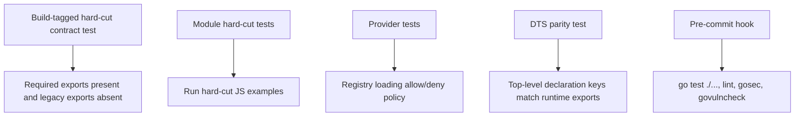

# Geppetto JS Bindings: Wrapper-First Hard Cutover

This article explains how the Geppetto JavaScript bindings now work after the hard cutover to a wrapper-first API. It records the technical design, the cleanup work, the public usage model, the internal execution path, and the remaining boundaries that future work should respect.

The source project is `/home/manuel/workspaces/2026-06-01/geppetto-js/geppetto`. The implementation described here was committed as `06114e36ae98dd136e11eee63625a82c39f1bfcb` with the message `Hard cut Geppetto JS API`.

> [!summary]
> - The JavaScript API now exposes Go-owned wrapper objects for inference settings, engines, agents, turns, schemas, tools, and registries.
> - Inference configuration is resolved from Geppetto engine profile registries through `gp.inferenceProfiles`; JavaScript does not build provider/model settings directly.
> - Agent execution requires explicit `Turn` objects. System content, user content, assistant history, and multimodal blocks are represented as turn blocks.
> - Legacy public namespaces such as `profiles`, `runner`, `turns`, `engines`, `schemas`, `middlewares`, and `tools` were removed from `require("geppetto")`.

## Why this note exists

The previous JavaScript binding layer exposed several overlapping ways to assemble inference work. Scripts could create sessions directly, run inference through a runner namespace, construct engines from loose maps, inspect profile stacks through a separate profile namespace, and manipulate turns through plain JavaScript values. That made examples easy to write in the short term, but it created a weak contract between JavaScript and Go.

The new API chooses a stricter contract. JavaScript receives wrapper objects that hold Go-owned state. The wrapper exposes explicit methods such as `toJSON`, `clone`, `run`, `build`, or `resolve`. The Go implementation keeps the authoritative values in Go structs and registries, and JavaScript sees only the operations that are valid for that value.

This change matters because Geppetto is not only a JavaScript convenience module. It sits on top of the Go inference stack, engine profile registry support, session runtime, tool registry, event sinks, and go-go-goja host integration. A permissive JavaScript API can bypass those boundaries. A wrapper-first API lets JavaScript participate in those systems without taking ownership of provider configuration, credentials, session state, or Go runtime invariants.

## Final public API

The current top-level module is deliberately small. The public keys installed by `pkg/js/modules/geppetto/module.go` are:

```javascript
const gp = require("geppetto");

Object.keys(gp);
// [
//   "version",
//   "consts",
//   "inferenceProfiles",
//   "engine",
//   "agent",
//   "turn",
//   "tool",
//   "toolRegistry",
//   "schema",
//   "events"
// ]
```

The removed names are as important as the remaining names. The hard-cut contract test asserts that these old names stay absent:

```javascript
[
  "chat",
  "inferenceSettings",
  "createBuilder",
  "createSession",
  "runInference",
  "profiles",
  "engines",
  "turns",
  "runner",
  "schemas",
  "middlewares",
  "tools",
  "embeddings",
  "unsafe"
]
```

The absence of `gp.inferenceSettings()` is intentional. Scripts should not mutate provider, model, sampling, token, base URL, model metadata, or credential configuration through JavaScript setters. Those settings are selected by resolving a registry profile. The resolved result is a Go-owned `InferenceSettings` wrapper that can be inspected in redacted form and passed to `gp.engine()` or `gp.agent()`.

## The binding architecture

The Geppetto module is registered as a goja native module under the name `geppetto`. The loader constructs a `moduleRuntime`, receives the CommonJS `exports` object, and installs the hard-cut API. The important code path is in `pkg/js/modules/geppetto/module.go`:

```go
func (m *moduleRuntime) installExports(exports *goja.Object) {
    m.mustSet(exports, "version", "0.1.0")
    m.installConsts(exports)

    inferenceProfilesObj := m.vm.NewObject()
    m.mustSet(inferenceProfilesObj, "load", m.inferenceProfilesLoad)
    m.mustSet(inferenceProfilesObj, "resolve", m.inferenceProfilesResolve)
    m.mustSet(inferenceProfilesObj, "default", m.inferenceProfilesDefault)
    m.mustSet(exports, "inferenceProfiles", inferenceProfilesObj)

    m.mustSet(exports, "engine", m.engineBuilder)
    m.mustSet(exports, "agent", m.agentBuilder)
    m.mustSet(exports, "turn", m.turnBuilder)
    m.mustSet(exports, "tool", m.toolBuilder)
    m.mustSet(exports, "toolRegistry", m.toolRegistryBuilder)
    m.installSchemaNamespace(exports)

    eventsObj := m.vm.NewObject()
    m.mustSet(eventsObj, "collector", m.eventsCollector)
    m.mustSet(exports, "events", eventsObj)
}
```

Every public object that represents Go-owned state carries an internal hidden reference. The hidden reference is not enumerable, not writable, and not configurable. This is the internal mechanism that lets JavaScript call methods on ordinary-looking objects while Go still owns the underlying data.

```go
func (m *moduleRuntime) attachRef(o *goja.Object, ref any) {
    _ = o.Set(hiddenRefKey, ref)
    _ = o.DefineDataProperty(hiddenRefKey, o.Get(hiddenRefKey),
        goja.FLAG_FALSE,
        goja.FLAG_FALSE,
        goja.FLAG_FALSE,
    )
}
```

The key point is not that there is a hidden property. The key point is that public methods re-enter Go, retrieve the typed reference, clone or validate it, and then operate on Go data. This prevents plain JavaScript objects from becoming accidental substitute implementations of inference settings, engines, turns, or tools.

```mermaid
flowchart TD
    JS[JavaScript require("geppetto")] --> Exports[Hard-cut exports]
    Exports --> RegistryNS[inferenceProfiles namespace]
    Exports --> Builders[engine / agent / turn / tool / schema builders]
    RegistryNS --> SettingsWrapper[InferenceSettings wrapper]
    Builders --> GoRefs[Go-owned references]
    GoRefs --> GeppettoCore[Geppetto inference/session/tool packages]
    GeppettoCore --> ResultWrappers[Turn and RunResult wrappers]
    ResultWrappers --> JS
```

## Registry-backed inference settings

The registry path is the central configuration path. The JavaScript API uses existing Geppetto engine profile registries rather than Pinocchio unified config documents. Accepted source forms include YAML paths, `yaml:PATH`, `yaml://PATH`, SQLite paths, `sqlite:PATH`, and `sqlite-dsn:DSN`.

The public usage is concise:

```javascript
const gp = require("geppetto");

const registry = gp.inferenceProfiles.load("./profiles.yaml");
const settings = registry.resolve("assistant");

console.log(settings.toJSON());
registry.close();
```

The implementation in `api_inference_profiles.go` decodes the source argument, parses registry source specs, constructs a chained registry, and returns an `InferenceRegistry` wrapper:

```go
entries, err := decodeEngineProfileRegistrySources(call.Arguments[0].Export())
specs, err := profiles.ParseRegistrySourceSpecs(entries)
chain, err := profiles.NewChainedRegistryFromSourceSpecs(context.Background(), specs)
return m.newInferenceRegistryObject(&inferenceRegistryRef{
    registry: chain,
    closer:   chain,
    sources:  append([]string(nil), entries...),
    owned:    true,
})
```

The wrapper exposes four operations:

| Method | Purpose |
|---|---|
| `listRegistries()` | Return registry summaries from the chained registry. |
| `listProfiles(registrySlug?)` | Return profile records, optionally restricted to a registry. |
| `resolve(input?)` | Resolve a profile string or `{ registry, profile }` object into `InferenceSettings`. |
| `close()` | Close owned registry resources. Host-provided default registries are not owned by the wrapper. |

There is also a host-default path:

```javascript
const settings = gp.inferenceProfiles.resolve("default");
```

This only works when the Go host configured `EngineProfileRegistry` in `geppetto.Options`. If no registry is configured, the method fails with a clear error. That behavior matters because standalone scripts should not silently resolve against process-global state.

## `InferenceSettings` as a read-only wrapper

`InferenceSettings` is the value that crosses the registry boundary. It wraps a cloned `*settings.InferenceSettings` and provenance information. The wrapper exposes three methods:

```javascript
settings.toJSON();  // redacted snapshot
settings.clone();   // new wrapper around cloned Go settings
settings.debug();   // redacted debug object plus provenance and key names
```

The implementation clones on construction and clones again when JavaScript passes settings into another builder. This is the important invariant: JavaScript receives snapshots and wrapper methods, not ownership of the Go settings struct.

```go
func (m *moduleRuntime) newInferenceSettingsRef(
    settings *aistepssettings.InferenceSettings,
    provenance inferenceSettingsProvenance,
) *inferenceSettingsRef {
    return &inferenceSettingsRef{
        api:        m,
        settings:   cloneInferenceSettings(settings),
        provenance: provenance.clone(),
    }
}
```

The provenance object records where the settings came from:

- registry slug
- profile slug
- stack lineage
- source paths or DSNs
- resolved metadata

Secrets are redacted before any snapshot reaches JavaScript. The redaction function walks nested maps and arrays and replaces values under keys such as `api_keys`, `apiKey`, `secret`, and `token`.

```go
func redactSecretsInPlace(v any) {
    switch x := v.(type) {
    case map[string]any:
        for k, child := range x {
            if isSecretSnapshotKey(k) {
                x[k] = redactSecretValue(child)
                continue
            }
            redactSecretsInPlace(child)
        }
    case []any:
        for _, child := range x {
            redactSecretsInPlace(child)
        }
    }
}
```

This is a redaction boundary, not a full credential architecture. The current implementation still allows registry YAML to contain raw `api.api_keys`, because that is how existing Geppetto registry files work. The public JavaScript API does not expose `apiKey`, `apiKeyEnv`, or `fromEnv`, and snapshots/debug output redact secret values. A future host-owned credential resolver should move the underlying credential storage to symbolic references.

## Engine construction

The engine builder has one public construction path:

```javascript
const engine = gp.engine()
  .inference(settings)
  .build();
```

The method `.inference(settings)` rejects plain JavaScript objects. It expects the Go-owned `InferenceSettings` wrapper produced by registry resolution. The builder clones the settings, applies provider defaults, and calls the existing engine factory:

```go
settings := cloneInferenceSettings(ref.settings.settings)
ensureInferenceSettingsProviderDefaults(settings)
eng, err := enginefactory.NewEngineFromSettings(settings)
```

The resulting `Engine` wrapper contains the Go engine, model metadata, and provenance metadata. JavaScript can pass it to `gp.agent().engine(engine)`, but JavaScript does not receive a map-based constructor for engines. The old `engines.fromConfig`, `engines.fromProfile`, and function-backed fake engine paths were removed from the public API and then cleaned from internal dead code where possible.

## Agent execution requires explicit turns

The agent API is the main execution API. It is built from registry settings or an explicit engine:

```javascript
const settings = gp.inferenceProfiles.resolve("assistant");

const agent = gp.agent()
  .name("article-example")
  .inference(settings)
  .runDefaults({ timeoutMs: 120000, tags: { article: "geppetto-js" } })
  .build();
```

An agent cannot execute a raw prompt string. It requires a `Turn` wrapper:

```javascript
const turn = gp.turn()
  .system("Answer in one short paragraph.")
  .user("What changed in this repository?")
  .build();

const result = agent.run(turn);
console.log(result.text());
```

This design makes system content, user content, assistant history, metadata, and multimodal data part of one explicit input value. It also removes ambiguity about where system prompts belong. There is no `agent.system(...)`; system content is a block in the turn.

The execution path in `api_agent.go` is:

1. The agent builder records an inference settings wrapper or engine wrapper.
2. `build()` creates an `agentRef` with a base engine, middleware list, tool registry, runtime tool names, run defaults, event sinks, and runtime metadata.
3. `agent.run(turn, options?)` requires a `Turn` wrapper and parses run options.
4. `runSync` builds an internal session, clones the input turn, stamps runtime metadata, appends the seed turn, starts inference, waits for completion, and returns a `RunResult` wrapper.

```go
func (a *agentRef) runSync(input *turns.Turn, opts runOptions) (*runResultRef, error) {
    inputSnapshot := input.Clone()
    seed := input.Clone()
    stampTurnRuntimeMetadata(seed, sr.runtimeMetadata)
    effective := seed.Clone()
    sr.session.Append(seed)
    handle, err := sr.session.StartInference(ctx)
    out, err := handle.Wait()
    return &runResultRef{
        inputTurn: inputSnapshot,
        effectiveTurn: effective,
        outputTurn: out.Clone(),
    }, nil
}
```

The result wrapper exposes the trace points needed by callers:

```javascript
result.inputTurn();      // caller-provided turn snapshot
result.effectiveTurn();  // turn after runtime metadata/tool setup
result.outputTurn();     // final output turn
result.text();           // assistant text extraction
result.usage();          // currently null
result.stopReason();     // currently null
result.events();         // currently limited
result.toJSON();         // combined snapshot
```

## Turns and multimodal messages

Turns are built through `gp.turn()`. The builder is persistent in behavior: each mutating call clones the internal turn and returns a new builder wrapper. This keeps caller-visible builder values from becoming mutable shared state.

```javascript
const turn = gp.turn()
  .system("You are a careful visual reasoning assistant.")
  .user(m => m
    .text("Describe the image content.")
    .imageFile("./screenshot.png"))
  .build();
```

The turn builder supports:

| Method | Result |
|---|---|
| `system(text)` | Appends a system text block. |
| `user(text)` | Appends a user text block. |
| `user(messageBuilderFn)` | Appends a multimodal user block from text and image parts. |
| `assistant(text)` | Appends an assistant text block, useful for explicit multi-turn context. |
| `metadata(key, value)` | Writes canonical turn metadata. |
| `build()` | Produces a Go-owned `Turn` wrapper. |

The message builder supports `text`, `imageURL`, `imageFile`, and `imageBytes`. `imageFile` reads the file, infers a media type from the extension, base64-encodes the content, and stores the image map on the multimodal block.

Explicit multi-turn behavior is visible in `examples/js/geppetto/30_real_provider_multiturn.js`. The second provider call includes the first user message and first assistant response as blocks in the second turn:

```javascript
const turn2 = gp.turn()
  .system(system)
  .user("Turn 1: Reply with exactly this token and no extra words: ALPHA_GEPPETTO")
  .assistant(text1)
  .user("Turn 2: What exact token did you return in the previous assistant message?")
  .build();
```

The provider receives history only because the script includes that history. There is no hidden conversation memory in `agent.run`.

## Schema and tool wrappers

The hard-cut API includes a small JSON Schema builder namespace:

```javascript
const inputSchema = gp.schema.object()
  .property("city", gp.schema.string().description("City name"))
  .required("city")
  .build();
```

The schema wrapper stores a cloned map and exposes `toJSON` and `clone`. The current builder supports `string`, `integer`, `number`, `boolean`, `array`, `object`, `enum`, `description`, `property`, `items`, `required`, `build`, and `toJSON`. Helpers such as `default`, `min`, and `max` remain deferred.

Tools are defined through `gp.tool(name)` and collected through `gp.toolRegistry()`:

```javascript
const weather = gp.tool("weather")
  .description("Return weather for a city")
  .input(inputSchema)
  .handler((input, ctx) => ({ city: input.city, forecast: "dry" }))
  .build();

const tools = gp.toolRegistry().add(weather);

const agent = gp.agent()
  .inference(settings)
  .tool(tools)
  .toolLoop({ enabled: true, maxIterations: 4 })
  .build();
```

The implementation converts JavaScript handlers into Geppetto tools by registering a Go function that calls back into JavaScript on the goja runtime owner. This is a necessary concurrency boundary. A `goja.Runtime` must be accessed through the owning execution path; tool handlers may execute from Go inference/tool-loop contexts, so the callback uses `callOnOwner` to enter the runtime safely.

The registered tool receives a context object containing available runtime identifiers:

- `toolName`
- `timestampMs`
- `sessionId`
- `inferenceId`
- `tags`

Tool registry wrappers also support `addGo(...names)` for host-provided Go tools and `call(name, input?)` for direct test/debug invocation.

## Host integration through go-go-goja provider registration

The package `pkg/js/modules/geppetto/provider` registers Geppetto as a go-go-goja provider module. The provider config now includes:

```json
{
  "profileRegistries": ["/path/to/profiles.yaml"],
  "defaultProfile": "assistant",
  "allowRegistryLoad": true,
  "allowNetwork": true,
  "allowTools": true
}
```

`allowRegistryLoad` defaults to deny. If a provider config supplies `profileRegistries` without setting `allowRegistryLoad: true`, module creation fails. That policy prevents a JavaScript package configuration from loading arbitrary registry sources unless the host explicitly permits it.

The provider still requires host services:

```go
type HostServices interface {
    GeppettoOptions(ctx context.Context, cfg Config) (geppettomodule.Options, error)
}
```

The host services hook remains the place for application policy. Registry loading can be handled by the provider when allowed, but broader decisions such as network access, tool exposure, and future credential resolution belong to the host.

## How the cleanup was performed

The cleanup happened in two passes: public hard cutover, then internal dead-code reduction.

The public cutover removed the old names from `require("geppetto")`, deleted old examples, rewrote docs, and replaced the legacy module test with a focused hard-cut test. The commit changed 78 files, with 4,592 insertions and 7,153 deletions. The largest deletion was the old `pkg/js/modules/geppetto/module_test.go`, which had 2,010 lines of legacy API coverage.

Deleted legacy implementation files included:

| Deleted file | Removed responsibility |
|---|---|
| `api_profiles.go` | Old `gp.profiles` registry/profile namespace. |
| `api_runner.go` | Old runner and prepared-run entrypoints. |
| `api_turns.go` | Old `gp.turns` namespace. |
| `api_schemas.go` | Old schema catalog namespace. |
| `module_test.go` | Legacy module tests that asserted removed behavior. |

Several files were rewritten rather than deleted because they still contained internal helpers required by the new API:

| File | Current role |
|---|---|
| `api_engines.go` | Engine reference extraction, engine object wrapping, provider defaults, effective settings merge helper. |
| `api_sessions.go` | Internal session construction used by `agent.run` and `agent.stream`. |
| `api_runtime_metadata.go` | Inference settings encoding, model info snapshots, runtime metadata helpers, tool registry materialization. |
| `api_builder_options.go` | Tool-loop and hook option parsing used by internal session setup. |
| `api_middlewares.go` | Middleware resolution and JavaScript callback middleware execution. |
| `api_types.go` | Reduced shared internal reference types. |

The TypeScript declarations were pruned after runtime cleanup. The old `.d.ts` still described legacy `Builder`, `Session`, `Runner*`, `PreparedRun`, `ResolvedProfile`, `EngineOptions`, and old middleware types even after the functions were gone. The pruned declarations now describe only the hard-cut API.

The final pre-commit hook found additional cleanup issues. Staticcheck identified a possible nil dereference in `InferenceSettings.debug()`, and the unused analyzer found leftover middleware object factory functions, an unused turn-slice encoder, and an unused profile registry ownership field. Those were removed before the final commit.

The JS example runner also had to be converted to the repository's Glazed command pattern. A raw `flag.FlagSet` under `cmd/examples/geppetto-js-run` failed the custom Glazed CLI lint. The final runner uses `cmds.WithFlags(fields.New(...))` and runs as:

```bash
go run ./cmd/examples/geppetto-js-run run \
  --script examples/js/geppetto/30_real_provider_multiturn.js \
  --profile-registries "$HOME/.config/pinocchio/profiles.yaml" \
  --profile default \
  --timeout-ms 120000
```

## Validation strategy

The validation strategy uses both behavior tests and API absence tests. This is important because the cutover is defined partly by what no longer exists.



Key tests and checks:

| Check | Purpose |
|---|---|
| `TestHardCutPublicSurfaceContract` | Locks the intended public module keys and absence of legacy names. |
| `TestHardCutPublicSurface` | Verifies default runtime exports. |
| `TestHardCutExamples` | Executes the new JS examples against the module. |
| Provider tests | Verify provider config, host service requirement, registry loading allow/deny behavior, and absence of legacy exports. |
| DTS parity test | Keeps declaration top-level exports aligned with runtime exports. |
| Pre-commit hook | Runs `go test ./...`, golangci-lint, custom lint, gosec, and govulncheck. |

The final pushed commit passed the pre-commit hook and push hook.

## Using the API

### Load a registry and inspect settings

```javascript
const gp = require("geppetto");

const registry = gp.inferenceProfiles.load("./profiles.yaml");
const settings = registry.resolve("assistant");

const snapshot = settings.toJSON();
console.log(snapshot.provenance.registrySlug);
console.log(snapshot.chat.engine);

registry.close();
```

A practical registry YAML file looks like this:

```yaml
slug: local
profiles:
  assistant:
    display_name: Assistant
    inference_settings:
      chat:
        api_type: openai
        engine: gpt-5-mini
```

The current runtime YAML loader rejects `default_profile_slug`. Use a profile slug such as `default` when default behavior is needed. Pinocchio unified config documents with `app:` are not accepted by `gp.inferenceProfiles.load(...)`.

### Build an agent and run one explicit turn

```javascript
const gp = require("geppetto");

const settings = gp.inferenceProfiles.resolve("assistant");

const agent = gp.agent()
  .name("short-answer")
  .inference(settings)
  .runDefaults({ timeoutMs: 60000 })
  .build();

const turn = gp.turn()
  .system("Answer in one short paragraph.")
  .user("Explain the Geppetto JS hard cutover.")
  .build();

const result = agent.run(turn);
console.log(result.text());
```

### Build explicit multi-turn context

```javascript
const first = agent.run(gp.turn()
  .system("Reply with exactly the requested token.")
  .user("Return ALPHA_GEPPETTO.")
  .build());

const secondTurn = gp.turn()
  .system("Reply with exactly the requested token.")
  .user("Return ALPHA_GEPPETTO.")
  .assistant(first.text())
  .user("Return BETA_GEPPETTO:<the previous assistant token>.")
  .build();

const second = agent.run(secondTurn);
console.log(second.text());
```

The second request contains previous context only because the script adds the previous blocks. This is the intended execution model.

### Add a JavaScript tool

```javascript
const citySchema = gp.schema.object()
  .property("city", gp.schema.string().description("City name"))
  .required("city")
  .build();

const weather = gp.tool("weather")
  .description("Return deterministic weather data for one city")
  .input(citySchema)
  .handler((input, context) => {
    return {
      city: input.city,
      forecast: "dry",
      toolName: context.toolName,
    };
  })
  .build();

const registry = gp.toolRegistry().add(weather);

const agent = gp.agent()
  .inference(settings)
  .tool(registry)
  .toolLoop({ enabled: true, maxIterations: 4 })
  .build();
```

### Use multimodal user content

```javascript
const turn = gp.turn()
  .system("You are a careful visual reasoning assistant.")
  .user(m => m
    .text("Describe this screenshot.")
    .imageFile("./screenshot.png"))
  .build();

const result = agent.run(turn);
console.log(result.text());
```

## Implementation rules to preserve

These rules are the durable part of the cutover. They should guide future additions to the binding layer.

- Public JavaScript values that represent Geppetto runtime state should be Go-owned wrappers.
- Plain JavaScript maps should be accepted only at explicit boundary points such as metadata, run options, tool inputs, and schema literals.
- Inference settings should come from registry resolution, not from JavaScript model/provider setters.
- JavaScript must not expose raw credential or environment variable APIs.
- System content belongs in `gp.turn().system(...)`, not in `gp.agent()`.
- Agent execution should continue to require explicit turns.
- Multi-turn behavior should remain explicit; scripts should include previous user and assistant blocks when they want the provider to receive history.
- New public namespaces should come with absence tests for names they supersede or intentionally exclude.
- Type declarations should describe actual runtime exports and should not preserve removed API concepts as declaration-only artifacts.

## Current limitations and deferred work

The hard cutover intentionally left some work outside the first implementation pass.

| Area | Current state | Future work |
|---|---|---|
| Embeddings | `gp.embeddings()` is not implemented; the embeddings example self-skips. | Add a wrapper-first embeddings API or remove the example. |
| Credentials | Registry API keys can still exist in YAML, but snapshots are redacted. | Implement host-owned symbolic credential resolution. |
| Streaming events | `agent.stream()` returns a promise/cancel/on shape, but detailed event forwarding is limited. | Connect event collector forwarding to the runtime event stream. |
| Tool call/result turns | `turn().toolCall(...)` and `turn().toolResult(...)` are deferred. | Add Go-owned wrappers for tool interaction blocks. |
| Schema helpers | `default`, `min`, `max`, and related helpers are deferred. | Extend schema builder without accepting arbitrary mutable state. |
| Middleware API | `agent().middleware(fn)` and `goMiddleware(...)` exist, but there is no standalone hard-cut middleware namespace. | Decide whether middleware needs first-class wrappers. |
| Registry defaults | `default_profile_slug` is rejected by the current YAML loader. | Either support it in the loader or keep documenting the `default` profile convention. |

## File map

The following files define the new binding layer:

| Path | Role |
|---|---|
| `pkg/js/modules/geppetto/module.go` | Native module loader, hard-cut export installation, hidden reference helpers. |
| `pkg/js/modules/geppetto/api_inference_profiles.go` | `gp.inferenceProfiles` registry loading, default resolution, and registry wrappers. |
| `pkg/js/modules/geppetto/api_inference_settings.go` | Go-owned settings wrapper, provenance, snapshots, redaction. |
| `pkg/js/modules/geppetto/api_engine_builder.go` | `gp.engine().inference(settings).build()`. |
| `pkg/js/modules/geppetto/api_agent.go` | `gp.agent()` builder, `run`, `stream`, and `RunResult`. |
| `pkg/js/modules/geppetto/api_turn_builder.go` | `gp.turn()` and multimodal message builder. |
| `pkg/js/modules/geppetto/api_schema_builders.go` | JSON Schema builders. |
| `pkg/js/modules/geppetto/api_tool_builders.go` | JS tool and tool registry builders. |
| `pkg/js/modules/geppetto/provider/provider.go` | go-go-goja provider registration and host config handling. |
| `cmd/examples/geppetto-js-run/main.go` | Glazed runner for real provider JS examples. |
| `examples/js/geppetto/30_real_provider_multiturn.js` | Real provider multi-turn validation script. |
| `pkg/doc/types/geppetto.d.ts` | Pruned TypeScript declaration file. |
| `pkg/js/modules/geppetto/spec/geppetto.d.ts.tmpl` | Declaration template kept in sync with runtime exports. |

The ticket documentation is under:

```text
ttmp/2026/06/01/GP-GOJA-API-2026-06-01--review-and-redesign-geppetto-go-go-goja-api-and-javascript-bindings/
```

The most useful ticket artifacts are:

- `design-doc/01-geppetto-go-go-goja-api-review-and-builder-design-guide.md`
- `design-doc/02-reusable-geppetto-inference-profile-registry-extraction-guide.md`
- `reference/01-investigation-diary.md`
- `tasks.md`
- `changelog.md`

## Closing

The Geppetto JavaScript bindings now have one coherent execution path: resolve inference settings from a Geppetto registry, build an engine or agent from those settings, construct an explicit turn, run the agent, and inspect a Go-owned result wrapper. The implementation uses goja objects for JavaScript ergonomics, but the authoritative state remains in Go. That is the central technical improvement of the hard cutover.

The cleanup removed old public concepts rather than hiding them behind compatibility aliases. That keeps the API smaller, makes examples more precise, and reduces future maintenance risk. The remaining work is well-scoped: credential ownership, richer streaming events, embeddings, additional turn block builders, and optional middleware wrappers can be added without restoring the old map-first design.
