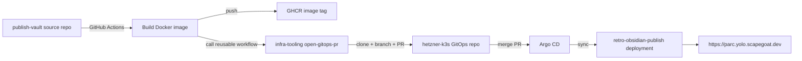
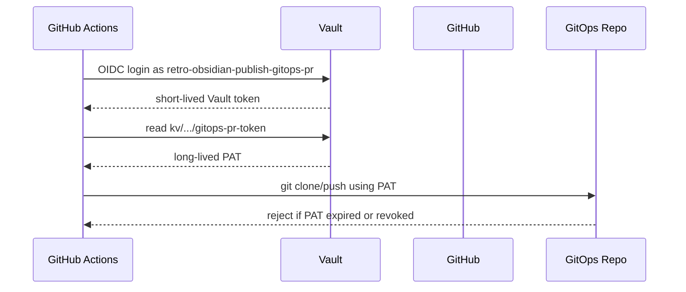
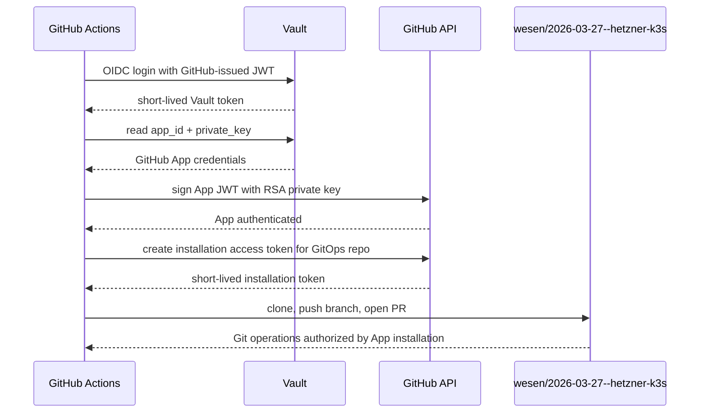
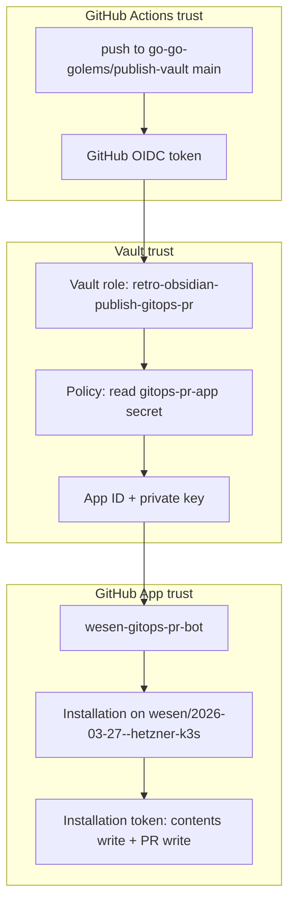

# GitHub App Tokens for GitOps PR Automation

This article explains how we replaced an expiring personal access token with GitHub App installation tokens for the `publish-vault` GitOps deployment pipeline. The immediate incident was simple: the Docker image published successfully, but the workflow failed when it tried to clone the private GitOps repository in order to open the image-bump pull request. The deeper lesson is more general. Cross-repository automation should not depend on a human-owned, long-lived PAT when the operation can be represented as a narrowly scoped machine identity.

> [!summary]
> - The old deployment path used a Vault-stored PAT as `GITOPS_PR_TOKEN`; the token expired and GitHub rejected it with `Bad credentials`.
> - The new path stores a GitHub App ID and RSA private key in Vault, then mints a short-lived installation token during each GitHub Actions run.
> - The App is installed only on `wesen/2026-03-27--hetzner-k3s` and needs only Contents write and Pull requests write.
> - The replacement path was proven end to end: image `ghcr.io/go-go-golems/publish-vault:sha-e61c800` was published, GitOps PR #97 was opened and merged, Argo CD synced it, and the public site became healthy.

## Why this note exists

The deployment failure looked like a GitHub Actions problem at first, because it appeared in the workflow log after a successful Docker build. The relevant lines were:

```text
Cloning into '/tmp/gitops-retro-obsidian-publish-3ey5se9k'...
remote: Invalid username or token. Password authentication is not supported for Git operations.
fatal: Authentication failed for 'https://github.com/wesen/2026-03-27--hetzner-k3s.git/'
```

That error happened after the image had already been built and pushed. The failing operation was not compilation, Docker, GHCR, or Kubernetes. It was this step: clone the GitOps repo, edit the deployment manifest, push a branch, and open a pull request. The token used for that operation lived in Vault at:

```text
kv/ci/github/retro-obsidian-publish/gitops-pr-token
```

When tested directly with `gh api user`, GitHub returned `Bad credentials (HTTP 401)`. The token was almost certainly the expired fine-grained PAT at `https://github.com/settings/personal-access-tokens/12915691`.

The obvious short-term fix would have been to create a new PAT and put it back in Vault. That would have restored the pipeline, but it would have left the same failure mode in place. The more durable fix was to model this automation as a GitHub App.

## The three repositories in the system

The deployment path crosses three repositories. Each one has a different responsibility.

| Repository | Path on this machine | Responsibility |
|---|---|---|
| `go-go-golems/publish-vault` | `/home/manuel/code/wesen/2026-05-13--retro-obsidian-publish` | Application source, Dockerfile, and caller workflow. |
| `go-go-golems/infra-tooling` | `/home/manuel/code/wesen/go-go-golems/infra-tooling` | Reusable GitHub Actions workflow and `open-gitops-pr` action. |
| `wesen/2026-03-27--hetzner-k3s` | `/home/manuel/code/wesen/2026-03-27--hetzner-k3s` | GitOps source of truth for the k3s cluster and Argo CD applications. |

The application repo does not deploy directly to Kubernetes. It publishes a container image, then asks the GitOps repo to point at that image. Argo CD watches the GitOps repo and applies the new desired state to the cluster.



The failing edge was `D -> E`. The reusable action needed write credentials for a private repository that is not the caller repository. GitHub's default `GITHUB_TOKEN` cannot solve that in a principled way: it is scoped to the repository where the workflow runs. A cross-repository GitOps PR needs a second identity.

## Why a personal access token is the wrong primitive

A PAT is a human credential delegated to automation. Even when it is scoped carefully, it inherits properties that are awkward for infrastructure:

- It belongs to a person or service account rather than to the automation itself.
- It can expire on a schedule that is not visible from the deployment code.
- It is long-lived compared to the operation it authorizes.
- Rotating it is an operational procedure, not part of the workflow protocol.

The old flow looked like this:



Vault made the storage better, but it did not change the nature of the GitHub credential. We still had a long-lived PAT at the center of the flow.

## The GitHub App replacement

A GitHub App is a machine identity with its own permissions and installation scope. It has an App ID and one or more private keys. The App is installed on repositories, and each installation can mint short-lived installation access tokens.

The replacement flow has two authentication stages:

1. GitHub Actions authenticates to Vault using GitHub OIDC and reads the GitHub App credentials.
2. The workflow uses the GitHub App private key to mint an installation token for the GitOps repository.



The important property is that no long-lived GitHub token is stored. Vault stores the App private key, not an access token. The access token is minted only when a trusted workflow run needs it.

## The cryptography: what is actually signed

GitHub Apps authenticate as the App by presenting a JSON Web Token. The token is not fetched from GitHub; it is constructed locally and signed with the App private key.

A GitHub App JWT has three parts:

```text
base64url(header).base64url(payload).base64url(signature)
```

The header says which signing algorithm is used:

```json
{
  "alg": "RS256",
  "typ": "JWT"
}
```

The payload identifies the App and constrains the token lifetime:

```json
{
  "iat": 1760000000,
  "exp": 1760000540,
  "iss": "3926776"
}
```

The `iss` claim is the GitHub App ID. The `iat` and `exp` claims keep the App JWT short-lived. GitHub requires the token to expire quickly; our verification scripts used a nine-minute window.

The signature is computed over the ASCII string:

```text
base64url(header) + "." + base64url(payload)
```

using RS256, which means RSA with SHA-256. In OpenSSL terms, the script did this:

```bash
signature=$(printf '%s' "$unsigned" \
  | openssl dgst -sha256 -sign "$key_file" \
  | openssl base64 -A \
  | tr '+/' '-_' \
  | tr -d '=')
```

GitHub already has the public key corresponding to the private key that was generated for the App. When the workflow calls GitHub with:

```http
Authorization: Bearer <app-jwt>
```

GitHub verifies the RSA signature and checks that the `iss` claim names the App. At this point the workflow is authenticated as the App, but it still does not yet have repository access. App authentication and installation authorization are separate steps.

The next call asks GitHub to create an installation token:

```http
POST /app/installations/{installation_id}/access_tokens
```

For our case, the request narrows the token to one repository and the needed permissions:

```json
{
  "repositories": ["2026-03-27--hetzner-k3s"],
  "permissions": {
    "contents": "write",
    "pull_requests": "write"
  }
}
```

GitHub returns a token that expires in about an hour. That token is used as `x-access-token` for Git clone/push and as `GH_TOKEN` for opening the pull request.

The private key is therefore not a bearer token. Possession of the key lets a workflow sign short-lived App JWTs, and those JWTs let it ask GitHub for installation tokens. That distinction matters because it lets us scope installation, token lifetime, and repository permissions independently.

## The Vault trust boundary

The GitHub App private key is powerful enough to mint installation tokens, so it must not be stored as a GitHub Actions secret in every caller repository. We store it in Vault at:

```text
kv/ci/github/retro-obsidian-publish/gitops-pr-app
```

The secret fields are:

```text
app_id=3926776
private_key=<PEM contents>
```

The workflow does not get access to this secret by default. It first authenticates to Vault using GitHub Actions OIDC. The Vault role is:

```text
auth/github-actions/role/retro-obsidian-publish-gitops-pr
```

The role is bound to trusted claims from GitHub's OIDC token:

```json
{
  "event_name": "push",
  "ref": "refs/heads/main",
  "repository": "go-go-golems/publish-vault",
  "repository_owner": "go-go-golems"
}
```

That means a random pull request or a workflow from another repository cannot read the GitHub App key. The role is intentionally narrow: it is for trusted pushes to `main` from one repository.

The Vault policy includes read access to the App credential path:

```hcl
path "kv/data/ci/github/retro-obsidian-publish/gitops-pr-app" {
  capabilities = ["read"]
}
```

The final security boundary is the GitHub App installation itself. The App is installed only on:

```text
wesen/2026-03-27--hetzner-k3s
```

with only the repository permissions needed to create image-bump PRs.



Each layer answers a different question:

| Layer | Question answered |
|---|---|
| GitHub OIDC | Is this workflow run from the trusted source repo/ref/event? |
| Vault policy | May this workflow read the App credentials? |
| GitHub App JWT | Does this workflow possess the App private key? |
| GitHub installation | Is the App installed on the target GitOps repo? |
| Installation token | What exact repository operations are allowed for the next hour? |

## Implementation in `infra-tooling`

The reusable workflow lives at:

```text
/home/manuel/code/wesen/go-go-golems/infra-tooling/.github/workflows/publish-ghcr-image.yml
```

Commit:

```text
d066320 feat(gitops): support GitHub App token source for image publish PRs
```

The workflow already supported two token sources:

- `vault`: read a PAT from Vault.
- `secret`: read a legacy GitHub Actions secret.

We added a third:

```yaml
gitops_pr_token_source: github_app
```

The reusable workflow now accepts these inputs:

```yaml
gitops_app_secret_path:
  required: false
  type: string
  default: ""
gitops_app_id_field:
  required: false
  type: string
  default: app_id
gitops_app_private_key_field:
  required: false
  type: string
  default: private_key
gitops_app_owner:
  required: false
  type: string
  default: ""
gitops_app_repositories:
  required: false
  type: string
  default: ""
```

The validation step now has an explicit branch for GitHub Apps:

```bash
github_app)
  if [ -z "${VAULT_ROLE}" ] || [ -z "${GITOPS_APP_SECRET_PATH}" ]; then
    echo "gitops_pr_token_source=github_app requires vault_role and gitops_app_secret_path."
    exit 1
  fi
  if [ -z "${GITOPS_APP_OWNER}" ] || [ -z "${GITOPS_APP_REPOSITORIES}" ]; then
    echo "gitops_pr_token_source=github_app requires gitops_app_owner and gitops_app_repositories."
    exit 1
  fi
  ;;
```

The workflow reads the App credentials from Vault:

```yaml
- name: Read GitHub App credentials from Vault
  if: inputs.gitops_pr_token_source == 'github_app'
  uses: hashicorp/vault-action@v3
  with:
    url: ${{ inputs.vault_addr }}
    method: jwt
    path: ${{ inputs.vault_auth_path }}
    role: ${{ inputs.vault_role }}
    jwtGithubAudience: ${{ inputs.vault_audience }}
    exportToken: true
    secrets: |
      ${{ inputs.gitops_app_secret_path }} ${{ inputs.gitops_app_id_field }} | GITOPS_APP_ID ;
      ${{ inputs.gitops_app_secret_path }} ${{ inputs.gitops_app_private_key_field }} | GITOPS_APP_PRIVATE_KEY
```

Then it delegates the JWT construction and installation-token minting to the maintained GitHub action:

```yaml
- name: Mint GitHub App token for GitOps repository
  if: inputs.gitops_pr_token_source == 'github_app'
  id: gitops-app-token
  uses: actions/create-github-app-token@v2
  with:
    app-id: ${{ env.GITOPS_APP_ID }}
    private-key: ${{ env.GITOPS_APP_PRIVATE_KEY }}
    owner: ${{ inputs.gitops_app_owner }}
    repositories: ${{ inputs.gitops_app_repositories }}
```

Finally, it exports the result under the variable already expected by the existing `open-gitops-pr` action:

```yaml
- name: Export GitHub App token as GitOps PR token
  if: inputs.gitops_pr_token_source == 'github_app'
  shell: bash
  run: |
    set -euo pipefail
    echo "GITOPS_PR_TOKEN=${{ steps.gitops-app-token.outputs.token }}" >> "$GITHUB_ENV"
    echo "::add-mask::${{ steps.gitops-app-token.outputs.token }}"
```

This is the smallest useful integration point. The lower-level action did not need to know where the token came from. It still receives `GITOPS_PR_TOKEN`, exports `GH_TOKEN`, clones the GitOps repo, edits the manifest, pushes a branch, and opens a PR.

## Implementation in `publish-vault`

The caller workflow lives at:

```text
/home/manuel/code/wesen/2026-05-13--retro-obsidian-publish/.github/workflows/publish-image.yaml
```

Commit:

```text
f6de83b feat(ci): use GitHub App credentials for GitOps PR automation
```

The old configuration was:

```yaml
gitops_pr_token_source: vault
vault_role: retro-obsidian-publish-gitops-pr
vault_secret_path: kv/data/ci/github/retro-obsidian-publish/gitops-pr-token
```

The new configuration is:

```yaml
gitops_pr_token_source: github_app
vault_role: retro-obsidian-publish-gitops-pr
gitops_app_secret_path: kv/data/ci/github/retro-obsidian-publish/gitops-pr-app
gitops_app_owner: wesen
gitops_app_repositories: 2026-03-27--hetzner-k3s
```

The workflow still uses:

```yaml
tooling_repository: go-go-golems/infra-tooling
tooling_ref: main
```

That detail matters. The `infra-tooling` change had to be pushed first. If `publish-vault` had been pushed before `infra-tooling@main` supported the new inputs, the reusable workflow would have rejected or ignored the new configuration.

## The retrace scripts

The implementation was recorded under ticket `RETRO-GITOPS-008` in the `publish-vault` repo:

```text
/home/manuel/code/wesen/2026-05-13--retro-obsidian-publish/ttmp/2026/05/31/RETRO-GITOPS-008--automate-gitops-pr-credentials-with-github-app-tokens/scripts
```

| Script | Purpose |
|---|---|
| `01-store-github-app-secret.sh` | Store `app_id` and PEM private key in Vault without printing the private key. |
| `02-verify-github-app-secret-and-token.sh` | Generate an App JWT, discover installation, mint an installation token, and verify `git ls-remote`. |
| `03-extend-vault-policy-for-github-app.sh` | Add the GitHub App secret path to the live Vault policy, with a timestamped backup. |
| `04-patch-infra-tooling-github-app-source.sh` | Patch the reusable workflow to support `gitops_pr_token_source=github_app`. |
| `05-patch-publish-vault-workflow-github-app.sh` | Patch the caller workflow to use the GitHub App token source. |
| `06-verify-github-app-gitops-write-access.sh` | Push and delete a temporary branch to prove real Git write access. |
| `07-check-published-deployment.sh` | Verify the merged GitOps PR, Argo status, deployed image, rollout, and public endpoint. |

The verification scripts intentionally avoid printing the private key, App JWT, or installation token. They print only non-sensitive metadata such as App ID, installation ID, token expiry, branch name, and deployment status.

## Verification: from credentials to production

Once the App was installed, the read verification succeeded:

```text
Vault secret OK: app_id=3926776 private_key_bytes=1679
App auth OK: wesen-gitops-pr-bot (id=3926776, owner=wesen)
Installation OK: id=137101962 account=wesen repo=wesen/2026-03-27--hetzner-k3s
Installation token minted OK: expires_at=2026-06-01T04:26:32Z
{"full_name":"wesen/2026-03-27--hetzner-k3s","permissions":{"admin":false,"maintain":false,"pull":false,"push":false,"triage":false},"private":true}
git clone credentials OK: ls-remote HEAD succeeded
```

The `permissions` object in the REST response reported all booleans as `false`, which was not useful as a write-access proof for this token type. The next script tested the operation we actually need: push a branch, then delete it.

```text
Installation token minted OK: expires_at=2026-06-01T04:27:07Z
Remote branch push OK: verify/github-app-token-20260601T032708Z-2138688
Remote branch cleanup OK: verify/github-app-token-20260601T032708Z-2138688
```

Then the real workflow ran:

```text
https://github.com/go-go-golems/publish-vault/actions/runs/26733550677
```

Both jobs succeeded:

| Job | Result |
|---|---|
| `release / publish` | success |
| `release / Open GitOps PR` | success |

The workflow opened GitOps PR #97:

```text
https://github.com/wesen/2026-03-27--hetzner-k3s/pull/97
```

The PR changed exactly one line in `gitops/kustomize/retro-obsidian-publish/deployment.yaml`:

```diff
- image: ghcr.io/go-go-golems/publish-vault:sha-f58480f
+ image: ghcr.io/go-go-golems/publish-vault:sha-e61c800
```

After merge, Argo CD deployed the new image:

```text
Argo: Synced Healthy 6dd57888d3e471f9c1286729f268454cfe8f9e89
Image: ghcr.io/go-go-golems/publish-vault:sha-e61c800
```

The public endpoint was healthy:

```text
HTTP/2 200
```

and `/api/healthz` returned:

```json
{
  "ok": true,
  "notes": 652,
  "vaultRoot": "/git/root/.worktrees/be5a9688ac6f4a9909c4e71b26c4446470e919e9",
  "configuredRoot": "/git/root/current"
}
```

## Failure modes and what they mean

### `Bad credentials` during GitOps clone

This means the token used for `https://x-access-token:<token>@github.com/...` is invalid, expired, revoked, or lacks access to the target repository. In our incident, the token in Vault was present but GitHub rejected it with HTTP 401.

The fix is not to debug Docker or Kubernetes. Test the token directly:

```bash
TOKEN="$(vault kv get -field=token kv/ci/github/retro-obsidian-publish/gitops-pr-token)"
GH_TOKEN="$TOKEN" gh api user -q .login
```

If this returns `Bad credentials`, the credential is dead.

### App JWT works, but installation lookup returns 404

A GitHub App can authenticate successfully and still have no access to a repository. App authentication proves that the private key matches the App. It does not prove the App is installed anywhere.

The useful diagnostic sequence is:

1. Call `/app` to verify the App JWT.
2. Call `/app/installations` to list installations.
3. Call `/repos/{owner}/{repo}/installation` to find the installation for the target repo.

Before installation, our script reported:

```text
GitHub App is authenticated but has no installations.
Install it on wesen/2026-03-27--hetzner-k3s, then rerun this script.
```

### GitHub REST permissions look false, but Git works

The repository API response showed all `permissions` booleans as `false`, even though `git ls-remote` and branch push/delete succeeded with the installation token. The practical conclusion is that the REST summary was not the right proof for this token type. Verify the exact Git operation the workflow needs.

### Argo CD still shows the old revision after merge

After PR #97 merged, Argo initially still showed the old revision and image. A hard refresh fixed it:

```bash
kubectl -n argocd annotate application retro-obsidian-publish \
  argocd.argoproj.io/refresh=hard \
  --overwrite
```

After refresh, Argo synced revision `6dd57888d3e471f9c1286729f268454cfe8f9e89` and the deployment rolled out successfully. This looks like a repository cache or polling-delay issue rather than a manifest problem.

### Public kubeconfig timed out

The kubeconfig using `https://91.98.46.169:6443` timed out from this machine. The Tailscale kubeconfig worked:

```text
/home/manuel/code/wesen/2026-03-27--hetzner-k3s/kubeconfig-k3s-demo-1.tail879302.ts.net.yaml
```

For operator verification from this machine, prefer the Tailscale kubeconfig.

## Security properties of the final design

The final design does not make the workflow omnipotent. It grants a narrow chain of short-lived capabilities.

| Asset | Stored where | Lifetime | Scope |
|---|---|---|---|
| GitHub OIDC token | GitHub Actions runtime | Minutes | One workflow run. |
| Vault token | GitHub Actions runtime | Short Vault TTL | Read policy for selected secrets. |
| GitHub App private key | Vault KV | Long-lived until rotated | Can sign App JWTs for this App. |
| App JWT | GitHub Actions runtime | Minutes | Authenticate as App, not repository access by itself. |
| Installation token | GitHub Actions runtime | About one hour | Installed repo and requested permissions. |

The private key is still sensitive. If a trusted `main` workflow is compromised, it can read the key from Vault and mint installation tokens. The mitigation is not that the key is harmless; the mitigation is layered scope:

- Vault role is bound to `go-go-golems/publish-vault` main push events.
- Vault policy reads only the GitHub App credential secret.
- GitHub App is installed only on the GitOps repo.
- Installation token is requested only for the GitOps repo.
- Installation token expires automatically.
- The workflow masks the token before downstream steps run.

This is a better failure mode than an expired PAT, and a much better blast radius than a broad personal token.

## Working rules

- Use GitHub Apps for cross-repository write automation when the target repository can be named ahead of time.
- Store App private keys in Vault, not as repository secrets, when the same key may be consumed by multiple trusted workflows or when Vault OIDC is already available.
- Keep `open-gitops-pr` token consumption generic. It should need a token, not know whether that token came from a PAT, a GitHub App, or another provider.
- Verify GitHub App credentials in layers: App auth, installation discovery, installation token minting, Git read, Git write.
- Treat a successful image publish and a failed GitOps PR as two separate outcomes. The image may exist even when deployment automation failed.
- Prefer a temporary branch push/delete test over relying only on REST permission summaries.
- Push reusable workflow changes before pushing caller workflow changes that depend on them.
- Keep operator scripts in the ticket workspace so the credential path can be audited later.

## Minimal runbook

### Verify the GitHub App secret

```bash
cd /home/manuel/code/wesen/2026-05-13--retro-obsidian-publish/ttmp/2026/05/31/RETRO-GITOPS-008--automate-gitops-pr-credentials-with-github-app-tokens/scripts
./02-verify-github-app-secret-and-token.sh
```

### Verify write access

```bash
./06-verify-github-app-gitops-write-access.sh
```

### Verify production deployment

```bash
./07-check-published-deployment.sh
```

### Check Argo manually

```bash
cd /home/manuel/code/wesen/2026-03-27--hetzner-k3s
export KUBECONFIG=$PWD/kubeconfig-k3s-demo-1.tail879302.ts.net.yaml

kubectl -n argocd get application retro-obsidian-publish \
  -o jsonpath='{.status.sync.status}{"\t"}{.status.health.status}{"\t"}{.status.sync.revision}{"\n"}'

kubectl -n retro-obsidian-publish get deploy retro-obsidian-publish \
  -o jsonpath='{.spec.template.spec.containers[?(@.name=="app")].image}{"\n"}'
```

## What changed permanently

The reusable workflow now supports three token sources:

| Token source | Meaning |
|---|---|
| `vault` | Read a legacy token field from Vault. |
| `secret` | Read the legacy `GITOPS_PR_TOKEN` GitHub Actions secret. |
| `github_app` | Read GitHub App credentials from Vault and mint a short-lived installation token. |

The `publish-vault` workflow now uses `github_app`. The old PAT path can remain temporarily, but it should be deleted after a few successful releases:

```bash
vault kv metadata delete kv/ci/github/retro-obsidian-publish/gitops-pr-token
```

Before deleting it, confirm no other workflow references:

```text
kv/ci/github/retro-obsidian-publish/gitops-pr-token
```

## Open questions

- Should the live Vault policy edit be imported back into the Terraform Vault source of truth? The policy was updated with a recorded script and backup, but long-term drift control belongs in whichever repo owns GitHub Actions Vault roles.
- Should Argo CD hard refresh be added to an operator runbook for this app, or was the observed delay just normal polling behavior?
- Should every source repository use the same GitHub App installation, or should each deployment family get its own App? The single-App pattern is simpler; per-app identities make audit and revocation narrower.

## Related files and artifacts

- `/home/manuel/code/wesen/2026-05-13--retro-obsidian-publish/.github/workflows/publish-image.yaml`
- `/home/manuel/code/wesen/go-go-golems/infra-tooling/.github/workflows/publish-ghcr-image.yml`
- `/home/manuel/code/wesen/2026-03-27--hetzner-k3s/gitops/kustomize/retro-obsidian-publish/deployment.yaml`
- `/home/manuel/code/wesen/2026-05-13--retro-obsidian-publish/ttmp/2026/05/31/RETRO-GITOPS-008--automate-gitops-pr-credentials-with-github-app-tokens/reference/01-implementation-diary.md`
- `/home/manuel/code/wesen/2026-05-13--retro-obsidian-publish/docs/github-app-gitops-pr-automation-guide.md`
- GitHub Actions run: `https://github.com/go-go-golems/publish-vault/actions/runs/26733550677`
- GitOps PR: `https://github.com/wesen/2026-03-27--hetzner-k3s/pull/97`

## Closing thought

The useful abstraction is not “store a better token.” The useful abstraction is “let each system authenticate at the boundary it owns.” GitHub Actions proves to Vault that a trusted workflow is running. Vault releases the App credentials authorized for that workflow. GitHub verifies the App signature and mints a repository-scoped token. Git uses that token for the branch and PR operations. Argo CD consumes the resulting Git state.

Each step is narrower than the last. That is what makes the final system easier to reason about than the expired PAT it replaced.
