# LDCK-API-001: Building a Loupedeck HTTP API with xgoja

`LDCK-API-001` is the project that turns a locally attached Loupedeck Live into an HTTP-controlled device for remote coding agents. The final implementation is not a hand-written service binary. It is an xgoja-generated binary that composes Go-backed JavaScript modules for HTTP routing, Loupedeck UI rendering, hardware control, and SQLite event polling. JavaScript owns the REST API behavior. Go owns provider composition, runtime lifecycle, hardware connection, HTTP serving, and safe access to the goja runtime.

> [!summary]
> The project resolved three technical questions:
> 1. **How should a generated xgoja binary host a long-running HTTP service?** The built-in `run` command is short-lived, so the project added a provider-owned `serve` command through `CommandSetProvider`.
> 2. **How should REST endpoints call physical Loupedeck controls?** Button LEDs and brightness are exposed through a dedicated `loupedeck/hw` JavaScript module, not through the retained UI module.
> 3. **How should remote agents receive device input?** Hardware events are recorded into SQLite and exposed through `GET /api/v1/events`, while webhook delivery is deferred until go-go-goja has an HTTP client or `fetch` module.

The reference repositories are:

- `/home/manuel/workspaces/2026-05-27/better-loupedeck-tiles/loupedeck`
- `/home/manuel/workspaces/2026-05-27/better-loupedeck-tiles/loupedeck-server`
- `/home/manuel/workspaces/2026-05-27/better-loupedeck-tiles/go-go-goja`

The reference ticket workspace is:

- `/home/manuel/workspaces/2026-05-27/better-loupedeck-tiles/loupedeck/ttmp/2026/05/31/LDCK-API-001--loupedeck-remote-control-http-api-xgoja-binary`

## What was built

The system exposes a Loupedeck Live over HTTP. A client can query device metadata, create pages, draw tile grids, set button LED colors, set display brightness, and poll for button, knob, and touch events. The server runs on the workstation that has the hardware attached. Remote processes interact with it through JSON endpoints.

The implemented command path is:

```bash
cd /home/manuel/workspaces/2026-05-27/better-loupedeck-tiles
xgoja build -f loupedeck-server/xgoja.yaml --xgoja-replace $(pwd)/go-go-goja --keep-work
./dist/loupedeck-server serve loupedeck-server/server.js --deck-enabled --http-listen :9876
```

The important word in that command is `serve`. The original attempt tried to use the built-in xgoja `run` command. That command creates a runtime, runs a script, and closes the runtime when the script returns. That lifecycle is correct for one-shot scripts. It is incorrect for an HTTP server because route registration must be followed by a period in which the runtime remains alive and available for request callbacks.

The final binary contains:

| Layer | Main file | Responsibility |
|---|---|---|
| xgoja buildspec | `loupedeck-server/xgoja.yaml` | Select provider packages, runtime modules, commands, and command providers. |
| service command provider | `loupedeck-server/pkg/xgoja/serverprovider/provider.go` | Add the long-running `serve` command to the generated binary. |
| REST API script | `loupedeck-server/server.js` | Register express routes, store events in SQLite, call Loupedeck JS modules. |
| hardware JS module | `loupedeck/runtime/js/module_hw/module.go` | Expose brightness and button LED operations to JavaScript. |
| hardware adapter | `loupedeck/runtime/js/env/device_control.go` | Adapt `*device.Loupedeck` to a narrow `DeviceControl` interface. |
| Loupedeck provider | `loupedeck/runtime/js/provider/provider.go` | Connect hardware, attach event sources, start rendering/presentation loops. |
| HTTP provider | `go-go-goja/pkg/xgoja/providers/http/http.go` | Start Go HTTP server and expose the `express` module. |
| database module | `go-go-goja/modules/database/database.go` | Provide SQLite access for the event queue. |

## The problem that shaped the design

The user-facing problem is simple: a remote coding agent cannot directly interact with a USB control surface on a developer's desk. The technical problem is more specific. The Loupedeck code already had a JavaScript runtime and hardware integration, and go-go-goja already had an express-style HTTP module and SQLite module. The project needed a way to combine those capabilities into one generated service binary without duplicating provider setup by hand.

The implementation had to satisfy these constraints:

- The final service should be xgoja-composed rather than a manually wired `main.go`.
- JavaScript should remain the behavior layer for REST routes and device-facing application logic.
- Go should own runtime construction, provider initialization, signal handling, and cleanup.
- Hardware endpoints should not report success unless a real hardware call happened.
- Webhook delivery should be postponed until go-go-goja has a supported outbound HTTP client module.
- The polling path should work now, using SQLite as a durable event queue.

The final architecture follows those constraints. The generated binary includes provider packages. The `serve` command creates a runtime from the selected profile, initializes provider sections, loads `server.js`, and then waits outside the goja runtime owner until the process receives a shutdown signal.

## Final architecture

The system has four active execution domains:

1. A Go process generated by xgoja.
2. A goja JavaScript runtime with selected native modules.
3. A Go HTTP server that routes requests through gojahttp.
4. A Loupedeck hardware connection that sends framebuffer/control messages and receives input events.

The resulting data flow is:

```mermaid
flowchart TD
    Client[Remote coding agent or HTTP client]
    HTTP[Go net/http server]
    Router[gojahttp route registry]
    Owner[goja runtime owner]
    JS[server.js express handlers]
    DB[(SQLite events table)]
    UI[loupedeck/ui retained UI module]
    HW[loupedeck/hw hardware-control module]
    Provider[Loupedeck xgoja provider]
    Device[Loupedeck Live]

    Client -->|JSON HTTP| HTTP
    HTTP --> Router
    Router -->|Owner.Call| Owner
    Owner --> JS
    JS -->|event polling| DB
    JS -->|pages and display draw| UI
    JS -->|brightness and LEDs| HW
    HW --> Provider
    UI --> Provider
    Provider --> Device
    Device -->|button knob touch| Provider
    Provider --> UI
    UI --> JS
    JS -->|INSERT event| DB
    DB -->|SELECT events| JS
    JS --> Owner
    Owner --> HTTP
    HTTP --> Client

    style Owner fill:#1a3a5c,stroke:#4aa3ff
    style DB fill:#4d3b14,stroke:#e5b84a
    style Device fill:#3a1a1a,stroke:#ff6b6b
```



The important runtime rule is that HTTP handlers do not execute JavaScript directly from arbitrary Go goroutines. `gojahttp.Host.ServeHTTP` matches a route and schedules the JavaScript handler through the runtime owner. This preserves goja's single-runtime access rule and keeps HTTP request handling compatible with the existing runtime ownership model.

## The xgoja buildspec

The buildspec is the composition contract. It names the generated binary, declares provider packages, selects runtime modules, and mounts commands. The current `loupedeck-server/xgoja.yaml` declares five provider packages:

```yaml
packages:
  - id: loupedeck-server
    import: github.com/go-go-golems/loupedeck-server/pkg/xgoja/serverprovider
    register: Register
    replace: .

  - id: loupedeck
    import: github.com/go-go-golems/loupedeck/pkg/xgoja/provider
    register: Register
    replace: ../loupedeck

  - id: go-go-goja-http
    import: github.com/go-go-golems/go-go-goja/pkg/xgoja/providers/http
    register: Register
    replace: ../go-go-goja

  - id: go-go-goja-host
    import: github.com/go-go-golems/go-go-goja/pkg/xgoja/providers/host
    register: Register
    replace: ../go-go-goja

  - id: go-go-goja-core
    import: github.com/go-go-golems/go-go-goja/pkg/xgoja/providers/core
    register: Register
    replace: ../go-go-goja
```

The runtime profile named `server` selects the modules that `server.js` can require:

```yaml
runtimes:
  server:
    modules:
      - package: go-go-goja-http
        name: express
        as: express

      - package: loupedeck
        name: loupedeck/ui
        as: loupedeck/ui
      - package: loupedeck
        name: loupedeck/gfx
        as: loupedeck/gfx
      - package: loupedeck
        name: loupedeck/hw
        as: loupedeck/hw

      - package: go-go-goja-host
        name: db
        as: db
        config:
          allowConfigure: true
```

That profile is the boundary between what is compiled into the binary and what the server script can use. The binary may contain more providers than a single script needs, but the runtime profile controls the available `require()` names for this command.

The buildspec also mounts the new long-running command provider:

```yaml
commandProviders:
  - id: loupedeck-http-server
    package: loupedeck-server
    name: server
    mount: ""
    runtimeProfile: server
```

The generated command is root-mounted, so the operational command is `loupedeck-server serve ...`, not `loupedeck-server server serve ...`.

One non-obvious detail is the generated module path:

```yaml
go:
  module: github.com/go-go-golems/generated/loupedeck-server
```

This is intentionally not `github.com/go-go-golems/loupedeck-server`. The generated temporary module must import the real provider package from the source checkout. If both module paths are identical, Go resolves the provider import inside the generated workspace, where `pkg/xgoja/serverprovider` does not exist. Using a distinct generated module path avoids that conflict.

## Why the built-in `run` command was wrong for this service

The project initially reached for xgoja's built-in `run` command because `server.js` is a script. That was the wrong lifecycle. The key behavior is in `go-go-goja/pkg/xgoja/app/run.go`: the command creates a runtime, runs the script, and defers runtime close. When the script finishes registering routes, the command returns, closes the runtime, and provider-owned resources shut down.

A long-running HTTP service needs a different sequence:

```text
create runtime
initialize provider config sections
load server script so routes and listeners are registered
return from JavaScript execution
keep Go process alive
allow HTTP requests to enter the runtime owner as needed
close runtime only when signal or context cancellation occurs
```

This sequence cannot be implemented by adding an infinite JavaScript loop at the end of `server.js`. HTTP request handlers also need the goja owner. If the owner is occupied by a blocking script, HTTP requests cannot enter JavaScript. The wait must happen in Go after the script load returns, outside the owner.

The recovered implementation lives in `loupedeck-server/pkg/xgoja/serverprovider/provider.go`. Its `Run` method performs the required sequence:

```go
rt, err := c.providerCtx.RuntimeFactory.NewRuntime(ctx, profile, requireOpt)
if err != nil {
    return fmt.Errorf("create runtime %q: %w", profile, err)
}
defer func() { _ = rt.Close(context.Background()) }()

if err := providerutil.InitRuntimeFromSections(ctx, vals, runtimeHandle{rt: rt}, c.providerCtx.SelectedModules); err != nil {
    return fmt.Errorf("initialize runtime from provider sections: %w", err)
}

if _, err := rt.Owner.Call(ctx, "loupedeck-server.load-script", func(_ context.Context, vm *goja.Runtime) (any, error) {
    _, err := rt.Require.Require(scriptPath)
    return nil, err
}); err != nil {
    return fmt.Errorf("load server script %q: %w", scriptPath, err)
}

return waitForShutdown(ctx)
```

The service command does not replace xgoja. It is an xgoja extension point. It reuses the runtime factory, selected modules, and provider configuration sections. It only changes the command lifecycle.

## The REST API script

`loupedeck-server/server.js` is the behavior layer. It uses four important modules:

```javascript
const express = require("express")
const ui = require("loupedeck/ui")
const hw = require("loupedeck/hw")
const db = require("db")
```

The script configures SQLite:

```javascript
db.configure("sqlite3", "loupedeck_events.db")

db.exec(`
  CREATE TABLE IF NOT EXISTS events (
    id        INTEGER PRIMARY KEY AUTOINCREMENT,
    type      TEXT NOT NULL,
    name      TEXT NOT NULL,
    status    TEXT,
    value     INTEGER,
    x         INTEGER,
    y         INTEGER,
    timestamp INTEGER NOT NULL
  )
`)
```

The table schema is deliberately small. It stores the common fields needed for button, knob, and touch events. Event-specific fields are nullable:

| Event type | Required fields | Optional fields |
|---|---|---|
| button | `type`, `name`, `status`, `timestamp` | `value`, `x`, `y` are null. |
| knob | `type`, `name`, `value`, `timestamp` | `status`, `x`, `y` are null. |
| touch | `type`, `name`, `status`, `x`, `y`, `timestamp` | `value` is null. |

The polling endpoint uses a monotonically increasing SQLite primary key as the cursor:

```javascript
app.get("/api/v1/events", (req, res) => {
  const since = parseInt(req.query.since || "0")
  const limit = parseInt(req.query.limit || "100")
  const type  = req.query.type || ""

  let sql = "SELECT * FROM events WHERE id > ?"
  const args = [since]
  if (type) {
    sql += " AND type = ?"
    args.push(type)
  }
  sql += " ORDER BY id ASC LIMIT ?"
  args.push(limit)

  const rows = db.query(sql, ...args)
  const cursor = rows.length > 0 ? rows[rows.length - 1].id : since
  res.json({ cursor: cursor, events: rows })
})
```

This gives clients a stable protocol:

1. Start with `since=0`.
2. Read `events` and `cursor`.
3. Store `cursor` on the client side.
4. Poll again with `since=<last cursor>`.
5. Optionally acknowledge old events with `DELETE /api/v1/events`.

The design avoids webhooks for now. Webhook delivery requires outbound HTTP from JavaScript or a Go-backed webhook module. The current go-go-goja environment has no approved `fetch`/HTTP client surface, so webhook delivery remains deferred.

## API surface

The implemented API is under `/api/v1`.

| Method | Path | Purpose | Current status |
|---|---|---|---|
| `GET` | `/api/v1/info` | Return static device shape and connection intent. | Implemented. |
| `GET` | `/api/v1/brightness` | Return cached brightness value. | Implemented. |
| `PUT` | `/api/v1/brightness` | Set real hardware brightness through `loupedeck/hw`. | Implemented. |
| `GET` | `/api/v1/buttons` | Return cached button LED colors. | Implemented. |
| `GET` | `/api/v1/buttons/:name` | Return one cached button LED color. | Implemented. |
| `PUT` | `/api/v1/buttons/:name/color` | Set real hardware button LED color through `loupedeck/hw`. | Implemented. |
| `GET` | `/api/v1/displays` | Return display dimensions. | Implemented. |
| `POST` | `/api/v1/displays/:name/draw` | Create and show a retained UI page from grid tiles. | Implemented, but visual hardware confirmation remains open. |
| `GET` | `/api/v1/pages` | List known pages. | Implemented. |
| `POST` | `/api/v1/pages` | Create a retained UI page. | Implemented. |
| `GET` | `/api/v1/pages/:name` | Read stored page description. | Implemented. |
| `DELETE` | `/api/v1/pages/:name` | Delete stored page description. | Implemented. |
| `POST` | `/api/v1/pages/show` | Show a named page. | Implemented. |
| `PUT` | `/api/v1/pages/:name/tiles/:col/:row` | Partial tile update placeholder. | Placeholder. |
| `GET` | `/api/v1/events` | Poll SQLite event queue. | Implemented. |
| `DELETE` | `/api/v1/events` | Delete events up to cursor. | Implemented. |

The most important semantic rule in the API is that hardware mutation endpoints update cached state only after the hardware call succeeds:

```javascript
try {
  hw.setButtonColor(name, { r: body.r, g: body.g, b: body.b })
} catch (e) {
  err503(res, String(e))
  return
}
buttonColors[name] = { r: body.r, g: body.g, b: body.b }
res.json({ name: name, r: body.r, g: body.g, b: body.b })
```

Earlier versions of the server returned HTTP 200 while the hardware call was commented out. That was an API correctness bug. A remote agent must be able to distinguish "the device changed" from "the server updated local memory." The current behavior returns `503` when `loupedeck/hw` has no connected hardware control.

## The `loupedeck/hw` module

A key correction in the project was to avoid putting brightness and LED methods into `loupedeck/ui`. The retained UI module describes pages, tiles, displays, and event callbacks. Brightness and button LEDs are direct hardware controls. They are not retained UI nodes. They do not participate in tile layout, dirty tracking, or display rendering.

The final module is `loupedeck/runtime/js/module_hw/module.go`:

```go
const ModuleName = "loupedeck/hw"

func Loader() require.ModuleLoader {
    return func(runtime *goja.Runtime, module *goja.Object) {
        env, ok := envpkg.Lookup(runtime)
        if !ok || env == nil {
            panic(runtime.NewGoError(fmt.Errorf("hw module requires environment services")))
        }
        exports := module.Get("exports").(*goja.Object)
        _ = exports.Set("setBrightness", func(call goja.FunctionCall) goja.Value {
            control := requireDeviceControl(runtime, env)
            value := int(call.Argument(0).ToInteger())
            if value < 0 || value > 10 {
                panic(runtime.NewTypeError("setBrightness requires value in range 0..10"))
            }
            if err := control.SetBrightness(value); err != nil {
                panic(runtime.NewGoError(fmt.Errorf("setBrightness: %w", err)))
            }
            return goja.Undefined()
        })
    }
}
```

The module exports two functions:

```javascript
hw.setBrightness(value)                         // value: 0..10
hw.setButtonColor("Button1", { r: 1, g: 2, b: 3 })
hw.setButtonColor("Button2", "#0a0b0c")
```

Validation is performed before the hardware adapter is called:

- Brightness must be in `0..10`.
- Button names must pass `device.ParseButton`.
- Object colors must have numeric `r`, `g`, and `b` fields.
- RGB values must be in `0..255`.
- Hex colors must be `#rrggbb` or `rrggbb`.

The module resolves hardware through the runtime environment:

```go
type DeviceControl interface {
    SetButtonColor(button device.Button, c color.RGBA) error
    SetBrightness(brightness int) error
}
```

The physical adapter is intentionally narrow:

```go
type LoupedeckDeviceControl struct {
    Deck *device.Loupedeck
}

func (c *LoupedeckDeviceControl) SetButtonColor(button device.Button, col color.RGBA) error {
    if c == nil || c.Deck == nil {
        return fmt.Errorf("loupedeck hardware not connected")
    }
    return c.Deck.SetButtonColor(button, col)
}
```

This structure keeps tests simple. Unit tests can provide a mock `DeviceControl` without creating a serial connection. It also keeps JavaScript from receiving a raw `*device.Loupedeck`, which would expose too much of the hardware driver surface.

## Hardware connection and provider initialization

The Loupedeck provider already owns the physical device lifecycle. That made it the right place to install `DeviceControl`. After `deckConn` is created, the provider attaches it to the host runtime and exposes the hardware adapter through the environment:

```go
environment.Host.Attach(deckConn)
environment.DeviceControl = &env.LoupedeckDeviceControl{Deck: deckConn}
```

This matters because the hardware flag is a provider configuration concern:

```bash
./dist/loupedeck-server serve loupedeck-server/server.js --deck-enabled --http-listen :9876
```

With `--deck-enabled=false`, the JS module still exists, but calls fail clearly. With `--deck-enabled`, calls reach the physical device.

Observed behavior after implementation:

| Runtime mode | Brightness/LED HTTP result | Meaning |
|---|---|---|
| `--deck-enabled=false` | HTTP 503 | The API refused to claim a hardware write that could not occur. |
| `--deck-enabled` with attached Loupedeck Live | HTTP 200 | The API reached the hardware adapter and low-level device writer. |

This distinction is important for remote agents. A false success response would produce incorrect agent behavior because the agent would believe the local display or button LEDs changed when they did not.

## Event polling

Hardware event callbacks are registered in `server.js`:

```javascript
ALL_BUTTONS.forEach(name => {
  ui.onButton(name, (event) => {
    console.log('[callback] button ' + name + ' ' + event.status)
    recordEvent({ type: "button", name: name, status: event.status })
  })
})
```

The callback inserts a row into SQLite:

```javascript
function recordEvent(event) {
  const ts = Math.floor(Date.now() / 1000)
  db.exec(
    "INSERT INTO events (type, name, status, value, x, y, timestamp) VALUES (?, ?, ?, ?, ?, ?, ?)",
    event.type, event.name,
    event.status != null ? event.status : null,
    event.value != null ? event.value : null,
    event.x != null ? event.x : null,
    event.y != null ? event.y : null,
    ts
  )
}
```

The physical event path is:

```text
Loupedeck hardware input
-> device listener in Go
-> loupedeck host runtime
-> JavaScript callback registered by ui.onButton/ui.onKnob/ui.onTouch
-> INSERT into SQLite events table
-> remote client polls GET /api/v1/events?since=<cursor>
```

Hardware logs confirmed this path for button input:

```text
[callback] button Button1 down
[event] button Button1 down
[callback] button Button2 down
[event] button Button2 down
```

The project currently treats polling as the production feedback path. Webhooks remain deferred because outbound HTTP calls from JavaScript are not yet available in the go-go-goja module set.

## Validation history

The project reached several validation points. These are useful because they separate build correctness, no-hardware API correctness, and attached-device behavior.

### xgoja build validation

```bash
cd /home/manuel/workspaces/2026-05-27/better-loupedeck-tiles
xgoja doctor -f loupedeck-server/xgoja.yaml
xgoja build -f loupedeck-server/xgoja.yaml --xgoja-replace $(pwd)/go-go-goja --keep-work
```

Observed result:

```text
validated 22 check(s) for loupedeck-server/xgoja.yaml
xgoja build ok: /home/manuel/workspaces/2026-05-27/better-loupedeck-tiles/dist/loupedeck-server
```

### Unit tests

```bash
cd /home/manuel/workspaces/2026-05-27/better-loupedeck-tiles/loupedeck
go test ./runtime/js/... ./runtime/host/... ./pkg/device/...

cd /home/manuel/workspaces/2026-05-27/better-loupedeck-tiles/loupedeck-server
go test ./...
```

The new `module_hw` tests cover:

- mock hardware success for brightness and button color
- unavailable hardware error
- invalid brightness
- unknown button
- RGB range validation
- malformed hex validation

### No-hardware server smoke test

The no-hardware smoke test verifies that the API remains usable and that hardware writes fail honestly:

```bash
scripts/02-start-server.sh
scripts/01-smoke-test.sh http://localhost:9876
scripts/04-stop-server.sh
```

Observed result:

```text
27 passed, 0 failed
```

The count changed from an earlier 28 because the smoke test no longer restores brightness after a fake successful write. In no-hardware mode, the write should fail and the cached value should remain unchanged.

### Attached-hardware validation

With the physical Loupedeck attached:

```bash
scripts/02-start-server.sh --with-hardware
scripts/05-hardware-operator-test.sh --http-only
```

Observed result:

```text
11 passed, 0 failed
```

The server log showed a successful hardware connection:

```text
Found Loupedeck model="Loupedeck Live" product=0004 vendor=2ec2
[loupedeck-server] REST API ready
```

The hardware path then accepted brightness and Circle LED writes as HTTP 200, and the device logs showed additional low-level `Sending` entries. Visual confirmation is still tracked separately because HTTP success proves that the API reached the device writer, not that the human-visible result was observed.

## Important failure modes

### 1. Treating xgoja `run` as a service command

The first major failure was trying to use a short-lived script command for a long-lived HTTP service. The symptom was that the server could appear to start, but the runtime closed after route registration. The correct fix was a provider-owned service command, not a blocking JavaScript loop and not a permanent hand-written `main.go`.

Working rule:

- Use `run` for one-shot scripts.
- Use `serve` for HTTP services that need the runtime to remain alive.

### 2. Blocking the goja owner

An infinite loop or blocking wait inside JavaScript prevents HTTP requests from entering JavaScript because gojahttp also uses the runtime owner. Long-lived waiting belongs in Go after script loading returns.

Working rule:

- JavaScript registers routes and returns.
- Go waits for signals outside the runtime owner.

### 3. Returning success for no-op hardware writes

The earlier REST script updated local variables while the real calls were commented out. This made HTTP status codes unreliable. The corrected implementation performs the hardware call first and updates cached state only after success.

Working rule:

- Hardware mutation endpoints must return failure when the hardware call did not happen.

### 4. Overloading the retained UI module

Brightness and button LEDs are hardware controls. They do not belong to the retained page/tile model. Adding them to `loupedeck/ui` would mix two different abstractions and make the UI module responsible for behavior outside rendering and event subscriptions.

Working rule:

- Use `loupedeck/ui` for retained UI and input callbacks.
- Use `loupedeck/hw` for direct physical device controls.

### 5. Confusing HTTP-level validation with visual validation

HTTP 200 from a display route proves that the route handler completed. It does not prove that pixels became visible on the device. The project now has a hardware operator script to separate transport-level success from visual confirmation.

Working rule:

- Keep automated smoke tests for build/API behavior.
- Use operator tests for physical display, LED, and input confirmation.

## Current status

The project is active and partially complete.

Completed:

- xgoja buildspec for `loupedeck-server`
- generated xgoja binary at `dist/loupedeck-server`
- long-running `serve` command provider
- express REST API script
- SQLite event polling
- `loupedeck/hw` module for brightness and button LEDs
- no-hardware smoke tests
- attached-device HTTP/device-write validation for brightness and Circle LED routes
- hardware operator test script

Still open:

- Run the interactive hardware operator test and record visual confirmation for brightness, Circle LED colors, display rendering, and event polling.
- Add diagnostics if `POST /api/v1/displays/main/draw` returns HTTP 200 but the device display remains blank.
- Decide whether to delete, archive, or build-tag the manual `loupedeck-server/main.go` spike.
- Improve error mapping so validation exceptions from `loupedeck/hw` can become HTTP 400 while hardware-unavailable errors remain HTTP 503.
- Implement partial tile updates or remove the placeholder endpoint.
- Add webhook registration and delivery after go-go-goja has an HTTP client module.

## Reproducing the current system

The standard local workflow is:

```bash
cd /home/manuel/workspaces/2026-05-27/better-loupedeck-tiles

xgoja doctor -f loupedeck-server/xgoja.yaml
xgoja build -f loupedeck-server/xgoja.yaml --xgoja-replace $(pwd)/go-go-goja --keep-work

loupedeck/ttmp/2026/05/31/LDCK-API-001--loupedeck-remote-control-http-api-xgoja-binary/scripts/02-start-server.sh
loupedeck/ttmp/2026/05/31/LDCK-API-001--loupedeck-remote-control-http-api-xgoja-binary/scripts/01-smoke-test.sh
loupedeck/ttmp/2026/05/31/LDCK-API-001--loupedeck-remote-control-http-api-xgoja-binary/scripts/04-stop-server.sh
```

For hardware-attached validation:

```bash
loupedeck/ttmp/2026/05/31/LDCK-API-001--loupedeck-remote-control-http-api-xgoja-binary/scripts/02-start-server.sh --with-hardware
loupedeck/ttmp/2026/05/31/LDCK-API-001--loupedeck-remote-control-http-api-xgoja-binary/scripts/05-hardware-operator-test.sh --http-only
loupedeck/ttmp/2026/05/31/LDCK-API-001--loupedeck-remote-control-http-api-xgoja-binary/scripts/05-hardware-operator-test.sh
loupedeck/ttmp/2026/05/31/LDCK-API-001--loupedeck-remote-control-http-api-xgoja-binary/scripts/04-stop-server.sh
```

The generated binary can also be invoked directly:

```bash
./dist/loupedeck-server serve \
  loupedeck-server/server.js \
  --deck-enabled \
  --http-listen :9876
```

## Design lessons

The main result of `LDCK-API-001` is not only an HTTP API. It is a repeatable pattern for xgoja-hosted services:

1. Put provider selection and runtime module selection in `xgoja.yaml`.
2. Keep service lifecycle in a provider-owned command when the built-in command lifecycle is not appropriate.
3. Keep JavaScript as the behavior layer that registers routes and callbacks.
4. Keep Go responsible for runtime ownership, provider initialization, cleanup, and physical resource lifetimes.
5. Split retained UI operations from direct hardware operations.
6. Treat no-hardware mode as a first-class execution mode and return explicit errors for unavailable physical effects.
7. Validate physical systems in two phases: automated HTTP/API checks first, then operator-confirmed hardware checks.

This pattern should transfer to other generated goja services. The specific modules will change, but the lifecycle distinction remains the same: a service command must load the script, release the owner, keep the runtime alive, and close resources only on shutdown.

## Related project files

Core implementation:

- `/home/manuel/workspaces/2026-05-27/better-loupedeck-tiles/loupedeck-server/xgoja.yaml`
- `/home/manuel/workspaces/2026-05-27/better-loupedeck-tiles/loupedeck-server/pkg/xgoja/serverprovider/provider.go`
- `/home/manuel/workspaces/2026-05-27/better-loupedeck-tiles/loupedeck-server/server.js`
- `/home/manuel/workspaces/2026-05-27/better-loupedeck-tiles/loupedeck/runtime/js/module_hw/module.go`
- `/home/manuel/workspaces/2026-05-27/better-loupedeck-tiles/loupedeck/runtime/js/env/device_control.go`
- `/home/manuel/workspaces/2026-05-27/better-loupedeck-tiles/loupedeck/runtime/js/provider/provider.go`

Ticket documentation:

- `/home/manuel/workspaces/2026-05-27/better-loupedeck-tiles/loupedeck/ttmp/2026/05/31/LDCK-API-001--loupedeck-remote-control-http-api-xgoja-binary/design-doc/01-architecture-and-rest-api-design.md`
- `/home/manuel/workspaces/2026-05-27/better-loupedeck-tiles/loupedeck/ttmp/2026/05/31/LDCK-API-001--loupedeck-remote-control-http-api-xgoja-binary/analysis/01-code-review-xgoja-http-server-attempt-and-recovery-plan.md`
- `/home/manuel/workspaces/2026-05-27/better-loupedeck-tiles/loupedeck/ttmp/2026/05/31/LDCK-API-001--loupedeck-remote-control-http-api-xgoja-binary/reference/01-investigation-diary.md`
- `/home/manuel/workspaces/2026-05-27/better-loupedeck-tiles/loupedeck/ttmp/2026/05/31/LDCK-API-001--loupedeck-remote-control-http-api-xgoja-binary/tasks.md`

Validation scripts:

- `/home/manuel/workspaces/2026-05-27/better-loupedeck-tiles/loupedeck/ttmp/2026/05/31/LDCK-API-001--loupedeck-remote-control-http-api-xgoja-binary/scripts/01-smoke-test.sh`
- `/home/manuel/workspaces/2026-05-27/better-loupedeck-tiles/loupedeck/ttmp/2026/05/31/LDCK-API-001--loupedeck-remote-control-http-api-xgoja-binary/scripts/02-start-server.sh`
- `/home/manuel/workspaces/2026-05-27/better-loupedeck-tiles/loupedeck/ttmp/2026/05/31/LDCK-API-001--loupedeck-remote-control-http-api-xgoja-binary/scripts/05-hardware-operator-test.sh`

## Related notes

- [[ARTICLE - Loupedeck - Goja JavaScript Runtime and API Deep Dive]]
- [[ARTICLE - Loupedeck - Render Scheduler, Region Coalescing, and Display Blit Path]]
- [[ARTICLE - Loupedeck - Backpressure-Safe Go Frontend Deep Dive]]
