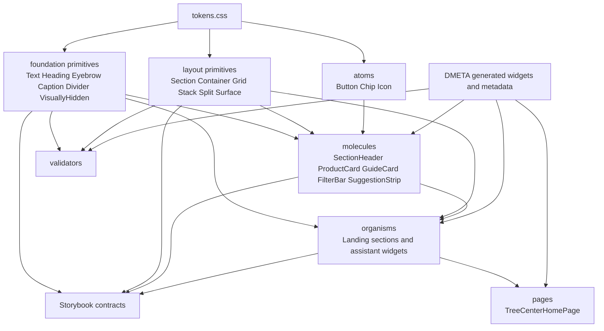

# TTC Design System: DMETA, Layout Primitives, Foundation Primitives, and CSS Governance

This report explains the TTC design-system project as a complete technical system. The implementation began with the need to generate and promote a Tree Center-style landing page, but the resulting work is broader than a single page. It establishes a layered React design system, connects that system to DMETA metadata and promotion workflows, and defines CSS ownership rules that make the UI easier to extend without reintroducing duplicated layout or typography decisions.

> [!summary]
> - The project turns TTC from a generated component set plus hand-authored CSS into a layered design system with tokens, foundation primitives, layout primitives, atoms, molecules, organisms, pages, Storybook contracts, and validators.
> - DMETA remains responsible for semantic and Web MetaDesignSystem provenance; React owns target-specific layout, typography, accessibility, surface, and component composition.
> - The important frontend pattern is not “less CSS” by itself. The pattern is assigning each repeated decision to the narrowest durable owner: tokens, foundation primitives, layout primitives, atoms, molecules, organisms, pages, or generated artifacts.
> - The final result is a stricter design-system architecture where promoted React components remain ordinary TypeScript/React components but preserve generation contracts, use shared primitives, and stay reviewable in Storybook.

## Why this project exists

The TTC project needed a reliable path from DMETA descriptions to usable Web UI. The concrete proving ground was a Tree Center-style ecommerce landing page inside the `ttc-garden-assistant` package. The page had to express real merchandising sections, product cards, category tiles, editorial content, guide cards, a guarantee band, an assistant entry section, and assistant widgets. It also had to preserve DMETA provenance so generated scaffolds and promoted React code stayed connected.

The first working version could render the page, but it exposed a deeper architecture problem. The generated and promoted components had the right semantic contracts, yet many visual decisions still lived in local CSS modules. Section padding, page gutters, max-width wrappers, responsive grids, stack gaps, typography roles, screen-reader-only utilities, separators, and widget title styles were repeated across components. Repetition made the page possible, but it did not make the system maintainable.

The project therefore became a design-system stabilization effort. The goal was to define the right ownership boundaries so future generated scaffolds, promoted components, and hand-authored UI could use the same vocabulary. The final system does not try to move every visual decision into DMETA. It keeps target-specific concerns in React and CSS, but makes those concerns explicit, named, documented, and validated.

The source repository is:

```text
/home/manuel/workspaces/2026-05-27/ttc-design-system
```

The main React package is:

```text
2026-05-27--ttc-design-system/web/packages/ttc-garden-assistant
```

The main design-system directories now are:

```text
src/styles/tokens.css
src/components/foundation/
src/components/layout/
src/components/atoms/
src/components/molecules/
src/components/organisms/
src/components/pages/
src/generated/dmeta-widgets/
scripts/validate-css-strict.mjs
scripts/validate-css-vars.mjs
scripts/validate-dmeta-manifest.mjs
```

## The central design rule

The central rule is: put each decision at the narrowest durable owner.

A design-system project fails when ownership is unclear. If section padding is local to every organism, every organism becomes a layout policy source. If every card chooses its own heading font token, the typography system exists only as raw variables, not as a usable React API. If accessibility utilities live in page CSS, they cannot be reused consistently. If generated files and promoted files are mixed without provenance, nobody can tell which files can be edited by hand.

The TTC design system assigns ownership as follows:

| Layer | Owns | Examples |
| --- | --- | --- |
| Tokens | raw and semantic visual values | colors, spacing, font roles, radii, elevation, layout max-widths |
| Foundation primitives | reusable typography, text tones, accessibility utilities, separators | `Text`, `Heading`, `Eyebrow`, `Caption`, `Divider`, `VisuallyHidden` |
| Layout primitives | structural composition and layout recipes | `Section`, `Container`, `Grid`, `Stack`, `Split`, `Surface` |
| Atoms | small controls and visual controls | `Button`, `Chip`, `Icon` |
| Molecules | reusable product UI composed from lower layers | `ProductCard`, `SectionHeader`, `FilterBar`, `SuggestionStrip` |
| Organisms | feature sections and widgets | `CategoryCollectionSection`, `QuickPicksWidget`, `ShoppingPlanSummaryWidget` |
| Pages | route/page composition and temporary page chrome | `TreeCenterHomePage` |
| Generated artifacts | DMETA-generated contracts and scaffolds | `src/generated/dmeta-widgets/**` |
| Validators | enforcement of ownership rules | CSS strict validation, CSS variable validation, manifest validation |

This rule is more important than any individual component. It is the reason the cleanup avoided both extremes. It did not leave every component to own repeated CSS. It also did not introduce a generic style-prop layer that would move styling decisions into arbitrary JSX props. Instead, it introduced a small set of primitives whose APIs match the repeated decisions already present in the code.

## The DMETA boundary

DMETA provides the semantic and generation pipeline. It does not own all frontend styling. The working chain is:

```text
core-model semantics/projections
  -> Interaction IR actions/representations/elaboration rules
  -> Web MetaDesignSystem lowering rules and widget templates
  -> generated React scaffolds and metadata
  -> promoted hand-owned React/CSS/Storybook
  -> validation and review
```

Each layer has a specific responsibility.

| DMETA/React layer | Correct responsibility | Incorrect responsibility |
| --- | --- | --- |
| Core model | domain concepts, archetypes, capabilities, projections | CSS classes, layout recipes, React props |
| Interaction IR | user-visible obligations, actions, representations | Web-specific spacing, typography, Storybook grouping |
| Web MetaDesignSystem | Web widget hierarchy, templates, coarse layout hints | target-neutral domain meaning |
| React generator | scaffold files, generated prop types, metadata sidecars | final polished UI decisions |
| Promoted React | production composition, callbacks, CSS Modules, primitives, stories | editing generated files by hand |
| Validators | enforce ownership contracts | inventing semantics |

The Web MetaDesignSystem now carries coarse layout metadata such as:

```text
component.layout.primitive
component.layout.container
component.layout.grid_recipe
```

This is intentionally small. The Web MDS can say that a generated component should probably become a `Section > Container > Grid` composition. It should not encode a detailed React prop schema unless a concrete tool needs that schema. The goal is to preserve useful target-specific hints without turning DMETA into a duplicate frontend implementation language.

The promoted React components preserve DMETA provenance through generated prop imports, template IDs, promotion state, and callback contracts. A promoted component can be hand-owned and still remain traceable to its generated origin.

## Architecture overview

The current frontend architecture is layered bottom-up:



The important point is that the React design system is not separate from DMETA. It is the target-specific implementation layer that makes DMETA output useful. DMETA can generate scaffold contracts and metadata, but promoted React needs a stable design vocabulary to become consistent.

## Tokens: the source of visual values

The token layer lives in:

```text
src/styles/tokens.css
```

It contains brand colors, semantic color aliases, spacing values, radii, shadows, font families, font roles, layout max-widths, section rhythm, and reusable composition gaps. Tokens are the lowest styling layer. They define values; they do not decide where those values should be used.

Representative token categories include:

```css
--ttc-color-text-primary: var(--ttc-ink);
--ttc-color-text-secondary: var(--ttc-muted);
--ttc-color-action-primary: var(--ttc-navy-800);
--ttc-color-surface-card: var(--ttc-surface);
--ttc-space-7: 16px;
--ttc-section-spacing-landing: var(--ttc-space-15);
--ttc-font-role-section-title: 500 36px/1.2 var(--ttc-font-display);
--ttc-font-role-product-title: 500 16px/1.25 var(--ttc-font-display);
--ttc-elevation-keyline: inset 0 0 0 var(--ttc-border-width-hairline) var(--ttc-color-border-subtle);
```

The token file is necessary but not sufficient. A token such as `--ttc-font-role-section-title` still leaves every component to decide whether it should be an `h2`, an `h3`, a `span`, or a `strong`, which text color it should use, and whether margin should be reset. The foundation layer exists because tokens alone do not provide React semantics.

## Foundation primitives

The foundation layer lives in:

```text
src/components/foundation/
  Text/
  Heading/
  Eyebrow/
  Caption/
  Divider/
  VisuallyHidden/
  Foundation.stories.tsx
  index.ts
```

Foundation primitives turn repeated token usage into reusable React APIs. They do not replace layout primitives. They do not replace product components. They own the basic text, accessibility, and separator concerns that were previously repeated in CSS modules.

### `Heading`

`Heading` separates semantic level from visual size. This is a critical API decision. A section may need an `h2` with section visual styling, while a nested widget may need an `h3` with a similar visual style. Semantic outline and visual style are related, but they are not the same field.

The public shape is:

```ts
export type HeadingLevel = 1 | 2 | 3 | 4 | 5 | 6;
export type HeadingSize = 'hero' | 'section' | 'card' | 'product';
export type HeadingTone = 'primary' | 'action' | 'inverse' | 'inherit';
export type HeadingAlign = 'start' | 'center' | 'end';
```

Example use:

```tsx
<Heading level={2} size="section" align="center">
  Popular Products
</Heading>
```

### `Text`

`Text` is the inline-safe and block-safe text primitive. It began with `body` and `compact` roles, then expanded during the adoption pass because real ecommerce components need product title, card title, price, badge, and sale badge roles without forcing heading markup into buttons and cards.

The current text sizes are:

```ts
export type TextSize =
  | 'body'
  | 'compact'
  | 'cardTitle'
  | 'productTitle'
  | 'price'
  | 'badge'
  | 'saleBadge';
```

This expansion was necessary. `ProductCard` contains clickable regions where a product name should be inline-safe. It should not become an `h3` merely to receive a font role. The primitive needs to represent text role independently from semantic heading structure.

Example use:

```tsx
<Text as="span" size="productTitle" tone="primary" data-ttc-part="name">
  {product.name}
</Text>

<Text as="span" size="price" tone="primary" data-ttc-part="price">
  {product.price}
</Text>
```

### `Eyebrow`, `Caption`, `Divider`, and `VisuallyHidden`

`Eyebrow` owns uppercase section labels and their letter spacing. `Caption` owns compact metadata labels. `Divider` owns reusable horizontal and vertical separators. `VisuallyHidden` owns screen-reader-only text.

These primitives removed repeated local CSS such as:

```css
.eyebrow {
  font: var(--ttc-font-role-section-eyebrow);
  letter-spacing: 0.12em;
  text-transform: uppercase;
}

.srOnly {
  position: absolute;
  width: 1px;
  height: 1px;
  overflow: hidden;
}
```

The replacement is explicit React intent:

```tsx
<Eyebrow>Plan summary</Eyebrow>
<VisuallyHidden>Email address</VisuallyHidden>
<Divider orientation="vertical" />
```

The implementation result is a useful reduction in CSS complexity. The CSS variable validator reported 2063 TTC variable references after the initial foundation work. After broader adoption and stale CSS pruning, the count dropped to 1887 references. That number is not the main goal, but it confirms that repeated token usage moved into shared primitives.

## Layout primitives

The layout layer lives in:

```text
src/components/layout/
  Section/
  Container/
  Grid/
  Stack/
  Split/
  Surface/
  LayoutRecipes.stories.tsx
  index.ts
```

Layout primitives own repeated structural decisions. They are not atoms. They define page and section composition.

| Primitive | Responsibility |
| --- | --- |
| `Section` | section rhythm, page gutters, background tone, root provenance attributes |
| `Container` | centered max-width wrappers such as `content`, `site`, `wide`, and `page` |
| `Grid` | named responsive grid recipes such as category tiles and product cards |
| `Stack` | vertical composition and tokenized gaps |
| `Split` | responsive two-column text/media composition |
| `Surface` | reusable card or band surface treatment |

Before the layout pass, a landing section commonly looked like this:

```tsx
<section className={styles.root}>
  <div className={styles.inner}>
    <SectionHeader heading={heading} />
    <div className={styles.grid}>{cards}</div>
  </div>
</section>
```

After the layout pass, the same structure is represented as named design-system composition:

```tsx
<Section tone="white" spacing="landing" templateId="ttc.category_collection_section">
  <Container size="site">
    <SectionHeader heading={heading} headingLevel="h2" />
    <Grid recipe="categoryTiles">
      {categories.map((category) => (
        <CategoryImageCard key={category.category.id} {...category} />
      ))}
    </Grid>
  </Container>
</Section>
```

The second form is easier to review because it says what the layout is. It is also easier to generate because DMETA and promotion tooling can pass through coarse layout hints that map to the same primitives.

## Atoms, molecules, organisms, and pages

The component hierarchy now follows a consistent decomposition:

```text
src/components/
  foundation/  # text, headings, captions, separators, accessibility utilities
  layout/      # section/container/grid/stack/split/surface
  atoms/       # button, chip, icon
  molecules/   # cards, filters, section headers, utility surfaces
  organisms/   # landing sections and assistant widgets
  pages/       # full page compositions and page chrome
```

This decomposition is also recorded in the reusable React Storybook skill so future React projects use the same base structure. Public component folders should keep implementation, styles, stories, and exports together:

```text
ComponentName/
  ComponentName.tsx
  ComponentName.module.css
  ComponentName.stories.tsx
  index.ts
```

The hierarchy is not just a folder convention. It defines dependencies. Molecules may use foundation, layout, and atoms. Organisms may use molecules and layout. Pages compose organisms. Lower layers should not import higher layers.

The current component tree includes:

```text
atoms:      Button, Chip, Icon
foundation: Text, Heading, Eyebrow, Caption, Divider, VisuallyHidden
layout:     Section, Container, Grid, Stack, Split, Surface
molecules:  ProductCard, CategoryImageCard, EditorialCard, GuideCard,
            SectionHeader, SplitFeature, SuggestionStrip, FilterBar,
            CompareTeaser, ChatMessageRow
organisms:  landing sections, assistant widgets, product/detail widgets
pages:      TreeCenterHomePage
```

## Storybook as a contract surface

Storybook is a review surface, not only a demo site. The project reorganized Storybook into clearer groups:

```text
TTC Garden Assistant/Design System/Foundation
TTC Garden Assistant/Design System/Layout
TTC Garden Assistant/Component Library/Atoms
TTC Garden Assistant/Component Library/Molecules
TTC Garden Assistant/Component Library/Organisms
TTC Garden Assistant/Applications/Pages
TTC Garden Assistant/Meta
```

The foundation overview story documents:

- colors;
- typography;
- spacing;
- radii;
- elevation;
- accessibility primitives.

The layout recipe story documents canonical compositions such as category tiles, product cards, editorial triptychs, guide cards, split features, and section tones.

This matters because a design system needs visible contracts. If a component changes, the reviewer should be able to inspect the primitive story, the recipe story, and the component story. The story hierarchy tells reviewers whether they are looking at a foundation primitive, a structural layout contract, a reusable product component, an application page, or DMETA/generator metadata.

Generated stories remain generated. Hand-editing generated story titles would make the generator and the promoted code disagree. If generated Storybook grouping needs to change, it should be changed in the generator later.

## CSS governance

The project keeps CSS Modules. The problem was never CSS Modules by themselves. The problem was CSS without clear ownership.

The current CSS ownership model is:

```text
src/styles/tokens.css
  owns raw design values and semantic aliases

src/styles/global.css
  owns reset, font imports, and minimal application globals

src/components/foundation/*/*.module.css
  owns shared text roles, tones, captions, separators, and accessibility utilities

src/components/layout/*/*.module.css
  owns reusable structural layout

src/components/atoms/*/*.module.css
  owns primitive control visuals and states

src/components/molecules/*/*.module.css
  owns local product component anatomy

src/components/organisms/*/*.module.css
  owns widget/section internals that are not shared layout or foundation text

src/components/pages/*/*.module.css
  owns page chrome until header/footer/newsletter become reusable components

src/generated/dmeta-widgets/**/*.generated.module.css
  is generated and should not be edited by hand
```

The strict CSS validator enforces several layout ownership rules:

- Section page-gutter padding should be owned by `Section`.
- Shared max-width wrappers should be owned by `Container`.
- Reusable grid recipes should be owned by `Grid`.
- Generic vertical composition should use `Stack` unless it is component-specific internal anatomy.

CSS variable validation checks that every `--ttc-*` variable reference resolves to a defined token. This caught an early mistake in foundation Storybook docs where story-only variables were named `--ttc-foundation-demo-*`. The fix was to avoid inventing local TTC-prefixed variables and use ordinary inline demo styles where necessary.

The next validator tightening should target foundation ownership:

- no page-local `.srOnly` utilities;
- no repeated text-role CSS for section titles, eyebrows, and empty-state copy outside foundation primitives or explicit icon/page-chrome exceptions;
- no one-off separators where `Divider` is clearer.

The validator should not ban all local typography immediately. Icon glyph frames, wordmarks, nav labels, and page chrome may still need local CSS until their own primitives exist.

## The promotion pattern

DMETA generates scaffolds and metadata. Promoted React takes ownership of production UX while preserving generated contracts. The promotion pattern is visible in promoted components:

```tsx
import type { ProductCardProps as GeneratedProductCardProps } from '../../../generated/dmeta-widgets/molecules/ProductCard/ProductCard.generated.types';
import { Caption, Text } from '../../foundation';
import styles from './ProductCard.module.css';

export type ProductCardProps = GeneratedProductCardProps;

export function ProductCard({ product, liked, onOpenProduct }: ProductCardProps) {
  return (
    <article data-ttc-component="ProductCard" data-ttc-part="root">
      ...
    </article>
  );
}
```

The component is hand-owned but not disconnected. It imports generated prop types, preserves data attributes, uses semantic callbacks, and stays visible in Storybook.

The same idea applies to generated layout hints. Web MDS metadata can inform promotion scaffolds, but the promoted component is allowed to become better frontend code. That is why the system can generate a scaffold, promote it, refactor it through `Section`, `Container`, `Grid`, `Heading`, and `Text`, and still preserve the DMETA template contract.

## A concrete example: `SectionHeader`

`SectionHeader` was the first foundation refactor target because it concentrated repeated typography. Before the foundation layer, it owned heading, eyebrow, and subtitle styles in its local CSS module:

```tsx
{eyebrow && <span className={styles.eyebrow}>{eyebrow}</span>}
<Tag className={styles.heading}>{heading}</Tag>
{subtitle && <p className={styles.subtitle}>{subtitle}</p>}
```

After the refactor, `SectionHeader` composes foundation primitives:

```tsx
{eyebrow && <Eyebrow className={styles.eyebrow}>{eyebrow}</Eyebrow>}
<Heading level={headingLevelMap[headingLevel]} size="section" align={textAlign}>
  {heading}
</Heading>
{subtitle && (
  <Text className={styles.subtitle} size="body" tone="secondary" align={textAlign}>
    {subtitle}
  </Text>
)}
```

The local CSS now owns only composition rhythm:

```css
.root {
  text-align: center;
  margin-block-end: var(--ttc-space-11);
  max-width: var(--ttc-layout-max-content);
  margin-inline: auto;
}

.eyebrow {
  margin-block-end: var(--ttc-space-3);
}

.subtitle {
  margin-block-start: var(--ttc-space-4);
  max-width: 50em;
  margin-inline: auto;
}
```

This is the pattern used throughout the broader adoption pass. Typography moves to foundation primitives. Component-specific layout and anatomy stay local.

## A concrete example: `ProductCard`

`ProductCard` shows why `Text` needed inline-safe role sizes. Product cards have text inside clickable button regions. A product name may visually look like a heading, but inserting heading elements in every clickable card body is not always the right semantic structure. The design system needs text roles that can render as `span`, `strong`, `p`, or `div`.

The resulting component uses foundation text without giving up local anatomy:

```tsx
<Text as="span" size="productTitle" tone="primary" data-ttc-part="name">
  {product.name}
</Text>

{product.latinName && (
  <Text as="span" className={styles.latinName} size="compact" tone="secondary">
    {product.latinName}
  </Text>
)}

{product.price && (
  <Text as="span" className={styles.price} size="price" tone="primary">
    {product.price}
  </Text>
)}
```

The CSS still owns product-card anatomy:

- media aspect ratio;
- image background;
- sale badge position;
- like button position;
- zone badge position;
- body padding;
- absolute hit target.

This separation matters. The goal is not to remove every CSS rule. The goal is to prevent repeated typography rules from living in every card while keeping card-specific structure readable.

## A concrete example: assistant widgets

The assistant widgets originally repeated title, body, empty-state, and metadata typography across many CSS modules. Examples included `QuickPicksWidget`, `TopMatchesWidget`, `UploadPromptWidget`, `WateringGuideWidget`, `WatchForSignsWidget`, `WhyTheseWorkWidget`, `WhyPairWidget`, `CareCalendarWidget`, `PlantDetailMini`, and `ShoppingPlanSummaryWidget`.

The new pattern is consistent:

```tsx
<header className={styles.sectionTitle} data-ttc-part="title">
  <span className={styles.titleIcon} aria-hidden="true">⌁</span>
  <Heading level={3} size="section" tone="action">
    {title}
  </Heading>
</header>

{items.length ? (
  ...
) : (
  <Text className={styles.empty} size="compact" tone="secondary">
    No quick picks yet.
  </Text>
)}
```

The widget CSS still owns widget-specific visuals:

- icon discs;
- thumbnail sizes;
- tile grids;
- row borders;
- chip wrapping;
- compact responsive behavior.

This is the correct boundary. Widget internals are not generic page layout. They remain local unless a repeated pattern appears in enough widgets to justify a new primitive.

## A concrete example: `WhyPairWidget` and `Divider`

`WhyPairWidget` had a local vertical separator:

```tsx
{index > 0 && <span className={styles.divider} aria-hidden="true" />}
```

The foundation layer now owns separators, so the component uses:

```tsx
{index > 0 && <Divider className={styles.divider} orientation="vertical" />}
```

The local CSS only positions the divider in the component layout:

```css
.divider {
  flex: 0 0 var(--ttc-border-width-hairline);
  margin: var(--ttc-space-0) var(--ttc-space-1) var(--ttc-space-0) calc(-1 * var(--ttc-space-1));
}
```

The visual separator rule itself belongs to `Divider`. The widget-specific placement belongs to the widget.

## Removing obsolete atoms

A later cleanup removed `PillLabel` and replaced it with `Chip`. This is an important design-system decision because design systems should not preserve redundant atoms merely because they exist.

`PillLabel` and `Chip` overlapped. `CategoryImageCard` needed a pill-like label overlay, but the project already had `Chip` as the durable small label/control primitive. The cleanup removed:

```text
src/components/atoms/PillLabel/
src/generated/dmeta-widgets/atoms/PillLabel/
```

and updated DMETA/Web MDS metadata and generated manifests so `PillLabel` no longer appears as a selected/generated component. This reduced component vocabulary and made atom selection stricter.

The rule is direct: if two atoms express the same role and one can be styled or composed to cover the need, keep one. A design system benefits from fewer primitives when those primitives are precise.

## The implementation sequence

The project did not start by refactoring every component. It proceeded in phases.

### Phase 1: establish DMETA and promotion boundaries

The early work cleaned up Web component IR fields, moved user-visible obligations into Interaction IR, split catalogs into explicit manifest files, and added landing-page Interaction IR actions, representations, and Web lowering templates. This kept the dependency chain clean:

```text
core semantics
  -> interaction representations/actions
  -> Web MDS templates
  -> React generated scaffolds
  -> promoted React
```

### Phase 2: generate and promote the landing page

The landing page was decomposed into generated scaffolds, then promoted into hand-owned React. Promotion preserved generated prop imports, template IDs, semantic callbacks, and promotion state.

### Phase 3: introduce layout primitives

The repeated section/container/grid/split/stack patterns were extracted into:

```text
Section, Container, Grid, Stack, Split, Surface
```

Promoted landing sections were refactored through those primitives. Obsolete local section CSS modules were deleted where sections became pure composition.

### Phase 4: reorganize Storybook

Storybook was reorganized into design-system, component-library, applications, and meta areas. Layout recipe stories became explicit review contracts.

### Phase 5: feed layout hints back to DMETA

Web MDS layout metadata was simplified to a small hint model:

```text
primitive
container
optional grid_recipe
```

Generated metadata and promotion scaffolds now carry those hints.

### Phase 6: review CSS architecture

The CSS review classified which CSS should stay and which CSS should move. It rejected a blanket deletion strategy. It kept CSS Modules and focused on ownership.

### Phase 7: introduce foundation primitives

The foundation system added:

```text
Text, Heading, Eyebrow, Caption, Divider, VisuallyHidden
```

`SectionHeader` and page-local `.srOnly` were first refactor targets.

### Phase 8: broadly adopt foundation primitives

The adoption pass moved repeated typography, captions, empty states, separators, and accessibility utility usage across landing components, assistant widgets, utility molecules, and page chrome.

### Phase 9: remove redundant primitives

`PillLabel` was removed in favor of `Chip`, shrinking the atom vocabulary.

## Current validation commands

The current validation surface is:

```bash
cd 2026-05-27--ttc-design-system/web
pnpm --filter ttc-garden-assistant validate:dmeta-manifest
pnpm --filter ttc-garden-assistant typecheck
pnpm --filter ttc-garden-assistant validate:css-strict
pnpm --filter ttc-garden-assistant validate:css-vars
pnpm --filter ttc-garden-assistant build-storybook
```

These checks cover different contracts:

| Command | Contract |
| --- | --- |
| `validate:dmeta-manifest` | generated manifest and promotion state remain consistent |
| `typecheck` | React/TypeScript APIs remain valid |
| `validate:css-strict` | CSS ownership rules are not violated |
| `validate:css-vars` | every `--ttc-*` token reference is defined |
| `build-storybook` | Storybook can render the review surface |

The validation work matters because design-system rules need executable enforcement. Documentation can define policy, but validators prevent regressions during routine component work.

## Current status

The current TTC design-system state is:

- DMETA has a clearer semantic-to-Web-to-React path.
- Landing-page scaffolds were generated, promoted, and visually reconciled.
- React layout primitives are implemented and used by promoted landing sections.
- Layout hints flow through Web MDS metadata, generated metadata sidecars, manifests, and promotion scaffolds.
- Foundation primitives are implemented and broadly adopted.
- Storybook contains foundation and layout contract stories.
- CSS strict and CSS variable validators pass.
- `PillLabel` was removed in favor of `Chip`.
- The remaining local CSS is more concentrated around component anatomy, page chrome, icon frames, and widget internals.

The latest relevant commits at the time of this report include:

```text
c3813df Replace PillLabel with Chip
8306ff4 Diary: record PillLabel removal
53c33d9 Adopt foundation typography in landing components
79d1836 Adopt foundation primitives in assistant widgets
9097936 Adopt foundation primitives in utility components
58b8c8e Remove stale shopping widget CSS
c06d91b Diary: record broad foundation adoption
ae32682 Add React foundation primitives
```

## Remaining design work

The next work should focus on enforcement and final cleanup, not on creating many new primitives.

### Tighten foundation validators

The validator should prevent reintroducing known old patterns:

- page-local `.srOnly` should be rejected because `VisuallyHidden` owns that role;
- repeated `section-title`, `body`, `body-compact`, and `badge` font-role declarations should be flagged when they appear in ordinary text selectors;
- bespoke separator spans should be flagged when `Divider` is a clearer owner.

The validator must allow legitimate exceptions. Icon glyph frames still use typography tokens for sizing. Wordmark and nav styling in page chrome may stay local until page chrome is extracted.

### Consider `IconFrame`

The remaining repeated local visual pattern is the icon frame: circular or rounded containers around glyphs in assistant widgets. This is not typography in the content sense. It is a visual framing primitive.

If enough repetition remains, an `IconFrame` component could own:

- size;
- shape;
- tone;
- foreground/background token pairing;
- alignment.

It should not be added until the repeated use cases are clear.

### Extract page chrome later

`TreeCenterHomePage.module.css` still owns site header, masthead, navigation, newsletter, and footer chrome. That is acceptable while there is one page. If another page needs the same chrome, these should become:

```text
SiteHeader
CategoryNav
NewsletterSignup
SiteFooter
```

That extraction should happen after the foundation and layout validator work settles.

### Keep DMETA layout hints coarse

The Web MDS layout hint model should stay small until tooling needs more detail. The current model is enough for promotion scaffolds:

```text
primitive
container
grid_recipe
```

Adding detailed React prop schemas too early would create another representation to maintain.

## Working rules

The durable rules from this project are:

- Core semantic models should not contain Web or React styling concerns.
- Interaction IR owns user-visible obligations and actions, not CSS or React layout.
- Web MDS may carry coarse Web layout hints, but React owns the target-specific implementation.
- Generated files under `src/generated/dmeta-widgets/**` are not hand-edited.
- Promoted components preserve generated prop imports, template identity, semantic callbacks, and promotion state.
- Tokens define values; primitives define repeated usage patterns.
- Foundation primitives own text roles, text tones, accessibility helpers, and separators.
- Layout primitives own section rhythm, containers, grids, stacks, splits, and surfaces.
- CSS Modules remain valid for component-specific anatomy.
- Storybook stories are contracts and should be co-located with public component implementations.
- Validators should enforce ownership rules after the system has proven the pattern.
- Remove redundant primitives when a smaller vocabulary is clearer.

## Key takeaways

- A consistent design system is a dependency structure, not just a set of components. Lower layers must not depend on higher layers, and repeated decisions must have one owner.
- DMETA and React have different responsibilities. DMETA preserves semantic and generation provenance; React implements target-specific design-system composition.
- Tokens are necessary but incomplete. Foundation and layout primitives make tokens usable as React contracts.
- CSS cleanup should be ownership-driven. Deleting CSS is useful only when the remaining owner is clearer than the deleted rule.
- Storybook becomes valuable when it mirrors the system hierarchy: foundation, layout, atoms, molecules, organisms, applications, and meta tooling.
- Validators should encode proven rules. They should not be used to force unproven abstractions.

## Related project material

Repository docs and tickets:

```text
2026-05-27--ttc-design-system/ttmp/2026/05/31/TTC-REACT-LAYOUT-SYSTEM--react-layout-primitives-and-dmeta-design-system-feedback-loop/
2026-05-27--ttc-design-system/ttmp/2026/05/31/TTC-CSS-ARCHITECTURE-REVIEW--ttc-react-css-architecture-cleanup-review/
2026-05-27--ttc-design-system/ttmp/2026/06/01/TTC-FOUNDATION-SYSTEM--ttc-react-foundation-primitives-and-token-documentation/
```

Main implementation paths:

```text
2026-05-27--ttc-design-system/web/packages/ttc-garden-assistant/src/styles/tokens.css
2026-05-27--ttc-design-system/web/packages/ttc-garden-assistant/src/components/foundation/
2026-05-27--ttc-design-system/web/packages/ttc-garden-assistant/src/components/layout/
2026-05-27--ttc-design-system/web/packages/ttc-garden-assistant/src/components/molecules/
2026-05-27--ttc-design-system/web/packages/ttc-garden-assistant/src/components/organisms/
2026-05-27--ttc-design-system/web/packages/ttc-garden-assistant/src/components/pages/TreeCenterHomePage/
2026-05-27--ttc-design-system/web/packages/ttc-garden-assistant/scripts/validate-css-strict.mjs
2026-05-27--ttc-design-system/web/packages/ttc-garden-assistant/scripts/validate-css-vars.mjs
2026-05-27--ttc-design-system/web/packages/ttc-garden-assistant/scripts/validate-dmeta-manifest.mjs
```

Existing vault note:

```text
Projects/2026/06/01/ARTICLE - DMETA React Design System - Layout Primitives Storybook and Cleanup.md
```
