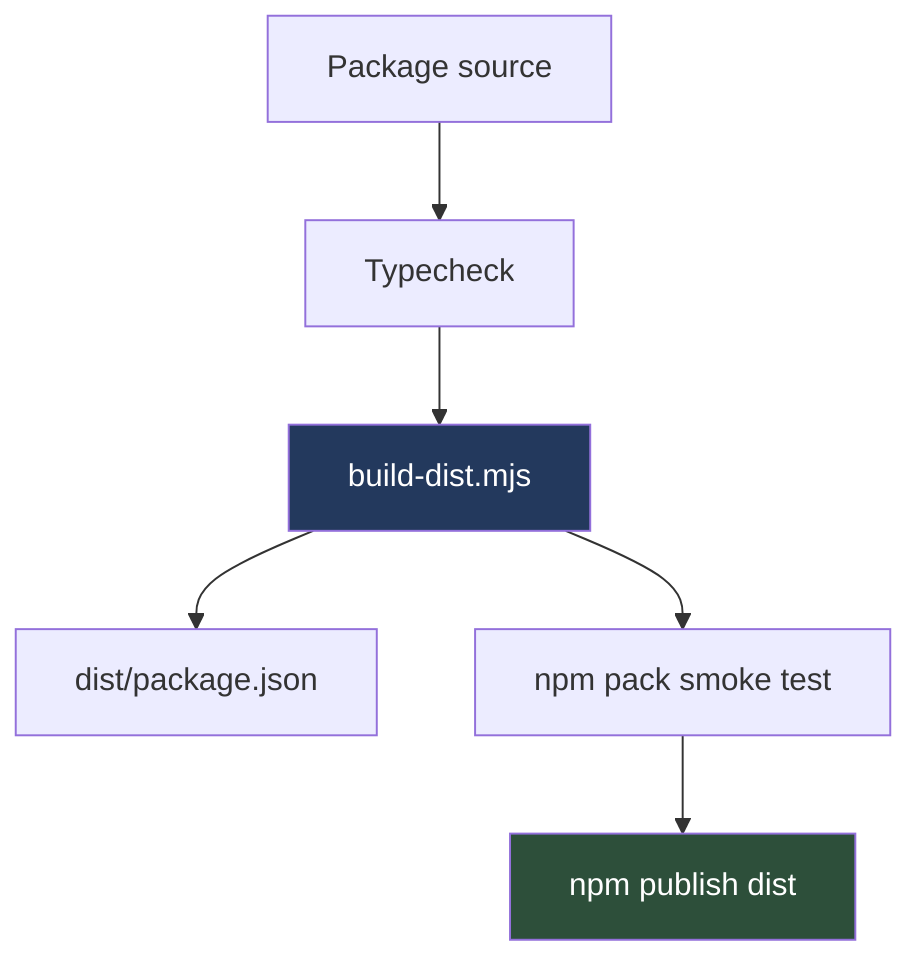
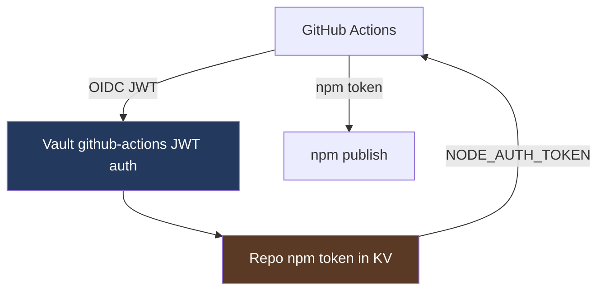
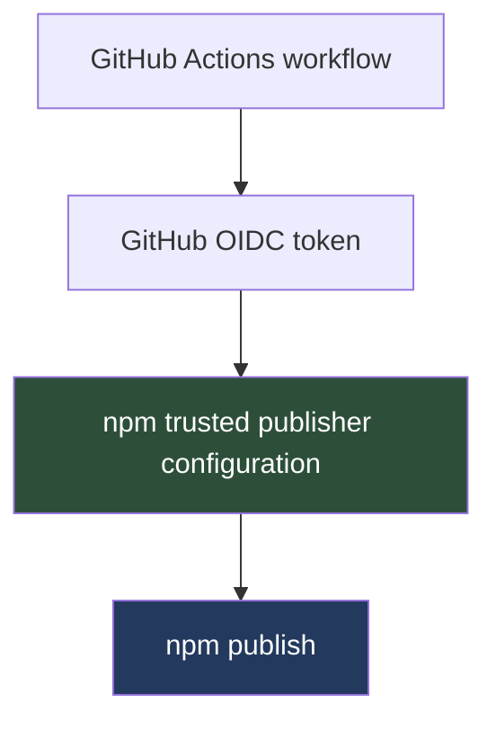
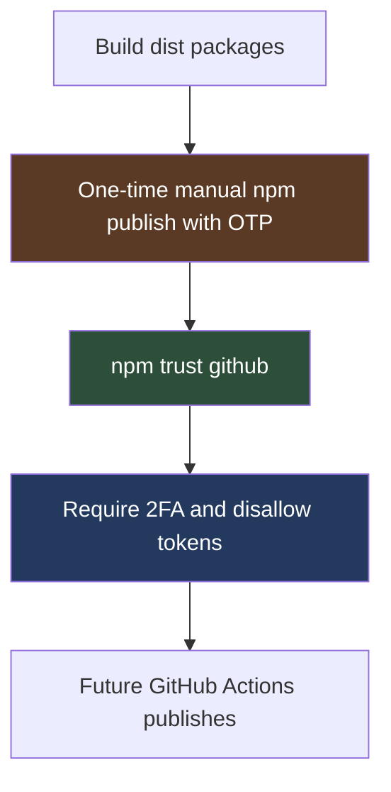

# Trusted npm Publishing for Go Go Golems React Packages

This report explains the migration from prototype React packages to public npm packages with tokenless GitHub Actions publishing. It covers the package build system, npm package metadata, GitHub Actions workflows, npm Trusted Publishing, package-level token lockdown, and the validation sequence we used to prove that the system works. The immediate projects were `go-go-golems/react-chat` and `go-go-golems/go-go-os-frontend`, but the process is reusable for any future Go Go Golems package family.

> [!summary]
> - `@go-go-golems/chat-provider` and `@go-go-golems/chat-overlay` were published as compiled npm packages from the new `go-go-golems/react-chat` repository.
> - Both `react-chat` and `go-go-os-frontend` now publish through npm Trusted Publishing, using GitHub Actions OIDC directly instead of long-lived npm tokens from Vault.
> - The migration exposed an important sequence: first make the package publishable, then bootstrap package existence, then configure trusted publishing, then disallow token publishing, then verify a real CI/CD publish of a new version.
> - The next time we do this, the critical rule is to distinguish package artifact correctness from publication authentication. Both must be tested independently.

## Why this report exists

The initial request was to publish the React packages under `2026-05-29--chatbot-overlay-glm/packages/` to npm. That request looked like a package metadata task, but the actual system was broader. A public npm package needs a stable repository identity, a repeatable build artifact, package metadata that describes the artifact correctly, CI that validates the artifact, a safe publish workflow, npm-side authorization, and a post-publication security posture.

The project also changed direction during the work. We first copied the existing `go-go-os-frontend` model, which used GitHub Actions OIDC to retrieve an npm token from Vault and then passed that token to `npm publish`. That model was already safer than storing an npm token directly in GitHub secrets, but npm Trusted Publishing made a better target available. In the final state, GitHub Actions uses OIDC directly with npm. Vault no longer supplies a `NODE_AUTH_TOKEN` for these publish workflows.

The important lesson is that trusted publishing is not a workflow-only setting. It is a relationship between an npm package and a specific CI workflow. The workflow must request an OIDC token, npm must know which workflow is trusted, and the package must already exist before the CLI can configure trust. That package-existence requirement determines the bootstrap sequence for new packages.

## Final state

The React chat repository was renamed and transferred from the prototype repository name to the final organization repository:

```text
old: git@github.com:wesen/2026-05-29--chatbot-overlay-glm.git
new: git@github.com:go-go-golems/react-chat.git
```

The published packages are:

```text
@go-go-golems/chat-provider
@go-go-golems/chat-overlay
```

The first manual bootstrap publish created `0.1.0`. After trusted publishing was configured and token publishing was disabled, GitHub Actions published a new version under the `next` dist-tag:

```text
@go-go-golems/chat-provider: latest=0.1.0, next=0.1.1
@go-go-golems/chat-overlay:  latest=0.1.0, next=0.1.1
```

For `go-go-os-frontend`, the publish workflow was also converted to tokenless trusted publishing. A new version of `@go-go-golems/os-core` was published from GitHub Actions under `next`:

```text
@go-go-golems/os-core: latest=0.1.2, next=0.1.3
```

The relevant workflow runs were:

| Repository | Workflow run | What it proved |
|---|---:|---|
| `go-go-golems/react-chat` | `26778779490` | GitHub Actions published `chat-provider@0.1.1` and `chat-overlay@0.1.1` through npm Trusted Publishing. |
| `go-go-golems/go-go-os-frontend` | `26778852213` | GitHub Actions published `os-core@0.1.3` through npm Trusted Publishing. |
| `go-go-golems/go-go-os-frontend` | `26778838477` | Push CI passed after the `os-core` version bump. |

## The package system we published

`react-chat` contains two related packages. The packages are intentionally separate because they expose different responsibilities.

`@go-go-golems/chat-provider` is the runtime package. It owns the React provider, Redux store, websocket manager, chat client, frontend tool runtime, widget registry, and timeline projection APIs. A consumer can use it without the default overlay UI if they want their own presentation layer.

`@go-go-golems/chat-overlay` is the UI package. It depends on the provider package and exports the floating chat UI components plus the default CSS theme. It is the package a consumer reaches for when they want the default embedded chat panel.

The relationship is straightforward:

```mermaid
flowchart TD
  App[Consumer React app]
  Provider[@go-go-golems/chat-provider]
  Overlay[@go-go-golems/chat-overlay]
  Backend[Chat backend APIs]
  WS[WebSocket timeline stream]

  App --> Provider
  App --> Overlay
  Overlay --> Provider
  Provider --> Backend
  Provider --> WS

  style Provider fill:#23395d,color:#fff
  style Overlay fill:#2d4f3a,color:#fff
  style Backend fill:#5a3a24,color:#fff
  style WS fill:#5a3a24,color:#fff
```

The provider exposes a client API with operations such as `connect`, `send`, `stop`, `open`, `close`, `toggle`, `reset`, and `tools`. It creates sessions lazily, connects to the websocket stream, syncs frontend tool manifests, submits tool results, and projects backend timeline events into frontend state. The overlay reads that state and calls those client methods.

A minimal consumer looks like this:

```tsx
import { ChatProvider } from '@go-go-golems/chat-provider';
import { ChatPanel } from '@go-go-golems/chat-overlay';
import '@go-go-golems/chat-overlay/theme/retro-mac.css';

export function App() {
  return (
    <ChatProvider config={{ basePrefix: '' }}>
      <main>Your application</main>
      <ChatPanel />
    </ChatProvider>
  );
}
```

That code also defines the publishing contract. The package must ship JavaScript modules, TypeScript declarations, and CSS assets in a form that a clean Vite application can install and build. A package that only works inside the source monorepo is not a public npm package.

## Why compiled `dist/` packages were necessary

The source manifests originally exported TypeScript source files directly:

```json
{
  "exports": {
    ".": "./src/index.ts",
    "./theme/retro-mac.css": "./src/theme/retro-mac.css"
  }
}
```

That shape is convenient for workspace development. It is not a reliable public npm contract. Consumers should not need to compile TypeScript from `node_modules`, and package dependencies such as `workspace:*` cannot be published to npm. The build system therefore creates a publish artifact in each package's `dist/` directory and publishes that directory, not the package source directory.

The `build-dist.mjs` script performs the important transformations:

```text
source export:       ./src/index.ts
runtime export:      ./index.js
type export:         ./index.d.ts
workspace dep:       workspace:*
published dep:       0.1.1 or another concrete semver version
CSS source asset:    ./src/theme/retro-mac.css
CSS publish asset:   ./theme/retro-mac.css
```

The publication pipeline is:



The generated `dist/package.json` for `chat-overlay` is the key artifact to inspect. It must contain a concrete dependency on the provider package:

```json
{
  "name": "@go-go-golems/chat-overlay",
  "version": "0.1.1",
  "exports": {
    ".": "./index.js",
    "./theme/retro-mac.css": "./theme/retro-mac.css"
  },
  "dependencies": {
    "@go-go-golems/chat-provider": "0.1.1",
    "react-redux": "^9.3.0"
  }
}
```

This dependency rewrite is not optional. If `workspace:*` reaches npm, consumers cannot install the package from the registry.

## The CSS failure that changed the package artifact

The clean consumer smoke test caught a problem that ordinary workspace tests did not catch. The overlay theme originally started with Tailwind-specific CSS:

```css
@import "tailwindcss";

@theme {
  --font-mono: "Menlo", "Monaco", "Courier New", monospace;
  --color-mac-black: #000000;
}
```

A consumer importing the CSS from `node_modules` failed during Vite build because the consumer project did not have Tailwind configured to process that package CSS:

```text
Unable to resolve `@import "tailwindcss"` from .../node_modules/@go-go-golems/chat-overlay/theme
Error: [postcss] ENOENT: no such file or directory, open 'tailwindcss'
```

The fix was to make the exported theme CSS self-contained:

```css
:root {
  --font-mono: "Menlo", "Monaco", "Courier New", monospace;
  --font-sans: "Chicago", "Geneva", "Helvetica Neue", sans-serif;

  --color-mac-black: #000000;
  --color-mac-white: #ffffff;
  --color-mac-gray-1: #333333;
  --color-mac-gray-2: #666666;
  --color-mac-gray-3: #999999;
  --color-mac-gray-4: #cccccc;
  --color-mac-gray-5: #eeeeee;
}
```

This is a general packaging rule: exported CSS should either be plain CSS or should clearly document its required processor. For a default UI package, plain CSS is the safer contract.

## Authentication model before and after

The first implementation copied the existing `go-go-os-frontend` pattern. That pattern used GitHub Actions OIDC to authenticate to Vault, then read an npm token from a repo-specific KV path, then passed that token to npm:



That design is controlled and auditable, but it still depends on a long-lived npm token. The token can expire, lose package permissions, or be deleted. We hit that failure: Vault access worked, but npm rejected the token when creating new scoped packages.

The final design uses npm Trusted Publishing:



The workflow keeps `permissions.id-token: write`, but it no longer reads a Vault secret and no longer sets `NODE_AUTH_TOKEN`. npm CLI detects the OIDC environment and exchanges the workflow identity for a short-lived publish credential. The npm package must have a trusted publisher configuration matching the workflow identity.

The trusted publisher fields for the React chat packages are:

```text
repository:  go-go-golems/react-chat
workflow:    publish-npm.yml
environment: npm-production
provider:    GitHub Actions
```

The trusted publisher fields for the go-go-os packages are:

```text
repository:  go-go-golems/go-go-os-frontend
workflow:    publish-npm.yml
environment: npm-production
provider:    GitHub Actions
```

## The tokenless workflow

The essential workflow properties are:

```yaml
permissions:
  contents: read
  id-token: write

environment: npm-production
```

The workflow must use a new enough Node and npm combination. We added an explicit npm upgrade step:

```yaml
- name: Upgrade npm for trusted publishing
  run: npm install -g npm@^11.10.0
```

The publish step no longer receives an npm token:

```yaml
- name: Publish selected packages to npmjs
  shell: bash
  env:
    CONFIRM_LATEST_PUBLISH: ${{ inputs.confirm_latest_publish == 'CONFIRM_LATEST' && 'true' || 'false' }}
  run: |
    set -euo pipefail
    PUBLISH_ARGS=(--tag "${{ inputs.npm_tag }}")
    if [ "${{ inputs.skip_existing }}" = "true" ]; then
      PUBLISH_ARGS+=(--skip-existing)
    fi
    if [ "${{ inputs.dry_run }}" = "true" ]; then
      PUBLISH_ARGS+=(--dry-run)
    fi
    node scripts/packages/publish-npm-package-set.mjs all "${PUBLISH_ARGS[@]}"
```

The script still adds `--provenance` for real publishes. With trusted publishing, npm can also generate provenance automatically, but keeping explicit provenance behavior documents the intent and preserves the behavior used by the existing package scripts.

## The bootstrap problem for new packages

`npm trust` has a package-existence prerequisite. The CLI cannot configure a trusted publisher for a package that does not exist on npm yet. This produced a clear failure when trying to trust `@go-go-golems/chat-overlay` before publishing it:

```text
npm error 404 Not Found - POST https://registry.npmjs.org/-/package/@go-go-golems%2fchat-overlay/trust
```

The correct sequence for new packages is therefore:



For React chat, the first manual publish created both packages. After the packages existed, we configured trusted publishing, disabled token publishing at the package level, and verified that GitHub Actions could publish `0.1.1` under `next` without tokens.

## Package token lockdown

Trusted publishing removes the need for a long-lived npm publish token, but npm still allows token-based publication unless package settings are changed. The security hardening step is:

```text
Package → Settings → Publishing access → Require two-factor authentication and disallow tokens
```

The CLI equivalent is:

```bash
npx -y npm@latest access set mfa=publish @go-go-golems/chat-provider
npx -y npm@latest access set mfa=publish @go-go-golems/chat-overlay
```

This operation requires fresh npm 2FA/web authentication. It is separate from trusted publisher configuration. The important rule is not to disallow tokens until a tokenless publish path has been verified. If token publishing is disabled before trusted publishing is configured correctly, CI publication fails and the package must be recovered through an interactive account with sufficient permissions.

## The validation sequence

The validation sequence used for React chat had five levels. Each level catches a different class of failure.

| Level | Command or action | Failure class caught |
|---|---|---|
| Static package validation | `pnpm -r typecheck` | TypeScript and public type errors. |
| Unit/runtime validation | `pnpm test` | Existing runtime tests. |
| Artifact validation | `npm run build:publish` and `npm run pack:smoke` | Missing files, bad exports, leaked stories/tests, bad `workspace:*` rewrites. |
| Consumer validation | Clean Vite install, `pnpm typecheck`, `pnpm build` | Registry/package consumption failures, CSS processing problems, declaration resolution issues. |
| CI publish validation | GitHub Actions non-dry-run publish under `next` | OIDC trust, npm package permissions, immutable version publication. |

The consumer validation is the most important step to preserve in future migrations. The Tailwind CSS failure would not have been found by package typechecking alone, because it only occurred when a separate project imported the published CSS from `node_modules`.

The clean consumer test used this shape:

```bash
mkdir /tmp/react-chat-npm-smoke
cd /tmp/react-chat-npm-smoke
pnpm add @go-go-golems/chat-provider @go-go-golems/chat-overlay react react-dom
pnpm add -D typescript vite @vitejs/plugin-react @types/react @types/react-dom
pnpm typecheck
pnpm build
```

The test source imported both the provider and overlay packages and imported the CSS subpath:

```tsx
import { ChatProvider, useChatClient, defineWidget } from '@go-go-golems/chat-provider';
import { ChatPanel } from '@go-go-golems/chat-overlay';
import '@go-go-golems/chat-overlay/theme/retro-mac.css';
```

This specific import set matters because it exercises the root provider export, the root overlay export, and the CSS subpath export.

## What changed in the repositories

The React chat repository received these main changes:

| Area | Files | Purpose |
|---|---|---|
| Package metadata | `packages/chat-provider/package.json`, `packages/chat-overlay/package.json` | Make packages public, add repository metadata, publish config, files, exports, and build scripts. |
| Package documentation | `README.md`, package READMEs | Document install, exports, and backend expectations. |
| Build scripts | `scripts/packages/build-dist.mjs`, `pack-smoke.mjs`, `publish-npm-package-set.mjs`, `package-sets.mjs` | Generate and publish compiled package artifacts. |
| CI/CD | `.github/workflows/ci.yml`, `.github/workflows/publish-npm.yml` | Validate packages and publish through trusted publishing. |
| CSS artifact | `packages/chat-overlay/src/theme/retro-mac.css` | Remove Tailwind directives from exported CSS. |
| Ticket docs | `ttmp/2026/06/01/CHATOVERLAY-013...` | Record design, sources, diary, and validation. |

The go-go-os-frontend repository received two focused changes:

| Area | Files | Purpose |
|---|---|---|
| Publish workflow | `.github/workflows/publish-npm.yml` | Remove Vault token retrieval and use npm Trusted Publishing. |
| Version proof | `packages/os-core/package.json` | Publish `os-core@0.1.3` under `next` to prove real tokenless CI/CD publishing. |

## What we learned

The first lesson is that `npm publish --dry-run` is not enough. A dry-run validates package shape and command construction, but it does not prove that npm will accept a real publish. Real publishes exercise package creation, package ownership, trusted publisher matching, token restrictions, provenance, and immutable version creation.

The second lesson is that npm error messages need to be read in terms of the layer that produced them. Vault failures happen before `npm publish`. Trusted publisher mismatches happen during npm authentication. Missing package trust setup can show up as `E404`. Token permission failures can also show up as `E404` when publishing a new scoped package. The same status code can represent different missing preconditions.

The third lesson is that trusted publishing and token lockdown are separate operations. A package can have a trusted publisher and still allow token publication. A workflow can be tokenless while package settings still permit tokens. The final secure state requires all three conditions:

- The package has a trusted publisher matching the GitHub workflow.
- The workflow does not pass `NODE_AUTH_TOKEN` or another npm token.
- The package settings disallow token publishing.

The fourth lesson is that package artifacts should be tested from outside the monorepo. A workspace can hide missing dependencies, source-only assumptions, CSS processor assumptions, and `workspace:*` dependency leaks. A clean consumer project is the lowest-cost way to find these errors before users find them.

## How to do this next time

Start by deciding whether the package is source-only or compiled. Most React libraries should publish compiled JavaScript and declaration files. Source-only publication is appropriate only when the consumer must process package source, such as a Tailwind package that intentionally requires content scanning.

Then prepare the package metadata:

```json
{
  "name": "@go-go-golems/example",
  "version": "0.1.0",
  "private": false,
  "type": "module",
  "license": "MIT",
  "repository": {
    "type": "git",
    "url": "git+https://github.com/go-go-golems/example-repo.git",
    "directory": "packages/example"
  },
  "publishConfig": {
    "access": "public"
  },
  "files": [
    "**/*.js",
    "**/*.d.ts",
    "**/*.css",
    "**/*.json",
    "README.md"
  ]
}
```

Add the publish artifact builder and pack smoke test. For compiled packages, publish from `dist/`, not from the source package root. Confirm that `dist/package.json` has runtime `.js` exports, `.d.ts` type paths, and concrete dependency versions.

Use a manual workflow first:

```yaml
on:
  workflow_dispatch:

permissions:
  contents: read
  id-token: write

jobs:
  publish-npm:
    runs-on: ubuntu-latest
    environment: npm-production
```

Install dependencies, typecheck, test, build artifacts, and run pack smoke before publishing. Do not read an npm token. Use npm CLI `>=11.10.0` so trusted publishing support is available.

For existing packages, configure trusted publishing:

```bash
npx -y npm@latest trust github @go-go-golems/example \
  --repo go-go-golems/example-repo \
  --file publish-npm.yml \
  --env npm-production \
  --allow-publish
```

For new packages, perform the one-time bootstrap publish first. Publish the dependency package before the package that depends on it:

```bash
npm publish packages/provider/dist --access public --tag next --otp=<OTP>
npm publish packages/overlay/dist --access public --tag next --otp=<OTP>
```

After the package exists, configure trusted publishing, then set package publishing access to disallow tokens. Only then run a real GitHub Actions publish of a new version under `next`.

The final checklist is:

- The package is installable from npm in a clean consumer project.
- `npm trust list <package>` shows the expected repository, workflow file, and environment.
- The workflow does not contain `NODE_AUTH_TOKEN`, `NPM_TOKEN`, or a Vault npm token read step.
- Package settings use `Require two-factor authentication and disallow tokens`.
- A new version has been published from GitHub Actions under `next`.
- `latest` is promoted only after install and build validation.

## Working rules

- Publish from generated artifacts unless the package explicitly needs source publication.
- Test package consumption from a clean external project before the first publish.
- Configure npm Trusted Publishing as soon as the package exists.
- Remove npm tokens from CI before disallowing package tokens.
- Use `next` for proof publishes and reserve `latest` for explicit promotion.
- Treat package settings as part of the release system. A workflow change alone is not a complete security migration.
- Record workflow run IDs and npm dist-tags in the diary or release notes.

## Cleanup completed after migration

After the trusted publishing workflows were verified, the obsolete Vault-backed npm publish credentials for `react-chat` and `go-go-os-frontend` were removed. The cleanup deleted the repo-specific Vault KV metadata paths, JWT auth roles, and policies that existed only to hand long-lived npm tokens to GitHub Actions:

```text
kv/ci/github/react-chat/npm-token
auth/github-actions/role/react-chat-npm-publish
gha-react-chat-npm-publish

kv/ci/github/go-go-os-frontend/npm-token
auth/github-actions/role/go-go-os-frontend-npm-publish
gha-go-go-os-frontend-npm-publish
```

The `dmeta` / PBUI Vault material was not removed in this cleanup because PBUI was not part of the verified tokenless publish sequence described here.

## Related notes

- [[NPM Publishing for Go Go Golems Packages with Vault OIDC]] — historical Vault-backed design, now superseded for `react-chat` and `go-go-os-frontend`.

## Related repositories and files

- `/home/manuel/workspaces/2026-05-29/chatbot-react/2026-05-29--chatbot-overlay-glm`
- `/home/manuel/workspaces/2026-05-29/chatbot-react/2026-05-29--chatbot-overlay-glm/.github/workflows/publish-npm.yml`
- `/home/manuel/workspaces/2026-05-29/chatbot-react/2026-05-29--chatbot-overlay-glm/scripts/packages/build-dist.mjs`
- `/home/manuel/workspaces/2026-05-29/chatbot-react/2026-05-29--chatbot-overlay-glm/packages/chat-provider/package.json`
- `/home/manuel/workspaces/2026-05-29/chatbot-react/2026-05-29--chatbot-overlay-glm/packages/chat-overlay/package.json`
- `/home/manuel/workspaces/2026-05-29/chatbot-react/go-go-os-frontend`
- `/home/manuel/workspaces/2026-05-29/chatbot-react/go-go-os-frontend/.github/workflows/publish-npm.yml`
- `/home/manuel/workspaces/2026-05-29/chatbot-react/go-go-os-frontend/packages/os-core/package.json`
