# XGOJA-016: Embedded Assets in Generated xgoja Binaries

`XGOJA-016` added a complete embedded-assets path to generated xgoja binaries. A generated binary can now include local project files at build time, expose them to JavaScript as a read-only filesystem module, and serve bundled static web assets through the Express-style HTTP module without requiring the original source directory at runtime.

The implementation matters because xgoja is a composition system. A generated binary is not only a compiled Go program; it is a selected set of provider packages, runtime profiles, JavaScript modules, commands, help pages, JavaScript verbs, and now arbitrary asset trees. Embedded assets had to fit that model without weakening the capability boundaries around host filesystem access.

> [!summary]
> The final design has four important properties:
> 1. `assets:` declares build-time file trees that are copied into the generated Go workspace and embedded with `//go:embed all:xgoja_embed/assets/*`.
> 2. JavaScript reads bundled files through explicit module instances such as `require("fs:assets")`; host filesystem access remains a separate instance such as `require("fs:host")`.
> 3. Embedded asset filesystems are read-only and return `EROFS` for mutating operations.
> 4. Static HTTP serving uses `app.staticFromAssetsModule("/static", require("fs:assets"), "/app/public")`, so bundled HTML, CSS, and JavaScript can be served directly from the generated binary.

The reference repository is:

- `/home/manuel/workspaces/2026-06-01/xgoja-embed-assets/go-go-goja`

The reference ticket workspace is:

- `/home/manuel/workspaces/2026-06-01/xgoja-embed-assets/go-go-goja/ttmp/2026/06/01/XGOJA-016--embed-files-into-generated-xgoja-binaries`

The runnable example is:

- `/home/manuel/workspaces/2026-06-01/xgoja-embed-assets/go-go-goja/examples/xgoja/10-embedded-assets-fs`

## Why this feature exists

Generated xgoja binaries already knew how to embed two specialized source types: local JavaScript verb trees and local Glazed help pages. Both follow the same basic sequence. The build command copies a local directory into the generated Go workspace, generated `main.go` embeds that directory with `go:embed`, and the generated app reads it from an `embed.FS` at runtime.

That solved command and documentation packaging, but it did not solve application asset packaging. A JavaScript script running inside a generated binary could not read a bundled template, static web file, configuration default, fixture, seed file, or other arbitrary asset through the normal filesystem API. The user still had to ship a sibling directory next to the binary, or write a custom provider module for each asset category.

The implementation needed to satisfy several constraints at the same time:

- The generated binary should be self-contained for declared assets.
- JavaScript should use a familiar filesystem API rather than a special one-off asset API.
- Runtime profiles should opt in explicitly; assets should not be globally visible to every command.
- Embedded assets should not grant host filesystem access.
- Host filesystem access should remain guarded by `config.allow: true`.
- Web/static assets should support dot directories such as `.well-known`.
- Unsupported filters such as `include` and `exclude` should be rejected rather than silently ignored.

These constraints shaped the final design. The feature is not simply `go:embed` attached to generated `main.go`. It is a buildspec addition, a generator change, a runtime host-services addition, a provider API change, a backend refactor of the `fs` module, and an HTTP serving extension.

## The final user-facing shape

The central user-facing shape is a top-level `assets:` section plus runtime module aliases:

```yaml
packages:
  - id: go-go-goja-host
    import: github.com/go-go-golems/go-go-goja/pkg/xgoja/providers/host
  - id: go-go-goja-http
    import: github.com/go-go-golems/go-go-goja/pkg/xgoja/providers/http

assets:
  - id: app-assets
    path: ./assets
    embed: true

runtimes:
  main:
    modules:
      - package: go-go-goja-host
        name: fs
        as: fs:assets
        config:
          embedded:
            allow: true
            mounts:
              - asset: app-assets
                mount: /app

      - package: go-go-goja-host
        name: fs
        as: fs:host
        config:
          allow: true

      - package: go-go-goja-http
        name: express
```

The `as` field is the actual JavaScript `require()` name. It is not an additional alias layered on top of `name`. The entry above registers `require("fs:assets")`; it does not also register `require("fs")`. This rule is important because it makes capability boundaries visible in JavaScript code:

```js
const assets = require("fs:assets")
const host = require("fs:host")

const config = JSON.parse(assets.readFileSync("/app/config/default.json", "utf8"))
host.writeFileSync("out.json", JSON.stringify(config), "utf8")
```

A static server script can then use the embedded filesystem module directly:

```js
const express = require("express")
const assets = require("fs:assets")

const app = express.app()
app.staticFromAssetsModule("/static", assets, "/app/public")
app.get("/", (_req, res) => res.redirect("/static/"))
app.get("/api/config", (_req, res) => {
  const config = JSON.parse(assets.readFileSync("/app/config/default.json", "utf8"))
  res.json({ ok: true, config })
})
```

The generated command is run with `--keep-alive`:

```bash
./dist/embedded-assets-fs run scripts/serve-static-assets.js --http-listen 127.0.0.1:8787 --keep-alive
```

The script registers routes and returns. The `--keep-alive` flag keeps the runtime open after setup, so the HTTP server can continue dispatching requests into the registered route handlers.

## Architecture overview

The implementation has five layers. Each layer has a narrow responsibility, and the feature works because no layer tries to own the entire problem.

| Layer | Main files | Responsibility |
|---|---|---|
| Buildspec schema and validation | `cmd/xgoja/internal/buildspec/spec.go`, `load.go`, `validate.go` | Load `assets:`, validate IDs and paths, reject unsupported filters. |
| Generator | `cmd/xgoja/internal/generate/generate.go`, `main.go`, `templates/main.go.tmpl` | Copy asset directories, rewrite generated roots, emit `go:embed` declarations. |
| App host services | `pkg/xgoja/app/assets.go`, `factory.go`, `host.go` | Store the embedded `fs.FS`, resolve asset IDs, pass services to provider module factories. |
| Filesystem module | `modules/fs/*.go` | Expose backend-backed `fs` instances, including read-only embedded backends. |
| HTTP and Express integration | `pkg/gojahttp/host.go`, `modules/express/express.go`, `modules/fs/http.go` | Serve embedded filesystem modules directly through `http.FileServer`. |

The resulting data flow is:

```mermaid
flowchart TD
    Spec[xgoja.yaml assets section]
    Load[buildspec LoadFile and Validate]
    Copy[copy embedded assets into generated workspace]
    Embed[generated main.go go:embed all:xgoja_embed/assets/*]
    App[app.Host EmbeddedAssets]
    Store[AssetStore id to fs root mapping]
    Provider[host provider fs module factory]
    Backend[ReadOnlyFSBackend]
    JS[JavaScript require fs:assets]
    Express[express staticFromAssetsModule]
    HTTP[gojahttp static handler]
    Client[HTTP client]

    Spec --> Load
    Load --> Copy
    Copy --> Embed
    Embed --> App
    App --> Store
    Store --> Provider
    Provider --> Backend
    Backend --> JS
    JS --> Express
    Express --> HTTP
    HTTP --> Client

    style Embed fill:#1a3a5c,stroke:#4aa3ff
    style Backend fill:#143d2a,stroke:#4ade80
    style HTTP fill:#4d3b14,stroke:#e5b84a
```



The most important design decision is that embedded assets are not exposed as a global singleton. They are exposed through runtime-selected module instances. A command whose runtime profile does not include `fs:assets` cannot read them. A command whose runtime profile includes `fs:assets` but not `fs:host` can read embedded files but cannot write to the host filesystem.

## Buildspec and generator changes

The buildspec layer adds an `assets:` list. Each asset has an `id`, a `path`, an `embed` flag, and an optional `description`. The implementation intentionally rejects `include` and `exclude` fields. That rejection is a correctness rule, not just a schema preference. If a spec accepted `exclude: [secrets/**]` but the generator still copied the whole directory, the spec would state a security property that the binary did not satisfy.

The loader therefore performs a YAML-node scan before typed unmarshalling:

```go
func unsupportedAssetFieldsReport(data []byte) (*Report, error) {
    report := &Report{}
    root := yaml.Node{}
    if err := yaml.Unmarshal(data, &root); err != nil {
        return nil, err
    }
    // Find assets[].include and assets[].exclude before normal unmarshal.
    // yaml.Unmarshal into structs would otherwise ignore unknown fields.
}
```

This validation happens before the normal typed `yaml.Unmarshal`. The reason is specific to YAML unmarshalling behavior: unknown fields are ignored by default. A post-unmarshal validator cannot detect fields that were never retained in the typed struct.

The generator copies embedded assets into generated roots:

```text
xgoja_embed/assets/<sanitized-id>/...
```

It then rewrites the runtime JSON spec so the generated binary sees the generated embedded root rather than the developer's original source directory. This matches the existing jsverbs and help-doc embedding pattern.

Asset copying differs from jsverb/help copying in one important way. Asset trees preserve dot directories such as `.well-known`, while still skipping `node_modules`:

```go
copyDirWithOptions(dst, src, copyDirOptions{skipNodeModules: true})
```

The generated Go source uses:

```go
//go:embed all:xgoja_embed/assets/*
var embeddedAssets embed.FS
```

The `all:` prefix is required. Copying `.well-known/security.txt` into the generated workspace is not enough. Go's default embed patterns omit dot-prefixed and underscore-prefixed files and directories unless the pattern uses `all:`. The review process caught this in two stages: first dot directories had to be copied, then the generated embed pattern had to include them.

## Runtime host services and asset resolution

Generated `main.go` passes the embedded filesystem into the xgoja app host. The app layer builds an `AssetStore` from the runtime spec:

```go
type AssetStore struct {
    fsys   fs.FS
    assets map[string]AssetSourceSpec
}

func (s *AssetStore) ResolveAsset(id string) (fs.FS, string, bool) {
    asset, ok := s.assets[strings.TrimSpace(id)]
    if !ok || !asset.Embed || strings.TrimSpace(asset.Path) == "" {
        return nil, "", false
    }
    return s.fsys, asset.Path, true
}
```

This is the point where an asset ID becomes a concrete filesystem and root path. Provider modules do not need to know where generated assets live or how `go:embed` was declared. They ask the host services for an asset resolver.

The provider API change is important because it keeps embedded assets out of package-level global state. A provider module factory receives a `ModuleContext`. That context now carries host services. The host provider's `fs` module factory can therefore resolve `asset: app-assets` when constructing the backend for `fs:assets`.

The runtime profile remains the authority. The host may own an embedded filesystem, but JavaScript code can only access it through a selected module instance.

## The backend-backed filesystem module

Before this work, `modules/fs` called `os.ReadFile`, `os.WriteFile`, `os.Stat`, and related functions directly. That made the module a host-filesystem module by definition. Embedded assets required a different model: the JavaScript API should remain the same, but the storage implementation should vary.

The refactor introduced a `Backend` interface:

```go
type Backend interface {
    ReadFile(path string) ([]byte, error)
    WriteFile(path string, data []byte, mode os.FileMode) error
    Exists(path string) bool
    Mkdir(path string, recursive bool, mode os.FileMode) error
    ReadDir(path string) ([]string, error)
    Stat(path string) (fileStats, error)
    Remove(path string) error
    AppendFile(path string, data []byte, mode os.FileMode) error
    Rename(oldPath, newPath string) error
    CopyFile(src, dst string) error
    RemoveAll(path string) error
}
```

There are now two important backend implementations:

| Backend | Purpose | Mutation behavior |
|---|---|---|
| `OSBackend` | Normal host filesystem access. | Performs host filesystem writes. |
| `ReadOnlyFSBackend` | Embedded asset access through `io/fs`. | Returns `EROFS` for mounted paths. |

The module constructor accepts a name and backend:

```go
fsmod.New(
    fsmod.WithName("fs:assets"),
    fsmod.WithBackend(readOnlyBackend),
)
```

This is how one runtime can contain multiple instances of the same logical provider module:

```yaml
- package: go-go-goja-host
  name: fs
  as: fs:assets
  config:
    embedded:
      allow: true
      mounts:
        - asset: app-assets
          mount: /app

- package: go-go-goja-host
  name: fs
  as: fs:host
  config:
    allow: true
```

Each instance receives its own config and closes over its own backend. The JavaScript names are separate, the capabilities are separate, and code review can see which filesystem is being used at each call site.

## Virtual mounts and root mount correctness

The embedded backend maps virtual absolute paths to roots inside an `io/fs` tree. A mount such as `/app` means:

```text
/app/config/default.json
  -> embedded fs root + config/default.json
```

Root mounts are also supported:

```text
/config/default.json with mount /
  -> embedded fs root + config/default.json
```

This required explicit handling. The first implementation normalized `mount: /` to an empty string and skipped it, which produced a runtime that started successfully but returned `ENOENT` for every asset read. The fix preserves `/` and treats it as a special case in resolution:

```go
if mount.Mount == "/" {
    rel := strings.TrimPrefix(clean, "/")
    if rel == "" {
        rel = "."
    }
    return mount.FS, path.Join(mount.Root, rel), true
}
```

The backend sorts mounts by descending mount path length. That preserves expected behavior when mounts overlap: a more specific mount path is considered before a broader one.

## Read-only semantics

Embedded assets are immutable. The binary contains the bytes that were embedded at build time. A write to `fs:assets` cannot mutate that binary, and pretending otherwise would produce misleading behavior.

The backend therefore returns filesystem errors with Node-style fields. A write to a mounted embedded path produces `EROFS`:

```js
const assets = require("fs:assets")
try {
  assets.writeFileSync("/app/config/default.json", "nope", "utf8")
} catch (e) {
  console.log(e.code) // EROFS
}
```

Missing paths still produce `ENOENT`. This distinction matters because JavaScript code can distinguish a missing asset from an attempt to mutate a read-only filesystem.

The initial implementation supports reads, directory listings, `exists`, and `stat` for embedded assets. The same sync and async JavaScript API surface works because both paths delegate to the same backend interface.

## Direct static serving from embedded fs modules

The static-serving work followed the first embedded asset implementation. The first server example staged embedded files to a host directory: read from `fs:assets`, write to `.xgoja-static` with `fs:host`, then call `app.static`. That worked, but it was not the right long-term API. The embedded filesystem already had the bytes, and `net/http` can serve `http.FS` values directly.

The final API is:

```js
const express = require("express")
const assets = require("fs:assets")

const app = express.app()
app.staticFromAssetsModule("/static", assets, "/app/public")
```

This keeps `app.static(prefix, directory)` for real host filesystem directories. It adds a separate method for embedded asset modules. The separate name is deliberate: host directory serving and embedded module serving have different trust and lifecycle properties.

The Go side needs to verify that the JavaScript value is a filesystem module backed by embedded assets. The fs module exports a hidden non-enumerable marker:

```go
const backendExportKey = "__go_go_goja_fs_backend"
```

`modules/fs/http.go` reads that marker and accepts only `*ReadOnlyFSBackend` values:

```go
func StaticHandlerFromAssetsModule(vm *goja.Runtime, moduleValue goja.Value, root string) (http.Handler, error) {
    backend, ok := readOnlyBackendFromModule(vm, moduleValue)
    if !ok {
        return nil, fmt.Errorf("static asset module must be a fs module backed by embedded read-only assets")
    }
    return http.FileServer(http.FS(&readOnlyHTTPFS{backend: backend, root: cleanVirtualPath(root)})), nil
}
```

The Express module wires this into the app object:

```go
_ = obj.Set("staticFromAssetsModule", func(prefix string, assetsModule goja.Value, root string) error {
    handler, err := fsmod.StaticHandlerFromAssetsModule(vm, assetsModule, root)
    if err != nil {
        return err
    }
    r.host.RegisterStaticHandler(prefix, handler)
    return nil
})
```

The HTTP adapter implements the minimal `fs.FS` behavior that `http.FileServer` needs: `Open`, file `Read`, file `Stat`, directory `ReadDir`, and sorted directory entries. The adapter reads through `ReadOnlyFSBackend`, so it inherits the same mount resolution and read-only behavior as JavaScript `fs:assets` calls.

## Runtime lifecycle and `--keep-alive`

The built-in generated `run` command originally had a one-shot lifecycle:

1. Create runtime.
2. Load and execute a JavaScript file.
3. Close runtime.

That is correct for scripts that compute a result, write a file, or run a short task. It is not correct for HTTP server setup scripts. A script can register routes and static handlers quickly, then return. If `run` closes the runtime immediately afterward, the HTTP server is shut down before any useful request can be served.

The implementation added a `--keep-alive` flag to generated `run` commands. With this flag, `run` executes the script and then waits on the Go side for Ctrl-C or SIGTERM:

```go
if keepAlive {
    fmt.Fprintln(os.Stderr, "xgoja run: runtime is alive; press Ctrl-C to stop")
    return waitForKeepAlive(ctx)
}
```

This detail matters for goja runtime ownership. A JavaScript-side infinite loop or sleep loop would keep the process alive, but it could also keep the runtime owner occupied. HTTP handlers need to schedule callbacks onto that owner. The Go-side keep-alive wait lets the script finish setup while leaving the runtime owner available for request handling.

## The runnable example

The example at `examples/xgoja/10-embedded-assets-fs` demonstrates the complete path. Its `xgoja.yaml` declares both providers, the asset tree, the fs aliases, and the express module:

```yaml
packages:
  - id: go-go-goja-host
    import: github.com/go-go-golems/go-go-goja/pkg/xgoja/providers/host
  - id: go-go-goja-http
    import: github.com/go-go-golems/go-go-goja/pkg/xgoja/providers/http
assets:
  - id: app-assets
    path: ./assets
    embed: true
runtimes:
  main:
    modules:
      - package: go-go-goja-host
        name: fs
        as: fs:assets
        config:
          embedded:
            allow: true
            mounts:
              - asset: app-assets
                mount: /app
      - package: go-go-goja-host
        name: fs
        as: fs:host
        config:
          allow: true
      - package: go-go-goja-http
        name: express
```

The static server script is small because the complex work is in the provider and fs layers:

```js
const express = require("express")
const assets = require("fs:assets")

const app = express.app()
app.staticFromAssetsModule("/static", assets, "/app/public")
app.get("/", (_req, res) => res.redirect("/static/"))
app.get("/api/config", (_req, res) => {
  const config = JSON.parse(assets.readFileSync("/app/config/default.json", "utf8"))
  res.json({ ok: true, config })
})
```

The smoke target builds the binary, runs the server on a test port, fetches the static site and API endpoint with `curl`, and stops the process:

```bash
make -C examples/xgoja/10-embedded-assets-fs serve-smoke
```

This is more than a documentation example. It exercises the generated binary, the embedded asset copy path, the `all:` embed pattern, the `fs:assets` backend, the HTTP provider, `staticFromAssetsModule`, and `--keep-alive` in one run.

## Implementation sequence

The feature was implemented in layers. This sequence is worth preserving because it kept the work testable at each step.

### 1. Add the schema and validation

The first step added `assets:` to both the build-time spec and the runtime app spec. Validation required unique IDs, existing local paths for embedded assets, and `embed: true`. Later feedback removed unsupported `include` and `exclude` fields entirely and added pre-unmarshal rejection.

### 2. Extend generation

The generator learned to copy embedded asset directories into `xgoja_embed/assets/<id>`, rewrite runtime spec paths, and emit `embeddedAssets embed.FS` only when needed. Later PR feedback changed the asset embed pattern to `all:xgoja_embed/assets/*` so dot directories are included.

### 3. Add app host services

The app host gained `EmbeddedAssets` options and an `AssetStore`. Provider module factories now receive host services through `ModuleContext`, allowing the host provider to resolve asset IDs without package globals.

### 4. Refactor `fs` around backends

The fs module moved from direct host filesystem calls to a backend interface. This preserved the JavaScript API while allowing separate `OSBackend` and `ReadOnlyFSBackend` implementations.

### 5. Wire host provider aliases

The host provider now builds different fs module instances from per-instance config. `config.allow: true` creates a host `OSBackend`. `config.embedded.allow: true` creates a read-only embedded backend. A single instance cannot combine both modes; users register separate aliases instead.

### 6. Add generated-program tests

Unit tests were not enough. The generated-program test builds a real generated xgoja app, reads embedded assets through `fs:assets`, writes through `fs:host`, verifies that plain `require("fs")` is absent, and checks dot-directory assets.

### 7. Add static serving

The first static server example staged files to the host filesystem. The final implementation added `staticFromAssetsModule`, `modules/fs/http.go`, and `RegisterStaticHandler`, so the Express module can serve embedded assets directly.

### 8. Document the workflow

The documentation set was updated in the user guide, tutorial, buildspec reference, Express module docs, and a dedicated static-asset HTTP tutorial. This was necessary because the workflow spans multiple concepts: `assets:`, runtime module aliases, provider configs, HTTP sections, `staticFromAssetsModule`, and `--keep-alive`.

## Failure modes that shaped the final design

### Accepting unsupported filters is unsafe

The first design considered `include` and `exclude` fields as future-facing schema fields. That was wrong for the initial implementation. If the generator does not enforce filters, the buildspec must not accept them. Otherwise, a user may write:

```yaml
assets:
  - id: app-assets
    path: ./assets
    embed: true
    exclude:
      - secrets/**
```

and believe the generated binary excludes those files. The final loader rejects these fields clearly:

```text
assets[0].include: asset include/exclude filters are not supported yet; remove this field
assets[0].exclude: asset include/exclude filters are not supported yet; remove this field
```

### Dot directories require both copy and embed support

Asset trees for web servers often include `.well-known`. Preserving that directory required two changes:

1. Asset copying must not skip dot directories.
2. Generated `go:embed` must use `all:`.

The first fix alone still failed at runtime because the file was present in the generated workspace but absent from the embedded `embed.FS`. The generated-program test caught this with `.well-known/security.txt`.

### Root mounts must not normalize to empty strings

`mount: /` is a valid and useful configuration. The initial implementation treated it as empty and skipped it. The final backend preserves `/` and resolves it explicitly.

### HTTP server setup needs host-side waiting

A route-registration script should be allowed to return after setup. Keeping the process alive in JavaScript can interfere with the runtime owner. `--keep-alive` solves this at the command layer by waiting outside the runtime owner while leaving the runtime alive.

### Host static directories and embedded static assets need different APIs

`app.static(prefix, directory)` remains the API for real host directories. Embedded modules use `app.staticFromAssetsModule(prefix, assetsModule, root)`. Keeping separate APIs avoids overloading one function with two different kinds of filesystem authority.

## Testing strategy

The validation strategy combined focused unit tests, generated-program tests, example smoke tests, lint, and full-suite runs.

| Test area | What it proves |
|---|---|
| `modules/fs` tests | Embedded backends support sync and async reads, root mounts, directory listings, stat, and read-only errors. |
| `pkg/xgoja/providers/host` tests | Runtime aliases such as `fs:assets` and `fs:host` receive separate configs and backends. |
| `cmd/xgoja/internal/generate` tests | Generated binaries include embedded assets, dot directories, and correct generated `go:embed` patterns. |
| `modules/express` tests | `staticFromAssetsModule` serves files from a read-only embedded fs module. |
| Example `serve-smoke` | A real generated binary serves bundled HTML, CSS, JS, and JSON over HTTP. |
| `golangci-lint` | Stale helpers such as `requireAllow` are removed and code remains lint-clean. |

The important validation commands were:

```bash
GOWORK=off go test ./modules/fs ./pkg/xgoja/providers/host ./cmd/xgoja/internal/generate -count=1
GOWORK=off go test ./... -count=1
GOWORK=off golangci-lint run ./pkg/xgoja/providers/host ./modules/fs ./cmd/xgoja/internal/generate
make -C examples/xgoja/10-embedded-assets-fs serve-smoke
```

The pre-push hook eventually ran full lint and tests successfully before the branch was pushed.

## Code locations to read first

A future reader should start with the runnable example and then read the implementation from the outside inward:

| Path | Why it matters |
|---|---|
| `examples/xgoja/10-embedded-assets-fs/xgoja.yaml` | Shows the intended user-facing config. |
| `examples/xgoja/10-embedded-assets-fs/scripts/serve-static-assets.js` | Shows the final JavaScript API for direct embedded static serving. |
| `cmd/xgoja/doc/09-tutorial-static-assets-http-server.md` | Explains the full user workflow. |
| `cmd/xgoja/internal/buildspec/load.go` | Rejects unsupported asset filter fields before typed unmarshal. |
| `cmd/xgoja/internal/generate/generate.go` | Copies embedded assets with asset-specific copy rules. |
| `cmd/xgoja/internal/generate/templates/main.go.tmpl` | Emits `//go:embed all:xgoja_embed/assets/*`. |
| `pkg/xgoja/app/assets.go` | Resolves asset IDs to embedded filesystem roots. |
| `pkg/xgoja/providers/host/host.go` | Converts `fs` module config into host or embedded backends. |
| `modules/fs/backend_embed.go` | Implements read-only virtual mounts. |
| `modules/fs/http.go` | Adapts embedded fs modules to `http.FileServer`. |
| `modules/express/express.go` | Exposes `app.staticFromAssetsModule`. |
| `pkg/gojahttp/host.go` | Registers static handlers in the HTTP host. |
| `pkg/xgoja/app/run.go` | Implements `run --keep-alive`. |

## Working rules preserved by this project

Several engineering rules came out of this work.

- A generated binary should not silently depend on source directories that existed at build time. If a file is part of `assets:` with `embed: true`, the generated binary should read it from the embedded filesystem.
- Capability names should appear at JavaScript call sites. `require("fs:assets")` and `require("fs:host")` are more reviewable than a single overloaded `require("fs")`.
- Unsupported security-relevant config should be rejected. Accepting ignored `exclude` fields is worse than not having filtering at all.
- Read-only embedded filesystems should fail writes explicitly. `EROFS` communicates the reason better than pretending writes succeed or returning a generic error.
- Static serving from embedded assets should not require host staging. The HTTP layer can serve `http.FS` directly once the embedded backend exposes an `fs.FS`-compatible adapter.
- Long-running generated services need lifecycle support outside JavaScript execution. `--keep-alive` keeps setup scripts small while preserving runtime availability for callbacks.

## Open questions

The feature is complete enough for embedded configuration files, templates, static web assets, and generated examples. There are still design questions worth revisiting later.

### Should `run --keep-alive` become a first-class server command?

`--keep-alive` is useful and small, but it still leaves the user thinking in terms of `run`. A provider-owned `serve` command can offer a more precise contract for HTTP workloads: load a script, initialize provider sections, start the server, wait for shutdown, and report server lifecycle explicitly. The Loupedeck HTTP API work used that direction for a hardware-backed service. xgoja may eventually want both: `run --keep-alive` for generic setup scripts and `serve` for HTTP-first applications.

### Should asset filters be implemented?

Asset filters were removed because accepting them without enforcement was unsafe. A future implementation can reintroduce them if the generator applies them before copying and tests prove that excluded files are absent from both the generated workspace and the final embedded filesystem. Until then, users should pre-build a filtered asset directory.

### Should `staticFromAssetsModule` be renamed?

The name is explicit and accurate. It is also long. A shorter name would need to preserve the distinction between host directory static serving and embedded module static serving. The current name is acceptable because it appears mainly in server setup scripts, not on every request path.

### Should embedded fs modules expose a public Go interface marker?

The current implementation uses a hidden JavaScript export key to recover the Go backend from the module object. That keeps the JavaScript API clean and lets the Express module verify the module is backed by `ReadOnlyFSBackend`. If more Go modules need to consume fs module backends, this marker may become a small formal interface in the fs module package.

## Key takeaways

- Embedded assets are now part of xgoja's generated-binary model, not an ad hoc provider feature.
- The runtime profile remains the boundary for JavaScript visibility.
- Multiple module instances under different `as:` names are the right way to express different filesystem capabilities.
- Go `embed` has filtering semantics that matter for web assets; asset embeds need `all:` to preserve dot directories.
- Direct static serving is cleaner than staging files to a host directory, and it is possible because the embedded backend can be adapted to `http.FS`.
- Correct documentation was part of the implementation because the user workflow spans buildspec syntax, provider selection, runtime aliases, command flags, and HTTP behavior.

The work leaves xgoja with a stronger model for generated applications: a binary can carry its scripts, documentation, configuration, static assets, and provider-selected runtime behavior in one artifact, while still making host capabilities explicit at the JavaScript module boundary.
