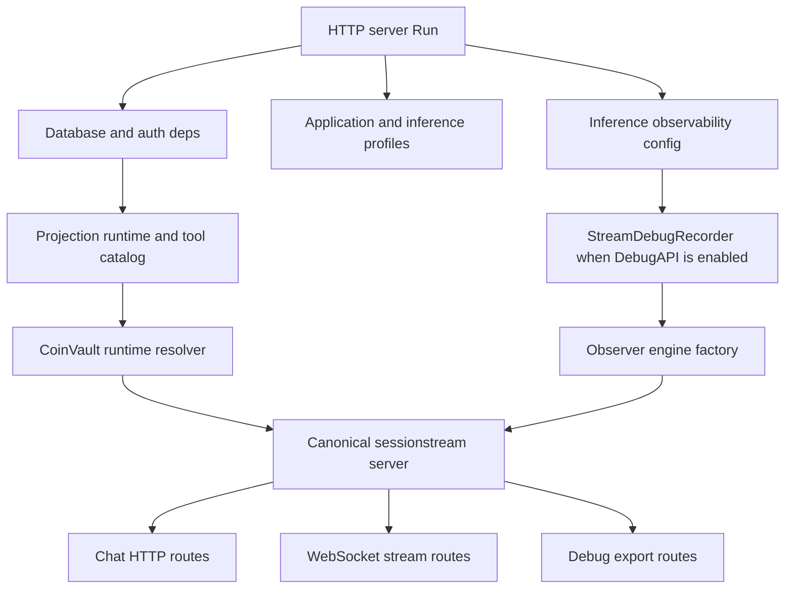
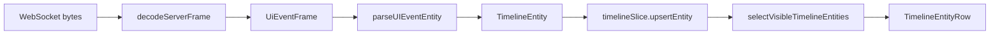

# CoinVault Web Chat: Event Projection, Debug Exports, and Thinking Persistence

This report explains the current CoinVault web-chat integration after the move to the published `@go-go-golems/chat-provider@^0.2.1`, the compatibility update for current Pinocchio packages, the debug SQLite export path, and the fix for persisted reasoning content. The report is written as a technical article rather than a changelog: it describes the design constraints, the event flow, the projection rules, the debug surfaces, the failure mode that removed thinking text, and the tests that now guard the behavior.

> [!summary]
> - CoinVault now runs against current Pinocchio packages while keeping its own debug recorder under `internal/webchat/debugrecorder`.
> - The frontend projects protobuf UI events into Redux timeline entities, using patch fields for streamed content and stable entity ids for later terminal updates.
> - The thinking-content bug was caused by sparse `ChatReasoningSegmentFinished` events overwriting existing text with empty strings; the mapper now omits `content` and `text` when the terminal event has no text.
> - The Export menu exposes normal conversation exports plus debug SQLite export in dev/debug contexts, making browser, transport, pipeline, timeline, and turn evidence available in one database.

## Why this report exists

CoinVault is a Go and React application for querying a gold-coin inventory through a chat interface. The web app receives sessionstream WebSocket frames, decodes protobuf UI events, projects those events into a local timeline store, and renders messages, tool calls, tool results, CoinVault widgets, fact chips, and reasoning blocks. The backend owns runtime creation, profile selection, tool catalog setup, canonical session handling, turn persistence, debug recording, and export routes.

The recent implementation work had three connected goals. First, CoinVault had to keep working with the current Pinocchio web-chat packages after older debug recorder internals were no longer importable from `github.com/go-go-golems/pinocchio/cmd/web-chat/app`. Second, the local frontend had to consume the published `@go-go-golems/chat-provider@^0.2.1` package rather than a local or stale package build. Third, the UI needed to preserve streamed reasoning text after the backend emitted a terminal reasoning event that contained status but no text payload.

The result is a cleaner boundary: CoinVault owns its domain-specific web-chat runtime and debug recorder, consumes stable Pinocchio package APIs, and preserves frontend projection semantics in unit tests.

## The system boundary

The relevant repository is:

`/home/manuel/workspaces/2026-05-29/chatbot-react/2026-03-16--gec-rag`

The main files for this report are:

| Area | File | Role |
|---|---|---|
| Backend server setup | `internal/webchat/server/server.go` | Builds database dependencies, application profiles, inference profiles, observability settings, debug recorder, runtime resolver, canonical server, HTTP mux, and root handler. |
| Debug routing | `internal/webchat/sessionstream/sessionstream_debug.go` | Serves debug records and handles `POST /api/debug/sessions/{sessionId}/reconcile/upload`. |
| Debug recorder | `internal/webchat/debugrecorder/*.go` | Records pipeline, transport, and Geppetto events; reconciles fanout ordinals; builds downloadable SQLite databases. |
| WebSocket mapping | `web/src/ws/uiEventMapping.ts` | Converts protobuf `UiEventFrame` records into Redux `TimelineEntity` updates. |
| Timeline state | `web/src/store/timelineSlice.ts` | Merges entity updates, applies stream patches, preserves creation order, sorts visible entities, and tracks cancelled assistant output. |
| Export menu | `web/src/app/ExportActions.tsx` | Renders conversation export links and debug export actions. |
| Frontend debug capture | `web/src/ws/streamDebug.ts` | Records browser-side WebSocket lifecycle, raw frames, parsed frames, snapshots, and UI event mappings. |
| Test guide | `docs/howtos/how-to-test.md` | Documents devctl startup, smoke tests, debug profile, SQLite export, and thinking-regression validation. |

The frontend dependency now includes:

```json
{
  "@go-go-golems/chat-provider": "^0.2.1"
}
```

That package version matters because `0.2.1` contains the ESM import fix for generated package output and the new chat-named provider hooks from the upstream cleanup.

## Backend architecture

The backend starts in `internal/webchat/server/server.go`. The `Run` function resolves configuration, builds storage dependencies, opens application and inference profiles, constructs the CoinVault tool catalog, creates the turn store, optionally creates the debug recorder, and then constructs a canonical sessionstream server.

The important ordering is visible in the setup sequence:

```go
var debugRecorder *appdebug.StreamDebugRecorder
if opts.DebugAPI {
    debugRecorder = appdebug.NewStreamDebugRecorder(obsSettings.MaxRecords)
}
observerEngineFactory := webchat.BuildObserverEngineFactory(debugRecorder, obsConfig)
runtimeResolver := webchatsession.NewCoinVaultRuntimeResolver(
    inferenceSettings,
    appProfiles,
    projectionRuntime,
    toolCatalog,
    turnStore,
).WithSQLDocs(sqlDocs).
  WithEngineFactory(observerEngineFactory)
```

The debug recorder is not a frontend concern. It is attached to backend observability before the canonical server is created. The canonical server then receives the same recorder through `CanonicalServerOptions` so it can observe pipeline and transport events and later answer debug HTTP requests.

```go
canonical, err := webchatsession.NewCanonicalServer(webchatsession.CanonicalServerOptions{
    TimelineDSN:   strings.TrimSpace(opts.TimelineDSN),
    TimelineDB:    strings.TrimSpace(opts.TimelineDB),
    TurnStore:     turnStore,
    TurnsDBPath:   strings.TrimSpace(opts.TurnsDB),
    Resolver:      runtimeResolver,
    Authorizer:    authorizer,
    DebugRecorder: debugRecorder,
    Features: []chatapp.ChatPlugin{
        webchat.NewCoinVaultProjectionFeature(dbDeps.DB),
        plugins.NewReasoningPlugin(),
        plugins.NewToolCallPlugin(),
    },
})
```

The feature list is significant. CoinVault does not render only natural-language messages. It also registers projection features and chat plugins that produce structured events. The frontend must therefore handle at least four classes of timeline entities: text messages, thinking messages, tool calls/results, and CoinVault widget or fact entities.



## Why CoinVault owns the debug recorder

Earlier CoinVault code imported debug recording internals from Pinocchio's `cmd/web-chat/app` package. Current Pinocchio releases no longer expose that path in the same way, and the failure was explicit:

```text
internal/webchat/observability.go:9:2: no required module provides package github.com/go-go-golems/pinocchio/cmd/web-chat/app; to add it:
```

The fix was not to depend on a command package again. CoinVault now has a local `internal/webchat/debugrecorder` package. This keeps the debug schema and SQLite export behavior under the application that serves the export route. It also reduces coupling to Pinocchio command-package internals while still using stable Pinocchio packages such as `github.com/go-go-golems/pinocchio/pkg/chatapp`.

The recorder has three record kinds:

```go
type DebugRecordKind string

const (
    DebugRecordKindPipeline  DebugRecordKind = "pipeline"
    DebugRecordKindTransport DebugRecordKind = "transport"
    DebugRecordKindGeppetto  DebugRecordKind = "geppetto"
)
```

The recorder stores bounded records in memory, keyed by session id when the underlying event supplies one. Pipeline records describe sessionstream processing. Transport records describe WebSocket transport fanout. Geppetto records describe provider-side inference activity. This separation is important because a user-visible rendering problem can be caused by several different failures: no provider output, provider output not converted into UI events, UI events not sent over transport, frontend frames not parsed, or parsed events not merged correctly into timeline state.

The reconciliation response compares pipeline fanout ordinals with transport fanout ordinals:

```go
return DebugReconcileResponse{
    SessionID:               sessionID,
    PipelineFanoutOrdinals:  sortedKeys(pipeline),
    TransportFanoutOrdinals: sortedKeys(transport),
    MissingTransportFanout:  missingKeys(pipeline, transport),
    ExtraTransportFanout:    missingKeys(transport, pipeline),
    PipelineRecordCount:     pipelineCount,
    TransportRecordCount:    transportCount,
}
```

That result answers a narrow but valuable question: for a given session, did an ordinal that reached pipeline fanout also reach transport fanout? It does not prove frontend rendering correctness, but it identifies whether the backend emitted the frame to WebSocket transport.

## Debug SQLite export

CoinVault exposes a debug upload route when the debug API is enabled:

```text
POST /api/debug/sessions/{sessionId}/reconcile/upload
```

The route is implemented in `internal/webchat/sessionstream/sessionstream_debug.go`. It verifies debug access, accepts browser-side debug records, calls `BuildSQLiteReconcileDB`, and returns `application/vnd.sqlite3` with a filename derived from the session id.

```go
func (s *CanonicalServer) handleDebugReconcileUpload(w http.ResponseWriter, r *http.Request, sessionID string) {
    if r.Method != http.MethodPost {
        writeJSON(w, http.StatusMethodNotAllowed, errorResponse{Error: "method not allowed"})
        return
    }
    body, err := s.debugRecorder.BuildSQLiteReconcileDB(r.Context(), sessionID, r.Body, s)
    if err != nil {
        writeJSON(w, http.StatusBadRequest, errorResponse{Error: err.Error()})
        return
    }
    filename := "coinvault-debug-" + safeFilenamePart(sessionID) + ".sqlite"
    w.Header().Set("Content-Type", "application/vnd.sqlite3")
    w.Header().Set("Content-Disposition", `attachment; filename="`+filename+`"`)
    http.ServeContent(w, r, filename, time.Now(), bytes.NewReader(body))
}
```

The SQLite builder combines four evidence sources:

1. frontend debug records uploaded by the browser,
2. backend debug records held by `StreamDebugRecorder`,
3. canonical timeline entities exported from the sessionstream service,
4. persisted turns exported from the turn store.

The core function is intentionally direct:

```go
func (r *StreamDebugRecorder) BuildSQLiteReconcileDB(
    ctx context.Context,
    sessionID string,
    body io.Reader,
    provider DebugDataProvider,
) ([]byte, error) {
    frontendRecords, err := parseFrontendLogUpload(body)
    // create temp sqlite database
    // insert meta, backend records, frontend records
    // insert timeline entities and turns through provider
    // create debug views
    return os.ReadFile(path)
}
```

The frontend action that triggers this upload lives in `web/src/ws/streamDebug.ts`. It chooses a session id from the active conversation or from the most recent debug entry, posts all current browser records, downloads the returned blob, and names the file from the response header when available.

```ts
export async function uploadAndDownloadSQLite(sessionIdHint?: string): Promise<void> {
  const current = getStreamDebugEntries();
  let sessionId = sessionIdHint?.trim() ?? "";
  // find session id if not provided
  const resp = await fetch(`${basePrefix}/api/debug/sessions/${encodeURIComponent(sessionId)}/reconcile/upload`, {
    method: "POST",
    headers: { "Content-Type": "application/json" },
    body: JSON.stringify({ records: current }),
  });
  // download response as .sqlite
}
```

The export action is visible in the UI through `web/src/app/ExportActions.tsx`. Normal exports are always available for an active conversation. Debug controls are shown when the runtime config enables the debug API or when the app is running under Vite development mode:

```ts
const showDebugActions = debugExportsEnabled() || import.meta.env.DEV;
```

This means local developers can enable stream debug and download SQLite evidence without remembering the console helper, while production exposure remains controlled by runtime configuration.

## Frontend event projection

The frontend does not render protobuf frames directly. It maps each `UiEventFrame` into a `TimelineEntity`, then lets Redux merge the entity into the timeline. That separation is valuable because protobuf decoding, event naming, stream patch semantics, entity ordering, and React rendering are separate responsibilities.



`web/src/ws/uiEventMapping.ts` contains the event-name switch. It maps CoinVault widget events to `coinvault.*` entity kinds, user message events to `message` entities with `role: "user"`, assistant text events to `message` entities with `role: "assistant"`, reasoning events to `message` entities with `role: "thinking"`, tool events to `tool_call` and `tool_result`, and run failures to `run` entities.

The mapper treats streamed patches differently from complete segment updates. For text patches, it emits `contentPatch`, `textPatch`, and `patchMode`; for segment-finished updates, it emits `content` and `text` when those values exist. The Redux slice later applies patches to prior content.

```ts
const contentData = isPatch
  ? { contentPatch: content, textPatch: content, patchMode: patchModeName(p.mode) }
  : content
    ? { content, text: content }
    : {};
```

This expression is the central fix for thinking persistence. Before the fix, a sparse terminal reasoning event could produce empty `content` and `text` values. Since `upsertEntity` merges incoming data over existing data, those empty strings replaced the streamed reasoning text. After the fix, an empty terminal event contributes status, streaming state, parent id, segment type, and correlation data, but does not contribute content fields.

## Timeline merge semantics

`web/src/store/timelineSlice.ts` is responsible for stable merging. The slice extracts patch fields from incoming entity data, removes those transient fields from the stored data, merges regular fields over existing data, and then applies patches against the existing content.

The relevant reducer structure is:

```ts
const incomingData = { ...entity.data };
const contentPatch = typeof incomingData.contentPatch === "string" ? incomingData.contentPatch : undefined;
const textPatch = typeof incomingData.textPatch === "string" ? incomingData.textPatch : undefined;
const patchMode = incomingData.patchMode;
delete incomingData.contentPatch;
delete incomingData.textPatch;
delete incomingData.patchMode;

const mergedData = existing
  ? { ...existing.data, ...incomingData }
  : incomingData;

if (contentPatch !== undefined) {
  const previousContent = typeof existing?.data.content === "string" ? existing.data.content : "";
  mergedData.content = applyStreamPatch(previousContent, contentPatch, patchMode);
}
```

Two properties follow from this design.

First, stream patches are transient mutation instructions, not stored domain fields. Once applied, `contentPatch`, `textPatch`, `inputRawPatch`, and `patchMode` are removed from the stored entity. This keeps rendered entities simple: renderers read `data.content`, `data.text`, `data.input`, and status fields rather than replaying patch instructions.

Second, non-patch fields still update status. A sparse terminal update can set `status: "finished"` and `streaming: false` without replacing content. That behavior is exactly what a reasoning segment needs when it receives text through `ChatReasoningPatch` and completion through `ChatReasoningSegmentFinished`.

The patch application rules are compact:

| Patch mode | Reducer behavior |
|---|---|
| `APPEND`, `UNSPECIFIED`, numeric `0` or `1` | concatenate previous text and patch text |
| `SNAPSHOT`, `REPLACE`, numeric `2` or `3` | replace previous text with patch text |
| missing or unknown | default to append |

The choice to preserve `createdOrdinal` on update also matters. A streamed entity may be updated many times, but its display position should remain tied to its first appearance. The reducer keeps the original `createdOrdinal` and raises `updatedOrdinal` to the maximum seen value.

## The thinking persistence failure

The failure mode was specific and reproducible. A reasoning patch created a thinking entity with content:

```json
{
  "id": "chat-msg-1:thinking:1",
  "kind": "message",
  "data": {
    "role": "thinking",
    "contentPatch": "Looking up inventory",
    "textPatch": "Looking up inventory",
    "patchMode": "CHAT_STREAM_PATCH_MODE_APPEND",
    "status": "streaming",
    "streaming": true
  }
}
```

The reducer applied the patch and stored:

```json
{
  "role": "thinking",
  "content": "Looking up inventory",
  "text": "Looking up inventory",
  "status": "streaming",
  "streaming": true
}
```

Then the backend emitted `ChatReasoningSegmentFinished` with `messageId`, `parentMessageId`, and `status`, but without `content` or `text`. If the mapper normalized missing text to an empty string and emitted `content: ""` and `text: ""`, the reducer correctly obeyed the incoming data and overwrote the stored text. The reducer was not the right place to guess whether empty content meant "delete content" or "payload did not include content". The mapper has access to the event name and payload shape, so the mapper now distinguishes absent content from present content.

The regression test in `web/src/ws/parsing.test.ts` checks the mapping boundary:

```ts
expect(entity).toMatchObject({
  id: "chat-msg-1:thinking:1",
  kind: "message",
  data: {
    role: "thinking",
    status: "finished",
    streaming: false,
    parentMessageId: "chat-msg-1",
  },
});
expect(entity?.data.content).toBeUndefined();
expect(entity?.data.text).toBeUndefined();
```

The regression test in `web/src/store/timelineSlice.test.ts` checks the reducer boundary:

```ts
expect(state.byId["thinking-1"].data.content).toBe("Looking up inventory");
expect(state.byId["thinking-1"].data.text).toBe("Looking up inventory");
expect(state.byId["thinking-1"].data.status).toBe("finished");
expect(state.byId["thinking-1"].data.streaming).toBe(false);
```

Testing both boundaries is useful because the bug can reappear in two ways: the mapper could again emit empty overwrite fields, or the reducer could apply sparse updates incorrectly.

## Normal exports versus debug exports

The Export menu now has two layers.

Normal conversation exports are links under the active session path:

```text
/api/chat/sessions/{sessionId}/timeline?format=json&download=true
/api/chat/sessions/{sessionId}/turns?format=json&download=true
/api/chat/sessions/{sessionId}/turns?format=yaml&download=true
/api/chat/sessions/{sessionId}/turns?format=minitrace&download=true
/api/chat/sessions/{sessionId}/export?format=json&download=true
```

Debug exports are actions:

```text
Enable Stream Debug
Disable Stream Debug
Download Debug SQLite
```

The difference is not only transport format. Normal exports describe persisted conversation state. Debug exports combine frontend observations, backend observations, timeline snapshots, and turns. That makes debug SQLite the right artifact when the question is "where did this event stop matching expectations?" Normal exports remain the right artifact when the question is "what did this conversation contain?"

## Testing workflow

The project test guide at `docs/howtos/how-to-test.md` documents the local workflow. The short version is:

```bash
cd /home/manuel/workspaces/2026-05-29/chatbot-react/2026-03-16--gec-rag
devctl --profile debug up --force
```

Expected local services:

```text
backend:  http://127.0.0.1:18933
frontend: http://127.0.0.1:5173
```

The deterministic smoke path uses the `umans-flash` profile. A browser smoke should verify that the app loads, WebSocket status becomes connected or subscribed, a prompt produces streamed thinking, and the final assistant response remains visible. The debug profile additionally verifies that the Export menu contains `Download Debug SQLite` and that `window.__coinvaultStreamDebug.uploadSQLite()` can produce a SQLite file for the active session.

The unit-level validation focuses on the event-projection bug:

```bash
cd /home/manuel/workspaces/2026-05-29/chatbot-react/2026-03-16--gec-rag/web
pnpm vitest run --config vitest.unit.config.ts \
  src/ws/parsing.test.ts \
  src/store/timelineSlice.test.ts \
  src/app/exportUrls.test.ts
```

Backend compatibility validation focuses on current Pinocchio package integration:

```bash
cd /home/manuel/workspaces/2026-05-29/chatbot-react/2026-03-16--gec-rag
GOWORK=off GOFLAGS=-mod=mod go test ./internal/webchat/... ./cmd/coinvault
```

`GOWORK=off` is important for this compatibility check because it verifies the module against its declared dependencies rather than relying on local workspace replacements.

## Design rules to preserve

The implementation now has several rules that should be treated as invariants during future changes.

- A protobuf event mapper must not convert absent content into empty overwrite content. Empty string is a value. Missing field is a different condition.
- Stream patch fields are reducer instructions, not durable entity data. Store final merged `content`, `text`, `inputRaw`, and `input` values after patch application.
- Entity ids must be stable across patch and terminal events. If a terminal event cannot find the same id, it cannot update the correct rendered row.
- `createdOrdinal` determines first display position. `updatedOrdinal` records later activity without moving the entity to a new creation position.
- CoinVault should not import Pinocchio command-package internals for application-owned debug behavior. Keep the local debug recorder local unless a stable library package is introduced upstream.
- Debug export visibility should remain controlled by dev mode or explicit debug API configuration.

## Near-term next steps

The implementation is in a good state for local development and smoke testing. The remaining project tasks are operational rather than architectural:

1. Review the final CoinVault git status and commit only the intended files.
2. Keep `docs/howtos/how-to-test.md` aligned with the actual devctl profiles and local ports.
3. Run the Go compatibility test with `GOWORK=off` before any dependency update that touches Pinocchio, Geppetto, or sessionstream.
4. Keep the parsing and timeline reducer regression tests close to the bug they protect; they document the semantic distinction between absent content and empty content.
5. Consider documenting the SQLite schema views in a short follow-up note if debug analysis becomes a regular workflow.

## References

- `2026-03-16--gec-rag/internal/webchat/server/server.go`
- `2026-03-16--gec-rag/internal/webchat/sessionstream/sessionstream_debug.go`
- `2026-03-16--gec-rag/internal/webchat/debugrecorder/debug_recorder.go`
- `2026-03-16--gec-rag/internal/webchat/debugrecorder/debug_reconcile_db.go`
- `2026-03-16--gec-rag/web/src/ws/uiEventMapping.ts`
- `2026-03-16--gec-rag/web/src/store/timelineSlice.ts`
- `2026-03-16--gec-rag/web/src/ws/streamDebug.ts`
- `2026-03-16--gec-rag/web/src/app/ExportActions.tsx`
- `2026-03-16--gec-rag/web/src/ws/parsing.test.ts`
- `2026-03-16--gec-rag/web/src/store/timelineSlice.test.ts`
- `2026-03-16--gec-rag/docs/howtos/how-to-test.md`
