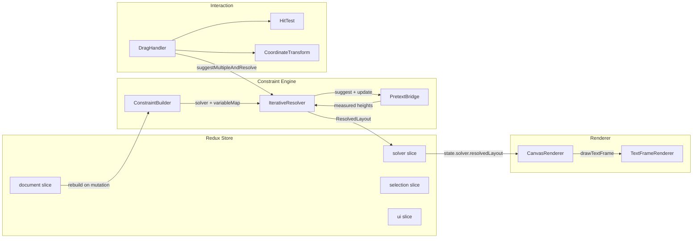

# Constraint-Based Layout on Canvas: Cassowary + Pretext + React

This article describes how to build a constraint-based typographic layout system on HTML5 Canvas, using the Cassowary constraint-solving algorithm for positioning and the Pretext library for text measurement. The reference implementation is a React + Vite + Redux application that renders interactive, constraint-driven text frames on Canvas at 60fps.

The core technical challenge is that text height is a non-linear, discontinuous function of width: when width crosses a line-break threshold, height jumps by one line. Cassowary solves linear constraints — it cannot express "height = f(width)" directly. The solution is an iterative solve-measure loop: resolve the constraint system, measure text heights with Pretext, feed the measured heights back as updated constraints, and repeat until convergence. In practice, this loop converges in 2–3 iterations at a total cost under 1ms for small layouts.

> [!summary]
> 1. Cassowary solves linear positioning constraints; text height is non-linear and must be resolved iteratively by feeding Pretext measurements back into the solver as edit variable suggestions.
> 2. The strength hierarchy (required > strong > medium > weak) is not decorative — it determines which constraints yield when the system is overconstrained. Misassigning strengths causes frames to freeze or constraints to be silently violated.
> 3. When a required constraint links two frames (e.g., "same top"), dragging one frame requires suggesting values for both — the solver cannot reconcile a strong edit variable on one frame against a strong edit variable on the other through a required equality.

## When to use this architecture

Use constraint-based canvas layout when:

- you need multiple layout elements whose positions and sizes are determined by relationships (gaps, alignments, margins) rather than fixed coordinates
- those relationships include soft preferences ("prefer 40px margin") alongside hard requirements ("frames must not overlap")
- text content must flow within frames whose widths are determined by the constraint system
- you want interactive drag-and-resize that propagates changes through the constraint network in real time

Do not use this architecture when:

- your layout is simple enough for CSS Flexbox or Grid — these are faster and require no custom solver
- you have no text frames whose height depends on resolved width — without the non-linear coupling, Cassowary alone is sufficient
- you need sub-pixel typographic accuracy at all viewport sizes — Canvas text rendering differs from DOM rendering in subtle ways

## Core mental model

The system has three stages that run in sequence:

1. **Build.** Construct a constraint system from the document model: one solver variable per frame per dimension (left, top, width, height), edit variables for user-controlled dimensions, and constraint equations linking them.
2. **Solve + measure.** Run the Cassowary solver to get frame positions and sizes. Then measure each text frame's height with Pretext at the resolved width. If any measured height differs from the solver's current height by more than a tolerance (0.5px), suggest the measured height as a new value for the height edit variable and re-solve. Repeat until stable.
3. **Render.** Read the final variable values and draw frames, text lines, selection handles, and constraint visualization lines on Canvas.

The second stage is the non-obvious part. Without it, text frame heights would be arbitrary numbers dictated by the constraint system rather than by the actual text content. The iterative loop closes the gap between the linear world of Cassowary and the non-linear world of text layout.

## Architecture



The Constraint Engine is a singleton (`ConstraintEngine`) that lives outside Redux. The Cassowary `Solver` object is mutable and non-serializable, so it cannot be stored in Redux state. Instead, only the resolved layout values (positions, sizes, line data) are extracted from the solver and dispatched to the Redux store. This separation keeps Redux serializable while giving the constraint engine direct access to the solver for the fast suggest-and-resolve path used during drag.

The Canvas rendering loop reads from `store.getState()` every animation frame, not from React's render cycle. This decouples rendering from React re-renders: the canvas updates immediately when the Redux state changes, without waiting for React to reconcile.

## The iterative solve-measure loop

The IterativeResolver is the central component. Here is its resolution loop, simplified:

```
function iterativeResolve(document):
  for iteration in 0..MAX_ITERATIONS (5):
    heightsChanged = false
    for frame in document.textFrames:
      resolvedWidth = solver.get(frame + "-width").value()
      measuredHeight = pretextBridge.measure(frame, resolvedWidth, lineHeight).height
      previousHeight = previousHeights.get(frame.id) ?? -1
      if |measuredHeight - previousHeight| > HEIGHT_TOLERANCE (0.5px):
        solver.suggestValue(frame + "-height", measuredHeight)
        previousHeights.set(frame.id, measuredHeight)
        heightsChanged = true
    if !heightsChanged:
      return iteration + 1   // converged
    solver.updateVariables()
  return MAX_ITERATIONS       // did not converge
```

The tolerance of 0.5px prevents infinite oscillation when measured heights differ by rounding errors. In practice, the loop converges after the second iteration because text height is piecewise-constant: it only changes when width crosses a line-break threshold, and once width stabilizes (which the linear solver does in a single pass), height stabilizes too.

The cost of a full rebuild (constructing the solver from scratch) is approximately 16ms for two frames. The cost of a suggest-and-resolve (suggesting new edit variable values on an existing solver) is under 1ms. This means that drag operations, which use the fast path, stay well within the 16ms frame budget.

## The strength hierarchy and why it matters

Cassowary defines four constraint strengths, ordered by priority:

| Strength | Numeric value | Usage |
|----------|--------------|-------|
| required | 1,001,001,000 | Hard constraints that must be satisfied — bounds, structural relationships |
| strong | 1,000,000 | Edit variables for user-controlled dimensions; hard preferences |
| medium | 1,000 | Soft preferences — preferred margins, alignment hints |
| weak | 1 | Fallback hints — default positions, initial suggestions |

The hierarchy is not a suggestion — it determines the solver's behavior when constraints conflict. Understanding this hierarchy is the most important thing for building a working constraint layout system.

**Required constraints must be satisfied.** If two required constraints conflict (e.g., "frame-1 width ≥ 200" and "frame-1 right ≤ 100"), the solver throws an "unsatisfiable constraint" error. Required constraints are for structural relationships that cannot be violated: bounds, frame gaps, alignment equalities.

**Strong edit variables override medium and weak constraints.** When the user drags a frame, the edit variable at strong strength should override a medium "prefer 40px margin" constraint. The frame moves.

**But strong does not override required.** If a required constraint says "frame-2-top = frame-1-top" and both frames have strong edit variables suggesting different top values, the required constraint forces equality and the solver picks a compromise value. This is the key failure mode: if you drag frame-1 to top=140 but frame-2's edit variable still suggests top=40, and the same-top constraint is required, the solver resolves the conflict by keeping both frames at their original position (40). The strong suggestions from both frames cancel each other out through the required equality.

The practical consequence: when a required constraint links two frames, dragging one frame requires suggesting new values for both frames simultaneously. The drag handler inspects required constraints and propagates suggestions to connected frames.

## The constraint builder: from document model to solver

The ConstraintBuilder translates a document model (frames, constraints expressed as linear expressions) into a live Cassowary solver. The translation has one non-obvious detail: how user-defined constraint expressions are split into left-hand side and right-hand side for `solver.createConstraint()`.

A user constraint expression is stored as:

```
sum(coefficient_i × variable_i) + constant  operator  0
```

For example, "frame-2-left = frame-1-left + frame-1-width + 20" becomes:

```
1×frame-2-left + (-1)×frame-1-left + (-1)×frame-1-width + (-20)  Eq  0
```

The builder splits terms by sign: positive-coefficient terms go to the left-hand side, negative-coefficient terms (with their signs flipped) go to the right-hand side, and the constant is negated and placed on the right-hand side. This produces:

```
lhs = Expression(frame-2-left)
rhs = Expression(frame-1-left, frame-1-width, 20)
solver.createConstraint(lhs, Operator.Eq, rhs, Strength.required)
```

**Do not use the `new kiwi.Constraint()` constructor.** The constructor takes `(expression, operator, [rhs], [strength])` where `rhs` and `strength` are positional and ambiguous. Passing `new Constraint(expr, Op.Eq, Strength.strong)` creates the constraint `expr == Strength.strong` — a nonsensical equation — instead of `expr == 0` at strong strength. The `solver.createConstraint(lhs, op, rhs, strength)` method avoids this trap by taking the RHS and strength as separate named arguments.

## The Pretext bridge: text measurement without DOM reflow

Pretext provides three operations that the layout system needs:

1. **Prepare.** `prepareWithSegments(text, font)` tokenizes text, computes grapheme widths, and caches the result. Call this once when a frame's text or font changes.

2. **Measure.** `layoutWithLines(prepared, maxWidth, lineHeight)` returns the number of lines, the total height, and an array of line objects (text, width, start/end cursors). This is the call that the iterative resolver uses to compute the non-linear width→height relationship.

3. **Invalidate.** Clear the cache entry for a frame when its text or font changes. The next `prepare` call will recompute.

The critical performance characteristic: Pretext measures text at approximately 0.001ms per `layout()` call. DOM-based measurement (creating a hidden element, setting its width, reading `scrollHeight`) costs 0.1–10ms per call. In the iterative loop, where each iteration measures every text frame, the difference between 0.001ms and 1ms is the difference between a loop that completes in under 1ms and one that takes 5–10ms. DOM measurement would push the layout cycle over the 16ms frame budget for even small documents.

## Interaction: drag with constraint propagation

The drag interaction reveals the most important constraint-strength interaction. Here is the sequence:

1. **MouseDown.** The hit-test checks selected frames' handles first (they render on top), then checks frame bodies in reverse z-order. If a frame is hit, record the starting mouse position and the frame's current left/top/width/height.

2. **MouseMove.** Compute the delta from the start position. Build a list of edit variable suggestions: the dragged frame's left and top. Then inspect required constraints that involve the dragged frame. For each such constraint, check if it links to another frame through an equality on the same axis (left or top). If so, compute the corresponding suggestion for the connected frame. Call `suggestMultipleAndResolve()` with all suggestions.

3. **MouseUp.** Clear the drag state. Do not rebuild the solver — the current solver state is already consistent. Rebuilding from the document model would reset edit variable suggestions to their initial values, undoing the drag.

The constraint propagation in step 2 is essential. Without it, dragging frame-1 vertically while a required same-top constraint links frame-2 would result in the solver finding a compromise value that satisfies neither the drag nor the constraint. With propagation, both frames receive consistent suggestions and the constraint system resolves to the expected positions.

## Common failure modes

### The kiwi.Constraint constructor trap

The `new kiwi.Constraint(expression, operator, rhs?, strength?)` constructor interprets its third argument as `rhs` if it is a number or Expression, and as `strength` if it is a Strength value. When you pass `Strength.strong` as the third argument, kiwi interprets it as the right-hand side of the equation, creating a constraint like `frame-1-top == 1000000` instead of `frame-1-top == 0` at strong strength. This causes "unsatisfiable constraint" errors that are extremely difficult to diagnose because the error message does not point to the root cause.

**Fix:** Always use `solver.createConstraint(lhs, op, rhs, strength)`.

### Medium constraints blocking strong edit variables

When a medium-strength constraint (e.g., "margin = 40px") and a strong edit variable conflict, the solver should honor the edit variable. But in practice, with the full constraint system including required cross-frame constraints, a medium constraint on one frame's edit variable can prevent the solver from moving that variable when the required constraint forces a connected frame's edit variable to a conflicting position.

**Fix:** Use weak strength for margin/preference constraints. Use medium only for constraints that should override edit variables in some contexts.

### Required equality constraints between frames with conflicting edit variables

If frame-A and frame-B are linked by a required "same top" constraint, and both have strong edit variables suggesting different top values, the solver cannot move either frame. The required constraint forces equality, but the strong suggestions disagree.

**Fix:** Propagate suggestions through required constraints during drag. When suggesting a new top for frame-A, also suggest the same top for frame-B.

### Rebuilding the solver on mouse up

A full rebuild (`engine.rebuild(doc)`) constructs a new solver from the document model, which resets all edit variable suggestions to their initial values. If you rebuild after a drag, the frames snap back to their original positions because the document model still contains the initial margin/position constraints.

**Fix:** Do not rebuild on mouse up. The solver state is already consistent after the drag. Reserve full rebuilds for document mutations (adding/removing frames or constraints).

### Redux non-serializable state

The `ResolvedLayout` returned by the solver contains a `Map<string, ResolvedFrame>`. Redux warns about non-serializable values in actions and state. The `Map` must be converted to a `Record<string, ResolvedFrame>` in the reducer, and the `serializableCheck` middleware option must be configured to ignore the `setResolvedLayout` action.

## Project shape

```
cassowary-layout-demo/
├── src/
│   ├── engine/
│   │   ├── types.ts              # Document, Frame, LayoutConstraint, ResolvedLayout
│   │   ├── ConstraintBuilder.ts  # Document model → kiwi solver
│   │   ├── PretextBridge.ts      # Pretext prepare/measure/invalidate cache
│   │   ├── IterativeResolver.ts  # Solve → measure → iterate loop
│   │   └── ConstraintEngine.ts   # Singleton facade
│   ├── renderer/
│   │   ├── CanvasRenderer.ts      # Render orchestrator
│   │   └── TextFrameRenderer.ts  # Stroke, fill, clip, fillText per line
│   ├── interaction/
│   │   ├── HitTest.ts             # Frame body + handle hit testing
│   │   ├── CoordinateTransform.ts # Screen → canvas coords
│   │   └── DragHandler.ts        # Mouse drag with constraint propagation
│   ├── store/
│   │   ├── documentSlice.ts       # Document model (frames, constraints)
│   │   ├── solverSlice.ts        # ResolvedLayout (Map → Record)
│   │   ├── selectionSlice.ts      # Selected frames, drag handle
│   │   ├── uiSlice.ts            # Show guides/rulers/constraints, zoom, pan
│   │   ├── middleware.ts          # Auto-rebuild on document mutations
│   │   └── index.ts             # Store config + serializableCheck
│   ├── components/
│   │   ├── CanvasViewport.tsx     # Canvas + RAF render loop + mouse events
│   │   └── ControlPanel.tsx      # Stats, constraint list, frame inspector
│   ├── App.tsx
│   └── main.tsx
```

## Verified behavior

The reference implementation was verified with two text frames, one constraint-driven gap, and interactive drag:

| Property | Value |
|----------|-------|
| Initial frame-1 position | (40, 40) |
| Initial frame-2 position | (260, 40) |
| Gap constraint | 20px (required) |
| Same-top constraint | required |
| After drag down 100px | Both frames at top=140 |
| Initial solve time (full rebuild) | ~16ms |
| Incremental solve time (drag) | <1ms |
| Iterations to converge | 2 |
| Frame rate during drag | 60fps |

## Working rules

1. **Required constraints are for structural relationships only.** Bounds, gaps, and alignment equalities between frames. Never use required for preferences.

2. **Weak constraints are for preferences.** Margins, preferred positions, default sizes. These should yield to user interaction.

3. **Edit variables are strong.** They must override weak and medium constraints but must not conflict with required constraints.

4. **Propagate through required constraints during drag.** When a required constraint links two frames, suggesting a value for one frame requires suggesting the corresponding value for the other.

5. **Use `solver.createConstraint()`, not `new kiwi.Constraint()`.** The constructor's positional parameters are a trap.

6. **Never rebuild the solver after a drag.** The solver state is already consistent. Rebuild only when the document model changes (add/remove frames or constraints).

7. **Convert Map to Record before storing in Redux.** Non-serializable state causes warnings and breaks time-travel debugging.

8. **Read from `store.getState()` in the render loop.** Do not rely on React's render cycle for canvas updates — the RAF loop should read the latest state directly.

## Open questions

- How does the system scale to 10+ text frames? The iterative loop measures every text frame on every iteration. With N text frames, each iteration costs N × 0.001ms. At 50 frames, this is still under 1ms, but the Cassowary solver itself may slow down with more variables and constraints.
- Can the constraint propagation in the drag handler be made more general? The current implementation only propagates through direct equality constraints. Transitive propagation (A linked to B, B linked to C) would require a constraint graph traversal.
- Is a web worker necessary for large documents? The constraint engine runs synchronously on the main thread. For documents with hundreds of frames, offloading the solver to a worker would prevent UI jank.

## Near-term next steps

- Phase 4: Constraint editor — a DSL parser for adding/removing constraints at runtime
- Phase 5: Magazine layout preset — 5 text frames with 8–10 constraints, rulers, guides, zoom/pan
- Unit tests for ConstraintBuilder, PretextBridge, and IterativeResolver
- Performance profiling with 5+ frames

## Important project docs

- Design doc: `ttmp/2026/06/02/CASSOWARY-1--cassowary-constraint-layout-demo-react-vite-redux-canvas/design-doc/01-cassowary-constraint-layout-architecture-and-implementation-guide.md`
- Investigation diary: `ttmp/2026/06/02/CASSOWARY-1--cassowary-constraint-layout-demo-react-vite-redux-canvas/reference/01-investigation-diary.md`
- Ticket tasks: `ttmp/2026/06/02/CASSOWARY-1--cassowary-constraint-layout-demo-react-vite-redux-canvas/tasks.md`

## Related notes

- [[ARTICLE - Playbook - Self-Contained Go Wasm and JavaScript Browser Applications|Go Wasm Browser Playbook]] — another canvas-focused browser architecture
