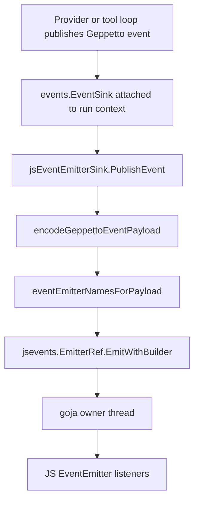
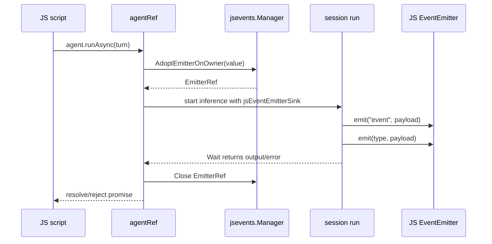

# Geppetto JS Overhaul: Wrapper-First Agents, Live Events, and Storage Boundaries

This report explains the Geppetto JavaScript overhaul as a technical system and as an implementation story. The useful way to read the work is not as a list of API changes, but as a sequence of boundary decisions: JavaScript may orchestrate inference, but Go owns provider settings; JavaScript may build turns, but Go owns turn identity and serialization; JavaScript may receive live events, but the goja runtime owner controls when callbacks run; Geppetto may persist final turns, but Pinocchio owns timeline hydration.

The source repository for the work is `/home/manuel/workspaces/2026-06-01/geppetto-js/geppetto`. The branch is `task/geppetto-js`. The earlier vault note [[ARTICLE - Geppetto JS Bindings - Wrapper First Hard Cutover]] describes the first hard-cut implementation. This article is broader: it retraces the diaries, explains the final architecture, covers the EventEmitter streaming work, records the hardening process, and describes the storage design boundary that followed.

> [!summary]
> - The overhaul replaced a broad, legacy JavaScript surface with a small wrapper-first API centered on `gp.inferenceProfiles`, `gp.engine`, `gp.agent`, `gp.turn`, `gp.tool`, `gp.toolRegistry`, and `gp.schema`.
> - Agent execution is explicit-turn only. There is no `agent.ask()`, no `agent.system()`, no hidden conversation state, and no public `gp.inferenceSettings()` builder.
> - Live JavaScript callbacks are delivered through builder-level EventEmitter attachment and `agent.runAsync(turn)`, not through synchronous `run()` and not through a racy `handle.on(...)` API.
> - The implementation is as much about runtime ownership as API design: goja values must be touched on the owner thread, EventEmitter refs must be run-scoped, and async settlement must post back to the runtime owner.
> - Storage design now separates final-turn persistence, which Geppetto can expose through a host-backed turn-store capability, from timeline/sessionstream persistence, which remains a Pinocchio concern.

## Why this overhaul happened

The old Geppetto JS surface made many things possible, but it did not make the important boundaries obvious. A script could reach into profile-like structures, construct engines from maps, use session helpers, create turns through older namespaces, and call runner-style functions. The API was convenient in the way early binding layers often are convenient: it exposed pieces as they became available. Over time, that convenience became ambiguity.

The core problem was authority. Provider settings are not ordinary JavaScript configuration. They refer to model names, provider defaults, token behavior, credentials, model metadata, extension codecs, and host policy. Tool registries are not ordinary arrays of functions. They are Go runtime capabilities. Turns are not just JavaScript objects with `{ role, content }`; in Geppetto they are Go structs with block kinds, roles, metadata, IDs, inference IDs, session IDs, and serialization behavior. A permissive API makes it too easy for JavaScript to create values that look correct but are not trusted by the Go inference stack.

The new API answers that with a simple rule: JavaScript receives wrappers, not ownership. A wrapper is a JavaScript object with methods, but its authoritative state lives in Go. If a method needs an `InferenceSettings`, it requires an `InferenceSettings` wrapper. If a method needs a `Turn`, it requires a `Turn` wrapper. Plain JavaScript maps may be used for options where maps are the correct representation, but not for core domain values.

That rule is the center of the overhaul.

## The final public surface

The current `require("geppetto")` export is intentionally small. In `pkg/js/modules/geppetto/module.go`, `installExports` installs these top-level names:

```go
func (m *moduleRuntime) installExports(exports *goja.Object) {
    m.mustSet(exports, "version", "0.1.0")
    m.installConsts(exports)

    inferenceProfilesObj := m.vm.NewObject()
    m.mustSet(inferenceProfilesObj, "load", m.inferenceProfilesLoad)
    m.mustSet(inferenceProfilesObj, "resolve", m.inferenceProfilesResolve)
    m.mustSet(inferenceProfilesObj, "default", m.inferenceProfilesDefault)
    m.mustSet(exports, "inferenceProfiles", inferenceProfilesObj)
    m.mustSet(exports, "engine", m.engineBuilder)
    m.mustSet(exports, "agent", m.agentBuilder)
    m.mustSet(exports, "turn", m.turnBuilder)
    m.mustSet(exports, "tool", m.toolBuilder)
    m.mustSet(exports, "toolRegistry", m.toolRegistryBuilder)
    m.installSchemaNamespace(exports)
}
```

The absence of names is part of the contract. The hard-cut work removed legacy public exports such as `createBuilder`, `createSession`, `runInference`, `profiles`, `engines`, `turns`, `runner`, `schemas`, `middlewares`, and `tools`. The later EventEmitter cleanup also removed the `gp.events` namespace and `gp.events.collector()`. That may look austere, but the point is to make every remaining export earn its place.

The resulting mental model is:

```text
require("geppetto")
  ├── inferenceProfiles   resolve/load host-managed inference settings
  ├── engine              build Go-owned engine wrappers
  ├── agent               build executable agents
  ├── turn                build explicit conversation turns
  ├── tool                build JS tool definitions
  ├── toolRegistry        assemble tool registries
  ├── schema              create schema wrappers
  └── consts              expose generated constants
```

There is no top-level chat convenience. There is no hidden session. There is no magic mutable transcript inside an agent. A script constructs a turn and gives it to an agent. If it wants another call with previous context, it constructs another turn that includes that context.

## The hidden reference mechanism

The wrapper-first API needs a concrete implementation trick. JavaScript objects must carry Go references, but those references should not appear as public enumerable properties. The module uses a hidden reference property named `__geppetto_ref`. `attachRef` first sets the Go value and then redefines the property as non-writable, non-enumerable, and non-configurable:

```go
func (m *moduleRuntime) attachRef(o *goja.Object, ref any) {
    _ = o.Set(hiddenRefKey, ref)
    _ = o.DefineDataProperty(hiddenRefKey, o.Get(hiddenRefKey),
        goja.FLAG_FALSE, // writable
        goja.FLAG_FALSE, // enumerable
        goja.FLAG_FALSE, // configurable
    )
}
```

This implementation detail gives the API its enforcement mechanism. When `agent().inference(settings)` is called, the method does not merely inspect a JavaScript shape. It asks whether the value has a trusted Go `InferenceSettings` reference. When `agent.run(turn)` is called, it rejects a plain object even if that object has blocks that look like a turn. The user-facing rule is therefore simple: build domain values through Geppetto's builders and pass the wrappers around.

This is not a security boundary in the sense of sandboxing untrusted code. It is an API integrity boundary. It prevents accidental structural lookalikes from being treated as canonical Geppetto values.

## Inference profiles replace JavaScript settings builders

One of the important reversals during the design process was the fate of `gp.inferenceSettings()`. Early design iterations considered an explicit JavaScript builder for provider, model, sampling, token, base URL, metadata, and credentials. The diary records that plan and then supersedes it. The final API does not expose `gp.inferenceSettings()`.

That decision matters. Inference settings sit at the junction of application policy and provider implementation. A JS builder would invite scripts to set model IDs, endpoint URLs, API key references, and provider-specific values directly. The final design instead routes those decisions through Geppetto engine profile registries. JavaScript can resolve a profile and receive a read-only wrapper:

```js
const gp = require("geppetto");

const registry = gp.inferenceProfiles.load("yaml:/path/to/profiles.yaml");
const settings = registry.resolve("default");

console.log(settings.toJSON());
```

In a host that provides a default registry, the script can be even shorter:

```js
const settings = gp.inferenceProfiles.resolve("default");
```

The settings wrapper can be inspected and passed to `gp.engine()` or `gp.agent()`, but JavaScript does not own the provider settings. That keeps credentials and provider defaults on the Go/host side, where the rest of Geppetto and Pinocchio already understand them.

## Explicit turns are the conversation model

The explicit-turn contract is the second major boundary. The public turn builder lives in `pkg/js/modules/geppetto/api_turn_builder.go`. It is immutable in the user-facing sense: builder methods clone the current turn, append one block, and return a new builder. A built `Turn` wrapper currently exposes only `toJSON()` and `clone()`.

A simple call looks like this:

```js
const gp = require("geppetto");

const settings = gp.inferenceProfiles.resolve("default");

const agent = gp.agent()
  .name("example")
  .inference(settings)
  .runDefaults({ timeoutMs: 120000 })
  .build();

const turn = gp.turn()
  .system("You are concise.")
  .user("Explain why wrapper-first APIs are useful.")
  .build();

const result = agent.run(turn);
console.log(result.text());
```

A multi-turn call is not hidden inside the agent. The second turn contains the earlier exchange explicitly:

```js
const turn1 = gp.turn()
  .system(system)
  .user("Turn 1: Reply with exactly this token: ALPHA_GEPPETTO")
  .build();

const result1 = agent.run(turn1);
const text1 = result1.text();

const turn2 = gp.turn()
  .system(system)
  .user("Turn 1: Reply with exactly this token: ALPHA_GEPPETTO")
  .assistant(text1)
  .user("Turn 2: What exact token did you return?")
  .build();

const result2 = agent.run(turn2);
```

This is more verbose than `agent.ask(...)`, but it is more honest. The provider receives a turn. The turn contains the context. If a caller wants to persist, inspect, fork, replay, or test a conversation, the state is a value it can see rather than a hidden mutable transcript inside an agent object.

## Agent construction

The agent builder is the main composition point. It can receive an engine wrapper or registry-resolved inference settings. It can attach middleware, tools, tool-loop settings, EventEmitter sinks, and default run options. The relevant shape from `api_agent.go` is:

```js
const agent = gp.agent()
  .name("my-agent")
  .inference(settings)        // or .engine(engine)
  .toolRegistry(registry)
  .toolLoop({ maxIterations: 4 })
  .events(emitter)
  .runDefaults({ timeoutMs: 120000, tags: { app: "demo" } })
  .build();
```

The builder validates core values as wrappers. `agent().inference(...)` requires a registry-resolved `InferenceSettings` wrapper. `agent().engine(...)` requires an engine wrapper. `agent.run(...)` and `agent.runAsync(...)` require a Go-owned turn wrapper. This is the same rule repeated at each boundary.

Internally, an agent run builds a session, appends a cloned input turn, stamps runtime metadata, constructs a run context, and starts inference. The important path is:

```text
agent.run(turn)
  -> requireTurnRef(turn)
  -> startRun(input, options, runScopedEventSinks)
  -> buildSession(...)
  -> session.Append(seed)
  -> session.StartInference(ctx)
  -> handle.Wait()
  -> RunResult wrapper
```

The result wrapper exposes `inputTurn()`, `effectiveTurn()`, `outputTurn()`, `text()`, `usage()`, `stopReason()`, `events()`, and `toJSON()`. The distinction between input, effective, and output turns is valuable. The input turn is what JS supplied. The effective turn is the stamped and prepared turn that entered the run. The output turn is what came back from the engine/tool loop.

## Why live events required `runAsync`

Synchronous `agent.run(turn)` can return a result, but it cannot provide live JavaScript callbacks during inference. The reason is not philosophical; it is the goja runtime model. JavaScript callbacks must run on the runtime owner thread. If `run()` blocks that owner while waiting for inference, then event callbacks posted to the same owner cannot execute until the run returns. That is too late for streaming.

The EventEmitter design therefore introduced `agent.runAsync(turn, options?)`. It starts the run, returns control to JavaScript, and exposes a handle:

```ts
interface AgentAsyncHandle {
  promise: Promise<RunResult>;
  cancel(): void;
  close(): void;
}
```

A typical streaming script attaches listeners before building the agent, then awaits the promise:

```js
const EventEmitter = require("events");
const events = new EventEmitter();

const seen = [];

events.on("event", ev => {
  seen.push(ev.type);
});

events.on("text-delta", ev => {
  if (ev.delta) process.stdout.write(ev.delta);
});

events.on("inference-error", ev => {
  console.error(ev.message || ev.error);
});

const agent = gp.agent()
  .inference(settings)
  .events(events)
  .runDefaults({ timeoutMs: 120000 })
  .build();

const handle = agent.runAsync(turn);
const result = await handle.promise;
```

The placement of `.events(events)` is deliberate. It is builder-level because listeners must exist before inference starts. The design rejected `handle.on(...)` as the primary API because a handle is returned after the run has already started. Early provider events could be emitted before user code registers listeners. That is a race in the API shape, not a bug in a particular implementation.

The design also rejected `agent.stream(...)` as a separate public method once `runAsync` became the explicit asynchronous execution API. `runAsync` is ordinary enough to explain: it runs the same agent against the same explicit turn, but returns a promise and allows live event delivery.

## EventEmitter delivery path

The EventEmitter bridge converts Geppetto `events.Event` values into JavaScript payloads and emits them through a go-go-goja `jsevents.EmitterRef`. The key implementation lives in `pkg/js/modules/geppetto/api_event_emitters.go` and `api_event_payloads.go`.

The data path looks like this:



For each Geppetto event, the sink builds a JSON-like payload and emits it on both the generic `event` channel and a type-specific channel such as `text-delta`, `provider-call-started`, or `tool-result-ready`. The implementation maps Geppetto's `error` event type to `inference-error` for JavaScript, avoiding Node's special EventEmitter behavior around the `
error` channel.

A simplified version of the publish loop is:

```go
func (s *jsEventEmitterSink) PublishEvent(ev events.Event) error {
    payload := encodeGeppettoEventPayload(ev)
    for _, name := range eventEmitterNamesForPayload(payload) {
        payloadCopy := cloneJSONMap(payload)
        err := s.ref.EmitWithBuilder(ctx, name, func(vm *goja.Runtime) ([]goja.Value, error) {
            return []goja.Value{toJSValueOn(vm, payloadCopy)}, nil
        })
        // log and aggregate scheduling errors
    }
    return retErr
}
```

The payload copy is not cosmetic. Event payloads move from Go into JavaScript callbacks that may run later. Copying prevents one event emission path from accidentally sharing mutable map state with another.

## Why run-scoped EventEmitter references matter

The first EventEmitter implementation worked, but the review identified a lifecycle problem. If the agent builder adopted the EventEmitter once and held that reference across all runs, then the lifetime of a JS EventEmitter ref could exceed the lifetime of the run that needed it. That is the kind of bug that may not fail in a short test but becomes difficult under runtime close, cancellation, or repeated async runs.

The P0 hardening changed the model. The builder stores JS EventEmitter values. Each run adopts fresh `EmitterRef`s, attaches run-scoped sinks, and closes those refs after settlement. The key functions are `newRunScopedEventEmitterSinks`, `closeRunScopedEventEmitterSinks`, and `closeRunScopedEventEmitterSinksAfterOwnerQueue` in `api_event_emitters.go`.



This design avoids relying on Go finalizers or garbage collection as the primary cleanup mechanism. GC is not a lifecycle protocol. It is nondeterministic, and it has no obligation to run before a goja runtime is closing. The implementation now closes refs deterministically at run boundaries.

## Owner-thread safety

The most subtle part of the EventEmitter work was not event naming. It was deciding where code is allowed to touch goja values. A `goja.Runtime` is not a general concurrent object. The go-go-goja runtime owner serializes access. Anything that creates JS objects, resolves promises, adopts EventEmitters, or emits callbacks must respect that owner.

`agent.runAsync` therefore separates inference waiting from JavaScript settlement:

```text
owner thread:
  parse arguments
  create promise and handle object
  adopt run-scoped EventEmitter refs
  start the session run

goroutine:
  wait for ExecutionHandle.Wait()
  post settlement back to owner

owner thread:
  close EventEmitter refs
  resolve or reject promise
```

This explains two design choices that otherwise look cumbersome. First, `runAsync` does JS-sensitive run preparation before returning, rather than pushing all work into a goroutine. Second, after `Wait()` returns, the goroutine does not directly call `resolve` or `reject`; it posts a callback back to the owner. The extra hop is the correctness boundary.

The P1 diagnostics work made these failures visible. `runAsync` now rejects with `GoError` objects rather than plain strings. EventEmitter publish scheduling failures are logged with the event type and channel name. A nil output turn is detected with a clear error rather than becoming a panic or a confusing method call on a nil wrapper.

## Event contracts after cleanup

The lower-priority cleanup removed the top-level event collector and made EventEmitter the only public JS event API. That is a good example of the hard-cut philosophy continuing after the initial hard cut. A collector API sounds convenient, but it creates another event model to document, test, and stabilize. The final public contract is narrower:

```js
const events = new EventEmitter();

events.on("event", ev => { /* every typed Geppetto payload */ });
events.on("text-delta", ev => { /* streaming text chunk */ });
events.on("provider-call-started", ev => { /* provider lifecycle */ });
events.on("inference-error", ev => { /* mapped error event */ });

const agent = gp.agent().inference(settings).events(events).build();
const result = await agent.runAsync(turn).promise;
```

For a single Geppetto event, the implementation attempts the generic `event` emission first and then the type-specific channel. Both are attempted even if one scheduling attempt fails. There is no global ordering guarantee across concurrent publishers. That sentence belongs in the documentation because event streams are often misread as total-order logs. They are not. They are callback delivery paths attached to an inference run.

## The example runner became part of the product

The implementation needed a way to run real-provider JavaScript examples. Unit tests are necessary, but they cannot answer whether the wrapper API works with a real profile registry, a real provider, and actual provider event behavior. The project therefore added `cmd/examples/geppetto-js-run/main.go` and the example scripts under `examples/js/geppetto`.

The runner became more important than expected. When async examples used an immediately invoked async function, the runner initially did not wait for the returned Promise correctly. That made provider errors and missing profiles hard to see. The fix changed the runner to detect returned `*goja.Promise` values after owner-thread execution and wait for them. After the fix, a missing profile surfaces as:

```text
Error: script promise rejected: GoError: profile not found
exit status 1
```

This is a small detail, but it captures a larger lesson. Example infrastructure is not just documentation glue. For embedded JavaScript APIs, examples exercise runtime behavior that normal Go unit tests may not cover: CommonJS loading, host configuration, Promise settlement, profile registry loading, and process-level error reporting.

A real-provider EventEmitter smoke run now uses:

```bash
cd /home/manuel/workspaces/2026-06-01/geppetto-js/geppetto
GEPPETTO_PROFILE_REGISTRIES="$HOME/.config/pinocchio/profiles.yaml" \
GEPPETTO_PROFILE=default \
./examples/js/geppetto/run_event_emitter_examples.sh
```

The smoke script deliberately checks final JSON fields rather than requiring `text-delta`. Providers vary in streaming behavior, so the stable contract for this smoke test is: the scripts run, promises settle, final output is parseable, and events are delivered when the provider emits them.

## The implementation process, retraced

The work happened in four broad phases. The diaries are valuable because they show how the design changed under pressure rather than presenting the final shape as inevitable.

### Phase 1: map the old API and write the first redesign

The first ticket, `GP-GOJA-API-2026-06-01`, began by mapping Geppetto, go-go-goja, and Pinocchio. The early design still considered a richer API surface, including chat conveniences and an inference settings builder. The process then tightened the boundary step by step:

- `gp.chat()` was removed from the plan.
- `agent.ask(...)` and `agent.system(...)` were removed from the plan.
- `gp.inferenceSettings()` was removed from the plan.
- registry-resolved `InferenceSettings` wrappers became the only settings path.
- explicit turns became the only execution input.

This progression is important because it shows the difference between designing for convenience and designing for a durable contract. The early API asked, "What would make a script short?" The final API asked, "What values should JavaScript be allowed to author, and what values should it only receive as host-backed wrappers?"

### Phase 2: implement the hard cut

The hard-cut implementation added registry-resolved settings, engine builders, explicit-turn agents, schema builders, tool builders, tool registries, xgoja provider registry loading, real-provider examples, TypeScript declarations, docs, tutorials, and public-surface tests.

The decisive commit was:

```text
06114e36ae98dd136e11eee63625a82c39f1bfcb Hard cut Geppetto JS API
```

That commit removed the legacy public exports and old examples. It also updated tests so the absence of old names became an asserted contract rather than an accidental byproduct. This is the right way to do a hard cut. If the desired behavior is absence, test absence.

The hard-cut work also exposed mundane but real implementation friction. Pre-commit lint failed on example runner placement. A runtime test still expected `gp.createSession`. Some TypeScript declarations still described removed APIs. The diaries record these as cleanup steps, and they matter because stale docs and stale type declarations are a common way for a supposedly hard-cut API to remain half-old.

### Phase 3: design and implement live EventEmitter streaming

The EventEmitter ticket started from the question of how JavaScript should observe inference events. The initial surface considered stream-like handles. The design then converged on builder-level `.events(emitter)` and `agent.runAsync(turn)`.

The first implementation landed in:

```text
35c994e5 Add Geppetto JS EventEmitter runAsync
```

It added payload encoding, `jsEventEmitterSink`, typed manager plumbing, `runAsync`, cancellation, docs, examples, and tests. Then the review and hardening passes tightened it:

```text
e3a01a6b Harden runAsync EventEmitter lifecycle
f63caade Add runAsync EventEmitter diagnostics
3b93f868 Remove JS event collector and harden event contracts
6afad1fd Fix EventEmitter smoke wrapper
```

The important pattern is that the first implementation made the feature work, while the next passes made it safe to own. P0 addressed lifecycle and owner-thread safety. P1 made failures diagnosable. P2 simplified the public surface, removed the collector, strengthened types, added runtime-close cancellation coverage, and documented provider/xgoja manager wiring.

### Phase 4: storage design after the API stabilized

Once explicit turns and run results existed, the next natural question was persistence. The storage design deliberately split two concerns.

Final-turn persistence has a natural Geppetto seam. `geppettomodule.Options.DefaultPersister` already flows into sessions, and `enginebuilder.TurnPersister` already persists the final updated turn after successful inference. Pinocchio already has `--turns-dsn` and `--turns-db`, plus a SQLite `TurnStore`. The proposed next step is a host-backed `gp.turnStores` API and agent builder persistence methods such as `persistTo(store)` and `persistDefault(true)`.

Timeline persistence is different. Pinocchio's `--timeline-dsn` and sessionstream hydration store represent UI/application state. They hydrate chat timelines and visible entities. The second storage ticket therefore says: do not add `gp.timeline` to Geppetto now. Keep timeline ownership in Pinocchio or a Pinocchio-specific xgoja module. Geppetto can emit events and persist final turns; it should not own chat UI timelines.

## How to use the new API

### Resolve settings from a registry

In a Geppetto-owned runtime or xgoja host with configured profile registries:

```js
const gp = require("geppetto");

const settings = gp.inferenceProfiles.resolve("default");
console.log(settings.toJSON());
```

If the script needs to load a registry explicitly:

```js
const registry = gp.inferenceProfiles.load("yaml:/home/me/.config/pinocchio/profiles.yaml");
const settings = registry.resolve("default");
```

### Run a single explicit turn

```js
const agent = gp.agent()
  .name("single-turn-demo")
  .inference(settings)
  .runDefaults({ timeoutMs: 120000, tags: { example: "single-turn" } })
  .build();

const turn = gp.turn()
  .system("Answer in one paragraph.")
  .user("What changed in the Geppetto JavaScript API?")
  .build();

const result = agent.run(turn);
console.log(result.text());
```

### Run multiple turns explicitly

```js
const first = gp.turn()
  .system("Be precise.")
  .user("Say the token ALPHA_GEPPETTO.")
  .build();

const firstResult = agent.run(first);

const second = gp.turn()
  .system("Be precise.")
  .user("Say the token ALPHA_GEPPETTO.")
  .assistant(firstResult.text())
  .user("What token did you just say?")
  .build();

const secondResult = agent.run(second);
```

The second turn includes the previous user and assistant blocks. That is the whole conversation state for the second call.

### Attach live events

```js
const EventEmitter = require("events");
const events = new EventEmitter();

events.on("event", ev => {
  console.log("event", ev.type);
});

events.on("text-delta", ev => {
  if (ev.delta) process.stdout.write(ev.delta);
});

const agent = gp.agent()
  .name("streaming-demo")
  .inference(settings)
  .events(events)
  .build();

const handle = agent.runAsync(turn, { timeoutMs: 120000 });

try {
  const result = await handle.promise;
  console.log("\nfinal:", result.text());
} finally {
  handle.close();
}
```

`handle.close()` is equivalent to cancellation from the public API perspective. It is useful in `finally` blocks for callers that want to make their intent explicit, though normal promise settlement closes run-scoped EventEmitter refs internally.

### Use tools and tool loop configuration

The hard-cut API includes tool and tool registry builders. A script can assemble a registry and attach it to an agent, while still passing Go-owned wrappers rather than arbitrary tool maps. The exact tool-building details depend on the host and available tool functions, but the agent-side shape is:

```js
const registry = gp.toolRegistry()
  .tool(myTool)
  .build();

const agent = gp.agent()
  .inference(settings)
  .tool(registry)
  .toolLoop({ maxIterations: 4 })
  .build();
```

When the tool loop is enabled, the same EventEmitter path can report tool calls, tool results, provider segments, reasoning segments, and errors.

## The API rules to remember

The final API is easiest to use if the caller remembers a few rules.

- Build core domain values through Geppetto. Use `gp.turn()`, `gp.agent()`, `gp.engine()`, `gp.tool()`, `gp.toolRegistry()`, and `gp.schema()`. Do not pass plain objects where wrappers are expected.
- Resolve inference settings from registries. Do not expect JavaScript to set API keys, base URLs, model metadata, or provider internals.
- Treat agents as executors, not conversations. If a run needs previous context, put that context into the next `Turn`.
- Attach EventEmitters before building or running the agent. Builder-level `.events(emitter)` avoids missed early events.
- Use `runAsync` for live callbacks. Use `run` when only the final result matters.
- Treat `event` and type-specific EventEmitter channels as delivery channels, not a globally ordered event log.
- Keep timeline storage out of Geppetto unless a future Pinocchio-specific module explicitly owns it.

## What changed in the codebase

The important implementation files are:

| Area | Files |
|---|---|
| Module exports and options | `pkg/js/modules/geppetto/module.go` |
| Inference profile resolution | `pkg/js/modules/geppetto/api_inference_profiles.go`, `api_inference_settings.go` |
| Engine wrappers | `pkg/js/modules/geppetto/api_engine_builder.go`, `api_engines.go` |
| Agent run path | `pkg/js/modules/geppetto/api_agent.go`, `api_sessions.go`, `api_types.go` |
| Turn builders | `pkg/js/modules/geppetto/api_turn_builder.go` |
| EventEmitter bridge | `pkg/js/modules/geppetto/api_event_emitters.go`, `api_event_payloads.go`, `api_runtime_context.go` |
| Runtime integration | `pkg/js/runtime/runtime.go`, `pkg/js/runtime/runtime_test.go` |
| xgoja provider | `pkg/js/modules/geppetto/provider/provider.go`, `provider_test.go` |
| Type declarations | `pkg/doc/types/geppetto.d.ts`, `pkg/js/modules/geppetto/spec/geppetto.d.ts.tmpl` |
| Real examples | `examples/js/geppetto/30_real_provider_multiturn.js`, `31_event_emitter_run_async.js`, `32_event_emitter_progress_summary.js`, `33_event_emitter_multiturn_run_async.js` |
| Example runner | `cmd/examples/geppetto-js-run/main.go` |
| Future storage design | `ttmp/2026/06/02/GP-JS-TURNSTORE-2026-06-02...`, `GP-PINOCCHIO-TIMELINE-STORAGE-2026-06-02...` |

A removed file is also worth naming: `pkg/js/modules/geppetto/api_events.go`. Its removal is the artifact of deciding that EventEmitter is the public JS event API and the old collector should not remain as a second event abstraction.

## Testing and validation strategy

The test strategy has three layers.

The first layer is unit and contract tests. These check wrappers, plain-object rejection, public surface absence, EventEmitter payload mapping, cancellation, runtime-close behavior, provider-path manager wiring, and TypeScript/runtime parity. The hard-cut public surface test is particularly important because removed APIs tend to come back accidentally unless absence is tested.

The second layer is example execution. The hard-cut examples and EventEmitter examples run through the same JavaScript runner users would use. That catches mistakes in CommonJS module loading, promise waiting, and host configuration.

The third layer is real-provider smoke testing. Real providers do not behave exactly like fake engines. They may emit different streaming event shapes, produce segment events differently, or not emit `text-delta` under every configuration. The final smoke wrapper accounts for that by checking final structured output while recording observed event types.

Representative validation commands from the work included:

```bash
go test ./pkg/js/... ./cmd/examples/geppetto-js-run -count=1

go test ./pkg/js/modules/geppetto -count=1

go test -tags geppetto_js_hardcut_contract \
  ./pkg/js/modules/geppetto \
  -run TestHardCutPublicSurfaceContract \
  -count=1

GEPPETTO_PROFILE_REGISTRIES="$HOME/.config/pinocchio/profiles.yaml" \
GEPPETTO_PROFILE=default \
./examples/js/geppetto/run_event_emitter_examples.sh
```

## Failure modes that shaped the design

Several failure modes were important enough to change the design.

A handle-level event API is racy. If the run starts before listeners are registered, early provider events can be lost. The fix is not to buffer everything by default; the fix is to attach EventEmitters at builder time.

Synchronous `run()` blocks live callbacks. If the JS owner thread is waiting for inference, it cannot simultaneously run callbacks posted to that owner. `runAsync` returns control to the event loop and settles by posting back to the owner.

Persistent EventEmitter refs are too broad a lifetime. A builder can outlive one run; an EventEmitter reference used for one run should be closed when that run settles. The fix is run-scoped adoption and close.

Plain JavaScript maps are not domain wrappers. They are fine for ordinary options, but not for turns, engines, settings, schemas, or tool registries. The hidden ref mechanism enforces that.

Provider streaming varies. A smoke test that requires `text-delta` can fail even when the runAsync/EventEmitter machinery is correct. The robust smoke checks final structured outputs and records event types.

Stale docs are part of the API. Removing runtime exports is not enough if `.d.ts` files and tutorials still advertise old names. The hard-cut cleanup pruned stale declarations and examples so the public story matched the code.

## Storage: the next boundary

The storage design work happened after the main JS overhaul, but it belongs in the same report because it tests the same boundary discipline.

Geppetto already has a final-turn persistence hook:

```go
type TurnPersister interface {
    PersistTurn(ctx context.Context, t *turns.Turn) error
}
```

`geppettomodule.Options.DefaultPersister` flows into `agentRef.buildSession`, then into `enginebuilder.WithPersister(...)`, and the runner calls the persister after a successful run. That is the correct seam for Geppetto-level turn persistence.

Pinocchio already has the concrete CLI storage behavior: `--turns-dsn`, `--turns-db`, a SQLite turn store, and a CLI persister that serializes turns with `turns/serde`. The proposed API is therefore host-backed rather than Geppetto-imports-Pinocchio:

```js
const store = gp.turnStores.default();

const agent = gp.agent()
  .inference(settings)
  .persistTo(store)
  .build();

const result = agent.run(turn);
const latest = store.loadLatest({ sessionId: "demo", phase: "final" });
```

A provider config might look like:

```json
{
  "enableStorage": true,
  "turns": {
    "dsn": "file:/tmp/pinocchio-turns.sqlite?_journal_mode=WAL&_busy_timeout=5000",
    "default": true,
    "phase": "final"
  }
}
```

The timeline concern is separate. Pinocchio's `--timeline-dsn` opens a sessionstream hydration store. That store represents UI timeline state, visible chat history, tool/reasoning entities, and application hydration behavior. It should remain Pinocchio-owned. The correct Geppetto boundary is: emit events and persist final turns; do not own the UI timeline.

## What this teaches about embedded JavaScript APIs

The reusable lesson is that embedded JavaScript APIs should not expose host internals just because JavaScript can represent them. JavaScript can represent almost anything as an object. That does not mean those objects should be accepted as canonical values.

A durable embedded API needs three layers of clarity:

1. **Value ownership.** Decide which values JavaScript can author and which values must come from the host as wrappers.
2. **Runtime ownership.** Decide which operations may touch the VM and ensure they happen on the owner thread.
3. **Lifecycle ownership.** Decide who closes resources and at what boundary. Do not let GC become the lifecycle policy.

The Geppetto overhaul applies those rules repeatedly. Settings are host/registry-owned. Turns are Go-owned wrappers authored through a JS builder. EventEmitters are JS values adopted into run-scoped Go refs. Storage is host-provided. Timeline state is Pinocchio-owned.

## Current status

The main JS hard cut and EventEmitter `runAsync` work are implemented, documented, tested, and committed. The real-provider EventEmitter smoke wrapper passed with a configured profile registry. The current branch contains later documentation and storage design commits beyond the original hard-cut commit.

The newest storage tickets are design-only at the time of this report. They define the next implementation direction but do not yet add `gp.turnStores`, `agent.persistTo`, or provider `enableStorage` runtime behavior.

The branch `task/geppetto-js` was ahead of the remote during this report-writing session. The vault report itself is stored in this Obsidian vault and committed separately in the vault repository.

## Near-term next steps

The next useful implementation step is turn-store persistence, not timeline persistence. Start with a host-facing Geppetto turn-store capability and wrapper namespace, then wire `agent.persistTo(store)` and `agent.persistDefault(true)` into the existing `DefaultPersister`/`enginebuilder.WithPersister` path. After that, implement a Pinocchio/xgoja host adapter for `--turns-dsn`-style SQLite storage.

Timeline storage should remain a separate design. If JavaScript ever needs timeline inspection, prefer a Pinocchio-specific module such as `require("pinocchio/timeline")` over adding `gp.timeline` to the generic Geppetto module.

## References

Primary implementation files:

- `/home/manuel/workspaces/2026-06-01/geppetto-js/geppetto/pkg/js/modules/geppetto/module.go`
- `/home/manuel/workspaces/2026-06-01/geppetto-js/geppetto/pkg/js/modules/geppetto/api_agent.go`
- `/home/manuel/workspaces/2026-06-01/geppetto-js/geppetto/pkg/js/modules/geppetto/api_turn_builder.go`
- `/home/manuel/workspaces/2026-06-01/geppetto-js/geppetto/pkg/js/modules/geppetto/api_event_emitters.go`
- `/home/manuel/workspaces/2026-06-01/geppetto-js/geppetto/pkg/js/modules/geppetto/api_event_payloads.go`
- `/home/manuel/workspaces/2026-06-01/geppetto-js/geppetto/pkg/js/runtime/runtime.go`
- `/home/manuel/workspaces/2026-06-01/geppetto-js/geppetto/cmd/examples/geppetto-js-run/main.go`

Ticket diaries and design docs:

- `/home/manuel/workspaces/2026-06-01/geppetto-js/geppetto/ttmp/2026/06/01/GP-GOJA-API-2026-06-01--review-and-redesign-geppetto-go-go-goja-api-and-javascript-bindings/reference/01-investigation-diary.md`
- `/home/manuel/workspaces/2026-06-01/geppetto-js/geppetto/ttmp/2026/06/01/GP-GOJA-STREAM-EVENTS-2026-06-01--design-geppetto-js-streaming-events-via-go-go-goja-event-emitter/reference/01-investigation-diary.md`
- `/home/manuel/workspaces/2026-06-01/geppetto-js/geppetto/ttmp/2026/06/02/GP-JS-TURNSTORE-2026-06-02--design-javascript-turn-store-persistence-api-and-provider-wiring/design-doc/01-javascript-turn-store-persistence-design-and-implementation-guide.md`
- `/home/manuel/workspaces/2026-06-01/geppetto-js/geppetto/ttmp/2026/06/02/GP-PINOCCHIO-TIMELINE-STORAGE-2026-06-02--clarify-pinocchio-timeline-storage-ownership-and-geppetto-boundaries/design-doc/01-timeline-storage-ownership-and-integration-boundary-guide.md`

Related vault note:

- [[ARTICLE - Geppetto JS Bindings - Wrapper First Hard Cutover]]
