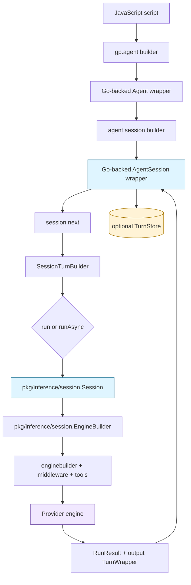

# Geppetto JS Session API: From Turns to Sessions

This report explains the second major step in the Geppetto JavaScript API redesign: the move from public turn-based execution to a session-centered API. The earlier wrapper-first work made the API safer by insisting that JavaScript pass Go-owned wrappers rather than plain maps. The session work keeps that rule, but changes the public model of execution. A user no longer constructs a turn and passes it to `agent.run(turn)`. A user builds an agent, opens a session, asks that session for the next turn, and runs that next turn.

The change is small at the call site and large in meaning:

```js
const session = agent.session().id("chat-123").build();
const result = session.next().user("Continue.").run();
```

This line says where conversation state lives. It does not live invisibly inside the agent. It does not live in a JavaScript object that pretends to be a transcript. It lives in a Go-backed `AgentSession`, which owns stable session identity, latest-turn history, one-active-run enforcement, fork semantics, resume semantics, and persistence selection. Turns remain the internal data model and the durable snapshot type, but sessions become the public execution model.

> [!summary]
> - The JavaScript API stepped back from public `gp.turn(...)` and `agent.run(turn)` because those calls forced every script author to manually emulate session lifecycle.
> - The new public boundary is `agent.session().build()`, followed by explicit `session.next().user(...).run()` or `session.next().user(...).runAsync().promise`.
> - Turns are still central, but they are now snapshots, results, history entries, and persistence records rather than ordinary public execution input.
> - The design works because Geppetto already had a Go `session.Session` abstraction with the right invariants: stable session id, append-only history, clone-latest semantics, one active inference, and cancellable execution.
> - The final implementation also wires fork, resume, turn-store persistence, EventEmitter streaming, host Go tools, and Pinocchio-backed SQLite storage into the session-centered model.

## Why this report exists

The first Geppetto JavaScript hard cut was wrapper-first but still turn-centered. It made a script write this kind of code:

```js
const first = agent.run(gp.turn()
  .system("Be concise.")
  .user("Explain SQLite WAL.")
  .build());

const second = agent.run(gp.turn(first.outputTurn())
  .user("Now explain the tradeoffs for mobile apps.")
  .build());
```

This was correct in a narrow sense. It made state explicit. It kept turns Go-owned. It made continuation visible. It avoided hidden `agent.ask(...)` behavior. But it asked users to perform session mechanics by hand. The second line is not really about building an arbitrary turn; it is about deriving the next turn in a conversation. The user wants to say: use the latest context, append this user message, assign a fresh turn identity, run once, update the session history, and persist the final turn if configured.

That is a session operation. The turn-centered API exposed the right data type at the wrong layer.

The new design corrects the layer boundary. It keeps the explicit `next()` boundary so there is no hidden chat magic, but it gives that boundary to a session object. A future reader should understand this report as an explanation of ownership: agents own configuration, sessions own lifecycle, turns own snapshots.

## The core mental model

The easiest way to understand the new API is to separate three nouns that earlier designs blurred together.

| Concept | What it owns | What it does not own |
|---|---|---|
| `Agent` | Engine configuration, middleware, tools, EventEmitter sinks, run defaults, persistence defaults | Conversation history |
| `AgentSession` | Session id, name, metadata, turn history, resume/fork state, one-active-run invariant | Provider settings or tool definitions |
| `TurnWrapper` | A Go-owned snapshot of blocks and metadata | Public execution lifecycle |

An agent is reusable. It answers the question: with which engine, middleware, tools, event sinks, and persistence defaults should inference run? A session is stateful. It answers the question: what is the current conversation context, and what is the next derived turn? A turn is durable. It answers the question: what exact context snapshot was used or produced?

The new public flow is therefore:

```text
settings wrapper
  -> agent builder
  -> agent
  -> session builder
  -> agent session
  -> session.next()
  -> session turn builder
  -> run / runAsync
  -> run result + updated session history
```

This is not just an ergonomic improvement. It removes a class of API misuse. If a script can freely call `agent.run(turn)`, the script must remember which turn is latest, which session id to stamp, whether the old `Turn.ID` should be preserved or cleared, whether the latest turn should be persisted, and whether another run is already active. If a script calls `session.next().run()`, those responsibilities move into Go code where they can be tested once.

## Before and after

The old public turn-run model treated the turn as the main object of execution:

```js
const turn = gp.turn()
  .system("Be brief.")
  .user("Hello")
  .build();

const result = agent.run(turn);
```

The new model treats the session as the main object of execution:

```js
const session = agent.session()
  .id("chat-123")
  .name("Support chat")
  .build();

const result = session.next()
  .system("Be brief.")
  .user("Hello")
  .run();
```

Continuation becomes the most important difference. In the old model, continuation had to reconstruct history explicitly or clone a result turn:

```js
const nextTurn = gp.turn(previous.outputTurn())
  .user("Follow up")
  .build();

const nextResult = agent.run(nextTurn);
```

In the new model, continuation is the default meaning of `next()`:

```js
const nextResult = session.next()
  .user("Follow up")
  .run();
```

The new version is shorter, but shortness is not the main value. The main value is that `session.next()` has a precise invariant: clone the latest context, clear any copied `Turn.ID`, stamp the session id, append new blocks, and run at most one inference at a time.

## Architecture

The session-centered API is a thin JavaScript wrapper over existing Go session machinery. That is why the hard cut was feasible. Geppetto did not need a new conversation engine; it needed to expose the correct existing engine to JavaScript.



There are two important boundaries in this diagram.

The first boundary is between JavaScript and Go-owned wrappers. JavaScript calls methods, but authoritative session state lives in Go. The session's latest turn is not a mutable JavaScript object; it is a Go `turns.Turn` snapshot exposed through a wrapper when the script asks for it.

The second boundary is between session lifecycle and inference wiring. The session knows when a run starts, whether another run is active, and which turn is latest. The engine builder knows how to assemble the provider engine, middleware, tool registry, tool loop options, EventEmitter sinks, snapshot hook, and persister for a specific inference.

## The implementation spine

The public API lives mainly in these files:

- `/home/manuel/workspaces/2026-06-01/geppetto-js/geppetto/pkg/js/modules/geppetto/api_agent.go`
- `/home/manuel/workspaces/2026-06-01/geppetto-js/geppetto/pkg/js/modules/geppetto/api_session.go`
- `/home/manuel/workspaces/2026-06-01/geppetto-js/geppetto/pkg/js/modules/geppetto/api_sessions.go`
- `/home/manuel/workspaces/2026-06-01/geppetto-js/geppetto/pkg/js/modules/geppetto/api_turn_builder.go`
- `/home/manuel/workspaces/2026-06-01/geppetto-js/geppetto/pkg/js/modules/geppetto/api_turn_store.go`
- `/home/manuel/workspaces/2026-06-01/geppetto-js/geppetto/pkg/inference/session/session.go`
- `/home/manuel/workspaces/2026-06-01/geppetto-js/geppetto/pkg/inference/session/execution.go`

The old public agent object used to expose direct run methods. The hard cut removed those. A built agent now exposes `session()` as its execution entrypoint:

```go
func (m *moduleRuntime) newAgentObject(ref *agentRef) *goja.Object {
    o := m.vm.NewObject()
    m.attachRef(o, ref)
    m.mustSet(o, "name", ref.name)
    m.mustSet(o, "session", func(goja.FunctionCall) goja.Value {
        return m.newSessionBuilderObject(newSessionBuilderFromAgent(ref))
    })
    return o
}
```

The session builder takes configuration from the agent and optionally overrides it. The builder can set an id, name, base turn, store, persistence behavior, resume behavior, metadata, and run defaults. When it builds, it creates a Go `session.Session` with a stable session id:

```go
sessionID := strings.TrimSpace(b.id)
if sessionID == "" {
    sessionID = uuid.NewString()
}

s := &agentSessionRef{
    sess: gosession.NewSessionWithID(sessionID),
    name: b.name,
    persister: b.selectedPersister(),
    store: b.selectedStore(),
    metadata: cloneJSONMap(b.metadata),
}
```

The most important method is `nextBuilder`. It is where the new API earns its correctness. If the session has a latest turn, the method clones it and clears the copied turn id. If the session is empty, it starts from a new turn. In both cases, it stamps the session id and session metadata.

```go
seed := &turns.Turn{}
if latest := s.sess.Latest(); latest != nil {
    seed = latest.Clone()
    seed.ID = ""
}
_ = turns.KeyTurnMetaSessionID.Set(&seed.Metadata, s.sess.SessionID)
```

That small `seed.ID = ""` line is a central design decision. It preserves history by preventing a derived turn from reusing the persistent identity of the turn it copied. Without it, a continuation could overwrite or confuse the stored snapshot it was derived from.

## Runtime semantics of `session.next()`

`session.next()` is not a convenience alias for `gp.turn(session.latestTurn())`. It is a lifecycle operation with ordering and identity rules.

A faithful pseudocode version is:

```text
function session.next(): SessionTurnBuilder
    if session is closed:
        error "session is closed"

    if session has an active inference:
        error "session already active"

    if session has latest turn:
        seed = clone(latest turn)
        seed.id = ""                  // derived turn must get a new id
    else:
        seed = new empty turn

    seed.metadata.sessionID = session.id
    seed.metadata += session.metadata

    return SessionTurnBuilder(seed)
```

The builder returned by `next()` is immutable in the practical JavaScript sense. Each block method clones the current builder turn and returns a new wrapper. The builder can append system text, user text, assistant text, multimodal user blocks, and metadata. It can then run synchronously or asynchronously.

```js
const result = session.next()
  .system("You are terse.")
  .user(m => m
    .text("Describe this image")
    .imageURL("https://example.invalid/image.png"))
  .metadata("requestKind", "caption")
  .run();
```

The key points to internalize:

- `session.next()` is explicit. The API did not reintroduce `agent.ask(...)` or hidden chat state.
- `session.next()` is contextual. It starts from the latest session turn when one exists.
- `session.next()` is identity-safe. It clears copied turn ids before derived execution.
- `session.next()` is concurrency-aware. It refuses to create a new run while the session already has an active inference.

## Synchronous and asynchronous execution

Synchronous execution is still available:

```js
const result = session.next()
  .user("Give me the short answer.")
  .run({ timeoutMs: 120000 });
```

Asynchronous execution returns a handle:

```js
const handle = session.next()
  .user("Stream a short answer.")
  .runAsync();

handle.cancel();        // if needed
const result = await handle.promise;
```

The handle is deliberately not just a Promise. It carries lifecycle controls such as `cancel()` and `close()`, while the result is delivered through `handle.promise`. This makes cancellation and event delivery explicit without attaching ad hoc methods to a Promise object.

The implementation has to respect goja runtime ownership. JavaScript callbacks, JavaScript tools, and EventEmitter delivery must happen on the runtime owner thread. A naive synchronous implementation would start a goroutine, block the owner thread, and then deadlock when the inference path tried to call back into JavaScript. The session implementation avoids this by using owner-aware blocking helpers for sync runs and by scheduling Promise settlement back onto the runtime owner for async runs.

The CI failure fixed after the PR review illustrates the same rule. A test waited for the Go-side store write and then immediately read JavaScript Promise state. On GitHub Actions, persistence had completed before the Promise `.then(...)` callback updated `globalThis.asyncPersistDone`. The fix was to wait for both the store write and the JS-visible completion signal. The lesson is precise: Go-side completion and JavaScript Promise continuation are related, but they are not the same event.

## Forking sessions

Forking creates a new session builder preseeded from an existing session turn. The default fork base is the latest turn:

```js
const fork = session.fork()
  .id("chat-123-fork")
  .build();

const forkResult = fork.next()
  .user("Answer from a different angle.")
  .run();
```

A caller can also fork from a specific historical turn:

```js
const firstTurn = session.turn(0);
const fork = session.fork({ at: firstTurn })
  .id("chat-123-from-first")
  .build();
```

Forking has a subtle identity rule. The imported base turn preserves its original `Turn.ID` as evidence. A fork is allowed to say: this is the exact historical snapshot I started from. But the first derived `fork.next()` clears the copied id and receives a fresh id. The imported base is history; the derived turn is new work.

The implementation also records fork provenance metadata when the base comes from a fork source. It retags the imported base to the new session id for in-memory consistency while preserving origin session and turn information. This is the kind of behavior that belongs in a session wrapper rather than in every script that happens to fork a conversation.

## Resuming sessions from storage

The session API becomes more valuable when paired with turn stores. Geppetto exposes storage as a host capability. It does not open SQLite files directly from JavaScript. A host such as Pinocchio can register a default store, and JavaScript can use it through `gp.turnStores`.

```js
const store = gp.turnStores.default();

const session = agent.session()
  .id("chat-123")
  .store(store)
  .resumeLatest()
  .build();
```

The default resume behavior is non-strict. If no stored turn exists, the session starts empty. A caller can make resume required:

```js
const session = agent.session()
  .id("chat-123")
  .defaultStore()
  .resumeLatest({ required: true })
  .build();
```

The implementation defaults the resume query to the session id and the final phase:

```text
if query.sessionId and query.convId are empty:
    query.sessionId = session.id

if query.phase is empty:
    query.phase = "final"
```

This behavior matches the mental model of a chat session: open the session named `chat-123`, load the latest final turn for that session if it exists, and continue from there.

## Pinocchio as the concrete storage host

The storage boundary is important enough to state directly: Geppetto defines the JavaScript wrapper and host-facing interface; Pinocchio owns the concrete `--turns-dsn` / `--turns-db` storage implementation.

Pinocchio now adapts its SQLite `chatstore.TurnStore` into Geppetto's `TurnStore` interface. When `pinocchio js` is launched with `--turns-dsn` or `--turns-db`, it registers the opened store as:

- the default readable turn store exposed through `gp.turnStores.default()`;
- the default persister for successful final turns;
- a named store called `default`.

The two-process smoke test proved the path end to end. The first process opened a temporary SQLite database, created a session, ran a provider call, and verified `store.loadLatest({ sessionId, phase: "final" })` could read the final turn. The second process opened the same database, built the same session id with `resumeLatest({ required: true })`, and ran a follow-up prompt that included the previous context.

The result matters because it validates the ownership split. Geppetto's JS API can say `resumeLatest()` without knowing SQLite. Pinocchio can provide SQLite without changing Geppetto's session lifecycle.

## Middleware, tools, and events after the hard cut

The session hard cut removed legacy top-level namespaces, not the underlying capabilities. Middleware remains attached through the agent builder:

```js
const agent = gp.agent()
  .inference(settings)
  .goMiddleware("systemPrompt", { prompt: "Be terse." })
  .build();
```

Tools remain available through JavaScript tool definitions, explicit registries, and host Go tools:

```js
const agent = gp.agent()
  .inference(settings)
  .goTool("search")
  .toolLoop({ maxIterations: 4 })
  .build();
```

The PR review found that `goTool(name)` recorded a name but failed if no explicit `agent.tool(registry)` was configured. The fix was to resolve named Go tools against the module-level host `GoToolRegistry` when the agent has no explicit registry. This keeps the user-facing rule clear: use `tool(registry)` for JavaScript-defined or explicit wrapper registries; use `goTool(name)` for tools supplied by the embedding Go application.

EventEmitter support remains builder-level:

```js
const agent = gp.agent()
  .inference(settings)
  .events(emitter)
  .build();

const handle = agent.session().id("events-demo").build()
  .next()
  .user("Stream progress.")
  .runAsync();

const result = await handle.promise;
```

The design deliberately does not add `handle.on(...)`. Attaching listeners to an already-started async handle is racy unless startup semantics change. Builder-level EventEmitter attachment makes the event sink available before the run begins.

## Removed public surface

The removed names are part of the design, not cleanup trivia. The current API intentionally omits:

- `gp.turn`
- `gp.turns`
- `gp.events`
- `gp.chat`
- `gp.inferenceSettings`
- `gp.createBuilder`
- `gp.createSession`
- `gp.runInference`
- `gp.engines`
- `gp.profiles`
- `gp.runner`
- `gp.schemas`
- `gp.middlewares`
- `gp.tools`
- `agent.run(turn)`
- `agent.runAsync(turn)`

The deletion of `gp.turn` is the defining change for this report. It says that public JavaScript no longer constructs a turn as an execution input. If a script needs to inspect a turn, it can get a `TurnWrapper` from a result, a session history entry, or a turn store snapshot. If it needs to execute the next step, it asks the session for `next()`.

## Provider registry cleanup

One PR review comment concerned a legacy provider config field called `registry`. The field had confusing behavior: in some contexts it looked like a host-interpreted selector; in the newer Geppetto provider path it was converted into `ProfileRegistries`, which then required `allowRegistryLoad=true` and tried to load it as a source.

The final decision was not to preserve the legacy field. The provider config now uses `profileRegistries` for explicit registry source loading. The old `registry` path was removed from the config struct, schema, decode aliasing, and default profile resolution branch.

The important rule is now simpler:

```json
{
  "profileRegistries": ["/path/to/profiles.yaml"],
  "defaultProfile": "assistant",
  "allowRegistryLoad": true
}
```

If JavaScript provider configuration asks Geppetto to load registry sources, it must say so with `profileRegistries` and pass the security gate with `allowRegistryLoad=true`. There is no second legacy spelling that sometimes means another thing.

## The final API in one page

A typical profile-backed session run:

```js
const gp = require("geppetto");

const settings = gp.inferenceProfiles.resolve("assistant");

const agent = gp.agent()
  .name("assistant")
  .inference(settings)
  .events(emitter)
  .runDefaults({ timeoutMs: 120000 })
  .build();

const session = agent.session()
  .id("chat-123")
  .metadata("tenant", "demo")
  .build();

const result = session.next()
  .system("Be concise.")
  .user("Explain the session API.")
  .run();

console.log(result.text());
```

A storage-backed resume run:

```js
const store = gp.turnStores.default();

const session = agent.session()
  .id("chat-123")
  .store(store)
  .resumeLatest({ required: false })
  .build();

const result = await session.next()
  .user("Continue from where we left off.")
  .runAsync()
  .promise;
```

A fork:

```js
const fork = session.fork()
  .id("chat-123-experiment")
  .build();

const result = fork.next()
  .user("Try a more technical explanation.")
  .run();
```

A host-tool run:

```js
const agent = gp.agent()
  .inference(settings)
  .goTool("search")
  .toolLoop({ maxIterations: 4 })
  .build();

const result = agent.session().id("tool-demo").build()
  .next()
  .user("Search for the latest project status.")
  .run();
```

## Design decisions

### Decision 1: Sessions are public; turns are snapshots

The public execution API now starts from `agent.session()`. Turns still exist, but normal users encounter them as result snapshots, session history entries, fork bases, and persistence records.

This decision reduces lifecycle boilerplate and prevents scripts from accidentally reusing turn ids or forgetting session metadata. The cost is that lower-level turn construction is no longer available as a public escape hatch. That cost is intentional.

### Decision 2: `session.next()` is explicit, not hidden chat magic

The API did not add `agent.ask(...)`. A caller must ask for the next turn explicitly. This keeps the important state transition visible while still centralizing the mechanics.

The distinction matters. Hidden chat APIs make it hard to see when context is cloned, when ids change, and where persistence happens. `session.next()` makes the boundary one line of code.

### Decision 3: Base turns preserve identity; derived turns clear identity

When a session is created from a base turn, resumed from storage, or forked from another session, the imported base turn preserves its `Turn.ID`. That id is evidence. It tells the reader and the store which historical snapshot was imported.

When `session.next()` derives new work from that base, it clears the copied id. That derived turn is a new snapshot and must receive its own identity. This rule is the heart of safe resume and fork behavior.

### Decision 4: Async returns a handle, not only a Promise

`runAsync()` returns a handle with `promise`, `cancel`, and `close`. The result is awaited through `handle.promise`.

This is more verbose than making `runAsync()` itself a Promise, but it preserves lifecycle controls. A future ergonomic improvement could make the handle thenable, allowing `await session.next().user(...).runAsync()` while keeping `handle.cancel()`. The current API keeps the distinction explicit.

### Decision 5: Storage is host-owned

Geppetto defines `TurnStore` wrappers and session resume semantics. Pinocchio owns concrete DSN-backed SQLite storage. This keeps dependency direction clean and lets other hosts provide their own stores.

## Common failure modes

### Reusing a turn id during continuation

If a continuation clones a previous turn and keeps the old id, persistence can confuse the derived turn with the original snapshot. `session.next()` prevents that by clearing copied ids.

### Treating persistence as proof of Promise settlement

A Go-side store write can complete before JavaScript Promise continuations run. Tests and scripts that assert JavaScript state should wait for Promise settlement, not merely for a Go-side effect.

### Confusing host registry selection with profile registry loading

The old `registry` provider field blurred two ideas. The new provider config keeps only `profileRegistries` for explicit source loading, gated by `allowRegistryLoad=true`.

### Expecting `gp.middlewares` or `gp.events` namespaces

The hard cut removed legacy top-level namespaces. Middleware and events still exist through the agent builder: `goMiddleware(...)`, `middleware(...)`, and `events(emitter)`.

### Expecting `runAsync()` to be the result

`runAsync()` returns a handle. The run result is delivered through `handle.promise`.

## What changed in the codebase

The implementation landed across several focused commits:

- `40fe7ec7 Add JS agent session wrappers` introduced `SessionBuilder`, `AgentSession`, and `SessionTurnBuilder`.
- `c4525da7 Hard-cut JS API to session execution` removed `gp.turn`, `agent.run(turn)`, and `agent.runAsync(turn)`, then rewrote docs, examples, and tests around sessions.
- `7409ecc7 Diary: record JS session hard cut` recorded the hard-cut implementation and validation.
- `7db41813 Address JS API review feedback` fixed host Go tool resolution and removed legacy provider `registry` behavior.
- `a2c6883a Document JS goTool host registry behavior` added missing JS API documentation for host Go tools.
- `5acbd867 Fix async turn store test race` fixed a CI flake by waiting for both persistence and Promise callback completion.
- `ec2cb1d9 Merge pull request #367 from wesen/task/geppetto-js` merged the branch into main and tagged the resulting release train state.

The main project ticket for the session work is `GP-JS-SESSION-API-2026-06-02`. The storage-related ticket is `GP-JS-TURNSTORE-2026-06-02`.

## How to review the implementation

A reviewer should start from the ownership boundary, not from the examples.

1. Read `pkg/js/modules/geppetto/api_agent.go` and confirm a built agent exposes `session()` rather than public direct run methods.
2. Read `pkg/js/modules/geppetto/api_session.go`, especially `newSessionBuilderObject`, `resumeIfRequested`, `importBaseTurn`, `nextBuilder`, `forkBuilder`, `newSessionTurnBuilderObject`, `runSync`, and `startAsync`.
3. Read `pkg/js/modules/geppetto/api_sessions.go` to see how a session run materializes the engine builder, middleware, tools, EventEmitter sinks, and persister.
4. Read `pkg/js/modules/geppetto/api_session_test.go` for the behavioral contract: multi-turn history, fork/base identity, fork at a specific turn, resume latest, and async execution.
5. Read `pkg/js/modules/geppetto/api_turn_store_test.go` for persistence behavior and the async persistence race fix.
6. Read `pkg/doc/topics/13-js-api-reference.md` and `pkg/doc/topics/14-js-api-user-guide.md` to verify the public docs match the implementation.

Useful validation commands:

```bash
cd /home/manuel/workspaces/2026-06-01/geppetto-js/geppetto

go test ./pkg/js/modules/geppetto -count=1
go test ./pkg/js/... ./cmd/examples/geppetto-js-run -count=1
go test -tags geppetto_js_hardcut_contract ./pkg/js/modules/geppetto -run TestHardCutPublicSurfaceContract -count=1
go test ./pkg/doc -count=1
go test ./...
```

## Near-term follow-ups

The session API is now coherent enough to be the public model, but several refinements are worth considering.

- The async handle could become thenable so advanced users can write `await session.next().user(...).runAsync()` while still retaining `handle.cancel()` for explicit handle use.
- The docs could add a small dedicated middleware example to make it obvious that middleware support survived the removal of the `gp.middlewares` namespace.
- The Pinocchio storage smoke could become an opt-in script so cross-process `--turns-db` resume is easy to rerun without reconstructing temporary scripts.
- More async tests could share a common owner-condition helper so they consistently wait for JS-visible state rather than Go-side side effects.

## Working rule

The durable rule for this API is:

> Agents configure inference; sessions own conversation lifecycle; turns are snapshots.

Most design questions can be answered by applying that rule. If an operation changes model settings, tools, middleware, EventEmitter sinks, or persistence defaults, it belongs on the agent builder. If it changes conversational history, resume state, fork state, or active-run lifecycle, it belongs on the session. If it represents evidence of what was sent or produced, it is a turn wrapper.

That rule is why the API stepped back from public turn-based execution. It was not enough for the old API to be explicit. It had to be explicit at the right level.
