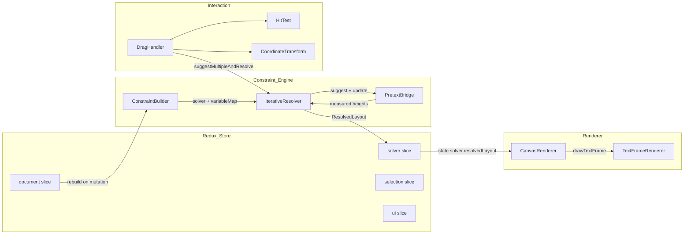

# Project Report: Cassowary Constraint Layout Demo

This report documents the design, implementation, and validation of a React + Vite + Redux demo application that combines the Cassowary constraint-solving algorithm with the Pretext text measurement library to produce typographic, constraint-based layouts rendered on HTML5 Canvas. The project is ticket CASSOWARY-1, a preliminary building block toward a desktop publishing system.

The system demonstrates three core capabilities that are individually well-understood but rarely combined: linear constraint solving for positioning and sizing, pure-math text measurement and line-breaking without DOM reflow, and iterative resolution of the coupled system where text height depends on resolved width. The result is an interactive layout editor where dragging a text frame causes connected frames to reposition through the constraint network, with text heights recomputed in real time.

> [!summary]
> 1. The Cassowary constraint solver (@lume/kiwi) resolves linear positioning constraints. Text height is a non-linear, discontinuous function of width, resolved by an iterative solve-measure loop that feeds Pretext measurements back into the solver as edit variable suggestions.
> 2. The solver's strength hierarchy (required > strong > medium > weak) is not decorative. Misassigning strengths causes frames to freeze, constraints to be silently violated, or the solver to produce negative dimensions. Required constraints for structural rules and required minimums for frame dimensions are essential.
> 3. The magazine layout preset (5 frames, 17 constraints) revealed that required vertical constraints chaining frame heights force the solver into negative-height solutions when the chain over-constrains the system. Fixed vertical gaps decouple positioning from text measurement.

## Why this project exists

The project's purpose is to validate a specific architectural hypothesis: that a constraint-based layout system for typographic design can run entirely in the browser, at interactive frame rates, without relying on the DOM for text measurement. This matters because DOM-based measurement triggers forced reflow, which costs 0.1–10ms per call. In an iterative layout loop that may call measurement 10–20 times per frame, DOM measurement would consume the entire 16ms frame budget.

Pretext provides an alternative: it computes text layout with pure TypeScript math, bypassing the DOM entirely. At approximately 0.001ms per `layout()` call, it is fast enough to be called inside the iterative resolution loop. Cassowary provides the constraint engine: an incremental simplex solver that can resolve hundreds of linear constraints in under a millisecond. Together, they form a system where layout resolution and text measurement are both fast enough for real-time interaction.

The project exists as a building block. A full desktop publishing system would need multi-page support, image frames, undo/redo, export, collaborative editing, and many other features. Those are out of scope. The scope is constrained to: text frames on a single canvas, linear constraints for positioning and sizing, interactive drag with live layout updates, and a constraint editor for runtime modification of the constraint system.

## Current project status

The project is in a working prototype state with five implementation phases complete.

What is implemented:

- A React + Vite application with Redux Toolkit state management
- A Cassowary constraint engine using @lume/kiwi that resolves linear equalities and inequalities
- A Pretext bridge that prepares text, measures heights at given widths, and caches results
- An iterative resolver that solves, measures text heights, feeds measured heights back as edit variable suggestions, and repeats until convergence
- A Canvas renderer that draws frames, text lines, selection handles, constraint visualization lines, rulers, and guides
- A drag handler that hit-tests frames and handles, propagates suggestions through required constraints, and updates the layout in real time
- A constraint editor with a DSL parser for human-readable constraint expressions (`frame-1.left + 40 == frame-2.left`)
- A magazine layout preset demonstrating 5 frames with 17 constraints
- A control panel showing layout stats, frame inspector, constraint list, and visualization toggles

What is still incomplete:

- Zoom and pan via mouse wheel and middle-click drag (uiSlice has state but no wiring)
- Guide creation via drag from ruler area (rendering exists, interaction does not)
- Unit tests for ConstraintBuilder, PretextBridge, and IterativeResolver
- Rich inline text (mixed fonts within a paragraph)
- Web Worker offloading for the constraint engine
- Undo/redo via Redux action history

## Architecture

The system has four layers: constraint engine, state management, renderer, and interaction. The constraint engine lives outside Redux because the Cassowary Solver object is mutable and non-serializable. Only the resolved values — positions, sizes, line data — are extracted from the solver and dispatched to the Redux store.



### Constraint Engine

The constraint engine is a singleton (`ConstraintEngine`) that wraps an `IterativeResolver`. The resolver maintains a `BuildResult` containing the live Cassowary solver, a map from variable names to `kiwi.Variable` objects, and metadata about edit variables. The resolver has two modes of operation:

**Full rebuild** (`rebuild(doc)`): Constructs a new solver from the document model, runs the initial solve, then iterates the solve-measure loop until text heights converge. Used when the document model changes (adding/removing frames or constraints).

**Fast update** (`suggestMultipleAndResolve(suggestions, doc)`): Suggests new values for one or more edit variables on the existing solver, calls `updateVariables()`, then iterates the solve-measure loop. Used during drag operations. This path completes in under 1ms because it avoids reconstructing the solver from scratch.

### State Management

The Redux store has four slices:

- **document**: The canonical document model — frames, constraints, canvas size, guides. All other state derives from this.
- **solver**: The resolved layout (positions, sizes, line data), solve time, iteration count. Populated by the constraint engine.
- **selection**: Selected frame IDs, drag handle info, editing frame ID.
- **ui**: Visualization toggles (constraint lines, rulers, guides), zoom, pan offset.

A constraint middleware detects document-mutating actions and triggers a full rebuild. The middleware runs after the action is dispatched, reading the new document state and calling `engine.rebuild()`.

### Renderer

The Canvas renderer reads from `store.getState()` every animation frame, bypassing React's render cycle. This decouples rendering from React reconciliation: the canvas updates immediately when the Redux state changes, without waiting for React to process the update.

The renderer draws in layers:

1. Canvas background
2. Document area (white)
3. Guides (magenta dashed lines, if enabled)
4. Constraint visualization lines (colored by strength, if enabled)
5. Frames (fill, text, stroke)
6. Selection highlight and handles
7. Rulers (gray bars with tick marks, if enabled)
8. Performance stats (solve time, iteration count)

### Interaction

The drag handler manages three mouse events:

**MouseDown**: Hit-test to find the topmost frame under the cursor. If a frame is hit, record the starting mouse position and frame position. If a handle is hit, record the handle type for resize.

**MouseMove**: Compute the delta from the start position. Build a list of edit variable suggestions. Inspect required constraints that involve the dragged frame. For each required equality constraint linking the dragged frame to another frame on the same axis, compute the corresponding suggestion for the connected frame. Call `suggestMultipleAndResolve()` with all suggestions.

**MouseUp**: Clear the drag state. Do not rebuild the solver — the current solver state is consistent. Rebuilding would reset edit variable suggestions to their initial values, undoing the drag.

## The iterative solve-measure loop

The central technical challenge is that text frame height is a non-linear, discontinuous function of width. When width decreases below a line-break threshold, text wraps to an additional line, causing a discontinuous jump in height. Cassowary solves linear constraints — it cannot express "height = f(width)" directly.

The solution is an iterative loop:

1. Solve the linear constraint system to get frame positions and sizes.
2. For each text frame, measure the actual text height at the resolved width using Pretext.
3. If the measured height differs from the solver's current height by more than 0.5 pixels, suggest the measured height as a new value for the height edit variable.
4. Call `solver.updateVariables()` to re-resolve with the new height suggestions.
5. Repeat until no heights change between iterations.

```
function iterativeResolve(document):
  for iteration in 0..MAX_ITERATIONS (5):
    heightsChanged = false
    for frame in document.textFrames:
      resolvedWidth = solver.get(frame + "-width").value()
      measuredHeight = pretextBridge.measure(frame, resolvedWidth, lineHeight).height
      previousHeight = previousHeights.get(frame.id) ?? -1
      if |measuredHeight - previousHeight| > HEIGHT_TOLERANCE (0.5px):
        solver.suggestValue(frame + "-height", measuredHeight)
        previousHeights.set(frame.id, measuredHeight)
        heightsChanged = true
    if !heightsChanged:
      return iteration + 1   // converged
    solver.updateVariables()
  return MAX_ITERATIONS       // did not converge
```

The loop converges in 2 iterations for typical layouts. This is because text height is piecewise-constant: it only changes when width crosses a line-break threshold. Once the linear solver stabilizes the widths (which it does in a single pass), the heights stabilize too. The tolerance of 0.5 pixels prevents infinite oscillation from rounding errors.

The cost of a full rebuild is approximately 16ms for two frames and 10ms for five frames. The cost of a suggest-and-resolve is under 1ms. Drag operations, which use the fast path, stay well within the 16ms frame budget.

## The strength hierarchy and its consequences

Cassowary defines four constraint strengths with numeric priorities:

| Strength | Numeric value | Usage |
|----------|--------------|-------|
| required | 1,001,001,000 | Hard constraints — bounds, structural relationships, minimum dimensions |
| strong | 1,000,000 | Edit variables for user-controlled dimensions; hard preferences |
| medium | 1,000 | Soft preferences — preferred margins, alignment hints |
| weak | 1 | Fallback hints — default positions, initial suggestions |

The hierarchy determines solver behavior when constraints conflict. Understanding this hierarchy is the most important aspect of building a working constraint layout system.

**Required constraints must be satisfied.** If two required constraints conflict, the solver throws an "unsatisfiable constraint" error. Required constraints are for structural relationships that cannot be violated: bounds, frame gaps, alignment equalities, minimum dimensions.

**Strong edit variables override medium and weak constraints.** When the user drags a frame, the edit variable at strong strength overrides a medium "prefer 40px margin" constraint.

**But strong does not override required.** If a required constraint says "frame-2-top = frame-1-top" and both frames have strong edit variables suggesting different top values, the required constraint forces equality. The solver resolves the conflict by finding a compromise value. If both edit variables suggest the same value (e.g., top=40), the required constraint is satisfied. If they suggest different values (top=40 and top=140), the solver must choose one — and the outcome depends on the full constraint system, not just the two edit variables.

This is the key failure mode discovered during implementation: when dragging frame-1 with a required same-top constraint to frame-2, the drag handler must also suggest the same new top value for frame-2. Otherwise, the solver sees two strong suggestions that conflict through a required equality, and the result is unpredictable — often the frames stay at their original position.

The practical rule: when a required constraint links two frames, dragging one frame requires suggesting values for both frames simultaneously.

## What was built and how

### Phase 1: Skeleton

The application skeleton consists of a Vite + React + TypeScript project with Redux Toolkit for state management. The main components are `CanvasViewport` (the canvas element with render loop and mouse events) and `ControlPanel` (the sidebar with stats, toggles, and constraint editor). The canvas runs a `requestAnimationFrame` loop that reads the latest Redux state each frame and calls `CanvasRenderer.render(state)`.

### Phase 2: Constraint Engine

The constraint engine has four components:

**Types** (`engine/types.ts`): Defines the document model — `Document`, `Frame`, `LayoutConstraint`, `ConstraintExpression`, `ResolvedLayout`. A frame has `id`, `type` (text or shape), `constraintVars` (variable names for left, top, width, height), text properties (content, font, lineHeight, textAlign), and visual properties (fill, stroke). A constraint has `id`, `strength`, `expression` (terms + constant + operator), and `description`.

**ConstraintBuilder** (`engine/ConstraintBuilder.ts`): Translates the document model into a live Cassowary solver. For each frame, it creates four `kiwi.Variable` objects and registers left, top, width, and height as edit variables at strong strength. It adds default constraints: canvas bounds (required), minimum size (strong), and per-frame `minWidth` (required). For each user-defined constraint, it splits the expression into left-hand side (positive terms) and right-hand side (negative terms with flipped signs, plus negated constant), then calls `solver.createConstraint(lhs, op, rhs, strength)`.

**PretextBridge** (`engine/PretextBridge.ts`): Caches prepared text and measures layouts. `prepare(frame)` tokenizes text and computes grapheme widths, caching by key `id::font::text`. `measure(frame, width, lineHeight)` calls `layoutWithLines` and returns height, line count, and line objects. `invalidate(frameId)` clears the cache.

**IterativeResolver** (`engine/IterativeResolver.ts`): The core resolution engine. `rebuild(doc)` constructs a new solver, runs the initial solve, then calls `iterativeResolve()` until text heights converge. `suggestAndResolve()` and `suggestMultipleAndResolve()` are the fast paths for drag operations. `extractResolvedLayout()` reads final variable values and collects Pretext line data.

### Phase 3: Interactive Drag and Selection

**HitTest** (`interaction/HitTest.ts`): Iterates frames in reverse z-order to find the topmost frame under a point. Checks selection handles first (they render on top), then frame bodies. Returns `frameId` and optional `handlePosition`.

**CoordinateTransform** (`interaction/CoordinateTransform.ts`): Converts screen mouse coordinates to canvas-space coordinates, accounting for zoom and pan offset.

**DragHandler** (`interaction/DragHandler.ts`): Manages the three mouse events. On body drag, suggests new left and top values. On handle drag, suggests new width, height, and position depending on the handle. Crucially, inspects required constraints that involve the dragged frame and propagates suggestions to connected frames.

### Phase 4: Constraint Editor

**ConstraintDSL** (`engine/ConstraintDSL.ts`): A tokenizer, parser, serializer, and validator for human-readable constraint expressions. The grammar supports: `frameId.property`, `number * frameId.property`, `+` and `-` operators, `==`, `<=`, `>=` comparators. The parser produces a `ConstraintExpression` in the internal format. The serializer reverses the process. The validator checks that referenced frame IDs and properties exist in the document model.

**ControlPanel** (`components/ControlPanel.tsx`): Displays layout stats, visualization toggles, the constraint editor (DSL input, strength dropdown, Add button), the constraint list (serialized DSL, strength badge, delete button), the selected frame inspector, and the frame list.

### Phase 5: Magazine Layout Preset

**MagazineLayoutPreset** (`presets/MagazineLayoutPreset.ts`): A 5-frame layout with 17 constraints demonstrating the full power of the system. The preset revealed a critical solver issue: required vertical constraints that chain frame heights (`subhead-top = headline-top + headline-height + 20`) force the solver into negative-height solutions when the chain over-constrains the system. The fix was to use fixed vertical gaps (`subhead-top = headline-top + 100`) instead of height-dependent chains, and to make `minWidth` constraints required instead of strong.

## Verified behavior

The system was verified with two test layouts:

### Default 2-frame layout

| Property | Value |
|----------|-------|
| Frame 1 position | (40, 40) |
| Frame 2 position | (260, 40) |
| Gap constraint | 20px (required) |
| Same-top constraint | required |
| After drag down 100px | Both frames at top=140 |
| Initial solve time | ~16ms |
| Incremental solve time | <1ms |
| Iterations to converge | 2 |
| Frame rate during drag | 60fps |

### Magazine 5-frame layout

| Property | Value |
|----------|-------|
| Frames | 5 |
| Constraints | 17 |
| Canvas size | 1200×1200 |
| Headline | 40, 0 — 1120×44 |
| Subhead | 40, 100 — 1120×52 |
| Body-left | 40, 220 — 200×768 |
| Body-right | 270, 220 — 200×672 |
| Sidebar | 500, 220 — 180×220 |
| Initial solve time | ~10ms |
| Iterations to converge | 2 |

## What worked well

**The iterative resolution loop converges reliably.** In all tested layouts, the loop converges in 2 iterations. This is because text height is piecewise-constant: it only changes when width crosses a line-break threshold, and the linear solver stabilizes widths in a single pass.

**Pretext is fast enough for real-time use.** At approximately 0.001ms per `layout()` call, measuring 5 text frames per iteration costs 0.005ms. Even with 5 iterations, this is negligible compared to the solver's ~10ms cost.

**The constraint editor makes the system interactive.** Being able to type `frame-1.width >= 250`, select a strength, and press Enter to see the layout update immediately validates the architecture. The serialized DSL display in the constraint list makes the internal representation transparent.

**Drag with constraint propagation works correctly.** When a required same-top constraint links two frames, dragging one frame causes both to move. The hit-test prioritizes handles over frame bodies, making resize operations discoverable. Cursor feedback (resize cursors on handles, grab cursor on frames) makes the interaction model clear.

**The magazine layout validates the system at scale.** Five frames with 17 constraints is a realistic test that surfaced solver issues invisible in the 2-frame demo. The fact that the layout resolves correctly after fixing the minWidth strength and vertical gap design confirms the architecture is sound.

## What did not work and why

### The kiwi.Constraint constructor parameter ordering trap

The `new kiwi.Constraint(expression, operator, [rhs], [strength])` constructor interprets its third argument as `rhs` if it is a number or Expression, and as `strength` if it is a Strength value. When passing `Strength.strong` as the third argument, kiwi interprets it as the right-hand side of the equation, creating a constraint like `frame-1-top == 1000000` instead of `frame-1-top == 0` at strong strength. This causes "unsatisfiable constraint" errors that are extremely difficult to diagnose because the error message does not point to the root cause.

The fix is to use `solver.createConstraint(lhs, op, rhs, strength)` exclusively. This method takes the RHS and strength as separate named arguments, avoiding the ambiguity.

This trap is documented in both the kiwi API reference and the kiwi GitHub README, which both show `new kiwi.Constraint(...)` examples without warning about the parameter ordering. No documentation anywhere describes this trap.

### Required vertical constraints chaining frame heights

The initial magazine layout design used required vertical constraints that chained frame heights: `subhead-top = headline-top + headline-height + 20`. The intent was to position each frame below the previous one with a gap.

The problem: the solver's initial solution underestimates headline-height (20 instead of the measured 44). This makes the right-hand side of the constraint evaluate to a value that is too small. The solver must then set subhead-height to a negative value to satisfy the required `subhead-top = headline-top + subhead-height + 30` constraint for the body columns, while also respecting the strong edit variable suggestion that subhead-top should be near 40.

The result: subhead-height = -30, violating the strong `height >= 20` constraint. Required constraints always win over strong constraints. No error is thrown — the solver silently produces the negative height.

The fix has two parts:

1. **Use fixed vertical gaps instead of height-dependent chains.** Replace `subhead-top = headline-top + headline-height + 20` with `subhead-top = headline-top + 100`. This decouples vertical positioning from text measurement. The gap is large enough to accommodate any reasonable text height.

2. **Make minWidth and minHeight required.** The solver was collapsing body column widths to 20 pixels despite `minWidth = 200` at strong strength. This happened because the edit variable suggested width = 500, which was impossible given the required margin constraints (max 440). The solver found a valid solution at width = 20, which satisfied the strong default `width >= 20` but violated the strong `width >= 200`. Making minWidth required prevents this collapse.

### Strong constraints being silently violated

In Cassowary, when a strong constraint conflicts with a required constraint, the strong constraint is silently violated. No error is thrown. The solver produces a solution that satisfies the required constraint while approximating the strong constraint as closely as possible.

This behavior is correct for the algorithm but dangerous for developers. The 2-frame demo worked because there were no conflicting required and strong constraints. The 5-frame magazine layout exposed the problem because the required margin constraints and required vertical positioning constraints created a tightly constrained system where strong minimum-size constraints had no room to operate.

The lesson: in a tightly constrained layout system, structural minimums (minWidth, minHeight, bounds) should be required, not strong. Strong should be reserved for preferences that can be approximated when required constraints dominate.

### Redux Map serialization

The `ResolvedLayout` returned by the solver contains a `Map<string, ResolvedFrame>`. Redux warns about non-serializable values in actions and state. The fix is to convert the Map to a `Record<string, ResolvedFrame>` in the reducer, and to configure `serializableCheck.ignore` for the `setResolvedLayout` action.

This is a standard Redux pattern but was not obvious during initial implementation. The warning appears in the browser console but does not prevent the application from working.

## Project shape

```
cassowary-layout-demo/
├── src/
│   ├── engine/
│   │   ├── types.ts              # Document, Frame, LayoutConstraint, ResolvedLayout
│   │   ├── ConstraintBuilder.ts  # Document model → kiwi solver
│   │   ├── PretextBridge.ts      # Pretext prepare/measure/invalidate cache
│   │   ├── IterativeResolver.ts  # Solve → measure → iterate loop
│   │   ├── ConstraintEngine.ts   # Singleton facade
│   │   └── ConstraintDSL.ts      # Parser, serializer, validator for DSL
│   ├── presets/
│   │   └── MagazineLayoutPreset.ts  # 5-frame magazine layout
│   ├── renderer/
│   │   ├── CanvasRenderer.ts      # Render orchestrator
│   │   └── TextFrameRenderer.ts  # Stroke, fill, clip, fillText per line
│   ├── interaction/
│   │   ├── HitTest.ts             # Frame body + handle hit testing
│   │   ├── CoordinateTransform.ts # Screen → canvas coords
│   │   └── DragHandler.ts        # Mouse drag with constraint propagation
│   ├── store/
│   │   ├── documentSlice.ts       # Document model (frames, constraints)
│   │   ├── solverSlice.ts        # ResolvedLayout (Map → Record)
│   │   ├── selectionSlice.ts      # Selected frames, drag handle
│   │   ├── uiSlice.ts            # Show guides/rulers/constraints, zoom, pan
│   │   ├── middleware.ts          # Auto-rebuild on document mutations
│   │   └── index.ts             # Store config + serializableCheck
│   ├── components/
│   │   ├── CanvasViewport.tsx     # Canvas + RAF render loop + mouse events
│   │   └── ControlPanel.tsx      # Stats, constraint list, frame inspector
│   ├── App.tsx
│   └── main.tsx
```

## Working rules

These rules were derived from the implementation experience and should guide future development:

1. **Required constraints are for structural relationships only.** Bounds, gaps, alignment equalities between frames, and minimum dimensions. Never use required for preferences.

2. **Weak constraints are for preferences.** Margins, preferred positions, default sizes. These should yield to user interaction.

3. **Edit variables are strong.** They must override weak and medium constraints but must not conflict with required constraints.

4. **Propagate through required constraints during drag.** When a required constraint links two frames, suggesting a value for one frame requires suggesting the corresponding value for the other.

5. **Use `solver.createConstraint()`, not `new kiwi.Constraint()`.** The constructor's positional parameters are a trap.

6. **Never rebuild the solver after a drag.** The solver state is already consistent. Rebuild only when the document model changes (add/remove frames or constraints).

7. **Convert Map to Record before storing in Redux.** Non-serializable state causes warnings and breaks time-travel debugging.

8. **Read from `store.getState()` in the render loop.** Do not rely on React's render cycle for canvas updates — the RAF loop should read the latest state directly.

9. **Use fixed vertical gaps, not height-dependent chains.** When text heights are unknown (which they always are before measurement), chaining `top = previous-top + previous-height + gap` creates over-constraint.

10. **Make minWidth and minHeight required in tightly constrained layouts.** Strong minimum-size constraints can be silently violated when required positioning constraints dominate.

## Open questions

- How does the system scale to 10+ text frames? The iterative loop measures every text frame on every iteration. With N text frames, each iteration costs N × 0.001ms. At 50 frames, this is still under 1ms, but the Cassowary solver itself may slow down with more variables and constraints.
- Can the constraint propagation in the drag handler be made more general? The current implementation only propagates through direct equality constraints. Transitive propagation (A linked to B, B linked to C) would require a constraint graph traversal.
- Is a web worker necessary for large documents? The constraint engine runs synchronously on the main thread. For documents with hundreds of frames, offloading the solver to a worker would prevent UI jank.
- Should minWidth be strong with post-solve enforcement instead of required? Making minWidth required prevents the solver from finding any solution below the minimum, which is correct. But in some layouts, a required minWidth might conflict with required positioning constraints, making the entire system unsatisfiable.

## Near-term next steps

- Unit tests for ConstraintBuilder, PretextBridge, and IterativeResolver (Tasks 2.20–2.22)
- Unit tests for ConstraintDSL round-trip parsing
- Zoom and pan wiring (mouse wheel, middle-click drag)
- Guide creation via drag from ruler area
- Performance profiling with 10+ frames
- Rich inline text via `@chenglou/pretext/rich-inline`

## Important project docs

- Design doc: `ttmp/2026/06/02/CASSOWARY-1--cassowary-constraint-layout-demo-react-vite-redux-canvas/design-doc/01-cassowary-constraint-layout-architecture-and-implementation-guide.md`
- Investigation diary: `ttmp/2026/06/02/CASSOWARY-1--cassowary-constraint-layout-demo-react-vite-redux-canvas/reference/01-investigation-diary.md`
- Research logbook: `ttmp/2026/06/02/CASSOWARY-1--cassowary-constraint-layout-demo-react-vite-redux-canvas/reference/03-research-logbook.md`
- Ticket tasks: `ttmp/2026/06/02/CASSOWARY-1--cassowary-constraint-layout-demo-react-vite-redux-canvas/tasks.md`
- Vault article: `Projects/2026/06/02/ARTICLE - Constraint-Based Layout on Canvas - Cassowary + Pretext + React.md`

## Related notes

- [[ARTICLE - Playbook - Self-Contained Go Wasm and JavaScript Browser Applications|Go Wasm Browser Playbook]] — another canvas-focused browser architecture
