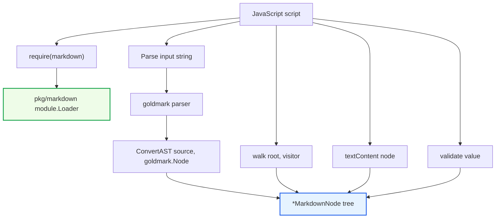
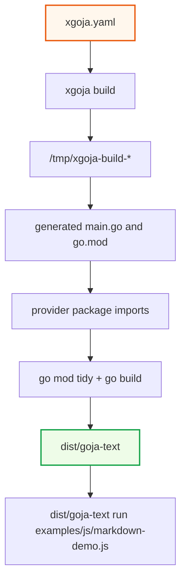

# Goja Text - Go-Backed Markdown AST Bindings

This is the structured-Markdown foundation note in the [[goja-text]] project map.

`goja-text` is a Go module that exposes text algorithms to JavaScript through `go-go-goja`. The first implemented module is `require("markdown")`: it parses Markdown with goldmark, converts the goldmark AST into a Go-backed `MarkdownNode` tree, and projects that tree into JavaScript so scripts can inspect fields such as `node.Type`, `node.Children`, `node.Level`, `node.Destination`, and `node.SourcePos`.

> [!summary]
> The project has three important results so far:
> 1. A working `markdown` native module with `parse`, `renderHTML`, `walk`, `textContent`, and `validate`.
> 2. An xgoja-generated `dist/goja-text` binary that can run JavaScript scripts with explicit `fs` access.
> 3. A documented design decision to keep AST values as Go-backed objects instead of converting them into lowercase plain JavaScript maps.

## Why this project exists

The project exists to make Go text-processing libraries usable from local JavaScript scripts without losing Go's typed domain objects. The immediate use case is Markdown parsing. JavaScript callers should be able to load a Markdown file from disk, parse it, traverse its structure, and implement document-specific queries such as heading extraction or link collection. The long-term direction is broader: text algorithms of all kinds can become reusable native modules exposed through `require()` inside goja runtimes.

The important design constraint is that JavaScript should not receive an untyped JSON-shaped approximation of the parser output as the primary representation. The AST is a domain object that will be passed back into Go functions such as `walk`, `textContent`, and `validate`. Keeping it as a Go-backed object means those functions can validate runtime values and report precise errors when JavaScript passes the wrong object shape.

The project also exists as an xgoja integration exercise. Rather than hand-writing a project-specific CLI, the module is exercised through xgoja. xgoja already knows how to generate a binary with selected providers, selected modules, `eval`, `run`, `repl`, and guarded host capabilities. That removes a layer of project-specific command code and makes module composition explicit in `xgoja.yaml`.

## Current project status

The first vertical slice is implemented and validated.

What exists now:

- a Go module at `/home/manuel/workspaces/2026-06-02/goja-text/goja-text`
- a native module package at `pkg/markdown`
- an xgoja provider package at `pkg/xgoja/providers/text`
- an `xgoja.yaml` build specification
- a sample Markdown file and JavaScript demo script
- unit tests for Go-side parsing, rendering, validation, and conversion
- runtime tests that execute JavaScript against the `markdown` module
- regression tests for goldmark edge fields: image alt text, fenced code info, source positions, indented code blocks, HTML blocks, and inline raw HTML
- ticket documentation under `ttmp/2026/06/02/GOJA-TEXT-001--goja-text-module-bindings-markdown-parser-and-text-algorithm-native-modules/`

The core tests pass with:

```bash
cd /home/manuel/workspaces/2026-06-02/goja-text/goja-text
go test ./... -count=1
```

The standalone module mode was also validated earlier with:

```bash
GOWORK=off go test ./... -count=1
```

The generated xgoja binary was validated by building `dist/goja-text` and running the demo script against a Markdown file loaded through `require("fs")`.

## Project shape

The repository is organized around a small number of boundaries. Each boundary has a narrow responsibility.

```text
goja-text/
  README.md
  go.mod
  xgoja.yaml
  examples/
    js/markdown-demo.js
    markdown/sample.md
  pkg/
    markdown/
      types.go
      parser.go
      convert.go
      module.go
      parser_test.go
      module_test.go
    xgoja/providers/text/
      text.go
  ttmp/2026/06/02/GOJA-TEXT-001--.../
    design-doc/
    reference/
    tasks.md
    changelog.md
```

The `pkg/markdown` package owns the domain API. It parses Markdown, converts goldmark nodes into `MarkdownNode` values, exports the goja module, and implements traversal and validation.

The `pkg/xgoja/providers/text` package owns the xgoja integration. It does not implement Markdown behavior. It wraps the already-registered native module so xgoja can include it in a generated binary.

The `xgoja.yaml` file owns the runtime composition for the generated binary. It says which provider packages exist, which modules are enabled, whether host filesystem access is allowed, and which commands the binary should expose.

The `ttmp/.../GOJA-TEXT-001` directory owns the design history. It includes the implementation guide, intern-facing review, investigation diary, research logbook, tasks, and changelog.

## Architecture

The runtime path starts with JavaScript and ends in Go-backed AST values. A script calls `require("markdown")`, invokes `parse`, receives a `*MarkdownNode` projected into JavaScript, and can then pass that node back into Go-backed functions.



The xgoja build path is separate from the runtime path. xgoja reads a declarative spec, generates a temporary Go module, imports the provider packages, builds a binary, and writes it to `dist/goja-text`.



The key point is that xgoja does not replace the native module interface. The Markdown module is still a `modules.NativeModule`. xgoja's provider system is the packaging layer that chooses which native modules are present in a generated binary.

## The MarkdownNode representation

The public AST representation is defined in `pkg/markdown/types.go`:

```go
type MarkdownNode struct {
    Type        string
    Children    []*MarkdownNode
    Text        string
    Level       int
    Language    string
    Destination string
    Title       string
    Alt         string
    Ordered     bool
    Start       int
    Marker      string
    Info        string
    Raw         string
    SourcePos   [2]int
}
```

The JSON tags on these fields exist for Go JSON serialization, but they do not define the primary JavaScript property names. goja exposes exported Go struct fields by their Go names by default. The intended JavaScript API is therefore PascalCase:

```js
const markdown = require("markdown");
const ast = markdown.parse("# Hello\n\nSee [docs](https://example.com).");

console.log(ast.Type);
console.log(ast.Children[0].Type);
console.log(ast.Children[0].Level);
console.log(ast.Children[0].Children[0].Text);
```

The tests intentionally assert that `ast.type` is absent. This is not an accidental limitation. It is part of the design contract. If a future caller needs lowercase JSON-style objects, the right addition is an explicit adapter such as `toPlainObject(node)`, not a silent change to the primary AST representation.

This representation has direct consequences for API design. Functions that receive nodes can require `*MarkdownNode` values. If JavaScript passes an arbitrary object into `textContent` or `walk`, Go can reject it as the wrong type. That is the practical value of keeping the AST as Go-backed objects.

## The module API

The `markdown` module exports five functions.

| Function | Purpose | Important behavior |
| --- | --- | --- |
| `parse(input)` | Parse Markdown into a Go-backed AST. | Returns `*MarkdownNode` projected into JavaScript. |
| `renderHTML(input)` | Render Markdown to HTML. | Delegates to goldmark rendering. |
| `walk(root, visitor)` | Traverse a `MarkdownNode` tree. | Calls a JS visitor with `(node, ctx)`. |
| `textContent(node)` | Concatenate text under a node. | Requires a Go-backed node. |
| `validate(value)` | Validate string input or node invariants. | This is runtime/AST validation, not a Markdown lint engine. |

The module deliberately does not export `extractHeadings`, `extractLinks`, or similar one-off query functions. Those queries are short JavaScript programs built on `walk`:

```js
const headings = [];
const links = [];

markdown.walk(ast, (node, ctx) => {
  if (node.Type === "heading") {
    headings.push({
      Level: node.Level,
      Text: markdown.textContent(node),
      Depth: ctx.Depth,
    });
  }

  if (node.Type === "link") {
    links.push({
      Destination: node.Destination,
      Text: markdown.textContent(node),
    });
  }
});
```

This keeps the Go module small. The parser provides structure and traversal. JavaScript code decides which document query matters for the task at hand.

## How parsing and conversion work

`Parse` in `pkg/markdown/parser.go` is intentionally small. It creates a goldmark parser, parses a byte slice, and sends the resulting goldmark document node into `ConvertAST`.

```go
func Parse(input string) (*MarkdownNode, error) {
    source := []byte(input)
    md := goldmark.New()
    doc := md.Parser().Parse(text.NewReader(source))
    if doc == nil {
        return nil, fmt.Errorf("markdown.parse: parser returned nil document")
    }
    return ConvertAST(source, doc), nil
}
```

`ConvertAST` is the main translation layer. It creates a `MarkdownNode`, normalizes the goldmark node kind into a stable `Type` string, captures source position, fills node-specific fields, and recursively converts children.

Important mappings include:

| goldmark node | MarkdownNode fields |
| --- | --- |
| `Heading` | `Type: "heading"`, `Level` |
| `FencedCodeBlock` | `Type: "fencedCodeBlock"`, `Language`, `Info`, `Text` |
| `CodeBlock` | `Type: "codeBlock"`, `Text` |
| `Text` | `Type: "text"`, `Text` |
| `Link` | `Type: "link"`, `Destination`, `Title` |
| `Image` | `Type: "image"`, `Destination`, `Title`, `Alt` |
| `List` | `Type: "list"`, `Ordered`, `Start`, `Marker` |
| `HTMLBlock` | `Type: "htmlBlock"`, `Raw` |
| `RawHTML` | `Type: "rawHTML"`, `Raw` |

The conversion function also computes `SourcePos` as a line-column pair. This is done from the goldmark byte offset using a local `byteOffsetLineColumn` helper. The current tests treat those values as regression evidence for the converter. A future design decision should decide whether exact source-position semantics are part of the stable public contract.

## How traversal works

`walk` is implemented in Go but controlled from JavaScript. The Go side asserts that the visitor is callable, then recursively traverses the node tree. For each node it constructs a `WalkContext`:

```go
type WalkContext struct {
    Parent *MarkdownNode
    Depth  int
    Index  int
    Path   []int
}
```

The visitor return value controls traversal:

- `undefined`, `null`, or `true` continues normally.
- `false` skips the current node's children.
- `"skip"` also skips the current node's children.
- `"stop"` stops traversal entirely.
- any other string is an error.

This is the core algorithm:

```text
walkMarkdownNode(node, parent, depth, index, path):
    if traversal is stopped or node is nil:
        return

    ctx = WalkContext(parent, depth, index, copy(path))
    result = visitor(node, ctx)

    if result is "stop":
        mark traversal stopped
        return

    if result is false or "skip":
        return

    for each child with child index i:
        childPath = path + [i]
        walkMarkdownNode(child, node, depth + 1, i, childPath)
```

The implementation is pre-order traversal. The visitor sees a node before its children. Post-order traversal and enter/leave callbacks are not implemented. Those should only be added when a real query requires them.

## How validation works

`validate` is intentionally narrow. Markdown itself is permissive. Many documents that look malformed to a human are valid Markdown inputs. For that reason, `validate` is not a general Markdown syntax checker.

The current semantics are:

- If the value is a string, parse it and validate the resulting `MarkdownNode` tree.
- If the value is a `*MarkdownNode`, validate node invariants.
- Otherwise, return `Valid: false` with a type error.

The invariant checks are small today. The most visible one is heading level range: a `heading` node must have `Level` from 1 to 6. The main value is not the number of checks currently implemented. The value is the API shape: Go module functions can receive typed nodes and reject invalid runtime values with useful errors.

Semantic document checks, such as missing image alt text or skipped heading levels, should become a separate lint layer rather than being folded into parser validation.

## xgoja runtime composition

The generated binary is described by `xgoja.yaml`:

```yaml
name: goja-text
target:
  kind: xgoja
  output: dist/goja-text
packages:
  - id: goja-text
    import: github.com/go-go-golems/goja-text/pkg/xgoja/providers/text
    replace: .
  - id: go-go-goja-core
    import: github.com/go-go-golems/go-go-goja/pkg/xgoja/providers/core
  - id: go-go-goja-host
    import: github.com/go-go-golems/go-go-goja/pkg/xgoja/providers/host
runtimes:
  main:
    modules:
      - package: goja-text
        name: markdown
        as: markdown
      - package: go-go-goja-host
        name: fs
        as: fs
        config:
          allow: true
```

The local `goja-text` provider has `replace: .` because xgoja builds a temporary generated module. Without the package-level replace, that temporary module cannot resolve the local provider package. The local `go-go-goja` checkout also needs an absolute `--xgoja-replace` path during development because the generated build directory is under `/tmp`.

The successful build command used this shape:

```bash
go run ../go-go-goja/cmd/xgoja build \
  -f xgoja.yaml \
  --xgoja-replace /home/manuel/workspaces/2026-06-02/goja-text/go-go-goja
```

The generated binary can then run scripts:

```bash
./dist/goja-text run examples/js/markdown-demo.js
```

The demo script reads a Markdown file through `require("fs")`, parses it through `require("markdown")`, walks headings and links, and prints a JSON summary. This validates provider registration, host filesystem access, parser conversion, JavaScript field access, traversal, and validation in the same executable path.

## Tests and what they prove

The test suite is not only checking individual functions. It records design decisions.

`TestRequireMarkdownParseExposesGoFields` proves that JavaScript sees Go field names:

- `ast.Type`
- `ast.Children[0].Type`
- `ast.Children[0].Level`
- nested `Text`
- absence of lowercase `ast.type`

`TestRequireMarkdownWalkSupportsJSQueries` proves that `walk` is enough to implement heading and link queries in JavaScript.

`TestParseCapturesGoldmarkEdgeFields` proves goldmark core-node details that were identified as implementation risks:

- image destination, title, and plain-text alt extraction
- fenced code language, full info string, and text
- source positions for image, fenced code, and indented code
- raw HTML block capture
- inline raw HTML capture

`TestRequireMarkdownExposesGoldmarkEdgeFieldsToJS` proves that the important edge fields are visible through the JavaScript runtime, not only on Go structs.

Together, these tests protect the public API. If a future change switches to plain maps, changes field names, alters traversal, or loses goldmark metadata, the tests should fail.

## Design decisions

### xgoja is the primary harness

The project initially considered custom CLI code and `goja-repl`. xgoja became the primary harness because it already provides command surfaces and provider composition. The project needs a binary that includes `markdown`, `fs`, selected core modules, and script execution commands. xgoja describes that composition declaratively.

The consequence is that local module resolution matters. The project needs `replace: .` in `xgoja.yaml`, and local development needs an absolute `--xgoja-replace` path for `go-go-goja`.

### The AST remains Go-backed

The central representation decision is that `parse` returns `*MarkdownNode`, not `map[string]any`. This makes field names PascalCase in JavaScript, but it preserves runtime type identity. That identity is needed for validation and for future builder-pattern APIs that accept domain objects back from JavaScript.

The cost is JavaScript ergonomics for users who expect JSON-style lowercase keys. The project accepts that cost for the primary API. A future adapter can provide lowercase plain objects if serialization or external interop requires it.

### `walk` is the query primitive

The module avoids query-specific exports. Headings, links, images, outlines, and document checks are all query programs over the AST. Exporting every query from Go would create a growing API surface and would still not cover project-specific needs. `walk` keeps traversal centralized and leaves query policy in JavaScript.

### `validate` is not a Markdown linter

The validation function validates runtime values and AST invariants. It does not try to decide whether a Markdown document is semantically good. That distinction matters because parser validation and document linting have different inputs, outputs, and failure modes.

## What we struggled with

The first struggle was choosing the right exercise harness. A custom CLI would have been straightforward to write, but it would duplicate work already present in xgoja. `goja-repl` was useful context, but it is not the right primary path for a separate module package because it depends on modules being registered in the binary that imports them. xgoja solved the problem by generating a binary with explicit provider imports.

The second struggle was field-name semantics. The design originally had pressure toward lowercase JavaScript objects because JSON tags on Go structs can make that shape feel natural. goja reflection does not automatically turn `Type` into `type` based on JSON tags. The project turned that into an explicit decision: PascalCase reflected Go fields are the public API for Go-backed objects.

The third struggle was local module resolution. The workspace contains both `goja-text` and `go-go-goja`, but generated xgoja builds happen in a temporary directory. Relative replace paths that work from the module directory do not necessarily work from `/tmp/xgoja-build-*`. The failed command made the rule concrete: use package-level `replace: .` for the local provider and an absolute `--xgoja-replace` for the local `go-go-goja` checkout.

The fourth struggle was documentation drift. The design document accumulated older `goja-repl` material after xgoja became the authoritative direction. The research logbook later listed update needs that had already been resolved by implementation. The fix was to clean duplicate sections, add decision records, and update the logbook into resolved and still-open categories.

The fifth struggle was test-fixture syntax. The JavaScript runtime test for fenced code initially embedded Markdown backtick fences inside a Go raw string. A Go raw string cannot contain a backtick byte. The test was corrected by using tilde fences, which goldmark treats as fenced code blocks and which avoid raw-string termination.

## What worked well

The `modules.NativeModule` interface worked well because it is small. The Markdown module only needs `Name`, `Doc`, and `Loader`, plus optional TypeScript declaration support. The implementation can focus on domain behavior rather than framework ceremony.

The existing `go-go-goja` modules provided good references. The YAML module showed the simple native module pattern. The UIDSL module showed the precedent for exposing Go-backed domain objects. The xgoja core and host providers showed how provider packages wrap native modules and configure capabilities.

The `walk` primitive worked well because it created a small API with high coverage. The module did not need heading/link extraction exports. The tests show that JavaScript can implement those queries directly.

The diary and research logbook worked well as project memory. They captured failed commands, design reversals, superseded assumptions, and exact validation commands. That made it possible to resume work after context compaction and still know why decisions were made.

The regression tests worked well as executable documentation. They encode the important API facts more reliably than prose alone: PascalCase fields, lowercase absence, traversal semantics, goldmark edge fields, and JavaScript visibility.

## What needs attention next

The largest unresolved design question is goldmark extension support. The parser currently uses `goldmark.New()` without extensions. That means the public AST contract covers core nodes, not extension nodes such as tables, task lists, strikethrough, footnotes, or GFM-style autolinks.

Before enabling extensions, the project should decide:

- which extensions belong in Phase 1
- whether extension support is always on or controlled by parser options
- what stable `MarkdownNode.Type` strings should represent extension nodes
- which additional fields are needed for extension nodes
- whether extension nodes should be normalized into project-owned names or expose goldmark kind strings directly

Source positions also need a public-contract decision. The current converter computes line-column pairs from goldmark byte offsets and tests the observed values. That is useful, but the documentation should state whether exact line-column behavior is guaranteed or merely best-effort parser metadata.

The README should eventually use a portable environment variable or Makefile target for xgoja builds. The current command includes a machine-specific absolute path because that is what the build requires today. A target such as `make build-xgoja` could compute the path and reduce copy-paste errors.

The review document could be cleaned if it becomes a canonical teaching artifact. It currently contains historical critique, including advice that was superseded by the Go-backed AST decision. The superseding note is enough for history, but not ideal for a first-time reader looking for the final answer.

## Important project docs

The ticket workspace is:

```text
/home/manuel/workspaces/2026-06-02/goja-text/goja-text/ttmp/2026/06/02/GOJA-TEXT-001--goja-text-module-bindings-markdown-parser-and-text-algorithm-native-modules/
```

Important documents:

- `design-doc/01-goja-text-bindings-architecture-design-and-implementation-guide.md`
- `design-doc/02-review-of-the-goja-text-bindings-plan-and-spec.md`
- `reference/01-investigation-diary.md`
- `reference/02-research-logbook-sources-usefulness-and-update-needs.md`
- `tasks.md`
- `changelog.md`

The latest reMarkable bundle uploaded during this work was:

```text
/ai/2026/06/02/GOJA-TEXT-001/GOJA-TEXT-001 Goja Text Bindings Design Guide v7
```

## Key code locations

- `/home/manuel/workspaces/2026-06-02/goja-text/goja-text/pkg/markdown/types.go` defines the public Go-backed AST shape.
- `/home/manuel/workspaces/2026-06-02/goja-text/goja-text/pkg/markdown/parser.go` owns parsing, rendering, and validation entry points.
- `/home/manuel/workspaces/2026-06-02/goja-text/goja-text/pkg/markdown/convert.go` converts goldmark AST nodes into `MarkdownNode` values.
- `/home/manuel/workspaces/2026-06-02/goja-text/goja-text/pkg/markdown/module.go` exports the goja native module.
- `/home/manuel/workspaces/2026-06-02/goja-text/goja-text/pkg/xgoja/providers/text/text.go` wraps the module as an xgoja provider.
- `/home/manuel/workspaces/2026-06-02/goja-text/goja-text/xgoja.yaml` describes the generated binary.
- `/home/manuel/workspaces/2026-06-02/goja-text/goja-text/examples/js/markdown-demo.js` demonstrates file-backed parsing and traversal.
- `/home/manuel/workspaces/2026-06-02/goja-text/goja-text/pkg/markdown/parser_test.go` contains Go-side parser and goldmark regression tests.
- `/home/manuel/workspaces/2026-06-02/goja-text/goja-text/pkg/markdown/module_test.go` contains JavaScript runtime tests.

## Near-term next steps

1. Decide whether Phase 1 remains core-markdown-only or enables selected goldmark extensions.
2. If extensions are enabled, add tests before documenting their node shapes.
3. Add Makefile targets for `test`, `test-standalone`, `build-xgoja`, and `smoke-xgoja`.
4. Decide whether `SourcePos` is a stable public contract or diagnostic metadata.
5. Consider a `toPlainObject(node)` adapter only if a concrete serialization or interop need appears.
6. Clean the intern review document if it should become final onboarding material rather than historical critique.

## Working rule

Keep the Go-backed object contract explicit. When a JavaScript API returns or accepts domain objects that Go will validate later, document the exact reflected field names and protect them with runtime tests. Do not infer JavaScript property names from JSON tags. Do not add lowercase compatibility shims unless a concrete caller needs a plain-object adapter.
