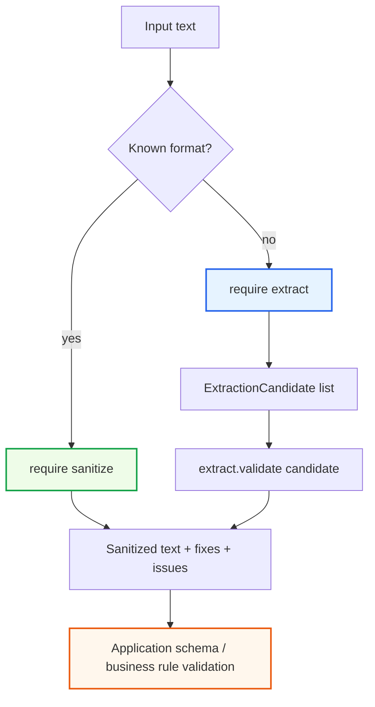
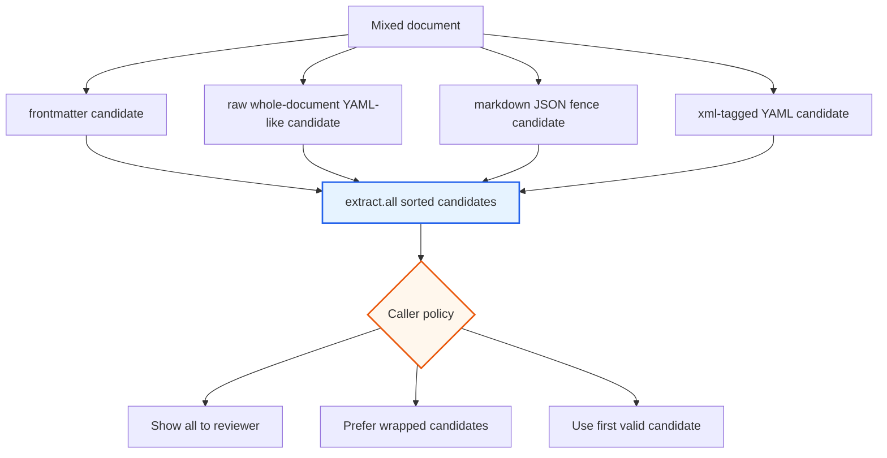

# Goja Text - Sanitizing and Extracting Structured Data from Messy Text

This is the messy-input and recovery branch of the [[goja-text]] project map.

`goja-text` started as a Markdown parser binding, but the more interesting shape emerged in the second and third tickets. The project became a small text-processing runtime for JavaScript scripts that need Go-grade parsers, repair algorithms, and provenance-aware extraction helpers. The two modules covered here are `require("sanitize")`, which repairs YAML and JSON, and `require("extract")`, which finds structured-data candidates inside larger text before validating them.

> [!summary]
> The sanitize and extraction work turns `goja-text` from a single Markdown AST binding into a structured-text toolkit. `sanitize` answers: "Can this JSON or YAML be repaired, and what changed?" `extract` answers: "Where in this larger document are the likely structured payloads, and what evidence do we have for each one?" The key design rule is to keep Go-backed domain objects at the boundary so JavaScript can orchestrate behavior without losing validation, provenance, or repair metadata.

This note is a deep technical report based on the GOJA-TEXT-002 and GOJA-TEXT-003 ticket docs, implementation diaries, code, tests, examples, and final xgoja integration. It is written as a project blog post rather than a changelog. The goal is to preserve the mental model: why the modules are shaped this way, what the tricky parts were, and how the implementation can be extended safely.

Related historical note: [[PROJ - Goja Text - Go-Backed Markdown AST Bindings]].

## Why this project exists

Many automation scripts operate on text that is not cleanly one format. A Markdown document may contain YAML frontmatter, a fenced JSON example, and a prose paragraph that happens to contain a colon. A model response may wrap JSON in a Markdown code fence or use XML-like tags such as `<json>...</json>`. A human-edited YAML file may be close to valid, but still contain tabs, missing spaces after colons, or list markers without the right spacing.

The obvious implementation path is to write JavaScript regexes and keep adding special cases. That works for one script and fails as soon as the same behavior is needed elsewhere. `goja-text` takes the opposite route. It exposes Go libraries through `go-go-goja` native modules so JavaScript scripts can stay small and policy-oriented while Go owns the parts that need durable semantics: parsing, repair, validation, source spans, and type checks.

The second and third modules divide the problem into two responsibilities:

| Module | Responsibility | What it returns |
| --- | --- | --- |
| `sanitize` | Repair and inspect YAML/JSON syntax. | Go-backed results with sanitized text, fix lists, lint issues, parse state, and strict JSON status. |
| `extract` | Locate structured-data candidates inside larger text. | Go-backed candidates with payload text, raw wrapper text, format guesses, source spans, confidence, and diagnostics. |

That separation matters. Extraction is not parsing. Repair is not schema validation. Parsing a value too early destroys evidence about where it came from. Repairing text without preserving the fix list makes later debugging harder. The implementation keeps these stages separate so callers can decide their own policy.

## The mental model: find, repair, then decide

The full flow is easiest to understand as a pipeline. A script starts with text. It may already know the format, in which case it can call `sanitize` directly. Or it may have a larger document, in which case it asks `extract` to find candidates first. Only after a candidate is found does the script validate or repair it.



The final `Domain` step is intentionally outside `goja-text`. If a repaired JSON object is supposed to be a deployment spec, a prompt result, or a tool-call argument object, that application-specific validation belongs to the caller. `goja-text` makes the syntax and provenance reliable enough for that next layer to make a good decision.

## From Markdown bindings to structured text runtime

GOJA-TEXT-001 established the project pattern: implement a Go native module, register it through `init()`, wrap it with an xgoja provider, and build a generated binary from `xgoja.yaml`. The Markdown module also established an important convention: JavaScript uses Go-backed objects directly, so fields and methods appear with PascalCase names such as `node.Type`, `node.Children`, and `node.Level`.

GOJA-TEXT-002 reused that pattern but changed the domain. The `sanitize` library is not an AST parser like goldmark. It is a repair system. It uses tree-sitter parse information and rule catalogs to detect malformed YAML/JSON, apply conservative fixes, and report the resulting parse/lint state. The natural JavaScript API is not one flat function; it is two namespaces:

```js
const sanitize = require("sanitize");

const yamlResult = sanitize.yaml.sanitize("name:Alice\n");
const jsonResult = sanitize.json.sanitize("~~~json\n{'ok': True,}\n~~~\n");
```

GOJA-TEXT-003 then built a higher layer. Once `sanitize` existed, the next missing piece was extraction: finding the JSON or YAML payload before repair. The `extract` module therefore returns candidates rather than parsed values:

```js
const extract = require("extract");

const candidates = extract.all(documentText);
for (const candidate of candidates) {
  const validation = extract.validate(candidate);
  console.log(candidate.Kind, candidate.Format, candidate.StartRow, validation.Valid);
}
```

The important through-line is not just that all three modules use `require()`. It is that each module keeps Go-backed domain values as the primary JavaScript API. A Markdown AST node, a sanitize config, a sanitize result, and an extraction candidate are all objects whose invariants are owned by Go.

## The sanitize module: a repair system with explicit configuration

The upstream sanitize library already had the hard domain logic. It provided parallel Go packages for YAML and JSON, with functions for sanitizing, linting, rendering parse trees, listing rules, and returning examples. The binding work was about exposing those capabilities cleanly to JavaScript.

The first design decision was the namespace shape:

```js
sanitize.yaml.sanitize(input, config?)
sanitize.yaml.lint(input, config?)
sanitize.yaml.parseTree(input)
sanitize.yaml.rules()
sanitize.yaml.examples()

sanitize.json.sanitize(input, config?)
sanitize.json.lint(input, config?)
sanitize.json.parseTree(input)
sanitize.json.strictParse(input)
sanitize.json.rules()
sanitize.json.examples()
```

This mirrors the Go package structure. YAML and JSON are similar but not identical. JSON has strict `encoding/json` validation and exposes `StrictParseClean`. YAML has `TabWidth`. A flat `sanitize(input, { format: "json" })` API would have hidden those differences and made the result shape less obvious.

### Why builders replaced raw options objects

The first planning pass considered JavaScript options objects. That is a tempting API because it is compact:

```js
sanitize.yaml.sanitize(input, { maxIterations: 5, tabWidth: 2 });
```

The problem is that raw objects push validation into every function that accepts options. Each function must decode untyped values, decide what to do with unknown keys, validate rule names, and report errors consistently. That is not just repetitive; it makes runtime behavior harder to reason about.

The final API uses Go-backed builders:

```js
const config = sanitize.yaml.options()
  .MaxIterations(5)
  .TabWidth(2)
  .RejectUnknownOptions()
  .Build();

const result = sanitize.yaml.sanitize(input, config);
```

The builder concentrates validation in one place. It is also a durable extension point: future rules can be added without changing every exported function. The builder exposes three unknown-option policies:

| Policy | Method | Meaning |
| --- | --- | --- |
| Reject | `RejectUnknownOptions()` | Unknown keys imported through `FromObject()` make `Build()` fail. This is the default. |
| Collect | `CollectUnknownOptions()` | Unknown keys are recorded for diagnostics but do not immediately fail. |
| Allow | `AllowUnknownOptions()` | Unknown keys are ignored. This is available but should be used deliberately. |

The diary records this as the main design correction in GOJA-TEXT-002. The user explicitly wanted unknown-option behavior to be controllable and wanted Go to own complex runtime validation rules. The builder pattern is the concrete answer to that requirement.

### The builder algorithm

At the code level, the builder is not complicated. Its value is in where it puts responsibility.

```text
builder starts with defaults
for each method call:
    validate the local value if possible
    record errors instead of panicking
    update builder state

FromObject(obj):
    for each key:
        if key is known:
            decode and call the corresponding method
        else:
            apply unknown-option policy

Validate():
    combine accumulated errors
    validate rule names through sanitize library
    validate incompatible only/disabled rule choices
    return ValidationResult

Build():
    call Validate()
    if invalid, return one combined error
    otherwise return immutable config object
```

The actual implementation lives in `pkg/sanitize/options.go`. The key methods are `MaxIterations`, `TabWidth`, `OnlyRules`, `DisabledRules`, `RejectUnknownOptions`, `AllowUnknownOptions`, `CollectUnknownOptions`, `FromObject`, `Validate`, and `Build`.

The payoff appears in the module adapter in `pkg/sanitize/module.go`. The exported functions can accept `*YamlConfig` or `*JsonConfig`, and nil config means defaults. They do not need to decode JavaScript objects on every call.

### What sanitize returns

The result object exposes the upstream repair evidence. A JSON sanitize call can report the original text, sanitized text, fixes, lint issues, parse state, and strict parse status.

```js
const result = sanitize.json.sanitize("~~~json\n{'ok': True,}\n~~~\n");

console.log(result.Sanitized);
console.log(result.StrictParseClean);
console.log(result.Fixes.map((fix) => fix.Rule));
```

A representative demo output from `examples/js/sanitize-demo.js` showed JSON repair applying these rules:

```json
[
  "markdown_fence_wrapper",
  "single_quotes",
  "single_quotes",
  "python_literals",
  "trailing_comma",
  "trailing_comma"
]
```

This fix list is the reason sanitize is more than a lenient parser. It tells the caller what changed. If a model starts emitting Python booleans or Markdown fences around JSON, the fix list makes that visible.

## Dependency policy: pinned module, local checkout as reference

One of the useful diary entries is the dependency correction. The workspace contains a local `sanitize` checkout, but `goja-text` does not need a local `replace` for it. The module depends on the published tag:

```text
github.com/go-go-golems/sanitize v0.0.2
```

The diary records a concrete failure mode: normal workspace tests can pass while `GOWORK=off` catches a missing direct dependency. At one point, standalone tests failed with:

```text
pkg/sanitize/module.go:8:2: no required module provides package github.com/go-go-golems/sanitize/pkg/json
pkg/sanitize/module.go:9:2: no required module provides package github.com/go-go-golems/sanitize/pkg/yaml
```

The fix was to rerun:

```bash
go get github.com/go-go-golems/sanitize@v0.0.2
go mod tidy
GOWORK=off go test ./... -count=1
```

This became part of the project validation habit. Workspace mode proves local development works. `GOWORK=off` proves the module has a real dependency graph.

## The extract module: candidates, not values

The extraction module begins from a different problem. It assumes the input is not simply JSON or YAML. It may be Markdown, a model response, a prompt transcript, or a note. The module's job is to find structured payloads and preserve evidence.

The candidate type in `pkg/extract/types.go` captures that evidence:

```go
type ExtractionCandidate struct {
    Kind             string
    Format           string
    Text             string
    Raw              string
    Wrapper          string
    Label            string
    Info             string
    StartByte        int
    EndByte          int
    StartRow         int
    StartCol         int
    EndRow           int
    EndCol           int
    PayloadStartByte int
    PayloadEndByte   int
    Confidence       float64
    Diagnostics      []string
}
```

The distinction between `Raw` and `Text` is essential. `Raw` is the full wrapper, such as the Markdown fence or XML-like tag. `Text` is the payload that a caller might validate or parse. The same distinction exists in the span fields: the candidate has a source span and a payload span.

That design came directly from the GOJA-TEXT-003 diary. The implementation started with source-position infrastructure before any extractor logic. That prevented each extractor from inventing its own byte/row/column behavior. The diary notes one early correction: for `alpha\nbeta\ngamma`, offset `11` is the start of `gamma`, not the previous line. Pinning those boundary semantics early made the later span tests meaningful.

## Extractor responsibilities

The module exposes four specific extraction helpers plus a combined helper:

| Function | What it detects | Why it exists |
| --- | --- | --- |
| `frontmatter(input, options?)` | Leading YAML frontmatter delimited by `---`. | Many Markdown documents store metadata at the top. |
| `markdownCodeBlocks(input, options?)` | Backtick or tilde fenced code blocks. | Markdown fences are the most common wrapper for JSON/YAML examples and model outputs. |
| `xmlTagged(input, options?)` | Simple same-name wrappers such as `<json>...</json>`. | LLM/tool protocols often use XML-like tags without requiring full XML parsing. |
| `rawStructured(input, options?)` | Whole-input raw JSON or conservative YAML. | Sometimes the entire text is the payload. |
| `all(input, options?)` | Runs enabled extractors and sorts candidates by source order. | Callers can explore mixed documents without knowing the wrapper shape first. |

The implementation order followed the false-positive risk. Wrapper extractors came before raw recognition because explicit wrappers are stronger evidence. Raw YAML recognition is intentionally conservative because prose can look YAML-like if the heuristic is too permissive.

## Markdown fences: why a scanner instead of the Markdown AST

The existing Markdown module already knows about fenced code blocks. It would be natural to reuse the Markdown AST. The design document considered that, but Phase 1 chose a dedicated scanner in `pkg/extract/markdown_fences.go`.

The reason is precision. Extraction needs the exact raw wrapper, the opening fence, the payload span, the closing fence, and the byte positions. The public Markdown AST was not designed to expose all of that. Changing it would have expanded the Markdown module contract for an extraction-specific need.

The scanner follows a focused algorithm:

```text
for each source line:
    if line starts with optional indentation and a fence marker:
        record marker character and marker length
        record info string and language label
        payload starts after opening line

        scan forward until a closing fence with same marker and sufficient length
        if found:
            emit candidate with Raw, Text, wrapper span, payload span
        else if diagnostics are enabled:
            emit unterminated candidate with diagnostic
```

This is a recurring design pattern in `goja-text`: use the domain parser when the parser's abstraction matches the API, but do not force an existing abstraction to carry unrelated data. The Markdown AST remains a document model. The extract fence scanner is a provenance scanner.

## XML-like tags: useful, but not XML

The XML-tag extractor is deliberately narrow. It detects simple same-name wrappers with optional attributes in the opening tag. It does not claim to be a full XML parser, and the user guide says so.

```xml
<json>{"ok": true}</json>
<yaml>
name: Alice
</yaml>
```

The diary calls this out as a tricky documentation and implementation point. Overclaiming would be dangerous. A caller who needs namespace handling, nested same-name tags, entity decoding, or full XML validation should use an XML parser. The extractor is for wrapper conventions in text protocols and model output.

This is also why `extract.validate()` treats XML differently. JSON and YAML validation delegate to sanitize. XML validation in Phase 1 only confirms that the candidate came from an extracted XML-like wrapper and has non-empty text.

## Raw recognition: conservative by design

Raw JSON recognition is comparatively safe. If the trimmed input starts with `{` or `[` and strict JSON parses, the candidate gets high confidence. If strict parsing fails but the sanitize library can repair it to strict JSON, the candidate gets lower confidence.

Raw YAML is harder. YAML is broad enough that many prose snippets can be interpreted as YAML. The implementation in `pkg/extract/raw.go` therefore requires stronger evidence before accepting raw YAML:

```text
reject if input starts like JSON
count mapping-like lines
count list-like lines
accept YAML-looking input only if:
    at least two mapping-like lines, or
    at least one mapping-like line plus at least one list-like line
then run sanitize-backed acceptance
```

This rule is intentionally not a general YAML recognizer. It is a false-positive reduction heuristic for whole-input candidates. The tests include a prose false-positive case to keep this behavior pinned.

## Combined extraction and the overlap decision

The most important Phase 1 behavior is that `extract.all()` preserves overlapping candidates. It runs enabled extractors, merges the results, sorts by source position, and filters by format, confidence, diagnostics, and candidate limit. It does not suppress a raw whole-document candidate just because the same document also has frontmatter and fenced code blocks.

The diary records a test that had to be corrected because of this. The first `All` test assumed the Markdown code block would be the second candidate. Raw YAML recognition also emitted a whole-document YAML-like candidate that started earlier. The test was changed to assert that required candidates are present while only requiring frontmatter to be first.

That correction is more than a test tweak. It captures the project philosophy. Extraction returns evidence. The caller decides policy.



A future `ExtractOptions` policy such as `PreferWrapped` or `SuppressOverlaps` would be useful. It should be explicit, not a hidden default.

## Validation: extraction composes with sanitize

`extract.validate(candidate)` is where the two tickets connect. It looks at the candidate format and delegates JSON/YAML repair to the sanitize library.

```text
validate(candidate):
    if format is json:
        try strict JSON parse
        if it succeeds:
            return Valid=true, Sanitized=original payload
        otherwise:
            run json sanitize
            return strict parse status, sanitized text, fixes, issues

    if format is yaml:
        run yaml sanitize
        return parse/lint clean status, sanitized text, fixes, issues

    if format is xml:
        only validate Phase-1 wrapper conditions

    otherwise:
        return unsupported/unknown format error
```

The current `CandidateValidationResult` stores `Fixes` and `Issues` as `any`. That keeps the Phase 1 API simple across YAML and JSON, but the diary correctly flags it as a review point. A future version may want typed variants such as `JsonCandidateValidationResult` and `YamlCandidateValidationResult` if callers need stronger Go-side type guarantees.

## xgoja as the user-facing harness

The implementation is not only a library. The project ships a generated xgoja binary configured by `xgoja.yaml`. That binary exposes `eval`, `run`, `repl`, and now `verbs`, with the text modules already composed into the runtime.

The current provider package is `pkg/xgoja/providers/text`. It registers `markdown`, `sanitize`, and `extract`, and it now also registers provider-shipped Glazed help docs. The buildspec includes host `fs` access so demo scripts and verbs can read fixtures from disk.

The important validation command is:

```bash
make check
```

It runs normal Go tests, standalone `GOWORK=off` tests, an xgoja generated build, and smoke scripts for Markdown, sanitize, and extract. This command emerged from the sanitize ticket after the validation steps were repeated manually enough times to deserve a Makefile target.

## User-facing documentation and verbs

The latest commit added another layer: embedded Glazed help docs and jsverbs examples. The help pages live under `pkg/xgoja/providers/text/doc/` and are shipped through the provider. The examples live under `examples/jsverbs/` and are embedded into the generated binary.

The generated command is called `verbs`:

```bash
./dist/goja-text verbs markdown headings examples/markdown/sample.md
./dist/goja-text verbs sanitize json examples/json/broken.json
./dist/goja-text verbs extract validate examples/text/structured-data-sample.md
```

This matters because it turns the modules into reusable command-line examples. A script can still use `require("sanitize")` or `require("extract")` directly, but a user can also run structured commands that return rows for Glazed to render as JSON, YAML, or tables.

The help docs follow a two-document pattern for each package:

- API reference: quick lookup for functions, fields, and result shapes.
- User guide: textbook-style explanation of why the module works the way it does, with examples folded into the conceptual narrative.

This keeps the generated binary self-teaching. Someone using `dist/goja-text` does not need to know where the repository docs live before they can discover the module API.

## Implementation timeline from the diaries

The commit history and diaries show a useful sequence of increasingly higher-level capabilities.

### GOJA-TEXT-002: sanitize

1. The ticket began by reading the upstream sanitize library and the existing Markdown native module pattern.
2. The first design chose a namespace API: `sanitize.yaml` and `sanitize.json`.
3. A review caught concrete implementation risks: dotted export names are literal properties, raw options objects need better validation, and dependency wiring needed a Phase 0.
4. The design changed to Go-backed builders after the user clarified unknown-option and runtime validation requirements.
5. The dependency policy changed to pinned `github.com/go-go-golems/sanitize v0.0.2` without a local replace.
6. `pkg/sanitize` implemented builders, configs, namespace exports, parse-tree wrappers, strict JSON parsing, TypeScript declarations, and runtime tests.
7. The xgoja provider and buildspec were updated, fixtures and demo scripts were added, and standalone tests caught the missing direct dependency.
8. Makefile targets made the validation workflow repeatable.

### GOJA-TEXT-003: extract

1. The ticket began after closing sanitize, with the goal of extracting structured data from Markdown code blocks, XML-like tags, raw JSON/YAML, and frontmatter.
2. The task list was expanded into phases so each layer could be implemented and committed separately.
3. The first code slice added source-position infrastructure, candidate types, options, and tests.
4. Wrapper extractors came next: Markdown fences, XML-like tags, and YAML frontmatter.
5. Raw structured recognition and validation were added after wrapper extraction to keep false positives under control.
6. The native module exposed the domain functions to JavaScript and tested PascalCase field access.
7. The provider, buildspec, demo fixture, README, and Makefile smoke target made extract usable through the generated binary.
8. The final demo revealed the intentional overlap behavior: `extract.all()` can return frontmatter, raw whole-document YAML, a Markdown JSON code block, and XML-tagged YAML from the same document.

This sequence is worth preserving because it shows the engineering rule behind the work: build the domain model first, test it in Go, expose it to goja, then validate it through the generated xgoja binary.

## Important files

The most important repository files today are:

| File | Role |
| --- | --- |
| `/home/manuel/workspaces/2026-06-02/goja-text/goja-text/pkg/sanitize/options.go` | Go-backed YAML/JSON builder and config validation. |
| `/home/manuel/workspaces/2026-06-02/goja-text/goja-text/pkg/sanitize/module.go` | `require("sanitize")` namespace exports. |
| `/home/manuel/workspaces/2026-06-02/goja-text/goja-text/pkg/sanitize/module_test.go` | JavaScript-visible sanitize runtime behavior. |
| `/home/manuel/workspaces/2026-06-02/goja-text/goja-text/pkg/extract/types.go` | Candidate, options, and validation result model. |
| `/home/manuel/workspaces/2026-06-02/goja-text/goja-text/pkg/extract/positions.go` | Byte-span to row/column infrastructure. |
| `/home/manuel/workspaces/2026-06-02/goja-text/goja-text/pkg/extract/markdown_fences.go` | Markdown fenced block scanner. |
| `/home/manuel/workspaces/2026-06-02/goja-text/goja-text/pkg/extract/xml_tags.go` | XML-like wrapper scanner. |
| `/home/manuel/workspaces/2026-06-02/goja-text/goja-text/pkg/extract/frontmatter.go` | YAML frontmatter extractor. |
| `/home/manuel/workspaces/2026-06-02/goja-text/goja-text/pkg/extract/raw.go` | Raw JSON/YAML recognition heuristics. |
| `/home/manuel/workspaces/2026-06-02/goja-text/goja-text/pkg/extract/validate.go` | Sanitize-backed candidate validation. |
| `/home/manuel/workspaces/2026-06-02/goja-text/goja-text/pkg/extract/all.go` | Combined extraction and source-order sorting. |
| `/home/manuel/workspaces/2026-06-02/goja-text/goja-text/pkg/xgoja/providers/text/text.go` | xgoja provider registration for all text modules and help docs. |
| `/home/manuel/workspaces/2026-06-02/goja-text/goja-text/xgoja.yaml` | Generated binary composition, modules, help source, and embedded verbs. |
| `/home/manuel/workspaces/2026-06-02/goja-text/goja-text/examples/jsverbs/` | User-facing Glazed command examples for all modules. |

The ticket sources that shaped this report are:

- `ttmp/2026/06/02/GOJA-TEXT-002--goja-text-module-bindings-sanitize-yaml-and-json-native-module/reference/01-investigation-diary.md`
- `ttmp/2026/06/02/GOJA-TEXT-002--goja-text-module-bindings-sanitize-yaml-and-json-native-module/design-doc/01-sanitize-native-module-design-and-implementation-guide.md`
- `ttmp/2026/06/02/GOJA-TEXT-002--goja-text-module-bindings-sanitize-yaml-and-json-native-module/reference/02-research-logbook-sanitize-sources-usefulness-and-update-needs.md`
- `ttmp/2026/06/02/GOJA-TEXT-003--goja-text-module-bindings-structured-data-extraction-helpers/reference/01-investigation-diary.md`
- `ttmp/2026/06/02/GOJA-TEXT-003--goja-text-module-bindings-structured-data-extraction-helpers/design-doc/01-structured-data-extraction-helpers-design-and-implementation-guide.md`

## Current status

The sanitize and extract modules are implemented, tested, documented, and wired into xgoja. The current branch includes the latest help/docs commit:

```text
b71e1b5 Add goja-text help docs and jsverbs examples
```

The relevant implementation commits include:

```text
9a6e7c5 Implement sanitize native module core
5e0e561 Wire sanitize into xgoja
7892efc Add goja-text validation targets
22a525f Add extract candidate infrastructure
9c9559f Implement extract wrapper scanners
1f1bbac Implement extract raw recognition and validation
3201e30 Expose extract native module
3adc286 Wire extract into xgoja
6b00d93 Finalize extraction helper docs
```

Validation has been run through:

```bash
go test ./... -count=1
GOWORK=off go test ./... -count=1
make check
```

The generated binary also exposes help pages such as:

```bash
./dist/goja-text help goja-text-sanitize-user-guide
./dist/goja-text help goja-text-extract-user-guide
```

## Failure modes and review notes

The diaries contain several lessons that should inform future modules.

### Do not let workspace mode hide dependencies

`GOWORK=off` caught the missing sanitize requirement. Any goja-text module that depends on another local checkout should be validated both in workspace mode and standalone module mode.

### Do not expose dotted names with `SetExport`

The sanitize review caught that dotted export names are literal properties. A module should create namespace objects explicitly, as `sanitize` does with `yamlObj` and `jsonObj`.

### Do not parse away provenance too early

Extraction candidates preserve `Raw`, `Text`, source spans, payload spans, wrapper kind, label, and confidence. A caller that only wants the sanitized payload can ignore that metadata, but a reviewer-facing tool needs it.

### Keep overlap policy explicit

`extract.all()` currently keeps overlapping candidates. This can surprise tests or callers that expect a single best answer, but it is the honest Phase 1 behavior. If a future caller wants fewer candidates, add an explicit option rather than silently changing the default.

### Treat builder method names as part of the Go-backed API

Methods such as `MaxIterations`, `TabWidth`, and `IncludeDiagnostics` are PascalCase because they are Go methods projected through goja. Lowercase JavaScript aliases may be added later, but the primary API should remain consistent unless there is a deliberate adapter layer.

## Near-term next steps

The most valuable follow-ups are small and targeted:

1. Add an explicit extraction overlap policy to `ExtractOptions`, probably with values such as `KeepAll`, `PreferWrapped`, and `SuppressRawWhenWrapped`.
2. Decide whether `CandidateValidationResult.Fixes` and `Issues` should stay `any` or become typed JSON/YAML validation variants.
3. Consider TOML and JSON frontmatter once YAML frontmatter behavior has enough usage.
4. Add more examples that show how `verbs` output can be rendered as tables and JSON for shell pipelines.
5. Keep the embedded help docs synchronized whenever public fields or builder methods change.

## Working rule

The working rule for `goja-text` is now clear: JavaScript should orchestrate text-processing workflows, but Go should own the domain objects and validation boundaries. If a value will be passed back into Go, keep it Go-backed. If a script needs application-specific policy, expose primitives that preserve evidence and let JavaScript decide. That rule explains the shape of `markdown.walk()`, the `sanitize` builder/config API, and the `extract` candidate model.
