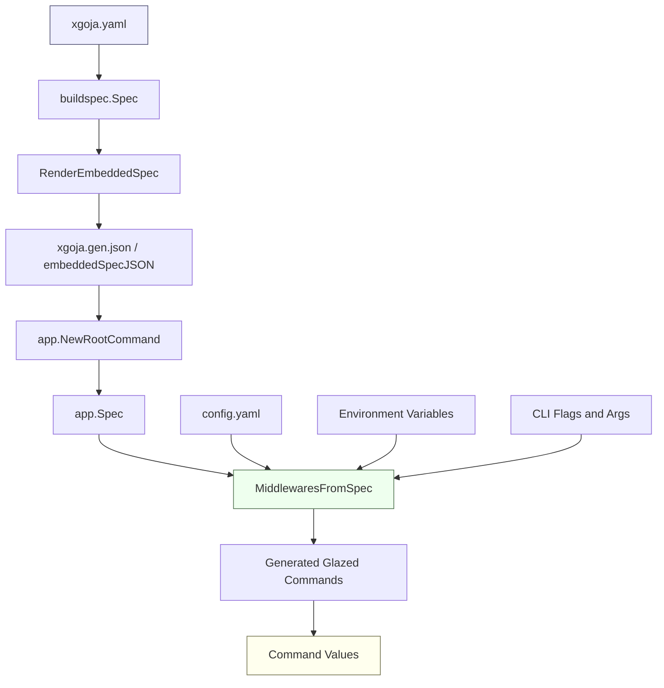

# xgoja Generated Binary Configuration

This project added application identity, environment-variable parsing, and Glazed config-file loading to generated `xgoja` binaries. Before this work, a generated binary could accept command-line flags and positional arguments, but it could not be configured like a normal Glazed application from `xgoja.yaml`. The new feature lets the buildspec describe how the final binary should identify itself and where generated commands should read their values.

> [!summary]
> PR #49 merged support for `appName`, `envPrefix`, and `config` in generated xgoja binaries.
> The implementation preserves old behavior for specs that do not opt in.
> The main remaining follow-up is issue #50: app-scoped config layers should honor custom `config.fileName` values.

## Why this project exists

`xgoja` turns a YAML buildspec into a generated Go binary that embeds JavaScript runtimes, provider modules, command definitions, help pages, and assets. That generated binary often behaves like an application, not merely like a test harness. It may be installed on a user's machine, invoked by scripts, run in different working directories, and configured through environment variables or config files.

The missing piece was that generated Glazed commands did not inherit the source-middleware behavior that ordinary Glazed applications rely on. A hand-written Glazed application can usually read values from defaults, config files, environment variables, positional arguments, and Cobra flags. A generated xgoja binary previously used only the default Cobra parser middleware chain. That made generated binaries less useful for real applications because every setting had to be supplied as a CLI flag or as a value hardcoded into JavaScript or provider configuration.

The project therefore had two goals. The first goal was user-facing: let `xgoja.yaml` say what application is being generated and how command fields should be configured. The second goal was architectural: add this behavior without turning code generation into a nest of generated Go snippets. The final design puts most behavior into runtime helper functions under `pkg/xgoja/app`, and keeps the generated spec as the compact data contract between build time and runtime.

## Current project status

The feature is implemented and merged in PR #49:

- PR: [Feat(xgoja): Add environment and config file support for generated binaries](https://github.com/go-go-golems/go-go-goja/pull/49)
- Branch: `task/add-xgoja-env-app-name`
- Merge commit: `b4dfe8b`
- Ticket: `XGOJA-017`
- Main ticket docs: `/home/manuel/workspaces/2026-06-02/add-xgoja-env-app-name/go-go-goja/ttmp/2026/06/02/XGOJA-017--add-env-prefix-app-name-glazed-source-middleware-support-to-xgoja-generated-binaries/`

What is complete:

- `xgoja.yaml` supports top-level `appName` and `envPrefix`.
- `xgoja.yaml` supports a `config` block with `enabled`, `layers`, and `fileName`.
- Generated runtime specs embed `appName`, `envPrefix`, and `config`.
- Generated commands can read from config files and environment variables.
- Existing generated binaries keep the old default behavior unless the spec opts in.
- User-facing docs were updated in the buildspec reference, full user guide, YAML tutorial, and runnable example.
- Example `examples/xgoja/11-config-env/` demonstrates config, env, and CLI precedence.

What remains open:

- Issue #50 tracks a code-review follow-up: app-scoped config layers (`system`, `xdg`, `home`) currently use Glazed helpers that resolve `<appName>/config.yaml`; they do not yet honor a custom `config.fileName` such as `settings.yaml`.

## The core mental model

The important concept is that `xgoja.yaml` is not only a build recipe. It is also the source of the runtime contract for the generated binary. Some fields are used only while generating Go code, such as the generated module path and replacement paths. Other fields must survive into the final executable because they control runtime behavior.

This project added three runtime-relevant pieces of information:

| Field | Meaning | Runtime effect |
| --- | --- | --- |
| `appName` | Application identity | Used by root framework setup and app-scoped config discovery. |
| `envPrefix` | Shell-safe environment namespace | Enables environment-variable parsing for command fields. |
| `config` | Config loading policy | Enables Glazed config-plan middleware and defines discovery layers. |

The generated binary receives these fields through `xgoja.gen.json`, the embedded runtime spec. At startup, `app.NewRootCommand` decodes that JSON, constructs a `Host`, and attaches generated commands. Those commands are Glazed commands, so the central question is: which Glazed source middlewares should they use?

The new answer is: derive the middleware chain from the embedded runtime spec. If the spec has no environment prefix and no config block, use `cli.CobraCommandDefaultMiddlewares`. If the spec opts into env or config, construct a custom middleware chain that preserves the expected precedence.

## User-facing buildspec shape

A generated application can now declare its identity and configuration sources directly in `xgoja.yaml`:

```yaml
name: config-env-demo
appName: config-env-demo
envPrefix: DEMO
config:
  enabled: true
  layers:
    - cwd
    - explicit
  fileName: config.yaml
```

The config file uses Glazed's section-map format:

```yaml
fixture:
  value: from-config-file
```

The matching environment variable combines the environment prefix, the command section prefix, and the field name:

```bash
DEMO_FIXTURE_VALUE=from-env ./dist/config-env-demo run script.js
```

A CLI flag still wins over both config and environment:

```bash
DEMO_FIXTURE_VALUE=from-env \
  ./dist/config-env-demo run --fixture-value from-flag script.js
```

The effective precedence is:

```text
field defaults < config files < environment variables < positional args / CLI flags
```

This ordering matters because it matches the behavior users expect from a configurable command-line application. Defaults make the command usable. Config files make repeated local usage convenient. Environment variables make deployment and scripting convenient. CLI flags make one invocation explicit.

## Architecture

The implementation is a small set of changes spread across the build-time spec, the runtime spec, the generator, and the app command wiring. The key design choice is that behavior lives in reusable runtime code rather than in generated Go fragments.



The data path has four important boundaries.

First, `cmd/xgoja/internal/buildspec/spec.go` defines what users can write in YAML. This is where `AppName`, `EnvPrefix`, and `ConfigSpec` enter the system. The buildspec still contains build-only fields such as Go module settings, package imports, and replacement paths.

Second, `cmd/xgoja/internal/generate/main.go` decides which buildspec fields are embedded in the generated runtime JSON. This boundary is easy to miss because it is not a simple `json.Marshal(buildspec.Spec)`. The generator intentionally filters and rewrites fields so that the final executable receives only runtime-relevant data.

Third, `pkg/xgoja/app/spec.go` defines the runtime shape of that embedded JSON. Runtime code does not need to know how the generated module was built, but it must know the app identity, environment prefix, and config policy.

Fourth, `pkg/xgoja/app/middlewares.go` turns the runtime spec into a Glazed `CobraMiddlewaresFunc`. This is the implementation center of the project.

## Implementation details

The central function is `MiddlewaresFromSpec`. Its first responsibility is compatibility. Existing specs that do not set `appName`, `envPrefix`, or `config.enabled` should behave exactly as before. That is why the function returns `cli.CobraCommandDefaultMiddlewares` when there is no new source policy to apply.

The second responsibility is precedence. Glazed middlewares are not simply applied in the order a reader might expect. The returned slice is ordered from highest to lowest precedence because Glazed middlewares call `next` before applying their own values. The code therefore lists Cobra and args first, then env, then config, then defaults. The resulting effective precedence is the reverse of what many readers might assume at first glance.

The essential shape is:

```go
func MiddlewaresFromSpec(spec *Spec) cli.CobraMiddlewaresFunc {
    envPrefix := EffectiveEnvPrefix(spec)
    hasConfig := spec != nil && spec.Config != nil && spec.Config.Enabled

    if envPrefix == "" && !hasConfig {
        return cli.CobraCommandDefaultMiddlewares
    }

    return func(parsed *values.Values, cmd *cobra.Command, args []string) ([]Middleware, error) {
        middlewares := []Middleware{
            FromCobra(cmd),
            FromArgs(args),
        }

        if envPrefix != "" {
            middlewares = append(middlewares, FromEnv(envPrefix))
        }

        if hasConfig {
            middlewares = append(middlewares, FromConfigPlanBuilder(...))
        }

        middlewares = append(middlewares, FromDefaults())
        return middlewares, nil
    }
}
```

The config plan builder then interprets the configured layers:

```go
for _, layer := range config.Layers {
    switch layer {
    case "system":
        add system app config source
    case "xdg":
        add XDG app config source
    case "home":
        add home app config source
    case "git-root":
        add git-root file source using fileName
    case "cwd":
        add working-directory file source using fileName
    case "explicit":
        add --config-file only if the flag is present
    }
}
```

The `explicit` layer is deliberately gated. Passing `--config-file` does not load an arbitrary file unless `explicit` is listed in `config.layers`. This makes the layer list the authoritative declaration of where the generated binary is allowed to read configuration from.

The environment-prefix logic is also deliberately conservative. `name` alone does not create an environment namespace because that would change behavior for old specs. A user must set `envPrefix` or `appName`. If `envPrefix` is omitted and `appName` is present, `DefaultEnvPrefix` derives a shell-safe prefix by uppercasing letters, turning separators into underscores, trimming stray underscores, and prefixing leading digits with `APP_`.

## Validation and tests

The implementation has tests at three levels.

Buildspec validation tests cover YAML-level rules. They prove that unknown config layers are rejected and that `appName` is required only for app-scoped layers. This distinction matters because `cwd`, `git-root`, and `explicit` can be resolved without an application identity.

Runtime middleware tests cover command behavior. They verify that config values are read, environment variables override config, CLI flags override environment, and `--config-file` is ignored unless the `explicit` layer is configured.

Generator tests cover the boundary that caused the most important bug during implementation. `RenderEmbeddedSpec` manually constructs the runtime JSON payload, so the new runtime fields had to be explicitly added. The regression test unmarshals the rendered JSON into `app.Spec` and checks that `AppName`, `EnvPrefix`, and `Config` survive the build-time-to-runtime boundary.

The final validation sequence included:

```bash
go test ./cmd/xgoja/internal/buildspec ./pkg/xgoja/app ./cmd/xgoja/internal/generate -count=1
go test ./... -count=1
```

The generated example was also built and exercised directly:

```bash
xgoja build -f examples/xgoja/11-config-env/xgoja.yaml \
  --xgoja-replace /path/to/go-go-goja

./dist/config-env-demo eval 'fixtureValue'
DEMO_FIXTURE_VALUE=from-env ./dist/config-env-demo eval 'fixtureValue'
DEMO_FIXTURE_VALUE=from-env ./dist/config-env-demo eval --fixture-value from-flag 'fixtureValue'
./dist/config-env-demo eval --config-file config.yaml 'fixtureValue'
```

The observed outputs demonstrated the intended chain: config file value, then environment override, then flag override, then explicit config-file loading.

## Important project files

| File | Role |
| --- | --- |
| `cmd/xgoja/internal/buildspec/spec.go` | Adds YAML-facing `appName`, `envPrefix`, and `config` fields. |
| `cmd/xgoja/internal/buildspec/validate.go` | Validates config layers and app-name requirements. |
| `cmd/xgoja/internal/buildspec/load.go` | Defaults config layers and file names after YAML load. |
| `cmd/xgoja/internal/generate/main.go` | Embeds runtime-relevant fields into generated JSON. |
| `cmd/xgoja/internal/generate/generate_test.go` | Tests generated spec shape and runtime field preservation. |
| `pkg/xgoja/app/spec.go` | Defines the runtime JSON contract. |
| `pkg/xgoja/app/middlewares.go` | Converts runtime spec into Glazed middleware policy. |
| `pkg/xgoja/app/host.go` | Propagates middleware factory into generated commands. |
| `pkg/xgoja/app/root.go` | Decodes embedded spec and constructs the generated root command. |
| `pkg/xgoja/app/middlewares_test.go` | Tests env/config behavior and precedence. |
| `examples/xgoja/11-config-env/` | Runnable example for users. |
| `cmd/xgoja/doc/02-user-guide.md` | Full user-facing reference. |
| `cmd/xgoja/doc/03-tutorial-using-xgoja-yaml.md` | Guided tutorial with env/config step. |
| `cmd/xgoja/doc/06-buildspec-reference.md` | Quick buildspec reference. |

## The main design decision

The project originally considered broader support for arbitrary source middlewares and Glazed-style profiles. That was intentionally deferred. Xgoja already uses the word `runtimes` for what are effectively JavaScript runtime profiles, so adding another profile concept would introduce naming ambiguity. Arbitrary middleware configuration would also expose ordering and compatibility problems before there was a concrete user need.

The accepted design is narrower:

- `appName` gives the generated binary an application identity.
- `envPrefix` controls environment-variable parsing.
- `config` controls config-file discovery.
- Profiles and arbitrary source middleware remain future work.

This narrowing made the implementation easier to review and safer to merge. It also gave users the most useful configuration behavior without committing the project to a broad middleware DSL.

## Failure modes and lessons

The most important failure happened at the generator boundary. Unit tests initially passed because they constructed runtime specs directly, but generated binaries still ignored config. The reason was that `RenderEmbeddedSpec` manually built the JSON payload and did not include the new fields. The lesson is simple but important: every runtime-relevant buildspec field must be traced through both the build-time struct and the generated embedded JSON.

A second subtle failure involved the `explicit` layer. The first implementation added the explicit config file whenever `--config-file` was present. That made `config.layers` less meaningful because a user could load an explicit file even when the spec did not declare the `explicit` layer. The review follow-up moved explicit-file handling into the layer switch so that the YAML remains the source of truth.

The open issue #50 is the remaining config-path failure mode. App-scoped layers currently call Glazed helpers such as `XDGAppConfig(appName)`. Those helpers use the conventional `config.yaml` filename. If a user sets `fileName: settings.yaml`, local layers use it, but app-scoped layers do not. The issue is filed so this mismatch can be fixed without blocking the merged feature.

## User-facing documentation

The feature is now documented in four places:

- `cmd/xgoja/doc/02-user-guide.md` explains the fields, config layers, env var naming, and precedence.
- `cmd/xgoja/doc/03-tutorial-using-xgoja-yaml.md` includes a practical env/config tutorial step.
- `cmd/xgoja/doc/06-buildspec-reference.md` gives a quick schema reference and layer table.
- `examples/xgoja/11-config-env/README.md` gives a runnable example with expected outputs.

This matters because the feature is not visible from generated code alone. A user needs to know the exact YAML shape, the exact flag name `--config-file`, and the exact environment-variable naming convention.

## Near-term next steps

The next useful task is issue #50:

- Make `system`, `xdg`, and `home` layers honor custom `config.fileName`.
- Add regression tests for at least one app-scoped layer with a non-default filename.
- Update docs if the final path shape differs from the current table.

A second useful task would be a formal generated-example smoke-test harness. The project already has examples and manual verification commands; a harness would make it cheaper to assert that important examples still build and run after future generator changes.

## Project working rule

When adding a new xgoja buildspec field, trace it through all four layers before calling the feature complete:

1. YAML/build-time struct in `cmd/xgoja/internal/buildspec`.
2. Validation/defaulting after load.
3. Embedded runtime JSON from `RenderEmbeddedSpec`.
4. Runtime behavior in `pkg/xgoja/app`.

If a field affects generated-binary behavior but does not appear in the embedded runtime spec, generated examples can fail even while direct unit tests pass.
