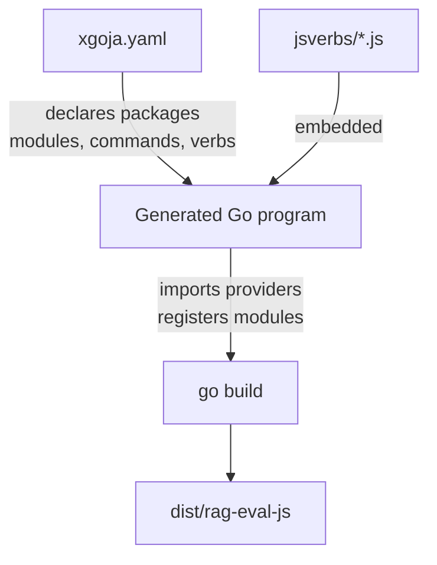

# Deep Dive: xgoja Scripting for RAG Evaluation Systems

This article explains how a RAG evaluation system was extended with a JavaScript scripting layer using xgoja, a binary generator that produces custom goja-powered CLIs from declarative YAML specifications. The work was carried out on the `rag-eval` system and resulted in a new `explorer.js` verb package with twelve commands that use the `db`, `fs`, `express`, `markdown`, `sanitize`, and `extract` modules. The goal is not to describe what was built, but to explain the design decisions, the module behaviors, the failure modes, and the patterns that make the system extensible.

> [!summary]
> - xgoja generates a custom binary from a `xgoja.yaml` spec. Rebuilding after every script change is non-negotiable.
> - The `db` module provides full SQLite access but no transactions. Dynamic SQL with `?` placeholders is the safe pattern.
> - The `fs` module supports sync operations including `mkdirSync(path, { recursive: true })`.
> - The `express` module is a minimal route registry, not a full Express.js stack. Path params work, middleware does not.
> - `goja-text` modules expose Go-backed text processing: Markdown AST traversal, YAML/JSON repair, and structured-data candidate extraction.
> - `sanitize.yaml.sanitize()` returns `null` `Fixes` and `Issues` on clean input, which crashes naive `map()` calls.

## Why this pattern exists

A RAG evaluation system needs to ingest documents from multiple sources, chunk them using configurable strategies, compute embeddings, build hybrid search indexes, and expose the results for inspection. The `rag-eval` system already had a Go CLI for operations and a React web UI for browsing. Both are correct tools for their jobs, but both are slow to extend for ad-hoc questions.

Consider the question: "How many documents in the TTC source are still pending, and what is their average word count?" Answering this with the Go CLI would require adding a new Cobra subcommand, compiling Go, writing tests, and redeploying. Answering it with the React UI would require adding a new view component, a new API endpoint, and a frontend build cycle. Either approach takes minutes to hours.

A JavaScript scripting layer backed by the same SQLite database sits in the middle. The script author writes a function, rebuilds the binary in five seconds, and gets a new CLI command. The script runs with the same database connection, the same schema, and the same query power as the Go backend, but without the ceremony of a full build pipeline.

This is not a replacement for production features. A script that proves useful can be promoted to a Go command or a web view. A script that is only needed once can be discarded. The JavaScript layer is a prototyping substrate, not a runtime target.

## The mental model: three layers

Understanding the system requires holding three layers in mind simultaneously.

### The build layer

`xgoja` reads a YAML specification (`xgoja.yaml`) and generates a temporary Go program. This program imports selected provider packages, registers each as a `require`-able module, embeds the `jsverbs` JavaScript files, and compiles everything into a single binary (`dist/rag-eval-js`). The binary is self-contained. It carries the goja JavaScript engine, the Go standard library modules, and the embedded scripts.



The build step is not optional. Every change to a `.js` file in `jsverbs/` requires a rebuild. The framework does not hot-reload scripts at runtime. They are embedded at compile time.

### The runtime layer

When you run `./dist/rag-eval-js explorer sources`, the binary starts a goja runtime, initializes the modules according to the YAML spec, loads the embedded `jsverbs/explorer.js`, locates the `sources` verb, parses the CLI flags into a Glazed parameter map, and calls the JavaScript function. The function runs with the same privileges as the Go process: it can read and write files, open database connections, and register HTTP routes.

### The verb layer

A verb is a JavaScript function registered with `__verb__()`. The function receives CLI flags as arguments and returns a plain object or array. Glazed handles output formatting (table, JSON, YAML, CSV, etc.). The verb author does not parse `process.argv`, validate arguments, or format output. The framework handles all of that.

## The xgoja build specification

The `xgoja.yaml` file is the source of truth for what the binary can do. Here is the relevant excerpt from the `rag-eval` configuration:

```yaml
runtimes:
  main:
    modules:
      - package: go-go-goja-core
        name: path
        as: path
      - package: go-go-goja-core
        name: yaml
        as: yaml
      - package: go-go-goja-host
        name: fs
        as: fs
        config:
          allow: true
      - package: go-go-goja-host
        name: db
        as: db
        config:
          allowConfigure: true
      - package: goja-text
        name: markdown
        as: markdown
      - package: goja-text
        name: sanitize
        as: sanitize
      - package: goja-text
        name: extract
        as: extract
      - package: go-go-goja-http
        name: express
        as: express
```

The `as` field defines the name used in `require()`. The `allowConfigure: true` flag on `db` means JavaScript can call `db.configure('sqlite3', path)` to open a database. Without this flag, the module would be read-only or pre-configured by Go.

The `replace` paths in the `packages` section point to local checkouts. This is why the build command needs `--xgoja-replace`:

```bash
xgoja build -f xgoja.yaml --output dist/rag-eval-js --xgoja-replace ../../../go-go-goja
```

Without this flag, xgoja would try to resolve `go-go-goja` from the Go module proxy, which would fail because the workspace uses Go workspace mode with local overrides.

## The db module: power and limitations

The `db` module is the most important module for corpus work. It exposes three functions: `configure`, `query`, and `exec`.

```js
db.configure("sqlite3", "data/rag-eval.db");
const rows = db.query("SELECT * FROM sources WHERE type = ?", "filesystem");
const result = db.exec("UPDATE documents SET status = ? WHERE id = ?", "chunked", docId);
```

`query()` returns an array of plain objects. `exec()` returns `{ success, rowsAffected, lastInsertId }`. Arguments are flattened automatically, so passing an array or variadic values both work.

The module uses `database/sql` with the `mattn/go-sqlite3` driver. This means all standard SQLite features are available: `PRAGMA`, `json_extract`, window functions, CTEs, and full-text search if the extension is compiled in.

However, there is no transaction support. There is no `db.begin()`, `db.commit()`, or `db.rollback()`. This means multi-statement updates from JavaScript are not atomic. If a script updates three tables and fails on the third, the first two updates are already committed. This is a deliberate simplicity choice — the module is intended for exploration and ad-hoc queries, not for production data pipelines.

The connection lifecycle is also worth understanding. `configure` opens a new `sql.DB` and closes the old one. The connection persists for the lifetime of the verb invocation. If a script calls `configure` twice with different paths, the first connection is closed before the second is opened.

## The fs module: what works and what does not

The `fs` module provides sync and async file operations. The sync variants are usually more convenient in verb mode because the function invocation is synchronous anyway.

```js
const text = fs.readFileSync("file.txt", "utf-8");
fs.writeFileSync("out.json", JSON.stringify(data), "utf-8");
fs.mkdirSync("exports", { recursive: true });
```

The key detail is that `mkdirSync` accepts a JavaScript options object. The Go backend parses `recursive` and `mode` from this object:

```go
func mkdirOptions(vm *goja.Runtime, value goja.Value) (bool, uint32) {
    recursive := false
    mode := uint32(0o755)
    obj := value.ToObject(vm)
    if r := obj.Get("recursive"); r != nil {
        recursive = r.ToBoolean()
    }
    if m := obj.Get("mode"); m != nil {
        mode = fileModeOption(vm, m)
    }
    return recursive, mode
}
```

This works, but it is not a real Node.js `fs` module. There is no `fs.promises` namespace, no `fs.watch`, and no permission model beyond the binary's OS-level access. The `allow: true` config in `xgoja.yaml` grants full filesystem access to all scripts.

## The express module: minimal routing

The `express` module is not Express.js. It is a minimal route registry backed by the Go `gojahttp.Host` type. It supports route registration, path parameters, and static file serving, but no middleware, no body parsing, and no CORS handling.

```js
const express = require("express");
const app = express.app();

app.get("/api/documents/:id", (req, res) => {
  const rows = db.query("SELECT * FROM documents WHERE id = ?", req.params.id);
  res.json(rows[0] || { error: "not found" });
});
```

Path parameters are parsed into `req.params`. The `res.json()` function serializes the object and sets the content type. The server only starts listening if the runtime is launched with HTTP enabled, which is the default for verb mode.

For a long-lived server, the `run` command with `--keep-alive` is required:

```bash
rag-eval-js run script.js --keep-alive --http-listen 127.0.0.1:8788
```

Without `--keep-alive`, the runtime exits after the verb function returns, and the HTTP listener shuts down.

The default port is `8787`, which is often occupied by a prior process. The error message is a plain `address already in use` failure. The module does not auto-increment the port.

## The goja-text modules: text processing from Go

The `goja-text` package provides three text-processing modules backed by Go libraries: `markdown`, `sanitize`, and `extract`. These are not thin wrappers around JS libraries. They are Go-native implementations exposed through goja.

### markdown

The `markdown` module uses `goldmark` to parse Markdown into an AST. The AST nodes are Go objects with PascalCase fields: `Type`, `Children`, `Level`, `Destination`, `Text`.

```js
const markdown = require("markdown");
const ast = markdown.parse("# Title\n\nBody");
markdown.walk(ast, (node, ctx) => {
  if (node.Type === "heading") {
    console.log("Level", node.Level);
  }
});
```

`walk` returns control values: `undefined` or `true` continues, `false` or `"skip"` skips children, `"stop"` halts traversal. This is a powerful pattern for analyzing document structure without loading the entire tree into memory.

### sanitize

The `sanitize` module repairs malformed YAML and JSON. It has two namespaces: `sanitize.yaml` and `sanitize.json`.

```js
const result = sanitize.yaml.sanitize("name:Alice\n  age: 30\n");
```

The result object has PascalCase fields: `Sanitized`, `Fixes`, `Issues`, `ParseClean`, `StrictParseClean`. Here is the critical detail: on clean input, `Fixes` and `Issues` are `null` or `undefined`. The first attempt at `result.Fixes.map(...)` crashes with a TypeError.

The correct pattern is defensive access:

```js
const fixes = (result.Fixes || []).map((f) => f.Rule);
```

This is not documented in the help entries. It was discovered empirically by running the script, watching it crash, and reading the Go source to understand the null behavior.

### extract

The `extract` module finds structured data candidates inside larger text blocks. It searches for Markdown fenced code blocks, XML-like tags (`<json>...</json>`), YAML frontmatter, and raw JSON/YAML strings.

```js
const candidates = extract.all("Some text\n~~~json\n{\"ok\": true}\n~~~");
```

Each candidate exposes `Kind`, `Format`, `Text`, `Confidence`, and source position fields. The `Confidence` field is a heuristic score between 0 and 1, but the help documentation does not explain the scale. A `0.5` could mean "probably JSON" or "barely JSON". The module preserves overlapping candidates instead of deduplicating them, which means the caller must decide what to do with multiple matches.

## The jsverb pattern: registration and constraints

A jsverb file in `cmd/rag-eval/jsverbs/` follows a strict pattern:

```js
__package__({ name: "explorer", short: "RAG database explorer" });

function sources(database) {
  db.configure("sqlite3", database || DEFAULT_DB);
  return db.query("SELECT * FROM sources");
}

__verb__("sources", {
  short: "List all sources",
  fields: {
    database: { type: "string", default: "data/rag-eval.db" }
  }
});
```

The `__package__` call declares the command group. The `__verb__` call registers the function. The first argument to `__verb__` must match the function name exactly. The `fields` descriptor defines CLI flags and positional arguments.

Supported field types: `string`, `int`, `bool`, `float`, and arrays thereof. `{ argument: true }` makes the field a positional argument. Glazed handles parsing, validation, and output formatting.

Return values are automatically serialized. You do not call `console.log` unless you want side-effect output in addition to the structured result.

## Dynamic SQL: the pattern that matters most

The most common pattern in corpus scripts is dynamic SQL with optional filters. Here is the approach used throughout the `explorer.js` package:

```js
function documents(database, sourceId, status, limit) {
  openDatabase(database);
  let sql = `SELECT * FROM documents`;
  const conditions = [];
  const args = [];

  if (sourceId) { conditions.push("source_id = ?"); args.push(sourceId); }
  if (status) { conditions.push("status = ?"); args.push(status); }
  if (conditions.length > 0) {
    sql += " WHERE " + conditions.join(" AND ");
  }
  sql += " LIMIT ?";
  args.push(limit || 20);

  return db.query(sql, args);
}
```

This pattern is safe because every user-provided value is passed as a `?` placeholder. The SQL string is built from hard-coded fragments. There is no string concatenation of user input. The `db` module flattens the `args` array automatically.

This same pattern appears in the Go backend (`internal/db/search_queries.go`) for the same reason: it is the simplest way to build parameterized queries with optional filters.

## What broke and why

Every system has failure modes that are not obvious from the documentation. Here are the ones encountered during this work.

### sanitize nulls

`sanitize.yaml.sanitize()` returns `null` for `Fixes` and `Issues` on clean input. The first draft of `sanitizeProbe` crashed with `TypeError: Cannot read property 'map' of undefined` because it assumed these fields always existed.

### Port conflicts

The default HTTP port `8787` was occupied by a prior `rag-eval-js` process. The error was a plain `listen tcp 127.0.0.1:8787: bind: address already in use`. The module does not try another port. The workaround is to pass `--http-listen 127.0.0.1:8788`.

### exportDocs has no limit

The `exportDocs` verb loads all matching documents into memory before writing them to disk. During testing, a mistaken `--limit` flag was passed, which does not exist on this verb. The verb exported 2,594 files in one invocation. This is fine for the current corpus size (~5,000 documents) but would cause memory pressure on larger datasets.

### No transactions

The `db` module has no `begin`/`commit`/`rollback`. A script that updates three tables cannot roll back on failure. This limits the scripting layer to read-heavy or single-statement write operations.

## Key points

- xgoja generates a custom binary from `xgoja.yaml`. Rebuilding after every script change is mandatory.
- The `db` module provides full SQLite access but no transactions. Dynamic SQL with `?` placeholders is the safe query-building pattern.
- The `fs` module supports sync operations. `mkdirSync(path, { recursive: true })` works because the Go backend parses the options object.
- The `express` module is a minimal route registry. Path parameters work via `req.params`. Middleware, body parsing, and CORS are not supported.
- `goja-text` modules expose Go-backed text processing. Markdown AST traversal, YAML/JSON repair, and structured-data extraction are all available.
- `sanitize` returns `null` `Fixes` and `Issues` on clean input. Always use defensive access: `(result.Fixes || []).map(...)`.
- The default HTTP port `8787` is often occupied. Override it with `--http-listen` or use `--keep-alive` for long-lived servers.

## See Also

- `PROJ - RAG Evaluation System` — the parent project this scripting layer belongs to
- `rag-eval-js help explorer` — the built-in explorer verbs this work produced
- [[Tribal/xgoja-binary-generation]] — the pattern of generating custom JS runtimes from YAML specs
- [[Tribal/goja-embedding-in-go]] — the Go+JS runtime pattern used by xgoja
