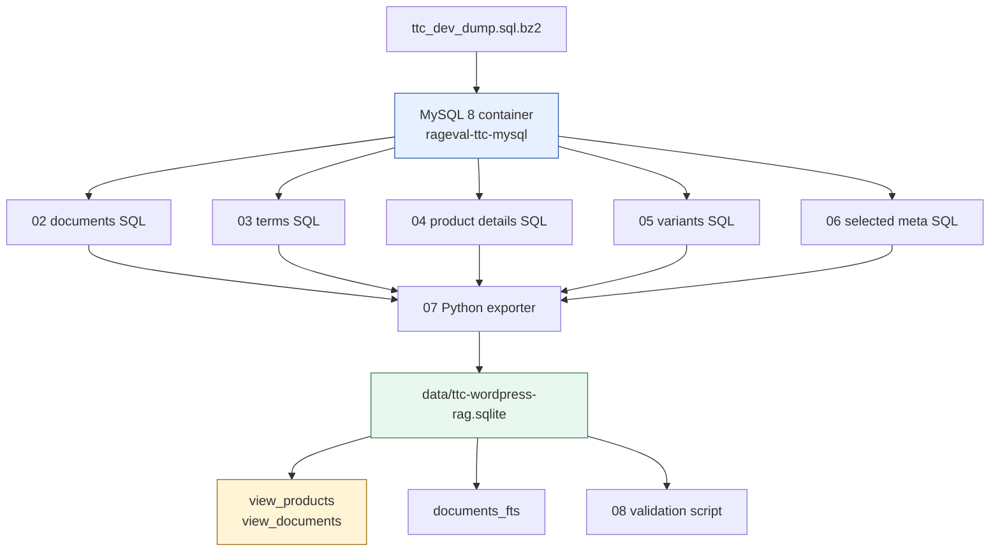

# Exporting WordPress and WooCommerce Data into a RAG SQLite Corpus

This article explains the TTC WordPress-to-SQLite export built for the RAG evaluation system. The project takes a compressed MySQL dump from a WordPress and WooCommerce site, loads it into a local MySQL container, extracts products and editorial content through explicit SQL queries, and writes a compact SQLite database designed for retrieval-augmented generation.

The important design choice is that the SQLite database is not a copy of WordPress. WordPress stores content, taxonomy, product facts, variation data, SEO fields, and plugin metadata across many tables with historical conventions. A RAG corpus needs a smaller representation: one document table, one term table, product facts, variants, selected raw metadata, an FTS index, and two simple views that a bot can query without knowing the source schema.

> [!summary]
> - The source is `/home/manuel/code/ttc/ttc/ttc_dev_dump.sql.bz2`, loaded into a local MySQL 8 container named `rageval-ttc-mysql`.
> - The exporter writes `data/ttc-wordpress-rag.sqlite`, currently containing 3,258 documents, 123,457 term rows, 2,600 product detail rows, and 12,179 product variants.
> - The bot-facing entrypoints are `view_products` and `view_documents`; both expose plain text and Markdown context.
> - The implementation is captured in ticket `RAGEVAL-TTC-SQLITE-EXPORT` and committed in `174c697f7d8470a7ccc84d70d648703048cbe4b3`.

## Why this export exists

The RAG evaluation system needs realistic corpora. A small clean dataset is useful for smoke tests, but it does not exercise the problems that appear in production retrieval: mixed document types, overlapping categories, product variants, HTML content, shortcodes, duplicated labels, large taxonomies, and domain-specific metadata. The TTC WordPress dump provides those problems in a compact local artifact.

The source data is also not suitable for direct RAG use. WordPress separates a page into `wp_posts`, `wp_postmeta`, `wp_term_relationships`, `wp_term_taxonomy`, and `wp_terms`. WooCommerce adds product facts, stock, prices, COGS, attributes, and variations through postmeta rows and taxonomy relationships. A query that answers a product question may need the product title, content, botanical name, hardiness zone, stock status, category, SKU, size variants, and SEO text. These values are not adjacent in the source schema.

The export project solves this by defining a RAG-facing schema. The schema preserves enough structure for filtering and answer generation, while hiding the WordPress implementation details behind stable SQLite tables and views.

## Source and destination

The source dump is a compressed MySQL dump:

```text
/home/manuel/code/ttc/ttc/ttc_dev_dump.sql.bz2
```

The local MySQL source container is defined by two ticket scripts:

```text
scripts/01-setup-mysql-container.sh
scripts/09-docker-compose.mysql.yml
```

The generated SQLite database is:

```text
data/ttc-wordpress-rag.sqlite
```

The ticket is stored at:

```text
ttmp/2026/06/02/RAGEVAL-TTC-SQLITE-EXPORT--export-ttc-wordpress-data-to-sqlite-for-rag-querying
```

The exporter reads five SQL files and one Python driver:

```text
02-export-documents.sql
03-export-document-terms.sql
04-export-product-details.sql
05-export-product-variants.sql
06-export-selected-meta.sql
07-export-ttc-wordpress-to-sqlite.py
```

The validation script is:

```text
08-validate-ttc-sqlite.sh
```

The scripts are numbered because the ticket is meant to be replayable. A future reader can start at `01`, inspect each source query, run the export, and validate the resulting SQLite database without relying on shell history.

## Pipeline overview

The export pipeline has four phases. Each phase has a separate responsibility, and each responsibility is visible in the scripts.



The MySQL phase makes the WordPress dump queryable. The SQL extraction phase produces JSON objects from source tables. The Python phase decodes those JSON objects, cleans HTML, converts content to Markdown, and writes SQLite rows. The validation phase checks row counts, sample products, categories, FTS, and Markdown structure.

## Why the destination schema is small

A RAG schema should make the common retrieval and context-generation operations direct. It should not require a bot to reconstruct WordPress semantics from low-level tables.

The export therefore uses six main tables:

| Table | Purpose |
|---|---|
| `documents` | One row per product, post, page, FAQ, or guide. |
| `document_terms` | Categories, tags, product categories, product attributes, and guide/FAQ categories. |
| `product_details` | Product facts such as SKU, stock, price, botanical name, hardiness zone, sunlight, and mature size. |
| `product_variants` | WooCommerce variation rows linked to parent products. |
| `document_meta` | Selected raw postmeta for debugging and future extraction improvements. |
| `documents_fts` | SQLite FTS5 index over document title and enriched search text. |

It also defines two simple views for RAG consumers:

| View | Purpose |
|---|---|
| `view_products` | One row per product with product facts, categories, attributes, text, Markdown, and search context. |
| `view_documents` | One row per non-product document: posts, pages, FAQs, and guides. |

The normalized tables preserve query precision. The views provide ease of use. A retrieval script can start with the views and only join the underlying tables when it needs more detail.

## The document table

The `documents` table is the central table. It stores content in three forms: plain text, Markdown, and enriched search context.

```text
doc_id             stable ID like wp:3699
wp_id              original wp_posts.ID
kind               product, post, page, faq, ttc_guide
status             WordPress post_status
title              decoded title
slug               WordPress post_name
url                original guid
content_text       cleaned plain text from post_content
excerpt_text       cleaned plain text from post_excerpt
content_markdown   simple Markdown from post_content
excerpt_markdown   simple Markdown from post_excerpt
search_text        plain-text retrieval context
search_markdown    Markdown retrieval/prompt context
metadata_json      compact SEO/thumb/menu/comment metadata
post_date          WordPress post_date
post_modified      WordPress post_modified
```

Plain text and Markdown serve different purposes. `content_text` and `search_text` are stable inputs for FTS and simple string matching. `content_markdown` and `search_markdown` preserve headings, links, lists, and basic document boundaries for prompt construction.

The generated corpus currently contains:

```text
product:    2600
post:        483
page:        121
faq:          35
ttc_guide:    19
```

These counts matter because the export is not only a product catalog. Posts, pages, FAQs, and guides are part of the answerable corpus.

## Terms, categories, tags, and attributes

WordPress represents categories and tags through taxonomy tables. WooCommerce uses the same mechanism for product categories and many product attributes. The exporter keeps these relationships in `document_terms`.

```text
doc_id            owning document
taxonomy          category, product_cat, post_tag, pa_size, pa_growing-zone, ...
term_id           WordPress term_id
term_slug         WordPress term slug
term_name         decoded term name
term_description  taxonomy description
parent_term_id    parent taxonomy term when present
is_category       1 for category-like taxonomies
```

The table currently has 123,457 rows. That number is high because products have many attributes and variations in the source. Keeping terms in their own table allows precise filters:

```sql
SELECT d.doc_id, d.title
FROM documents d
JOIN document_terms t ON t.doc_id = d.doc_id
WHERE t.taxonomy = 'product_cat'
  AND t.term_name = 'Cypress Trees';
```

The views also collapse selected term groups into readable text columns. This is useful for prompt context:

```text
categories: Arborvitae Trees, Privacy Trees, Thuja Trees
attributes: pa_growing-zone: 5-9; pa_sun-needs: Full Sun; pa_water-needs: Moderate
```

The normalized row representation and the collapsed view representation are both needed. The first is good for filtering. The second is good for reading and prompt construction.

## Product facts and variants

Products need more than body text. A product question often depends on facts stored in postmeta. The exporter extracts a selected set of those facts into `product_details`.

```text
sku
product_type
stock_status
price
regular_price
sale_price
botanical_name
hardiness_zone
sunlight
soil_conditions
drought_tolerance
mature_height
mature_width
```

The extraction is based on the existing TTC SQL templates under:

```text
/home/manuel/code/ttc/ttc/sql/sqleton/ttc/products
```

The templates identified the relevant postmeta keys and taxonomy joins. The exporter uses canonical WordPress tables directly rather than relying on every helper view in the source database.

Product variations are stored separately in `product_variants`:

```text
variant_wp_id
parent_doc_id
sku
size
stock
stock_status
price
regular_price
sale_price
attributes_json
```

This keeps the parent product row readable while preserving variation-level facts. A product can have many sizes and SKUs; flattening all variants into the product table would make the product row hard to inspect and difficult to query precisely.

## The two bot-facing views

The final schema gives a RAG bot two simple entrypoints.

### `view_products`

`view_products` contains one row per product. It joins document content, product facts, product categories, product attributes, and tags.

```text
doc_id
wp_id
title
slug
url
sku
product_type
stock_status
price
regular_price
sale_price
botanical_name
hardiness_zone
sunlight
soil_conditions
drought_tolerance
mature_height
mature_width
categories
attributes
content_text
excerpt_text
content_markdown
excerpt_markdown
search_text
search_markdown
```

A bot can use this view directly:

```sql
SELECT doc_id, title, sku, botanical_name, categories, search_markdown
FROM view_products
WHERE categories LIKE '%Cypress Trees%'
LIMIT 10;
```

### `view_documents`

`view_documents` contains all non-product content: posts, pages, FAQs, and guides.

```text
doc_id
wp_id
kind
title
slug
url
post_date
post_modified
categories
tags
content_text
excerpt_text
content_markdown
excerpt_markdown
search_text
search_markdown
```

A bot can use it without joining taxonomy tables:

```sql
SELECT doc_id, kind, title, categories, search_markdown
FROM view_documents
WHERE kind = 'faq'
  AND categories LIKE '%Shipping%';
```

The views are not replacements for the underlying tables. They are stable query surfaces for agents and scripts that need simple access.

## Markdown preservation

The first export stored only plain text. That was sufficient for FTS, but it removed important structure. A heading became an ordinary line. A link kept its anchor text but lost its destination. Lists and blockquotes lost their shape.

The current exporter keeps both plain text and Markdown. The Markdown converter is implemented in Python using BeautifulSoup. It deliberately avoids an additional dependency because neither `markdownify` nor `html2text` was installed in the environment.

The conversion handles common HTML structures:

| HTML | Markdown output |
|---|---|
| `h1` ... `h6` | ATX headings such as `## Introduction` |
| `a href` | `[text](url)` |
| `strong`, `b` | `**text**` |
| `em`, `i` | `*text*` |
| `ul`, `ol`, `li` | Markdown lists |
| `blockquote` | `> quoted text` |
| `pre` | fenced code block |
| `img` | `` |

The converter also removes non-content nodes:

```python
for tag in soup(["script", "style", "noscript"]):
    tag.decompose()
for comment in soup.find_all(string=lambda value: isinstance(value, Comment)):
    comment.extract()
```

Removing comments is necessary because Gutenberg stores block metadata as HTML comments. Without explicit removal, the Markdown output can contain text such as:

```text
wp:heading {"level":1}
/wp:heading
```

After removing comments, a guide section appears as ordinary Markdown:

```markdown
## Introduction

Gardeners today have access to a wide variety of evergreen trees...
```

The Markdown is not intended to be a perfect reconstruction of the original page. It is intended to produce prompt-ready context with headings, links, and readable block structure.

## JSON transport through the MySQL CLI

The exporter asks MySQL to produce JSON objects with `JSON_OBJECT(...)`. Directly reading those objects through `mysql -B` failed because WordPress content contains quotes, backslashes, shortcodes, HTML entities, and newlines. The CLI transport can escape those values in ways that make a line no longer parse as JSON.

The exporter solves this by wrapping each SQL query at runtime:

```sql
SELECT REPLACE(TO_BASE64(row_json), '\n', '')
FROM (<source query>) AS exported_rows;
```

The Python code decodes the line before parsing JSON:

```python
decoded = base64.b64decode(line).decode("utf-8")
value = json.loads(decoded)
```

This makes the MySQL CLI a line-safe transport. The SQL query still defines the source row, but base64 protects the JSON string from batch-output escaping and line wrapping.

This is a small implementation detail, but it determines whether the export is reliable. Without it, the exporter fails on ordinary WordPress content.

## Destination creation in pseudocode

The exporter follows a simple sequence. The important property is that all enrichment writes back to the same document rows.

```text
create_schema()

load_documents():
    read 02-export-documents.sql
    for each row:
        clean content_html to content_text
        convert content_html to content_markdown
        insert documents row

load_terms():
    read 03-export-document-terms.sql
    for each row:
        insert document_terms row
        collect "taxonomy: term" text per doc
    append collected text to search_text and search_markdown

load_product_details():
    read 04-export-product-details.sql
    for each row:
        insert product_details row
        collect product facts per doc
    append product facts to search_text and search_markdown

load_variants():
    read 05-export-product-variants.sql
    for each row:
        insert product_variants row
        collect variant summaries per parent product
    append variant summaries to parent search_text and search_markdown

load_meta():
    read 06-export-selected-meta.sql
    insert selected document_meta rows

rebuild_fts():
    insert documents into documents_fts
```

The enrichment strategy is direct. The source tables remain normalized in SQLite, but each document also accumulates a readable retrieval context. This lets a retrieval script start with one text column and later inspect the supporting tables when it needs precise facts.

## Validation results

The current export validates with the following counts:

```text
documents:         3258
document_terms:    123457
product_details:   2600
product_variants:  12179
document_meta:     59212
view_products:     2600
view_documents:    658
```

SQLite integrity passes:

```text
PRAGMA integrity_check: ok
```

A sample product row from `view_products`:

```text
doc_id:          wp:3699
title:           Thuja Green Giant
sku:             3699
product_type:    variable
stock_status:    instock
botanical_name:  Thuja standishii x plicata
categories:      Arborvitae Trees, Privacy Trees, Thuja Trees
```

A sample Markdown document row from `view_documents` begins with:

```markdown
## Introduction

Gardeners today have access to a wide variety of evergreen trees...
```

These samples validate the main contract: the database has bot-friendly views, useful product facts, category context, and Markdown structure.

## Working with the corpus

A RAG script should usually start from `view_products` and `view_documents`.

For product retrieval:

```sql
SELECT doc_id, title, sku, categories, attributes, search_markdown
FROM view_products
WHERE search_text LIKE '%cypress%'
LIMIT 20;
```

For non-product retrieval:

```sql
SELECT doc_id, kind, title, categories, search_markdown
FROM view_documents
WHERE kind IN ('post', 'faq', 'ttc_guide')
LIMIT 20;
```

For FTS:

```sql
SELECT d.doc_id, d.kind, d.title
FROM documents_fts f
JOIN documents d ON d.doc_id = f.doc_id
WHERE documents_fts MATCH 'thuja privacy'
LIMIT 10;
```

For category-aware retrieval:

```sql
SELECT p.doc_id, p.title, p.sku, p.search_markdown
FROM view_products p
WHERE p.categories LIKE '%Privacy Trees%'
  AND p.search_text LIKE '%thuja%';
```

These are intentionally simple SQL statements. They are meant to be embedded in xgoja scripts, CLI experiments, or a small RAG bot without requiring a WordPress-specific query layer.

## Failure modes and implementation rules

The implementation records several rules that are useful beyond this one export.

First, do not use raw `mysql -B` output as JSON transport for long WordPress content. Encode the JSON row inside MySQL and decode it outside the CLI.

Second, do not flatten all source structure into one text column. RAG needs readable text, but it also needs filters and facts. Terms, product details, and variants should remain queryable.

Third, do not force downstream agents to understand source schemas. The source schema may be WordPress; the destination schema should be shaped around retrieval tasks.

Fourth, keep both plain text and Markdown when source content is HTML. Plain text is useful for FTS. Markdown is useful for prompt context.

Fifth, keep scripts and SQL in the ticket. The export depends on a sequence of decisions, and the easiest way to preserve those decisions is to store each query and script as a numbered artifact.

## Current limitations

The export is useful, but it is not finished as a general-purpose content system.

The current Markdown converter is conservative. It preserves common structure, but it does not fully interpret TTC-specific shortcodes. Some shortcodes remain as text when they carry content that might be meaningful. Others are removed when they are layout-oriented.

The product price fields may need domain review. Variable-product metadata can contain aggregate or range-like values, and those values should not automatically be treated as a single customer-facing price.

Parent document relationships are not populated in `documents.parent_doc_id`. The first attempt triggered a foreign key failure because some parents were outside the exported set or arrived in an inconvenient order. A future export could add a separate `document_relationships` table that tolerates partial relationships.

FTS ranking is currently basic. `documents_fts` indexes enriched text, but it does not yet implement field weights, category boosts, or product-vs-document routing. Those choices belong in later RAG experiments.

## Near-term next steps

The next practical step is to write RAG scripts that use the two views directly. A minimal script can:

1. query `view_products` or `view_documents`,
2. retrieve `search_markdown`,
3. chunk the Markdown with `goja-text`,
4. embed or index the chunks,
5. compare product-only and document-only retrieval behavior.

A second useful step is to create a unified view:

```sql
CREATE VIEW view_rag_documents AS
SELECT doc_id, 'product' AS corpus, title, categories, search_markdown FROM view_products
UNION ALL
SELECT doc_id, kind AS corpus, title, categories, search_markdown FROM view_documents;
```

That view would be convenient for scripts that want one mixed corpus while preserving `view_products` and `view_documents` for specialized retrieval.

## Related project artifacts

- Ticket: `RAGEVAL-TTC-SQLITE-EXPORT`
- Repo: `/home/manuel/workspaces/2026-05-27/rag-evaluation-system/2026-05-27--rag-evaluation-system`
- Runbook: `ttmp/2026/06/02/RAGEVAL-TTC-SQLITE-EXPORT--export-ttc-wordpress-data-to-sqlite-for-rag-querying/reference/02-ttc-sqlite-export-runbook.md`
- Diary: `ttmp/2026/06/02/RAGEVAL-TTC-SQLITE-EXPORT--export-ttc-wordpress-data-to-sqlite-for-rag-querying/reference/01-investigation-diary.md`
- Main exporter: `ttmp/2026/06/02/RAGEVAL-TTC-SQLITE-EXPORT--export-ttc-wordpress-data-to-sqlite-for-rag-querying/scripts/07-export-ttc-wordpress-to-sqlite.py`
- Validation script: `ttmp/2026/06/02/RAGEVAL-TTC-SQLITE-EXPORT--export-ttc-wordpress-data-to-sqlite-for-rag-querying/scripts/08-validate-ttc-sqlite.sh`
- Source commit: `174c697f7d8470a7ccc84d70d648703048cbe4b3`
