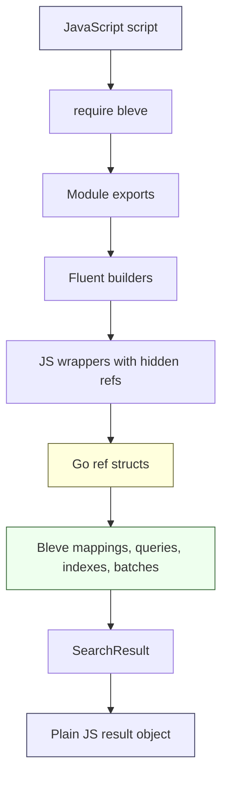

# Goja Bleve: Native Search Bindings for JavaScript RAG Pipelines

`goja-bleve` is a native Go module that exposes Bleve full-text search, vector search, and hybrid score fusion to JavaScript running inside the `goja` runtime. The module is designed for RAG evaluation scripts that need to compose file access, databases, chunking, embeddings, and retrieval logic from JavaScript while keeping the core search objects implemented in Go.

The project started from a precise requirement: use JavaScript as the orchestration language, but do not reduce Bleve's mappings, queries, indexes, batches, and KNN requests to untyped JavaScript maps. The resulting design uses a fluent JavaScript API backed by Go references hidden on wrapper objects. JavaScript receives ergonomic builders; Go retains type safety and calls the real Bleve API.

> [!summary]
> - `goja-bleve` turns Bleve into `require("bleve")` for goja/xgoja scripts.
> - The public API is fluent JavaScript, but the real state lives in Go-backed refs attached to wrappers through a non-enumerable `__bleve_ref` property.
> - Vector search is build-tag-aware: normal builds compile without FAISS, while `-tags=vectors` builds expose Bleve KNN through FAISS-backed vector indexes.
> - The validation strategy combines Go integration tests, vector-tagged FAISS tests, generated xgoja jsverbs, runnable examples, and TypeScript declaration snapshots.

## Why this project exists

The RAG evaluation system already had text and vector retrieval. BM25 used Bleve. Vector retrieval did not. The existing vector path embedded the query, loaded candidate embeddings from SQLite, decoded each embedding into `[]float32`, computed cosine similarity in Go, sorted the results, and truncated the list. Hybrid search ran BM25 and vector retrieval independently, then merged rankings with manual reciprocal-rank fusion.

That architecture works for small evaluation sets. It is also explicit and easy to inspect. Its limitation is that vector retrieval remains a brute-force pass over candidates, and hybrid retrieval exists outside the search engine. Bleve has native vector fields, KNN queries, and score fusion. To use those capabilities from RAG scripts, JavaScript needed a binding layer that could create mappings, index chunks, run BM25, run KNN, and request RRF or RSF in one search request.

The project therefore solves two separate problems:

1. It exposes Bleve's Go API to JavaScript in a way that is usable from RAG scripts.
2. It preserves Go-side correctness for objects that should not be represented as arbitrary JavaScript objects.

A plain JavaScript API could have accepted object literals like `{ type: "match", field: "text" }`. That would have moved validation into a custom conversion layer and created a second query language. `goja-bleve` takes the opposite approach. JavaScript code calls builders, and those builders hold actual Bleve mapping/query/search/index objects underneath.

## The key design decision: wrappers carry Go references

The central implementation pattern is a small object model in `pkg/api_types.go`. Each JavaScript wrapper has a visible `type` field and a hidden Go reference. The visible type is useful for debugging and JSON output. The hidden ref is what makes the object meaningful to Go.

```go
type refKind string

const (
    refKindIndex         refKind = "index"
    refKindMapping       refKind = "mapping"
    refKindFieldBuilder  refKind = "fieldBuilder"
    refKindQuery         refKind = "query"
    refKindSearchRequest refKind = "searchRequest"
    refKindBatch         refKind = "batch"
)

type queryRef struct {
    refBase
    query query.Query
}

type searchRequestRef struct {
    refBase
    request *bleve.SearchRequest
}
```

The wrapper attachment is deliberately non-enumerable and non-JSON-visible:

```go
func (m *moduleRuntime) attachRef(o *goja.Object, ref any) {
    _ = o.Set(hiddenRefKey, ref)
    _ = o.DefineDataProperty(
        hiddenRefKey,
        o.Get(hiddenRefKey),
        goja.FLAG_FALSE, // writable
        goja.FLAG_FALSE, // enumerable
        goja.FLAG_FALSE, // configurable
    )
}
```

The important property is not that the key is hidden for security. It is hidden because the JavaScript object is not the source of truth. The source of truth is the Go value. If a method expects a field mapping, it unwraps a `fieldMappingRef`. If the caller passes a query or a plain object, the API returns a type-specific error instead of attempting to interpret the object dynamically.

```go
func getTypedRef[T any](m *moduleRuntime, v goja.Value, expected string) (*T, error) {
    ref := m.getRef(v)
    if ref == nil {
        return nil, fmt.Errorf("bleve: expected %s wrapper, got value without Go reference", expected)
    }
    typed, ok := ref.(*T)
    if !ok {
        return nil, fmt.Errorf("bleve: expected %s wrapper, got %T", expected, ref)
    }
    return typed, nil
}
```

This gives the API a precise boundary. JavaScript can compose operations fluently, but it cannot forge a mapping, query, index, search request, or batch by assembling a compatible-looking object.

## Architecture overview

The system has four layers:

1. The native module loader installs `require("bleve")` exports into a goja runtime.
2. Builder functions create JavaScript wrappers around Go-backed refs.
3. Terminal operations such as `.build()`, `idx.search(req)`, and `batch.execute()` call the Bleve API.
4. Tests and xgoja jsverbs exercise the same API through both direct Go tests and generated comcache delete {} --repo wesen/2026-03-16--gec-rag --confirmmand binaries.



The data flow for a complete text search is short:

```javascript
const bleve = require("bleve");

const text = bleve.field().text().store(true).build();
const doc = bleve.docMapping().dynamic(false).field("text", text).build();
const mapping = bleve.mapping().defaultMapping(doc).build();
const idx = bleve.memory().mapping(mapping).build();

idx.index("chunk-1", { text: "privacy preserving retrieval" });

const req = bleve.search()
  .query(bleve.match("privacy").field("text"))
  .fields(["text"])
  .build();

const result = idx.search(req);
idx.close();
```

Every value in that sequence is a wrapper around a Go object until the final `result`. The final result is converted to plain JavaScript-friendly data because callers need to inspect it, serialize it, and feed it into downstream reporting.

## The implementation sequence

The implementation was intentionally phased. Each phase added one coherent surface and a matching validation path.

| Phase | What changed | Why it mattered |
|---|---|---|
| 0/1 | Module scaffold, `require("bleve")`, hidden refs, wrapper type checks | Established the object model and type-safety boundary. |
| 2 | Mapping builders and xgoja mapping jsverbs | Made explicit index definitions possible from JavaScript. |
| 3 | Index lifecycle, document indexing, BM25 queries, search request options | Produced the first complete text-search path. |
| 4 | Batch indexing API | Added ingestion ergonomics for chunk corpora. |
| 5 | Vector field mappings and KNN search under `-tags=vectors` | Exposed Bleve's FAISS-backed vector search while keeping normal builds working. |
| 6 | Hybrid RRF/RSF scoring | Let one Bleve request combine text queries and KNN clauses. |
| 7 | Provider integration and minimal TypeScript discovery | Made the module loadable through xgoja provider registries. |
| 8 | Full declarations, examples, quickstart, golden snapshot | Made the API discoverable and reviewable without reading Go source first. |

The sequence matters because each phase established an invariant that later phases depended on. KNN search could be implemented safely because search requests and mappings were already Go-backed wrappers. Hybrid search could be implemented with a small addition because Phase 5 already attached KNN clauses to `bleve.SearchRequest`. TypeScript declarations were useful only after the public surface had stabilized enough to describe it.

## Mapping builders: the first real API surface

Mappings are the first point where the project stops being a module-loading exercise and becomes a search binding. Bleve has index mappings, document mappings, and field mappings. JavaScript gets builders for each layer:

```javascript
const text = bleve.field()
  .text()
  .store(true)
  .includeTermVectors(true)
  .build();

const doc = bleve.docMapping()
  .dynamic(false)
  .field("text", text)
  .build();

const mapping = bleve.mapping()
  .defaultMapping(doc)
  .defaultAnalyzer("standard")
  .build();
```

The field builder mutates a Go `*mapping.FieldMapping`. The document builder unwraps a built field mapping and calls Bleve's mapping API. The index mapping builder validates the final mapping before returning the wrapper.

The decision to expose explicit mapping builders has two consequences:

- Scripts can define repeatable index shapes for RAG chunks instead of relying on dynamic mapping.
- Vector dimensions and field names can be validated against the index mapping before search execution.

That second point becomes important for KNN. A KNN request is built independently from an index, but dimensions are meaningful only relative to a mapped vector field. `goja-bleve` stores the mapping on `indexRef` so `idx.search(req)` can check that a KNN vector has the right length before calling Bleve.

## Queries and search requests

The query API uses a flat module namespace for simple query factories:

```javascript
bleve.match("privacy").field("text")
bleve.matchPhrase("privacy preserving").field("text")
bleve.prefix("priv").field("text")
bleve.bool().addMust(q1).addMustNot(q2)
bleve.conj(q1, q2)
bleve.disj(q1, q2)
```

This design keeps common query construction compact. Complex composition is handled by query wrappers with methods such as `addMust`, `addShould`, and `addMustNot`.

Search requests are separate from queries because Bleve separates the query from request-level concerns: pagination, stored fields, sort order, highlighting, explanations, KNN clauses, and score-fusion parameters.

```javascript
const req = bleve.search()
  .query(bleve.match("privacy").field("text"))
  .size(10)
  .fields(["text", "source"])
  .highlight(["text"])
  .explain(true)
  .build();
```

The search request builder applies options in a controlled order. It creates a `bleve.SearchRequest`, sets ordinary search options, applies score parameters when present, adds highlighting, attaches KNN operator information, and then adds KNN clauses.

```go
request := bleve.NewSearchRequest(queryRefValue.query)
if size > 0 {
    request.Size = size
}
if len(fields) > 0 {
    request.Fields = append([]string(nil), fields...)
}
if score != "" {
    request.Score = score
}
if scoreRankConstant > 0 || scoreWindowSize > 0 {
    request.Params = bleve.NewDefaultParams(request.From, request.Size)
    // apply explicit params and validate
}
```

The validation rule for `scoreWindowSize` is important. Bleve requires the score window to be at least the request size. The builder validates that before returning the built request so scripts fail at construction time rather than during later execution.

## Batch indexing and lifecycle semantics

RAG systems usually index chunks in groups. The batch API exposes Bleve's batch mechanism while adding wrapper-level lifecycle rules:

```javascript
const batch = idx.newBatch();
batch.index("chunk-1", { text: "first chunk" });
batch.index("chunk-2", { text: "second chunk" });
batch.execute();
```

The batch wrapper tracks the owning index, the underlying Bleve batch, an operation count, and whether the batch has already executed.

```go
type batchRef struct {
    refBase
    index     *indexRef
    batch     *bleve.Batch
    executed  bool
    operation int
}
```

The chosen lifecycle rule is single-use after execution. After `execute()` succeeds, mutation and reset fail with `bleve: batch has already been executed`. This avoids ambiguity about whether a batch should retain operations, clear operations, or become reusable with a fresh underlying Bleve batch. The rule is simple to test and simple for scripts to follow.

## Vector support: build-tag-safe by construction

Bleve vector search is not always available. It requires Bleve's `vectors` build tag and FAISS libraries. The main risk was accidentally referencing vector-only Bleve symbols in normal builds. That would make `go test ./...` fail for every host that does not have FAISS installed.

The solution is a pair of build-tagged helper files:

```go
// vector_api.go
//go:build !vectors

func newVectorFieldMapping(_ int, _ bool) (*mapping.FieldMapping, error) {
    return nil, fmt.Errorf("bleve: vector fields require building the host with -tags=vectors")
}

func addKNNToSearchRequest(_ *bleve.SearchRequest, _ string, _ []float32, _ int64, _ float64) error {
    return fmt.Errorf("bleve: KNN search requires building the host with -tags=vectors")
}
```

```go
// vector_api_vectors.go
//go:build vectors

func newVectorFieldMapping(dims int, base64 bool) (*mapping.FieldMapping, error) {
    if dims <= 0 {
        return nil, fmt.Errorf("bleve: vector dims must be positive")
    }
    var field *mapping.FieldMapping
    if base64 {
        field = bleve.NewVectorBase64FieldMapping()
    } else {
        field = bleve.NewVectorFieldMapping()
    }
    field.Dims = dims
    return field, nil
}

func addKNNToSearchRequest(request *bleve.SearchRequest, field string, vector []float32, k int64, boost float64) error {
    request.AddKNN(field, vector, k, boost)
    return nil
}
```

The JavaScript API exists in both builds. The behavior differs at runtime:

- In a non-vector build, calling `.vector(...)` or `.knn(...)` returns a clear error.
- In a vector build, those methods call Bleve's vector constructors and KNN request methods.

This is the right failure mode for scripts. A script can detect `bleve.vectorSupport`; it can also attempt a vector operation and receive a specific build-tag error.

### FAISS setup

The vector work depended on building the `blevesearch/faiss` fork at commit `fff814d`. The local FAISS setup had two important details:

- Bleve needed headers that were missing from the existing system FAISS install.
- The FAISS C API headers use relative include paths that are easiest to satisfy through a proper `make install` into `/usr/local`.

The validated vector build pattern became:

```bash
GOWORK=off CGO_LDFLAGS="-L/usr/local/lib -lfaiss_c -lfaiss -lstdc++ -lm" \
  go test -tags=vectors -ldflags "-r /usr/local/lib" ./pkg -count=1
```

The generated xgoja vector binary uses the same assumptions and has its own `xgoja-vectors.yaml` spec.

## KNN request validation

A KNN search clause contains a field name, query vector, `k`, and optional boost:

```javascript
const req = bleve.search()
  .query(bleve.matchNone())
  .knn("embedding", [1, 0, 0, 0], 2, 1.0)
  .build();
```

The wrapper validates what it can at builder time:

- the field name is non-empty,
- `k` is positive,
- the boost is positive,
- every vector element is finite.

The wrapper validates field existence and dimensions at search time because that is when the request and index mapping are both available:

```go
func validateKNNAgainstIndexMapping(indexMapping *mapping.IndexMappingImpl, request *bleve.SearchRequest) error {
    if indexMapping == nil || request == nil {
        return nil
    }
    for _, knn := range request.KNN {
        fieldMapping := indexMapping.FieldMappingForPath(knn.Field)
        if fieldMapping.Type == "" {
            return fmt.Errorf("bleve: kNN field %q is not mapped", knn.Field)
        }
        if fieldMapping.Dims > 0 && len(knn.Vector) != fieldMapping.Dims {
            return fmt.Errorf("bleve: kNN vector dimension mismatch for field %q: got %d, want %d", knn.Field, len(knn.Vector), fieldMapping.Dims)
        }
    }
    return nil
}
```

This wrapper-level check was added after a test showed that a tiny mismatched-dimension search did not fail directly through Bleve in the expected way. The binding should give JavaScript users a clear error at the boundary it controls.

## Hybrid search: one request instead of two retrieval calls

The current RAG evaluation service has a manual hybrid path in `2026-05-27--rag-evaluation-system/internal/services/search/hybrid.go`. It runs BM25 and vector retrieval independently, merges candidates by chunk id, and adds `1/(rrfK + rank)` for each source.

`goja-bleve` exposes Bleve-native fusion instead:

```javascript
const hybrid = bleve.search()
  .query(bleve.match("privacy").field("text"))
  .knn("embedding", [1, 0, 0, 0], 10, 1.0)
  .score("rrf")
  .scoreRankConstant(60)
  .scoreWindowSize(50)
  .build();
```

The difference is structural. Manual RRF has two result lists and one merge step outside the engine. Bleve-native fusion has one search request with a text query, one or more KNN clauses, and request-level fusion parameters. Bleve runs the search and returns the fused result.

| Concern | Current rag-eval manual RRF | `goja-bleve` Bleve-native fusion |
|---|---|---|
| Text search | Separate service call | Query inside one `SearchRequest` |
| Vector search | Separate service call over stored embeddings | KNN clauses inside one `SearchRequest` |
| Fusion | Manual merge by `ChunkID` | Bleve RRF/RSF rescoring |
| Component visibility | Explicit `RetrievalResult.Components` | Depends on Bleve result/explanation fields |
| Pagination/windowing | Implemented by service limits | Controlled by Bleve request size/from/window |
| Vector scalability | Brute-force over loaded candidates | FAISS-backed vector indexes under `-tags=vectors` |

The manual path remains useful when component columns are the primary output. The Bleve-native path is better when the script wants a single engine-level retrieval request.

## xgoja validation as an implementation discipline

The project did not rely only on Go unit tests. Each major surface also gained a generated xgoja jsverb. This matters because the generated binary exercises the provider registration, module mounting, embedded JavaScript scripts, and command runtime together.

Examples:

```bash
./dist/goja-bleve mapping build-basic --output json
./dist/goja-bleve search compound --output json
./dist/goja-bleve batch index-and-search privacy --output json
./dist/goja-bleve-vectors vector knn --output json
./dist/goja-bleve-vectors vector hybrid --output json
```

The vector jsverb returns a simple ranking for a small corpus:

```json
[
  {
    "id": "chunk-1",
    "rank": 1,
    "score": 1,
    "text": "alpha",
    "total": 2,
    "vectorSupport": true
  },
  {
    "id": "chunk-3",
    "rank": 2,
    "score": 0.9938837289810181,
    "text": "gamma",
    "total": 2,
    "vectorSupport": true
  }
]
```

The hybrid jsverb returns fused RRF scores:

```json
[
  {
    "id": "chunk-1",
    "rank": 1,
    "score": 0.8333333333333333,
    "scoreMode": "rrf",
    "text": "alpha",
    "total": 2,
    "vectorSupport": true
  },
  {
    "id": "chunk-3",
    "rank": 2,
    "score": 0.5,
    "scoreMode": "rrf",
    "text": "gamma",
    "total": 2,
    "vectorSupport": true
  }
]
```

These smoke tests are small by design. Their purpose is not to benchmark relevance. Their purpose is to prove that the generated runtime path can load the module, create mappings, build indexes, issue requests, and return usable JavaScript values.

## Provider integration and declarations

The module supports two host integration paths.

Direct registration with a `require.Registry`:

```go
vm := goja.New()
reg := require.NewRegistry()
bleve.Register(reg)
reg.Enable(vm)
```

xgoja provider registration:

```go
registry := providerapi.NewRegistry()
err := bleveprovider.Register(registry)
```

The provider package id is `goja-bleve`; the JavaScript module name is `bleve`. The generated xgoja spec mounts it with:

```yaml
packages:
  - id: goja-bleve
    import: github.com/go-go-golems/goja-bleve/pkg/xgoja/providers/bleve
runtimes:
  main:
    modules:
      - package: goja-bleve
        name: bleve
        as: bleve
```

Phase 8 added a `modules.TypeScriptDeclarer` implementation and a golden snapshot test. The declarations cover builders, indexes, batches, search results, KNN, and hybrid scoring. The snapshot file is `pkg/testdata/bleve.d.ts.golden`.

This creates a concrete review surface for future API changes. If a method changes, the declaration snapshot must change. That is useful even when the declarations are not perfect, because it turns API drift into a visible diff.

## What Phase 9 is actually important for

Phase 9 is not another feature phase. It is the point where the project changes from a validated prototype into a module that can be embedded safely in long-running hosts and used on larger corpora. Not every Phase 9 item has the same importance. The critical items are the ones that protect host applications from resource leaks, unsafe filesystem access, and unbounded inputs.

The most important Phase 9 work is:

1. **Lifecycle and concurrency tests.** Indexes hold resources. Scripts can close indexes. Searches may be running. The module needs tests for repeated initialization, close-after-use, close-while-idle, and possibly close-during-search behavior. The immediate goal is not to invent a complex concurrency model; it is to prove the current lifecycle rules fail clearly.

2. **Path-safety policy.** The public API has `bleve.create(path)` and `bleve.open(path)`. That is fine for local experiments, but host applications may need sandboxing. Phase 9 should decide whether `goja-bleve` stays unrestricted and documents that policy, or whether provider-level configuration introduces allowed roots.

3. **Memory-safety checks.** JavaScript can pass large arrays to `.knn(...)` and large documents to `.index(...)` or `batch.index(...)`. The module should define practical limits or at least benchmarks and clear failure behavior for large vectors and large batches.

4. **Benchmarks for conversion and ingestion.** Vector conversion from JS array-like values to `[]float32` is on the hot path for KNN queries. Batch throughput and indexing throughput are also important for RAG workloads. Benchmarks should measure these paths before optimizing them.

5. **CI split between normal and vector builds.** Normal builds should always run. Vector/FAISS builds require system libraries and may need a gated CI job. The important invariant is that non-vector builds must not regress because of vector-only symbols.

The less urgent Phase 9 work is anything that would add new API surface before these safety checks exist. For example, adding more KNN tuning parameters may be useful later, but path policy, lifecycle behavior, and memory limits are more important for hosts that execute untrusted or semi-trusted scripts.

A reasonable Phase 9 order is:

```text
1. Add lifecycle tests around close/search/repeated runtime initialization.
2. Add explicit path policy documentation and decide whether provider config is needed.
3. Add vector conversion and batch/indexing benchmarks.
4. Add size-limit tests or guardrails for oversized vectors and batches.
5. Add CI jobs: non-vector default, vector/FAISS optional or gated.
```

This order keeps the project focused on correctness under host use before performance tuning and before expanding the API further.

## What was tricky

Several implementation details were not obvious at the start.

### The FAISS build had to match Bleve

Bleve's vector build depends on a particular FAISS fork and header layout. The system had an older FAISS install, but it lacked headers required by `go-faiss`. Building `blevesearch/faiss@fff814d` and installing it under `/usr/local` solved the header and library layout issues. The successful vector test pattern then became part of the module's README and quickstart.

### In-memory indexes did not validate KNN the way the persisted path did

The first vector test used `bleve.memory()`. It returned no KNN hits. Switching to a persisted index created with `bleve.create(tempPath)` matched the FAISS-backed path already validated in the standalone experiment. Vector tests now use persisted temp indexes for KNN.

### Score breakdowns are not guaranteed

The hybrid RRF implementation initially expected fused score details to appear as `scoreBreakdown`. The smoke result did not expose that field. The wrapper preserves score breakdowns when present, but tests assert fused ranking and score ordering rather than requiring a breakdown for every fused result.

### TypeScript declarations describe the API, not every runtime condition

The TypeScript descriptor includes vector methods because they are part of the JavaScript API. In a non-vector binary, those methods still exist but return runtime errors when invoked. That is a precise representation of the module surface, but it means TypeScript cannot by itself prove that a host was built with `-tags=vectors`.

## Important files

| File | Why it matters |
|---|---|
| `/home/manuel/workspaces/2026-05-27/rag-evaluation-system/goja-bleve/pkg/module.go` | Native module registration, exports, TypeScript descriptor. |
| `/home/manuel/workspaces/2026-05-27/rag-evaluation-system/goja-bleve/pkg/api_types.go` | Wrapper refs, hidden `__bleve_ref`, typed-ref enforcement. |
| `/home/manuel/workspaces/2026-05-27/rag-evaluation-system/goja-bleve/pkg/api_mapping.go` | Mapping, document mapping, and field mapping builders. |
| `/home/manuel/workspaces/2026-05-27/rag-evaluation-system/goja-bleve/pkg/api_index.go` | Index creation/open/memory modes, indexing, deletion, search, lifecycle. |
| `/home/manuel/workspaces/2026-05-27/rag-evaluation-system/goja-bleve/pkg/api_search.go` | Search request builder, BM25 options, KNN clauses, RRF/RSF params. |
| `/home/manuel/workspaces/2026-05-27/rag-evaluation-system/goja-bleve/pkg/vector_api.go` | Non-vector stubs and clear unavailable errors. |
| `/home/manuel/workspaces/2026-05-27/rag-evaluation-system/goja-bleve/pkg/vector_api_vectors.go` | Vector-only Bleve constructors, KNN request attachment, KNN validation. |
| `/home/manuel/workspaces/2026-05-27/rag-evaluation-system/goja-bleve/cmd/goja-bleve/jsverbs/vector.js` | Generated-runtime KNN and hybrid smoke tests. |
| `/home/manuel/workspaces/2026-05-27/rag-evaluation-system/goja-bleve/docs/quickstart.md` | User-facing quickstart for text, batch, vector, and hybrid flows. |
| `/home/manuel/workspaces/2026-05-27/rag-evaluation-system/goja-bleve/pkg/testdata/bleve.d.ts.golden` | Reviewable TypeScript declaration snapshot. |

## Validation record

The implementation was repeatedly validated with the following commands:

```bash
go test ./... -count=1
GOWORK=off go test ./... -count=1
GOWORK=off CGO_LDFLAGS="-L/usr/local/lib -lfaiss_c -lfaiss -lstdc++ -lm" \
  go test -tags=vectors -ldflags "-r /usr/local/lib" ./pkg -count=1
```

Generated runtime checks used:

```bash
cd cmd/goja-bleve
./dist/goja-bleve mapping build-basic --output json
./dist/goja-bleve search compound --output json
./dist/goja-bleve batch index-and-search privacy --output json
./dist/goja-bleve-vectors vector knn --output json
./dist/goja-bleve-vectors vector hybrid --output json
```

Example scripts were validated through generated runtimes:

```bash
./dist/goja-bleve run ../../examples/text-search.js
./dist/goja-bleve run ../../examples/batch-indexing.js
./dist/goja-bleve-vectors run ../../examples/vector-knn.js
./dist/goja-bleve-vectors run ../../examples/hybrid-rrf.js
```

## Current status

The module is complete through Phase 8. It supports mappings, BM25 search, batch indexing, vector KNN, hybrid RRF/RSF, provider registration, TypeScript declarations, quickstart docs, and runnable examples. The remaining work is production hardening, not basic capability development.

The next practical step is Phase 9. The most important Phase 9 deliverables are lifecycle tests, path-safety policy, memory guardrails, benchmarks, and CI coverage. Those items determine whether the module is safe to embed in hosts that run arbitrary RAG scripts over real corpora.

## Key points

- The important architectural choice is Go-backed wrappers. They make the JavaScript API fluent without turning Bleve objects into untyped JavaScript dictionaries.
- Vector support is build-tag-safe. Normal builds work without FAISS, and vector builds enable the Bleve KNN path explicitly.
- Hybrid search is implemented as one Bleve search request, not as a JavaScript-side merge of two retrieval calls.
- xgoja jsverbs are part of the validation strategy because they test the generated runtime path, not just the Go package.
- Phase 9 matters because host safety, lifecycle behavior, and input bounds become visible only after the feature surface exists.
