# Building a Query Tool with xgoja

xgoja is a code generator that reads a declarative YAML buildspec and produces a Go binary embedding a goja JavaScript runtime, a set of native Go modules exposed to that runtime, and optionally a bundle of JS verbs that become CLI commands. This article explains how xgoja works by building a real tool: diary-db, which parses investigation diaries into SQLite and exposes them as queryable CLI commands.

The target audience is someone who already writes Go and JavaScript and wants to understand how xgoja wires them together at the binary level—what contracts exist between the YAML buildspec, the Go modules, the JS verb scanner, and the resulting CLI surface. Several of those contracts are not documented in the public help pages and are only discoverable by reading build failures or the Go implementation source.

> [!summary]
> - xgoja is a declarative buildspec-to-binary generator, not a framework you program against directly.
> - The buildspec (`xgoja.yaml`) selects module packages, declares runtime modules with typed configs, and attaches embedded JS files as Glazed CLI verbs.
> - JS verbs must obey a scanner-enforced rule: `__verb__("name", ...)` requires a JS function named exactly `name`. The docs do not mention this.
> - The `db` module must be configured with `allowConfigure: true` in the buildspec, or `db.configure()` throws at runtime in the generated binary.
> - A working jsverb command is the intersection of four constraints: buildspec module wiring, scanner name matching, Glazed field-to-parameter positional mapping, and runtime module API behavior.

## Why this note exists

The diary-db tool was built to solve a specific problem: investigation diaries contain rich structured sections (What I Did, What Worked, What Didn't Work, What I Learned, What Was Tricky, etc.) that are useful for cross-project analysis, but they are written as Markdown prose. Converting them into rows in SQLite makes them queryable. The tool needed to:

1. Parse Markdown and YAML frontmatter at the JS level.
2. Execute SQL against a local SQLite file from JS.
3. Present the results as a CLI with named commands (verbs), output format flags, and help.

Rather than write a custom Go CLI, the implementation was expressed as a buildspec plus ~250 lines of JavaScript. The Go binary that results embeds the JS, the SQL driver, the Markdown parser, and the help pages. This is a textbook xgoja use case: the Go layer provides native capabilities (SQLite, file IO, path manipulation), and the JS layer expresses the application logic.

## The buildspec as the single source of truth

The entire binary is defined by `xgoja.yaml`. Here is the one used for diary-db, with annotations explaining every section:

```yaml
name: diary-db              # Used in help and version output
appName: diary-db           # The generated binary filename
target:
  kind: xgoja               # xgoja, not a generic Go binary
  output: dist/diary-db     # Output path, resolved from spec directory

# Provider packages. These are Go packages that export xgoja providers.
# The `replace` field swaps a published package for a local checkout.
packages:
  - id: goja-text
    import: github.com/go-go-golems/goja-text/pkg/xgoja/providers/text
    replace: /home/manuel/code/wesen/go-go-golems/goja-text
  - id: go-go-goja-core
    import: github.com/go-go-golems/go-go-goja/pkg/xgoja/providers/core
  - id: go-go-goja-host
    import: github.com/go-go-golems/go-go-goja/pkg/xgoja/providers/host

# Runtime module selection. Each entry declares which Go module is exposed
# to the JS runtime under a specific require() name, and optionally with
# typed configuration that the module reads at startup.
runtimes:
  main:
    modules:
      - package: goja-text
        name: extract
        as: extract
      - package: goja-text
        name: markdown
        as: markdown
      - package: goja-text
        name: sanitize
        as: sanitize
      - package: go-go-goja-core
        name: yaml
        as: yaml
      - package: go-go-goja-core
        name: path
        as: path
      - package: go-go-goja-host
        name: fs
        as: fs
        config:
          allow: true
      - package: go-go-goja-host
        name: database
        as: db
        config:
          allowConfigure: true
```

The `name` field under each module entry is the provider's internal module identifier. The `as` field is the string passed to `require()` in JavaScript. The `config` object is provider-specific. For `database`, the only recognized key is `allowConfigure`. If it is missing or set to anything else, the generated binary will refuse `db.configure()` at runtime.

This is the first contract that is not documented in the help pages: the exact config schema for each module provider. The `goja-repl help db-module` page describes the runtime API (`configure`, `exec`, `query`) but does not specify the buildtime `allowConfigure` flag needed to enable that API in an xgoja binary.

```yaml
commands:
  eval:      { enabled: true, runtime: main }         # diary-db eval <script.js>
  run:       { enabled: true, runtime: main }         # diary-db run <script.js>
  repl:      { enabled: true, runtime: main }          # diary-db repl
  jsverbs:   { enabled: true, runtime: main, mount: root }
```

The `jsverbs` command is what turns JS functions into CLI verbs. `mount: root` means the verbs appear directly under the root command (`diary-db <verb>`), not under a subcommand.

```yaml
jsverbs:
  - id: diary-db-verbs
    path: ./jsverbs
    embed: true              # Embed the JS into the binary at build time

help:
  sources:
    - id: diary-db-docs
      path: ./docs/help
      embed: true
```

`embed: true` is critical: it copies the JS files and help markdown into the binary using Go embed, so the binary does not need external files at runtime. Without this, the binary would look for `./jsverbs` relative to its execution directory.

## Module selection and what each provides

The diary-db tool uses seven modules:

| Module | Provider | JS require | What it provides |
|--------|----------|-----------|------------------|
| extract | goja-text | `require("extract")` | Frontmatter detection, candidate extraction, YAML candidate validation with sanitization |
| markdown | goja-text | `require("markdown")` | Goldmark-based Markdown AST parsing and heading extraction |
| sanitize | goja-text | `require("sanitize")` | JSON/XML-like data repair, used internally by extract |
| yaml | go-go-goja-core | `require("yaml")` | YAML parsing and stringifying: `yaml.parse()`, `yaml.stringify()` |
| path | go-go-goja-core | `require("path")` | Path manipulation: `path.dirname()`, `path.basename()`, `path.join()` |
| fs | go-go-goja-host | `require("fs")` | File I/O: `fs.readFileSync()`, `fs.writeFileSync()` |
| db | go-go-goja-host | `require("db")` | SQLite: `db.configure()`, `db.exec()`, `db.query()`, `db.close()` |

The dependency graph is shallow. `extract` delegates to `sanitize` internally, but the JS code only imports `extract` directly. `markdown` is self-contained. `db` is the only module that requires buildspec configuration (`allowConfigure: true`).

## Jsverbs: from function to CLI command

The diary-db application logic lives in `jsverbs/diary.js`. A jsverb is a JavaScript function decorated with metadata that the xgoja scanner reads at build time. The scanner turns each decorated function into a Cobra CLI command backed by Glazed, which provides flags, argument parsing, and output formatting (table, JSON, CSV, markdown).

### The anatomy of a jsverb

This is the simplest complete verb in diary-db, `what-failed`, which queries all "What didn't work" sections across imported diaries:

```javascript
function whatFailed(dbPath) {
  initDB(dbPath || "diary.db");
  return db.query(`
    SELECT s.content, st.step_number, st.step_title, d.title as diary_title, d.source
    FROM sections s
    JOIN steps st ON s.step_id = st.id
    JOIN diaries d ON st.diary_id = d.id
    WHERE s.section_name = 'what didnt work'
      AND s.content IS NOT NULL AND s.content != ''
    ORDER BY d.id, st.step_number
  `);
}

__verb__("whatFailed", {
  short: "Show all 'What didn't work' sections across diaries",
  fields: {
    dbPath: { type: "string", default: "diary.db", help: "SQLite database path" },
  },
});
```

The `__verb__` call attaches metadata to the function. The `fields` object declares CLI flags. The `type` maps to Glazed field types (`string`, `int`, `bool`). The `default` provides the value used when the flag is omitted. The CLI framework generates `--dbPath diary.db` from this description.

When the user runs `./dist/diary-db diary what-failed --dbPath diary.db`, the framework:

1. Parses `--dbPath diary.db`.
2. Calls `whatFailed("diary.db")`.
3. Takes the return value (an array of row objects) and formats it as a table by default, or as JSON/CSV/markdown if `--output` is specified.

### The hidden rule: verb name must match function name

The scanner reads the JS source file as text. It looks for `__verb__("name", ...)` calls and then checks whether there is a function declaration named `name` in the same file. If the names do not match exactly, the build fails with:

```
scan embedded jsverb source diary-db-verbs: diary.js references unknown function "importChangelog"
```

This rule is not described in any of the public help pages (`xgoja help buildspec-reference`, `goja-repl help jsverbs-example-reference`, or `xgoja help --all`). The error message is accurate once you understand the scanner's behavior, but it gives no hint that the fix is a name match, not a missing declaration.

The consequence: you cannot have a verb named `list` whose function is called `listDiaries`. You must rename one to match the other. During the diary-db build, the following mismatches were encountered in sequence:

- `import` is a JS keyword → renamed to `importDiary`
- `list` → `listDiaries` mismatch → renamed function to `listDiaries` and verb to `listDiaries`
- `sections` → `querySections` mismatch → renamed both to `querySections`
- `search` → `searchSections` mismatch → renamed both to `searchSections`

### The second hidden rule: CLI fields map to function parameters positionally

The `fields` object in `__verb__` is not just for the user interface. It also determines the order in which values are passed to the function. If the function signature is `function importDiary(file, dbPath, force)`, the fields must declare `file`, then `dbPath`, then `force`, in that order.

If the field names do not match the parameter names, or if their order differs, the CLI framework may pass arguments in the wrong positions, or emit an error about unknown flags. This is a Glazed mapping contract, not a scanner contract, so failures appear at CLI execution time rather than build time.

## The parser: line-based extraction over AST walking

The diary parser has two responsibilities: find step boundaries from `## Step N:` headings, and extract `### Section Name` subsections within each step.

The initial approach used full AST walking: parse the Markdown into a node tree, walk the tree to find headings, and extract text between sibling nodes. This failed because:

- The Markdown AST does not expose content boundaries cleanly as "all text between node A and node B."
- Heading nodes have `StartLine` and `EndLine` fields, but extracting content by navigating AST siblings is fragile: the text between two headings is not always a contiguous sequence of sibling text nodes, especially when lists, code blocks, or nested elements intervene.

The working approach is hybrid:

1. Use `markdown.parse()` and `markdown.walk()` to find headings, because the AST correctly gives line numbers for each heading.
2. Convert those line numbers into ranges on the raw text array (`content.split("\n")`).
3. Scan the line array directly for `### ` headings within each step's line range.
4. Collect lines until the next `### ` or `## ` heading.

This works because Markdown headings are single-line. A `### Section Name` is guaranteed to be exactly one line. The content after it is all subsequent lines until the next heading boundary.

```javascript
const ast = markdown.parse(content);
const lines = content.split("\n");

const stepHeadings = [];
markdown.walk(ast, (node) => {
  if (node.Type !== "heading") return;
  const text = markdown.textContent(node).trim();
  const stepMatch = text.match(/^Step\s+(\d+)\s*[:\-—–]/i);
  if (stepMatch) {
    stepHeadings.push({
      line: node.StartLine,
      stepNumber: parseInt(stepMatch[1], 10),
      stepTitle: text.replace(/^Step\s+\d+\s*[:\-—–]\s*/i, "").trim(),
    });
  }
});

// Line-based scan within each step's range — the key insight
for (const step of steps) {
  const startIdx = step.startLine;  // 1-indexed from AST
  const endIdx = step.endLine;

  for (let i = startIdx; i <= endIdx && i <= lines.length; i++) {
    const line = lines[i - 1];  // convert to 0-indexed
    if (!line || !line.startsWith("### ")) continue;
    // ... extract and normalize heading, collect content lines
  }
}
```

The conversion between 1-indexed AST line numbers and 0-indexed JavaScript array access is a small but persistent source of off-by-one errors. Every usage of `lines[i - 1]` carries this invariant.

## Database schema and module behavior

The `db` module is the sqlite3 driver with a thin JS wrapper. Its behavior differs in important ways from a typical Node.js `sqlite3` package:

- `db.configure("sqlite3", path)` must be called exactly once before any query or exec. It is not a constructor; it configures a pre-existing module instance.
- `db.exec(sql, ...params)` returns an object with `lastInsertId` on INSERT statements. SELECT via exec returns `{ changes: N }`, not rows.
- `db.query(sql, ...params)` returns an array of plain objects (one per row). It only works with SELECT.
- The module uses `?` placeholder syntax for parameter binding.

The `initDB` helper in diary-db creates tables and indexes on first access:

```sql
CREATE TABLE IF NOT EXISTS diaries (
  id INTEGER PRIMARY KEY AUTOINCREMENT,
  source TEXT NOT NULL,
  title TEXT,
  status TEXT,
  topics TEXT,
  imported_at TEXT DEFAULT (datetime('now'))
);

CREATE TABLE IF NOT EXISTS steps (
  id INTEGER PRIMARY KEY AUTOINCREMENT,
  diary_id INTEGER NOT NULL,
  step_number INTEGER NOT NULL,
  step_title TEXT,
  start_line INTEGER,
  source TEXT,
  FOREIGN KEY (diary_id) REFERENCES diaries(id)
);

CREATE TABLE IF NOT EXISTS sections (
  id INTEGER PRIMARY KEY AUTOINCREMENT,
  step_id INTEGER NOT NULL,
  section_name TEXT NOT NULL,
  content TEXT,
  FOREIGN KEY (step_id) REFERENCES steps(id)
);
```

The schema is intentionally flat. There is no normalization beyond the foreign key relationships. The goal is read-heavy queryability, not mutation-heavy transactional integrity.

## Build and validation workflow

The iteration loop for xgoja binaries is four commands:

```bash
# 1. Validate the buildspec without building
xgoja doctor -f xgoja.yaml

# 2. Build the binary with local package replacements
xgoja build -f xgoja.yaml --xgoja-replace /home/manuel/code/wesen/go-go-golems/go-go-goja

# 3. List verbs to verify they were discovered
./dist/diary-db diary verbs

# 4. Import a diary and verify the database
./dist/diary-db diary import-diary path/to/diary.md --dbPath diary.db --force
```

The `doctor` command tells you whether the buildspec is well-formed. It does not guarantee the JS is correct, but it does validate that the `replace` path exists, the jsverb directory is readable, the help path is present, and the module names resolve.

The `build` command generates Go source in a temporary workspace, compiles it, and produces the output binary. The `--xgoja-replace` flag is specific to the xgoja tool itself and overrides the package import path with a local directory.

## The import flow

When a user runs `import-diary`, the following happens:

1. `db.configure()` is called with the target SQLite path.
2. `initDB()` creates tables if they do not exist.
3. If the file already exists in `diaries.source`, and `force` is not set, the import is skipped.
4. The file is read with `fs.readFileSync()`.
5. `extract.frontmatter()` finds YAML candidates.
6. `extract.validate()` checks YAML validity and returns a `Sanitized` string.
7. `yaml.parse()` turns the sanitized YAML into a JS object.
8. `markdown.parse()` and `markdown.walk()` find step headings and their line numbers.
9. Line-based scanning extracts `### ` sections within each step's range.
10. `db.exec()` inserts the diary row, then steps, then sections, referencing the IDs from previous inserts.
11. `db.close()` is called and the statistics are returned.

The returned object is consumed by Glazed and formatted as a table by default:

| field | value |
|-------|-------|
| imported | true |
| source | path/to/diary.md |
| diary_id | 1 |
| title | Diary |
| steps | 5 |
| sections | 41 |

The `lastInsertId` returned by `db.exec()` is essential for building linked data. The JS code inserts a diary row, receives the auto-generated ID, then uses that ID as a foreign key for steps and sections.

## Testing the tool on itself

The real validation is using the tool on its own construction diary. After building:

```bash
./dist/diary-db diary import-diary \
  ../reference/01-diary.md \
  --dbPath diary.db --force
```

Result: 5 steps, 41 sections extracted.

Querying what went wrong:

```bash
./dist/diary-db diary what-failed --dbPath diary.db
```

This returns all `What didn't work` entries from the tool's own construction, including the AST-walking failure, the `__verb__` name mismatch errors, and the preconfigured DB misconfiguration.

This reflexive quality is the strongest validation of the tool: it turns the narrative text that described its own difficulties into structured rows that can be searched and formatted.

## Common failure modes

### "scan embedded jsverb source: references unknown function 'name'"

Cause: `__verb__("name", ...)` does not have a matching `function name(...)` declaration.  
Fix: rename either the verb string or the function to match exactly. The scanner does not support aliases.

### "database module is already preconfigured, so the .configure() method is not available"

Cause: the buildspec has `config: { allow: true }` for the `database` module instead of `config: { allowConfigure: true }`. The former preconfigures a default in-memory database.  
Fix: change `allow: true` to `allowConfigure: true` in `runtimes.main.modules[].config` for the database module.

### Positional argument mismatch at runtime

Cause: the `fields` declaration order in `__verb__` does not match the function parameter order.  
Fix: ensure field declaration order matches function signature positionally. The first declared field maps to the first parameter.

### 0 sections imported

Cause: the Markdown heading levels are not `## ` for steps and `### ` for sections.  
Fix: ensure the input follows the diary convention. The current parser only handles exactly those levels.

## Architecture diagram

```mermaid
flowchart TD
    subgraph Build["Build Time"]
        A[xgoja.yaml] --> B[Go code generator]
        C[jsverbs/diary.js] --> B
        D[docs/help/*.md] --> B
        E[Module providers<br/>goja-text, go-go-goja-core, go-go-goja-host] --> B
        B --> F[dist/diary-db<br/>Go binary with embedded JS]
    end

    subgraph Runtime["Runtime"]
        G[CLI command<br/>diary-db diary what-failed] --> H[Glazed flag parser]
        H --> I[JS verb dispatcher]
        I --> J[goja runtime]
        J --> K[Go modules]
        K --> L[SQLite]
        K --> M[Markdown parser]
        K --> N[YAML parser]
        K --> O[File system]
    end

    F --> G
    style A fill:#2d4a22,stroke:#4a7c3f
    style F fill:#2d4a22,stroke:#4a7c3f
    style L fill:#1a3a5c,stroke:#3a7cbd
```



The important architectural property is that Go modules are not dynamically loaded at runtime. They are selected at build time from the buildspec, compiled into the binary, and exposed to the JS runtime through `require()`. This means the binary is self-contained: no external JS files, no shared libraries, no runtime package resolution.

## Update queue from the research logbook

Several documentation gaps were discovered during implementation and recorded in the research logbook. They are reproduced here as a public update queue:

| Area | Needed update | Priority |
|------|---------------|----------|
| xgoja jsverbs docs | State that `__verb__` name must match function name exactly | High |
| goja-repl db module docs | Add xgoja YAML example with `allowConfigure: true` | High |
| goja-text extract docs | Add frontmatter + yaml.parse() example | Medium |
| goja-text markdown docs/examples | Add heading-range section extraction example | Medium |
| glazed help authoring skill | Mention xgoja `help.sources` embedding path | Low |

## Related notes

- [[DAILY-CHANGELOG-2026-06-02]] — the docmgr ticket that produced diary-db
- [[ttmp/2026/06/03/DAILY-CHANGELOG-2026-06-02--daily-changelog-report-for-2026-06-02/scripts/04-web-server.py]] — retro web browser for the same data
- [[xgoja help buildspec-reference]] — official buildspec field reference
- [[goja-repl help db-module]] — database module runtime API
- [[goja-text help goja-text-extract-api-reference]] — extract module API
