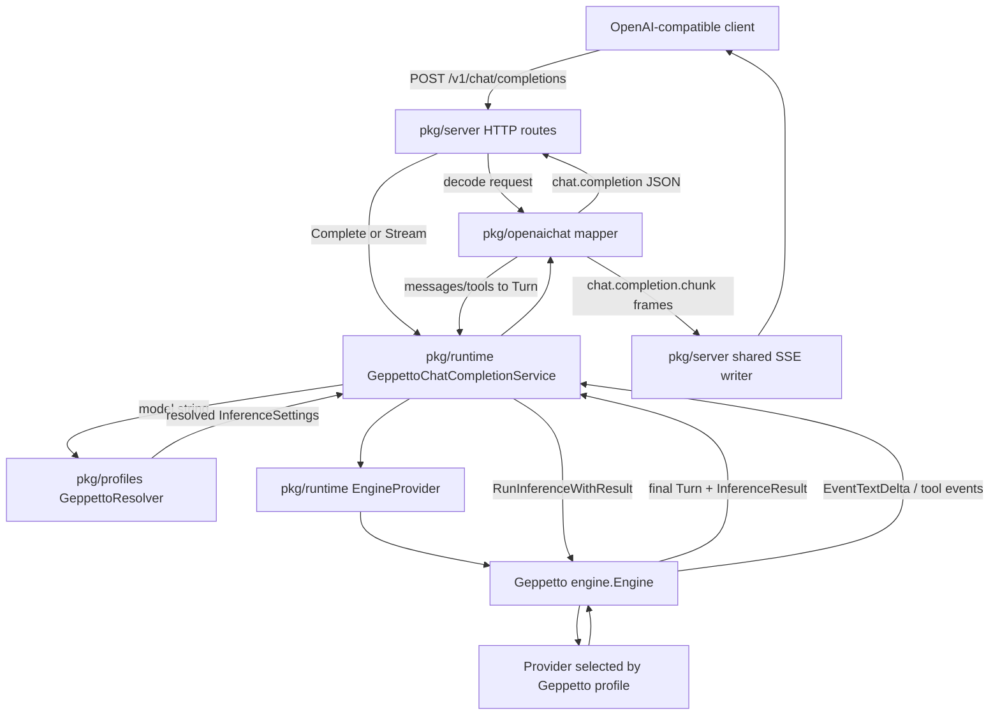
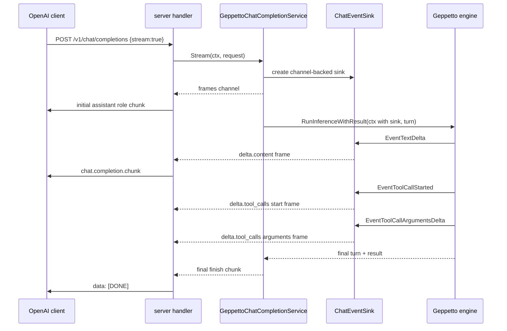
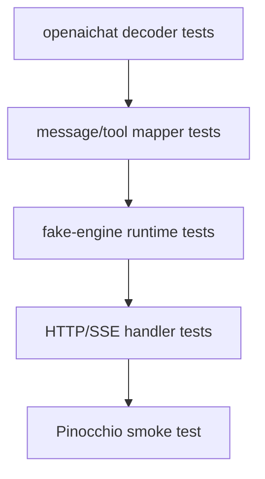

# LLM Proxy: Chat Completions, Tool Calls, and Pinocchio Smoke Test Technical Report

This report explains the current `llm-proxy` prototype after the addition of `POST /v1/chat/completions`, OpenAI function-tool shapes, streaming chat chunks, and a real smoke test through Pinocchio. The code lives at `/home/manuel/workspaces/2026-06-04/llm-proxy/llm-proxy`. The project now exposes two OpenAI-compatible endpoint families backed by Geppetto engine profiles: legacy Completions and Chat Completions.

The central design rule remains unchanged: the OpenAI `model` field is a Geppetto profile slug. The proxy does not own provider credentials, provider model aliases, or provider-specific setup. It resolves the profile slug through Geppetto profile YAML, creates a Geppetto engine from the resolved settings, runs inference through `engine.RunInferenceWithResult`, and maps Geppetto turns and events back into OpenAI-compatible JSON or SSE.

> [!summary]
> - `/v1/chat/completions` is implemented as a sibling endpoint to `/v1/completions`, not as a replacement.
> - Chat messages map to Geppetto turn blocks; OpenAI function tools map to Geppetto per-turn tool definitions and tool config.
> - Streaming chat uses Geppetto events: text deltas become `delta.content`, and tool-call events become `delta.tool_calls`.
> - Pinocchio successfully called the proxy as an OpenAI-compatible Chat Completions provider with `pinocchio code unix --profile llm-proxy-groq-oss-20b ...`.
> - The proxy supports the client-driven tool loop but does not execute arbitrary client tools itself.

## 1. Why this report exists

The first project report described the Completions-first prototype: `POST /v1/completions`, profile slug resolution, Geppetto inference, text-completion responses, and text-completion streaming. That endpoint is useful for clients that still speak the legacy prompt-to-text API, but most modern OpenAI-compatible clients use Chat Completions. Pinocchio's OpenAI-compatible provider path is one of those clients.

This report captures the second important implementation step. The proxy now accepts role-tagged chat messages, function tool definitions, assistant tool calls, and tool-result messages. It can stream visible assistant text and tool-call argument chunks. It has also been tested through Pinocchio itself, which exposed a compatibility bug in the original strict request decoder. The final smoke test passed through the full path:

```text
Pinocchio command
  -> Pinocchio OpenAI-compatible Chat Completions client
  -> llm-proxy /v1/chat/completions
  -> Geppetto profile resolver
  -> Geppetto engine for upstream profile slug
  -> upstream provider
  -> Geppetto events and final turn
  -> OpenAI-compatible streaming response
  -> Pinocchio stdout
```

The result was the exact requested output:

```text
llm-proxy chat smoke ok
```

## 2. Current implementation status

The repository branch contains the Chat Completions and smoke-test work in these recent commits:

| Commit | Purpose |
|---|---|
| `5fcb9e7` | Added the Chat Completions design document and ticket tasks. |
| `3f80038` | Added the initial `pkg/openaichat` wire and mapper package. |
| `8583723` | Implemented `/v1/chat/completions`, function tools, tool-call mapping, streaming, examples, and tests. |
| `304ef18` | Recorded the Chat Completions implementation commit in the diary. |
| `c9284d1` | Smoke-tested Chat Completions through Pinocchio and relaxed decoding for compatibility fields. |
| `d5fd9fe` | Recorded the Pinocchio smoke-test commit in the diary. |

The validation commands passed after the Pinocchio compatibility fix:

```bash
cd /home/manuel/workspaces/2026-06-04/llm-proxy/llm-proxy
go test ./... -count=1
GOWORK=off go test ./... -count=1
docmgr doctor --ticket 2026-06-04-llm-proxy-openai-compatible-geppetto-proxy --stale-after 30
```

The working tree still has untracked docmgr scaffolding under `ttmp/.docmgrignore`, `ttmp/_guidelines/`, and `ttmp/_templates/`. Those files existed before this report work and are not part of the committed implementation.

## 3. Project shape after Chat Completions

The endpoint implementation is split across packages with narrow responsibilities.

```text
llm-proxy/
  cmd/
    llm-proxy-server/
      main.go
  pkg/
    openaicompletions/
      types.go
      mapper.go
      stream.go
    openaichat/
      types.go
      mapper.go
      stream.go
      *_test.go
    profiles/
      resolver.go
    runtime/
      engine_provider.go
      completion_service.go
      chat_service.go
      *_test.go
    server/
      server.go
      errors.go
      sse.go
      server_test.go
  examples/
    README.md
```

`pkg/openaichat` is the new protocol package. It owns the supported OpenAI Chat Completions request and response subset, validation, message-to-turn mapping, generated-turn-to-response mapping, and streaming frame constructors. `pkg/runtime/chat_service.go` owns Geppetto execution for chat requests. `pkg/server/server.go` owns the HTTP route and chooses JSON or SSE output based on `stream`.

The server executable wires the same resolver into both endpoint families:

```go
if *profiles != "" {
    resolver, err := profilespkg.NewYAMLResolver(*profiles)
    if err != nil {
        log.Fatalf("load profiles: %v", err)
    }
    modelLister = profileModelLister{resolver: resolver}
    completionService = &runtimepkg.GeppettoCompletionService{Profiles: resolver}
    chatCompletionService = &runtimepkg.GeppettoChatCompletionService{Profiles: resolver}
}
```

This keeps the endpoint expansion small. Adding Chat Completions did not require a new provider abstraction. It required a new mapper and a new service that use the same profile and engine seams.

## 4. System architecture

The proxy has three boundaries: the OpenAI-compatible HTTP boundary, the Geppetto profile/runtime boundary, and the provider boundary owned by Geppetto.



The important property is that provider execution is not reimplemented in the proxy. If a Geppetto profile selects Groq through OpenAI-compatible Chat Completions, the proxy creates that Geppetto engine. If a profile selects Claude, the proxy creates the Claude engine. The proxy does not know provider request fields except for the OpenAI-compatible public surface it exposes to clients.

## 5. The Chat Completions request subset

The request type in `pkg/openaichat/types.go` includes the fields required for text chat, client-driven tool loops, streaming, and a small set of parsed-but-not-yet-applied sampling options.

```go
type ChatCompletionRequest struct {
    Model       string          `json:"model"`
    Messages    []ChatMessage   `json:"messages"`
    Tools       []ChatTool      `json:"tools,omitempty"`
    ToolChoice  json.RawMessage `json:"tool_choice,omitempty"`
    MaxTokens   *int            `json:"max_tokens,omitempty"`
    Temperature *float64        `json:"temperature,omitempty"`
    TopP        *float64        `json:"top_p,omitempty"`
    Stop        json.RawMessage `json:"stop,omitempty"`
    Stream      bool            `json:"stream,omitempty"`
}
```

The decoder now deliberately does **not** call `DisallowUnknownFields`. Pinocchio sends standard OpenAI fields such as `n`, `presence_penalty`, and `frequency_penalty`. The first smoke test through Pinocchio failed because those fields were not present in the initial struct. For this endpoint, accepting unknown fields is more useful than strict rejection. Unsupported compatibility fields are ignored until a future mapping pass implements them.

The regression test records that behavior:

```go
func TestDecodeChatCompletionAllowsUnknownCompatibilityFields(t *testing.T) {
    req, err := DecodeChatCompletionRequest(strings.NewReader(
        `{"model":"sonnet","messages":[{"role":"user","content":"hello"}],"n":1,"presence_penalty":0,"frequency_penalty":0}`,
    ))
    if err != nil {
        t.Fatalf("DecodeChatCompletionRequest error: %v", err)
    }
    if req.Model != "sonnet" {
        t.Fatalf("model = %q", req.Model)
    }
}
```

The validator remains strict about fields that affect the semantic shape of the turn. It requires `model`, requires at least one message, rejects unsupported roles, rejects multimodal content arrays, requires `tool_call_id` for `role: "tool"`, and requires assistant tool calls to have an ID, `type: "function"`, a function name, and arguments.

## 6. Message-to-turn mapping

Chat Completions is an ordered message API. Geppetto inference receives a `turns.Turn`, which is an ordered list of blocks plus metadata and typed turn data. The mapper converts each supported OpenAI message into one or more Geppetto blocks.

| OpenAI chat shape | Geppetto representation |
|---|---|
| `system` message | `turns.NewSystemTextBlock(content)` |
| `developer` message | `turns.NewSystemTextBlock(content)` |
| `user` message | `turns.NewUserTextBlock(content)` |
| `assistant` text | `turns.NewAssistantTextBlock(content)` |
| `assistant.tool_calls[]` | `turns.NewToolCallBlock(id, name, arguments)` |
| `tool` message | `turns.NewToolUseBlock(tool_call_id, content)` |
| request `tools[]` | `engine.KeyToolDefinitions` on `Turn.Data` |
| request `tool_choice` | `engine.KeyToolConfig` on `Turn.Data` |

The core mapper loop in `pkg/openaichat/mapper.go` shows the conversion directly:

```go
for i, msg := range req.Messages {
    if err := msg.Validate(i); err != nil {
        return nil, err
    }
    switch msg.Role {
    case "system", "developer":
        text, _ := msg.ContentString()
        turns.AppendBlock(t, turns.NewSystemTextBlock(text))
    case "user":
        text, _ := msg.ContentString()
        turns.AppendBlock(t, turns.NewUserTextBlock(text))
    case "assistant":
        if len(msg.Content) != 0 && string(msg.Content) != "null" {
            text, _ := msg.ContentString()
            if text != "" {
                turns.AppendBlock(t, turns.NewAssistantTextBlock(text))
            }
        }
        for _, tc := range msg.ToolCalls {
            turns.AppendBlock(t, turns.NewToolCallBlock(tc.ID, tc.Function.Name, tc.Function.Arguments))
        }
    case "tool":
        text, _ := msg.ContentString()
        turns.AppendBlock(t, turns.NewToolUseBlock(msg.ToolCallID, text))
    }
}
```

The mapping preserves order. That matters because a tool result is only meaningful relative to a previous assistant tool call. The proxy does not reorder messages or infer missing tool calls.

## 7. Function-tool advertisement

OpenAI Chat Completions represents tools as request-level schema declarations. Geppetto represents advertised tools as typed turn data. The proxy maps each OpenAI function tool into a `ToolDefinitionSnapshot` and writes the collection to `engine.KeyToolDefinitions`.

```go
defs := make(geppettoengine.ToolDefinitions, 0, len(req.Tools))
for i, tool := range req.Tools {
    if err := tool.Validate(i); err != nil {
        return err
    }
    defs = append(defs, geppettoengine.ToolDefinitionSnapshot{
        Name:        tool.Function.Name,
        Description: tool.Function.Description,
        Parameters:  tool.Function.Parameters,
    })
}
if err := geppettoengine.KeyToolDefinitions.Set(&t.Data, defs); err != nil {
    return fmt.Errorf("attach tool definitions: %w", err)
}
```

The proxy also writes a `ToolConfig`. The current implementation supports `auto`, `none`, and `required`. A specific OpenAI function choice object currently maps to `required`; it does not yet constrain the allowed tool set to one named function.

```go
cfg := geppettoengine.ToolConfig{Enabled: true, ToolChoice: geppettoengine.ToolChoiceAuto}
if choice, ok, err := parseToolChoice(req.ToolChoice); err != nil {
    return err
} else if ok {
    cfg.ToolChoice = choice
    if choice == geppettoengine.ToolChoiceNone {
        cfg.Enabled = false
    }
}
```

This is sufficient for the common client-driven tool loop:

1. The client sends tool schemas in `tools`.
2. The model returns assistant `tool_calls`.
3. The client executes those tools outside the proxy.
4. The client sends tool results back as `role: "tool"` messages.
5. The model uses the tool results to continue generation.

The proxy does not execute arbitrary client tools. That boundary is important for security and for protocol clarity. Tool execution requires a registry, permissions, resource limits, timeout policy, and audit model. Those are not part of this prototype.

## 8. Running Geppetto inference

The runtime service in `pkg/runtime/chat_service.go` follows the same sequence as the Completions service.

```go
profile, err := s.Profiles.ResolveProfile(ctx, req.Model)
eng, err := engines.EngineForProfile(ctx, profile)
turn, err := s.Mapper.RequestToTurn(req)
preBlockCount := len(turn.Blocks)
out, result, err := geppettoengine.RunInferenceWithResult(ctx, eng, turn)
return s.Mapper.TurnToChatCompletion(req, out, result, preBlockCount)
```

The `preBlockCount` value is the boundary between input blocks and generated blocks. Without that boundary, the response mapper could accidentally include prompt messages, previous assistant messages, or tool results in the output. With the boundary, the mapper only inspects blocks appended by the inference run.

Generated assistant text and generated tool calls are collected separately:

```go
text := generatedAssistantText(out, preBlockCount)
toolCalls := generatedToolCalls(out, preBlockCount)
```

The response is a standard `chat.completion` object with one assistant message:

```go
ChatCompletionResponse{
    Object: "chat.completion",
    Model:  req.Model,
    Choices: []ChatChoice{{
        Index: 0,
        Message: ChatMessageOut{
            Role:      "assistant",
            Content:   text,
            ToolCalls: toolCalls,
        },
        FinishReason: finishReason(result, len(toolCalls) > 0),
    }},
    Usage: usageFromResult(result),
}
```

If generated tool-call blocks exist, the finish reason is `tool_calls`. If Geppetto reports truncation or max-token termination, the finish reason is `length`. Otherwise the finish reason is `stop`.

## 9. Streaming Chat Completions

The streaming path uses Geppetto event sinks. The HTTP handler owns `http.ResponseWriter`; the inference goroutine emits typed frames on a channel. This avoids concurrent writes to the response writer.



The event sink recognizes four event types:

| Geppetto event | OpenAI stream chunk |
|---|---|
| `EventTextDelta` | `choices[0].delta.content` |
| `EventToolCallStarted` | `choices[0].delta.tool_calls[index].id`, `.type`, and `.function.name` |
| `EventToolCallArgumentsDelta` | `choices[0].delta.tool_calls[index].function.arguments` |
| `EventToolCallRequested` | fallback full-argument chunk |

Tool-call streaming requires stable indexes. OpenAI streaming chunks refer to tool calls by integer index. Geppetto events refer to tool calls by ID. The sink keeps a small map from tool-call ID to index:

```go
func (s *ChatEventSink) toolIndex(toolCallID string) int {
    s.mu.Lock()
    defer s.mu.Unlock()
    if s.toolIndexes == nil {
        s.toolIndexes = map[string]int{}
    }
    if idx, ok := s.toolIndexes[toolCallID]; ok {
        return idx
    }
    idx := len(s.toolIndexes)
    s.toolIndexes[toolCallID] = idx
    return idx
}
```

This is one of the most important details in the streaming implementation. Without a stable index, the client could not reconstruct streamed tool arguments correctly.

## 10. The shared SSE writer

Completions and Chat Completions have different chunk shapes, but the mechanics of SSE writing are the same. `pkg/server/sse.go` now uses a small `sseFrameSource` interface so both endpoints can share flushing, error frames, and `[DONE]` handling.

```go
type sseFrameSource interface {
    Next() (any, error, bool, bool)
}
```

The writer performs these steps in order:

1. Verify that the response writer supports `http.Flusher`.
2. Set `Content-Type: text/event-stream`.
3. Read frames until the request context is canceled, the channel closes, or a done frame arrives.
4. Marshal each chunk as JSON and emit it as `data: <json>\n\n`.
5. Emit an OpenAI-style error object if the runtime sends an error frame.
6. Emit `data: [DONE]\n\n` at stream termination.

The endpoint-specific code decides what a chunk means. The shared writer only knows how to serialize frames safely.

## 11. Pinocchio smoke test

The Pinocchio smoke test was the first end-to-end test with a real OpenAI-compatible Chat Completions client. It required a Pinocchio profile whose OpenAI-compatible base URL pointed at the proxy and whose engine was the proxy model slug.

The final working command was:

```bash
pinocchio --log-level debug code unix \
  --profile llm-proxy-groq-oss-20b \
  --non-interactive \
  --output text \
  "Reply with exactly: llm-proxy chat smoke ok"
```

The successful stdout was:

```text
llm-proxy chat smoke ok
```

The smoke profile used this interpretation:

| Pinocchio field | Meaning |
|---|---|
| `openai-base-url` | HTTPS URL ending in `/v1`, forwarded to the local proxy. |
| `chat.api_type` | `openai`, so Pinocchio uses its OpenAI-compatible Chat Completions path. |
| `chat.engine` | `groq-oss-20b`, which is the model slug sent to the proxy. |
| Proxy `model` | `groq-oss-20b`, resolved by the proxy as a Geppetto profile slug. |

The test uncovered three issues:

1. Pinocchio rejects plain HTTP provider URLs. The first attempt with `http://127.0.0.1:18080/v1` failed with `invalid chat completion URL: http scheme is not allowed` before reaching the proxy.
2. Pinocchio sends standard OpenAI fields beyond the proxy's initial strict struct. The proxy rejected `n` until the decoder was relaxed.
3. Some profiles that work under normal Pinocchio execution need explicit provider-specific settings when loaded through this proxy path. The successful smoke used the `groq-oss-20b` profile after adding explicit client/provider settings in the local Pinocchio profile file.

A temporary ngrok HTTPS tunnel was used only to satisfy Geppetto's outbound URL validation in Pinocchio's provider client. The tunnel and local proxy process were stopped after the smoke test because the prototype has no authentication.

## 12. Testing strategy

The unit tests use fake profile resolvers and fake engines. This keeps protocol mapping and server behavior testable without live provider credentials.

The runtime tests cover four important cases:

| Test | Behavior protected |
|---|---|
| `TestGeppettoChatCompletionServiceComplete` | A generated assistant text block becomes a Chat Completions assistant message. |
| `TestGeppettoChatCompletionServiceCompleteToolCall` | A generated Geppetto tool-call block becomes OpenAI assistant `tool_calls` with `finish_reason: "tool_calls"`. |
| `TestGeppettoChatCompletionServiceStream` | `EventTextDelta` events become streamed `delta.content` chunks and final `stop`. |
| `TestGeppettoChatCompletionServiceStreamToolCall` | Geppetto tool-call events become streamed `delta.tool_calls` chunks and final `tool_calls`. |

The server tests cover route-level behavior: placeholder chat responses, bad requests, SSE text chunks, and SSE tool-call chunks. The decoder tests cover required fields, unsupported content arrays, unsupported roles, and the Pinocchio compatibility fields.

The result is a layered test suite:



Each layer tests one boundary. The Pinocchio smoke test then verifies that those boundaries compose under a real client.

## 13. Important limitations

The proxy is now useful for basic text chat and client-driven function tool loops, but it is not complete OpenAI API compatibility.

| Area | Current behavior | Implication |
|---|---|---|
| Unknown Chat fields | Ignored by the decoder. | Pinocchio compatibility improves, but unsupported fields may be silently ignored. |
| Request overrides | `max_tokens`, `temperature`, `top_p`, and `stop` are parsed but not applied. | Profile defaults still determine provider behavior. |
| `n` | Accepted as an unknown field but not implemented. | Multiple choices are not generated. |
| Penalties | Accepted as unknown fields but not implemented. | Frequency/presence penalty requests have no effect. |
| Tool execution | Not performed by the proxy. | Clients must execute tools and send `role: "tool"` messages. |
| Specific `tool_choice` object | Mapped coarsely to required tool use. | The proxy does not yet enforce one named function. |
| Multimodal content | Content arrays are rejected. | Text-only chat is supported; image/audio/file parts are deferred. |
| Reasoning streams | Not exposed as a separate standard Chat Completions channel. | Visible text and tool-call streams work; private reasoning should wait for Responses or a deliberate extension. |
| Local smoke URL | Pinocchio rejects plain HTTP provider URLs. | Repeated smoke tests need local HTTPS, a dev allowlist, or a temporary tunnel. |
| Auth | None. | The prototype should not be exposed publicly except during controlled smoke tests. |

The decoder compatibility change is a deliberate tradeoff. Strict validation catches unsupported fields early, but real OpenAI-compatible clients send many optional fields. The current endpoint should be permissive about fields it can safely ignore and strict about message shapes that would change the turn semantics.

## 14. How to run the current prototype

Start the server with a Geppetto profile YAML file:

```bash
cd /home/manuel/workspaces/2026-06-04/llm-proxy/llm-proxy
go run ./cmd/llm-proxy-server \
  --profiles ./examples/profiles.yaml \
  --listen 127.0.0.1:8080
```

List profile slugs as models:

```bash
curl -sS http://127.0.0.1:8080/v1/models | jq .
```

Call non-streaming Chat Completions:

```bash
curl -sS http://127.0.0.1:8080/v1/chat/completions \
  -H 'Content-Type: application/json' \
  -d '{
    "model": "sonnet",
    "messages": [
      {"role": "system", "content": "Answer in one sentence."},
      {"role": "user", "content": "What does an event sink do?"}
    ],
    "stream": false
  }' | jq .
```

Call streaming Chat Completions:

```bash
curl -N http://127.0.0.1:8080/v1/chat/completions \
  -H 'Content-Type: application/json' \
  -d '{
    "model": "sonnet",
    "messages": [
      {"role": "user", "content": "Write a short greeting."}
    ],
    "stream": true
  }'
```

Advertise a function tool:

```bash
curl -sS http://127.0.0.1:8080/v1/chat/completions \
  -H 'Content-Type: application/json' \
  -d '{
    "model": "sonnet",
    "messages": [
      {"role": "user", "content": "Look up order 123 and summarize it."}
    ],
    "tools": [
      {
        "type": "function",
        "function": {
          "name": "lookup_order",
          "description": "Look up an order by id.",
          "parameters": {
            "type": "object",
            "properties": {
              "order_id": {"type": "string"}
            },
            "required": ["order_id"]
          }
        }
      }
    ],
    "tool_choice": "auto"
  }' | jq .
```

If the assistant returns a tool call, the client sends the tool result back in the next request:

```json
{
  "role": "tool",
  "tool_call_id": "call_1",
  "content": "{\"status\":\"shipped\"}"
}
```

## 15. Design decisions worth preserving

### 15.1 Keep provider setup in Geppetto profiles

The proxy should not grow provider credential maps or provider-specific config files unless a future requirement forces that change. Profile YAML is already the source of provider truth for Geppetto. The proxy's job is to resolve a profile slug and run the engine.

### 15.2 Keep endpoint mappers separate

`pkg/openaicompletions` and `pkg/openaichat` are separate packages. This avoids turning one mapper into a mixed protocol layer. The two endpoints share runtime seams, not wire structs.

### 15.3 Keep tool execution out of the proxy

The proxy maps tool declarations and tool-call messages. It does not execute tools. This keeps the security boundary small and allows existing OpenAI-compatible clients to keep their normal tool loop.

### 15.4 Let the handler own response writing

Streaming inference runs in a goroutine, but only the HTTP handler writes to the client. The runtime service sends frames through channels. This rule should be preserved for every future streaming endpoint.

### 15.5 Prefer compatibility on harmless fields

The Pinocchio smoke test showed that strict unknown-field rejection is too brittle for Chat Completions. The proxy should reject unsupported shapes that would change semantics, but tolerate common optional fields until they are implemented.

## 16. Near-term engineering plan

The highest-value next work is compatibility hardening around real clients.

1. **Map request overrides.** Apply `temperature`, `top_p`, `max_tokens`, `stop`, penalties, and max-completion-token aliases through Geppetto per-turn inference config where possible.
2. **Add better error classification.** Unknown profile should become a model-not-found response rather than a generic server error. Provider configuration failures should be distinguishable from upstream inference failures.
3. **Build a safer local Pinocchio smoke harness.** Replace ngrok with local HTTPS, an explicit dev allowlist, or an authenticated reverse proxy so repeated smoke tests do not require a public tunnel.
4. **Smoke-test tool calls against a live provider.** The fake-engine tests prove mapping, but a provider smoke test should confirm actual event sequences and whether `EventToolCallRequested` duplicates argument deltas.
5. **Implement specific `tool_choice` constraints.** A request selecting one function should constrain allowed tools instead of mapping only to `required`.
6. **Decide how to expose reasoning.** Chat Completions has no clean standard private reasoning channel. Responses remains the better long-term target for reasoning-aware streams.
7. **Remove or ignore old template artifacts.** `cmd/XXX` still appears in package listings and should be cleaned up once the prototype structure stabilizes.

## 17. Review guide

Start review with the protocol package:

- `/home/manuel/workspaces/2026-06-04/llm-proxy/llm-proxy/pkg/openaichat/types.go`
- `/home/manuel/workspaces/2026-06-04/llm-proxy/llm-proxy/pkg/openaichat/mapper.go`
- `/home/manuel/workspaces/2026-06-04/llm-proxy/llm-proxy/pkg/openaichat/stream.go`

Then review runtime and server wiring:

- `/home/manuel/workspaces/2026-06-04/llm-proxy/llm-proxy/pkg/runtime/chat_service.go`
- `/home/manuel/workspaces/2026-06-04/llm-proxy/llm-proxy/pkg/server/server.go`
- `/home/manuel/workspaces/2026-06-04/llm-proxy/llm-proxy/pkg/server/sse.go`
- `/home/manuel/workspaces/2026-06-04/llm-proxy/llm-proxy/cmd/llm-proxy-server/main.go`

Use these tests as the primary local verification target:

```bash
cd /home/manuel/workspaces/2026-06-04/llm-proxy/llm-proxy
go test ./... -count=1
GOWORK=off go test ./... -count=1
```

Use the diary for implementation history and exact failure traces:

- `/home/manuel/workspaces/2026-06-04/llm-proxy/llm-proxy/ttmp/2026/06/04/2026-06-04-llm-proxy-openai-compatible-geppetto-proxy--openai-compatible-llm-proxy-backed-by-geppetto/reference/01-investigation-diary.md`

## 18. Related notes and artifacts

- Previous Obsidian report: [[ARTICLE - LLM Proxy - Geppetto Engine OpenAI Completions Prototype Deep Dive]]
- Current Chat Completions design doc: `/home/manuel/workspaces/2026-06-04/llm-proxy/llm-proxy/ttmp/2026/06/04/2026-06-04-llm-proxy-openai-compatible-geppetto-proxy--openai-compatible-llm-proxy-backed-by-geppetto/design-doc/04-simple-geppetto-engine-openai-chat-completions-proxy-prototype.md`
- Current diary: `/home/manuel/workspaces/2026-06-04/llm-proxy/llm-proxy/ttmp/2026/06/04/2026-06-04-llm-proxy-openai-compatible-geppetto-proxy--openai-compatible-llm-proxy-backed-by-geppetto/reference/01-investigation-diary.md`
- Examples and Pinocchio smoke notes: `/home/manuel/workspaces/2026-06-04/llm-proxy/llm-proxy/examples/README.md`
- Deferred Responses design: `/home/manuel/workspaces/2026-06-04/llm-proxy/llm-proxy/ttmp/2026/06/04/2026-06-04-llm-proxy-openai-compatible-geppetto-proxy--openai-compatible-llm-proxy-backed-by-geppetto/design-doc/02-simple-geppetto-engine-openai-responses-proxy-prototype.md`
