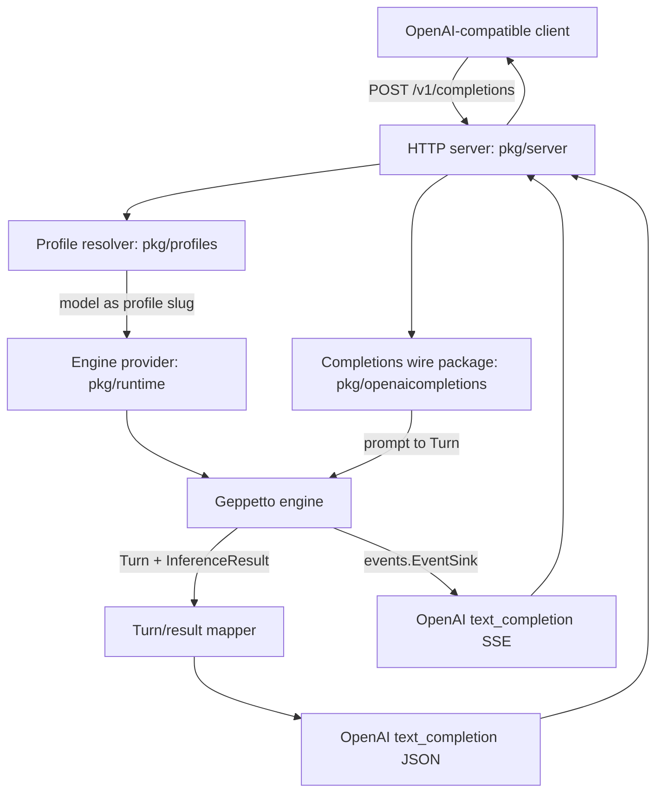
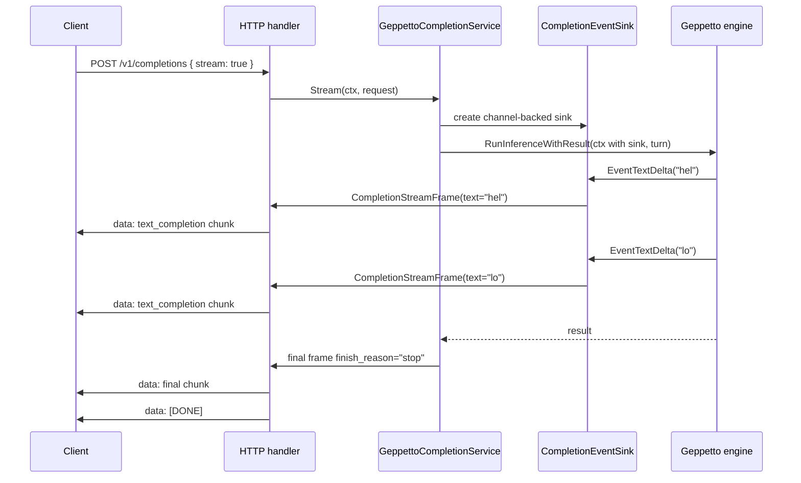

# LLM Proxy: Geppetto Engine OpenAI Completions Prototype Deep Dive

This report explains the first working `llm-proxy` prototype: a Go server that exposes the legacy OpenAI Completions endpoint and runs inference through Geppetto profiles and engines. The project deliberately starts with `/v1/completions`, not `/v1/responses`, because the first useful bridge is a smaller contract: a client sends a text prompt, selects a model by name, and receives generated text. In this prototype, the model name is a Geppetto engine profile slug.

The implementation lives in `/home/manuel/workspaces/2026-06-04/llm-proxy/llm-proxy`. The ticket documentation lives under `ttmp/2026/06/04/2026-06-04-llm-proxy-openai-compatible-geppetto-proxy--openai-compatible-llm-proxy-backed-by-geppetto`. The most important implementation design is `design-doc/03-simple-geppetto-engine-openai-completions-proxy-prototype.md`; the earlier Responses design is preserved as a later phase, not as the current implementation target.

> [!summary]
> - The prototype exposes `POST /v1/completions`, `GET /v1/models`, and `GET /healthz`.
> - The Completions `model` field is interpreted as a Geppetto `EngineProfileSlug`; provider setup is supplied by Geppetto profile YAML.
> - Non-streaming requests run through `engine.RunInferenceWithResult`; streaming requests attach a Geppetto `events.EventSink` and convert text deltas into OpenAI `text_completion` SSE chunks.
> - The code is split into small packages: wire types in `pkg/openaicompletions`, HTTP mechanics in `pkg/server`, profile lookup in `pkg/profiles`, and Geppetto runtime execution in `pkg/runtime`.
> - The current implementation is a prototype. It intentionally defers request override mapping, broad OpenAI field compatibility, stronger error classification, and `/v1/responses` support.

## 1. Why this project exists

The project exists to make Geppetto-managed inference accessible through an OpenAI-compatible HTTP surface. Many clients can speak OpenAI APIs, but provider setup inside this workspace already belongs to Geppetto: profiles specify provider type, provider model, credentials, base URLs, sampling defaults, and token limits. The proxy should not duplicate that provider setup. It should translate between a client-facing API shape and Geppetto's internal inference boundary.

The first scope correction was important. An early design proposed direct provider adapters: OpenAI Chat, OpenAI Responses, and Anthropic Messages would each have proxy-owned request and stream translation code. That design was too broad for the first prototype. The better first step is to run Geppetto's inference engine directly and translate only the proxy boundary. That keeps provider behavior in Geppetto and makes the proxy responsible for a smaller, testable contract.

The second scope correction narrowed the exposed API from OpenAI Responses to legacy OpenAI Completions. This removed Responses input item arrays, output item types, reasoning items, and response lifecycle events from the first implementation. The remaining core contract is direct:

```text
OpenAI Completions request
  model:  profile slug
  prompt: text
        ↓
Geppetto profile resolver
        ↓
Geppetto engine factory
        ↓
Geppetto RunInferenceWithResult
        ↓
OpenAI text_completion response or stream chunks
```

This shape is small enough to validate the architecture before adding more protocol coverage.

## 2. Current project status

The prototype has been implemented and committed in phase-sized commits. The repository branch contains these relevant commits:

| Commit | Purpose |
|---|---|
| `01e0f9a` | Planned detailed `/v1/completions` phases in the ticket. |
| `9b6295a` | Added the server skeleton and Completions wire types. |
| `160440d` | Added Geppetto profile resolution and `/v1/models`. |
| `b83912b` | Added non-streaming Geppetto-backed Completions execution. |
| `efd1b73` | Added streaming Completions from Geppetto events. |
| `18e26c0` | Added examples and validation notes. |
| `eb45070` | Recorded final prototype validation in the diary. |
| `4e16bd2` | Added a research logbook for resource currency and update tracking. |

The final validation passed with both workspace and module-local modes:

```bash
cd /home/manuel/workspaces/2026-06-04/llm-proxy/llm-proxy
go test ./... -count=1
GOWORK=off go test ./... -count=1
```

The ticket also passes docmgr validation:

```bash
docmgr doctor --ticket 2026-06-04-llm-proxy-openai-compatible-geppetto-proxy --stale-after 30
```

The current code supports a provider-backed run only when the `--profiles` flag points at a valid Geppetto profile YAML file whose profile settings can create a Geppetto engine. Unit tests avoid live providers by using fake engines and fake profile resolvers.

## 3. Project shape

The current implementation is intentionally compact.

```text
llm-proxy/
  cmd/
    llm-proxy-server/
      main.go
  pkg/
    openaicompletions/
      types.go
      mapper.go
      stream.go
      *_test.go
    profiles/
      resolver.go
      resolver_test.go
    runtime/
      engine_provider.go
      completion_service.go
      completion_service_test.go
    server/
      server.go
      errors.go
      sse.go
      server_test.go
  examples/
    README.md
    profiles.yaml
  ttmp/
    2026/06/04/... ticket docs
```

Each package has one responsibility.

| Package | Responsibility |
|---|---|
| `cmd/llm-proxy-server` | Parses flags, loads profile resolver when configured, builds the HTTP server. |
| `pkg/server` | Owns HTTP routing, request body limiting, JSON errors, SSE writing, and handler-level service calls. |
| `pkg/openaicompletions` | Defines the supported OpenAI Completions wire subset and maps between requests, Geppetto turns, final responses, and stream frames. |
| `pkg/profiles` | Wraps Geppetto profile registry loading and resolves request model names as profile slugs. |
| `pkg/runtime` | Connects the profile resolver, engine provider, mapper, and Geppetto inference execution. |
| `examples` | Shows how to run the server and call the prototype endpoints. |

The separation matters because the project is likely to grow. `/v1/responses`, stronger OpenAI compatibility, request override mapping, and auth can be added without putting all decisions in the HTTP handler.

## 4. Architecture

The request path has four technical boundaries: HTTP, profile resolution, engine execution, and response mapping.



The server does not know how Claude, OpenAI Responses, or any future provider is called. It only asks for an engine. The engine comes from Geppetto. That decision removes provider-specific code from the proxy and gives profile YAML the responsibility for provider setup.

### 4.1 The model field is a profile slug

The OpenAI Completions request contains a `model` string. In this prototype, the string is not a provider model name. It is an engine profile slug.

```json
{
  "model": "sonnet",
  "prompt": "Write one sentence about event sinks.",
  "stream": false
}
```

The server resolves `sonnet` through `pkg/profiles.GeppettoResolver`. The resolved profile contains Geppetto `InferenceSettings`; those settings contain the provider API type, provider model, base URL, credential settings, and defaults. The provider model can be `claude-3-5-sonnet-20241022`, `gpt-4o-mini`, or another provider-specific identifier, but the client does not send that provider identifier directly.

This rule is the central simplification. It removes route aliases, provider config, and credential maps from the proxy. Those can be added later behind the profile resolver if needed.

### 4.2 Provider setup belongs to Geppetto profile YAML

The example profile file lives at `examples/profiles.yaml`.

```yaml
slug: default
display_name: Prototype profiles
profiles:
  sonnet:
    slug: sonnet
    display_name: Claude Sonnet through Geppetto
    inference_settings:
      chat:
        api_type: claude
        engine: claude-3-5-sonnet-20241022
        max_response_tokens: 1024
        temperature: 0.2
      api:
        api_keys:
          claude-api-key: ${ANTHROPIC_API_KEY}
        base_urls:
          claude-base-url: https://api.anthropic.com
```

One important detail emerged during smoke testing: Geppetto's current engine profile YAML codec rejects `default_profile_slug`. The first example included this field, and the server failed at startup:

```text
load profiles: validation error (registry.default_profile_slug): engine profile YAML does not support default_profile_slug; use profile slug "default"
```

The example was corrected by removing `default_profile_slug`. This correction is recorded in the diary and research logbook because it is a concrete mismatch between the initial design sketch and the current Geppetto codec.

## 5. The non-streaming command path

The non-streaming path starts in `pkg/server.Server.handleCompletions`. The handler performs HTTP-level work: body limiting, JSON decoding, stream branch selection, service invocation, and JSON response writing. It does not create turns or engines itself.

The core service is `pkg/runtime.GeppettoCompletionService`.

```go
func (s *GeppettoCompletionService) Complete(
    ctx context.Context,
    req *openaicompletions.CompletionRequest,
) (*openaicompletions.CompletionResponse, error) {
    profile, err := s.Profiles.ResolveProfile(ctx, req.Model)
    if err != nil { ... }

    eng, err := engines.EngineForProfile(ctx, profile)
    if err != nil { ... }

    turn, err := s.Mapper.RequestToTurn(req)
    if err != nil { ... }

    preBlockCount := len(turn.Blocks)
    out, result, err := geppettoengine.RunInferenceWithResult(ctx, eng, turn)
    if err != nil { ... }

    return s.Mapper.TurnToCompletion(req, out, result, preBlockCount)
}
```

This sequence is intentionally linear. The request is decoded before profile resolution. The profile is resolved before engine construction. The turn is built before inference. The generated output is extracted only from blocks appended after the prompt block count.

### 5.1 Request decoding

`pkg/openaicompletions.CompletionRequest` is a deliberately small subset of OpenAI Completions.

```go
type CompletionRequest struct {
    Model       string          `json:"model"`
    Prompt      json.RawMessage `json:"prompt"`
    MaxTokens   *int            `json:"max_tokens,omitempty"`
    Temperature *float64        `json:"temperature,omitempty"`
    TopP        *float64        `json:"top_p,omitempty"`
    Stop        json.RawMessage `json:"stop,omitempty"`
    Stream      bool            `json:"stream,omitempty"`
}
```

Phase 1 supports only string prompts. Prompt arrays are rejected explicitly. This is correct for the first bridge because array prompts require either multiple independent engine runs or a more complex batching policy.

```go
func (r *CompletionRequest) PromptString() (string, error) {
    var s string
    if err := json.Unmarshal(r.Prompt, &s); err == nil {
        return s, nil
    }

    var arr []json.RawMessage
    if err := json.Unmarshal(r.Prompt, &arr); err == nil {
        return "", FieldError{
            Field: "prompt",
            Message: "prompt arrays are not supported in this prototype",
            Code: "unsupported_prompt_shape",
        }
    }

    return "", FieldError{
        Field: "prompt",
        Message: "prompt must be a string",
        Code: "unsupported_prompt_shape",
    }
}
```

One review point remains open: the decoder currently uses `DisallowUnknownFields`. That makes tests and semantics clean, but it may reject real OpenAI clients that send harmless optional fields. The research logbook marks the current OpenAI Completions API reference as needing refresh before compatibility hardening.

### 5.2 Prompt-to-turn mapping

The mapper converts the Completions prompt into one Geppetto user text block.

```go
func (Mapper) RequestToTurn(req *CompletionRequest) (*turns.Turn, error) {
    prompt, err := req.PromptString()
    if err != nil { return nil, err }
    if strings.TrimSpace(prompt) == "" { ... }

    t := &turns.Turn{ID: newTurnID()}
    turns.AppendBlock(t, turns.NewUserTextBlock(prompt))
    return t, nil
}
```

This is the smallest valid bridge between a text-completion API and Geppetto's turn representation. The prompt is not converted into a system message, assistant history, or multi-block conversation. It is a user request for one completion.

### 5.3 Running inference

The service uses `engine.RunInferenceWithResult`, not `eng.RunInference` directly. This helper is important because it normalizes metadata. If the engine implements `RunInferenceWithResult`, that result is used. If the engine only appends blocks and stores metadata on the turn, the helper extracts that metadata. If no canonical metadata is available, it synthesizes a minimal result.

The service captures `preBlockCount` before inference. This count is the boundary between input and generated output.

```go
preBlockCount := len(turn.Blocks)
out, result, err := geppettoengine.RunInferenceWithResult(ctx, eng, turn)
```

Without this boundary, the response mapper could accidentally include prompt text in the generated completion. The mapper must only inspect generated blocks.

### 5.4 Turn-to-completion mapping

Generated assistant text is extracted from blocks appended after `preBlockCount`.

```go
func generatedAssistantText(t *turns.Turn, preBlockCount int) string {
    for _, block := range t.Blocks[preBlockCount:] {
        if block.Kind != turns.BlockKindLLMText && block.Role != turns.RoleAssistant {
            continue
        }
        if text, ok := block.Payload[turns.PayloadKeyText].(string); ok {
            builder.WriteString(text)
        }
    }
    return builder.String()
}
```

The response mapper returns the legacy OpenAI `text_completion` shape.

```json
{
  "id": "cmpl_proxy_...",
  "object": "text_completion",
  "created": 1780620000,
  "model": "sonnet",
  "choices": [
    {
      "text": "...",
      "index": 0,
      "logprobs": null,
      "finish_reason": "stop"
    }
  ],
  "usage": {
    "prompt_tokens": 10,
    "completion_tokens": 20,
    "total_tokens": 30
  }
}
```

The response `model` remains the profile slug requested by the client. It does not expose the provider model. That keeps the client-facing namespace consistent with `/v1/models`.

## 6. The streaming path

Streaming is implemented by connecting Geppetto's event-sink mechanism to an OpenAI-style SSE writer. The service does not write to `http.ResponseWriter`. It emits frames on a channel. The HTTP handler owns the response writer.



The stream frame types live in `pkg/openaicompletions/stream.go`.

```go
type CompletionStreamFrame struct {
    Chunk *CompletionStreamChunk
    Err   error
    Done  bool
}
```

The event sink currently translates only text deltas.

```go
func (s *CompletionEventSink) PublishEvent(ev events.Event) error {
    switch e := ev.(type) {
    case *events.EventTextDelta:
        if e.Delta != "" {
            s.Out <- DeltaFrame(s.ID, s.Model, s.Created, e.Delta)
        }
    }
    return nil
}
```

This is the correct first subset for legacy Completions. Reasoning and tool events do not have a natural place in the legacy `text_completion` stream. They can be ignored until the project adds Responses or another endpoint that can represent them.

The final frame is produced after `RunInferenceWithResult` returns. This avoids emitting a final chunk from both `EventTextSegmentFinished` and the final inference result.

```go
frames <- openaicompletions.FinalFrame(id, req.Model, created, completionFinishReason(result))
```

The SSE writer in `pkg/server/sse.go` serializes chunks and appends `[DONE]` when the channel closes or a done frame is received.

```text
data: {"id":"cmpl_proxy_...","object":"text_completion",...}

data: [DONE]
```

The important concurrency invariant is simple: only the HTTP handler goroutine writes to `http.ResponseWriter`. The Geppetto inference goroutine writes to a channel.

## 7. Profile resolution and model listing

The profile resolver wraps Geppetto's profile registry rather than introducing proxy route config.

```go
type ProfileResolver interface {
    ResolveProfile(ctx context.Context, slug string) (*ResolvedProfileRuntime, error)
    ListProfiles(ctx context.Context) ([]ProfileDescriptor, error)
}
```

The concrete YAML resolver loads a Geppetto YAML profile store and constructs a `StoreRegistry` using the loaded registry slug.

```go
func NewYAMLResolver(path string) (*GeppettoResolver, error) {
    store, err := gepprofiles.NewYAMLFileEngineProfileStore(path, "")
    registries, err := store.ListRegistries(context.Background())
    registry, err := gepprofiles.NewStoreRegistry(store, registries[0].Slug)
    return NewGeppettoResolver(registry)
}
```

This is enough for one-file prototype profile loading. The research logbook records one likely future change: switch to the source-chain helper when multiple profile sources or DB-backed stores become necessary.

`GET /v1/models` uses the profile resolver to expose profile slugs as OpenAI model IDs.

```json
{
  "object": "list",
  "data": [
    {"id":"gpt-responses","object":"model","owned_by":"geppetto-profile"},
    {"id":"sonnet","object":"model","owned_by":"geppetto-profile"}
  ]
}
```

This endpoint is also useful for smoke testing because it validates profile YAML loading without requiring provider credentials.

## 8. Testing strategy

The tests are designed around fake dependencies. This is necessary because provider-backed inference requires credentials, network access, and valid profile settings. The core proxy mechanics can be verified without any of those.

### 8.1 Wire tests

`pkg/openaicompletions/types_test.go` verifies:

- string prompt decoding,
- missing model rejection,
- missing prompt rejection,
- prompt array rejection.

These tests define the current supported subset.

### 8.2 Mapper tests

`pkg/openaicompletions/mapper_test.go` verifies:

- a string prompt becomes one user block,
- generated assistant blocks become a concatenated completion text,
- canonical inference usage maps to OpenAI usage.

This test protects the prompt/output boundary.

### 8.3 Profile resolver tests

`pkg/profiles/resolver_test.go` creates a temporary Geppetto YAML profile store, writes a profile, reloads it through the proxy resolver, lists profiles, and resolves a known slug. This test validates the Geppetto YAML path without provider credentials.

### 8.4 Runtime service tests

`pkg/runtime/completion_service_test.go` uses fake engines:

```go
type appendEngine struct{}

func (appendEngine) RunInference(ctx context.Context, t *turns.Turn) (*turns.Turn, error) {
    turns.AppendBlock(t, turns.NewAssistantTextBlock("hello from geppetto"))
    return t, nil
}
```

The streaming fake engine publishes `EventTextDelta` events through `events.PublishEventToContext`. This verifies that the proxy listens to Geppetto events, not to provider streams.

### 8.5 Server tests

`pkg/server/server_test.go` verifies health checks, non-streaming responses, request errors, model listing, and SSE response shape. The streaming server test checks for both a text chunk and `[DONE]`.

## 9. What changed during implementation

The implementation followed the phases in the ticket. Each phase had a commit boundary.

### Phase 1: HTTP and wire shape

Phase 1 added the executable server skeleton and the OpenAI Completions wire subset. The route returned placeholder text. This was intentional because it allowed validation of the HTTP boundary before any Geppetto integration.

### Phase 2: Profile resolution

Phase 2 added `pkg/profiles` and `pkg/runtime.EngineProvider`. It also added `/v1/models`. `go mod tidy` added Geppetto dependencies so the module builds with `GOWORK=off`.

### Phase 3: Non-streaming Geppetto bridge

Phase 3 added the real non-streaming bridge. The server uses `GeppettoCompletionService` when `--profiles` is set. The service resolves the profile, creates the engine, maps prompt to turn, runs inference, and maps generated text to the OpenAI response.

### Phase 4: Streaming bridge

Phase 4 added the channel-backed event sink and SSE writer. It maps `EventTextDelta` to Completions chunks and emits a final finish chunk after inference completes.

### Phase 5: Examples and validation

Phase 5 added `examples/README.md` and `examples/profiles.yaml`. It also ran the local smoke check that discovered the `default_profile_slug` YAML issue.

## 10. Important implementation details

### 10.1 Unknown fields are currently rejected

The decoder uses `DisallowUnknownFields`. This makes the prototype strict. It also means real OpenAI-compatible clients may fail if they send optional fields that the prototype does not model yet.

This should be revisited before broader client compatibility work. A better next version might decode into a struct while preserving unknown fields, reject only fields that would produce misleading semantics, and ignore harmless client metadata.

### 10.2 Request overrides are accepted but not applied

`max_tokens`, `temperature`, `top_p`, and `stop` exist in the request struct, but the current service does not map them into Geppetto per-turn inference config. Profile settings are the effective source of inference defaults.

This is acceptable for the first prototype because provider behavior should be controlled by profile YAML. It is not sufficient for full OpenAI compatibility. The next implementation pass should decide how to map request-level overrides into Geppetto's existing inference config keys without mutating the shared profile settings.

### 10.3 Error classification is still coarse

Service errors currently flow through generic server error handling. Unknown profiles should probably become OpenAI-style `404 model_not_found`. Provider configuration errors might be `500` or `502` depending on whether the failure happens before or during provider calls. This needs an explicit error taxonomy.

### 10.4 The profile resolver chooses the first loaded registry

`NewYAMLResolver` lists registries and uses the first registry slug as the default registry. This is sufficient for a single-registry YAML file. It is not enough for multiple profile sources or multi-user profile stores. The future DB-backed resolver should hide that complexity behind the same `ProfileResolver` interface.

### 10.5 The template command still exists

The repository still has `cmd/XXX/main.go`, and tests show `github.com/go-go-golems/llm-proxy/cmd/XXX` as a no-test package. This is harmless but confusing. A cleanup pass should remove or rename the template command when the prototype stabilizes.

## 11. How to run the prototype

The examples directory contains the current run instructions.

```bash
cd /home/manuel/workspaces/2026-06-04/llm-proxy/llm-proxy
go run ./cmd/llm-proxy-server --profiles ./examples/profiles.yaml --listen 127.0.0.1:8080
```

Health check:

```bash
curl -sS http://127.0.0.1:8080/healthz
```

List profile slugs as models:

```bash
curl -sS http://127.0.0.1:8080/v1/models | jq .
```

Non-streaming completion:

```bash
curl -sS http://127.0.0.1:8080/v1/completions \
  -H 'Content-Type: application/json' \
  -d '{"model":"sonnet","prompt":"Write one sentence about event sinks.","stream":false}' | jq .
```

Streaming completion:

```bash
curl -N http://127.0.0.1:8080/v1/completions \
  -H 'Content-Type: application/json' \
  -d '{"model":"sonnet","prompt":"Write one sentence about event sinks.","stream":true}'
```

The `/healthz` and `/v1/models` smoke checks do not require provider credentials. Actual completions require profile credential loading to work for the selected provider.

## 12. Current limitations

The prototype should not be mistaken for complete OpenAI API compatibility.

| Area | Current behavior | Required future work |
|---|---|---|
| Endpoint coverage | `/v1/completions` only. | Add `/v1/responses` later from design doc 02. |
| Prompt shape | String prompt only. | Add prompt arrays if required by clients. |
| Optional fields | Strict decoder, partial field set. | Re-read OpenAI docs and relax validation where safe. |
| Request overrides | Parsed but not applied. | Map to Geppetto per-turn inference config. |
| Errors | Coarse classification. | Add model-not-found, provider-config, and upstream error classes. |
| Usage in streaming | Final chunks do not include usage. | Decide whether compatibility requires usage reporting. |
| Credentials | Example uses `${ENV}` placeholders. | Verify expansion in the chosen Geppetto profile loading path. |
| Auth | None. | Add a small auth boundary only when deployment requires it. |
| Template artifacts | `cmd/XXX` remains. | Remove or rename in cleanup. |

## 13. Deferred Responses work

OpenAI Responses support is not discarded. It is deferred. The preserved design document explains the future Responses bridge:

```text
design-doc/02-simple-geppetto-engine-openai-responses-proxy-prototype.md
```

The Completions prototype already implements reusable pieces that Responses can reuse:

- profile slug resolution,
- Geppetto engine construction,
- `RunInferenceWithResult`,
- event-sink attachment,
- handler-owned SSE writing,
- fake-engine tests.

Responses will require a larger mapper. The request side must support `input` strings, message items, tool outputs, and possibly structured inputs. The response side must generate Responses `output` items rather than one `choices[0].text` string. The stream side must emit Responses event names rather than `text_completion` chunks.

The correct next step is not to replace the Completions prototype. It is to reuse the stable seams and add a separate Responses mapper and endpoint.

## 14. Near-term next steps

The project is ready for a hardening pass. The highest-value next tasks are:

1. **Relax or redesign request decoding.** Re-read the current OpenAI Completions docs and decide which optional fields to ignore, reject, or implement.
2. **Map request overrides.** Apply `max_tokens`, `temperature`, `top_p`, and `stop` through Geppetto per-turn inference config without mutating shared profile settings.
3. **Improve error classification.** Unknown profile should become a client-facing model error, not a generic server error.
4. **Verify credential expansion.** Confirm whether `${ANTHROPIC_API_KEY}` and `${OPENAI_API_KEY}` are expanded in the current YAML resolver path.
5. **Run live provider smoke tests.** Use a real profile and provider key after credential loading is confirmed.
6. **Clean up template artifacts.** Remove `cmd/XXX` and update the root `README.md`.
7. **Re-upload current docs when major changes land.** The reMarkable folder contains earlier design artifacts; the current report and research logbook should remain synchronized with code state.

## 15. Working rules for future changes

The current prototype is small because it keeps ownership boundaries narrow. Future work should preserve those boundaries.

- The HTTP server owns HTTP mechanics and error/stream writing.
- `pkg/openaicompletions` owns OpenAI Completions wire types and mapping.
- `pkg/profiles` owns model-name-to-profile resolution.
- `pkg/runtime` owns Geppetto engine execution.
- Geppetto owns provider setup and provider-specific inference behavior.
- New API surfaces should add new mappers rather than expanding the Completions mapper into a general protocol layer.
- Live provider behavior should be smoke-tested separately from unit tests.
- Ticket docs should be updated when a resource becomes superseded or when a design assumption is corrected.

## Related project artifacts

- Current design: `/home/manuel/workspaces/2026-06-04/llm-proxy/llm-proxy/ttmp/2026/06/04/2026-06-04-llm-proxy-openai-compatible-geppetto-proxy--openai-compatible-llm-proxy-backed-by-geppetto/design-doc/03-simple-geppetto-engine-openai-completions-proxy-prototype.md`
- Deferred Responses design: `/home/manuel/workspaces/2026-06-04/llm-proxy/llm-proxy/ttmp/2026/06/04/2026-06-04-llm-proxy-openai-compatible-geppetto-proxy--openai-compatible-llm-proxy-backed-by-geppetto/design-doc/02-simple-geppetto-engine-openai-responses-proxy-prototype.md`
- Diary: `/home/manuel/workspaces/2026-06-04/llm-proxy/llm-proxy/ttmp/2026/06/04/2026-06-04-llm-proxy-openai-compatible-geppetto-proxy--openai-compatible-llm-proxy-backed-by-geppetto/reference/01-investigation-diary.md`
- Research logbook: `/home/manuel/workspaces/2026-06-04/llm-proxy/llm-proxy/ttmp/2026/06/04/2026-06-04-llm-proxy-openai-compatible-geppetto-proxy--openai-compatible-llm-proxy-backed-by-geppetto/reference/02-research-logbook.md`
- Examples: `/home/manuel/workspaces/2026-06-04/llm-proxy/llm-proxy/examples/README.md`
