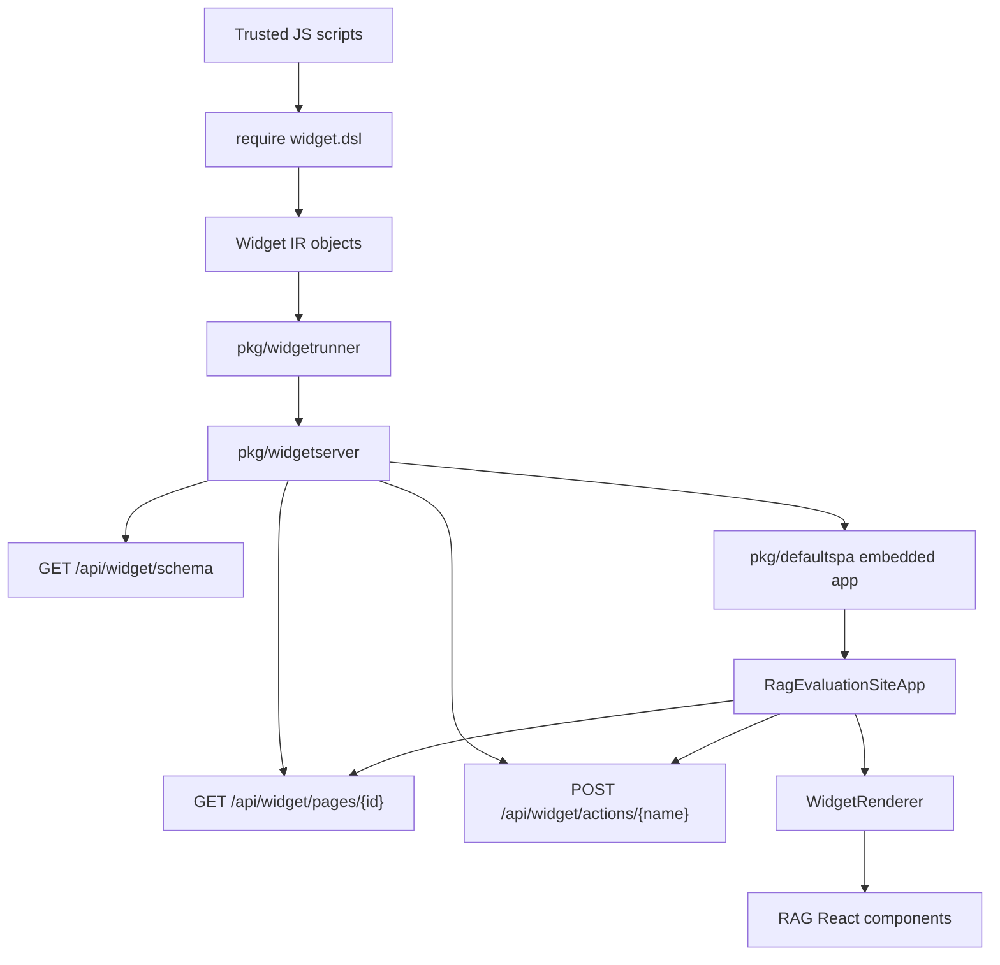

# WidgetRenderer Standalone Site: Goja-Authored, React-Rendered UI

This report explains the WidgetRenderer standalone-site work in the RAG evaluation system. The implementation creates a reusable path for trusted JavaScript scripts to author JSON-compatible Widget IR, a Go server to validate and serve that IR, and a React package to render the result with the existing RAG component library. The important boundary is deliberate: Goja authors data, Go serves data, React renders components.

> [!summary]
> - The project now has a complete runtime path from `exports.pages[id](ctx)` in Goja to `/api/widget/pages/{id}` JSON to a React-rendered embedded app.
> - The reusable frontend package is `@go-go-golems/rag-evaluation-site`, built from `packages/rag-evaluation-site` and published from compiled `dist/`.
> - The Go packages `pkg/widgetdsl`, `pkg/widgetrunner`, `pkg/widgetserver`, `pkg/defaultspa`, and `pkg/widgetschema` separate authoring, execution, HTTP serving, embedded frontend delivery, and schema/version metadata.
> - The implementation was validated with Go tests, TypeScript builds, npm pack/consumer smoke tests, and a Playwright browser smoke that clicked a server action and observed page refresh.

## Why this project exists

The RAG evaluation frontend already had a useful set of React components: panels, stacks, status text, tables, metadata grids, navigation, and form controls. It also had a Widget IR renderer that could map JSON-compatible nodes to those components. The missing piece was packaging. The renderer lived inside the application, and Goja scripting existed only as a prototype. A standalone widget site needs those pieces to become reusable without changing the rendering boundary.

The project exists to solve three concrete problems.

First, scripts need a compact way to describe UI pages without constructing HTML strings or importing React. A trusted JavaScript script should be able to write `rag.panel(...)`, `rag.dataTable(...)`, and `rag.button(...)` and receive a JSON-compatible object. That object must be serializable, inspectable, and safe to validate before it reaches the browser.

Second, the Go server needs a stable API contract. It should expose page JSON, health, schema metadata, and server actions under a predictable prefix. It should also be able to serve the default React application from the same binary, while still allowing a caller to provide a custom frontend directory, development proxy, or handler.

Third, the React renderer needs to become a package. Consumers should be able to install the renderer and its types, import CSS, and either use the default app entrypoint or build their own app around the same Widget IR contract. That package must be publishable as a normal npm artifact rather than depending on workspace-only assumptions.

## The core design decision

The central design decision is that Widget IR remains the interchange format. Goja does not render HTML. Go does not duplicate the React component library. React remains responsible for visual rendering and UI behavior.

This decision prevents several classes of drift. If Go rendered HTML, it would have to replicate CSS Modules, component accessibility behavior, table cell rendering, action binding, layout density, and visual states. Any difference between Go-side HTML and React-side components would become a second implementation of the same UI. The Widget IR boundary avoids that duplication. Goja scripts produce structured nodes; React interprets those nodes using the real component library.

The Widget IR model has three top-level node kinds:

```ts
export type WidgetNode = TextNode | ElementNode | ComponentNode;

export interface TextNode {
  kind: 'text';
  text: string;
}

export interface ElementNode {
  kind: 'element';
  tag: string;
  attrs?: JsonObject;
  children?: WidgetNode[];
}

export interface ComponentNode {
  kind: 'component';
  type: RagWidgetType | string;
  props?: WidgetProps;
  children?: WidgetNode[];
}
```

The important property is not that the IR is small. The important property is that it is JSON-compatible. A page can be returned from Goja, validated in Go, serialized over HTTP, inspected in tests, consumed by TypeScript, and rendered by React without passing functions across process or runtime boundaries.

## System architecture

The completed implementation is organized as a sequence of packages and artifacts. Each package owns one responsibility.



The main repository path is:

```text
/home/manuel/workspaces/2026-05-27/rag-evaluation-system/2026-05-27--rag-evaluation-system
```

The most important implementation paths are:

| Path | Responsibility |
|---|---|
| `pkg/widgetdsl` | Goja native module that exposes `require("widget.dsl")` and `require("rag.dsl")`. |
| `pkg/widgetrunner` | Loads trusted scripts, calls page and action functions, normalizes results, validates Widget IR. |
| `pkg/widgetserver` | Exposes HTTP endpoints and frontend serving modes. |
| `pkg/defaultspa` | Embeds the built default React app with `go:embed`. |
| `pkg/widgetschema` | Publishes schema version and JSON Schema metadata. |
| `packages/rag-evaluation-site` | Reusable React/npm package for WidgetRenderer, IR types, CSS, hooks, and default app. |
| `web/src/widgets` | Original RAG Widget IR and renderer source that shaped the package extraction. |
| `ttmp/2026/06/04/WIDGETSITE-PACKAGING--widgetrenderer-packaging-and-standalone-server-design` | Ticket docs, diary, smoke harness, and validation record. |

## Layer 1: `pkg/widgetdsl`

The `pkg/widgetdsl` package is the authoring API for trusted JavaScript scripts. It registers a Goja native module under both `widget.dsl` and `rag.dsl`. Scripts can require the module and call functions that return Widget IR maps.

A script can write:

```js
const rag = require('widget.dsl');

exports.pages = {
  smoke(ctx) {
    return {
      id: ctx.pageId,
      title: 'Widget Smoke',
      schemaVersion: '0.1.0',
      root: rag.panel({ title: 'Action smoke' },
        rag.statusText({ status: 'success', icon: true }, 'Clicks 0'),
        rag.button({
          variant: 'primary',
          action: { kind: 'server', name: 'increment', payload: { source: 'playwright' } }
        }, 'Increment')
      )
    };
  }
};
```

The module does not create React elements. It returns plain Go maps that export cleanly from Goja. For example, `rag.panel({ title: "Demo" }, "ok")` becomes a component node with `kind: "component"`, `type: "Panel"`, props, and children. Non-node child values become text nodes. Arrays are flattened. Cell renderers are represented as serializable cell specs rather than callback functions.

This layer is intentionally narrow. Its job is to help authors produce valid Widget IR without forcing them to write raw object literals for every node. It is not a runtime framework, a DOM library, or a React compatibility layer.

## Layer 2: `pkg/widgetrunner`

The runner owns script loading and invocation. It creates a go-go-goja runtime, installs a shared `exports` object, loads JavaScript files in lexical order, and then calls exported page or action functions on demand.

The page lookup rule is:

1. If `exports.pages[id]` is a function, call it.
2. Otherwise, if `exports.page` is a function, call it.
3. Otherwise, return `ErrPageNotFound`.

The page call receives a JSON-style context map:

```go
type PageContext struct {
    PageID string            `json:"pageId"`
    Query  map[string]string `json:"query,omitempty"`
    User   map[string]any    `json:"user,omitempty"`
    Data   map[string]any    `json:"data,omitempty"`
}
```

One important implementation detail is that the runner does not rely on Go struct JSON tags when passing context into Goja. Earlier testing showed that `vm.ToValue(PageContext)` exposes Go field names rather than JSON tag names. The runner now builds explicit maps so JavaScript sees `ctx.pageId`, `ctx.query`, `ctx.user`, and `ctx.data`.

The normalized page result now includes a schema version:

```go
type PageResult struct {
    SchemaVersion string         `json:"schemaVersion"`
    ID            string         `json:"id"`
    Title         string         `json:"title"`
    Root          map[string]any `json:"root"`
    Meta          map[string]any `json:"meta,omitempty"`
}
```

If a page returns a bare Widget node, the runner wraps it into a page result. If a page omits `schemaVersion`, the runner defaults it to `0.1.0`. If it provides an unsupported version, validation rejects the page.

The runner also owns actions. A script can export:

```js
exports.actions = {
  increment(ctx, payload) {
    clicks += 1;
    return {
      ok: true,
      refresh: true,
      toast: 'incremented via ' + payload.source,
      data: { action: ctx.action, clicks }
    };
  }
};
```

The Go call path is:

```go
func (r *Runner) InvokeAction(ctx context.Context, name string, req ActionRequest) (*ActionResult, error)
```

The action function receives two values: a context map and the payload. The context map always includes `action: name`, then merges caller-provided context fields. This lets the frontend pass row keys, row data, component type, or other interaction context without changing the action function signature.

The action result is normalized into:

```go
type ActionResult struct {
    OK      bool           `json:"ok"`
    Refresh bool           `json:"refresh,omitempty"`
    Toast   string         `json:"toast,omitempty"`
    Patch   map[string]any `json:"patch,omitempty"`
    Data    map[string]any `json:"data,omitempty"`
}
```

The default for missing `ok` is `true`. That choice makes simple actions ergonomic: a script can return `{ refresh: true }` without also writing `{ ok: true }`. The tradeoff is that failures must be explicit.

## Layer 3: `pkg/widgetserver`

The server package wraps the runner in HTTP. It uses the standard library `net/http` `ServeMux` and a default API prefix of `/api/widget`.

The stable endpoints are:

| Endpoint | Method | Purpose |
|---|---:|---|
| `/api/widget/health` | `GET` | Liveness check for smoke tests and operators. |
| `/api/widget/pages/{id}` | `GET` | Render a page by calling the runner and returning Widget IR JSON. |
| `/api/widget/actions/{name}` | `POST` | Invoke a Goja action by name. |
| `/api/widget/schema` | `GET` | Return schema version, component vocabulary, cell kinds, and JSON Schema metadata. |

Error mapping matters because scripts are authored by users. The server distinguishes missing pages, invalid Widget IR, missing actions, invalid action results, and runtime errors. That distinction gives authors actionable feedback.

The action endpoint decodes:

```json
{
  "payload": { "id": "42" },
  "context": { "rowKey": "row-42", "componentType": "DataTable" }
}
```

and returns an action result:

```json
{
  "ok": true,
  "refresh": true,
  "toast": "saved 42",
  "data": { "action": "save", "rowKey": "row-42" }
}
```

The server also supports four frontend modes:

| Mode | Behavior |
|---|---|
| `embedded` | Serve the default embedded app from `pkg/defaultspa`, unless a custom handler is supplied. |
| `dir` | Serve a built frontend directory from disk with SPA fallback. |
| `proxy` | Reverse proxy to a development frontend server. |
| `api-only` | Serve only API routes. |

The embedded mode is now the default. That is the setting that enables a single Go binary to serve both Widget IR APIs and the default React UI.

## Layer 4: `packages/rag-evaluation-site`

The npm package is the reusable React side of the system. Its package name is:

```text
@go-go-golems/rag-evaluation-site
```

Its source directory is:

```text
packages/rag-evaluation-site
```

The package contains:

- copied `web/src/widgets/*` renderer and IR types
- reusable component subtrees from the RAG frontend
- `useWidgetPage(url)` for loading page JSON
- `RagEvaluationSiteApp` as the default app shell
- `styles.css` and `theme.css` exports
- Vite library build for npm
- Vite app build for Go embedding
- npm pack smoke
- clean consumer smoke

The package exposes subpaths:

```json
{
  ".": {
    "types": "./index.d.ts",
    "import": "./index.js"
  },
  "./ir": {
    "types": "./ir.d.ts",
    "import": "./ir.js"
  },
  "./app": {
    "types": "./app/index.d.ts",
    "import": "./app/index.js"
  },
  "./styles.css": "./styles.css",
  "./theme.css": "./theme.css"
}
```

The package is published from compiled `dist/`, not from the source package root. This is a significant release rule. Publishing from `dist/` avoids including `src/`, local `app-dist/`, `node_modules`, workspace-only files, and development-only configuration. The build script generates a `dist/package.json` and copies the README into `dist`.

The clean consumer smoke validates the published shape by creating a temporary Vite/React app, installing the packed tarball, importing `WidgetRenderer`, importing CSS from `@go-go-golems/rag-evaluation-site/styles.css`, importing app types from `@go-go-golems/rag-evaluation-site/app`, running TypeScript, and building the app. This catches mistakes that local workspace builds hide.

## Layer 5: `pkg/defaultspa`

The default React app is built by Vite into:

```text
packages/rag-evaluation-site/app-dist
```

Go cannot embed that directory directly from `pkg/defaultspa`, because `go:embed` only embeds files under the package directory. The implementation therefore syncs the built app into:

```text
pkg/defaultspa/dist
```

Then `pkg/defaultspa` embeds it:

```go
//go:embed all:dist
var embeddedDist embed.FS
```

The package exposes:

```go
func FS() fs.FS
func Handler() http.Handler
```

The handler serves static assets and falls back to `index.html` for client-side routes. This makes `/`, `/pages/smoke`, and other frontend routes resolve to the same app shell while `/api/widget/...` remains owned by `pkg/widgetserver`.

The sync command is:

```bash
cd packages/rag-evaluation-site
pnpm build:app
pnpm sync:defaultspa
```

The ordering is important. For a release or CI build, the app must be built, then synced into `pkg/defaultspa/dist`, then the Go binary can be built and tested.

## Schema and versioning

`pkg/widgetschema` currently defines schema version `0.1.0`. The schema endpoint returns a summary that includes the version, component vocabulary, cell kinds, and a JSON Schema object.

The schema is intentionally broad for component props. It validates the node shape and core page envelope, but it does not yet model every prop of every component. That is a deliberate scope choice. The implementation needed a stable version boundary and basic structural validation first. Prop-level precision can be added later if the package needs stronger authoring diagnostics.

The current schema validates the following ideas:

- A page has `id`, `title`, `root`, and optional `meta`.
- A page may include `schemaVersion`; if present, it must be `0.1.0`.
- A Widget node is one of `text`, `element`, or `component`.
- A text node requires string `text`.
- An element node requires string `tag` and may have `attrs` and `children`.
- A component node requires string `type` and may have `props` and `children`.

The runner also validates JSON serializability by attempting to marshal the normalized page. This catches values that cannot safely cross the HTTP boundary.

## Server actions

Actions are the runtime path from UI interaction to trusted script behavior. The Widget IR already had action specs; the implementation now gives the `server` action kind a real backend path.

A button can carry:

```json
{
  "kind": "server",
  "name": "increment",
  "payload": { "source": "playwright" }
}
```

The React renderer binds the button action. In the default app, the `onAction` handler posts to:

```text
POST /api/widget/actions/increment
```

with payload and context. If the action result has `refresh: true`, the default app calls the `useWidgetPage` refresh function and reloads the current page. This is how the Playwright smoke moved from `Clicks 0` to `Clicks 1`.

The default app also dispatches a `widget:toast` browser event if the action returns a toast string. It does not yet render a visible toast component. Failed actions currently throw inside an async handler; a production-quality app should surface those failures in the UI.

## Validation record

The implementation was validated at several levels.

### Go tests

The Go tests cover runner behavior, action lookup, schema version defaults, server endpoint behavior, embedded SPA serving, and full repository tests.

Commands that passed:

```bash
go test ./pkg/widgetschema ./pkg/widgetrunner ./pkg/widgetserver -count=1
go test ./pkg/defaultspa ./pkg/widgetserver -count=1
go test ./pkg/widgetdsl ./pkg/widgetrunner ./pkg/defaultspa ./pkg/widgetserver -count=1
go test ./... -count=1
```

### Frontend package tests

The package validation covers TypeScript, library build, default app build, embedded app sync, npm dry-run pack, and clean consumer installation.

Commands that passed:

```bash
cd packages/rag-evaluation-site
pnpm typecheck
pnpm build
pnpm build:app
pnpm sync:defaultspa
pnpm pack:smoke
pnpm consumer:smoke
```

The dry-run pack output showed the tarball contains compiled JS, declarations, CSS, `README.md`, and `package.json`, without source files or `app-dist`.

### Browser smoke

The ticket includes a local smoke harness:

```text
ttmp/2026/06/04/WIDGETSITE-PACKAGING--widgetrenderer-packaging-and-standalone-server-design/scripts/03-widgetsite-smoke-server.go
ttmp/2026/06/04/WIDGETSITE-PACKAGING--widgetrenderer-packaging-and-standalone-server-design/scripts/smoke-widgetsite/page.js
```

The smoke server was started with:

```bash
go run ttmp/2026/06/04/WIDGETSITE-PACKAGING--widgetrenderer-packaging-and-standalone-server-design/scripts/03-widgetsite-smoke-server.go \
  --addr 127.0.0.1:8897 \
  --scripts ttmp/2026/06/04/WIDGETSITE-PACKAGING--widgetrenderer-packaging-and-standalone-server-design/scripts/smoke-widgetsite
```

The browser visited:

```text
http://127.0.0.1:8897/pages/smoke
```

The smoke verified:

- the embedded app rendered `Widget Smoke Header`
- the page rendered `Clicks 0`
- clicking `Increment` sent `POST /api/widget/actions/increment`
- the action returned `200 OK`
- the app refreshed with `GET /api/widget/pages/smoke`
- the UI updated to `Clicks 1`
- browser console warnings/errors were `0`

The screenshot artifact was:

```text
widgetsite-embedded-smoke-2026-06-05.png
```

## Important implementation details

### The runtime owns one shared `exports` object

Scripts load in lexical order and share the same `exports` object. This lets one script define helpers and another script define pages that use them. It also means script order is observable and should remain deterministic. The runner scans `.js` files, sorts them, and executes each file in order.

### Page context and action context are explicit maps

Goja does not automatically expose Go struct JSON tag names in the way page authors expect. The runner therefore constructs maps for both page and action contexts. This is required for JavaScript code to read `ctx.pageId` rather than `ctx.PageID`.

### DataTable cells remain serializable

Tables cannot carry JavaScript cell callbacks across the HTTP boundary. The IR uses `CellSpec` values such as `field`, `number`, `status`, `caption`, `template`, `link`, and `constant`. React converts those specs back into render functions inside `WidgetRenderer`.

### The package excludes connected application widgets

The package copy deliberately removed app-specific molecules such as `CoveragePanel` and `QueryPresetList` because they import RAG application services. A reusable renderer package can include visual primitives and data-driven widgets, but it should not import app-specific RTK Query services unless that dependency is part of the package contract.

### CSS is generated by Vite for the package build

The first package build mistake was copying authored `src/styles.css` over Vite's generated `dist/styles.css`. That destroyed CSS module output. The corrected build lets Vite produce `dist/styles.css` and separately copies `theme.css`.

### `npm pack ./dist` must include `./`

The dry-run pack initially used `npm pack dist`, which npm interpreted as the registry package named `dist`. The correct command is:

```bash
npm pack --dry-run ./dist
```

The leading `./` is part of the release contract.

## Current status

The implementation is complete enough to serve as a standalone WidgetRenderer site foundation. The following pieces are done:

- public `widget.dsl` / `rag.dsl` Goja module
- runner with page loading, page rendering, action invocation, validation, and schema version handling
- HTTP server with health, pages, actions, schema, and frontend serving modes
- embedded default React app
- reusable npm package scaffold and validation scripts
- package-level CSS/theme contract
- server action path from React click to Goja action to page refresh
- Playwright smoke against embedded mode
- WIDGETSITE docmgr ticket diary, changelog, tasks, design guide, and doctor validation

Renderer registry overrides were explicitly deferred. CI/trusted npm publishing remains the main missing productionization step.

## Open questions

- Should `pkg/widgetschema.JSONSchema()` eventually be generated from TypeScript types, Go structs, or a separate schema source of truth?
- Should component props receive strict schema definitions, or is node-shape validation sufficient for the first public release?
- Should `NormalizeActionResult` keep defaulting missing `ok` to `true`, or should action authors be required to return explicit success state?
- Should the default embedded app include source maps in production builds?
- Should action failures render visibly in the default app rather than throwing inside an async handler?
- Should `pkg/defaultspa/dist` be committed as an embedded artifact, or regenerated entirely inside CI/release workflows?

## Near-term next steps

The next practical step is CI and release wiring. The workflow should run, in order:

```bash
cd packages/rag-evaluation-site
pnpm install
pnpm typecheck
pnpm build
pnpm build:app
pnpm sync:defaultspa
pnpm pack:smoke
pnpm consumer:smoke
cd ../..
go test ./...
```

For npm publishing, the workflow should publish the compiled `packages/rag-evaluation-site/dist` artifact using npm Trusted Publishing with GitHub Actions OIDC. It should not use a long-lived `NODE_AUTH_TOKEN` once trusted publishing is configured.

A second useful step is a repository-level Playwright test. The manual Pi Playwright smoke proved the path works. A committed test can make that proof repeatable in CI if the project decides to standardize browser automation.

## Working rules for future work

- Keep Widget IR JSON-compatible. Do not introduce function-valued props or runtime-specific objects into page responses.
- Keep React as the renderer. Do not duplicate the component library in Go-side HTML.
- Publish npm from compiled `dist/`, not from the package source root.
- Build the default app before syncing `pkg/defaultspa/dist`, and sync before building Go binaries that embed it.
- Treat Goja scripts as trusted unless a separate sandboxing project changes that assumption.
- Keep browser smoke coverage for any change that affects `pkg/defaultspa`, `RagEvaluationSiteApp`, server actions, or route fallback.

## Related project documents

The implementation diary and design package live in the repository ticket workspace:

```text
ttmp/2026/06/04/WIDGETSITE-PACKAGING--widgetrenderer-packaging-and-standalone-server-design
```

The most useful docs there are:

- `design-doc/01-widgetrenderer-packaging-architecture-and-implementation-guide.md`
- `reference/01-research-logbook.md`
- `reference/02-diary.md`
- `tasks.md`
- `changelog.md`

The earlier RAG Widget IR ticket is also relevant:

```text
ttmp/2026/06/02/RAGEVAL-UI-DSL--ui-dsl-and-kanban-dsl-for-rag-evaluation-system-web-interface
```

That ticket records the original Widget IR renderer, Storybook coverage, static DSL endpoint, and RAG app preview integration that made this packaging work possible.
