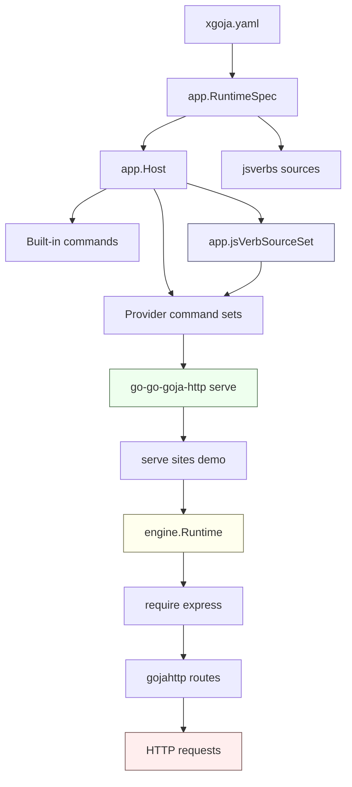

# go-go-goja HTTP Serve Support for xgoja Generated Verbs

GOJA-064 adds a first-class way for generated `xgoja` binaries to serve HTTP applications whose setup code is written as JavaScript verbs. Before this work, generated binaries could run JavaScript verbs as short-lived commands, and they could run long-lived HTTP setup scripts through `run --keep-alive`. Those two capabilities did not meet at the command-provider boundary. A generated verb could register Express routes, but the normal verb command closed the runtime after the function returned. A long-lived server could be created from a script file, but not from the generated verb command tree.

The implemented change introduces a provider-backed `serve` command contributed by the first-party HTTP provider. The command mirrors configured JavaScript verbs, invokes the selected verb once to register Express routes, and keeps the runtime alive until the process receives Ctrl-C, SIGTERM, or context cancellation. The result is a generated command path such as:

```bash
./http-serve-jsverbs serve sites demo --http-listen 127.0.0.1:8787
```

That command is not a special case in the generator. It is a provider-owned command set that uses the same module list, the same jsverb source configuration, the same Glazed section parsing, and the same Goja runtime ownership model as the rest of `xgoja`.

> [!summary]
>
> - GOJA-064 connects JavaScript verb discovery to provider-owned commands by adding `JSVerbSourceSet` to `providerapi.CommandSetContext`.
> - The HTTP provider now registers a `serve` command provider that builds commands from configured jsverbs and keeps the selected runtime alive after route registration.
> - The implementation follows the simplified single-runtime `xgoja.yaml` schema: one top-level `modules:` list, no runtime-profile selection, and a single generated module set shared by built-in commands and provider commands.
> - The generated-binary smoke test and `examples/xgoja/13-http-serve-jsverbs` prove that a generated binary can serve an Express route registered by a JavaScript verb.

## How to read this report

This report is written as a technical deep dive rather than a changelog. It explains the system concepts, the reason the design exists, the implementation path, the verification strategy, and the remaining work. It assumes the reader can read Go and JavaScript, but it does not assume prior knowledge of the `xgoja` command-provider lifecycle.

The most important source locations are:

| Area | Path |
| --- | --- |
| Provider command API | `/home/manuel/workspaces/2026-06-03/goja-runtime-flags/go-go-goja/pkg/xgoja/providerapi/commands.go` |
| Command-provider attachment | `/home/manuel/workspaces/2026-06-03/goja-runtime-flags/go-go-goja/pkg/xgoja/app/command_providers.go` |
| Command-provider jsverb source access | `/home/manuel/workspaces/2026-06-03/goja-runtime-flags/go-go-goja/pkg/xgoja/app/jsverb_sources.go` |
| Built-in jsverb command path | `/home/manuel/workspaces/2026-06-03/goja-runtime-flags/go-go-goja/pkg/xgoja/app/root.go` |
| HTTP provider registration | `/home/manuel/workspaces/2026-06-03/goja-runtime-flags/go-go-goja/pkg/xgoja/providers/http/http.go` |
| HTTP serve command provider | `/home/manuel/workspaces/2026-06-03/goja-runtime-flags/go-go-goja/pkg/xgoja/providers/http/serve.go` |
| Generated-binary smoke test | `/home/manuel/workspaces/2026-06-03/goja-runtime-flags/go-go-goja/cmd/xgoja/internal/generate/generate_test.go` |
| Runnable example | `/home/manuel/workspaces/2026-06-03/goja-runtime-flags/go-go-goja/examples/xgoja/13-http-serve-jsverbs/` |
| GOJA-064 design and diary | `/home/manuel/workspaces/2026-06-03/goja-runtime-flags/go-go-goja/ttmp/2026/06/04/GOJA-064--http-serve-support-for-xgoja-generated-verbs/` |

## The problem before GOJA-064

Generated `xgoja` binaries are built from `xgoja.yaml`. The current schema has a single top-level `modules:` list. That list selects provider modules such as `go-go-goja-http.express`, `go-go-goja-host.fs`, or provider-specific modules from another repository. Generated commands then create runtimes from that selected module set.

The ordinary JavaScript verb path was already mature. A buildspec can configure `jsverbs:` sources, and the generated binary can expose them under a command such as `verbs`. The implementation in `pkg/xgoja/app/root.go` scans configured sources, creates a Glazed command per discovered verb, creates a runtime for each command invocation, invokes the verb, and closes the runtime.

That behavior is correct for ordinary command verbs. A CLI command should usually finish, produce output, and release resources. It is incorrect for an HTTP setup verb. Route registration is only the startup phase. After the setup function registers routes through `require("express")`, HTTP request handlers need the Goja runtime to remain alive because request dispatch calls JavaScript callbacks through the runtime owner.

The existing workaround was `run --keep-alive`. A script such as `scripts/serve-static-assets.js` could register routes and then keep the runtime open:

```bash
./embedded-assets-fs run scripts/serve-static-assets.js \
  --http-listen 127.0.0.1:8787 \
  --keep-alive
```

This path serves script files, not generated verb commands. It bypasses the verb repository structure, the `__package__` command hierarchy, the generated verb metadata, and the provider-owned command surface. GOJA-064 closes that gap.

## The key design decision

The direct way to add serving would have been to add a JavaScript method such as `express.serve()` and let a script call it. That would keep the server behavior inside the module. It would not solve the generated-command problem. The generated binary would still not have a `serve sites demo` command created from jsverb metadata.

The implemented design makes `serve` a provider-owned command set contributed by `go-go-goja-http`. This is the right boundary because HTTP serving belongs to the HTTP provider, while source scanning and runtime construction belong to `xgoja` application infrastructure. The provider command receives a context that includes the runtime factory, selected module descriptors, and now the configured jsverb sources.

The result is a small extension to the provider API rather than a new built-in `xgoja` command family. The generator does not need to know what HTTP serving is. It only needs to pass enough context to command providers for them to build commands from the configured application inputs.



The important distinction is that `serve` is not a replacement for `verbs`. It is a second command view over the same JavaScript verb sources. `verbs` remains short-lived. `serve` treats the selected verb as setup code for a long-lived HTTP process.

## Command providers needed access to JavaScript verb sources

The central API change is in `pkg/xgoja/providerapi/commands.go`. Before GOJA-064, a command provider could receive a runtime factory and selected modules, but it could not ask, "Which JavaScript verb sources did this generated binary configure?" That meant a provider-owned command could not mirror the same verbs that the built-in `verbs` command exposes.

GOJA-064 adds `JSVerbSourceSet`:

```go
// JSVerbSourceSet lets command providers discover and scan the JavaScript verb
// sources configured for the generated binary. Providers should use this instead
// of reimplementing local, embedded, and provider-shipped source resolution.
type JSVerbSourceSet interface {
    ListJSVerbSources() []JSVerbSourceDescriptor
    ScanJSVerbSource(id string) (*jsverbs.Registry, error)
    ScanAllJSVerbSources() ([]*jsverbs.Registry, error)
}

type CommandSetContext struct {
    Context         context.Context
    PackageID       string
    Name            string
    Mount           string
    Config          json.RawMessage
    Host            HostServices
    Providers       *ProviderRegistry
    RuntimeFactory  RuntimeFactory
    SelectedModules []ModuleDescriptor
    JSVerbs         JSVerbSourceSet
}
```

This API deliberately exposes scanning rather than raw runtime-spec data only. A command provider should not have to know how to resolve all source modes. Local directories, embedded sources, and provider-shipped sources already have one resolution path in the app layer. Reusing that path prevents drift between built-in `verbs` and provider-owned commands.

There is one coupling that deserves review: `providerapi` now imports `pkg/jsverbs` because the interface returns `*jsverbs.Registry`. This is pragmatic for the first implementation because command providers need the registry to build command descriptions and invokers. A future cleanup could move the source-scanning abstraction into a smaller package if the dependency direction becomes uncomfortable.

## The app layer implements source scanning once

The implementation of the new interface lives in `pkg/xgoja/app/jsverb_sources.go`. It stores the provider registry, embedded jsverb filesystem, and normalized source list. It can list descriptors, scan one source by ID, or scan all configured sources.

```go
type jsVerbSourceSet struct {
    providers       *providerapi.ProviderRegistry
    embeddedJSVerbs fs.FS
    sources         []JSVerbSourceSpec
}

func (s *jsVerbSourceSet) ScanAllJSVerbSources() ([]*jsverbs.Registry, error) {
    if s == nil || len(s.sources) == 0 {
        return nil, nil
    }
    registries := make([]*jsverbs.Registry, 0, len(s.sources))
    for _, source := range s.sources {
        registry, err := scanVerbSource(s.providers, s.embeddedJSVerbs, source)
        if err != nil {
            return nil, err
        }
        if registry == nil {
            continue
        }
        registries = append(registries, registry)
    }
    return registries, nil
}
```

The important property is that this helper calls the existing `scanVerbSource` function from `pkg/xgoja/app/root.go`. That function already understands provider sources, embedded sources, and filesystem sources. The new command-provider path is therefore not a second implementation of jsverb discovery. It is a new consumer of the same discovery rules.

`pkg/xgoja/app/command_providers.go` passes the source set into every provider command set:

```go
set, err := provider.NewCommandSet(providerapi.CommandSetContext{
    Context:         context.Background(),
    PackageID:       instance.Package,
    Name:            instance.Name,
    Mount:           mount,
    Config:          config,
    Providers:       h.Providers,
    RuntimeFactory:  h.Factory,
    SelectedModules: selected,
    JSVerbs:         newJSVerbSourceSet(h.Providers, h.EmbeddedJSVerbs, h.RuntimeSpec.JSVerbs),
})
```

This is also where the simplified single-runtime schema matters. The context does not need a selected runtime profile. It has the generated runtime factory and the selected module descriptors for the one configured module set.

## The HTTP provider contributes a serve command

The HTTP provider already registered the `express` module and its HTTP section. GOJA-064 adds a `CommandSetProvider` to the same provider package:

```go
providerapi.CommandSetProvider{
    Name:         "serve",
    DefaultMount: "serve",
    Description:  "Serve JavaScript verb-backed HTTP sites",
    NewCommandSet: func(ctx providerapi.CommandSetContext) (*providerapi.CommandSet, error) {
        return newServeCommandSet(ctx)
    },
}
```

The command set scans all jsverb sources and creates a command for each verb. The command descriptions come from the existing jsverbs machinery, which preserves package parents, names, fields, arguments, and output mode. The serve provider then appends module sections such as the HTTP section, so generated commands accept flags like `--http-listen`.

```go
func newServeCommandSet(ctx providerapi.CommandSetContext) (*providerapi.CommandSet, error) {
    if ctx.JSVerbs == nil {
        return nil, fmt.Errorf("http serve command requires configured jsverb sources")
    }
    if ctx.RuntimeFactory == nil {
        return nil, fmt.Errorf("http serve command requires runtime factory")
    }

    sections, err := providerutil.CollectGlazedConfigSections(
        ctx.SelectedModules,
        providerapi.SectionRequest{CommandProviderID: ctx.Name},
        nil,
    )
    if err != nil {
        return nil, err
    }

    registries, err := ctx.JSVerbs.ScanAllJSVerbSources()
    if err != nil {
        return nil, err
    }

    // For each registry and verb, build a jsverbs command with a custom invoker.
}
```

The command-provider output is therefore not a manually constructed Cobra command. It is a generated Glazed command derived from the verb metadata.

## Runtime execution model

The `serve` command differs from ordinary verb execution in exactly one lifecycle decision: it does not close immediately after the JavaScript function returns. The selected verb is treated as setup code. The setup function can import `express`, create an app, and register routes. After setup returns, the runtime remains open and the process blocks until shutdown.

```go
func serveVerb(ctx context.Context, commandCtx providerapi.CommandSetContext, registry *jsverbs.Registry, verb *jsverbs.VerbSpec, parsedValues *values.Values) (interface{}, error) {
    rt, err := commandCtx.RuntimeFactory.NewRuntimeFromSections(
        ctx,
        parsedValues,
        require.WithLoader(registry.RequireLoader()),
    )
    if err != nil {
        return nil, err
    }
    defer func() { _ = rt.Close(context.Background()) }()

    if len(commandCtx.SelectedModules) > 0 {
        if err := providerutil.InitRuntimeFromSections(ctx, parsedValues, runtimeHandle{rt: rt}, commandCtx.SelectedModules); err != nil {
            return nil, err
        }
    }
    if _, err := registry.InvokeInRuntime(ctx, rt, verb, parsedValues); err != nil {
        return nil, err
    }

    fmt.Fprintln(os.Stderr, "xgoja http serve: runtime is alive; press Ctrl-C to stop")
    return nil, waitForServeShutdown(ctx)
}
```

There are four ordered phases here.

1. Create the runtime from parsed Glazed values and the selected module list.
2. Add the selected verb registry as a CommonJS loader so the invoked verb can require local modules from its source tree.
3. Initialize runtime modules from parsed sections, including the HTTP provider section that supplies `--http-listen`.
4. Invoke the selected JavaScript verb and then wait for cancellation.

The order matters. HTTP route registration needs the Express module to exist before the JavaScript verb runs. The HTTP host also needs the parsed listen address before the server is started. The runtime close must happen after shutdown, not after route setup.

The current implementation prints a startup message after the verb returns:

```text
xgoja http serve: runtime is alive; press Ctrl-C to stop
```

This is useful but not a full readiness signal. The follow-up hardening item is to bind with `net.Listen` before the serving goroutine starts, so port conflicts and address errors are reported synchronously instead of appearing later in background execution.

## The JavaScript authoring model

The author writes a normal jsverb package. The function body imports `express`, creates or retrieves an app, and registers routes.

```javascript
__package__({ name: "sites" })
__verb__("demo", { name: "demo", output: "text" })
function demo() {
  const express = require("express")
  const app = express.app()
  app.get("/", (_req, res) => res.send("hello from an xgoja jsverb site"))
  app.get("/healthz", (_req, res) => res.json({ ok: true, site: "demo" }))
}
```

The function does not return a server object. It only mutates the host HTTP application state by registering handlers. That is the same pattern used by script-based Express examples in the repository, but now the setup code is packaged as a discoverable generated command.

A minimal generated buildspec for this mode has three essential parts:

```yaml
packages:
  - id: go-go-goja-http
    import: github.com/go-go-golems/go-go-goja/pkg/xgoja/providers/http
    register: Register

modules:
  - package: go-go-goja-http
    name: express
    as: express

command_providers:
  - id: http-serve
    package: go-go-goja-http
    name: serve
    mount: serve

jsverbs:
  - id: local
    path: verbs
```

This expresses a precise contract. The package imports and registers the provider. The module list installs the Express module. The command provider exposes the `serve` command. The jsverb source list provides the JavaScript verbs that `serve` mirrors.

The current design mirrors all configured verbs under `serve`. That is intentionally simple for GOJA-064, but it means non-HTTP verbs can appear below `serve` if they are in the same jsverb source tree. A later iteration can add tag filtering, for example by exposing only verbs tagged `http`, `site`, or `serve`.

## Why the generated-binary test matters

Package-level tests prove the internal command provider can scan sources and build commands. They do not prove that generated source code imports the HTTP provider, embeds the runtime spec correctly, wires the provider registry, builds a binary, parses command-line values, starts the server, and responds over TCP.

GOJA-064 therefore adds a generated-binary smoke test in `cmd/xgoja/internal/generate/generate_test.go`. The test creates a temporary jsverb source tree, constructs a `buildspec.BuildSpec`, generates and builds a binary, starts the generated `serve` command, and polls `/healthz` until the JavaScript route responds.

```go
func TestGeneratedProgramServesHTTPVerb(t *testing.T) {
    baseDir := t.TempDir()
    verbsDir := filepath.Join(baseDir, "verbs")
    os.MkdirAll(verbsDir, 0o755)
    os.WriteFile(filepath.Join(verbsDir, "sites.js"), []byte(`
__package__({ name: "sites" })
__verb__("demo", { name: "demo", output: "text", short: "Serve demo" })
function demo() {
  const express = require("express")
  const app = express.app()
  app.get("/healthz", (_req, res) => res.json({ ok: true, source: "jsverb" }))
}
`), 0o644)

    // Build a generated binary with the HTTP provider, express module,
    // serve command provider, and local jsverb source.

    cmd, dir := startGeneratedCommand(t, ctx, buildSpec, "serve", "sites", "demo", "--http-listen", addr)
    url := "http://" + addr + "/healthz"

    // Poll until the generated binary serves the JS-registered route.
}
```

This test is important because the failure mode of this feature is often integration-level. The provider API can compile, and the command tree can exist, while the generated binary still fails because the generated imports are wrong, the provider registry is incomplete, the runtime spec omits the command provider, or the HTTP section is not added to the generated command.

An earlier test approach used `go run . serve ...`. That failed with:

```text
*** Test I/O incomplete 1m0s after exiting.
exec: WaitDelay expired before I/O complete
```

The final test builds the generated binary and executes it directly. That removes `go run` as an extra long-lived process layer and makes cancellation cleaner.

## The runnable example

The repository now includes `examples/xgoja/13-http-serve-jsverbs`. It gives users a complete, inspectable implementation of the pattern.

The example includes:

- `xgoja.yaml` with the HTTP provider, Express module, `serve` command provider, and local jsverb source.
- `verbs/sites.js` with a `sites demo` setup verb.
- `Makefile` targets for build and smoke testing.
- `README.md` with manual run instructions and expected URLs.

The smoke command is:

```bash
make -C examples/xgoja/13-http-serve-jsverbs smoke
```

A manual run is:

```bash
make -C examples/xgoja/13-http-serve-jsverbs build
./examples/xgoja/13-http-serve-jsverbs/dist/http-serve-jsverbs \
  serve sites demo --http-listen 127.0.0.1:8787
```

The expected HTTP endpoints are:

- `http://127.0.0.1:8787/`
- `http://127.0.0.1:8787/healthz`

This example is more than sample code. It documents the user-facing command shape and protects against future confusion between script-based serving and verb-based serving.

## Commit-level implementation map

The work landed in three focused commits.

### `3994c9d` — `GOJA-064: add HTTP serve command provider`

This is the main implementation commit. It adds the provider API surface, app-level source set, HTTP provider command registration, serve implementation, package tests, and ticket documentation updates.

Key changed files:

- `pkg/xgoja/providerapi/commands.go`
- `pkg/xgoja/app/jsverb_sources.go`
- `pkg/xgoja/app/command_providers.go`
- `pkg/xgoja/providers/http/http.go`
- `pkg/xgoja/providers/http/serve.go`
- `pkg/xgoja/app/command_providers_test.go`
- `pkg/xgoja/providers/http/serve_test.go`

This commit establishes the contract: command providers can discover jsverb sources, and the HTTP provider uses that contract to expose a long-lived serve command.

### `ba318da` — `GOJA-064: add generated HTTP serve smoke`

This commit proves the feature through generated code and adds the runnable example.

Key changed files:

- `cmd/xgoja/internal/generate/generate_test.go`
- `examples/xgoja/13-http-serve-jsverbs/xgoja.yaml`
- `examples/xgoja/13-http-serve-jsverbs/verbs/sites.js`
- `examples/xgoja/13-http-serve-jsverbs/Makefile`
- `examples/xgoja/13-http-serve-jsverbs/README.md`
- `examples/xgoja/README.md`

This commit is the difference between a plausible internal API and a verified generated-binary feature.

### `098d3fc` — `Diary: record GOJA-064 implementation commits`

This commit records the implementation history in the ticket diary. The diary captures the design shift to the single top-level `modules:` list, the generated-binary test failure with `go run`, the direct-binary test fix, and the remaining hardening items.

## Validation already performed

The implementation was validated with package tests, generated-binary smoke testing, example smoke testing, and ticket doctor validation.

```bash
GOWORK=off go test ./pkg/xgoja/app ./pkg/xgoja/providers/http -count=1
GOWORK=off go test ./cmd/xgoja/internal/generate -run GeneratedProgramServesHTTPVerb -count=1
make -C examples/xgoja/13-http-serve-jsverbs smoke
docmgr doctor --ticket GOJA-064 --stale-after 30
```

The first command checks the app and provider packages. The second checks the generated-binary path. The third checks the user-facing example. The fourth checks ticket documentation hygiene.

## Current limitations and follow-up work

The feature is usable, but it still has clear hardening work.

### Startup errors should be synchronous

The HTTP server path should bind with `net.Listen` before returning from setup or before the process prints a readiness message. Today, a port conflict can be reported from inside a background server path. For generated CLI users, synchronous failure is easier to understand and easier to test.

### Verb filtering should be explicit

The current `serve` command mirrors every configured verb. That keeps GOJA-064 small and transparent, but it makes the command tree less precise if a source contains both CLI verbs and HTTP setup verbs. A future version should support metadata-based filtering. The likely rule is to include verbs that opt in through tags such as `http`, `site`, or `serve`.

### API coupling should be reviewed

`providerapi.JSVerbSourceSet` currently returns `*jsverbs.Registry`, which makes provider API depend on the jsverbs package. This is acceptable for the initial feature because the HTTP provider needs the registry to create commands and invoke verbs. It should still be reviewed as the provider API grows. A narrower interface could expose command descriptors and invokers without exposing the full registry type.

### Documentation should be expanded in xgoja help

The example README explains the pattern, but `xgoja` embedded help should also include a page for provider-backed HTTP serving. The natural location is near the existing static-assets HTTP tutorial. The help page should explain the difference between `verbs`, `serve`, and `run --keep-alive`.

## Engineering lessons

The main lesson is that command providers need application context, but they should not duplicate application logic. The jsverb source set is valuable because it gives providers a stable query interface over the generated binary's configured sources. It avoids a second implementation of source scanning.

A second lesson is that long-lived JavaScript processes need explicit runtime ownership. It is not enough to start an HTTP server. The Goja runtime must remain alive because route handlers can call JavaScript functions. The `serve` command encodes that lifecycle by invoking setup and then waiting for cancellation before closing the runtime.

A third lesson is that generated-binary tests are necessary for generator features. Package tests are fast and useful, but they cannot verify the import graph, embedded runtime spec, generated command tree, command-line parsing, and network behavior at the same time.

## Final state

GOJA-064 turns generated xgoja JavaScript verbs into HTTP site setup commands without making HTTP serving a core xgoja command. The provider API now supports jsverb source discovery, the app layer implements that discovery once, the HTTP provider contributes the `serve` command, and the generated-binary test proves the end-to-end behavior.

The feature is intentionally narrow. It supports one top-level module set, one command provider view over configured jsverbs, and runtime lifetime management for Express route registration. That narrowness is useful: it keeps the first implementation understandable and gives future work clear extension points for startup readiness, metadata filtering, and help documentation.
