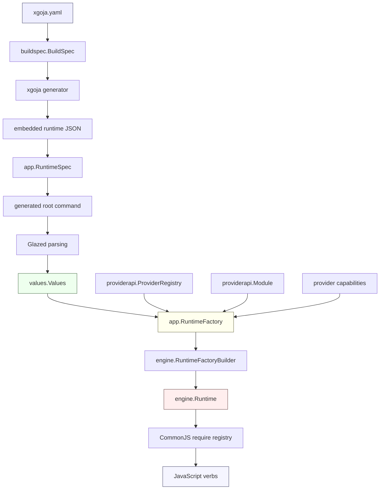
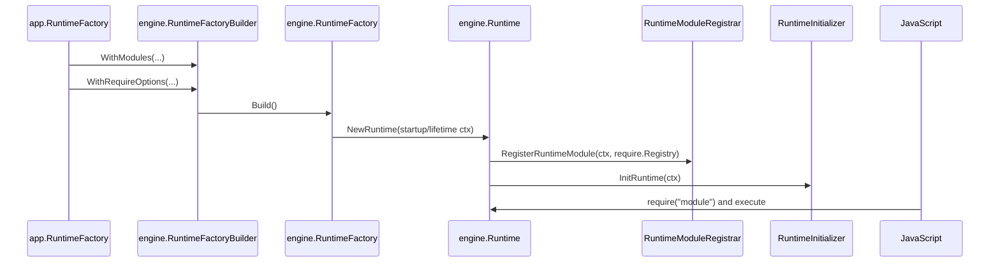
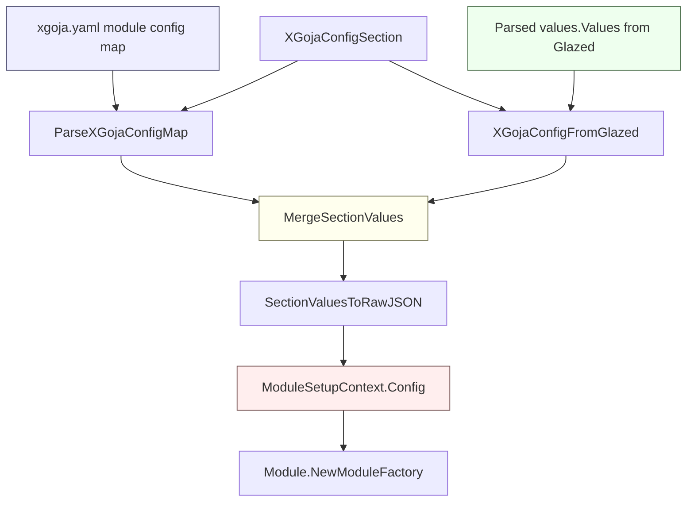
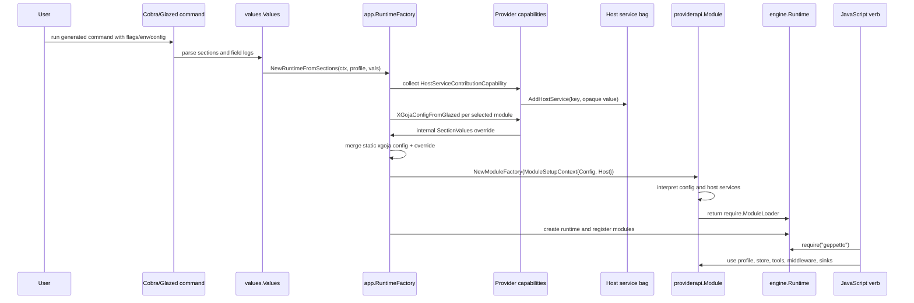

# go-go-goja Runtime Architecture Cleanup and Geppetto Provider Integration

This report explains the GOJA-053 work as a technical deep dive. The work began as a configuration lifecycle problem: generated `xgoja` binaries needed command-line, config-file, and environment values to reach provider module setup before `require("geppetto")` was installed. It grew into a broader cleanup of the `go-go-goja` runtime architecture: names were clarified, reusable runtime code was moved under `pkg/engine`, provider APIs were made more explicit, Glazed became the configuration merge layer, and the Geppetto provider gained enough runtime support to run generated JavaScript verbs with profiles, persistent turns, Go tools, Go middleware, and event sinks.

The result is not only a set of commits. It is a cleaner model of what `xgoja` is. `xgoja` is a generator for Go binaries that embed JavaScript runtimes and provider-owned native modules. Its correctness depends on the order in which declarative specs are normalized, command values are parsed, providers map public inputs into internal setup config, host services are aggregated, module loaders are registered, runtime initializers run, and JavaScript finally executes. GOJA-053 made that lifecycle visible in the API names and then used the lifecycle to make Geppetto work in generated binaries.

> [!summary]
> - The refactor made lifecycle names explicit: `BuildSpec`, `RuntimeSpec`, `ProviderRegistry`, `ModuleSetupContext`, `RuntimeFactoryBuilder`, `RuntimeModuleRegistrar`, and `RuntimeInitializationContext` now describe what each object actually does.
> - The configuration work reuses Glazed `schema.Section`, `values.SectionValues`, and `FieldValue.Log` instead of inventing a separate xgoja patch framework.
> - The Geppetto provider now exposes public Pinocchio-style flags, maps them into internal xgoja config, works without a Pinocchio host, opens a SQLite turn store, and participates in generated xgoja JavaScript verbs.
> - The host-service contribution work lets selected provider packages contribute opaque Go services before module setup. xgoja stays provider-neutral; Geppetto owns the typed payload for tools, middleware, event sinks, and option configurators.

## How to read this report

This is a long-form technical report rather than a changelog. It is written for a reader who may need to modify `xgoja`, write a provider, port a Pinocchio JavaScript script into a generated verb, or debug why a value is not visible inside `require("geppetto")`. The sections build from vocabulary and lifecycle fundamentals toward the concrete Geppetto integration.

The most important source locations are:

| Area | Path |
| --- | --- |
| xgoja provider API | `/home/manuel/workspaces/2026-06-03/goja-runtime-flags/go-go-goja/pkg/xgoja/providerapi/` |
| xgoja app runtime construction | `/home/manuel/workspaces/2026-06-03/goja-runtime-flags/go-go-goja/pkg/xgoja/app/` |
| reusable Goja engine layer | `/home/manuel/workspaces/2026-06-03/goja-runtime-flags/go-go-goja/pkg/engine/` |
| provider config helpers | `/home/manuel/workspaces/2026-06-03/goja-runtime-flags/go-go-goja/pkg/xgoja/providerutil/sections.go` |
| API glossary | `/home/manuel/workspaces/2026-06-03/goja-runtime-flags/go-go-goja/GLOSSARY.md` |
| migration help page | `/home/manuel/workspaces/2026-06-03/goja-runtime-flags/go-go-goja/cmd/xgoja/doc/10-migrating-xgoja-provider-engine-api.md` |
| Geppetto xgoja provider | `/home/manuel/workspaces/2026-06-03/goja-runtime-flags/geppetto/pkg/js/modules/geppetto/provider/provider.go` |
| Geppetto host options | `/home/manuel/workspaces/2026-06-03/goja-runtime-flags/geppetto/pkg/js/modules/geppetto/provider/host_options.go` |
| Example Geppetto contributor | `/home/manuel/workspaces/2026-06-03/goja-runtime-flags/geppetto/pkg/js/modules/geppetto/provider/hostservicesexample/register.go` |
| GOJA-053 ticket docs | `/home/manuel/workspaces/2026-06-03/goja-runtime-flags/go-go-goja/ttmp/2026/06/03/GOJA-053--xgoja-moduleconfigcapability-for-pre-runtime-provider-flag-to-config-patching/` |

Related vault notes:

- [[PROJ - xgoja Generated Binary Configuration]] explains the earlier generated-binary config/env support that GOJA-053 builds on.
- [[ARTICLE - xgoja - Building a Query Tool with Jsverbs and Embedded Modules]] explains the `xgoja.yaml` to generated jsverb path through a concrete query-tool example.

## The problem that started the work

Generated `xgoja` binaries are built from an `xgoja.yaml` buildspec. The buildspec selects provider packages, runtime profiles, native modules, command providers, JavaScript verb sources, help pages, assets, and generated command surfaces. When the generated binary runs, its commands are Glazed commands. That means command values can come from defaults, config files, environment variables, positional arguments, and CLI flags.

The initial defect was a lifecycle mismatch. Provider modules were being set up before the final Glazed command values were available to them. For simple modules this was fine. A module such as `path` or `yaml` may not care about runtime flags. Geppetto does care. A Geppetto module loader needs to know, before JavaScript imports it, which profile registry to load, which default profile to use, which turn store to open, and later which Go tools, middleware factories, and event sinks the host contributes.

The specific desired behavior looked like this:

```bash
./generated-geppetto-binary verbs geppetto-smoke persist "$SESSION" \
  --profile-registries "$HOME/.config/pinocchio/profiles.yaml" \
  --profile gpt-5-nano \
  --turns-db /tmp/generated-turns.db \
  --output json
```

The JavaScript code behind that command should be able to run:

```javascript
const gp = require("geppetto");
const settings = gp.inferenceProfiles.resolve();
const store = gp.turnStores.default();
const agent = gp.agent()
  .inference(settings)
  .defaultStore()
  .build();
```

For this to work, the `--profile-registries`, `--profile`, and `--turns-db` values must affect `geppettomodule.Options` before `NewLoader(opts)` returns the CommonJS module loader. If the values arrive only after module setup, the JavaScript API can be syntactically available but semantically incomplete.

The project therefore had two connected goals:

1. Make the `xgoja` runtime construction lifecycle explicit and robust enough to pass parsed Glazed values into provider module setup.
2. Use that lifecycle to implement a Geppetto provider that generated xgoja binaries can use without importing Pinocchio.

The second goal is important. Pinocchio is a host application. It knows how to load profile registries, configure turn stores, install tools, attach middleware, and wire event sinks. `xgoja` should not become Pinocchio. It should provide a generic lifecycle hook that lets provider packages contribute host services, while Geppetto owns the Geppetto-specific interpretation of those services.

## The architectural layers

A generated xgoja application has several layers. Most bugs in this area come from confusing one layer with another.



The buildspec layer is declarative. It says which packages, runtime profiles, modules, commands, assets, and help sources should exist. The generator layer turns that declarative model into a Go workspace and an embedded runtime JSON payload. The app layer runs inside the generated binary and decodes that payload into normalized runtime data. The provider API layer lets imported provider packages register modules and capabilities. The engine layer owns the low-level Goja runtime, event loop, require registry, and lifecycle. The JavaScript layer finally runs against a fully prepared runtime.

The lifecycle cleanup made this structure visible. Before the cleanup, names such as `Spec`, `Runtime`, `Factory`, `Registry`, `Context`, and `New` appeared in places where they did not describe the actual role. That mattered because a developer reading the code could not reliably tell whether a type was declarative, active, mutable, setup-time, registration-time, initialization-time, or runtime-owned. The cleanup did not only make names prettier. It reduced the chance of putting new behavior into the wrong phase.

## Part I: Naming as lifecycle documentation

The first major body of work was a naming and refactoring pass. The project already had the right conceptual pieces, but the names blurred their responsibilities. GOJA-053 made the names encode the lifecycle.

The core rule is recorded in `GLOSSARY.md`:

| Name suffix | Meaning |
| --- | --- |
| `Spec` | Declarative data. It says what should exist. It should not perform runtime work. |
| `Builder` | A mutable construction helper that accumulates settings before freezing. |
| `Factory` | A reusable object that creates runtime objects. |
| `Registrar` | An active object that registers something into another object. |
| `Initializer` | An active object that mutates an already-created runtime. |
| `Context` | Call-scoped inputs for one setup, registration, or initialization operation. |
| `Handle` | A limited operation handle passed to callbacks. |
| `Registry` | An active lookup and registration collection. |
| `Provider` | A package-level API surface that contributes modules, commands, docs, verbs, or capabilities. |
| `Source` | A declarative origin of external or embedded content. |
| `Store` | A runtime lookup object that serves previously embedded or loaded content. |

This rule is practical. If a type performs I/O, registration, scheduling, lifecycle management, or mutation, it should not be named `*Spec`. If a type only describes what should exist, `*Spec` is appropriate.

### Buildspec and app spec names

The first cleanup pass clarified the declarative DTOs.

The build-time YAML model now uses explicit names such as:

- `buildspec.BuildSpec`
- `buildspec.ConfigFileSpec`
- `buildspec.RuntimeSpec`
- `buildspec.ModuleInstanceSpec`
- `buildspec.CommandProviderInstanceSpec`

The runtime-side embedded model now uses explicit names such as:

- `app.RuntimeSpec`
- `app.RuntimeProfileSpec`
- `app.ModuleInstanceSpec`
- `app.CommandProviderInstanceSpec`
- `app.ConfigFileSpec`

This distinction matters because the buildspec and app runtime spec are not the same object. The buildspec describes how to generate a binary. The runtime spec is the normalized subset of information embedded into that binary and decoded when the generated command starts. Treating them as two distinct contracts makes it easier to decide where a new field belongs.

A build-only field belongs in `cmd/xgoja/internal/buildspec`. A runtime-needed field must survive into the embedded runtime JSON and appear in `pkg/xgoja/app`. The earlier generated-binary configuration work already depended on this distinction for `appName`, `envPrefix`, and config-file loading. GOJA-053 extended the same discipline to module config and host-service lifecycle work.

### Provider registry names

The provider registry cleanup replaced generic names with names that distinguish the xgoja provider registry from other registries in the system.

| Old | New |
| --- | --- |
| `providerapi.Registry` | `providerapi.ProviderRegistry` |
| `providerapi.NewRegistry()` | `providerapi.NewProviderRegistry()` |

This was not cosmetic. The generated code uses `require.Registry` for CommonJS modules and `providerapi.ProviderRegistry` for xgoja provider packages. Both are registries, but they are different phases and different concepts. One collects provider packages before runtime construction. The other registers module loaders into a Goja runtime. Confusing those names makes runtime setup harder to reason about.

The generated template was updated so generated binaries use:

```go
registry := providerapi.NewProviderRegistry()
```

That line now says exactly which registry is being constructed.

### Provider module setup names

Provider module setup was renamed around the exact phase it represents.

| Old | New |
| --- | --- |
| `providerapi.ModuleContext` | `providerapi.ModuleSetupContext` |
| `providerapi.Module.New` | `providerapi.Module.NewModuleFactory` |
| exported `providerapi.ModuleFactory` alias | inline `func(providerapi.ModuleSetupContext) (require.ModuleLoader, error)` |

The current shape is:

```go
type ModuleSetupContext struct {
    Context      context.Context
    Name         string
    As           string
    Config       json.RawMessage
    Host         HostServices
    RuntimeOwner runtimeowner.RuntimeOwner
}

type Module struct {
    Name             string
    DefaultAs        string
    Description      string
    ConfigSchema     json.RawMessage
    NewModuleFactory func(ModuleSetupContext) (require.ModuleLoader, error)
}
```

The name `NewModuleFactory` is intentionally verbose. This function does not execute JavaScript. It does not create the Goja runtime. It creates a CommonJS module loader for one selected module instance. That loader is later registered under an alias such as `geppetto`, `db`, `path`, or `fs`.

The setup context contains the final module config for that selected instance. That is the precise insertion point for GOJA-053. If parsed CLI/config/env values need to affect `require("geppetto")`, they must be mapped and merged before `NewModuleFactory` is called.

### Engine runtime names

The engine cleanup moved reusable runtime construction under `pkg/engine` and renamed types around construction phases.

| Old | New |
| --- | --- |
| `engine.NewBuilder(...)` | `engine.NewRuntimeFactoryBuilder(...)` |
| `engine.FactoryBuilder` | `engine.RuntimeFactoryBuilder` |
| `engine.Factory` | `engine.RuntimeFactory` |
| `engine.RuntimeModuleSpec` | `engine.RuntimeModuleRegistrar` |
| `engine.RuntimeModuleContext` | `engine.RuntimeModuleRegistrationContext` |
| `engine.RuntimeContext` | `engine.RuntimeInitializationContext` |
| `engine.NativeModuleSpec` | `engine.NativeModuleRegistrar` |

The current low-level construction model is:

```go
factory, err := engine.NewRuntimeFactoryBuilder(
    engine.WithImplicitDefaultRegistryModules(false),
    engine.WithDataOnlyDefaultRegistryModules(false),
).
    WithModules(modules...).
    WithRequireOptions(opts...).
    Build()

runtime, err := factory.NewRuntime(
    engine.WithStartupContext(ctx),
    engine.WithLifetimeContext(ctx),
)
```

The builder is mutable. It accumulates require options, runtime module registrars, module middlewares, and runtime initializers. `Build()` validates and freezes the plan. The `RuntimeFactory` is immutable and can create concrete `engine.Runtime` instances. A `RuntimeModuleRegistrar` performs registration work against a concrete runtime and require registry. A `RuntimeInitializer` mutates an already-created runtime.

That ordering matters:



Before this cleanup, it was easier to confuse declarative specs with active registrars. The new names make the sequence harder to misread.

### Runtime initializer handle cleanup

Runtime initializer capabilities now receive a `RuntimeInitializerHandle` with an explicit `EngineRuntime()` method:

```go
type RuntimeInitializerHandle interface {
    EngineRuntime() *engine.Runtime
    Close(context.Context) error
}
```

The old `Runtime()` method name was ambiguous because a runtime initializer may need more than the raw Goja VM. The engine runtime owns the VM, event loop, runtime owner, closer registration, and lifecycle. If a provider needs cleanup registration, it should use:

```go
return handle.EngineRuntime().AddCloser(func(ctx context.Context) error {
    return cleanup(ctx)
})
```

That naming change also removed the need for a separate `RuntimeCloserRegistry` alias. Cleanup belongs to the engine runtime.

## Part II: Moving the reusable runtime engine under `pkg/engine`

One of the central refactors was moving reusable runtime code from a top-level `engine` package to `pkg/engine`. Downstream imports in Geppetto and Pinocchio were updated accordingly.

This move matters for repository shape. `go-go-goja` contains code-generation-specific packages under `pkg/xgoja`, provider APIs, built-in providers, JavaScript modules, runtime ownership helpers, and the reusable Goja engine. The reusable engine layer should be identifiable as a package that can be imported by downstream projects without implying that the caller is invoking the `xgoja` generator.

The engine layer exposes a lower-level abstraction:

- `engine.RuntimeFactoryBuilder` composes a runtime plan.
- `engine.RuntimeFactory` creates concrete runtimes.
- `engine.RuntimeModuleRegistrar` installs modules into the require registry.
- `engine.RuntimeInitializer` performs post-registration runtime mutations.
- `engine.Runtime` owns the actual VM/event loop/lifetime.

`xgoja` then adapts provider modules into engine registrars. The adapter is visible in `pkg/xgoja/app/factory.go`:

```go
type providerRuntimeModuleRegistrar struct {
    instance ModuleInstanceSpec
    module   providerapi.Module
    config   json.RawMessage
    services providerapi.HostServices
}

func (s providerRuntimeModuleRegistrar) RegisterRuntimeModule(
    ctx *engine.RuntimeModuleRegistrationContext,
    reg *require.Registry,
) error {
    loader, err := s.module.NewModuleFactory(providerapi.ModuleSetupContext{
        Context:      ctx.Context,
        Name:         s.instance.Name,
        As:           s.instance.Alias(),
        Config:       config,
        Host:         s.services,
        RuntimeOwner: ctx.Owner,
    })
    if err != nil {
        return fmt.Errorf("create module %s.%s: %w", s.instance.Package, s.instance.Name, err)
    }
    reg.RegisterNativeModule(s.instance.Alias(), loader)
    return nil
}
```

This adapter is the bridge between the generated app world and the engine world. It receives an app-level selected module instance, a provider module definition, the final JSON setup config, and host services. It turns those into a CommonJS loader registration against the engine's require registry.

The adapter is also where the lifecycle becomes strict. By the time `RegisterRuntimeModule` runs, the app factory must already know the final config and final host services. That forced GOJA-053 to implement config mapping and host-service contribution before engine module registration begins.

## Part III: The configuration lifecycle problem

The configuration part of GOJA-053 can be expressed as a single requirement:

> Public command/config/env values parsed by Glazed must be able to patch internal provider module setup config before `NewModuleFactory` runs.

The old model had static module config from `xgoja.yaml`. That config was a map attached to each selected module instance. It could be marshaled and passed to `ModuleSetupContext.Config`. But static config alone is insufficient for generated commands. A generated jsverb command should let the user choose a profile and turn database at invocation time.

A tempting solution would be to invent a new xgoja-specific `ModuleConfigPatch` type. That design was considered and rejected. Glazed already has the important machinery:

- `schema.Section` defines fields.
- `fields.Definition` type-checks values.
- `values.SectionValues` stores values for one section.
- `values.Values` stores values for many sections.
- `fields.FieldValue.Log` records provenance.
- `FieldValues.Merge` applies precedence while preserving logs.

The implemented design therefore treats internal module config as a hidden Glazed section. Providers expose public sections for CLI/config/env values and internal sections for module setup values. The provider maps from public parsed values into an internal override. xgoja merges static internal values and runtime overrides using Glazed value types.

### Public sections and internal sections are different

This is the key distinction.

A public Glazed section is user-facing. It produces flags, config-file fields, and environment-derived values. For Geppetto, the public section uses Pinocchio-style field names:

```text
--profile-registries
--profile
--turns-dsn
--turns-db
```

An internal xgoja config section is provider setup-facing. It describes the JSON config that `ModuleSetupContext.Config` should carry into `NewModuleFactory`. For Geppetto, the internal names are:

```text
defaultProfileRegistries
defaultProfile
turnsDSN
turnsDB
```

The two schemas are intentionally separate. Public names should be convenient and stable for users. Internal names should be precise for provider setup. xgoja should not expose every internal provider field as a CLI flag by default. The provider owns the mapping.

The provider API now reflects that separation:

```go
type GlazedConfigSectionCapability interface {
    PackageCapability
    GlazedConfigSections(SectionRequest) ([]schema.Section, error)
}

type XGojaConfigSectionCapability interface {
    PackageCapability
    XGojaConfigSection(SectionRequest, ModuleDescriptor) (schema.Section, error)
    XGojaConfigFromGlazed(context.Context, XGojaConfigRequest) (*values.SectionValues, error)
}
```

`GlazedConfigSectionCapability` is for values users can provide through normal Glazed command sources. `XGojaConfigSectionCapability` is for values the provider needs at module setup time.

### The implemented runtime flow

The central app API is now:

```go
func (f *RuntimeFactory) NewRuntime(ctx context.Context, profile string, opts ...require.Option) (*JSRuntime, error) {
    return f.NewRuntimeFromSections(ctx, profile, nil, opts...)
}

func (f *RuntimeFactory) NewRuntimeFromSections(
    ctx context.Context,
    profile string,
    vals *values.Values,
    opts ...require.Option,
) (*JSRuntime, error)
```

`NewRuntime` remains available for static-config-only use. `NewRuntimeFromSections` is the important generated-command path. It receives parsed Glazed values and uses them during runtime construction.

The config flow inside `NewRuntimeFromSections` is:



The helper functions live in `pkg/xgoja/providerutil/sections.go`:

```go
func ParseXGojaConfigMap(section schema.Section, config map[string]any) (*values.SectionValues, error)
func MergeSectionValues(section schema.Section, staticValues, overrideValues *values.SectionValues) (*values.SectionValues, error)
func SectionValuesToRawJSON(sectionValues *values.SectionValues) (json.RawMessage, error)
```

`ParseXGojaConfigMap` rejects unknown internal config fields. That is important because a typo in `xgoja.yaml` should fail during runtime setup rather than silently disappearing. It labels static values with `fields.WithSource("xgoja.yaml")`, which preserves provenance.

`MergeSectionValues` creates a fresh section value bag, merges static values first, and applies override values last. That gives command/config/env values precedence over static module config when the provider chooses to map them.

`SectionValuesToRawJSON` converts the merged Glazed values back to `json.RawMessage` because the existing provider setup boundary still uses JSON config. This avoids changing all provider module APIs at once while still using Glazed internally as the merge layer.

### Why provenance matters

Glazed values are not just raw values. A field value carries a log. When Geppetto maps a public field into an internal field, it uses `UpdateWithLog`:

```go
return out.Fields.UpdateWithLog(xgojaField, definition, field.Value, field.Log...)
```

That matters because a future debugging command can explain not only that `defaultProfile` is `gpt-5-nano`, but whether that value came from a default, a config file, an environment variable, or a CLI flag. The system is therefore not a simple map merge. It is a typed, provenance-preserving merge.

### The regression tests

Two xgoja tests capture the essential behavior.

`TestRuntimeFactoryAppliesGlazedConfigBeforeModuleSetup` proves that parsed Glazed values patch module setup config before `NewModuleFactory` runs. The test provider maps a public field into an internal `message` field and records what the module setup context receives. The expected config is `alias:cli`, proving that the provider saw both the selected module alias and the parsed CLI value before setup.

`TestRuntimeFactoryKeepsIndependentConfigForRepeatedProvider` proves that selecting the same provider module twice under different aliases yields independent config. This matters because a runtime can include multiple instances of the same provider module. A global package-level patch would be wrong; config mapping must be scoped to one selected module descriptor.

The scoped descriptor is carried through `XGojaConfigRequest`:

```go
type XGojaConfigRequest struct {
    SectionRequest
    Descriptor    ModuleDescriptor
    ConfigSection schema.Section
    StaticConfig  *values.SectionValues
    GlazedValues  *values.Values
}
```

The provider receives enough context to map values differently for different selected module instances if it needs to.

## Part IV: The Geppetto provider cleanup

With the xgoja lifecycle clarified, the Geppetto provider could be simplified.

The previous Geppetto provider config had too many broad gates and nested options. Fields such as `Profile`, `AllowRegistryLoad`, `AllowNetwork`, `AllowTools`, `EnableStorage`, and nested `Turns` mixed policy, setup, and feature gating. They were removed from the provider config shape. The new config is deliberately small:

```go
type Config struct {
    DefaultProfileRegistries []string `json:"defaultProfileRegistries,omitempty"`
    DefaultProfile           string   `json:"defaultProfile,omitempty"`
    TurnsDSN                 string   `json:"turnsDSN,omitempty"`
    TurnsDB                  string   `json:"turnsDB,omitempty"`
}
```

The public Glazed flags are:

```text
--profile-registries
--profile
--turns-dsn
--turns-db
```

The internal xgoja fields are:

```text
defaultProfileRegistries
defaultProfile
turnsDSN
turnsDB
```

The mapping is straightforward:

| Public flag | Internal field | Effect |
| --- | --- | --- |
| `profile-registries` | `defaultProfileRegistries` | Load one or more profile registry sources. |
| `profile` | `defaultProfile` | Set the default profile slug for `gp.inferenceProfiles.resolve()`. |
| `turns-dsn` | `turnsDSN` | Open the default SQLite turn store from an explicit DSN. |
| `turns-db` | `turnsDB` | Open the default SQLite turn store from a file path. |

The provider still accepts a host-specific `GeppettoOptions` service for compatibility with hand-written hosts, but it no longer requires one. During module setup it starts with empty `geppettomodule.Options`, optionally lets a host provide options, applies host-service contributions, applies profile registry config, applies turn-store config, and returns the loader:

```go
opts := geppettomodule.Options{}
if host, ok := ctx.Host.(HostServices); ok && host != nil {
    opts, err = host.GeppettoOptions(ctx.Context, cfg)
    if err != nil {
        return nil, fmt.Errorf("geppetto provider host options: %w", err)
    }
}
if err := applyHostOptionsContributions(ctx.Context, ctx.Host, cfg, &opts); err != nil {
    return nil, err
}
if err := applyConfigRegistryOptions(ctx.Context, cfg, &opts); err != nil {
    return nil, err
}
if err := applyConfigTurnStoreOptions(cfg, &opts); err != nil {
    return nil, err
}
return geppettomodule.NewLoader(opts), nil
```

That ordering is deliberate. Existing hosts can still provide a baseline `Options` object. Host-service contributions can add tools, middleware, sinks, or configurators. Command-line profile and turn-store config then applies explicitly and can set the default registry and store.

### Profile registry loading

`applyConfigRegistryOptions` parses registry source specs and creates a chained registry:

```go
if len(cfg.DefaultProfileRegistries) > 0 {
    specs, err := engineprofiles.ParseRegistrySourceSpecs(cfg.DefaultProfileRegistries)
    chain, err := engineprofiles.NewChainedRegistryFromSourceSpecs(ctx, specs)
    opts.EngineProfileRegistry = chain
    opts.EngineProfileRegistrySpec = append([]string(nil), cfg.DefaultProfileRegistries...)
}
```

If `DefaultProfile` is set, the provider parses it as an engine profile slug and configures default profile resolution:

```go
if strings.TrimSpace(cfg.DefaultProfile) != "" {
    profileSlug, err := engineprofiles.ParseEngineProfileSlug(cfg.DefaultProfile)
    opts.UseDefaultProfileResolve = true
    opts.DefaultProfileResolve.EngineProfileSlug = profileSlug
}
```

This is what lets JavaScript call `gp.inferenceProfiles.resolve()` without passing a profile argument. The CLI flag chose the profile before module setup; the JS API observes that default.

### SQLite turn storage

The Geppetto provider gained a provider-local SQLite store in `sqlite_turn_store.go`. It implements the Geppetto JavaScript module's `TurnStore` interface and is used when `turnsDSN` or `turnsDB` is present.

The schema is intentionally simple:

```sql
CREATE TABLE IF NOT EXISTS geppetto_turns (
    conv_id TEXT NOT NULL,
    session_id TEXT NOT NULL,
    turn_id TEXT NOT NULL,
    phase TEXT NOT NULL,
    runtime_key TEXT NOT NULL DEFAULT '',
    inference_id TEXT NOT NULL DEFAULT '',
    created_at_ms INTEGER NOT NULL,
    payload TEXT NOT NULL,
    PRIMARY KEY (conv_id, session_id, turn_id, phase)
);
CREATE INDEX IF NOT EXISTS geppetto_turns_by_session
    ON geppetto_turns(session_id, phase, created_at_ms DESC);
CREATE INDEX IF NOT EXISTS geppetto_turns_by_conv
    ON geppetto_turns(conv_id, phase, created_at_ms DESC);
```

The store persists serialized turns as YAML. It exposes list and load-latest operations through the JS-facing Geppetto turn-store APIs. The provider wires it as:

```go
opts.EnableStorage = true
opts.DefaultTurnStore = store
opts.DefaultPersister = store
if opts.TurnStores == nil {
    opts.TurnStores = map[string]geppettomodule.TurnStore{}
}
opts.TurnStores["default"] = store
```

This makes the following JS pattern work in a generated xgoja binary:

```javascript
const store = gp.turnStores.default();
const result = session.next().user("...").run();
const latest = store.loadLatest({ sessionId, phase: "final" });
const listed = store.list({ sessionId, phase: "final" });
```

The store is intentionally provider-local. xgoja core does not know it exists. It only sees provider config and provider host services.

### Geppetto provider tests

The provider tests cover the core scenarios:

- the provider registers into `ProviderRegistry`;
- the module works without host services;
- default profile registries can be loaded from config;
- removed legacy registry and storage fields are ignored rather than reintroduced;
- public Glazed flags map into internal xgoja config fields;
- SQLite turn store persist/list/loadLatest behavior works;
- host options contributions merge tools, middleware, and event sinks;
- duplicate contributed tools fail rather than silently overwriting.

The no-host test is especially important. Generated xgoja binaries are not Pinocchio. They should be able to import Geppetto with only provider config and selected modules.

## Part V: Generated xgoja Geppetto smoke tests

Two end-to-end validations established that the lifecycle worked in real binaries.

### Pinocchio-hosted smoke

The first smoke validated the existing Pinocchio `js` path after downstream engine import migration. It ran a JavaScript script through Pinocchio with:

- profile registry: `~/.config/pinocchio/profiles.yaml`
- profile: `gpt-5-nano`
- store: `/tmp/pinocchio-js-turnstore-smoke-1780607451.db`

The JavaScript output included:

```json
{
  "text": "stored",
  "listed": 1
}
```

SQLite verification showed:

```text
turns: 1
blocks: 4
assistant llm_text: stored
```

This proved the downstream Geppetto/Pinocchio engine migration still worked and established a baseline for generated xgoja behavior.

### Literal generated xgoja jsverb smoke

The second smoke built a literal generated xgoja binary from a temporary fixture at:

```text
/tmp/xgoja-geppetto-jsverb-smoke
```

The build command was:

```bash
cd go-go-goja && go run ./cmd/xgoja build \
  -f /tmp/xgoja-geppetto-jsverb-smoke/xgoja.yaml \
  --xgoja-replace /home/manuel/workspaces/2026-06-03/goja-runtime-flags/go-go-goja \
  --keep-work \
  --work-dir /tmp/xgoja-geppetto-jsverb-smoke/work
```

The generated binary was invoked with:

```bash
/tmp/xgoja-geppetto-jsverb-smoke/geppetto-jsverb-smoke \
  verbs geppetto-smoke persist "$SESSION" \
  --profile-registries "$HOME/.config/pinocchio/profiles.yaml" \
  --profile gpt-5-nano \
  --turns-db "$DB" \
  --output json
```

The output included:

```json
{
  "text": "stored",
  "latestText": "stored",
  "listed": 1
}
```

SQLite verification showed one row in `geppetto_turns`, with `phase=final` and a payload containing assistant `llm_text` with `text: stored`.

This smoke is where the config lifecycle became real. The command flags were parsed by Glazed, mapped into internal Geppetto setup config, applied before module setup, used to resolve the profile, used to create the SQLite turn store, and observed from JavaScript.

## Part VI: Host services for generated xgoja verbs

Profile flags and turn stores solved the first half of the Geppetto problem. The next question was how to make generated xgoja binaries act more like hosts. Pinocchio scripts often depend on host-provided Go services, not only on profile selection.

The important Geppetto host services are:

| Service | JavaScript surface | Go-side backing object |
| --- | --- | --- |
| Go tools | `gp.toolRegistry().addGo(...)`, `agent().goTool(...)` | `tools.ToolRegistry` |
| Go middleware | `agent().goMiddleware(...)` | `map[string]geppettomodule.MiddlewareFactory` |
| Event sinks | `agent().events(...)` or default event sinks | `[]events.EventSink` |
| Turn persistence | `agent().defaultStore()`, `gp.turnStores.default()` | `geppettomodule.TurnStore` and persister |
| Profile defaults | `gp.inferenceProfiles.resolve()` | `EngineProfileRegistry` and default profile resolve options |

xgoja core should not import Geppetto types for any of these. The implemented solution is a generic host-service contribution API. Provider packages can contribute opaque values under string keys. xgoja aggregates them before module setup. Provider modules can look them up and interpret them.

### The provider-neutral API

The provider API now includes:

```go
type HostServiceLookup interface {
    HostService(key string) (any, bool)
    HostServiceValues(key string) []any
}

type HostServiceContributionRequest struct {
    SectionRequest
    RuntimeProfile string
    Values         *values.Values
    Modules        []ModuleDescriptor
}

type HostServiceSink interface {
    AddHostService(key string, value any) error
}

type HostServiceContributionCapability interface {
    PackageCapability
    ContributeHostServices(context.Context, HostServiceContributionRequest, HostServiceSink) error
}
```

`HostServices` remains minimal:

```go
type HostServices interface {
    AssetResolver() AssetResolver
}
```

The arbitrary service lookup is a separate interface implemented by service bags that carry contributed values. This keeps the old asset resolver contract intact and makes generic lookup opt-in.

The app-side collector stores `map[string][]any`. Multiple values per key are intentional. Event sinks append. Multiple packages can contribute to the same Geppetto host-options key. Consumers can call `HostServiceValues(key)` when a key is multi-valued, or `HostService(key)` when a single value is expected.

### Collection timing

Host-service contribution happens inside `app.RuntimeFactory.NewRuntimeFromSections`, before provider modules are adapted into engine runtime module registrars.

```go
runtimeServices, err := f.hostServicesForRuntime(ctx, profile, vals, descriptors)
```

The collection code walks selected module descriptors, finds package capabilities implementing `HostServiceContributionCapability`, deduplicates by package ID plus capability ID, and calls:

```go
hostContribution.ContributeHostServices(ctx, providerapi.HostServiceContributionRequest{
    SectionRequest: providerapi.SectionRequest{
        RuntimeProfile: profile,
        PackageID:      descriptor.PackageID,
        ModuleID:       descriptor.ModuleID,
    },
    RuntimeProfile: profile,
    Values:         vals,
    Modules:        descriptors,
}, collector)
```

The dedupe rule matters. A package capability is package-scoped, but a runtime can select multiple modules from the same package. The capability should not contribute the same global tool registry twice only because two modules from the same provider were selected.

The collected service bag is passed into every provider module setup context:

```go
providerapi.ModuleSetupContext{
    Config: config,
    Host:   runtimeServices,
    ...
}
```

This is the lifecycle point that allows the Geppetto provider to read host-service contributions before `geppettomodule.NewLoader(opts)` runs.

### xgoja host-service tests

The xgoja tests define the intended behavior:

- `TestRuntimeFactoryCollectsHostServiceContributionsBeforeModuleSetup` proves module setup can see a contributed value.
- `TestHostServiceContributionsDedupeSamePackageCapability` proves one package capability is called once even when multiple modules from that package are selected.
- `TestHostServiceContributionErrorsAreWrapped` proves contribution errors include package and capability context.
- `TestHostServicesReturnsMultipleValues` proves service bags support multi-value keys.

These tests are small, but they capture the architecture: contributions are provider-neutral, collection is pre-module-setup, and module setup sees the aggregated service bag.

## Part VII: Geppetto host options

The Geppetto provider owns a typed host-service payload:

```go
const HostOptionsServiceKey = "geppetto.provider.host-options.v1"

type HostOptionsContribution struct {
    ToolRegistry        tools.ToolRegistry
    MiddlewareFactories map[string]geppettomodule.MiddlewareFactory
    DefaultEventSinks   []events.EventSink
    Configure           func(context.Context, Config, *geppettomodule.Options) error
}
```

This type is deliberately in the Geppetto provider package, not xgoja. It encodes Geppetto semantics: tool registries, middleware factories, event sinks, and option configurators all belong to `geppettomodule.Options`.

Contributors build payloads with helper functions:

```go
geppettoprovider.NewHostOptionsContribution(
    geppettoprovider.WithToolRegistry(registry),
    geppettoprovider.WithMiddlewareFactory("addSystemPrompt", factory),
    geppettoprovider.WithDefaultEventSink(sink),
)
```

The Geppetto provider reads all values under `HostOptionsServiceKey`:

```go
lookup, ok := host.(providerapi.HostServiceLookup)
if !ok || lookup == nil {
    return nil
}
for i, raw := range lookup.HostServiceValues(HostOptionsServiceKey) {
    contribution, err := normalizeHostOptionsContribution(raw)
    if err := applyHostOptionsContribution(ctx, cfg, opts, contribution); err != nil {
        return fmt.Errorf("geppetto host options contribution %d: %w", i, err)
    }
}
```

### Strict duplicate detection

Go tools and Go middleware factories are visible by name in JavaScript. Silent overwrites would be difficult to debug. If two providers contribute a tool named `wordCount`, JavaScript would see one tool and the losing provider would disappear. The implemented rule is strict duplicate detection.

Tool registries merge through `mergeToolRegistriesStrict`:

```go
for _, tool := range existing.ListTools() {
    name := strings.TrimSpace(tool.Name)
    out.RegisterTool(name, tool)
    seen[name] = struct{}{}
}
for _, tool := range incoming.ListTools() {
    name := strings.TrimSpace(tool.Name)
    if _, ok := seen[name]; ok {
        return nil, fmt.Errorf("duplicate Geppetto tool %q", name)
    }
    out.RegisterTool(name, tool)
}
```

Middleware factories use the same principle:

```go
if _, ok := opts.GoMiddlewareFactories[name]; ok {
    return fmt.Errorf("duplicate Geppetto middleware factory %q", name)
}
opts.GoMiddlewareFactories[name] = factory
```

Event sinks are different. Multiple event sinks are expected, so they append:

```go
opts.DefaultEventSinks = append(opts.DefaultEventSinks, contribution.DefaultEventSinks...)
```

This distinction is a general rule. Named services that JavaScript selects should reject duplicates unless an explicit override policy exists. Append-only services should append.

## Part VIII: The example contributor package

The example package at `geppetto/pkg/js/modules/geppetto/provider/hostservicesexample/register.go` demonstrates how a provider package contributes Geppetto host services without modifying xgoja core or the Geppetto provider itself.

It registers a package with ID:

```go
const PackageID = "geppetto-host-services-example"
```

It includes a trivial module named `host-services` so it can be selected in `xgoja.yaml`:

```go
providerapi.Module{
    Name:        "host-services",
    DefaultAs:   "geppetto-host-services",
    Description: "Contributes example Geppetto host services for generated xgoja demos.",
    NewModuleFactory: func(providerapi.ModuleSetupContext) (require.ModuleLoader, error) {
        return func(vm *goja.Runtime, module *goja.Object) {
            exports := module.Get("exports").(*goja.Object)
            _ = exports.Set("version", "0.1.0")
        }, nil
    },
}
```

The module export is not the interesting part. The capability is. It exposes one public Glazed field:

```go
fields.New("event-log", fields.TypeString, fields.WithHelp(
    "JSONL file that receives Geppetto inference events",
))
```

Its `ContributeHostServices` method creates:

1. a `wordCount` Go tool;
2. an `addSystemPrompt` middleware factory;
3. optionally, a JSONL event sink if `--event-log` is present.

The contribution method ends with:

```go
return sink.AddHostService(geppettoprovider.HostOptionsServiceKey, contribution)
```

That line is the handoff from a contributor package to the Geppetto provider. xgoja only transports the opaque value.

### The `wordCount` tool

The example tool is deliberately simple:

```go
type wordCountInput struct {
    Text string `json:"text"`
}

func exampleToolRegistry() (tools.ToolRegistry, error) {
    registry := tools.NewInMemoryToolRegistry()
    tool, err := tools.NewToolFromFunc(
        "wordCount",
        "Count whitespace-separated words",
        func(_ context.Context, input wordCountInput) (map[string]any, error) {
            return map[string]any{"count": len(strings.Fields(input.Text))}, nil
        },
    )
    registry.RegisterTool("wordCount", *tool)
    return registry, nil
}
```

The purpose is not to make a useful natural-language tool. The purpose is to prove that a Go function can become available through Geppetto's JS tool registry in a generated binary.

### The `addSystemPrompt` middleware

The middleware factory accepts options and returns a Geppetto middleware:

```go
func addSystemPromptFactory(options map[string]any) (middleware.Middleware, error) {
    prompt := "Answer briefly."
    if raw, ok := options["prompt"]; ok {
        if s := strings.TrimSpace(fmt.Sprint(raw)); s != "" {
            prompt = s
        }
    }
    return middleware.NewSystemPromptMiddleware(prompt), nil
}
```

JavaScript can then use:

```javascript
agent.goMiddleware("addSystemPrompt", {
  prompt: "Answer with exactly the word: hosted"
})
```

The smoke test verified the prompt was inserted into the stored turn.

### The JSONL event sink

The example event sink writes one JSON object per event. It includes the event type, metadata, and raw payload when present:

```go
payload := map[string]any{
    "type": string(ev.Type()),
    "meta": ev.Metadata(),
}
if raw := ev.Payload(); len(raw) > 0 {
    payload["payload"] = json.RawMessage(raw)
}
json.NewEncoder(s.writer).Encode(payload)
s.writer.Flush()
```

This sink is intentionally simple and useful for validation. A generated binary can be run with `--event-log /tmp/events.jsonl`, and the resulting file can be inspected with `wc -l`, `head`, or `jq`.

The lifecycle caveat is that the current event sink flushes on each event but is not yet automatically registered with the generated runtime closer stack. Automatic closer handling remains a follow-up.

## Part IX: Generated host-services smoke

The final smoke built another generated xgoja binary at:

```text
/tmp/xgoja-geppetto-host-services-smoke
```

The generated buildspec selected both the Geppetto provider and the host-services example provider. The command help showed all expected flags:

```text
## Geppetto:
  --profile
  --profile-registries
  --turns-db
  --turns-dsn

## Geppetto host services example:
  --event-log
```

The JavaScript verb exercised every important path:

```javascript
function run(sessionId) {
  const gp = require("geppetto");

  const toolResult = gp.toolRegistry()
    .addGo("wordCount")
    .call("wordCount", { text: "generated xgoja host services" });

  const settings = gp.inferenceProfiles.resolve();
  const store = gp.turnStores.default();

  const agent = gp.agent()
    .name("generated-host-services-smoke")
    .inference(settings)
    .goMiddleware("addSystemPrompt", {
      prompt: "Answer with exactly the word: hosted"
    })
    .defaultStore()
    .build();

  const session = agent.session()
    .id(sessionId)
    .defaultStore()
    .metadata("demo", "host-services")
    .build();

  const result = session.next().user("Say hosted.").run();
  const latest = store.loadLatest({ sessionId, phase: "final" });

  return {
    sessionId,
    toolCount: toolResult.count,
    text: result.text(),
    listed: store.list({ sessionId, phase: "final" }).length,
    latestText: /* assistant text from stored turn */,
    systemText: /* system prompt from stored turn */,
  };
}
```

The invocation used a real profile registry, a real model profile, SQLite persistence, and JSONL event capture:

```bash
/tmp/xgoja-geppetto-host-services-smoke/geppetto-host-services-smoke \
  verbs demo run "$SESSION" \
  --profile-registries "$HOME/.config/pinocchio/profiles.yaml" \
  --profile gpt-5-nano \
  --turns-db "$DB" \
  --event-log "$EVENTS" \
  --output json
```

The output was:

```json
[
  {
    "latestText": "hosted",
    "listed": 1,
    "sessionId": "xgoja-host-services-1780610275",
    "systemText": "Answer with exactly the word: hosted",
    "text": "hosted",
    "toolCount": 4
  }
]
```

SQLite verification:

```text
select count(*) from geppetto_turns; -> 1
select conv_id, session_id, phase, length(payload) from geppetto_turns;
xgoja-host-services-1780610275|xgoja-host-services-1780610275|final|4241
```

JSONL verification:

```text
wc -l /tmp/xgoja-geppetto-host-services-events-1780610275.jsonl -> 8
first event type -> provider-call-started
```

This smoke is the most compact proof of the whole architecture. It shows that generated xgoja can now host Geppetto, not merely import it. The generated binary parsed flags, contributed host services, created a Geppetto loader with tools/middleware/sinks, resolved a profile, called a model, persisted a turn, read it back, and wrote event telemetry.

## Part X: The final lifecycle

After the work, the lifecycle can be written precisely:



There are two pre-module-setup transformations:

1. Public Glazed values become internal provider setup config.
2. Selected provider packages contribute host services into a keyed service bag.

Both transformations are provider-owned. xgoja orchestrates when they happen and carries the data across the boundary.

## Design decisions worth preserving

### 1. Use Glazed as the config merge layer

The most important decision was not to create a new xgoja config framework. Glazed already has sections, typed fields, parsed values, source logs, and merge behavior. Reusing those types keeps generated command behavior aligned with the rest of the Go Go Golems ecosystem.

A provider author should think in two schemas:

```text
public Glazed schema
  -> visible to users as flags/config/env
  -> stable for generated command UX

internal xgoja schema
  -> hidden setup contract
  -> precise for ModuleSetupContext.Config
```

The provider maps from one to the other.

### 2. Keep xgoja provider-neutral

xgoja core does not import Geppetto. It does not know what a tool registry is. It does not know what a profile registry is. It only knows how to collect opaque host services under keys and pass them to provider module setup.

That preserves xgoja as a generator/runtime framework rather than a Geppetto-specific host. It also makes the same mechanism available to other providers.

### 3. Make lifecycle names explicit

The naming cleanup paid off during implementation. Once setup, registration, initialization, runtime ownership, and declarative specs had precise names, it became easier to decide where new behavior belonged.

Host-service contributions belong before module setup because provider modules need them while creating loaders. Runtime initializers belong after the runtime exists. Static specs do not perform work. Registrars do.

### 4. Prefer strict duplicate detection for named JS-visible services

Tools and middleware factories are selected by name from JavaScript. Silent overwrites would create action-at-a-distance bugs. Strict duplicate detection makes conflicts visible at runtime construction time, where errors can still point to provider/capability context.

### 5. Preserve command-line precedence

The final behavior keeps the desired precedence: static `xgoja.yaml` config can define defaults, but parsed command/config/env values can override them through provider mapping. In practice, CLI flags such as `--profile` and `--turns-db` win over embedded static config because they arrive as Glazed values and become internal config overrides.

## Failure modes and sharp edges

### Confusing public and internal config sections

A common mistake would be to expose internal xgoja config sections directly as command flags. That would leak setup names such as `defaultProfileRegistries` and `turnsDSN` to users, and it would make future internal refactors user-facing. The correct pattern is a public `GlazedConfigSectionCapability` plus an internal `XGojaConfigSectionCapability` mapping.

### Mapping config too globally

A provider capability is package-scoped, but module config mapping must be scoped to a selected module instance. The repeated-provider test exists because a runtime can select the same module twice under different aliases. A single global patch would corrupt that scenario.

### Running host-service contribution after module setup

Host service contribution after module setup is too late. The Geppetto module loader is built from `geppettomodule.Options`; if the options lack tools or event sinks when `NewLoader` runs, JavaScript may observe missing services. The contribution pass must happen before `NewModuleFactory`.

### Letting duplicate tools silently overwrite

If two contributors register `wordCount`, one would win and the other would disappear. The system rejects duplicates for tools and middleware factories because those names are part of the JavaScript-visible API.

### Forgetting lifecycle cleanup

The example JSONL event sink flushes after every event and has a `Close()` method, but the current contribution system does not automatically register provider-created sinks with the runtime closer stack. That is acceptable for the smoke, but it is not the final lifecycle model. Provider-created stores and sinks need automatic closer handling or explicit documentation of ownership boundaries.

### Downstream `GOWORK=off` hooks

Geppetto and Pinocchio pre-commit hooks could not pass cleanly with `GOWORK=off` until a released go-go-goja dependency contains `pkg/engine`. Commits in downstream repositories were made with `--no-verify` for that reason. This is a release coordination issue rather than a runtime design issue, but it matters for future maintainers.

Representative errors included:

```text
pkg/js/runtime/runtime.go:9:2: no required module provides package github.com/go-go-golems/go-go-goja/engine
```

and, after import migration to the new path:

```text
no required module provides package github.com/go-go-golems/go-go-goja/pkg/engine
```

The second error remains until the dependency can resolve a version that includes the new package.

## Implementation guide for future provider authors

A provider author who wants to add generated xgoja runtime config should follow this sequence.

### Step 1: Define the public Glazed section

Use `GlazedConfigSectionCapability` for user-facing fields:

```go
func (capability) GlazedConfigSections(req providerapi.SectionRequest) ([]schema.Section, error) {
    section, err := schema.NewSection("my-provider", "My Provider",
        schema.WithFields(
            fields.New("profile", fields.TypeString),
            fields.New("db", fields.TypeString),
        ),
    )
    return []schema.Section{section}, err
}
```

These fields are what generated commands expose as CLI flags, config-file fields, and environment-derived values.

### Step 2: Define the internal xgoja section

Use `XGojaConfigSectionCapability` for setup config:

```go
func (capability) XGojaConfigSection(
    req providerapi.SectionRequest,
    descriptor providerapi.ModuleDescriptor,
) (schema.Section, error) {
    return schema.NewSection("my-provider-xgoja", "My provider setup config",
        schema.WithFields(
            fields.New("defaultProfile", fields.TypeString),
            fields.New("databasePath", fields.TypeString),
        ),
    )
}
```

Do not expose this section directly unless the internal names are also the desired user-facing names.

### Step 3: Map public values into internal values

Use `XGojaConfigFromGlazed` and preserve logs:

```go
func (capability) XGojaConfigFromGlazed(
    ctx context.Context,
    req providerapi.XGojaConfigRequest,
) (*values.SectionValues, error) {
    out, err := values.NewSectionValues(req.ConfigSection)
    if err != nil {
        return nil, err
    }
    field, ok := req.GlazedValues.GetField("my-provider", "profile")
    if !ok {
        return out, nil
    }
    definition, _ := req.ConfigSection.GetDefinitions().Get("defaultProfile")
    err = out.Fields.UpdateWithLog("defaultProfile", definition, field.Value, field.Log...)
    return out, err
}
```

The provider receives the selected module descriptor, so it can use aliases or module-specific context if necessary.

### Step 4: Decode setup config in `NewModuleFactory`

The provider module setup receives final merged JSON:

```go
NewModuleFactory: func(ctx providerapi.ModuleSetupContext) (require.ModuleLoader, error) {
    cfg, err := decodeConfig(ctx.Config)
    if err != nil {
        return nil, err
    }
    opts := buildOptions(cfg)
    return NewLoader(opts), nil
}
```

The config should already include static `xgoja.yaml` values plus provider-mapped command overrides.

### Step 5: Contribute host services if setup config is not enough

If the provider needs Go objects rather than simple config values, use host-service contributions. A contributing package implements:

```go
type capability struct{}

func (capability) CapabilityID() string { return "my-contribution" }

func (capability) ContributeHostServices(
    ctx context.Context,
    req providerapi.HostServiceContributionRequest,
    sink providerapi.HostServiceSink,
) error {
    return sink.AddHostService("my.provider.key.v1", MyContribution{...})
}
```

The consuming provider module then reads:

```go
lookup, ok := ctx.Host.(providerapi.HostServiceLookup)
for _, raw := range lookup.HostServiceValues("my.provider.key.v1") {
    contribution := raw.(MyContribution)
    apply(contribution)
}
```

The key should be stable and provider-owned. Versioning the key, as Geppetto does with `geppetto.provider.host-options.v1`, makes future payload changes easier to manage.

## Validation commands

The main validation commands were:

```bash
cd /home/manuel/workspaces/2026-06-03/goja-runtime-flags/go-go-goja
go test ./pkg/xgoja/app ./pkg/xgoja/providerapi -count=1
```

```bash
cd /home/manuel/workspaces/2026-06-03/goja-runtime-flags/geppetto
go test ./pkg/js/modules/geppetto/provider ./pkg/js/modules/geppetto/provider/hostservicesexample -count=1
```

Earlier Geppetto validation also included:

```bash
cd geppetto && go test ./pkg/js/modules/geppetto/provider -count=1
cd geppetto && go test ./pkg/js/modules/geppetto -count=1
cd geppetto && go test ./pkg/js/runtime ./pkg/inference/tools/scopedjs ./pkg/js/modules/geppetto ./pkg/js/modules/geppetto/provider -count=1
cd geppetto && go test ./... -count=1
```

The generated xgoja host-services smoke used:

```bash
cd go-go-goja
go run ./cmd/xgoja build \
  -f /tmp/xgoja-geppetto-host-services-smoke/xgoja.yaml \
  --xgoja-replace /home/manuel/workspaces/2026-06-03/goja-runtime-flags/go-go-goja \
  --keep-work \
  --work-dir /tmp/xgoja-geppetto-host-services-smoke/work
```

and then:

```bash
/tmp/xgoja-geppetto-host-services-smoke/geppetto-host-services-smoke \
  verbs demo run "$SESSION" \
  --profile-registries "$HOME/.config/pinocchio/profiles.yaml" \
  --profile gpt-5-nano \
  --turns-db "$DB" \
  --event-log "$EVENTS" \
  --output json
```

## Commit map

The relevant go-go-goja commits were:

| Commit | Meaning |
| --- | --- |
| `a6b78bb` | Clarified buildspec `*Spec` DTO names. |
| `af97b7a` | Clarified app runtime `*Spec` DTO names. |
| `a50de5d` | Clarified top-level build and runtime specs. |
| `b1e51c7` | Renamed provider registry APIs. |
| `1bc582b` | Renamed provider setup APIs. |
| `64aaa5b` | Moved engine package under `pkg/engine`. |
| `21ece89` | Exposed engine runtime to provider initializers. |
| `76ebbf6` | Renamed engine runtime factory APIs. |
| `2788e81` | Finished explicit runtime provider naming. |
| `0f51259` | Added provider/engine API migration help. |
| `ac96782` | Expanded naming glossary. |
| `8c1b0c5` | Added xgoja Glazed config mapping. |
| `1d8879a` | Recorded xgoja config mapping diary. |
| `bd9288f` | Recorded Geppetto provider cleanup diary. |
| `3521da4` | Recorded Pinocchio turn-store smoke diary. |
| `a54c702` | Recorded generated Geppetto jsverb smoke diary. |
| `c54a54a` | Designed Geppetto host services for jsverbs. |
| `e6e3b24` | Added xgoja host service contributions. |
| `2c62d30` | Recorded host-service contribution diary. |

The relevant Geppetto commits were:

| Commit | Meaning |
| --- | --- |
| `6f0bc2d2` | Simplified Geppetto xgoja provider config and updated provider API names. |
| `67a8571b` | Added Geppetto xgoja turn-store flags and provider-local SQLite store. |
| `d89b75b2` | Added Geppetto host service contributions and example contributor package. |

The relevant Pinocchio commit was:

| Commit | Meaning |
| --- | --- |
| `802620e` | Updated direct go-go-goja engine imports to the new `pkg/engine` path. |

## What changed conceptually

Before this work, generated xgoja could run JavaScript with native modules, but the boundary between generated command values and provider module setup was underdeveloped. Providers could expose command sections and providers could accept static module config, but there was not a clean, typed, provenance-preserving path from parsed command values into module setup config.

After this work, generated xgoja has a clearer model:

```text
xgoja.yaml static config
  -> provider internal schema.Section
  -> static values.SectionValues

Glazed command/config/env/flag values
  -> provider public schema.Section
  -> values.Values

provider mapping
  -> internal values.SectionValues override

xgoja merge
  -> final internal values.SectionValues
  -> json.RawMessage ModuleSetupContext.Config

host-service contribution
  -> provider-neutral service bag
  -> typed provider-owned payloads

module setup
  -> provider builds require.ModuleLoader from config + host services
```

That model is the core contribution of GOJA-053. The Geppetto work is the first major proof that the model is useful.

## Near-term next steps

The implementation is working, but several follow-ups remain.

### Add automatic closer handling for contributed services

Provider-created stores and event sinks need a formal lifecycle. The engine runtime already supports closer registration. The host-service contribution model should either expose a clean way for contributors to register closers or document that consuming providers must do it.

The current JSONL sink flushes on every publish and can be closed manually, but automatic runtime close integration is the correct long-term behavior.

### Promote the temporary smoke into a committed example

The host-services smoke fixture should become a committed example, likely under:

```text
examples/xgoja/10-geppetto-host-services
```

or a similar path. It should include:

- `xgoja.yaml`
- the JavaScript verb
- README instructions
- expected command invocation
- expected JSON output shape
- SQLite and JSONL verification commands

### Add provider-author docs

The migration help covers naming cleanup. The next docs should explain:

- `GlazedConfigSectionCapability`
- `XGojaConfigSectionCapability`
- `NewRuntimeFromSections`
- `HostServiceContributionCapability`
- public vs internal section design
- provenance-preserving mapping
- duplicate policy for named services

### Port representative Pinocchio JS scripts

The long-term goal is for many Pinocchio JS scripts to run as generated xgoja verbs. The next step is to classify scripts into groups:

1. scripts that only need Geppetto APIs and can become generated verbs directly;
2. scripts that need Go tools or middleware and can work with host-service contributors;
3. scripts that depend on Pinocchio-specific modules and need additional provider packages or cannot be migrated yet.

This classification should be backed by concrete generated-binary smokes.

### Release go-go-goja with `pkg/engine`

Downstream repositories need a published go-go-goja version that contains `pkg/engine`. Until then, local workspace builds work, but `GOWORK=off` hook phases in Geppetto and Pinocchio cannot resolve the new import path.

## Closing: what this work really accomplished

The visible feature is that a generated xgoja binary can now run a Geppetto JavaScript verb with profile flags, a SQLite turn store, a contributed Go tool, a contributed Go middleware factory, and a JSONL event sink. That is a meaningful milestone because it moves generated xgoja closer to being a host for Pinocchio-style scripts.

The deeper accomplishment is architectural. The project now has a clearer vocabulary for runtime construction. Declarative specs are named as specs. Runtime builders and factories are named as builders and factories. Registration-performing objects are registrars. Setup-time contexts are setup contexts. Runtime initializers initialize already-created runtimes. Provider capabilities expose optional extension points. That vocabulary made it possible to add config mapping and host-service contribution at the right lifecycle phase.

The design also keeps the important boundaries intact. xgoja orchestrates. Glazed parses and preserves provenance. Providers map public inputs into internal setup config. Geppetto owns Geppetto semantics. Contributing packages add Go services without modifying xgoja core. JavaScript sees a normal `require("geppetto")` module, but the Go side has done the necessary preparation before the loader was registered.

That is the pattern worth carrying forward. Generated xgoja should become more capable not by centralizing domain-specific knowledge in xgoja core, but by making the runtime lifecycle precise enough that provider packages can safely contribute their own capabilities.
