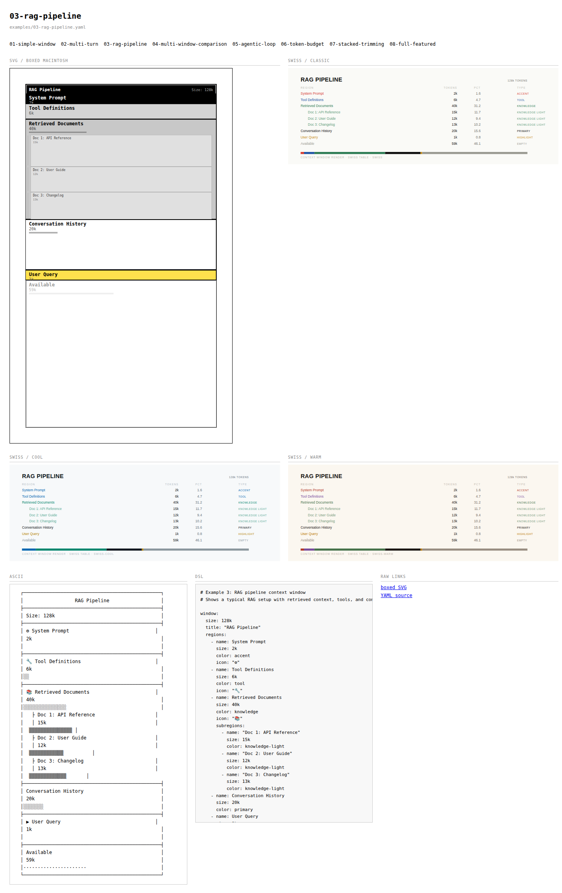
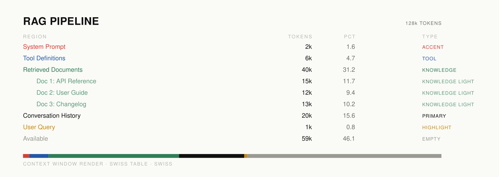
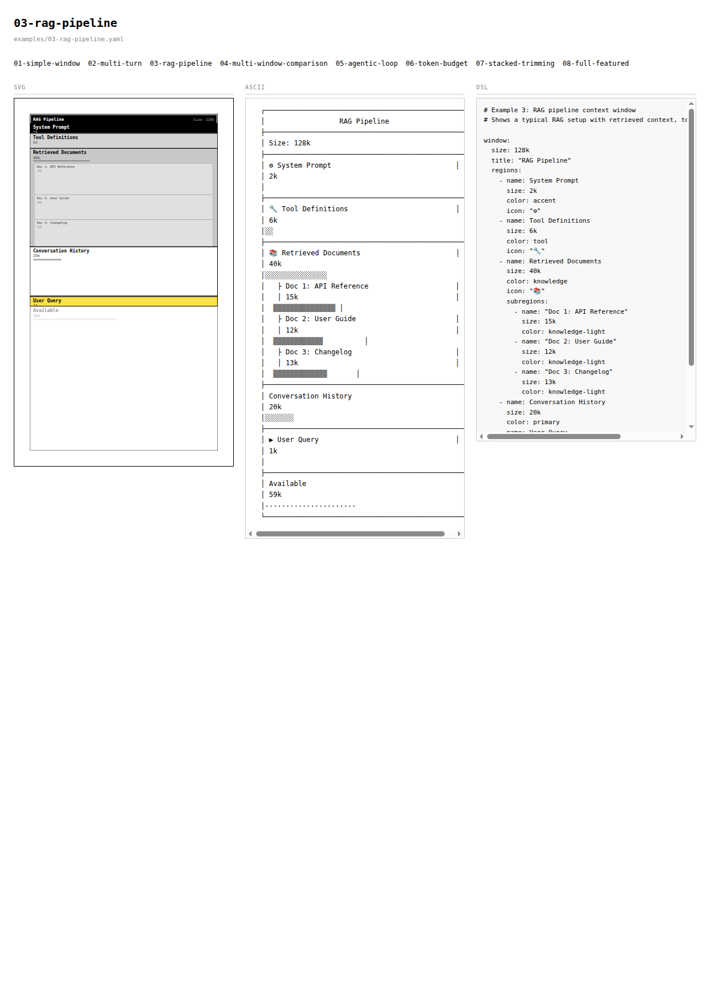
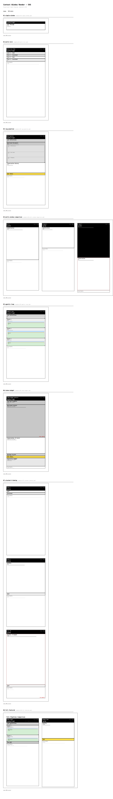
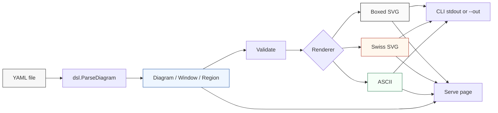
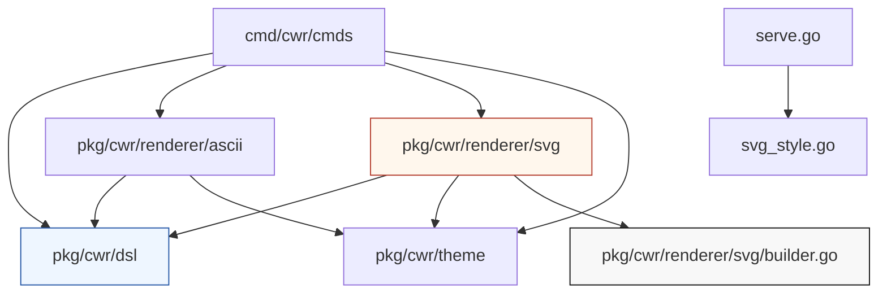

# Context Window Render

`context-window-render` is a Go command-line tool for describing LLM context windows in a compact YAML DSL and rendering those descriptions as diagrams. The project started with a simple requirement: write YAML that says how a model context window is divided into regions, then render the result as SVG, ASCII, and eventually PNG. The implementation now has two SVG families, an ASCII renderer, a validation pipeline, a Glazed-based CLI, and an HTTP preview server that shows boxed diagrams, Swiss typography diagrams, ASCII output, and the DSL source for each example.

> [!summary]
> - The project defines a small YAML DSL for context window budgets: windows, regions, subregions, token sizes, semantic colors, overflow markers, warnings, and layout hints.
> - The renderer has two visual directions: a boxed Macintosh-inspired proportional block diagram and a Swiss typography table with a compact segmented allocation line.
> - The implementation is intentionally decomposed into parsing, validation, theming, rendering, CLI command wiring, and browser preview serving.
> - The most useful design lesson is that exact accounting and visual scanning are different rendering goals. ASCII is best for auditability; boxed SVG is best for proportional structure; Swiss SVG is best for dense explanatory documents.

## Screenshots

The current per-diagram page shows all active render modes for one YAML file. The left side contains the boxed Macintosh-inspired SVG. The right and lower regions show Swiss typography variants, ASCII output, and the YAML source.



The Swiss renderer was added later as a second visual system. It uses aligned text columns, semantic color, indentation for nested data, and a compact horizontal allocation line at the bottom.



Two earlier screenshots are useful for understanding the progression. The first shows the intermediate 3-column grid page with SVG, ASCII, and YAML. The second shows an earlier SVG gallery view before the per-diagram page model replaced output-type galleries.





## Why this project exists

LLM context windows are often discussed as a single number: 8k, 32k, 128k, 200k, or a larger capacity. That single number is not enough to reason about how a prompt or agent execution uses context. A real context window contains system instructions, tool definitions, retrieved documents, examples, conversation history, scratch work, user input, and generation budget. These components compete for capacity. They also have different meanings: a 40k retrieved-context block is not the same kind of object as a 6k tool definition block or a 1k user query.

The goal of the project is to make those allocations explicit. A diagram should answer these questions without requiring the reader to inspect raw prompt text:

- What parts of the window are present?
- How large is each part relative to total capacity?
- Which regions are nested inside larger regions?
- Which regions represent overhead, retrieved knowledge, conversation history, tool use, available capacity, or output budget?
- Which regions are near capacity or overflowing?
- How does one model's context budget compare to another model's budget?

The project chooses a DSL-first approach because the diagram is a data structure before it is a picture. YAML is useful here because the intended users can edit it directly, compare it in git, and copy it into tickets or design documents. Rendering is a second step. This separation matters because the same YAML must support multiple output modes: text, boxed SVG, Swiss SVG, browser preview, and eventually PNG.

## Current project status

The repository lives at:

```text
/home/manuel/code/wesen/2026-06-04--context-window-render
```

The current implementation includes:

- A Go module: `github.com/go-go-golems/context-window-render`
- A Glazed CLI binary: `cwr`
- DSL parsing and validation in `pkg/cwr/dsl/`
- Theme definitions in `pkg/cwr/theme/`
- ASCII rendering in `pkg/cwr/renderer/ascii/`
- SVG rendering in `pkg/cwr/renderer/svg/`
- A fluent SVG builder in `pkg/cwr/renderer/svg/builder.go`
- A boxed SVG renderer in `pkg/cwr/renderer/svg/renderer.go`
- A Swiss typography SVG renderer in `pkg/cwr/renderer/svg/swiss.go`
- CLI commands in `cmd/cwr/cmds/`
- Eight example YAML files in `examples/`
- A docmgr ticket workspace under `ttmp/2026/06/04/CWR-001--context-window-render-yaml-dsl-and-go-renderer-for-context-window-diagrams/`

The active user-facing commands are:

```bash
# Validate a YAML diagram.
./cwr validate --file examples/03-rag-pipeline.yaml

# Render boxed SVG.
./cwr render --file examples/03-rag-pipeline.yaml --format svg --style boxed --out output/rag-boxed.svg

# Render Swiss typography SVG.
./cwr render --file examples/03-rag-pipeline.yaml --format svg --style swiss --out output/rag-swiss.svg

# Render ASCII.
./cwr render --file examples/03-rag-pipeline.yaml --format ascii

# Serve browser preview pages.
./cwr serve --dir examples --port 8080
```

The serve command exposes one page per YAML file:

```text
/              index listing diagrams
/d/{name}      boxed SVG + Swiss variants + ASCII + DSL source
/svg/{name}    raw boxed SVG
/yaml/{name}   raw YAML source
```

## The system in one diagram

The implementation is organized as a direct transformation pipeline. The parser creates a typed `Diagram`. Validation checks basic invariants. Each renderer consumes the same typed model and produces a different representation.



The architecture is deliberately small. There is no database, no long-running render worker, no frontend framework, and no template build step. The browser preview server calls the same renderers that the CLI uses. This makes the CLI and preview behavior easy to compare.

## The YAML DSL

The DSL has one primary concept: a context window is a fixed token capacity, and that capacity is partitioned into named regions. A region may contain subregions. Regions and subregions carry semantic metadata such as color, warning, note, overflow, and icon. The renderer decides how much of that metadata to use.

A simple diagram looks like this:

```yaml
window:
  size: 128k
  regions:
    - name: System Prompt
      size: 4k
      color: accent
    - name: User Message
      size: 12k
      color: primary
```

A richer RAG diagram introduces title, semantic color, and nested subregions:

```yaml
window:
  size: 128k
  title: "RAG Pipeline"
  regions:
    - name: System Prompt
      size: 2k
      color: accent
      icon: "⚙"
    - name: Tool Definitions
      size: 6k
      color: tool
      icon: "🔧"
    - name: Retrieved Documents
      size: 40k
      color: knowledge
      icon: "📚"
      subregions:
        - name: "Doc 1: API Reference"
          size: 15k
          color: knowledge-light
        - name: "Doc 2: User Guide"
          size: 12k
          color: knowledge-light
        - name: "Doc 3: Changelog"
          size: 13k
          color: knowledge-light
    - name: Conversation History
      size: 20k
      color: primary
    - name: User Query
      size: 1k
      color: highlight
      icon: "▶"
    - name: Available
      size: 59k
      color: empty
```

Multiple windows are represented with `windows:` plus a layout hint:

```yaml
layout: side-by-side
title: "Full Pipeline Comparison"
windows:
  - name: "ReAct Agent"
    size: 200k
    regions: [...]
  - name: "Simple Chat"
    size: 128k
    regions: [...]
```

The top-level shape is intentionally small:

| DSL concept | Purpose |
|---|---|
| `window` | Defines a single context window. |
| `windows` | Defines a set of windows rendered together. |
| `layout` | Tells renderers to use side-by-side or stacked placement. |
| `size` | Declares token capacity or region usage. |
| `regions` | Ordered top-level partition of the window. |
| `subregions` | Ordered child partition inside a region. |
| `color` | Semantic type name, not necessarily a literal color. |
| `warning` | Human-readable warning label. |
| `overflow` | Marks a region as over capacity or semantically overflowing. |
| `note` | Small supporting annotation. |

The word `color` is a shorthand for semantic class. Values such as `tool`, `knowledge`, `highlight`, and `empty` are not only palette choices. They represent categories that each renderer maps into visual properties.

## Typed representation in Go

The DSL becomes a typed Go model in `pkg/cwr/dsl/types.go`. The core types are `Diagram`, `Window`, `Region`, and `Size`.

```go
type Region struct {
    Name       string   `yaml:"name"`
    Size       Size     `yaml:"size"`
    Color      string   `yaml:"color,omitempty"`
    Icon       string   `yaml:"icon,omitempty"`
    Note       string   `yaml:"note,omitempty"`
    Warning    string   `yaml:"warning,omitempty"`
    Overflow   bool     `yaml:"overflow,omitempty"`
    Subregions []Region `yaml:"subregions,omitempty"`
}

type Window struct {
    Name            string   `yaml:"name,omitempty"`
    Size            Size     `yaml:"size"`
    Title           string   `yaml:"title,omitempty"`
    ShowPercentages *bool    `yaml:"show_percentages,omitempty"`
    ShowTokenCounts *bool    `yaml:"show_token_counts,omitempty"`
    Regions         []Region `yaml:"regions"`
}

type Diagram struct {
    Windows []Window `yaml:"windows,omitempty"`
    Window  *Window  `yaml:"window,omitempty"`
    Layout  string   `yaml:"layout,omitempty"`
    Title   string   `yaml:"title,omitempty"`
}
```

The `Size` type is a small but important part of the design. Human authors want to write `128k`, `4k`, or `2048`. Renderers want integer token counts. `Size` bridges those needs by implementing YAML marshal and unmarshal behavior.

```go
type Size int

func ParseSize(s string) (Size, error) {
    s = strings.TrimSpace(s)
    multiplier := 1
    lower := strings.ToLower(s)
    if strings.HasSuffix(lower, "k") {
        multiplier = 1024
        lower = strings.TrimSuffix(lower, "k")
    }
    var val int
    _, err := fmt.Sscanf(lower, "%d", &val)
    if err != nil {
        return 0, fmt.Errorf("invalid size %q: %w", s, err)
    }
    return Size(val * multiplier), nil
}
```

The parser accepts both strings and integers. This means all of the following are valid:

```yaml
size: 128k
size: "128k"
size: 2048
```

Validation is deliberately conservative. A window must have positive size. Region sizes must be non-negative. The sum of top-level regions cannot exceed the window. The sum of subregions cannot exceed the parent region.

```go
func validateWindow(w *Window) error {
    if w.Size <= 0 {
        return fmt.Errorf("window size must be positive, got %s", w.Size)
    }
    used := Size(0)
    for _, r := range w.Regions {
        if r.Size < 0 {
            return fmt.Errorf("region %q has negative size", r.Name)
        }
        used += r.Size
        subUsed := Size(0)
        for _, sr := range r.Subregions {
            if sr.Size < 0 {
                return fmt.Errorf("subregion %q of %q has negative size", sr.Name, r.Name)
            }
            subUsed += sr.Size
        }
        if len(r.Subregions) > 0 && subUsed > r.Size {
            return fmt.Errorf("subregions of %q total %s exceed region size %s", r.Name, subUsed, r.Size)
        }
    }
    if used > w.Size {
        return fmt.Errorf("regions total %s exceed window size %s", used, w.Size)
    }
    return nil
}
```

The validation layer caught real errors during implementation. One example file exceeded `128k` by several thousand tokens because the available budget was hand-computed incorrectly. Two multi-window examples initially used invalid YAML by placing `layout: stacked` inside the `windows:` sequence. These were not conceptual mistakes; they were exactly the sort of authoring errors a DSL validator should catch early.

## Rendering goals are not the same goal

The project now has three renderer families. They are not interchangeable skins. Each one optimizes for a different reading task.

| Renderer | Primary use | Strength | Weakness |
|---|---|---|---|
| ASCII | Terminal review and auditability | Exact labels, sizes, hierarchy, copyable output | Limited visual scale and browser presentation |
| Boxed SVG | Proportional structure | Shows spatial allocation and nested regions clearly | Can become crowded; small regions need label handling |
| Swiss SVG | Report and explanatory article layout | Dense, aligned, calm, exact numbers plus compact allocation line | Less spatially literal than the boxed view |

This distinction emerged during visual review. The first SVG version looked cleaner than the ASCII output, but it carried less information. It omitted parent labels for nested regions, hid several size labels, and did not show the same clear hierarchy as ASCII. The ASCII renderer was less polished visually, but it made every region and subregion auditable. The SVG renderer had to catch up on information before visual polish mattered.

The current direction is to preserve multiple renderers rather than force a single renderer to do everything. That decision reduces pressure on each view. The boxed SVG can remain structural. The Swiss view can remain typographic. The ASCII renderer can remain explicit and terminal-oriented.

## The ASCII renderer

The ASCII renderer lives in `pkg/cwr/renderer/ascii/renderer.go`. Its output uses box drawing characters, proportional fill characters, and indentation. It renders a window as a fixed-width text frame, then emits each region in a repeated pattern:

1. separator line
2. region label
3. size line
4. proportional fill line
5. optional subregion rows

For a region, the implementation computes the fill width from the same size ratio used by SVG:

```go
proportion := float64(reg.Size) / float64(w.Size)
fillCount := int(proportion * float64(innerWidth))
fillLine := strings.Repeat(fillChar, fillCount) + strings.Repeat(" ", emptyCount)
```

The character selected for the fill line is based on semantic color:

```go
switch reg.Color {
case "accent":
    fillChar = "█"
case "empty":
    fillChar = "·"
case "highlight":
    fillChar = "▓"
default:
    fillChar = "░"
}
```

This renderer became the reference for information content. When the SVG output looked weaker, the comparison was specific: ASCII showed parent labels, child indentation, exact counts, and sequence. The SVG needed to preserve those facts even if it did not preserve the exact text layout.

## The boxed SVG renderer

The boxed SVG renderer lives in `pkg/cwr/renderer/svg/renderer.go`. It renders regions as vertical blocks whose heights are proportional to token usage. Its current design is inspired by early Macintosh interface aesthetics: black title bars, crisp lines, monochrome fills, and a few semantic accents.

The renderer starts by choosing layout mode and window width:

```go
func (r *Renderer) layoutMode(d *dsl.Diagram) string {
    if d.Layout != "" {
        return d.Layout
    }
    if len(d.GetWindows()) == 1 {
        return "single"
    }
    return "side-by-side"
}
```

Each window is built as an element tree. The renderer computes a layout record for every region:

```go
for i, reg := range w.Regions {
    proportion := float64(reg.Size) / float64(w.Size)
    h := int(proportion * float64(baseContentHeight))
    if h < 24 {
        h = 24
    }
    layout[i] = regionLayout{y: y, height: h, region: reg}
    y += h + th.RegionGap
}
```

The minimum height matters. Pure proportional sizing would make small but important regions nearly invisible. A `1k` user query inside a `128k` window is less than 1% of the capacity. If rendered literally in an 800px content area, it would be roughly 6px high. That is too small for a label. The renderer therefore chooses a minimum visual height, accepting a small distortion in exchange for readability.

The boxed renderer now draws:

- an outer window rectangle
- an optional title bar
- top-level region rectangles
- parent labels and size labels for every top-level region
- proportional mini-bars inside regions
- nested subregion rectangles
- tree connector lines for subregions
- warning labels
- overflow styling through dashed strokes

The renderer was refactored after the initial version became too string-heavy. Instead of hand-formatting SVG with `fmt.Sprintf`, it now uses a small fluent builder.

## The fluent SVG builder

The builder lives in `pkg/cwr/renderer/svg/builder.go`. It defines a minimal SVG element model:

| Builder function | Element |
|---|---|
| `NewSVG(width, height)` | Root SVG document |
| `R(x, y, width, height)` | Rectangle |
| `L(x1, y1, x2, y2)` | Line |
| `T(x, y, content)` | Text |
| `G()` | SVG group |
| `F(...)` | Fragment that renders children without a wrapper |

A typical rectangle becomes:

```go
R(0, y, width, height).
    Fill(cs.Fill).
    Stroke(r.regionStroke(reg, cs)).
    StrokeWidth(float64(th.RegionBorderWidth)).
    Rx(float64(th.RegionCornerRadius))
```

A typical text element becomes:

```go
T(8, y+14, reg.Name).
    Fill(cs.Text).
    FontFamily(th.FontFamily).
    FontSize(th.FontSize).
    FontWeight("bold")
```

The builder is intentionally small. It is not a general-purpose SVG library. Its job is to remove low-level XML formatting from the renderer while keeping layout logic in Go. This makes renderer code easier to read because each line describes an element, not a string template.

The `Fragment` type is important. Many renderer functions want to return several sibling elements without introducing an extra `<g>`. `F(children...)` lets `buildRegion()` return a single `Element` while rendering multiple SVG nodes.

## The Swiss typography renderer

The Swiss renderer lives in `pkg/cwr/renderer/svg/swiss.go`. It is the second SVG visualization mode. It does not draw boxes around regions. It does not render vertical proportional blocks. It treats the diagram as an information table.

The renderer produces aligned columns:

```text
REGION                         TOKENS      PCT      TYPE
System Prompt                      2k      1.6      ACCENT
Tool Definitions                   6k      4.7      TOOL
Retrieved Documents               40k     31.2      KNOWLEDGE
    Doc 1: API Reference          15k     11.7      KNOWLEDGE LIGHT
    Doc 2: User Guide             12k      9.4      KNOWLEDGE LIGHT
    Doc 3: Changelog              13k     10.2      KNOWLEDGE LIGHT
Conversation History              20k     15.6      PRIMARY
User Query                         1k      0.8      HIGHLIGHT
Available                         59k     46.1      EMPTY
```

The visual rules are intentionally limited:

- Title text uses one large size and bold weight.
- Body rows use one body size and regular weight.
- Meta labels and type labels use one small size and regular weight.
- Region meaning is carried by color.
- Nesting is carried by indentation.
- Proportion is carried by a compact segmented line at the bottom.

The palette system is defined up front. There are three variants:

```go
func SwissPalettes() map[string]SwissPalette {
    return map[string]SwissPalette{
        "swiss":      {...},
        "swiss-cool": {...},
        "swiss-warm": {...},
    }
}
```

The three palettes share the same semantic keys. This means `knowledge`, `tool`, `highlight`, and `empty` remain stable categories while their colors change per palette.

The allocation line is short and thick. It appears after the table rows for a window. Each top-level region contributes one segment:

```go
func (r *SwissRenderer) lineChart(w dsl.Window, x, y, width, height int) Element {
    children := []Element{
        R(x, y, width, height).Fill(r.palette.Faint).Opacity(0.18),
    }

    cursor := x
    remainingWidth := width
    for i, reg := range w.Regions {
        segmentW := int(float64(reg.Size) / float64(w.Size) * float64(width))
        if segmentW < 1 && reg.Size > 0 {
            segmentW = 1
        }
        if i == len(w.Regions)-1 {
            segmentW = remainingWidth
        }
        children = append(children,
            R(cursor, y, segmentW, height).Fill(r.color(reg.Color)),
        )
        cursor += segmentW
        remainingWidth -= segmentW
    }

    return F(children...)
}
```

Two details are important. First, every non-zero region gets at least one pixel so it does not disappear. Second, the final segment receives the remaining width. This absorbs integer rounding error and guarantees that the allocation line exactly fills its intended width.

The Swiss renderer is useful because it combines exact accounting with a compact visual summary. The boxed SVG shows shape. The Swiss SVG shows a table.

## Theme system

The boxed renderer uses `pkg/cwr/theme/theme.go`. The default theme is named `macintosh-84`. It contains spacing, typography, title bar settings, border widths, warning styles, and semantic color mappings.

A color set contains fill, text, subtext, and optional border:

```go
type ColorSet struct {
    Fill    string `yaml:"fill"`
    Text    string `yaml:"text"`
    Subtext string `yaml:"subtext"`
    Border  string `yaml:"border,omitempty"`
}
```

This is a useful separation. The DSL says `color: knowledge`. The theme decides that `knowledge` maps to a particular fill and text pair. The Swiss renderer uses its own palette because it is text-first rather than box-first. The project now has two palette concepts:

- `theme.Theme` for boxed rendering
- `SwissPalette` for table rendering

These may eventually converge into a shared semantic theme system. For now, separate palette structs keep each renderer clear.

## CLI design with Glazed

The CLI uses Glazed commands. The main command setup is in `cmd/cwr/main.go`. Individual commands live in `cmd/cwr/cmds/`.

The render command exposes file, format, style, and output path:

```go
type RenderSettings struct {
    File   string `glazed:"file"`
    Format string `glazed:"format"`
    Style  string `glazed:"style"`
    Out    string `glazed:"out"`
}
```

The `--out` flag was chosen because Glazed already uses `--output` for its own structured output system. This was an early implementation issue: a first version used `--output` for file output and collided with Glazed's output format flag. The fix was to rename file output to `--out`.

SVG style selection is isolated in `cmd/cwr/cmds/svg_style.go`:

```go
func renderSVG(diagram *dsl.Diagram, th *theme.Theme, style string) (string, error) {
    switch style {
    case "", "boxed", "mac", "macintosh":
        return svg.NewRenderer(th).Render(diagram)
    case "swiss", "swiss-cool", "swiss-warm":
        return svg.NewSwissRenderer(th, style).Render(diagram)
    default:
        return "", fmt.Errorf("unsupported SVG style %q", style)
    }
}
```

This function is small, but it prevents style selection from leaking into render command logic. The command loads the diagram and delegates renderer selection to a helper. This will matter more if PNG output eventually supports multiple styles.

The current PNG path is incomplete. The command creates a temporary SVG and returns a row explaining that PNG requires `rsvg-convert` or similar integration. In practice, PNG previews were generated manually with Inkscape during development:

```bash
inkscape output/03-rag-swiss.svg \
  --export-type=png \
  --export-filename=output/03-rag-swiss.png \
  --export-dpi=160
```

A future implementation should either call an external converter explicitly or use a Go rasterization library.

## Preview server

The serve command is in `cmd/cwr/cmds/serve.go`. Its purpose is not to be a production web application. It is a local review tool. It watches a directory of YAML files, renders them into memory, and serves HTML pages.

The render cache stores all representations for each diagram:

```go
type svgVariant struct {
    Name  string
    Label string
    SVG   string
}

type renderedDiagram struct {
    Name          string
    File          string
    SVG           string
    SwissVariants []svgVariant
    ASCII         string
    YAML          string
    Error         string
}
```

The server currently renders:

- boxed SVG
- Swiss classic
- Swiss cool
- Swiss warm
- ASCII
- YAML source

The route design changed during development. The first browser gallery presented output types on separate pages: one SVG page and one ASCII page. That made comparison harder because the reader had to switch pages to compare the same YAML file. The current model is one URL per YAML file:

```text
/d/03-rag-pipeline
```

That page shows the active render outputs together. This is the right unit of comparison because all outputs are views of the same source model.

The server watches YAML files by polling modification times every 500ms. When a YAML file changes, it re-renders the in-memory cache. The browser does not auto-reload. The user refreshes manually. This was a deliberate UX correction: automatic page reloads were distracting during visual review.

## Historical progression

The project changed direction several times because each rendered output exposed a different weakness.

### 1. Initial DSL and examples

The first step was creating eight YAML examples:

1. simple single window
2. multi-turn conversation
3. RAG pipeline
4. multi-window comparison
5. agentic loop
6. token budget
7. stacked history trimming
8. full-featured complex diagram

These examples were not only demos. They were test cases for the DSL. They forced the parser to support single and multiple windows, stacked and side-by-side layouts, nested subregions, warnings, overflow markers, and percentage display.

### 2. ASCII became the information baseline

The ASCII renderer was easy to read because it rendered everything as text. It showed parent labels, exact sizes, subregion order, and proportional fill lines. When the first SVG output was compared against ASCII, the SVG looked visually cleaner but omitted too much information. That comparison changed the direction of the SVG work.

### 3. Boxed SVG gained missing accounting details

The boxed renderer was updated to show parent labels even when a region had subregions. It gained separators, size labels, mini fill bars, and tree connector lines. This made it closer to the ASCII representation while keeping its spatial proportional structure.

### 4. Browser preview moved from output pages to diagram pages

The first preview layout separated SVG and ASCII by output type. That was useful for scanning all SVGs, but it was not useful for comparing renderers. The current route model is better: one page per YAML file, all renderings together.

### 5. Swiss SVG separated table reading from block reading

The Swiss renderer was added because the boxed renderer was not the right format for every document. Some reports need exact aligned numbers more than block geometry. The Swiss renderer makes token counts and percentages primary while still showing a small proportional allocation line.

## Implementation failures and corrections

The project has several useful failure modes worth preserving.

### Glazed flag collision

The first render command used `--output` as the file path flag. Glazed already reserves `--output` for output format control. The command failed with a duplicate flag error. The file path flag became `--out`.

### YAML shape error

Early multi-window examples placed `layout: stacked` inside the `windows:` sequence. That is invalid YAML structure. The correct shape is:

```yaml
layout: stacked
windows:
  - name: "Turn 1"
    size: 128k
    regions: [...]
```

This matters because the top-level `Diagram` struct expects `Layout` and `Windows` as sibling fields.

### Hand-computed token sum error

The token budget example exceeded its declared window size. Validation caught the mistake. This is the reason validation should remain part of the parser path rather than being a separate optional command.

### SVG string generation became hard to maintain

The first SVG renderer was built with `fmt.Sprintf` and `strings.Builder`. That was acceptable for a prototype, but it made the renderer difficult to reorganize. The fluent builder was introduced to separate SVG syntax from renderer layout logic.

### `.gitignore` ignored source files

The original `.gitignore` contained:

```gitignore
cwr
```

That ignored every path component named `cwr`, including files under `pkg/cwr/...`. New source files such as `pkg/cwr/renderer/svg/swiss.go` did not appear in `git status`. The fix was:

```gitignore
/cwr
```

This ignores only the root binary.

## Internal implementation map

The most important files are:

| Path | Role |
|---|---|
| `pkg/cwr/dsl/types.go` | Typed DSL model, size parsing, validation. |
| `pkg/cwr/dsl/parser.go` | YAML file loading and parser entrypoint. |
| `pkg/cwr/theme/theme.go` | Boxed renderer theme and semantic color sets. |
| `pkg/cwr/renderer/ascii/renderer.go` | Terminal-oriented ASCII renderer. |
| `pkg/cwr/renderer/svg/builder.go` | Fluent SVG element builder. |
| `pkg/cwr/renderer/svg/renderer.go` | Boxed proportional SVG renderer. |
| `pkg/cwr/renderer/svg/swiss.go` | Swiss typography SVG renderer and palettes. |
| `cmd/cwr/cmds/render.go` | Glazed render command. |
| `cmd/cwr/cmds/svg_style.go` | SVG style dispatch helper. |
| `cmd/cwr/cmds/serve.go` | Local browser preview server. |
| `cmd/cwr/cmds/validate.go` | Validation and examples commands. |
| `examples/*.yaml` | DSL examples and renderer test cases. |

The core dependency direction is important:



Renderers depend on the DSL. The DSL does not know about renderers. This makes the YAML model stable even as output modes change.

## What an intern should understand first

The essential implementation idea is this:

```text
YAML source
  -> typed Diagram
  -> validation
  -> renderer-specific layout
  -> renderer-specific output string
```

A new engineer should not start by editing SVG styling. They should start by understanding `Diagram`, `Window`, and `Region`. Once those are clear, each renderer becomes a transformation from the same typed input into a different output language.

The second idea is that region sizes are token counts, not pixels. Every renderer must decide how token counts become visible form. The ASCII renderer converts token counts into character counts. The boxed SVG renderer converts token counts into vertical pixel heights. The Swiss renderer converts token counts into table numbers and line-chart segment widths. These are different layout algorithms over the same data.

The third idea is that semantic color names are not presentation values. The DSL says `knowledge`. A renderer maps `knowledge` into a fill, text color, or Swiss table color. This is the right boundary because it lets the same YAML work in multiple visual systems.

## Pseudocode for adding a new renderer

A future renderer should follow this shape:

```text
function Render(diagram):
    windows = diagram.GetWindows()
    layout = chooseLayout(diagram)
    output = newDocument()

    for each window in windows:
        windowLayout = computeWindowLayout(window)
        output.add(renderWindow(window, windowLayout))

    return output.String()
```

For a renderer with spatial layout:

```text
function computeWindowLayout(window):
    y = 0
    for region in window.regions:
        height = region.size / window.size * baseHeight
        height = max(height, minimumReadableHeight)
        assign region rectangle at y,height
        y += height + gap
    return rectangles
```

For a renderer with table layout:

```text
function windowRows(window):
    rows = []
    for region in window.regions:
        rows.append(row(region, indent=0))
        for subregion in region.subregions:
            rows.append(row(subregion, indent=1))
    return rows
```

The renderer should not parse YAML. It should not validate token sums. It should not decide whether `128k` means 128,000 or 131,072. Those decisions belong to the DSL package.

## Design rules that emerged

The implementation has accumulated several working rules:

- A renderer must preserve names, sizes, and hierarchy unless it explicitly declares itself a summary view.
- A renderer may distort spatial proportions to preserve label readability, but it must still show exact token counts somewhere.
- A semantic color name is part of the data model; a hex color is part of a theme or palette.
- The browser preview should compare renderers per YAML file, not per output type.
- The CLI should expose renderer choices with simple flags, not separate binaries.
- The examples directory is part of the test surface; every renderer should handle every example.
- Validation should run during parse so invalid diagrams fail before rendering.

## Current limitations

The project is useful but not finished.

PNG output is not integrated. SVG is generated correctly, and PNG previews can be created with Inkscape, but `cwr render --format png` does not yet produce a PNG.

The DSL has no schema file. A JSON Schema or YAML-language-server schema would improve editing. The Go validator catches errors after parsing, but an editor schema would catch many mistakes earlier.

The boxed SVG renderer still has limited label strategy for very dense diagrams. Minimum region heights help, but a fully robust renderer would need external labels, clipping rules, or tooltips.

The Swiss allocation line has no hover titles or labels. The line is useful visually, but a browser user cannot inspect a segment directly.

The palette system is split. Boxed rendering uses `theme.Theme`; Swiss rendering uses `SwissPalette`. This is acceptable for now, but a future theme system could unify semantic roles across renderers.

The server polls file modification times. That is adequate for a local preview tool, but a filesystem watcher would be more efficient and immediate.

## Near-term next steps

The next practical improvements are:

1. Implement PNG output by calling an installed converter (`rsvg-convert`, Inkscape, or another explicit tool) and writing the result to `--out`.
2. Add a JSON Schema for the DSL.
3. Add hover `<title>` elements to SVG regions and Swiss allocation segments.
4. Add a `--style` selector to the serve page so a user can focus on one visual direction at a time.
5. Add snapshot-style render checks for the examples.
6. Expand validation to catch unknown semantic colors and duplicate region names.
7. Write the full docmgr design guide and upload the ticket bundle to reMarkable.

## Closing

`context-window-render` is small, but it has a clear internal boundary: YAML describes the context window, Go validates and normalizes the data, and renderers choose how to represent the same typed model. That boundary is the reason the project could evolve quickly from ASCII to boxed SVG to Swiss typography without rewriting the DSL.

The main technical lesson is that context-window diagrams need both accounting and presentation. Accounting requires exact token counts, hierarchy, and validation. Presentation requires visual emphasis, typography, color, and layout. Treating those as separate renderer concerns keeps the system extensible.
