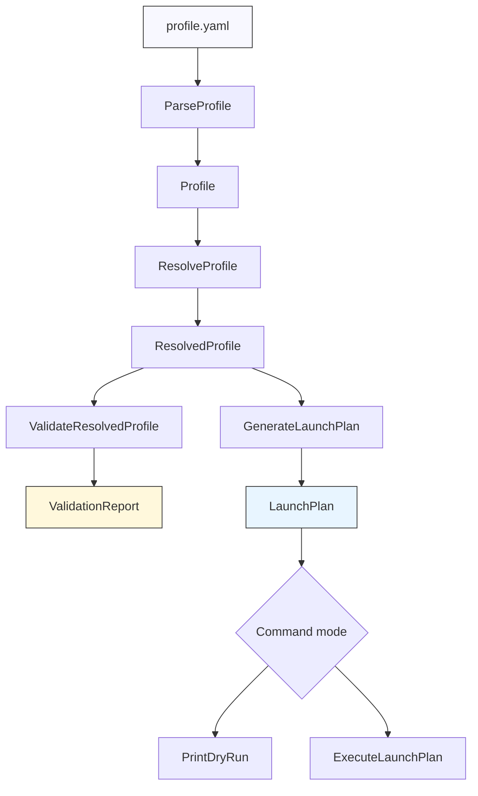

# pi-launcher: Declarative YAML Profiles for Pi

`pi-launcher` is a Go command-line tool that launches the `pi` coding agent from one explicit local YAML profile. The project is small by design. It does not define a profile registry, does not merge inherited files, does not write `settings.json`, and does not embed the Pi SDK. Its job is to compile a checked YAML document into a deterministic `pi` process invocation.

> [!summary]
> `pi-launcher` is a compiler for launch-time agent configuration.
> 1. A YAML profile is parsed with strict field checking.
> 2. Local paths are resolved relative to the profile file.
> 3. The resolved profile is validated before any subprocess is started.
> 4. A launch plan is rendered as deterministic argv, dry-run output, or an executed `pi` process.

The repository is `/home/manuel/workspaces/2026-06-04/pi-launcher/pi-launcher`. The implementation is tracked by the docmgr ticket `PI-LAUNCHER-001`, whose design documents and diary live under `ttmp/2026/06/04/PI-LAUNCHER-001--declarative-pi-launcher-yaml-based-agent-configuration/`.

## Why this project exists

Pi already has a capable command-line interface. It also has persistent configuration, local discovery directories, packages, extensions, skills, prompt templates, themes, and model/provider options. Those capabilities are useful, but they make a repeated launch configuration difficult to review when it is spread across shell history, global settings, local settings, package installation state, and ad hoc flags.

`pi-launcher` narrows the problem. It asks for one YAML file and turns that file into the same flags a human could have typed. This gives the launch configuration a reviewable artifact. It can be committed, copied, dry-run, linted, and discussed in a pull request. The launcher does not try to replace Pi configuration. It provides an explicit launch layer for cases where the exact launch state should be visible.

The project also records a useful engineering rule: a wrapper around an interactive CLI should not become an alternate runtime too early. The MVP keeps the boundary at the process boundary. The launcher prepares argv and starts `pi`; Pi remains responsible for the terminal UI, model runtime, resource loading, session behavior, and agent execution.

## Current status

The MVP is implemented and tested. The repository has passed the Makefile quality gate:

```bash
make lint test
```

The current commits include:

```text
e98533a PI-LAUNCHER-001: Switch examples to OpenAI Codex defaults
4593880 PI-LAUNCHER-001: Remove extension paths schema
00f2cb9 PI-LAUNCHER-001: Load Umans provider in examples
98665dc PI-LAUNCHER-001: Add extension source support
d327555 PI-LAUNCHER-001: Add playful example profiles
9da2895 PI-LAUNCHER-001: Add Umans GLM example profile catalog
8a6ae5e PI-LAUNCHER-001: Fix GOWORK off lint dependencies
f6c5638 PI-LAUNCHER-001: Add getting started and user guide help docs
5d7daf6 PI-LAUNCHER-001: Add examples docs and integration validation
8563b08 PI-LAUNCHER-001: Add run command and subprocess execution
fdd5666 PI-LAUNCHER-001: Add Glazed validate command
a03ea56 PI-LAUNCHER-001: Add launch plan generation and dry-run rendering
2d111e3 PI-LAUNCHER-001: Add profile resolution and validation
9f7d64f PI-LAUNCHER-001: Add profile schema and strict YAML parser
cac50fc PI-LAUNCHER-001: De-template repo and add Glazed root command
e977fc8 PI-LAUNCHER-001: Align task list with refined MVP guide
```

The current default examples use:

```yaml
provider: openai-codex
model: gpt-5.3-codex-spark
```

The current extension schema uses `extensions.sources`, not `extensions.paths`:

```yaml
extensions:
  discovery: false
  sources:
    - ./extensions/review-gate.ts
    - npm:@example/pi-package
```

`paths` remains supported for skills, prompt templates, and themes because Pi documents those flags as path-based flags:

```yaml
skills:
  discovery: false
  paths:
    - ./skills/review-checklist

promptTemplates:
  discovery: false
  paths:
    - ./prompts/review.md

themes:
  discovery: true
  paths:
    - ./themes/calm.json
```

## The central design decision

The important design decision is that `pi-launcher` is a compiler, not a configuration manager. A compiler has an input, a sequence of transformations, diagnostics, and an output. That framing gives the project a stable shape:

```text
profile.yaml
  -> strict parse
  -> profile-relative path resolution
  -> validation report
  -> deterministic launch plan
  -> dry-run text or pi subprocess
```

The project does not install packages, update global settings, discover named profiles, or reconcile project configuration. Those behaviors would require state management. The MVP avoids them. The launcher only reads the requested file, resolves references from that file, and launches a process.

That boundary matters because the tool is intended to be predictable. If `pi-launcher run ./examples/review.yaml --dry-run` prints an argv vector, the reader should be able to understand where every argument came from. There should be no hidden inheritance, no implicit profile name lookup, and no settings merge logic in the launcher.

## System architecture

The implementation is organized around four packages:

| Package | Responsibility | Key files |
| --- | --- | --- |
| `pkg/profile` | Parse, resolve, and validate YAML profiles. | `types.go`, `parse.go`, `resolve.go`, `validate.go` |
| `pkg/launch` | Convert a resolved profile into argv, render dry-runs, and execute subprocesses. | `plan.go`, `generate.go`, `dryrun.go`, `exec.go` |
| `pkg/commands` | Expose `validate` and `run` as CLI commands. | `validate.go`, `run.go` |
| `pkg/app` and `pkg/doc` | Assemble the root command and embedded Glazed help docs. | `root.go`, `pkg/doc/doc.go`, `pkg/doc/topics/`, `pkg/doc/tutorials/` |

The data flow is direct:



The diagram is also the review order. A reviewer can read the code in the same sequence: `pkg/profile/types.go`, `pkg/profile/parse.go`, `pkg/profile/resolve.go`, `pkg/profile/validate.go`, `pkg/launch/generate.go`, and then the command wrappers.

## Profile schema

The raw profile type is defined in `pkg/profile/types.go`. It is intentionally close to Pi's launch-time flags:

```go
type Profile struct {
    Name               string          `yaml:"name"`
    Provider           string          `yaml:"provider"`
    Model              string          `yaml:"model"`
    Thinking           string          `yaml:"thinking"`
    ScopedModels       []string        `yaml:"scopedModels"`
    Tools              []string        `yaml:"tools"`
    ExcludeTools       []string        `yaml:"excludeTools"`
    NoTools            bool            `yaml:"noTools"`
    NoBuiltinTools     bool            `yaml:"noBuiltinTools"`
    Extensions         *ExtensionBlock `yaml:"extensions"`
    Skills             *ResourceBlock  `yaml:"skills"`
    PromptTemplates    *ResourceBlock  `yaml:"promptTemplates"`
    Themes             *ResourceBlock  `yaml:"themes"`
    ContextFiles       *bool           `yaml:"contextFiles"`
    SystemPrompt       string          `yaml:"systemPrompt"`
    AppendSystemPrompt []string        `yaml:"appendSystemPrompt"`
    Mode               string          `yaml:"mode"`
    Session            *SessionBlock   `yaml:"session"`
    ExtraArgs          []string        `yaml:"extraArgs"`
}
```

The separate `ExtensionBlock` is a recent correction:

```go
type ExtensionBlock struct {
    Discovery *bool    `yaml:"discovery"`
    Sources   []string `yaml:"sources"`
}
```

Extensions use `sources` because Pi's `--extension/-e` flag accepts local files, local package directories, npm specs, git specs, and URL specs. Skills, prompt templates, and themes use `paths` because Pi's corresponding flags are path-based:

```go
type ResourceBlock struct {
    Discovery *bool    `yaml:"discovery"`
    Paths     []string `yaml:"paths"`
}
```

This split removes an ambiguity that existed during implementation. When extensions shared the same `ResourceBlock` as skills, the schema could accept `extensions.paths` even though `extensions.sources` was the better representation. Splitting the type makes invalid YAML fail during strict parsing.

## Strict parsing

`ParseProfile` uses `yaml.Decoder.KnownFields(true)`:

```go
func ParseProfile(path string) (*Profile, error) {
    f, err := os.Open(path)
    if err != nil {
        return nil, fmt.Errorf("open profile %q: %w", path, err)
    }
    defer func() { _ = f.Close() }()

    decoder := yaml.NewDecoder(f)
    decoder.KnownFields(true)

    var p Profile
    if err := decoder.Decode(&p); err != nil {
        return nil, fmt.Errorf("parse profile %q: %w", path, err)
    }

    return &p, nil
}
```

Strict parsing is important because profile files are user-authored configuration. Silent acceptance of misspelled fields would create a dangerous failure mode: the user would think a launch option was active, while the launcher would ignore it. Strict parsing turns that into a parse error.

This is why `extensions.paths` is now rejected. The user must write:

```yaml
extensions:
  discovery: false
  sources:
    - ./extensions/local.ts
    - npm:@example/pi-package
```

and not:

```yaml
extensions:
  paths:
    - ./extensions/local.ts
```

The error is intentional. It keeps the schema small and explicit.

## Resolution

Parsing gives the raw YAML shape. Resolution turns that raw shape into values that can be used safely by validation and launch generation. `ResolvedProfile` carries both the original raw profile and the resolved fields:

```go
type ResolvedProfile struct {
    Raw                 *Profile
    ProfilePath         string
    ProfileDir          string
    ExtensionSources    []string
    SkillPaths          []string
    PromptTemplatePaths []string
    ThemePaths          []string
    SessionDir          string
    SystemPromptText    string
    AppendSystemPrompts []string
    Findings            []Finding
}
```

The resolver has three jobs.

First, it records the absolute profile path and the profile directory. Relative filesystem references should be resolved relative to the YAML file, not the shell's current directory. This rule makes profiles portable: moving a profile and its nearby assets together preserves their relationship.

Second, it resolves resource references. For skills, prompt templates, and themes, every `paths` entry becomes an absolute local path. For extension sources, package specs pass through while local sources become absolute paths:

```go
func resolveExtensionSources(profileDir string, block *ExtensionBlock) []string {
    if block == nil {
        return nil
    }
    sources := make([]string, 0, len(block.Sources))
    for _, source := range block.Sources {
        if IsPackageSource(source) {
            sources = append(sources, source)
            continue
        }
        sources = append(sources, ResolvePath(profileDir, source))
    }
    return sources
}
```

`IsPackageSource` currently recognizes `npm:`, `git:`, `https://`, `http://`, `ssh://`, and `git://`. Those strings are not local paths, so validation does not call `os.Stat` on them.

Third, the resolver loads Markdown prompt files. `systemPrompt` and entries in `appendSystemPrompt` can be inline text or Markdown paths. Markdown values are read before launch generation so the launch plan contains final prompt text, not a file reference.

## Validation

Validation produces structured findings. A finding has a severity, code, field, optional path, and message:

```go
type Finding struct {
    Severity Severity `json:"severity"`
    Code     string   `json:"code"`
    Field    string   `json:"field,omitempty"`
    Path     string   `json:"path,omitempty"`
    Message  string   `json:"message"`
}
```

The current validator checks:

| Check | Finding code | Reason |
| --- | --- | --- |
| `mode` is one of `interactive`, `print`, `json`, `rpc`, or empty. | `invalid_mode` | The launch generator only maps these modes. |
| `thinking` is one of `off`, `minimal`, `low`, `medium`, `high`, `xhigh`, or empty. | `invalid_thinking` | Unknown thinking levels should not silently pass. |
| `noTools` is not combined with `tools`. | `conflicting_tools` | `noTools` disables all tools, so an allow-list would be contradictory. |
| `noTools` combined with `noBuiltinTools` emits a warning. | `no_tools_dominates` | The second flag is redundant when all tools are disabled. |
| Local extension sources exist. | `source_not_found` | Local sources are resolved to paths and checked. |
| Skill, prompt-template, and theme paths exist. | `path_not_found` | Path-based resources should fail before launch. |
| Markdown prompt files are readable. | `prompt_file_unreadable` | Prompt text must be available before argv generation. |

Remote or package extension sources are validated syntactically by prefix recognition only. The launcher does not install packages and does not check remote availability. That work remains Pi's responsibility when it processes the `--extension` source.

## Launch plan generation

`GenerateLaunchPlan` converts a `ResolvedProfile` into a `LaunchPlan`:

```go
type LaunchPlan struct {
    Executable string
    Cwd        string
    Args       []string
    Env        []string
}
```

The default executable is `pi`. The default working directory is the profile directory. The default environment is `os.Environ()`.

Argument order is deterministic. This is one of the most important properties of the implementation because it makes dry-run output reviewable and tests stable. The order is:

1. provider, model, thinking, and scoped models
2. tool flags
3. resource flags
4. context-file flag
5. system prompt flags
6. mode flag
7. session flags
8. `extraArgs`
9. prompt arguments passed to `pi-launcher run`

The generator contains no Cobra or Glazed code. It is a pure transformation from resolved profile plus prompt arguments to launch plan. That separation is why it can be tested without invoking a terminal process.

A representative profile fragment:

```yaml
provider: openai-codex
model: gpt-5.3-codex-spark
extensions:
  discovery: false
  sources:
    - npm:@example/pi-package
mode: print
session:
  noSession: true
```

becomes the following argv sequence:

```text
--provider openai-codex
--model gpt-5.3-codex-spark
--no-extensions
--extension npm:@example/pi-package
--print
--no-session
```

The dry-run renderer prints both the vector form and a shell-safe one-line command. The vector form is the primary review artifact because it avoids ambiguity around shell quoting.

## Command design

The CLI has two user-facing verbs: `validate` and `run`.

`validate` is a Glazed command because validation findings are structured rows. It can render table output for humans and JSON output for scripts:

```bash
pi-launcher validate ./examples/review.yaml
pi-launcher validate ./examples/review.yaml --output json
```

When no findings exist, the command emits one `ok` row. When errors exist, it emits rows and returns an error. With `--strict`, warnings also cause a non-zero exit.

`run` is a plain Cobra command because it may hand the terminal to an interactive process. Its flow is:

```text
run <profile.yaml> [prompt...]
  -> ParseProfile
  -> ResolveProfile
  -> ValidateResolvedProfile
  -> if errors: print findings and stop
  -> GenerateLaunchPlan
  -> if --dry-run: PrintDryRun
  -> otherwise: ExecuteLaunchPlan
```

The run command supports:

```bash
pi-launcher run ./examples/review.yaml --dry-run "review this repository"
pi-launcher run ./examples/review.yaml --pi /path/to/pi -- "prompt text"
pi-launcher run ./examples/review.yaml --cwd /workdir "prompt text"
```

The subprocess executor uses `exec.CommandContext` and inherits stdin, stdout, and stderr. This preserves Pi's interactive behavior rather than trying to capture or reinterpret the terminal session.

## Examples as documentation

The `examples/` directory is a documentation surface, not just test input. The examples include ordinary profiles, package-source examples, local-resource examples, prompt-composition examples, and playful persona examples:

```text
examples/minimal-print.yaml
examples/review.yaml
examples/review-interactive.yaml
examples/local-resources.yaml
examples/package-sources.yaml
examples/prompts.yaml
examples/json-output.yaml
examples/session-persistent.yaml
examples/tools-readonly.yaml
examples/fun-clown-coach.yaml
examples/fun-noir-detective.yaml
examples/fun-pirate-docs.yaml
examples/fun-rubber-duck.yaml
examples/fun-zen-gardener.yaml
```

Each profile is commented so that a user can copy it and edit it without having to cross-reference the README for every field. The examples now default to:

```yaml
provider: openai-codex
model: gpt-5.3-codex-spark
```

The examples also include local assets under `examples/assets/` so that resource-path examples validate without requiring additional setup. This matters because broken examples teach the wrong behavior. If a user starts by running `pi-launcher validate examples/local-resources.yaml`, the command should confirm that the profile is structurally correct.

## Embedded help

The binary embeds Glazed help pages through `pkg/doc`:

```go
//go:embed *
var docFS embed.FS

func AddDocToHelpSystem(helpSystem *help.HelpSystem) error {
    return helpSystem.LoadSectionsFromFS(docFS, ".")
}
```

The root command loads those docs and registers Glazed help:

```go
helpSystem := help.NewHelpSystem()
if err := doc.AddDocToHelpSystem(helpSystem); err != nil {
    return nil, err
}
help_cmd.SetupCobraRootCommand(helpSystem, rootCmd)
```

The important help pages are:

```text
pkg/doc/tutorials/01-getting-started.md
pkg/doc/topics/01-validate-command.md
pkg/doc/topics/02-user-guide.md
```

This makes the binary self-documenting. A user can run:

```bash
pi-launcher help getting-started
pi-launcher help user-guide
pi-launcher help validate-command
```

The README remains useful, but the CLI itself carries the main onboarding path.

## Testing strategy

The test suite follows the compiler structure.

Profile tests cover:

- minimal parsing
- full-profile parsing
- unknown top-level fields
- unknown nested fields
- explicit rejection of `extensions.paths`
- profile-relative path resolution
- Markdown prompt loading
- validation errors and warnings
- extension source resolution and validation

Launch tests cover:

- deterministic argv order
- `noTools` dominance
- interactive/default mode behavior
- JSON/RPC/print mode flag mapping
- shell quoting
- mock executable subprocess execution

Command tests cover:

- validation report construction
- finding row conversion
- launch-plan construction through command helpers
- finding rendering

The mock executable test is especially important. It verifies that `ExecuteLaunchPlan` can run a `pi` executable found through `PATH`, pass argv correctly, set the working directory, and preserve child environment values. A failure in this test revealed a Go `os/exec` detail: executable lookup uses the parent process environment, not only the `cmd.Env` assigned to the child. The fix was to set `PATH` in the test process with `t.Setenv` before invoking the executor.

The final validation command is:

```bash
make lint test
```

The Makefile runs with `GOWORK=off`. This exposed an important dependency issue after Glazed was added: workspace-based tests passed because the parent `go.work` pointed at a local `glazed` checkout, while the Makefile used module mode and needed complete `go.sum` entries. The fix was:

```bash
GOWORK=off go mod tidy
```

That made the module self-contained under the same conditions used by the repository quality gate.

## What changed during design

The project began with a broader research pass. The early design considered profile composition, settings-file integration, package references, and richer resource declarations. The implementation deliberately narrowed scope after review.

The most important reductions were:

| Removed or deferred | Reason |
| --- | --- |
| `extends` and includes | Merge semantics create ordering, conflict, and cycle-detection problems. |
| Named profile lookup | The MVP should be one explicit local file. |
| `settings.json` generation | Pi settings are persistent state; the launcher is launch-time state. |
| SDK embedding | The process boundary is simpler and preserves Pi's interactive behavior. |
| Global package management | Installation and reconciliation belong to Pi's package commands. |

The later addition of `extensions.sources` did not violate the MVP boundary because sources are passed to Pi as `--extension` flags. The launcher still does not install or reconcile packages. It only validates local sources and passes package specs through.

## Why `extensions.sources` and not `extensions.paths`

This deserves a separate explanation because it changed late in the project.

Pi documents `--extension <source>` as accepting local paths, npm specs, git specs, and URLs. That means an extension input is not only a filesystem path. It is a source string. If the YAML schema exposes both `paths` and `sources`, users must learn two fields for one Pi flag.

The final schema is therefore:

```yaml
extensions:
  discovery: false
  sources:
    - ./extensions/local.ts
    - npm:@example/pi-package
```

For skills, prompt templates, and themes, the schema remains path-based because the Pi flags are path-based:

```yaml
skills:
  discovery: false
  paths:
    - ./skills/review-checklist
```

The rule is consistent when stated in terms of Pi flags:

| YAML field | Pi flag | Accepted value type |
| --- | --- | --- |
| `extensions.sources[]` | `--extension` | local path, npm spec, git spec, URL |
| `skills.paths[]` | `--skill` | local path |
| `promptTemplates.paths[]` | `--prompt-template` | local path |
| `themes.paths[]` | `--theme` | local path |

The launcher follows Pi's CLI contract rather than imposing a uniform YAML shape across resources.

## Operational behavior

A typical validation run:

```bash
pi-launcher validate ./examples/review.yaml --output json
```

returns an `ok` row if the profile has no findings:

```json
[
  {
    "code": "valid",
    "field": "",
    "message": "profile is valid",
    "path": "",
    "severity": "ok"
  }
]
```

A typical dry-run:

```bash
pi-launcher run ./examples/review.yaml --dry-run "review this repository"
```

prints the executable, working directory, argument list, and shell command. The argument list is the more precise representation:

```text
Executable: pi
Working dir: /path/to/pi-launcher/examples

Arguments:
  --provider
  openai-codex
  --model
  gpt-5.3-codex-spark
  --thinking
  medium
  --models
  openai-codex/gpt-5.3-codex-spark,gpt-4o
  --tools
  read,grep,find,ls
  --exclude-tools
  ask_question
  --print
  --no-session
  --name
  review
  review this repository
```

The exact output changes with the profile, but the ordering rule does not change.

## Failure modes and how the implementation handles them

### Misspelled YAML fields

Misspelled fields fail during parsing because `KnownFields(true)` is enabled. This catches mistakes such as `promptTemplate` instead of `promptTemplates`, `args` instead of `extraArgs`, or the removed `extensions.paths` field.

### Relative paths from the wrong directory

All local paths resolve relative to the profile file. This avoids dependence on the shell's current working directory. A profile under `examples/` can refer to `./assets/prompts/system.md`, and the same command works from the repository root or another directory if the profile path is correct.

### Package sources mistaken for local paths

Extension sources with prefixes such as `npm:` and `git:` pass through without filesystem validation. Local extension sources without those prefixes resolve to filesystem paths and are checked with `os.Stat`.

### Tool conflicts

`noTools: true` combined with `tools:` is an error. `noTools: true` combined with `noBuiltinTools: true` is a warning because the second setting is redundant.

### Interactive subprocess behavior

The `run` command does not capture Pi's terminal UI. It inherits stdin, stdout, and stderr. This is necessary for interactive mode and is why `run` is not implemented as a Glazed row-output command.

### Workspace-hidden dependency problems

The repository lives near a parent Go workspace. Tests run in workspace mode can hide missing module sums. The Makefile forces `GOWORK=off`, so the final gate must be the Makefile target, not only `go test ./...`.

## Current user-facing command set

The current command set is intentionally small:

```bash
pi-launcher validate <profile.yaml> [--strict] [--output json]
pi-launcher run <profile.yaml> [prompt...] [--dry-run] [--verbose] [--pi PATH] [--cwd DIR]
pi-launcher help getting-started
pi-launcher help user-guide
pi-launcher help validate-command
```

The command set is enough for the intended loop:

1. Copy or write a profile.
2. Run `validate`.
3. Run `run --dry-run`.
4. Run without `--dry-run`.

## Important files

| File or directory | Why it matters |
| --- | --- |
| `pkg/profile/types.go` | Defines the accepted YAML schema. |
| `pkg/profile/parse.go` | Enforces strict YAML parsing. |
| `pkg/profile/resolve.go` | Resolves local paths, extension sources, session dirs, and Markdown prompts. |
| `pkg/profile/validate.go` | Produces structured validation findings. |
| `pkg/launch/generate.go` | Converts resolved profiles to deterministic Pi argv. |
| `pkg/launch/dryrun.go` | Renders reviewable dry-run output. |
| `pkg/launch/exec.go` | Executes Pi with inherited terminal stdio. |
| `pkg/commands/validate.go` | Exposes validation as a Glazed row-output command. |
| `pkg/commands/run.go` | Exposes process execution as a custom Cobra command. |
| `pkg/doc/` | Embeds Glazed help pages into the binary. |
| `examples/` | Provides copyable profiles and validation assets. |
| `ttmp/.../reference/02-diary.md` | Records the implementation sequence and failures. |
| `ttmp/.../design-doc/02-mvp-plan-review-and-implementation-guide.md` | The refined implementation source of truth. |

## Near-term next steps

The project is usable as an MVP. The next useful improvements are operational rather than architectural:

- Add `make validate-examples` so example validation is a named quality gate.
- Add a dedicated help topic for `run`, especially for `--dry-run`, `--pi`, `--cwd`, and subprocess behavior.
- Add a migration note for users who copied profiles containing `extensions.paths` before the schema changed.
- Consider a small examples index that groups profiles by purpose: minimal, review, resources, package sources, prompt composition, output modes, sessions, tools, and persona examples.
- Decide whether package-source validation should remain prefix-only or eventually allow an optional network/install preflight mode.

## Working rule

Keep `pi-launcher` at the launch boundary. Every proposed feature should be evaluated by asking whether it compiles a local YAML profile into Pi invocation state, or whether it starts managing persistent Pi state. The first category belongs in the launcher. The second category should usually remain in Pi, in settings, or in an explicit package-management command outside the MVP path.

This rule is what keeps the implementation understandable. The tool reads one file, checks it, shows what it will run, and runs it. That is the contract a future maintainer should preserve unless there is a deliberate decision to build a larger configuration system.
