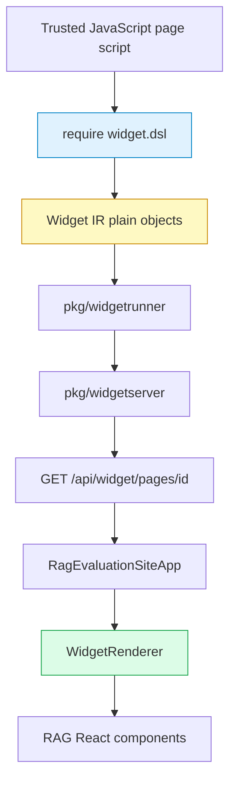

# Building a Goja UI DSL from Scratch: Widget IR to xgoja

This article explains how the RAG evaluation system grew a Goja-authored UI DSL from a prototype into a runnable generated xgoja site. The system starts with a React component library, introduces a JSON-compatible Widget IR, exposes that IR to JavaScript through `require("widget.dsl")`, executes trusted page scripts in Goja, serves the result over HTTP, packages the renderer as a reusable React package, embeds the default app into Go, wraps the authoring module as an xgoja provider, and then fixes the visual-quality gap that appears when real components are copied into a standalone package without their original theme and page shell environment.

> [!summary]
> - The central design decision was to make Goja produce Widget IR, not HTML. React remains the renderer and keeps ownership of components, CSS Modules, actions, and accessibility behavior.
> - The implementation moved through clear layers: TypeScript IR and `WidgetRenderer`, Goja `widget.dsl`, `pkg/widgetrunner`, `pkg/widgetserver`, npm package, embedded SPA, schema/actions, and xgoja provider.
> - Most difficult failures were boundary failures: Goja struct field names versus JSON names, generated xgoja module replacement rules, Vite asset paths under static mounts, browser favicon noise, CSS build artifact overwrites, missing design tokens, weak default page chrome, and typed Go slices crossing into Goja recipes.
> - The final xgoja provider exposes `widget.dsl` and `rag.dsl`, ships Glazed help entries, and can build a generated binary that serves a React WidgetRenderer app backed by JavaScript verbs. The latest visual-quality pass adds a standalone token bridge, default app shell, and semantic recipe helpers so generated pages look and read like complete RAG applications rather than raw component fragments.

## Why this project exists

The RAG evaluation frontend already had a useful component vocabulary: panels, captions, status text, dashboard grids, metadata grids, data tables, buttons, inputs, navigation, and layout primitives. Those components were implemented in React with CSS Modules and package-local behavior. The project goal was to let trusted JavaScript scripts author pages using that vocabulary without importing React and without asking Go to duplicate the component library.

The first tempting solution was to make JavaScript helpers return HTML-like structures. That approach was rejected. If Go or Goja returns HTML, it becomes responsible for matching React output, CSS class names, table behavior, action binding, accessibility details, and visual state. That would create two implementations of the same UI. The chosen design keeps only one renderer: React.

The resulting model is direct:

1. JavaScript scripts call `rag.panel(...)`, `rag.dataTable(...)`, `rag.statusText(...)`, and related helpers.
2. Those helpers return JSON-compatible Widget IR.
3. Go validates, normalizes, and serves the IR.
4. React renders the IR using the real component library.

This is the core rule of the system: **Goja authors data; React renders UI**.

## The implementation timeline

The project unfolded through three related ticket streams.

| Ticket | Role in the project |
|---|---|
| `RAGEVAL-UI-DSL` | Established the Widget IR idea, React renderer, backend demo endpoint, initial Goja `widget.dsl`, and browser smoke. |
| `WIDGETSITE-PACKAGING` | Turned the prototype into reusable Go packages, npm package, embedded SPA, schema, actions, and end-to-end smoke testing. |
| `XGOJA-WIDGETSITE` | Wrapped the DSL as an xgoja provider, built a generated binary example, embedded the React app, and added provider-bundled Glazed help. |
| `WIDGETDSL-VISUAL-QUALITY` | Diagnosed why the standalone site looked visually weak, added theme token compatibility, default shell/page chrome, stable visual evidence, and semantic recipe helpers. |

The major implementation commits on the current branch include:

| Commit | Purpose |
|---|---|
| `9c2d1bf` | Added the initial UI DSL/Widget IR implementation slice. |
| `70f30b1` | Added the xgoja widget site provider and generated binary example. |
| `36cd6ea` | Embedded the React app into the xgoja widget-site example. |
| `5cdcf5b` | Added provider-bundled Widget DSL Glazed help docs. |
| `f65e7a6` | Added the standalone token bridge for copied RAG components. |
| `94c9701` | Added the default shell/page chrome for the standalone WidgetRenderer app. |
| `ac3ea44` | Added semantic Widget DSL recipes and refactored the xgoja showcase to use them. |

The earlier WIDGETSITE implementation work also produced `pkg/widgetdsl`, `pkg/widgetrunner`, `pkg/widgetserver`, `pkg/defaultspa`, `pkg/widgetschema`, and `packages/rag-evaluation-site`. Those packages define the reusable architecture.

## The core mental model

The system has two boundaries. The first boundary is between JavaScript and Go. JavaScript executes in Goja and returns ordinary JavaScript objects. Go exports those objects into maps, validates their shape, and serializes them as JSON. The second boundary is between Go and React. React receives the same JSON-compatible data and maps it to actual components.



The Widget IR itself has three node kinds:

```ts
type WidgetNode = TextNode | ElementNode | ComponentNode;

interface TextNode {
  kind: 'text';
  text: string;
}

interface ElementNode {
  kind: 'element';
  tag: string;
  attrs?: JsonObject;
  children?: WidgetNode[];
}

interface ComponentNode {
  kind: 'component';
  type: RagWidgetType | string;
  props?: JsonObject;
  children?: WidgetNode[];
}
```

The `component` node is the important one for this project. It represents a real React component by name. `type: "Panel"` is not an instruction to emit a `<div>`; it is an instruction for `WidgetRenderer` to call the React `Panel` component with serialized props and children.

## Layer 1: the React WidgetRenderer

The first implementation layer was the TypeScript-side renderer. It maps Widget IR nodes to React nodes. Text nodes render as text. Element nodes call `React.createElement`. Component nodes switch on `node.type` and call real RAG components.

The current package renderer lives at:

```text
packages/rag-evaluation-site/src/widgets/WidgetRenderer.tsx
```

Its central structure is small:

```tsx
export function WidgetRenderer({ node, onAction }: WidgetRendererProps) {
  return <>{renderWidgetNode(node, onAction)}</>;
}

function renderWidgetNode(node: WidgetNode, onAction?: WidgetActionHandler): ReactNode {
  if (node.kind === 'text') return node.text;
  if (node.kind === 'element') return renderElementNode(node, onAction);
  return renderComponentNode(node, onAction);
}
```

The renderer then dispatches component nodes:

```tsx
switch (node.type) {
  case 'Panel':
    return renderPanel(node, onAction);
  case 'DataTable':
    return renderDataTable(node, onAction);
  case 'StatusText':
    return renderStatusText(node, onAction);
  default:
    return <ErrorCallout>Unknown widget: {node.type}</ErrorCallout>;
}
```

The first important rule is that the renderer does not evaluate arbitrary JavaScript. It receives data. The second important rule is that table cells cannot be JavaScript functions, because functions cannot cross the JSON boundary. Instead, table columns carry serializable cell specifications.

```js
rag.dataTable({
  rows,
  getRowKey: "id",
  columns: [
    { id: "id", header: "ID", cell: rag.cell.field("id") },
    { id: "name", header: "Name", cell: rag.cell.field("name") },
    { id: "status", header: "Status", cell: rag.cell.status("status") }
  ]
})
```

This decision shaped the entire DSL. Any UI behavior that must cross from Goja to React has to be represented as data: a cell specification, an action specification, a component type, props, and children.

## Layer 2: the first Goja `widget.dsl`

The first Goja module was implemented as a native module. Its job was not to render. Its job was to make JavaScript authoring ergonomic while returning maps that match Widget IR.

The public package is now:

```text
pkg/widgetdsl
```

The module registers `widget.dsl` and the RAG-oriented alias `rag.dsl`:

```go
func Register(reg *require.Registry) {
    if reg == nil {
        return
    }
    loader := NewLoader()
    reg.RegisterNativeModule(ModuleName, loader)
    reg.RegisterNativeModule("rag.dsl", loader)
}
```

The exported helpers are installed into the CommonJS module `exports` object. Low-level helpers include `text`, `element`, `component`, and `fragment`. Component helpers include `panel`, `stack`, `inline`, `button`, `caption`, `statusText`, `dataTable`, `metadataGrid`, `tabList`, `textInput`, and more. Table cell helpers live under `cell`.

The key implementation pattern is that component helpers share one call shape:

```js
rag.panel(props?, ...children)
```

The Go implementation has to decide whether the first object argument is props or an already-built Widget IR child. That decision is made by checking whether the object looks like a Widget IR node. If it does not, it is treated as props; if it does, it is treated as the first child.

```go
func propsAndChildStart(args []goja.Value, index int) (map[string]any, int) {
    if len(args) > index && isPlainObject(args[index]) && !looksLikeWidgetNodeExport(args[index]) {
        return exportObject(args[index]), index + 1
    }
    return map[string]any{}, index
}
```

Child normalization is equally important. Authors should be able to write natural JavaScript, including arrays returned by `map`. The DSL flattens arrays recursively, ignores nullish values, preserves existing Widget IR nodes, and converts other values to text nodes.

```go
func (r *runtime) exportChild(value goja.Value) []any {
    if value == nil || goja.IsUndefined(value) || goja.IsNull(value) {
        return nil
    }
    if isArrayLike(value) {
        // flatten array-like children
    }
    if isWidgetNode(r.vm, value) {
        return []any{value.Export()}
    }
    return []any{map[string]any{"kind": "text", "text": stringifyValue(value)}}
}
```

The first tricky bug appeared here. An early draft tried to call `value.ToObject(nil)` while detecting Widget nodes. That is unsafe because Goja object conversion needs the runtime. The fix was to pass `*goja.Runtime` into the detection path and use `value.ToObject(vm)`. A second early draft used brittle array detection; it was replaced with a reflection-based check against exported slice and array kinds.

### Semantic recipes on top of low-level Widget IR

After the renderer, xgoja provider, token bridge, and shell were working, the authoring problem changed. Scripts could produce good-looking pages, but they still had to manually assemble every metrics grid, toolbar, and master/detail section. The next layer was deliberately not a new renderer feature. It was a recipe layer that expands higher-level RAG page intent into the same plain Widget IR.

The DSL now exposes:

```js
rag.page({ id, title, meta, root, sections })
rag.action.server(name, options)
rag.action.navigate(to, options)
rag.action.event(event, options)
rag.action.copy(value)

rag.recipes.metrics({ items })
rag.recipes.actionToolbar({ title, actions, caption })
rag.recipes.masterDetailTable({ rows, columns, selectedKey, onRowSelect, detail })
```

A recipe is just a macro that returns Widget IR. For example, `metrics` expands to a `DashboardGrid` of condensed `Panel` components, each containing a `StatusText`. `actionToolbar` expands string action names into serializable server action specs and places buttons inside an inline toolbar panel. `masterDetailTable` expands a common queue layout into a two-up `DashboardGrid` with a `DataTable` panel and a detail panel.

The xgoja showcase now reads closer to the page's intent:

```js
return rag.page({
  schemaVersion: "0.1.0",
  id,
  title: "xgoja widget actions demo",
  sections: [
    pageSummary(id),
    toolbar(),
    rag.recipes.masterDetailTable({
      title: "Query queue",
      rows,
      columns: queryColumns(),
      selectedKey: appState.selectedId,
      onRowSelect: "select-query",
      detail: () => selectedPanel(selected)
    }),
    auditPanel()
  ]
})
```

The important design constraint is that `detail` callbacks are evaluated only while constructing the server response. The callback returns a Widget IR node, and that node is exported into JSON-compatible data before it crosses the HTTP boundary. React never receives a JavaScript function.

Two recipe-specific failures were instructive. First, Goja function binding did not pass `goja.FunctionCall` correctly when a Go function accepted `goja.FunctionCall` but returned `map[string]any`; changing these helpers to return `goja.Value` fixed the call shape. Second, xgoja smoke showed `Rows: 4` after an action but the table contained `rows: []`. The root cause was that database query results crossed into the recipe as a typed Go slice, while `anySlice` only accepted `[]any`. The fix was reflection-based slice/array normalization:

```go
func anySlice(value any) []any {
    if out, ok := value.([]any); ok {
        return out
    }
    rv := reflect.ValueOf(value)
    if rv.Kind() != reflect.Slice && rv.Kind() != reflect.Array {
        return []any{}
    }
    out := make([]any, 0, rv.Len())
    for i := 0; i < rv.Len(); i++ {
        out = append(out, rv.Index(i).Interface())
    }
    return out
}
```

This is the same boundary rule again: helpers that look simple in JavaScript still have to normalize Go-backed values deliberately.

## Layer 3: a runner for trusted page scripts

After `widget.dsl` existed, the next question was how a server should load scripts and ask them for pages. That became `pkg/widgetrunner`.

```text
pkg/widgetrunner/runner.go
```

The runner builds a go-go-goja runtime with `widgetdsl.NewRegistrar()`, installs a shared `exports` object, loads `.js` files from configured directories in lexical order, and calls page functions on demand.

A page script can export named pages:

```js
const rag = require("widget.dsl")

exports.pages = {
  demo(ctx) {
    return {
      schemaVersion: "0.1.0",
      id: ctx.pageId,
      title: "Demo",
      root: rag.panel({ title: "Demo" }, "Hello")
    }
  }
}
```

The runner lookup rule is precise:

1. Try `exports.pages[id]`.
2. Try fallback `exports.page`.
3. Return `ErrPageNotFound`.

The runner also normalizes bare Widget nodes into page results. That keeps simple scripts short while still letting the server return a consistent page object.

One important failure happened at this layer. Passing a Go struct directly into Goja did not expose JSON tag names. JavaScript saw Go field names such as `Query`, not `query`; the test failed with:

```text
TypeError: Cannot read property 'q' of undefined
```

The fix was to cross the Go-to-JS boundary with explicit maps:

```go
value, err := fn(goja.Undefined(), vm.ToValue(pageContextMap(pageCtx)))
```

That same lesson later shaped action invocation. The action path also constructs explicit maps so JavaScript sees predictable JSON-style keys.

## Layer 4: an HTTP server around the runner

`pkg/widgetserver` turns the runner into a browser-facing API.

```text
pkg/widgetserver/server.go
```

The server exposes:

| Endpoint | Purpose |
|---|---|
| `GET /api/widget/health` | Health smoke target. |
| `GET /api/widget/pages/{id}` | Render a page by calling Goja. |
| `POST /api/widget/actions/{name}` | Invoke a server action exported from Goja. |
| `GET /api/widget/schema` | Publish schema metadata and JSON Schema. |

The page handler calls:

```go
page, err := s.cfg.Runner.RenderPage(
    r.Context(),
    id,
    widgetrunner.PageContext{Query: queryMap(r.URL.Query())},
)
```

Errors are mapped to structured JSON responses. Missing pages become `404 page_not_found`. Invalid Widget IR becomes `400 invalid_widget_ir`. Script runtime errors become `500 script_runtime_error`, with full details only in development mode.

The server also owns frontend modes:

| Mode | Meaning |
|---|---|
| `embedded` | Serve the bundled default React app from Go. |
| `dir` | Serve a local static directory with SPA fallback. |
| `proxy` | Proxy frontend requests to a dev server. |
| `api-only` | Serve only API routes. |

The first SPA fallback attempt used `http.FileServer` in a way that produced a redirect for extensionless paths. A test for `/unknown/route` expected `200` but received `301`. The fix was to read `index.html` directly for fallback paths rather than asking `http.FileServer` to serve a rewritten request.

## Layer 5: the reusable React package

The React renderer became an npm package:

```text
packages/rag-evaluation-site
```

The package name is:

```text
@go-go-golems/rag-evaluation-site
```

It includes:

- `WidgetRenderer`
- Widget IR TypeScript types
- reusable component subtrees
- `useWidgetPage`
- `RagEvaluationSiteApp`
- CSS and theme exports
- a library build for npm
- an app build for Go embedding

The default app is intentionally simple. It determines a page id from the URL, fetches `/api/widget/pages/{id}`, and renders `page.root`.

```tsx
export function RagEvaluationSiteApp({ apiBase = '/api/widget', defaultPageId = 'index' }) {
  const pageId = readPageIdFromLocation(defaultPageId);
  const cleanApiBase = apiBase.replace(/\/$/, '');
  const { page, loading, error, refresh } = useWidgetPage(
    `${cleanApiBase}/pages/${encodeURIComponent(pageId)}`
  );

  return (
    <div data-rag-page="RagEvaluationSiteApp" data-page-id={page.id}>
      <WidgetRenderer node={page.root} onAction={(action, context) => {
        void handleAction(action, context);
      }} />
    </div>
  );
}
```

The packaging work had its own set of failures. The first package copy included app-specific molecules such as `CoveragePanel` and `QueryPresetList`; those imported application services and were not safe for a standalone package. They were removed from the package surface. CSS handling also failed once: a post-build copy step overwrote Vite-generated component CSS in `dist/styles.css`. The final build lets Vite own `styles.css` and only copies the theme export separately.

The package is validated with:

```bash
cd packages/rag-evaluation-site
pnpm typecheck
pnpm build
pnpm build:app
pnpm pack:smoke
pnpm consumer:smoke
```

The clean consumer smoke matters. It proves a separate Vite app can install the package artifact, import the renderer, import CSS, typecheck, and build without hidden workspace assumptions.

## Layer 5.5: restoring the standalone visual environment

The reusable package initially rendered real React components, but the generated xgoja site still looked weaker than the original RAG frontend. The key lesson was that rendering real components is not enough: copied components also need the design-token and page-shell environment that made them look correct in the original application.

The visual-quality ticket captured evidence with `css-visual-diff`, Storybook static pages, the generated widget-site, computed CSS artifacts, and Playwright smoke. The root cause was concrete. `packages/rag-evaluation-site/src/theme.css` defined canonical standalone tokens such as `--rag-color-surface`, but many copied components still consumed original RAG variables such as `--mac-surface`, `--mac-border`, `--mac-bg-dark`, `--mac-text`, `--font-mono`, and `--rag-font-role-metadata`. When those variables were missing, CSS declarations were dropped or fell back to browser defaults. Buttons and panels became transparent or default-looking even though the correct React components were being used.

The first fix was a package-local token bridge:

```css
:root {
  --rag-color-bg: #f6f7f8;
  --rag-color-surface: #ffffff;
  --rag-color-text: #1d232a;
  --rag-color-border-strong: #000000;

  --mac-bg: var(--rag-color-bg);
  --mac-bg-dark: #000000;
  --mac-text: var(--rag-color-text);
  --mac-text-inv: #ffffff;
  --mac-border: var(--rag-color-border-strong);
  --mac-surface: var(--rag-color-surface);
  --font-mono: var(--rag-font-mono);
  --rag-font-role-metadata: 400 11px/1.35 var(--font-mono);
}
```

This deliberately keeps `--rag-*` as the package's canonical tokens while providing compatibility aliases for components that have not yet been migrated. The post-token-bridge evidence showed the first panel computing to `background-color: rgb(255, 255, 255)` and `border: 1px solid rgb(0, 0, 0)`, and the primary button computing to black background, white text, mono font, and a real border.

The second fix was page chrome. `RagEvaluationSiteApp` originally rendered a bare wrapper around `WidgetRenderer`, so scripts that returned a simple `Stack` or `Panel` looked like fragments pasted into the viewport. The app now wraps pages in a default `AppShell` unless the page opts out with `meta.shell = "none"` or the root node is already an `AppShell`. The shell adds `AppNav`, viewport padding, a bordered frame, root background, content width modes, and stable attributes for tools:

```tsx
<div
  className="rag-evaluation-site-root rag-evaluation-site-root--shell"
  data-rag-page="RagEvaluationSiteApp"
  data-page-id={page.id}
  data-rag-shell="default"
>
  <AppShell header={<AppNav ... />}>
    <div className="rag-evaluation-site-content" data-rag-layout="PageContent">
      <WidgetRenderer node={page.root} onAction={...} />
    </div>
  </AppShell>
</div>
```

The computed CSS evidence moved the app root from transparent background and `padding: 0px` to `background-color: rgb(246, 247, 248)` and `padding: 8px`. Browser smoke then clicked `Add query`, verified `Rows: 4` and `Follow-up Query 4`, and reported zero console warnings or errors.

One subtle bug appeared during this phase: the first implementation nested a `<main>` inside `AppShell`, which already renders its children inside a `<main>`. It compiled and rendered, but the markup was semantically wrong. The fix was to use a `<div data-rag-layout="PageContent">` for the content boundary.

## Layer 6: embedding the default SPA in Go

Go's `go:embed` can only embed files under the package directory. The React app build lives under:

```text
packages/rag-evaluation-site/app-dist
```

The embedded Go package therefore copies that build output into:

```text
pkg/defaultspa/dist
```

and embeds it from there:

```go
//go:embed all:dist
var distFS embed.FS
```

`pkg/defaultspa` exposes an HTTP handler with SPA fallback. `pkg/widgetserver` uses this handler by default in embedded frontend mode when no custom handler is supplied. This completes the standalone-server path: Goja scripts produce Widget IR, `/api/widget` serves pages and actions, and the same binary serves the React app.

The ordering invariant is important:

```bash
cd packages/rag-evaluation-site
pnpm build:app
pnpm sync:defaultspa
```

Only after that should Go tests or binary builds rely on `pkg/defaultspa/dist`.

## Layer 7: schema and actions

Once pages rendered, the next need was compatibility and interaction.

`pkg/widgetschema` defines the current schema version:

```go
const Version = "0.1.0"
```

The server exposes schema metadata at:

```text
GET /api/widget/schema
```

The schema is intentionally broad for component props. It validates the shape of Widget nodes and advertises component and cell vocabularies, but it does not yet enforce every prop for every component. That is a deliberate phase-one tradeoff. The schema is useful for versioning and shape validation without pretending to be a complete React prop schema.

Actions use another serializable boundary. A button can carry:

```js
rag.button({
  label: "Increment",
  action: { kind: "server", name: "increment", payload: { source: "smoke" } }
})
```

The React app posts that action to:

```text
POST /api/widget/actions/increment
```

The runner looks for:

```js
exports.actions = {
  increment(ctx, payload) {
    return { ok: true, refresh: true, toast: "Incremented" }
  }
}
```

The Playwright smoke proved this stack end to end: page load, button click, action POST, refresh GET, and UI update from `Clicks 0` to `Clicks 1` with zero console warnings/errors.

## Layer 8: the xgoja provider

The final step was to make the DSL available inside generated xgoja binaries. That required a provider package:

```text
pkg/xgoja/providers/widgetsite
```

The provider registers the two module names and ships help docs:

```go
func Register(registry *providerapi.ProviderRegistry) error {
    loader := func(providerapi.ModuleSetupContext) (require.ModuleLoader, error) {
        return widgetdsl.NewLoader(), nil
    }
    return registry.Package(PackageID,
        providerapi.Module{
            Name:             "widget.dsl",
            DefaultAs:        "widget.dsl",
            Description:      "RAG WidgetRenderer authoring DSL for JSON-compatible Widget IR pages.",
            NewModuleFactory: loader,
        },
        providerapi.Module{
            Name:             "rag.dsl",
            DefaultAs:        "rag.dsl",
            Description:      "Alias for widget.dsl in RAG-oriented xgoja scripts.",
            NewModuleFactory: loader,
        },
        providerapi.HelpSource{
            Name:        "widget-dsl",
            Description: "Getting started and JavaScript API reference for widget.dsl and rag.dsl.",
            FS:          doc.FS,
            Root:        ".",
        },
    )
}
```

The example buildspec selects the provider, HTTP provider, host provider, embedded assets, db, jsverbs, and provider-shipped help:

```yaml
packages:
  - id: go-go-goja-host
    import: github.com/go-go-golems/go-go-goja/pkg/xgoja/providers/host
  - id: go-go-goja-http
    import: github.com/go-go-golems/go-go-goja/pkg/xgoja/providers/http
  - id: rag-widget-site
    import: github.com/go-go-golems/rag-evaluation-system/pkg/xgoja/providers/widgetsite
    replace: ../../..

modules:
  - package: go-go-goja-http
    name: express
    as: express
  - package: go-go-goja-host
    name: fs
    as: fs:assets
  - package: go-go-goja-host
    name: db
    as: db
  - package: rag-widget-site
    name: widget.dsl
    as: widget.dsl

help:
  sources:
    - id: widget-dsl
      package: rag-widget-site
      source: widget-dsl
```

The xgoja example script combines all selected modules:

```js
const express = require("express")
const assets = require("fs:assets")
const db = require("db")
const rag = require("widget.dsl")

const app = express.app()
app.spaFromAssetsModule("/", assets, "/app/public", {
  excludePrefixes: ["/api", "/healthz", "/favicon.ico"]
})

app.get("/api/widget/pages/demo", (_req, res) => {
  const rows = db.query("SELECT id, name, status FROM queries ORDER BY id")
  res.json({
    schemaVersion: "0.1.0",
    id: "demo",
    title: "xgoja widget demo",
    root: rag.panel({ title: "xgoja widget demo" },
      rag.statusText({ status: "succeeded", icon: true }, "Rows: " + rows.length),
      rag.dataTable({ rows, getRowKey: "id", columns })
    )
  })
})
```

The generated binary can now serve the React app and expose the DSL docs:

```bash
examples/xgoja/widget-site/dist/rag-widget-xgoja-site help widget-dsl-getting-started
examples/xgoja/widget-site/dist/rag-widget-xgoja-site help widget-dsl-js-api-reference
```

## What went wrong and what it taught us

The project produced several useful failure modes. They are worth recording because they define the real engineering constraints of this pattern.

### Goja struct export did not use JSON field names

The runner initially passed a Go `PageContext` struct directly into JavaScript. The JavaScript expected `ctx.query`, but Goja exposed struct fields using Go names. The page test failed with an undefined property error. The fix was to convert boundary objects into explicit maps before calling JavaScript.

Rule: when designing a JavaScript API over Goja, build the JavaScript object deliberately. Do not rely on Go struct tags to define the JS shape.

### A ticket-local xgoja provider could validate but not build

A scratch provider under `ttmp/.../scripts` could be referenced in an xgoja spec well enough for `doctor` and `list-modules`, but generated builds run inside their own temporary Go module. The build then tried to resolve the ticket-local import path remotely and failed.

The fix was to move the provider under a stable package path:

```text
pkg/xgoja/providers/widgetsite
```

and use `packages[].replace` in the xgoja buildspec.

Rule: xgoja providers must live under stable module paths if generated builds are expected to compile.

### Local xgoja builds needed two replace paths

Generated xgoja builds needed:

1. `--xgoja-replace /path/to/go-go-goja` for the local xgoja checkout.
2. `packages[].replace` for the local RAG provider module.

Missing either replace sends the generated module toward stale published code or nonexistent GitHub paths.

Rule: generated binaries do not inherit the developer's workspace assumptions. Make replacement paths explicit.

### `http.FileServer` redirected during SPA fallback

A directory frontend fallback originally tried to rewrite unknown frontend routes to `index.html` and let `http.FileServer` handle them. A test expected `200` for an SPA route but received `301`. The fix was to read and write `index.html` directly on fallback.

Rule: direct `index.html` writes are more deterministic for SPA fallback than trying to force `http.FileServer` through a rewritten path.

### Static mounts could shadow API routes

The first xgoja React app was served under `/static/` because the xgoja HTTP host checked static mounts before dynamic routes. Mounting static files at `/` would have answered `/api/widget/...` before Express route matching. The later `spaFromAssetsModule` helper added explicit `excludePrefixes` so root-mounted SPAs can avoid stealing API routes.

Rule: a root-mounted SPA must have API exclusions or route ordering that protects dynamic endpoints.

### Vite asset paths and source maps needed example-local handling

The built Vite app used root-relative asset paths such as `/assets/index-...js`. When mounted under `/static/`, the example had to rewrite those URLs to `/static/assets/...`. Later SPA fallback at `/` removed that need. The copied JS also referenced a sourcemap that was intentionally omitted; the sync step stripped the `sourceMappingURL` trailer.

Rule: embedding frontend assets is not just copying files. The mount path, source maps, and binary size policy must match the server route design.

### CSS copy order broke generated component styles

During npm package work, a post-build CSS copy step overwrote Vite-generated CSS module output. The fix was to let Vite own `dist/styles.css` and copy only the standalone `theme.css` export separately.

Rule: treat generated CSS as a build artifact with ownership. Do not overwrite it after the bundler has produced it.

### Browser smoke found small but real defects

Browser smoke found a favicon `404`. It also exposed a status vocabulary mismatch: the demo used `success`, but the renderer expected `succeeded` for the checkmark icon. The result was `? Rows: 2`. Changing the status to `succeeded` fixed the rendered icon.

Rule: console output and visual text matter. API tests do not catch every integration detail.

### Missing design tokens made real components look broken

The standalone package rendered real components, but several component styles depended on original RAG variables that were absent in the package theme. The visible symptom was transparent/default-looking panels, buttons, and tables. Computed CSS made this obvious: app root and buttons had transparent backgrounds and default-ish metrics.

The fix was not to rewrite every component. The safe first step was a compatibility bridge that maps original `--mac-*`, `--font-*`, and role font variables onto package-local `--rag-*` tokens.

Rule: when extracting a component library, extract or bridge its design-token contract before judging visual quality.

### A bare renderer root is not an application shell

`RagEvaluationSiteApp` initially wrapped `WidgetRenderer` in a bare `<div>`. That is acceptable for embedding and tests, but not for a standalone generated site. The result was a correct component tree without page rhythm, navigation, background, or padding.

The fix was a default shell with explicit escape hatches: do not wrap if `page.meta.shell === "none"`, and do not double-wrap if the root node is already `AppShell`.

Rule: reusable renderers need both an embed mode and a standalone app-shell mode. Make the default good for standalone demos, but keep opt-out for embedding.

### Visual tooling needed stable selectors

The first visual evidence script used broad selectors such as `section:first-of-type`, `table`, and `button`. That made some probes match outer stacks or Storybook controls instead of the intended RAG components.

The fix was to use stable runtime attributes such as:

```text
[data-rag-page="RagEvaluationSiteApp"]
[data-rag-layout="Panel"]
[data-rag-component="DataTable"]
[data-rag-atom="Button"]
```

Rule: visual diff tooling should target explicit semantic attributes, not incidental HTML structure.

### Recipe helpers lost typed database rows

The first `masterDetailTable` recipe accepted rows from JavaScript arrays but lost rows from xgoja database query results, because those rows arrived as a typed Go slice rather than `[]any`. The generated-site smoke caught the failure: action counts updated, but table content disappeared.

The fix was reflection-based slice normalization in the DSL.

Rule: Goja APIs must normalize both pure JavaScript values and Go-backed host-service values. Tests should cover both.

### Full-repo tests were blocked by external dependency drift

Focused tests passed, but full workspace tests failed because a sibling/published `scraper` dependency still imported the old `github.com/go-go-golems/go-go-goja/engine` path while current go-go-goja uses `pkg/engine`.

Rule: record dependency drift honestly. A focused pass is useful, but it should not be described as a full-repo pass when unrelated workspace dependencies are broken.

## Documentation and references used

The implementation used local documentation and code more than external references. The most important sources were:

| Source | How it shaped the work |
|---|---|
| `RAGEVAL-UI-DSL` design docs and diary | Defined the initial Widget IR, React renderer, and Goja authoring direction. |
| `WIDGETSITE-PACKAGING` design docs and diary | Defined the reusable package/server architecture and validation plan. |
| `XGOJA-WIDGETSITE` design docs and diary | Defined the generated xgoja binary plan and provider constraints. |
| `WIDGETDSL-VISUAL-QUALITY` guide and diary | Diagnosed token/shell visual gaps, established css-visual-diff evidence scripts, and guided the token bridge, shell, and recipe phases. |
| `go-go-goja/modules` | Showed the native module contract: module name, docs, loader, and exports. |
| `go-go-goja/pkg/engine` | Defined the runtime factory and module registrar API. |
| `go-go-goja/cmd/xgoja/doc/*` | Explained xgoja buildspecs, providers, command providers, embedded assets, jsverbs, and generated runtime packaging. |
| `go-go-goja/pkg/xgoja/providerapi` | Defined `ProviderRegistry`, `ModuleSetupContext`, `HelpSource`, capabilities, and provider-owned docs. |
| `go-go-goja/modules/express` and `modules/fs` | Provided Express-style HTTP serving and embedded asset module support. |
| Trusted npm publishing article in the Obsidian vault | Shaped the single-package npm plan, dist publishing, pack smoke, clean consumer smoke, and trusted publishing requirements. |
| Pi Playwright browser tool | Validated the DSL preview and embedded generated xgoja app in a real browser. |

The new provider-bundled help pages now give generated xgoja users direct documentation:

```text
widget-dsl-getting-started
widget-dsl-js-api-reference
```

These pages are not replacements for the design docs. They are the operational docs a generated binary should expose to a script author.

## Current status

The system now has the essential vertical slices implemented.

The app-local path works:

```text
Goja script -> pkg/widgetrunner -> pkg/widgetserver -> /api/widget -> RagEvaluationSiteApp -> WidgetRenderer
```

The generated xgoja path works:

```text
xgoja generated binary -> jsverb -> express routes -> widget.dsl -> Widget IR -> React app
```

The reusable frontend package exists:

```text
@go-go-golems/rag-evaluation-site
```

The xgoja provider exists:

```text
pkg/xgoja/providers/widgetsite
```

The generated example can validate provider help source selection and render the help topics:

```bash
make -C examples/xgoja/widget-site doctor list-modules build
examples/xgoja/widget-site/dist/rag-widget-xgoja-site help widget-dsl-getting-started
examples/xgoja/widget-site/dist/rag-widget-xgoja-site help widget-dsl-js-api-reference
```

The visual-quality pass has now completed three concrete implementation phases:

| Phase | Result | Validation |
|---|---|---|
| Token bridge | Standalone components receive original RAG token variables through package-local aliases. | Computed CSS changed panels/buttons from transparent/default-looking to bordered and themed. |
| Default shell | Generated pages get `AppShell`, `AppNav`, background, padding, and content width controls unless they opt out. | Browser smoke verified `data-rag-shell="default"`, root padding `8px`, shell border, action refresh, and zero console warnings/errors. |
| Semantic recipes | Scripts can use `rag.page`, `rag.action.*`, and `rag.recipes.*` for common dashboard patterns. | Go tests, xgoja smoke, devctl smoke, generated help checks, and browser action smoke passed. |

## What could be improved

The implementation is useful, but several improvements would make it sturdier.

### Add precise component prop validation

The current schema validates node shape and known vocabularies. It does not fully validate every component's props. A future schema should validate `DataTable.rows`, `DataTable.columns`, `StatusText.status`, `TabList.items`, action specs, and other component-specific requirements.

The difficulty is keeping Go and TypeScript schemas synchronized. A generated schema from TypeScript types or a shared protobuf/JSON Schema source would reduce drift.

### Document `page.meta` and recipes in schema output

Provider help now documents `page`, `action`, and recipes, but `/api/widget/schema` still focuses on core Widget IR. The schema endpoint should eventually advertise page metadata such as `shell`, `navItems`, `activeNavItemId`, and `maxWidth`, plus recipe-level authoring conventions if the schema is meant to guide script authors.

### Improve action error handling in the default app

The default app currently throws when a server action fails. That is acceptable for smoke testing but not ideal for users. It should render visible error state or dispatch a structured toast/error event that the app shell can display.

### Add focused shell and recipe tests

The app now has behavior worth testing directly: default shell wrapping, `meta.shell = "none"`, root `AppShell` double-wrap avoidance, `page.meta.maxWidth`, recipe JSON serialization, and typed Go slice handling in recipes. Some of this is currently covered by Go tests and browser smoke, but a smaller focused test set would catch regressions earlier.

### Add committed Playwright tests

Pi Playwright smokes proved the runtime path manually. A committed Playwright test suite would make browser validation repeatable in CI. The test should start a widget server, open a page route, check `data-rag-page`, click a server action, and assert refresh behavior.

### Finish preconfigured database support

The xgoja demo still uses JavaScript-side `db.configure("sqlite3", ":memory:")`. A production binary should be able to configure the database through CLI/env/config before JavaScript starts. JavaScript would then call `require("db").query(...)` without being allowed to reconfigure the connection.

This improves safety and makes generated binaries easier to operate. It also lets the binary own read/write policy and resource cleanup.

### Finish root-mounted SPA fallback support

The in-progress xgoja work added `app.spaFromAssetsModule` support in go-go-goja. The goal is to serve the React app at `/` while excluding `/api`, `/healthz`, and `/favicon.ico` from SPA fallback. This removes the older `/static/?page=demo` compromise and lets deep links such as `/pages/demo` work directly.

### Add CI and trusted npm publishing

The package validation commands exist, but CI still needs to run them in the right order:

```bash
go test ./...
cd packages/rag-evaluation-site
pnpm typecheck
pnpm build
pnpm build:app
pnpm sync:defaultspa
pnpm pack:smoke
pnpm consumer:smoke
```

Publishing should use npm Trusted Publishing rather than long-lived npm tokens.

### Decide the long-term package boundary

`pkg/widgetdsl` currently lives in the RAG evaluation system. That is fine while the WidgetRenderer is RAG-specific. If the pattern becomes a general Go Go Golems widget-site package, the provider, DSL, schema, and frontend package may deserve a dedicated repository or module.

## Recommended implementation sequence for future DSLs

This project suggests a repeatable sequence for building a Goja UI DSL safely.

1. **Start with the renderer, not the DSL.** Define the UI data shape and prove React can render it with real components.
2. **Keep the IR JSON-compatible.** Do not include functions, runtime objects, class instances, or non-serializable values.
3. **Write the Goja DSL as an authoring convenience.** The helpers should return IR maps, not HTML or framework objects.
4. **Normalize boundary data explicitly.** Convert Go structs to maps before passing them into JavaScript when property names matter.
5. **Add a runner before adding a server.** Test script loading, page lookup, action lookup, and validation without HTTP first.
6. **Add HTTP with structured errors.** Map missing pages, invalid IR, and runtime errors to distinct response codes.
7. **Package the renderer separately.** A clean consumer smoke will catch hidden workspace dependencies.
8. **Embed the default app deliberately.** Make the frontend build-to-embed sync step explicit.
9. **Validate in a browser.** Console output, route fallback, asset paths, and visual text need browser-level checks.
10. **Only then wrap it as an xgoja provider.** Generated binaries add module replacement, embedded assets, command providers, and help docs; those are easier to debug after the base stack works.

## Working rules

- Goja should create Widget IR and never duplicate React rendering.
- Every cross-runtime value should be JSON-compatible unless there is a deliberate host-service API.
- Table cells, actions, and renderable props should be represented as data specifications.
- Generated xgoja examples should validate with `doctor`, `list-modules`, `build`, curl smoke, and browser smoke when applicable.
- Provider docs should be shipped with the provider and selected in generated binaries through `help.sources`.
- Any browser-visible warning that appears during smoke should either be fixed or documented as intentional.
- When a standalone renderer looks visually wrong, inspect computed CSS first; missing custom properties are often more likely than broken React components.
- Recipes should be treated as JSON-compatible macros over Widget IR, not as a second rendering system.

## Related notes

- [[ARTICLE - WidgetRenderer Standalone Site - Goja Authored React Rendered UI]]
- [[ARTICLE - Deep Dive - xgoja Scripting for RAG Evaluation Systems]]
- [[ARTICLE - xgoja - Building a Query Tool with Jsverbs and Embedded Modules]]
- [[ARTICLE - Trusted npm Publishing for Go Go Golems React Packages]]
