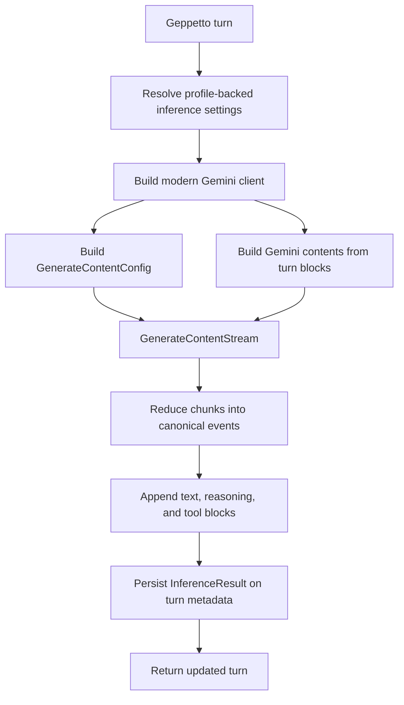

# Geppetto Gemini SDK Modernization: Gemini 3 Flash Deep Dive

This report explains the Gemini provider modernization work in Geppetto. The work replaced the live Gemini provider path with the modern `google.golang.org/genai` SDK, added Gemini-specific thinking configuration, preserved provider-native tool-call IDs, recorded modern usage metadata, and validated the result through direct Geppetto smokes before routing the same provider through `llm-proxy`.

The reader should come away with a precise understanding of why the legacy SDK path was insufficient, what the new provider path does, how Geppetto turns are converted into Gemini `Content` values, how streaming responses are reduced into canonical Geppetto events, and how the final behavior was validated with live Gemini 3 Flash Preview calls.

> [!summary]
> - The old Gemini SDK could perform baseline text and function-call requests, but it could not represent Gemini 3 state such as `ThinkingConfig`, thought signatures, provider-native function-call IDs, function-response IDs, or response IDs.
> - The new live path uses `google.golang.org/genai v1.58.0` through `pkg/steps/ai/gemini/modern_engine.go` and `pkg/steps/ai/gemini/modern_adapter.go`.
> - Direct Geppetto smokes for `gemini-3-flash-preview` passed before `llm-proxy` smokes, preserving the intended debugging order.
> - The remaining open issue is visible thinking: the provider path can request and preserve thought parts, but the tested Gemini 3 Flash Preview run did not emit visible thought text.

## Why this work exists

Geppetto has a canonical turn and event model. Providers are adapters into that model. A provider implementation is correct only when it preserves the information needed by later turns, emits canonical events in the expected order, and stores enough inference metadata for downstream systems to reason about finish state, token usage, tool calls, and response identity.

Gemini 3 and Gemini 3 Flash Preview increased the amount of provider state that matters for correctness. Thinking controls and thought signatures are not only display features. Thought signatures can be continuation metadata. Function calls can carry provider-native IDs. Function responses can carry matching IDs. Usage metadata can distinguish normal output tokens, thoughts tokens, tool-use prompt tokens, cached tokens, and total tokens. A provider implementation that flattens these fields too early may still produce text, but it cannot reliably support multi-turn tool workflows or reasoning-aware telemetry.

The Geppetto ticket for this work is:

```text
/home/manuel/workspaces/2026-06-04/llm-proxy/geppetto/ttmp/2026/06/05/2026-06-05-geppetto-gemini-api-polish--geppetto-gemini-api-polish-for-gemini-3-flash
```

The main implementation files are:

```text
/home/manuel/workspaces/2026-06-04/llm-proxy/geppetto/pkg/steps/ai/gemini/engine_gemini.go
/home/manuel/workspaces/2026-06-04/llm-proxy/geppetto/pkg/steps/ai/gemini/modern_engine.go
/home/manuel/workspaces/2026-06-04/llm-proxy/geppetto/pkg/steps/ai/gemini/modern_adapter.go
/home/manuel/workspaces/2026-06-04/llm-proxy/geppetto/pkg/steps/ai/gemini/modern_adapter_test.go
/home/manuel/workspaces/2026-06-04/llm-proxy/geppetto/pkg/steps/ai/settings/gemini/settings.go
/home/manuel/workspaces/2026-06-04/llm-proxy/llm-proxy/pkg/profiles/resolver.go
```

## The first question: is this an implementation bug or an SDK boundary?

The first technical step was not to rewrite the provider. It was to prove whether the currently used SDK could express the required state. The ticket includes a compile-time probe:

```text
scripts/01-gemini-sdk-capability-probe.sh
scripts/artifacts/sdk-capability-probe.json
```

The probe compared two modules:

| SDK | Version | Result |
|---|---:|---|
| `github.com/google/generative-ai-go` | `v0.20.1` | Baseline text/function-call types compile, but Gemini 3 fields do not compile. |
| `google.golang.org/genai` | `v1.58.0` | Modern Gemini 3 fields compile. |

The decisive probe result was:

```json
{
  "modules": {
    "legacy": "github.com/google/generative-ai-go v0.20.1",
    "modern": "google.golang.org/genai v1.58.0"
  },
  "results": [
    { "name": "old_baseline", "build_ok": true },
    { "name": "old_modern_fields", "build_ok": false },
    { "name": "new_modern_fields", "build_ok": true }
  ]
}
```

The legacy failure was field-specific, not a dependency setup failure:

```text
undefined: oldgenai.ThinkingConfig
invalid composite literal type genai.Part
unknown field ID in struct literal of type genai.FunctionCall
unknown field ID in struct literal of type genai.FunctionResponse
unknown field ResponseID in struct literal of type genai.GenerateContentResponse
```

This result changed the implementation plan. If the existing SDK cannot represent the required fields, then provider polish cannot be limited to small fixes around streaming or tool blocks. Geppetto needs a modern Gemini adapter that receives and emits the newer API shape directly.

## Provider modernization scope

The modernization added about 1,600 lines across the provider, settings, fixture tests, and smoke tooling:

```text
384  pkg/steps/ai/gemini/modern_engine.go
345  pkg/steps/ai/gemini/modern_adapter.go
137  pkg/steps/ai/gemini/modern_adapter_test.go
 53  pkg/steps/ai/settings/gemini/settings.go
 26  pkg/steps/ai/settings/gemini/gemini.yaml
438  scripts/03-gemini-geppetto-smoke/main.go
262  scripts/04-gemini-llm-proxy-smoke.py
```

The central symbols are:

| Symbol | File | Responsibility |
|---|---|---|
| `runModernInference` | `modern_engine.go:24` | Creates the modern client, builds request config and contents, streams responses, persists inference metadata, and publishes provider events. |
| `buildModernGenerateContentConfig` | `modern_engine.go` | Converts Geppetto settings, inference overrides, Gemini thinking settings, and tool registry state into `GenerateContentConfig`. |
| `reduceModernGeminiResponse` | `modern_adapter.go:53` | Converts streamed `GenerateContentResponse` chunks into canonical text, reasoning, tool-call, and metadata events. |
| `buildModernGeminiContentsFromTurn` | `modern_adapter.go:223` | Replays Geppetto turn blocks into Gemini `Content` values for multi-turn continuation. |
| `completeModernGeminiStream` | `modern_engine.go:308` | Appends final blocks, builds `InferenceResult`, maps response IDs and usage metadata, and emits terminal events. |
| `Settings` | `settings/gemini/settings.go:10` | Adds Gemini-specific profile flags for API version and thinking controls. |
| `TestYAMLResolverMergesSparseProfileOntoBaseSettings` | `llm-proxy/pkg/profiles/resolver_test.go:13` | Guards the proxy-side profile merge bug found during Gemini proxy smokes. |

## The runtime path after the migration

The live Gemini path now starts in `GeminiEngine.RunInference`, which delegates to `runModernInference`. The new path creates a `google.golang.org/genai` client using profile-backed settings, not raw environment-variable reads. The selected model still comes from the Geppetto profile's chat engine field.

The high-level flow is:



The important property is that there is no separate provider object model outside Geppetto's turn model. The adapter converts at the boundary, then returns data to canonical Geppetto structures. Provider-specific metadata is preserved only where it is needed for replay or telemetry.

The request side has two separate responsibilities:

1. `buildModernGenerateContentConfig` builds configuration: temperature, top-p, max output tokens, stop sequences, thinking options, and tool declarations.
2. `buildModernGeminiContentsFromTurn` builds conversation content: user text, model text, reasoning thought parts, function calls, and function responses.

Keeping those responsibilities separate matters because configuration is a property of the next provider call, while content is the replayed conversation state. Merging those concerns would make it harder to test continuation behavior independently from sampling and tool configuration.

## Gemini-specific settings

Gemini now has provider-specific settings in `pkg/steps/ai/settings/gemini/settings.go`:

```go
type Settings struct {
    APIVersion      string `yaml:"api_version,omitempty" glazed:"gemini-api-version"`
    IncludeThoughts *bool  `yaml:"include_thoughts,omitempty" glazed:"gemini-include-thoughts"`
    ThinkingBudget  *int   `yaml:"thinking_budget,omitempty" glazed:"gemini-thinking-budget"`
    ThinkingLevel   string `yaml:"thinking_level,omitempty" glazed:"gemini-thinking-level"`
}
```

The default API version currently resolves to `v1beta` when the setting is empty. This was a tested choice. Under the available account and SDK behavior, `v1` broke tool declarations with errors about unknown `tools` and `toolConfig` fields, while `v1beta` supported tool calls and `gemini-3-flash-preview`.

The settings do not read API keys. Credentials remain profile-owned. This is consistent with the rest of the Geppetto and Pinocchio profile workflow. The smoke tooling was also updated to resolve credentials through profile registries rather than reading raw `GEMINI_API_KEY`, `GOOGLE_API_KEY`, or `GENAI_API_KEY` values.

## Building `GenerateContentConfig`

`buildModernGenerateContentConfig` starts with a blank `moderngenai.GenerateContentConfig` and fills it from three sources:

1. Chat-level defaults from `e.settings.Chat`.
2. Turn-level inference overrides from `engine.ResolveInferenceConfig`.
3. Gemini-specific settings from `e.settings.Gemini`.

The result is a single config object for the provider call:

```go
config := &moderngenai.GenerateContentConfig{}

if e.settings.Chat.Temperature != nil {
    v := float32(*e.settings.Chat.Temperature)
    config.Temperature = &v
}

if e.settings.Gemini != nil {
    thinking := &moderngenai.ThinkingConfig{}
    setThinking := false

    if e.settings.Gemini.IncludeThoughts != nil {
        thinking.IncludeThoughts = *e.settings.Gemini.IncludeThoughts
        setThinking = true
    }

    if e.settings.Gemini.ThinkingBudget != nil {
        v := clampIntToInt32(*e.settings.Gemini.ThinkingBudget)
        thinking.ThinkingBudget = &v
        setThinking = true
    }

    if setThinking {
        config.ThinkingConfig = thinking
    }
}
```

Tool declarations are built from the Geppetto tool registry when one exists in context. The provider path converts JSON Schema into Gemini schema objects and sets function-calling mode to `AUTO`:

```go
registry, _ := tools.RegistryFrom(ctx)
if registry != nil {
    decls, err := modernGeminiToolDeclarations(registry)
    if err != nil {
        return nil, err
    }
    if len(decls) > 0 {
        config.Tools = []*moderngenai.Tool{{FunctionDeclarations: decls}}
        config.ToolConfig = &moderngenai.ToolConfig{
            FunctionCallingConfig: &moderngenai.FunctionCallingConfig{
                Mode: moderngenai.FunctionCallingConfigModeAuto,
            },
        }
    }
}
```

The provider still leaves tool execution outside the engine. Geppetto advertises tools and records tool calls. The caller executes the tool and appends a tool-result block. The next provider call replays the tool call and the function response.

## Replaying a Geppetto turn into Gemini contents

The most important adapter function is `buildModernGeminiContentsFromTurn`. It converts Geppetto blocks into Gemini `Content` values.

The conversion rules are:

| Geppetto block kind | Gemini role | Gemini part |
|---|---|---|
| user/system/other text | `user` | `Text` |
| assistant text | `model` | `Text` |
| reasoning | `model` | `Part{Thought: true, Text, ThoughtSignature}` |
| tool call | `model` | `FunctionCall{ID, Name, Args}` |
| tool result | `user` | `FunctionResponse{ID, Name, Response}` |

The reasoning case is where the modern SDK is required. A Gemini thought part can carry both text and a thought signature. Geppetto stores the signature as provider-specific block metadata using a typed block metadata key:

```go
var (
    keyBlockMetaGeminiThoughtSignature = turns.BlockMetaK[string]("gemini", "thought_signature", 1)
    keyBlockMetaGeminiThought          = turns.BlockMetaK[bool]("gemini", "thought", 1)
)
```

The signature is stored as base64 text in block metadata. When replaying the turn, the adapter decodes it back into `[]byte` and places it into `Part.ThoughtSignature`:

```go
case turns.BlockKindReasoning:
    content.Role = string(moderngenai.RoleModel)
    part := &moderngenai.Part{Thought: true}
    if txt, ok := blockText(b); ok {
        part.Text = txt
    }
    if sig64, ok, err := keyBlockMetaGeminiThoughtSignature.Get(b.Metadata); err != nil {
        return nil, err
    } else if ok && strings.TrimSpace(sig64) != "" {
        sig, err := base64.StdEncoding.DecodeString(sig64)
        if err != nil {
            return nil, err
        }
        part.ThoughtSignature = sig
    }
    content.Parts = append(content.Parts, part)
```

This preserves a strict separation between assistant-visible text and provider continuation metadata. Reasoning is represented as a reasoning block, not appended to normal assistant text. Thought signatures are metadata, not displayed answer text.

## Function-call IDs and tool-result replay

The legacy Gemini implementation synthesized tool-call IDs. The modern SDK exposes `FunctionCall.ID` and `FunctionResponse.ID`, so the provider now prefers Gemini's provider-native ID and generates a UUID only when the provider omits one.

The reducer code is direct:

```go
id := strings.TrimSpace(call.ID)
if id == "" {
    id = uuid.NewString()
}
state.pendingCalls = append(state.pendingCalls, geminiPendingCall{
    id: id,
    name: call.Name,
    args: args,
})
```

The replay path uses the same ID in both directions:

```go
case turns.BlockKindToolCall:
    content.Role = string(moderngenai.RoleModel)
    content.Parts = append(content.Parts, &moderngenai.Part{
        FunctionCall: &moderngenai.FunctionCall{ID: id, Name: name, Args: args},
    })

case turns.BlockKindToolUse:
    content.Role = string(moderngenai.RoleUser)
    content.Parts = append(content.Parts, &moderngenai.Part{
        FunctionResponse: &moderngenai.FunctionResponse{
            ID: id, Name: name, Response: toolUseResponseMap(b),
        },
    })
```

This matters for client-driven tool loops. The first provider call requests a tool. The client executes it. The second provider call must replay the assistant's tool call and the user's tool result with a matching ID. If the ID is changed, omitted, or parsed incorrectly, the provider may reject the continuation or ignore the tool result.

One proxy-specific bug appeared here. `llm-proxy` returns OpenAI-compatible tool arguments as JSON strings. When those arguments are appended back into a Geppetto turn and replayed to Gemini, the Gemini adapter must parse them back into a map. The helper now accepts `map[string]any`, JSON strings, and `json.RawMessage`:

```go
func toolCallArgsMap(raw any) map[string]any {
    switch v := raw.(type) {
    case map[string]any:
        return v
    case string:
        var obj map[string]any
        if json.Unmarshal([]byte(v), &obj) == nil && obj != nil {
            return obj
        }
    case json.RawMessage:
        var obj map[string]any
        if json.Unmarshal(v, &obj) == nil && obj != nil {
            return obj
        }
    }
    return map[string]any{}
}
```

Without this helper, OpenAI-style tool-call replay could silently degrade to an empty argument map.

## Reducing modern Gemini stream chunks into canonical events

The modern engine uses `client.Models.GenerateContentStream`. Each streamed response chunk is recorded as a provider record and then reduced into Geppetto events.

The reducer handles four categories of state:

1. Response identity and usage metadata.
2. Assistant-visible text.
3. Reasoning/thought parts.
4. Function calls.

The response-level reducer shape is:

```go
func reduceModernGeminiResponse(
    metadata events.EventMetadata,
    state *modernGeminiStreamState,
    resp *moderngenai.GenerateContentResponse,
) []events.Event {
    if strings.TrimSpace(resp.ResponseID) != "" {
        state.responseID = resp.ResponseID
    }

    if usage, extra, ok := extractModernGeminiUsage(resp); ok {
        state.finalUsage = usage
        state.finalUsageExtra = extra
        out = append(out, events.NewProviderCallMetadataUpdatedEvent(...))
    }

    for _, cand := range resp.Candidates {
        for _, part := range cand.Content.Parts {
            if part.Thought {
                out = append(out, reduceModernGeminiThoughtPart(...))
                continue
            }
            if part.Text != "" {
                out = append(out, reduceModernGeminiTextPart(...))
            }
            if part.FunctionCall != nil {
                out = append(out, reduceModernGeminiFunctionCall(...))
            }
        }
    }
    return out
}
```

A thought part starts a canonical reasoning segment. Text parts start a canonical assistant text segment. Function calls produce canonical tool-call events. These events let downstream systems observe provider progress without parsing Gemini-specific chunks.

The usage extractor maps standard token counts into `events.Usage` and preserves modern Gemini-specific counters in metadata extras:

```go
return &events.Usage{
    InputTokens:  int(u.PromptTokenCount),
    OutputTokens: int(u.CandidatesTokenCount),
    CachedTokens: int(u.CachedContentTokenCount),
}, map[string]any{
    "thoughts_token_count":        int(u.ThoughtsTokenCount),
    "tool_use_prompt_token_count": int(u.ToolUsePromptTokenCount),
    "total_token_count":           int(u.TotalTokenCount),
}, true
```

The exact implementation only sets extra fields when provider values are non-zero. That keeps metadata compact while still preserving the counts when Gemini returns them.

## Completing the stream and persisting inference metadata

Streaming reduction is not complete until terminal state is written back to the turn. `completeModernGeminiStream` performs that finalization:

- It closes reasoning and text segments when they were started.
- It appends final reasoning, text, and tool-call blocks to the turn.
- It copies usage and stop reason into event metadata.
- It builds an `InferenceResult` using Geppetto's canonical helper.
- It stores the Gemini response ID on the result.
- It marks the finish class as error when the stream returned an error.
- It emits `ProviderCallFinished` and an error event when needed.

The final result construction is:

```go
hasToolCalls := len(state.pendingCalls) > 0
result := engine.BuildInferenceResultFromEventMetadata(*metadata, "gemini", hasToolCalls)
if state.responseID != "" {
    result.ResponseID = state.responseID
}
if terminalErr != nil {
    result.FinishClass = engine.InferenceFinishClassError
}
```

This keeps Gemini behavior aligned with the provider audit conclusions: the provider should emit canonical events, persist canonical inference metadata, and preserve provider-specific metadata only where needed.

## Fixture tests before live smokes

The modern adapter has fixture tests for the behavior that must not regress:

| Test | Purpose |
|---|---|
| `TestModernGeminiReducerMapsThoughtPartsToReasoningAndPreservesSignature` | Thought parts become reasoning events and reasoning blocks, not assistant-visible text. Thought signatures are preserved. |
| `TestModernGeminiReducerUsesProviderFunctionCallID` | Provider-native `FunctionCall.ID` becomes the canonical tool-call ID. |
| `TestModernGeminiUsagePreservesThoughtsTokenCountInExtra` | Modern usage counters survive into metadata extras. |
| `TestModernGeminiContentsReplayThoughtSignatureAndToolIDs` | Reasoning signatures, function-call IDs, function names, and function-response IDs replay correctly. |

These tests are more important than their size suggests. They pin the provider's contract independently from live model behavior. A live model may or may not emit visible thought parts in a particular run, but the adapter must be correct when those parts are present.

## Direct Geppetto smokes before proxy smokes

The smoke order was deliberate:

1. Compile-time SDK capability probe.
2. Fixture tests around the modern adapter.
3. Direct Geppetto live smokes.
4. `llm-proxy` smokes after direct provider behavior was understood.

The direct smoke runner is:

```text
scripts/03-gemini-geppetto-smoke/main.go
```

It resolves models and credentials from Geppetto/Pinocchio profiles. It does not read raw provider-key environment variables. It writes artifacts under the ticket directory, including summary JSON, event NDJSON, turn YAML, and inference-result JSON.

The direct smoke cases were:

| Case | Purpose |
|---|---|
| `plain-text` | Prove the modern provider can return assistant text, usage, response ID, and a completed finish class. |
| `tool-call` | Prove Gemini can emit a function call and that Geppetto records it as a canonical tool-call block. |
| `tool-loop` | Prove a client-provided tool result can be replayed into a second Gemini call and produce final assistant text. |
| `visible-thinking` | Request visible thoughts and thinking budget, then verify whether the provider emits thought parts. |

The important passing artifacts include:

```text
scripts/artifacts/plain-text-gemini-3-flash-preview-summary.json
scripts/artifacts/tool-call-gemini-3-flash-preview-summary.json
scripts/artifacts/tool-loop-gemini-3-flash-preview-summary.json
scripts/artifacts/visible-thinking-gemini-2.5-flash-gemini-3-flash-preview-summary.json
```

`gemini-3-flash-preview` passed text, tool-call, and tool-loop direct smokes. The visible-thinking smoke completed, but it did not emit visible thought parts in that run. That is a live provider observation, not a reason to remove the adapter support. The fixture tests prove the adapter preserves thought parts if the provider emits them.

## Why `gemini-3-pro` failures were not treated as adapter failures

The direct smoke runner also archived Gemini 3 Pro failures. The failure was provider/model availability, not Geppetto request construction:

```text
models/gemini-3-pro is not found for API version v1beta, or is not supported for generateContent. Call ModelService.ListModels to see the list of available models and their supported methods.
```

A separate model name, `gemini-3-flash-preview`, worked under the same general provider path. This distinction matters. A model-access failure should be recorded as a smoke artifact, but it should not be used as evidence that the adapter cannot build valid requests.

## The llm-proxy follow-up

After direct Geppetto smokes passed, the same provider was validated through `llm-proxy`. The proxy smoke runner is:

```text
scripts/04-gemini-llm-proxy-smoke.py
```

It starts `llm-proxy` on an ephemeral local port, loads the local profile registry, and runs these OpenAI-compatible cases:

| Case | Result |
|---|---|
| `/v1/models` | Passed; profile was listed. |
| `/v1/completions` | Passed; returned text and usage. |
| streaming `/v1/completions` | Passed; returned SSE with `[DONE]`. |
| `/v1/chat/completions` | Passed; returned assistant content and usage. |
| streaming `/v1/chat/completions` | Passed; returned SSE with `[DONE]`. |
| chat tool-call | Passed; returned OpenAI-compatible `tool_calls`. |
| chat tool-loop | Passed; accepted client tool result and returned final assistant text. |

The summary artifact is:

```text
scripts/artifacts/llm-proxy-gemini-smoke-summary.json
```

The tool-call case returned a provider-native Gemini ID through the OpenAI-compatible shape:

```json
{
  "finish_reason": "tool_calls",
  "tool_calls": [
    {
      "id": "ox2qt3ax",
      "type": "function",
      "function": {
        "name": "lookup_weather",
        "arguments": "{\"city\":\"Zurich\"}"
      }
    }
  ]
}
```

The proxy smoke revealed one integration bug. `llm-proxy` resolved sparse profile settings and passed them directly into Geppetto engine creation. Gemini provider-specific settings were therefore nil. The error was:

```text
create engine for profile "gemini-3-flash-preview": invalid settings for provider gemini: Gemini-specific settings cannot be nil
```

The fix was in `llm-proxy/pkg/profiles/resolver.go`. The resolver now merges the resolved profile overlay onto Geppetto's base inference settings:

```go
baseSettings, err := settings.NewInferenceSettings()
if err != nil {
    return nil, err
}
finalSettings, err := gepprofiles.MergeInferenceSettings(baseSettings, resolved.InferenceSettings)
if err != nil {
    return nil, fmt.Errorf("merge profile %q with base inference settings: %w", slug, err)
}
```

A regression test now guards this behavior:

```go
func TestYAMLResolverMergesSparseProfileOntoBaseSettings(t *testing.T) {
    // Build a sparse Gemini profile with only Chat settings.
    // Resolve it through llm-proxy.
    // Assert that resolved.Settings.Gemini is non-nil.
}
```

This proxy bug was separate from the Gemini SDK migration. Direct Geppetto smokes were already passing. That is exactly why the Geppetto-first smoke order was useful: it isolated provider correctness before introducing proxy profile resolution and OpenAI-compatible mapping.

## Validation commands and current status

The Geppetto-side validation passed:

```bash
cd /home/manuel/workspaces/2026-06-04/llm-proxy/geppetto
go test ./pkg/steps/ai/gemini ./pkg/steps/ai/settings ./pkg/inference/engine/factory -count=1
make glazed-lint
docmgr doctor --ticket 2026-06-05-geppetto-gemini-api-polish --stale-after 30
```

The `llm-proxy` validation passed:

```bash
cd /home/manuel/workspaces/2026-06-04/llm-proxy/llm-proxy
go test ./... -count=1
docmgr doctor --ticket 2026-06-04-llm-proxy-openai-compatible-geppetto-proxy --stale-after 30
```

The generated artifacts and code paths were also scanned for raw Gemini secrets and raw provider-key environment reads. The scan found no matches for API-key markers or direct `os.Getenv` use in the new Gemini runner and proxy paths.

A full Geppetto repository test is still blocked by an unrelated dependency issue:

```text
pkg/js/runtime/runtime.go:9:2: no required module provides package github.com/go-go-golems/go-go-goja/engine
```

That block is outside the Gemini provider scope.

## Design decisions

### Use the modern SDK instead of patching the legacy SDK path

The legacy SDK did not expose the fields required for Gemini 3 continuation correctness. Keeping it as the live provider path would require dropping thought signatures, provider-native function-call IDs, function-response IDs, response IDs, and modern thinking configuration.

The decision was to add `google.golang.org/genai v1.58.0` and make the live Gemini path delegate to the modern implementation.

### Keep credentials in Geppetto profiles

The smoke runner and proxy validation use profile registries. They do not read raw Gemini key environment variables. This keeps provider setup in the same place as the rest of Geppetto and Pinocchio configuration.

### Preserve thought signatures as metadata

Thought signatures should not be appended to assistant text. They are stored as Gemini-specific reasoning block metadata and replayed into modern Gemini `Part.ThoughtSignature` fields.

### Treat provider-native function-call IDs as canonical when present

Gemini can now provide function-call IDs. Geppetto stores those IDs in canonical tool-call blocks. Synthetic UUIDs remain a fallback only when the provider omits an ID.

### Keep tool execution client-driven

Neither Geppetto's Gemini provider nor `llm-proxy` executes arbitrary tools. They advertise tool declarations, record tool calls, and accept tool-result blocks supplied by the caller. This preserves the existing Geppetto tool-loop contract.

### Default Gemini API version to `v1beta` for now

Testing showed that `v1beta` supports tools and `gemini-3-flash-preview` under the current setup. The `v1` path produced errors about unknown `tools` and `toolConfig` fields. This may change as API support evolves, so the API version is a setting rather than a constant hidden in the provider.

## Failure modes this work prevents

The modernization prevents several concrete failure modes:

| Failure mode | Why it happens | New behavior |
|---|---|---|
| Tool result cannot be matched to provider tool call. | Tool-call IDs are synthesized, omitted, or changed during replay. | Provider-native `FunctionCall.ID` is preserved and replayed as `FunctionResponse.ID`. |
| Thought signatures are lost. | The legacy SDK cannot expose thought-signature fields. | Reasoning blocks can store base64 Gemini thought-signature metadata and replay it. |
| Reasoning text leaks into assistant answer text. | Thought parts are flattened as normal text. | Thought parts become reasoning events and reasoning blocks. |
| Modern usage counters disappear. | Only standard prompt/completion tokens are mapped. | Thoughts, tool-use prompt, and total token counts are stored in metadata extras. |
| Proxy engine creation fails for sparse profiles. | `llm-proxy` passes profile overlays without merging base settings. | The proxy resolver merges sparse profiles onto `settings.NewInferenceSettings()`. |
| Smoke artifacts overwrite or disappear. | Evidence remains in `/tmp` or default ports hit stale servers. | Ticket-local scripts write artifacts, and the proxy runner uses an ephemeral port by default. |

## What remains open

Visible thinking is not fully demonstrated by live provider output. The provider path can request visible thoughts and the adapter has fixture coverage for thought parts and signatures, but the observed `gemini-3-flash-preview` visible-thinking smoke did not emit visible thought parts. A future run with a model/account combination that emits thought parts should add a thinking-plus-tool-loop smoke.

`gemini-3-pro` also remains blocked by model/API access in the current environment. The archived failures show model-not-found or model-unavailable responses rather than adapter-level errors.

The legacy Gemini helper code has not been fully removed. The live path delegates to the modern SDK, but legacy helpers and tests may still exist for comparison during review. Removing them should be a separate cleanup step after another review pass.

Finally, thoughts token counts currently live in `InferenceResult.Extra` / metadata extras rather than in a canonical usage struct. That is acceptable for the provider migration, but the provider audit already identified token-count normalization as a broader cross-provider design question.

## Recommended review order

A reviewer should read the changes in this order:

1. `pkg/steps/ai/gemini/modern_adapter_test.go` to understand the expected contract.
2. `pkg/steps/ai/gemini/modern_adapter.go` to see how provider chunks and turn blocks are mapped.
3. `pkg/steps/ai/gemini/modern_engine.go` to see client setup, config construction, streaming, finalization, and persistence.
4. `pkg/steps/ai/settings/gemini/settings.go` and `gemini.yaml` to inspect exposed profile settings.
5. `scripts/03-gemini-geppetto-smoke/main.go` to understand direct provider validation.
6. `scripts/04-gemini-llm-proxy-smoke.py` to understand proxy validation.
7. `llm-proxy/pkg/profiles/resolver.go` and `resolver_test.go` to review the sparse-profile merge fix.

The fastest validation path is:

```bash
cd /home/manuel/workspaces/2026-06-04/llm-proxy/geppetto
go test ./pkg/steps/ai/gemini ./pkg/steps/ai/settings ./pkg/inference/engine/factory -count=1
make glazed-lint

cd /home/manuel/workspaces/2026-06-04/llm-proxy/llm-proxy
go test ./... -count=1
```

Live Gemini validation depends on the local profile registry:

```bash
cd /home/manuel/workspaces/2026-06-04/llm-proxy/geppetto
go run ./ttmp/2026/06/05/2026-06-05-geppetto-gemini-api-polish--geppetto-gemini-api-polish-for-gemini-3-flash/scripts/03-gemini-geppetto-smoke --case plain-text --profile gemini-3-flash-preview
go run ./ttmp/2026/06/05/2026-06-05-geppetto-gemini-api-polish--geppetto-gemini-api-polish-for-gemini-3-flash/scripts/03-gemini-geppetto-smoke --case tool-call --profile gemini-3-flash-preview
go run ./ttmp/2026/06/05/2026-06-05-geppetto-gemini-api-polish--geppetto-gemini-api-polish-for-gemini-3-flash/scripts/03-gemini-geppetto-smoke --case tool-loop --profile gemini-3-flash-preview
python3 ./ttmp/2026/06/05/2026-06-05-geppetto-gemini-api-polish--geppetto-gemini-api-polish-for-gemini-3-flash/scripts/04-gemini-llm-proxy-smoke.py --profile gemini-3-flash-preview
```

## Related notes

- [[ARTICLE - LLM Proxy - Chat Completions Tools and Pinocchio Smoke Technical Report]]
- [[ARTICLE - LLM Proxy - Geppetto Engine OpenAI Completions Prototype Deep Dive]]

## Source material

Primary ticket documents and artifacts:

```text
/home/manuel/workspaces/2026-06-04/llm-proxy/geppetto/ttmp/2026/06/05/2026-06-05-geppetto-gemini-api-polish--geppetto-gemini-api-polish-for-gemini-3-flash/design-doc/01-gemini-api-polish-intern-guide.md
/home/manuel/workspaces/2026-06-04/llm-proxy/geppetto/ttmp/2026/06/05/2026-06-05-geppetto-gemini-api-polish--geppetto-gemini-api-polish-for-gemini-3-flash/analysis/01-smoke-test-plan-and-artifacts.md
/home/manuel/workspaces/2026-06-04/llm-proxy/geppetto/ttmp/2026/06/05/2026-06-05-geppetto-gemini-api-polish--geppetto-gemini-api-polish-for-gemini-3-flash/reference/01-investigation-diary.md
/home/manuel/workspaces/2026-06-04/llm-proxy/geppetto/ttmp/2026/06/05/2026-06-05-geppetto-gemini-api-polish--geppetto-gemini-api-polish-for-gemini-3-flash/scripts/artifacts/sdk-capability-probe.json
/home/manuel/workspaces/2026-06-04/llm-proxy/geppetto/ttmp/2026/06/05/2026-06-05-geppetto-gemini-api-polish--geppetto-gemini-api-polish-for-gemini-3-flash/scripts/artifacts/llm-proxy-gemini-smoke-summary.json
```

Primary implementation files:

```text
/home/manuel/workspaces/2026-06-04/llm-proxy/geppetto/pkg/steps/ai/gemini/engine_gemini.go
/home/manuel/workspaces/2026-06-04/llm-proxy/geppetto/pkg/steps/ai/gemini/modern_engine.go
/home/manuel/workspaces/2026-06-04/llm-proxy/geppetto/pkg/steps/ai/gemini/modern_adapter.go
/home/manuel/workspaces/2026-06-04/llm-proxy/geppetto/pkg/steps/ai/gemini/modern_adapter_test.go
/home/manuel/workspaces/2026-06-04/llm-proxy/geppetto/pkg/steps/ai/settings/gemini/settings.go
/home/manuel/workspaces/2026-06-04/llm-proxy/geppetto/pkg/steps/ai/settings/gemini/gemini.yaml
/home/manuel/workspaces/2026-06-04/llm-proxy/llm-proxy/pkg/profiles/resolver.go
/home/manuel/workspaces/2026-06-04/llm-proxy/llm-proxy/pkg/profiles/resolver_test.go
```
